# AI 워크플로우

이 폴더에는 ai 관련 **470개의 워크플로우**가 포함되어 있습니다.

## 📋 워크플로우 목록

[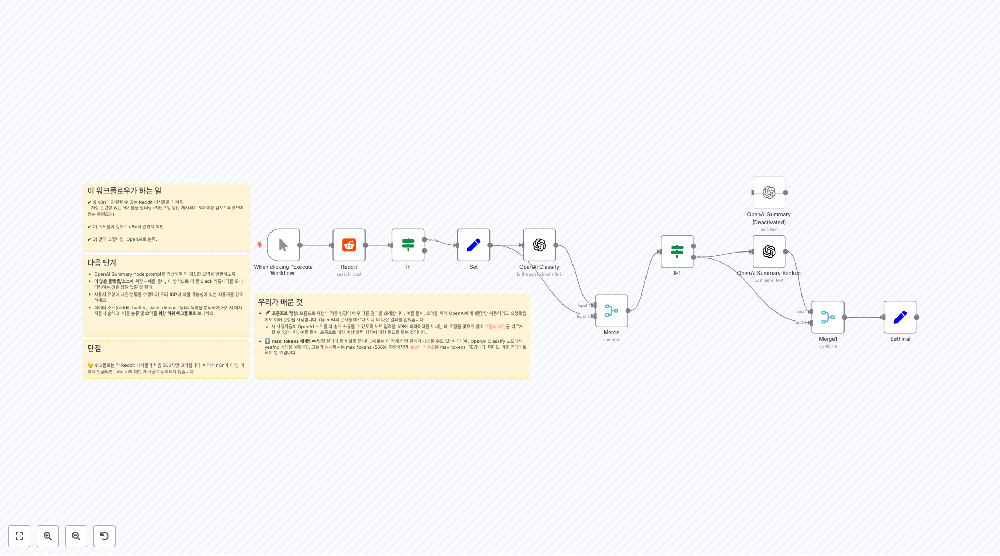](https://raw.githubusercontent.com/n8nKOR/n8n-shared-workflow/refs/heads/main/workflows/n8nworkflows/ai/1895.json)
**워크플로우 1895**
이 워크플로우가 하는 일 1) n8n과 관련될 수 있는 Reddit 게시물을 가져옴 - 가장 관련성 있는 게시물을 필터링 (지난 7일 동안 게시되고 5회 이상 업보트되었으며 원본 콘텐츠임) 2) 게시물이 실제로 n8n에 관한지 확인 3) 만약 그렇다면, OpenAI로 분류.

[](https://raw.githubusercontent.com/n8nKOR/n8n-shared-workflow/refs/heads/main/workflows/n8nworkflows/ai/1897.json)
**워크플로우 1897**
Gmail에서 특정 PDF 첨부파일을 OpenAI를 사용하여 Google Drive로 보내기 _**면책 조항**: 이 워크플로우를 사용할 때 결과가 다양하게 나타날 수 있으므로 OpenAI의 결과를 올바르게 확인할 준비를 하세요._ 이 워크플로우는 PDF 텍스트 내용을 읽어 OpenAI로 전송합니다. 관심 있는 첨부파일은 지정된 Google Drive 폴더...

[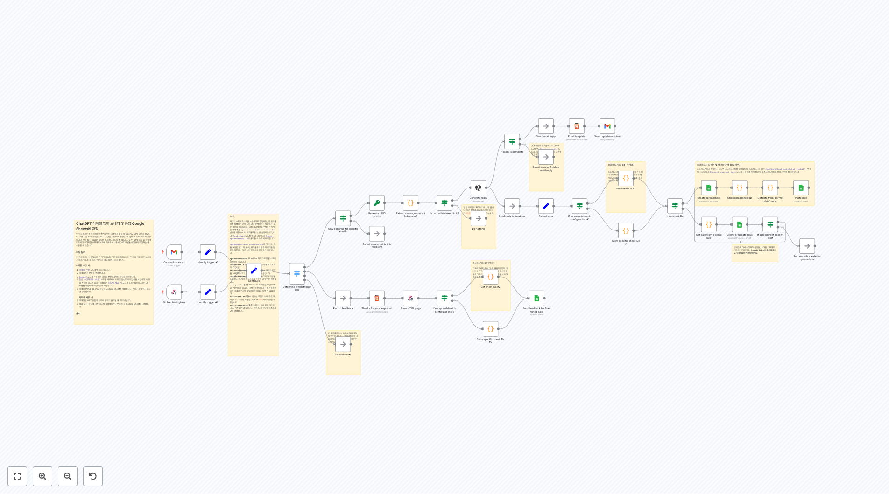](https://raw.githubusercontent.com/n8nKOR/n8n-shared-workflow/refs/heads/main/workflows/n8nworkflows/ai/1898.json)
**워크플로우 1898**
구성 자신의 스프레드시트를 사용하기로 결정하면, 이 워크플로를 실행하기 전에 모든 열이 존재하는지 확인하는 것은 당신의 책임입니다. 이를 효과적으로 수행하는 방법은 **비어 있는** `spreadsheetid`와 `worksheetId` 변수를 사용하여 이 워크플로를 한 번 실행하는 것입니다( `Configure` 노드를 참조). 그런 다음 `Store s...

[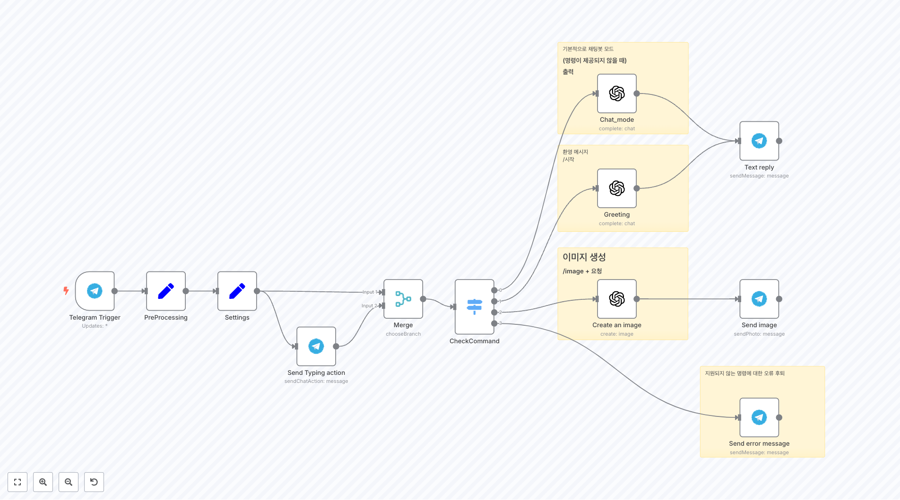](https://raw.githubusercontent.com/n8nKOR/n8n-shared-workflow/refs/heads/main/workflows/n8nworkflows/ai/1934.json)
**워크플로우 1934**
지원되지 않는 명령에 대한 오류 후퇴

[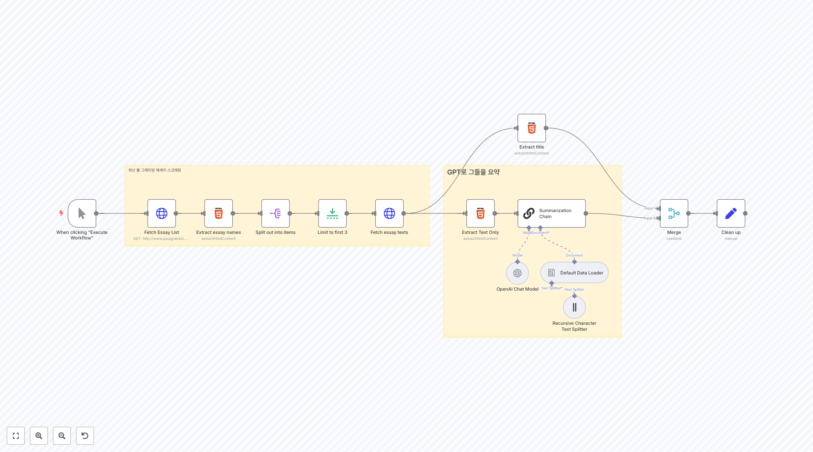](https://raw.githubusercontent.com/n8nKOR/n8n-shared-workflow/refs/heads/main/workflows/n8nworkflows/ai/1951.json)
**워크플로우 1951**
최신 폴 그레이엄 에세이 스크래핑

[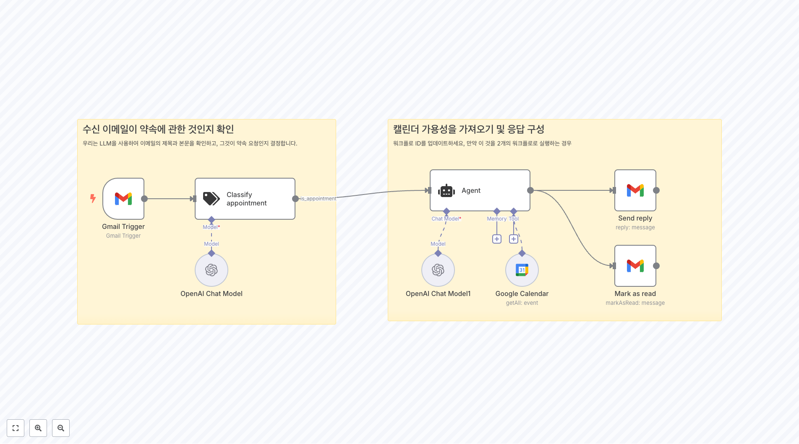](https://raw.githubusercontent.com/n8nKOR/n8n-shared-workflow/refs/heads/main/workflows/n8nworkflows/ai/1953.json)
**워크플로우 1953**
수신 이메일이 약속에 관한 것인지 확인 우리는 LLM을 사용하여 이메일의 제목과 본문을 확인하고, 그것이 약속 요청인지 결정합니다.

[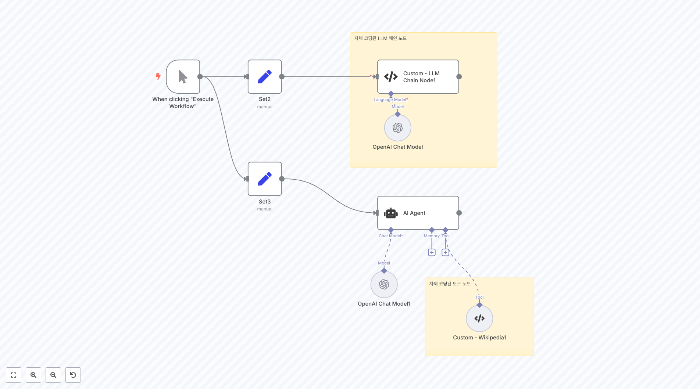](https://raw.githubusercontent.com/n8nKOR/n8n-shared-workflow/refs/heads/main/workflows/n8nworkflows/ai/1955.json)
**워크플로우 1955**
자체 코딩된 LLM 체인 노드

[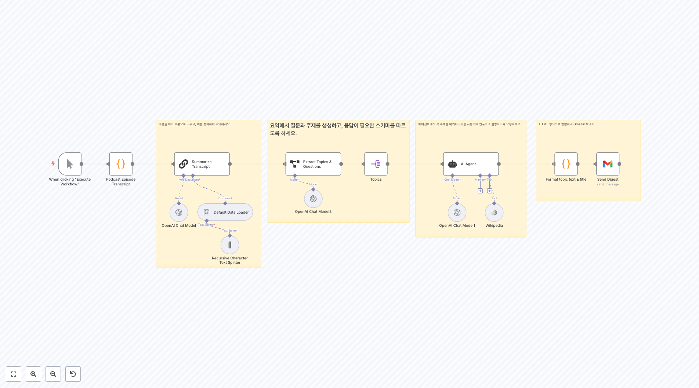](https://raw.githubusercontent.com/n8nKOR/n8n-shared-workflow/refs/heads/main/workflows/n8nworkflows/ai/1956.json)
**워크플로우 1956**
대본을 여러 부분으로 나누고, 이를 정제하여 요약하세요

[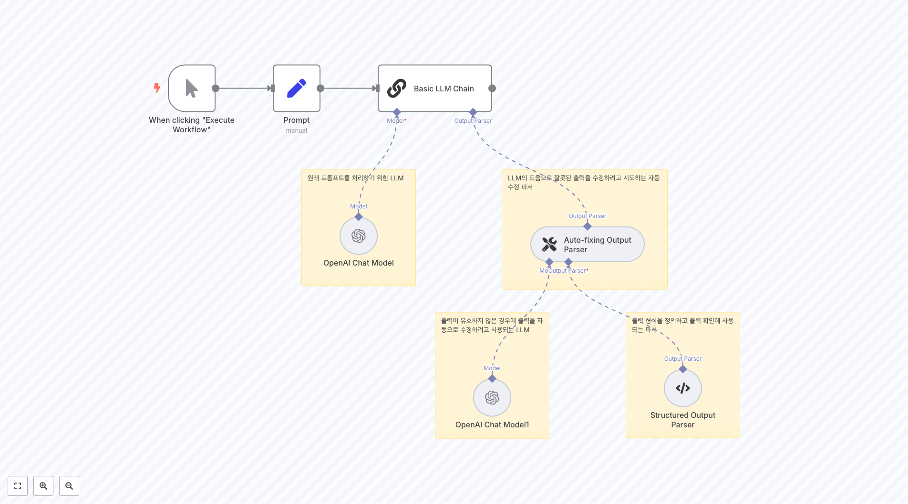](https://raw.githubusercontent.com/n8nKOR/n8n-shared-workflow/refs/heads/main/workflows/n8nworkflows/ai/1957.json)
**워크플로우 1957**
출력 형식을 정의하고 출력 확인에 사용되는 파서

[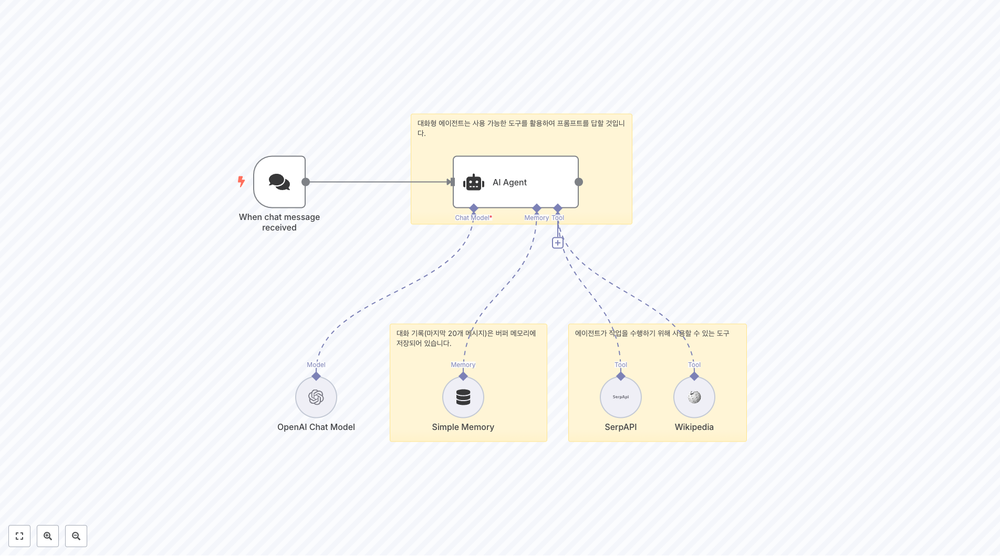](https://raw.githubusercontent.com/n8nKOR/n8n-shared-workflow/refs/heads/main/workflows/n8nworkflows/ai/1959.json)
**워크플로우 1959**
대화 기록(마지막 20개 메시지)은 버퍼 메모리에 저장되어 있습니다.

## 📋 워크플로우 목록 (11-20)

[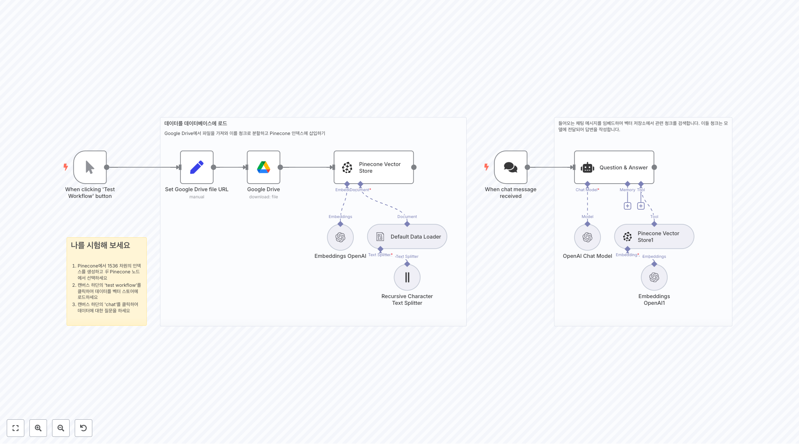](https://raw.githubusercontent.com/n8nKOR/n8n-shared-workflow/refs/heads/main/workflows/n8nworkflows/ai/1960.json)
**워크플로우 1960**
데이터를 데이터베이스에 로드 Google Drive에서 파일을 가져와 이를 청크로 분할하고 Pinecone 인덱스에 삽입하기

[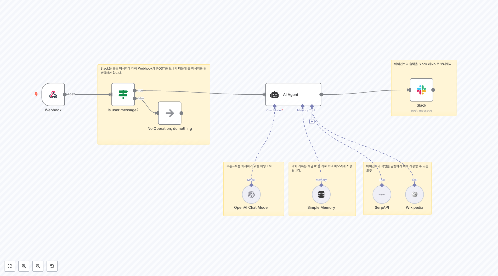](https://raw.githubusercontent.com/n8nKOR/n8n-shared-workflow/refs/heads/main/workflows/n8nworkflows/ai/1961.json)
**워크플로우 1961**
Slack은 모든 메시지에 대해 Webhook에 POST를 보내기 때문에 봇 메시지를 필터링해야 합니다.

[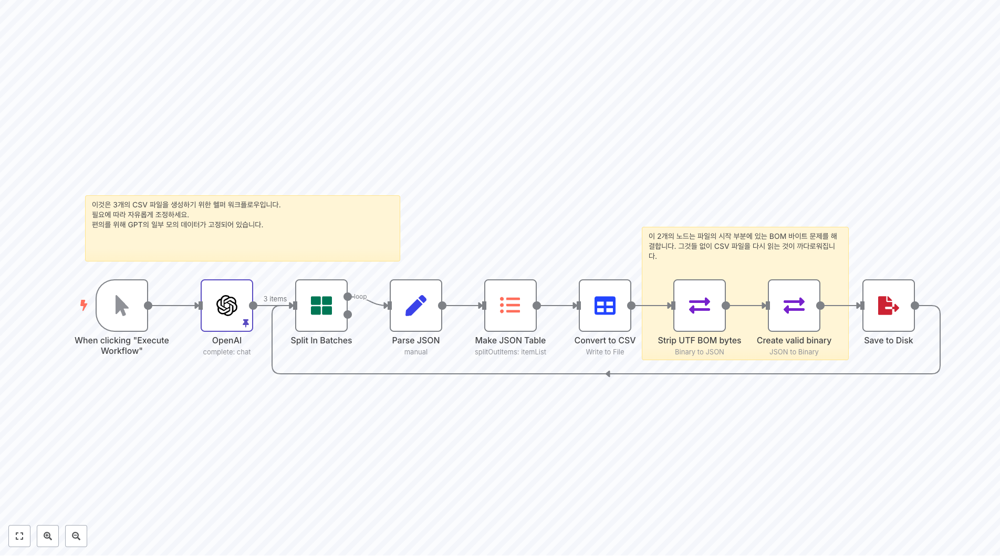](https://raw.githubusercontent.com/n8nKOR/n8n-shared-workflow/refs/heads/main/workflows/n8nworkflows/ai/1967.json)
**워크플로우 1967**
이것은 3개의 CSV 파일을 생성하기 위한 헬퍼 워크플로우입니다. 필요에 따라 자유롭게 조정하세요. 편의를 위해 GPT의 일부 모의 데이터가 고정되어 있습니다.

[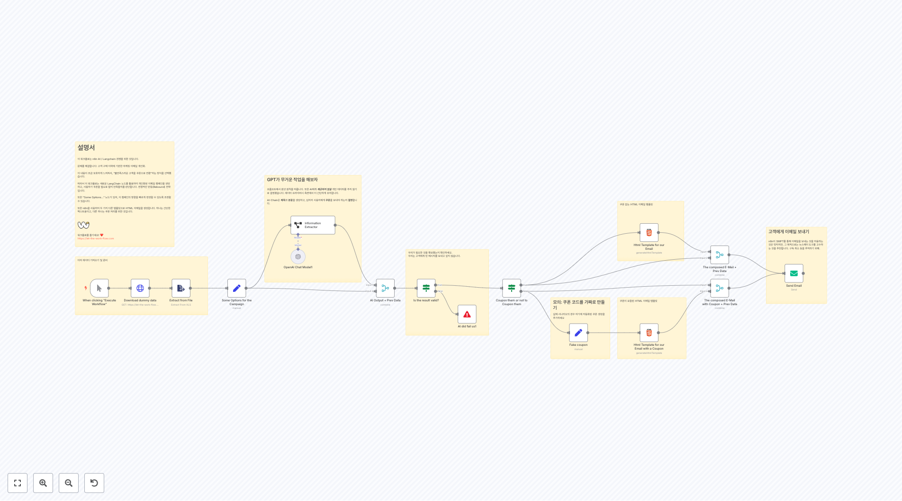](https://raw.githubusercontent.com/n8nKOR/n8n-shared-workflow/refs/heads/main/workflows/n8nworkflows/ai/1978.json)
**워크플로우 1978**
더미 데이터 가져오기 및 준비

[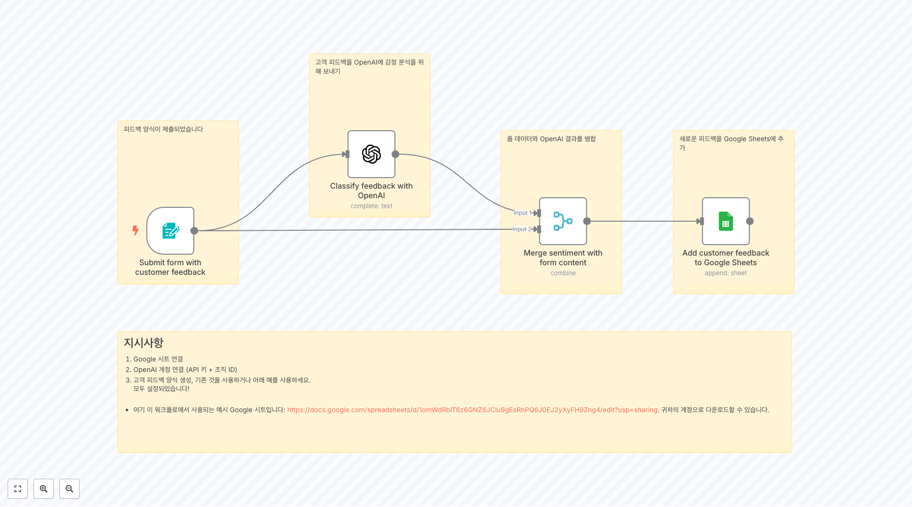](https://raw.githubusercontent.com/n8nKOR/n8n-shared-workflow/refs/heads/main/workflows/n8nworkflows/ai/1996.json)
**워크플로우 1996**
고객 피드백을 OpenAI에 감정 분석을 위해 보내기

[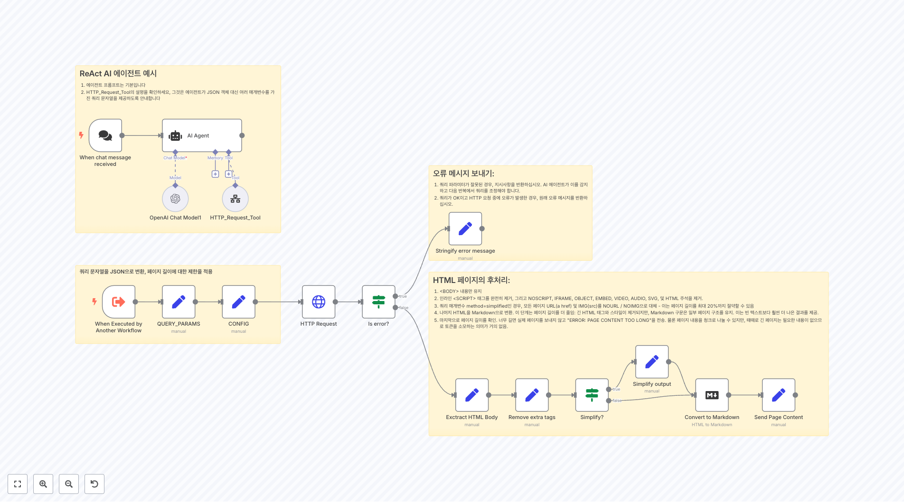](https://raw.githubusercontent.com/n8nKOR/n8n-shared-workflow/refs/heads/main/workflows/n8nworkflows/ai/2006.json)
**워크플로우 2006**
쿼리 문자열을 JSON으로 변환, 페이지 길이에 대한 제한을 적용

[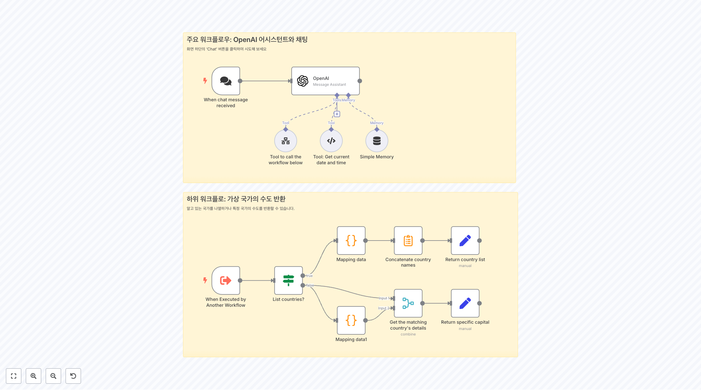](https://raw.githubusercontent.com/n8nKOR/n8n-shared-workflow/refs/heads/main/workflows/n8nworkflows/ai/2025.json)
**워크플로우 2025**
하위 워크플로: 가상 국가의 수도 반환 알고 있는 국가를 나열하거나 특정 국가의 수도를 반환할 수 있습니다.

[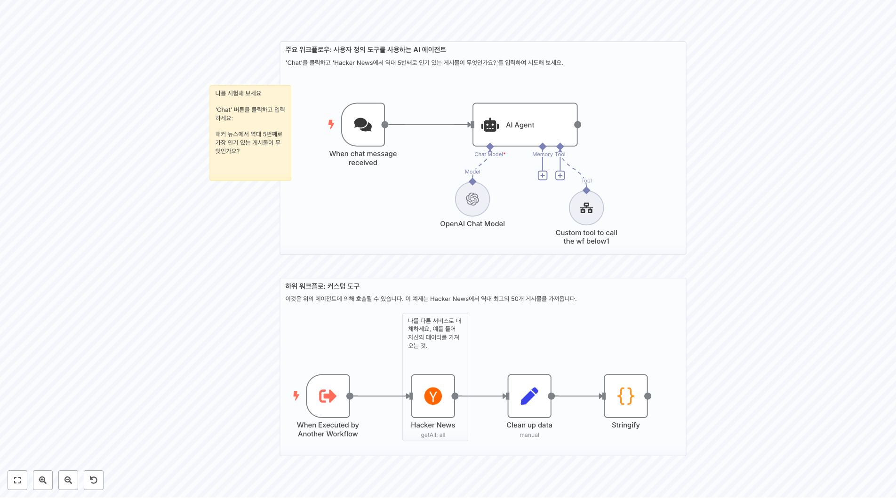](https://raw.githubusercontent.com/n8nKOR/n8n-shared-workflow/refs/heads/main/workflows/n8nworkflows/ai/2026.json)
**워크플로우 2026**
나를 다른 서비스로 대체하세요, 예를 들어 자신의 데이터를 가져오는 것.

[](https://raw.githubusercontent.com/n8nKOR/n8n-shared-workflow/refs/heads/main/workflows/n8nworkflows/ai/2035.json)
**워크플로우 2035**
Dall-E 3으로 이미지를 생성하고 Telegram으로 보내세요

[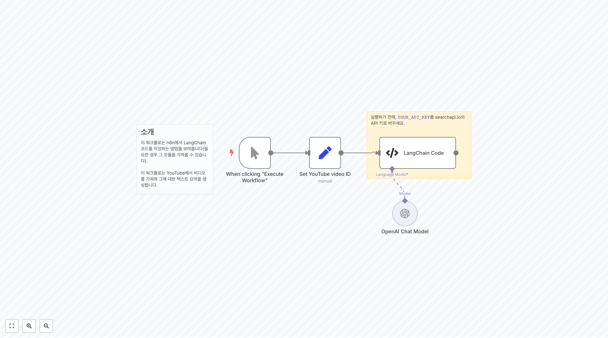](https://raw.githubusercontent.com/n8nKOR/n8n-shared-workflow/refs/heads/main/workflows/n8nworkflows/ai/2082.json)
**워크플로우 2082**
실행하기 전에, `YOUR_API_KEY`를 searchapi.io의 API 키로 바꾸세요.

## 📋 워크플로우 목록 (21-30)

[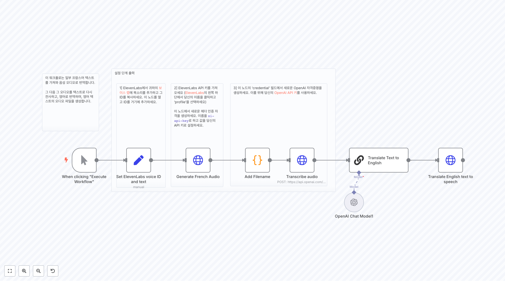](https://raw.githubusercontent.com/n8nKOR/n8n-shared-workflow/refs/heads/main/workflows/n8nworkflows/ai/2083.json)
**워크플로우 2083**
1] ElevenLabs에서 귀하의 [보이스 랩](https://elevenlabs.io/voice-lab)에 목소리를 추가하고 그 ID를 복사하세요. 이 노드를 열고 ID를 거기에 추가하세요.

[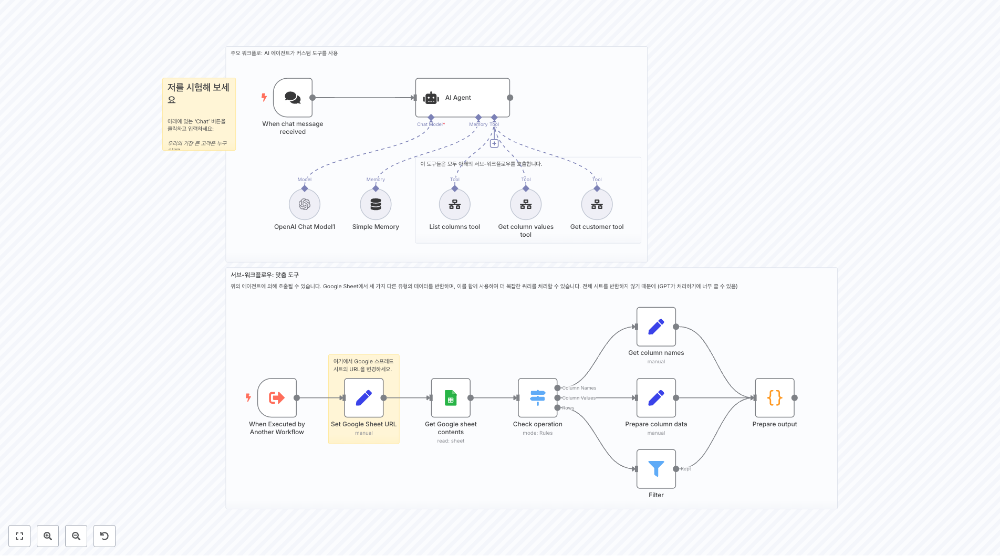](https://raw.githubusercontent.com/n8nKOR/n8n-shared-workflow/refs/heads/main/workflows/n8nworkflows/ai/2085.json)
**워크플로우 2085**
서브-워크플로우: 맞춤 도구 위의 에이전트에 의해 호출될 수 있습니다. Google Sheet에서 세 가지 다른 유형의 데이터를 반환하며, 이를 함께 사용하여 더 복잡한 쿼리를 처리할 수 있습니다. 전체 시트를 반환하지 않기 때문에 (GPT가 처리하기에 너무 클 수 있음)

[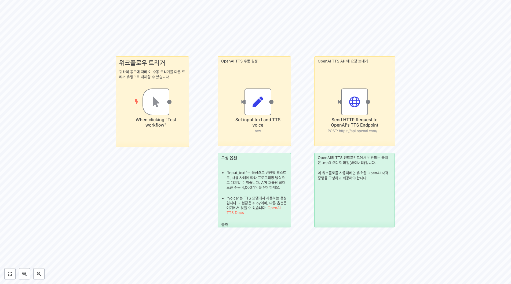](https://raw.githubusercontent.com/n8nKOR/n8n-shared-workflow/refs/heads/main/workflows/n8nworkflows/ai/2092.json)
**워크플로우 2092**
워크플로우 트리거 귀하의 용도에 따라 이 수동 트리거를 다른 트리거 유형으로 대체할 수 있습니다.

[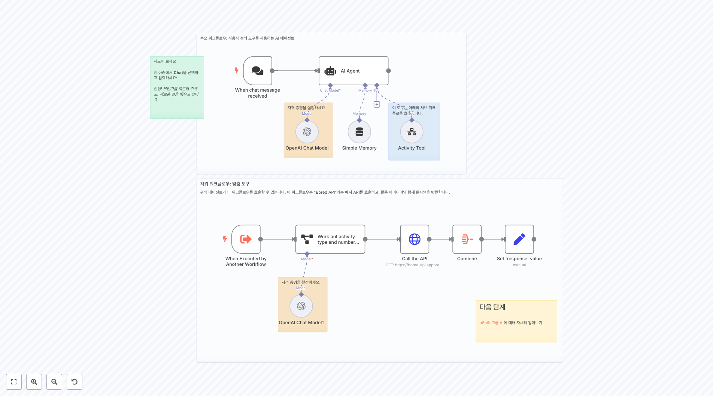](https://raw.githubusercontent.com/n8nKOR/n8n-shared-workflow/refs/heads/main/workflows/n8nworkflows/ai/2094.json)
**워크플로우 2094**
하위 워크플로우: 맞춤 도구 위의 에이전트가 이 워크플로우를 호출할 수 있습니다. 이 워크플로우는 "Bored API"라는 예시 API를 호출하고, 활동 아이디어와 함께 문자열을 반환합니다.

[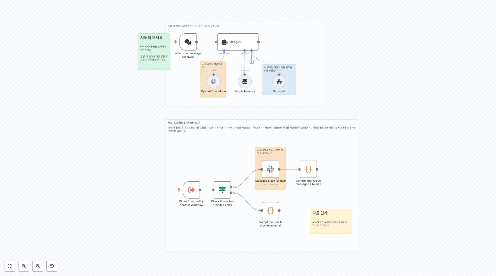](https://raw.githubusercontent.com/n8nKOR/n8n-shared-workflow/refs/heads/main/workflows/n8nworkflows/ai/2095.json)
**워크플로우 2095**
서브-워크플로우: 커스텀 도구 위의 에이전트가 이 워크플로우를 호출할 수 있습니다. 사용자가 이메일 주소를 제공했는지 확인합니다. 제공하지 않았으면 하나를 제공하도록 유도합니다. 제공했다면 고객 지원 채널에 도움을 요청하는 메시지를 보냅니다.

[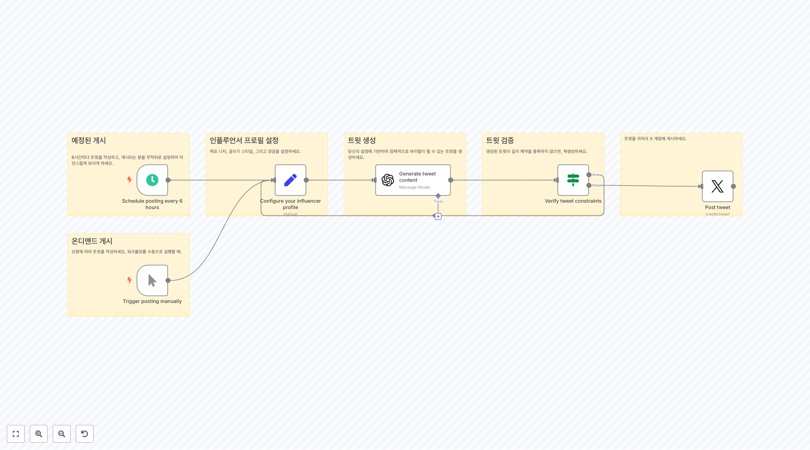](https://raw.githubusercontent.com/n8nKOR/n8n-shared-workflow/refs/heads/main/workflows/n8nworkflows/ai/2139.json)
**워크플로우 2139**
예정된 게시 6시간마다 트윗을 작성하고, 게시되는 분을 무작위로 설정하여 자연스럽게 보이게 하세요.

[](https://raw.githubusercontent.com/n8nKOR/n8n-shared-workflow/refs/heads/main/workflows/n8nworkflows/ai/2161.json)
**워크플로우 2161**
WooCommerce 사용자 ID 찾기 사용자 ID는 과거 주문을 조회하기 위해 필요합니다.

[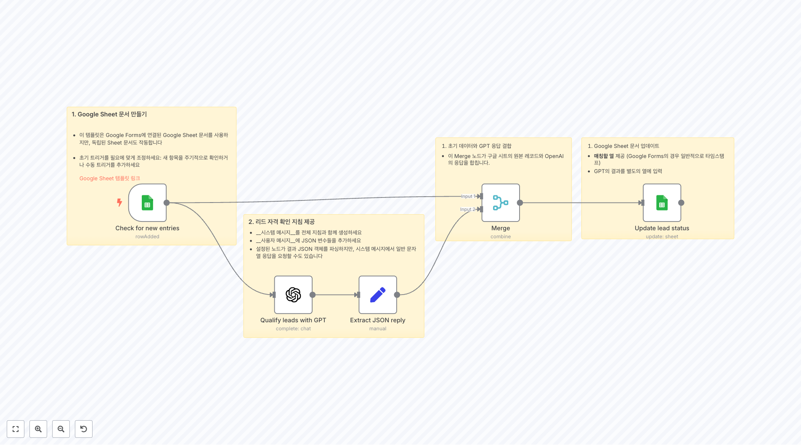](https://raw.githubusercontent.com/n8nKOR/n8n-shared-workflow/refs/heads/main/workflows/n8nworkflows/ai/2163.json)
**워크플로우 2163**
1. Google Sheet 문서 만들기 * 이 템플릿은 Google Forms에 연결된 Google Sheet 문서를 사용하지만, 독립된 Sheet 문서도 작동합니다 * 초기 트리거를 필요에 맞게 조정하세요: 새 항목을 주기적으로 확인하거나 수동 트리거를 추가하세요 [Google Sheet 템플릿 링크](https://docs.google.com/spre...

[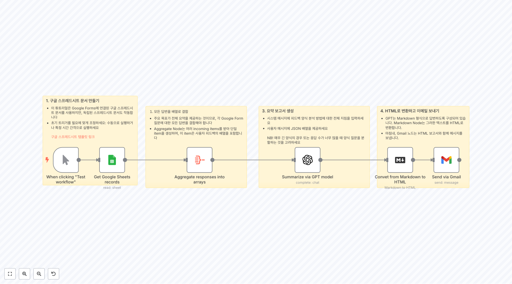](https://raw.githubusercontent.com/n8nKOR/n8n-shared-workflow/refs/heads/main/workflows/n8nworkflows/ai/2164.json)
**워크플로우 2164**
1. 구글 스프레드시트 문서 만들기 * 이 튜토리얼은 Google Forms에 연결된 구글 스프레드시트 문서를 사용하지만, 독립된 스프레드시트 문서도 작동합니다 * 초기 트리거를 필요에 맞게 조정하세요: 수동으로 실행하거나 특정 시간 간격으로 실행하세요 [구글 스프레드시트 템플릿 링크](https://docs.google.com/spreadsheets/d/...

[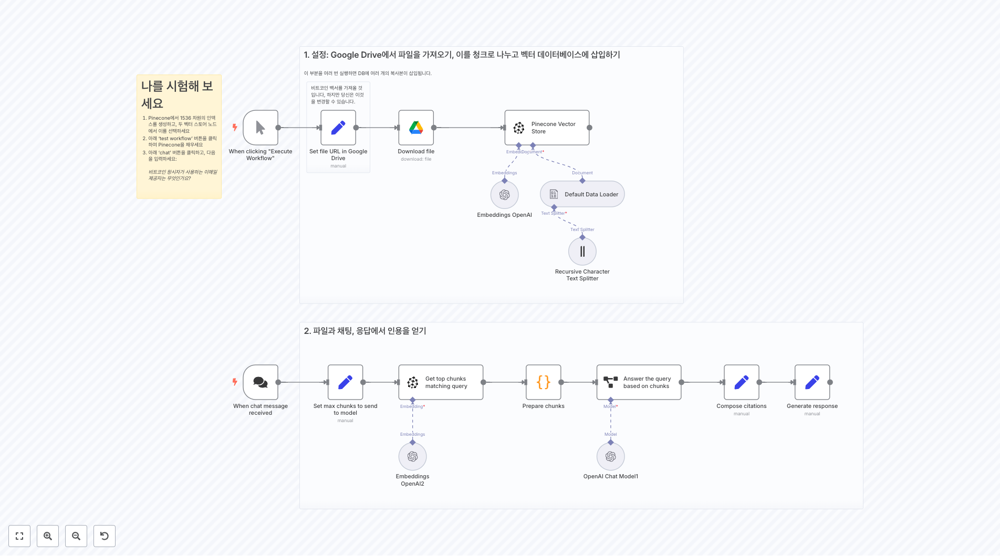](https://raw.githubusercontent.com/n8nKOR/n8n-shared-workflow/refs/heads/main/workflows/n8nworkflows/ai/2165.json)
**워크플로우 2165**
1. 설정: Google Drive에서 파일을 가져오기, 이를 청크로 나누고 벡터 데이터베이스에 삽입하기 이 부분을 여러 번 실행하면 DB에 여러 개의 복사본이 삽입됩니다.

## 📋 워크플로우 목록 (31-40)

[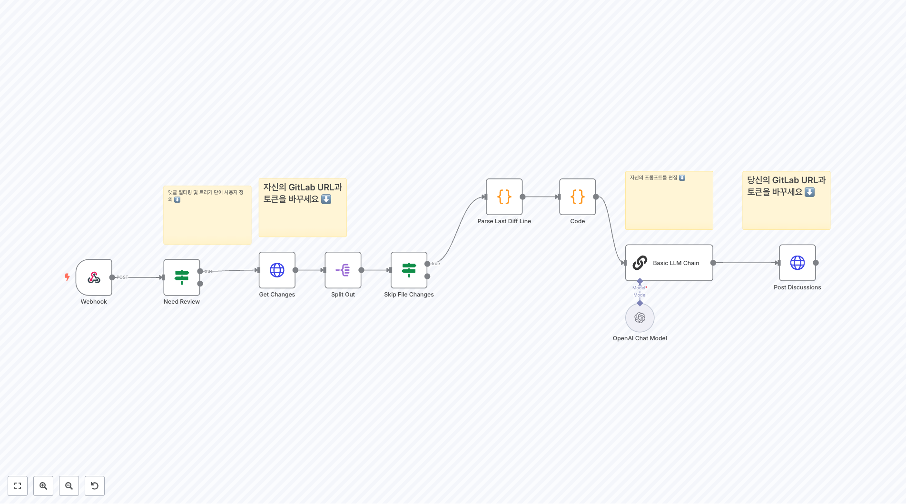](https://raw.githubusercontent.com/n8nKOR/n8n-shared-workflow/refs/heads/main/workflows/n8nworkflows/ai/2167.json)
**워크플로우 2167**
자신의 프롬프트를 편집 ⬇️

[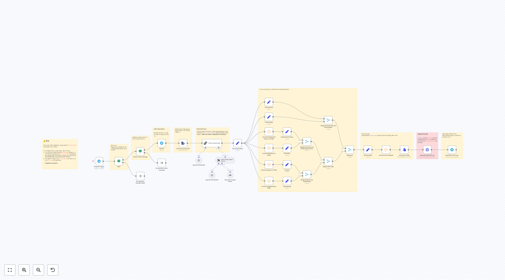](https://raw.githubusercontent.com/n8nKOR/n8n-shared-workflow/refs/heads/main/workflows/n8nworkflows/ai/2170.json)
**워크플로우 2170**
채팅 ID 추가 Telegram에서 자동화를 트리거하기 위해 실제 ID를 설정하는 것을 잊지 마세요.

[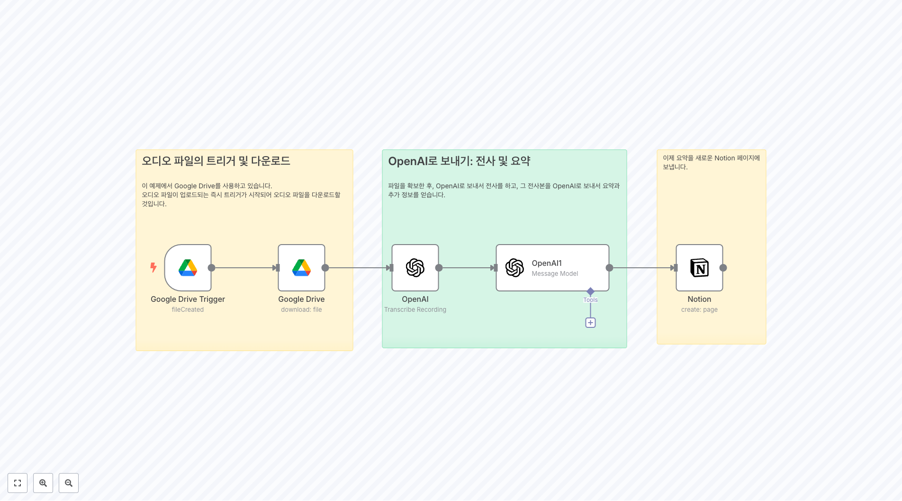](https://raw.githubusercontent.com/n8nKOR/n8n-shared-workflow/refs/heads/main/workflows/n8nworkflows/ai/2178.json)
**워크플로우 2178**
오디오 파일의 트리거 및 다운로드 이 예제에서 Google Drive를 사용하고 있습니다. 오디오 파일이 업로드되는 즉시 트리거가 시작되어 오디오 파일을 다운로드할 것입니다.

[](https://raw.githubusercontent.com/n8nKOR/n8n-shared-workflow/refs/heads/main/workflows/n8nworkflows/ai/2180.json)
**워크플로우 2180**
가장 최근의 뉴스만 선택하세요: 오늘 날짜에서 xy일 전으로

[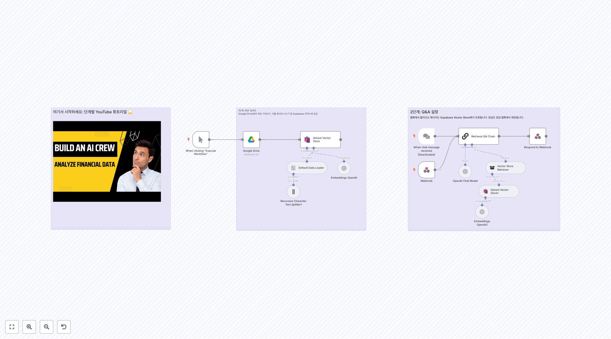](https://raw.githubusercontent.com/n8nKOR/n8n-shared-workflow/refs/heads/main/workflows/n8nworkflows/ai/2183.json)
**워크플로우 2183**
2단계: Q&A 설정 웹훅에서 들어오는 메시지는 Supabase Vector Store에서 조회됩니다. 응답은 응답 웹훅에서 제공됩니다.

[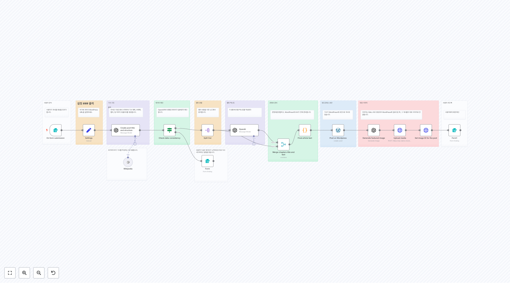](https://raw.githubusercontent.com/n8nKOR/n8n-shared-workflow/refs/heads/main/workflows/n8nworkflows/ai/2187.json)
**워크플로우 2187**
데이터 확인

[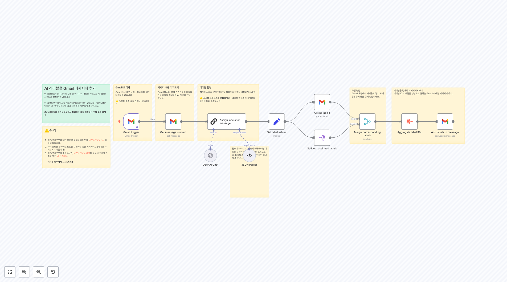](https://raw.githubusercontent.com/n8nKOR/n8n-shared-workflow/refs/heads/main/workflows/n8nworkflows/ai/2197.json)
**워크플로우 2197**
AI 레이블을 Gmail 메시지에 추가 이 워크플로우를 사용하면 Gmail 메시지의 내용을 기반으로 레이블을 자동으로 설정할 수 있습니다. 이 워크플로우에서 사용 가능한 3개의 레이블이 있습니다: "파트너십", "문의" 및 "알림". 필요에 따라 레이블을 자유롭게 조정하세요. **Gmail 계정과 워크플로우에서 레이블 이름을 설정하는 것을 잊지 마세요.**

[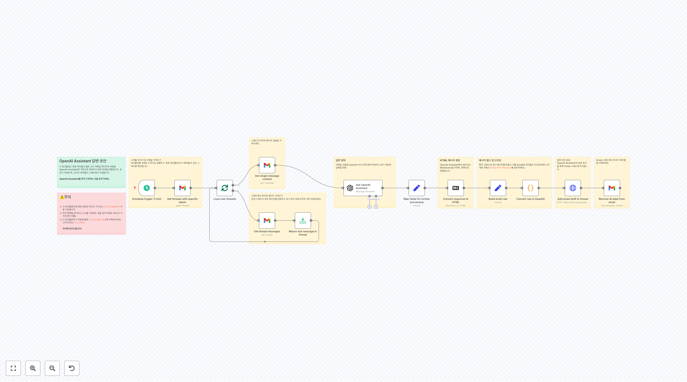](https://raw.githubusercontent.com/n8nKOR/n8n-shared-workflow/refs/heads/main/workflows/n8nworkflows/ai/2198.json)
**워크플로우 2198**
OpenAI Assistant 답변 초안 이 워크플로는 특정 레이블이 붙은 수신 이메일 메시지의 내용을 OpenAI Assistant로 자동으로 전송하고 답변 초안을 반환합니다. 초안이 작성된 후, 트리거 레이블이 스레드에서 삭제됩니다. **OpenAI Assistant를 먼저 구성하는 것을 잊지 마세요.**

[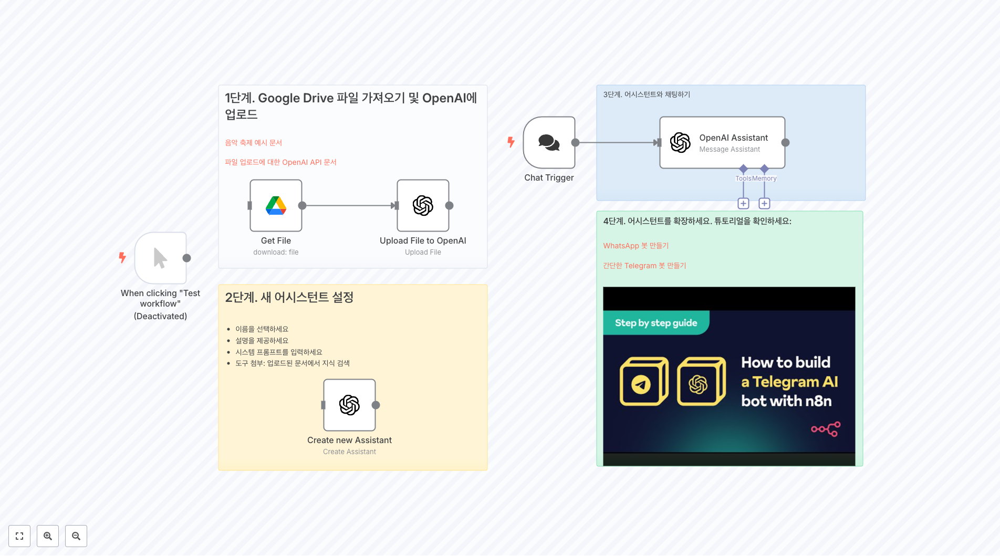](https://raw.githubusercontent.com/n8nKOR/n8n-shared-workflow/refs/heads/main/workflows/n8nworkflows/ai/2201.json)
**워크플로우 2201**
1단계. Google Drive 파일 가져오기 및 OpenAI에 업로드 [음악 축제 예시 문서](https://docs.google.com/document/d/1_miLvjUQJ-E9bWgEBK87nHZre26-4Fz0RpfSfO548H0/edit?usp=sharing) [파일 업로드에 대한 OpenAI API 문서](https://platform.open...

[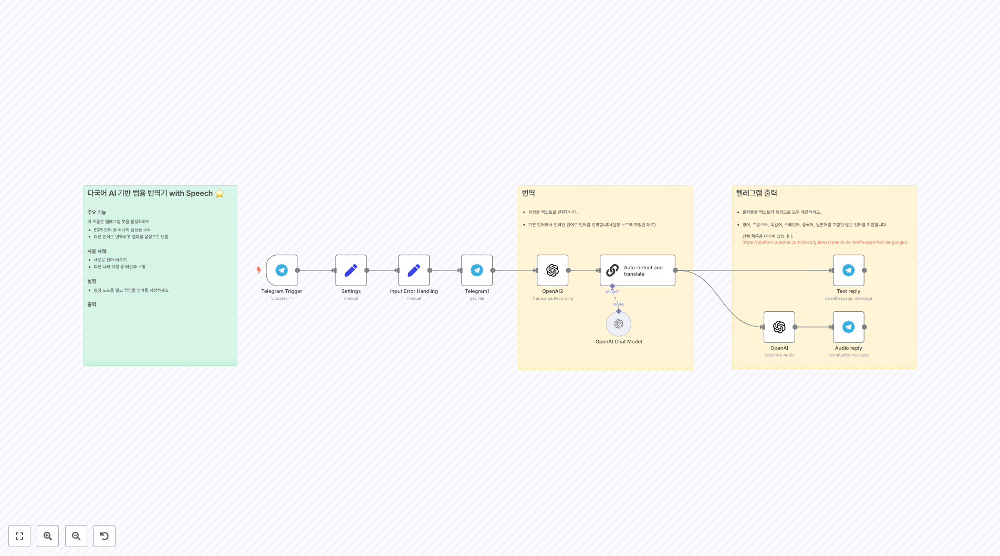](https://raw.githubusercontent.com/n8nKOR/n8n-shared-workflow/refs/heads/main/workflows/n8nworkflows/ai/2206.json)
**워크플로우 2206**
번역 - 음성을 텍스트로 변환합니다. - 기본 언어에서 번역된 언어로 언어를 번역합니다(설정 노드에 지정된 대로).

## 📋 워크플로우 목록 (41-50)

[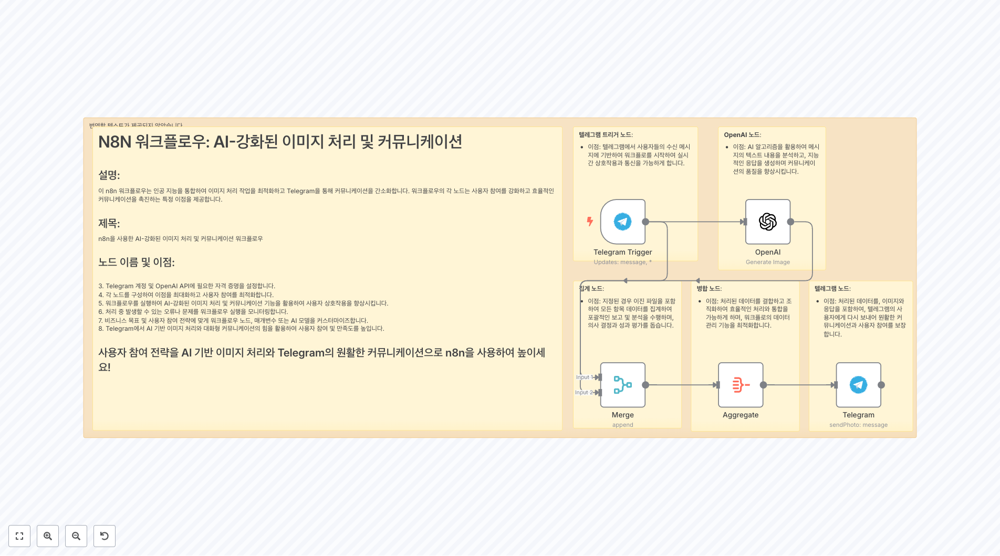](https://raw.githubusercontent.com/n8nKOR/n8n-shared-workflow/refs/heads/main/workflows/n8nworkflows/ai/2216.json)
**워크플로우 2216**
N8N 워크플로우: AI-강화된 이미지 처리 및 커뮤니케이션 설명: 이 n8n 워크플로우는 인공 지능을 통합하여 이미지 처리 작업을 최적화하고 Telegram을 통해 커뮤니케이션을 간소화합니다. 워크플로우의 각 노드는 사용자 참여를 강화하고 효율적인 커뮤니케이션을 촉진하는 특정 이점을 제공합니다. 제목: n8n을 사용한 AI-강화된 이미지 처리 및 커뮤니케...

[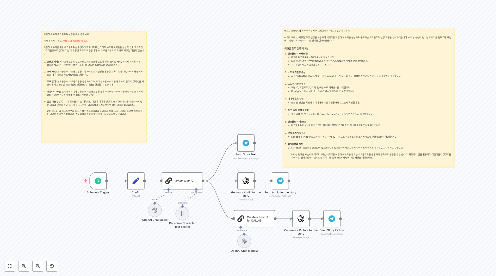](https://raw.githubusercontent.com/n8nKOR/n8n-shared-workflow/refs/heads/main/workflows/n8nworkflows/ai/2233.json)
**워크플로우 2233**
텔레그램에서 "AI 기반 어린이 영어 스토리텔링" 워크플로우 설정하기 이 가이드에서, 제공된 구성 설정을 사용하여 매력적인 어린이 이야기를 생성하고 공유하는 워크플로우 설정 과정을 안내하겠습니다. 이러한 상상력 넘치는 이야기를 텔레그램 채널에서 생생하게 구현하기 위한 단계를 살펴보겠습니다. 워크플로우 설정 단계: 1. **워크플로우 가져오기:** - 제공된...

[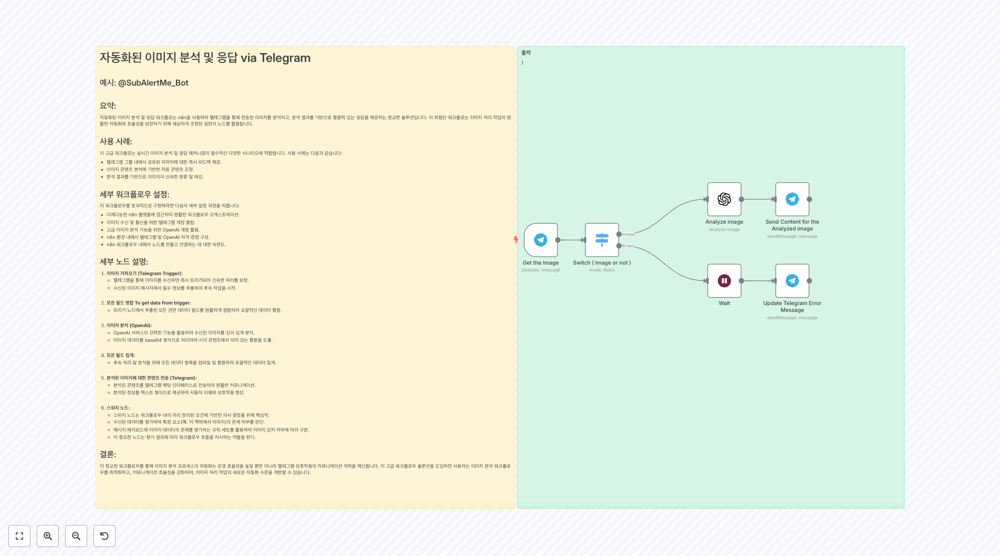](https://raw.githubusercontent.com/n8nKOR/n8n-shared-workflow/refs/heads/main/workflows/n8nworkflows/ai/2235.json)
**워크플로우 2235**
자동화된 이미지 분석 및 응답 via Telegram 예시: @SubAlertMe_Bot 요약: 자동화된 이미지 분석 및 응답 워크플로는 n8n을 사용하여 텔레그램을 통해 전송된 이미지를 분석하고, 분석 결과를 기반으로 통찰력 있는 응답을 제공하는 정교한 솔루션입니다. 이 최첨단 워크플로는 이미지 처리 작업의 원활한 자동화와 효율성을 보장하기 위해 세심하게...

[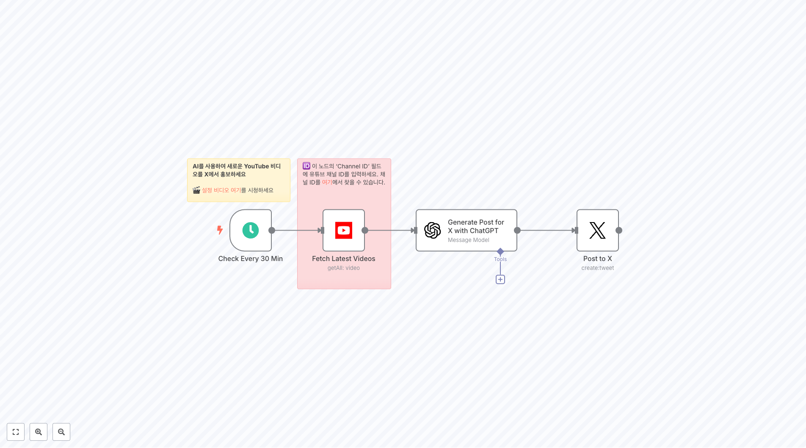](https://raw.githubusercontent.com/n8nKOR/n8n-shared-workflow/refs/heads/main/workflows/n8nworkflows/ai/2242.json)
**워크플로우 2242**
🆔 이 노드의 'Channel ID' 필드에 유튜브 채널 ID를 입력하세요. 채널 ID를 [여기](https://youtube.com/account_advanced)에서 찾을 수 있습니다.

[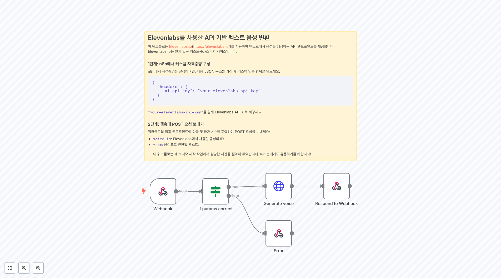](https://raw.githubusercontent.com/n8nKOR/n8n-shared-workflow/refs/heads/main/workflows/n8nworkflows/ai/2245.json)
**워크플로우 2245**
Elevenlabs를 사용한 API 기반 텍스트 음성 변환 이 워크플로는 Elevenlabs.io(https://elevenlabs.io/)를 사용하여 텍스트에서 음성을 생성하는 API 엔드포인트를 제공합니다. Elevenlabs.io는 인기 있는 텍스트-to-스피치 서비스입니다. 1단계: n8n에서 커스텀 자격증명 구성 n8n에서 자격증명을 설정하려면, ...

[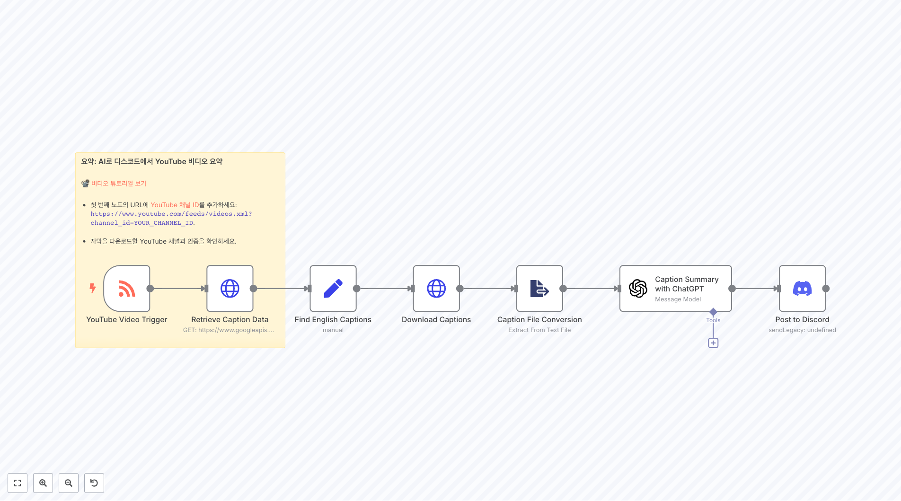](https://raw.githubusercontent.com/n8nKOR/n8n-shared-workflow/refs/heads/main/workflows/n8nworkflows/ai/2249.json)
**워크플로우 2249**
요약: AI로 디스코드에서 YouTube 비디오 요약 📽️ [비디오 튜토리얼 보기](https://mrc.fm/ai2d) * 첫 번째 노드의 URL에 [YouTube 채널 ID](https://www.youtube.com/account_advanced)를 추가하세요: `https://www.youtube.com/feeds/videos.xml?channel_...

[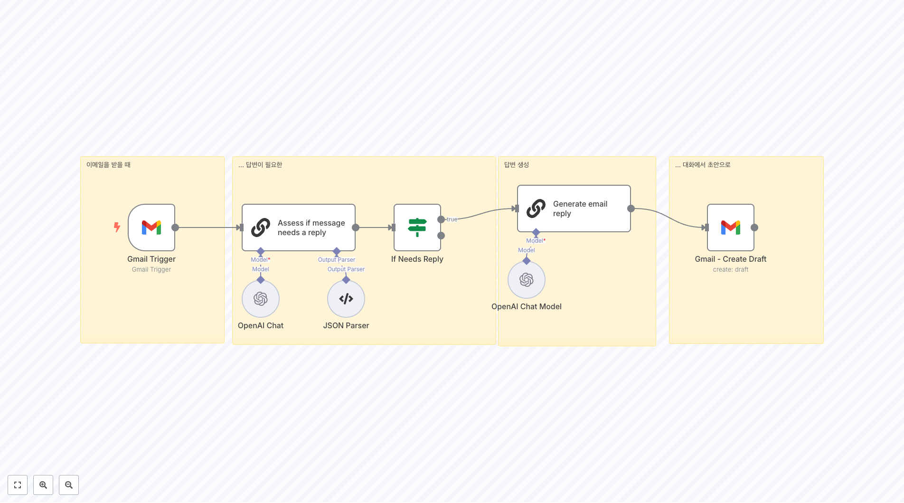](https://raw.githubusercontent.com/n8nKOR/n8n-shared-workflow/refs/heads/main/workflows/n8nworkflows/ai/2271.json)
**워크플로우 2271**
이메일을 받을 때

[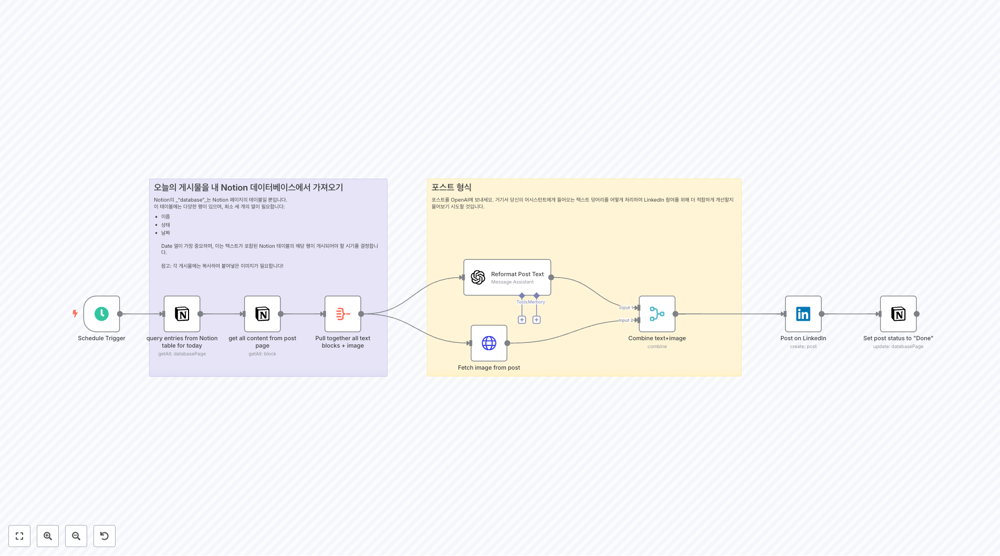](https://raw.githubusercontent.com/n8nKOR/n8n-shared-workflow/refs/heads/main/workflows/n8nworkflows/ai/2288.json)
**워크플로우 2288**
오늘의 게시물을 내 Notion 데이터베이스에서 가져오기 Notion의 _"database"_는 Notion 페이지의 테이블일 뿐입니다. 이 테이블에는 다양한 행이 있으며, 최소 세 개의 열이 필요합니다: - 이름 - 상태 - 날짜 Date 열이 가장 중요하며, 이는 텍스트가 포함된 Notion 테이블의 해당 행이 게시되어야 할 시기를 결정합니다. 참고: ...

[](https://raw.githubusercontent.com/n8nKOR/n8n-shared-workflow/refs/heads/main/workflows/n8nworkflows/ai/2290.json)
**워크플로우 2290**
Notion의 페이지를 Supabase에 벡터 문서로 저장하기 **이 워크플로는 Supabase 프로젝트에 벡터 열이 있는 테이블이 있다고 가정합니다. 아직 없는 경우, 여기를 따라 하세요:** [Supabase Vector Columns Guide](https://supabase.com/docs/guides/ai/vector-columns) 워크플로 설명...

[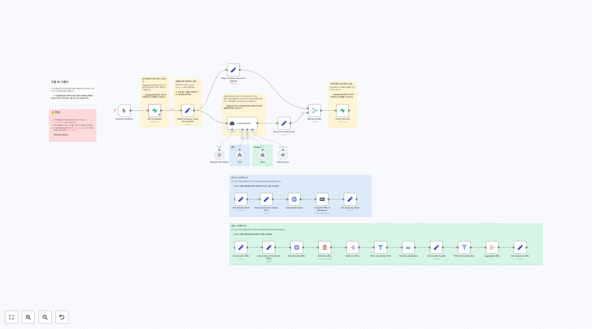](https://raw.githubusercontent.com/n8nKOR/n8n-shared-workflow/refs/heads/main/workflows/n8nworkflows/ai/2315.json)
**워크플로우 2315**
출력

## 📋 워크플로우 목록 (51-60)

[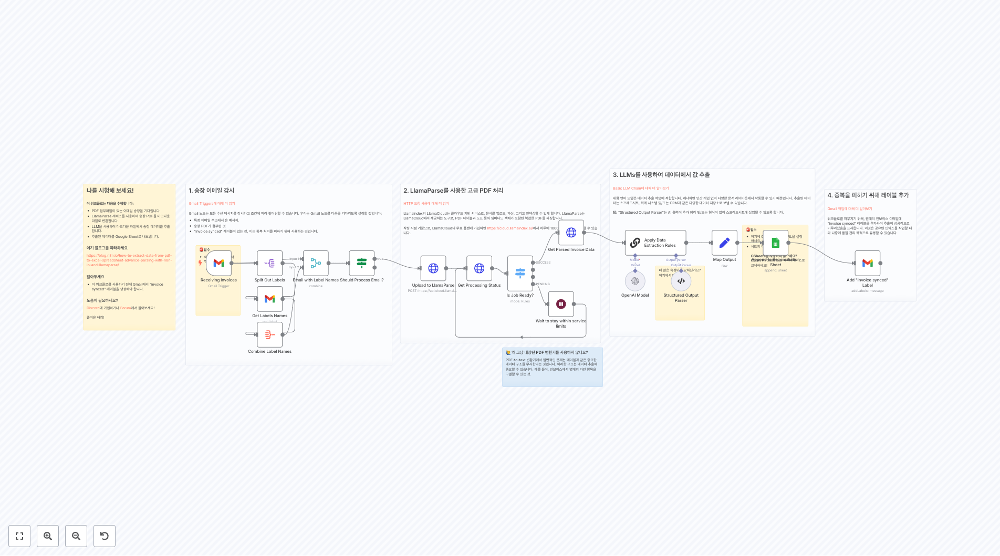](https://raw.githubusercontent.com/n8nKOR/n8n-shared-workflow/refs/heads/main/workflows/n8nworkflows/ai/2320.json)
**워크플로우 2320**
2. LlamaParse를 사용한 고급 PDF 처리 [HTTP 요청 사용에 대해 더 읽기](https://docs.n8n.io/integrations/builtin/core-nodes/n8n-nodes-base.httprequest/) LlamaIndex의 LlamaCloud는 클라우드 기반 서비스로, 문서를 업로드, 파싱, 그리고 인덱싱할 수 있게 합니다...

[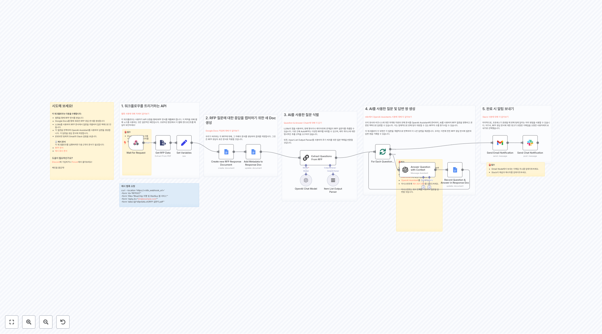](https://raw.githubusercontent.com/n8nKOR/n8n-shared-workflow/refs/heads/main/workflows/n8nworkflows/ai/2321.json)
**워크플로우 2321**
1. 워크플로우를 트리거하는 API [웹훅 사용에 대해 자세히 알아보기](https://docs.n8n.io/integrations/builtin/core-nodes/n8n-nodes-base.webhook/) 이 워크플로우는 사용자가 API 요청을 통해 RFP 문서를 제출해야 합니다. 이 목적을 위해 웹훅 노드를 사용하는 것은 일반적인 패턴입니다. 프로덕...

[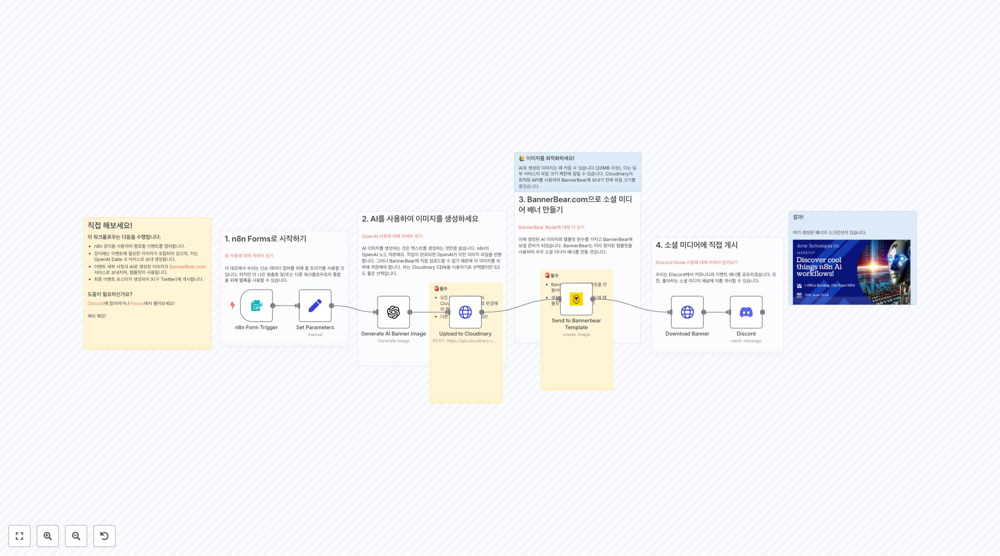](https://raw.githubusercontent.com/n8nKOR/n8n-shared-workflow/refs/heads/main/workflows/n8nworkflows/ai/2322.json)
**워크플로우 2322**
1. n8n Forms로 시작하기 [폼 사용에 대해 자세히 읽기](https://docs.n8n.io/integrations/builtin/core-nodes/n8n-nodes-base.formtrigger/) 이 데모에서 우리는 단순 데이터 캡처를 위해 폼 트리거를 사용할 것입니다. 하지만 더 나은 맞춤화 및/또는 다른 워크플로우로의 통합을 위해 웹훅을 ...

[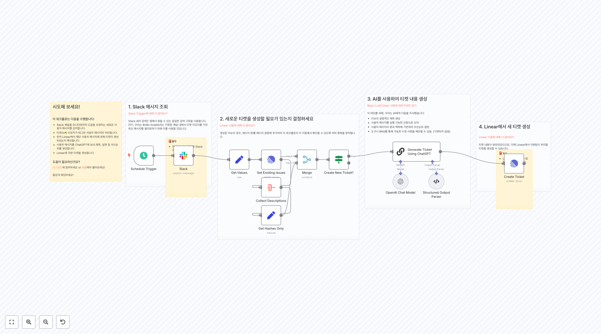](https://raw.githubusercontent.com/n8nKOR/n8n-shared-workflow/refs/heads/main/workflows/n8nworkflows/ai/2323.json)
**워크플로우 2323**
1. Slack 메시지 조회 [Slack Trigger에 대해 더 알아보기](https://docs.n8n.io/integrations/builtin/app-nodes/n8n-nodes-base.slack) Slack API 검색은 앱에서 찾을 수 있는 동일한 검색 구문을 사용합니다. 여기, 우리는 n8n-tickets라는 지정된 채널 내에서 티켓 이모지를...

[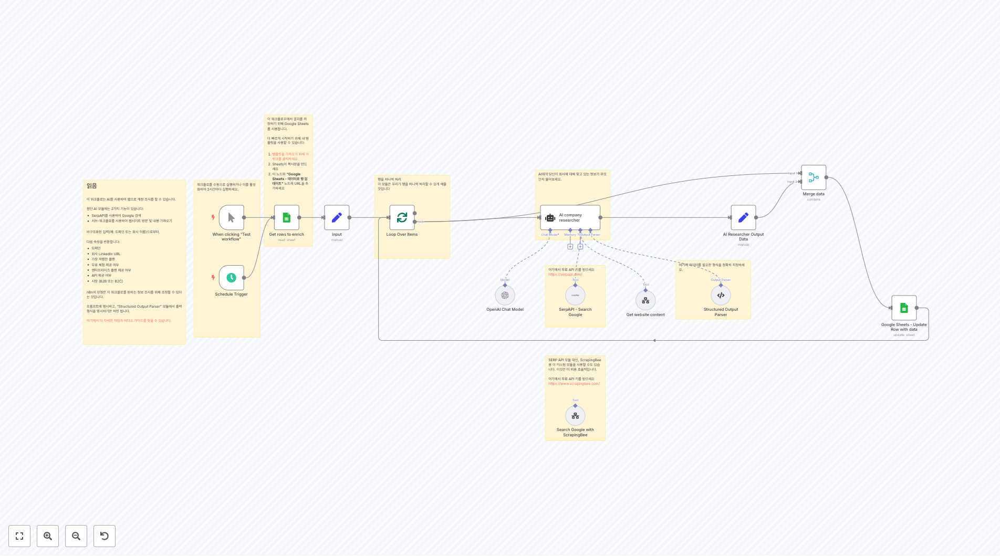](https://raw.githubusercontent.com/n8nKOR/n8n-shared-workflow/refs/heads/main/workflows/n8nworkflows/ai/2324.json)
**워크플로우 2324**
읽음 이 워크플로는 AI를 사용하여 웹으로 계정 조사를 할 수 있습니다. 첨단 AI 모듈에는 2가지 기능이 있습니다: - SerpAPI를 사용하여 Google 검색 - 서브-워크플로를 사용하여 웹사이트 방문 및 내용 가져오기 비구조화된 입력(예: 도메인 또는 회사 이름)으로부터. 다음 속성을 반환합니다: - 도메인 - 회사 LinkedIn URL - 가장 ...

[](https://raw.githubusercontent.com/n8nKOR/n8n-shared-workflow/refs/heads/main/workflows/n8nworkflows/ai/2328.json)
**워크플로우 2328**
4. 이 도구는 캘린더 이벤트를 생성합니다 이 도구는 이벤트 세부 정보와 참석자 목록이 주어지면, 새로운 Google 캘린더 이벤트를 생성하고 참석자를 추가할 것입니다.

[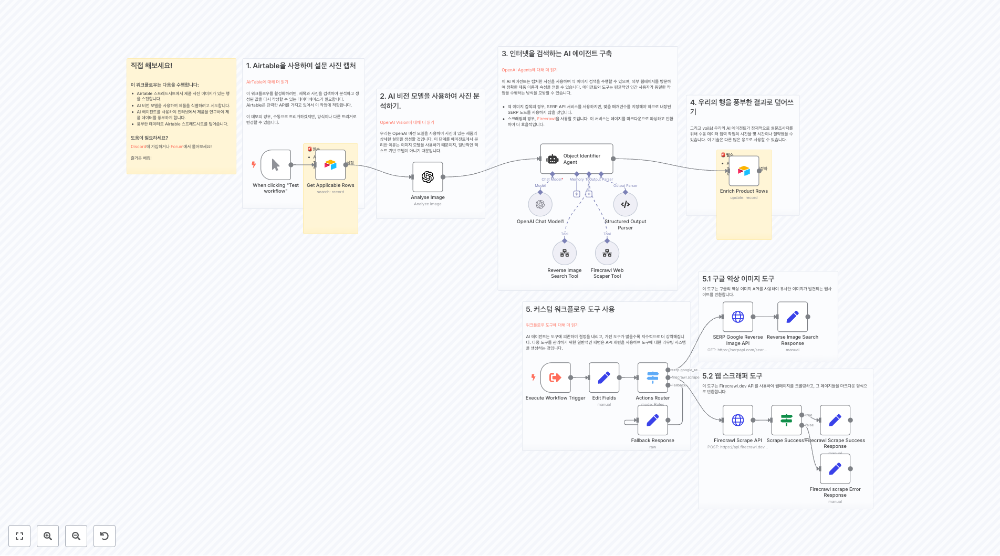](https://raw.githubusercontent.com/n8nKOR/n8n-shared-workflow/refs/heads/main/workflows/n8nworkflows/ai/2330.json)
**워크플로우 2330**
1. Airtable을 사용하여 설문 사진 캡처 [AirTable에 대해 더 읽기](https://docs.n8n.io/integrations/builtin/app-nodes/n8n-nodes-base.airtable) 이 워크플로우를 활성화하려면, 제목과 사진을 검색하여 분석하고 생성된 값을 다시 작성할 수 있는 데이터베이스가 필요합니다. Airtable...

[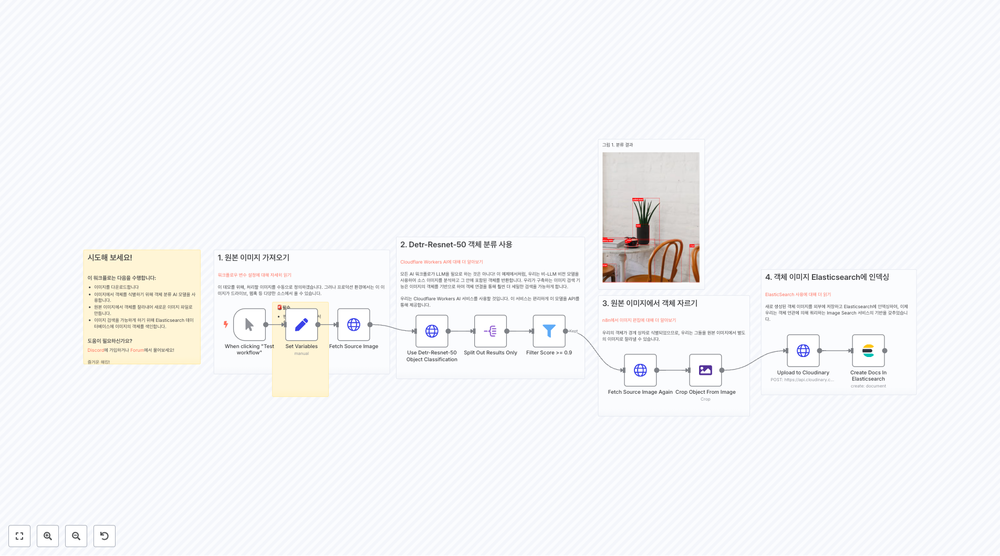](https://raw.githubusercontent.com/n8nKOR/n8n-shared-workflow/refs/heads/main/workflows/n8nworkflows/ai/2331.json)
**워크플로우 2331**
1. 원본 이미지 가져오기 [워크플로우 변수 설정에 대해 자세히 읽기](https://docs.n8n.io/integrations/builtin/core-nodes/n8n-nodes-base.set) 이 데모를 위해, 처리할 이미지를 수동으로 정의하겠습니다. 그러나 프로덕션 환경에서는 이 이미지가 드라이브, 웹훅 등 다양한 소스에서 올 수 있습니다.

[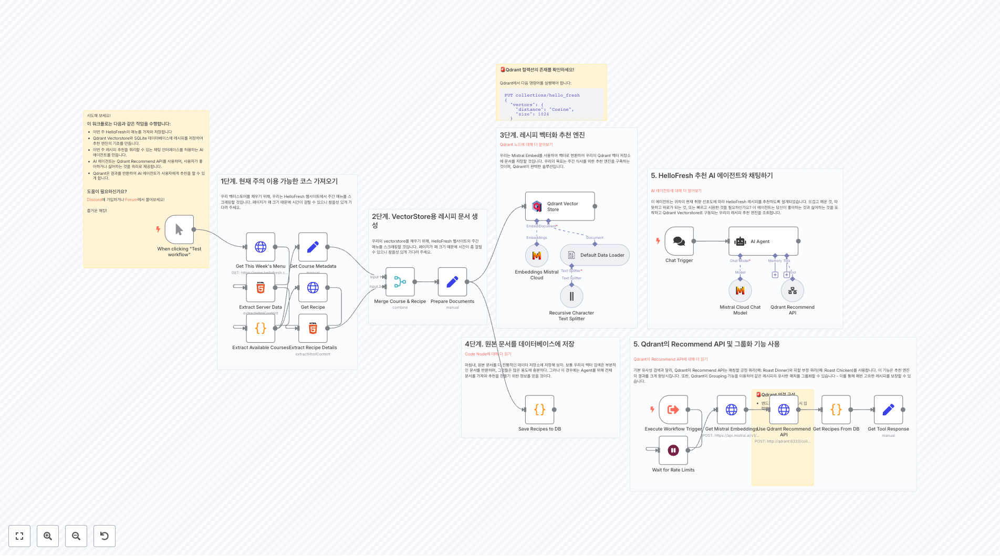](https://raw.githubusercontent.com/n8nKOR/n8n-shared-workflow/refs/heads/main/workflows/n8nworkflows/ai/2333.json)
**워크플로우 2333**
1단계. 현재 주의 이용 가능한 코스 가져오기 우리 벡터스토어를 채우기 위해, 우리는 HelloFresh 웹사이트에서 주간 메뉴를 스크래핑할 것입니다. 페이지가 꽤 크기 때문에 시간이 걸릴 수 있으니 참을성 있게 기다려 주세요.

[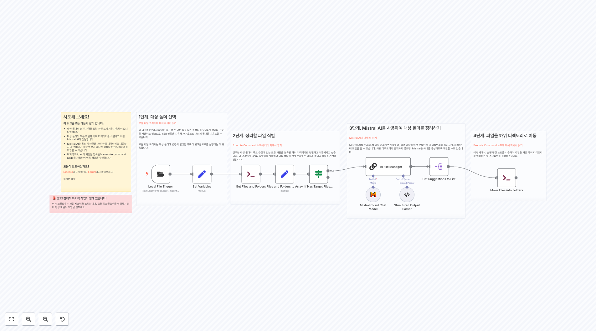](https://raw.githubusercontent.com/n8nKOR/n8n-shared-workflow/refs/heads/main/workflows/n8nworkflows/ai/2334.json)
**워크플로우 2334**
1단계. 대상 폴더 선택 [로컬 파일 트리거에 대해 자세히 읽기](https://docs.n8n.io/integrations/builtin/core-nodes/n8n-nodes-base.localfiletrigger) 이 워크플로우에서 n8n이 접근할 수 있는 특정 디스크 폴더를 모니터링합니다. 도커를 사용하고 있으므로, n8n 볼륨을 사용하거나 호스트 머...

## 📋 워크플로우 목록 (61-70)

[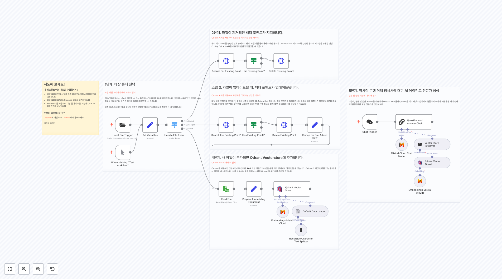](https://raw.githubusercontent.com/n8nKOR/n8n-shared-workflow/refs/heads/main/workflows/n8nworkflows/ai/2335.json)
**워크플로우 2335**
1단계. 대상 폴더 선택 [로컬 파일 트리거에 대해 자세히 읽기](https://docs.n8n.io/integrations/builtin/core-nodes/n8n-nodes-base.localfiletrigger) 이 워크플로우에서 n8n이 접근할 수 있는 특정 디스크 폴더를 모니터링하겠습니다. 도커를 사용하고 있으므로, n8n 볼륨을 사용하거나 호스트...

[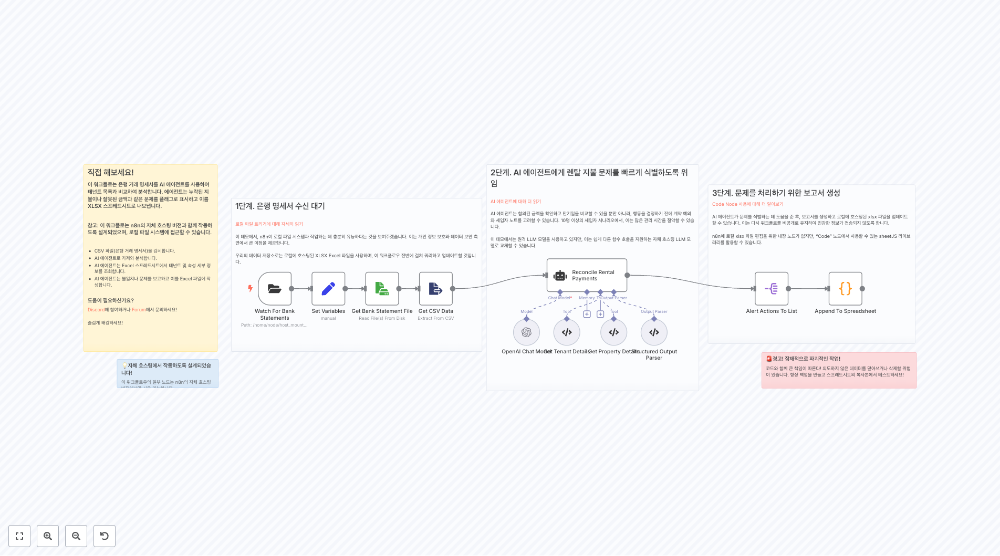](https://raw.githubusercontent.com/n8nKOR/n8n-shared-workflow/refs/heads/main/workflows/n8nworkflows/ai/2338.json)
**워크플로우 2338**
1단계. 은행 명세서 수신 대기 [로컬 파일 트리거에 대해 자세히 읽기](https://docs.n8n.io/integrations/builtin/core-nodes/n8n-nodes-base.localfiletrigger) 이 데모에서, n8n이 로컬 파일 시스템과 작업하는 데 충분히 유능하다는 것을 보여주겠습니다. 이는 개인 정보 보호와 데이터 보안 측...

[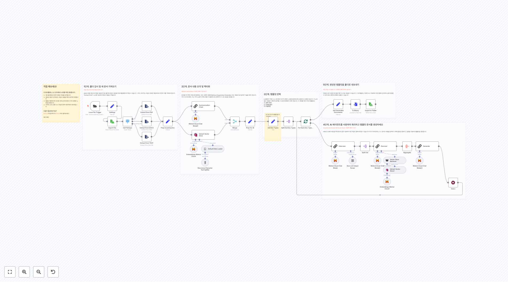](https://raw.githubusercontent.com/n8nKOR/n8n-shared-workflow/refs/heads/main/workflows/n8nworkflows/ai/2339.json)
**워크플로우 2339**
1단계. 폴더 감시 및 새 문서 가져오기 [로컬 파일 트리거에 대해 자세히 읽기](https://docs.n8n.io/integrations/builtin/core-nodes/n8n-nodes-base.localfiletrigger) n8n의 로컬 파일 트리거를 사용하면 대상 폴더에 파일이 생성될 때 워크플로를 트리거할 수 있습니다. 그러나 트리거는 파일의...

[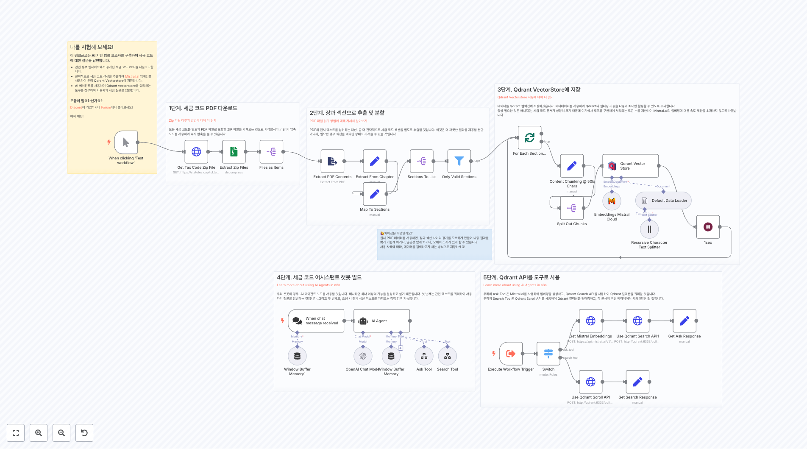](https://raw.githubusercontent.com/n8nKOR/n8n-shared-workflow/refs/heads/main/workflows/n8nworkflows/ai/2341.json)
**워크플로우 2341**
1단계. 세금 코드 PDF 다운로드 [Zip 파일 다루기 방법에 대해 더 읽기](https://docs.n8n.io/integrations/builtin/core-nodes/n8n-nodes-base.compression/) 모든 세금 코드를 별도의 PDF 파일로 포함한 ZIP 파일을 가져오는 것으로 시작합시다. n8n의 압축 노드를 사용하여 즉시 압축을 ...

[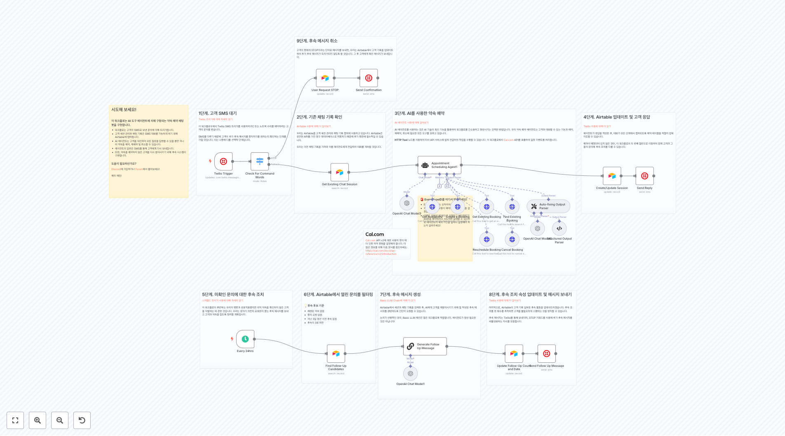](https://raw.githubusercontent.com/n8nKOR/n8n-shared-workflow/refs/heads/main/workflows/n8nworkflows/ai/2342.json)
**워크플로우 2342**
6단계. Airtable에서 열린 문의를 필터링 💡후속 후보 기준 * 예정된 약속 없음 * 중지 요청 없음 * 지난 3일 동안 이전 후속 없음 * 후속이 3회 미만

[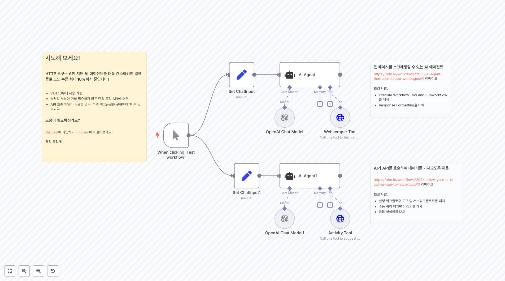](https://raw.githubusercontent.com/n8nKOR/n8n-shared-workflow/refs/heads/main/workflows/n8nworkflows/ai/2343.json)
**워크플로우 2343**
웹 페이지를 스크래핑할 수 있는 AI 에이전트 https://n8n.io/workflows/2006-ai-agent-that-can-scrape-webpages/의 리메이크 **변경 사항**: * Execute Workflow Tool and Subworkflow를 대체 * Response Formatting을 대체

[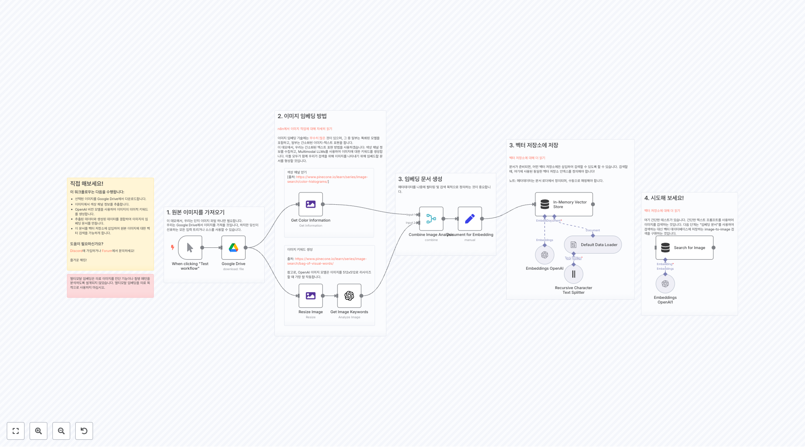](https://raw.githubusercontent.com/n8nKOR/n8n-shared-workflow/refs/heads/main/workflows/n8nworkflows/ai/2344.json)
**워크플로우 2344**
색상 채널 얻기 [출처: https://www.pinecone.io/learn/series/image-search/color-histograms/]

[](https://raw.githubusercontent.com/n8nKOR/n8n-shared-workflow/refs/heads/main/workflows/n8nworkflows/ai/2346.json)
**워크플로우 2346**
2단계. 들어오는 메시지 버퍼링 [Redis 사용에 대해 자세히 알아보기](https://docs.n8n.io/integrations/builtin/app-nodes/n8n-nodes-base.redis) * 새로운 메시지가 목록에 캡처됩니다. * X초 후, 이 목록의 새로운 복사본을 가져옵니다. * 목록의 마지막 메시지가 들어오는 메시지와 동일하면, 지난...

[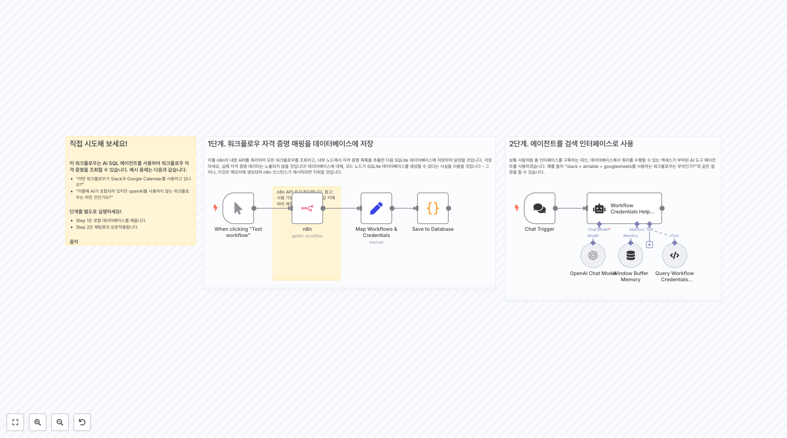](https://raw.githubusercontent.com/n8nKOR/n8n-shared-workflow/refs/heads/main/workflows/n8nworkflows/ai/2347.json)
**워크플로우 2347**
n8n API 키가 필요합니다. 참고: 사용 가능한 워크플로가 해당 키에 따라 제한됩니다.

[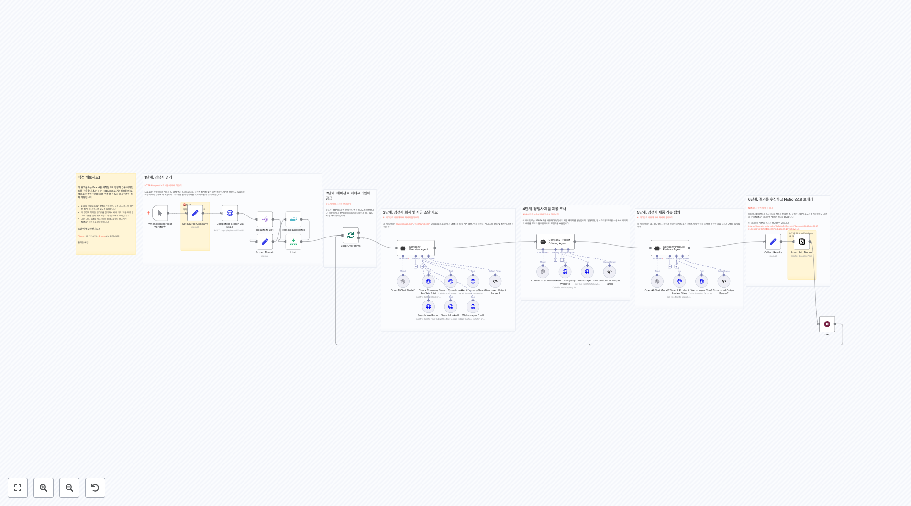](https://raw.githubusercontent.com/n8nKOR/n8n-shared-workflow/refs/heads/main/workflows/n8nworkflows/ai/2354.json)
**워크플로우 2354**
직접 해보세요! 이 워크플로는 Exa.ai를 시작점으로 경쟁자 연구 에이전트를 구축합니다. HTTP Request 도구는 최소한의 노력으로 강력한 에이전트를 구축할 수 있음을 보여주기 위해 사용됩니다. * Exa의 findSimilar 검색을 사용하여, 우리 소스 회사와 유사한 회사, 즉 경쟁자를 찾도록 요청합니다. * 이 경쟁자 목록은 인터넷을 검색하여 ...

## 📋 워크플로우 목록 (71-80)

[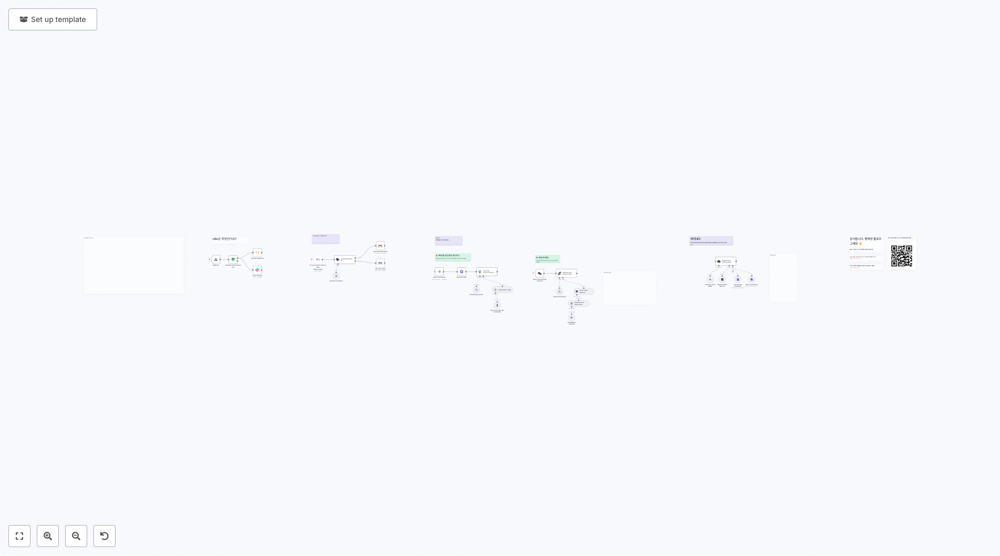](https://raw.githubusercontent.com/n8nKOR/n8n-shared-workflow/refs/heads/main/workflows/n8nworkflows/ai/2358.json)
**워크플로우 2358**
슬라이드 SF 토크

[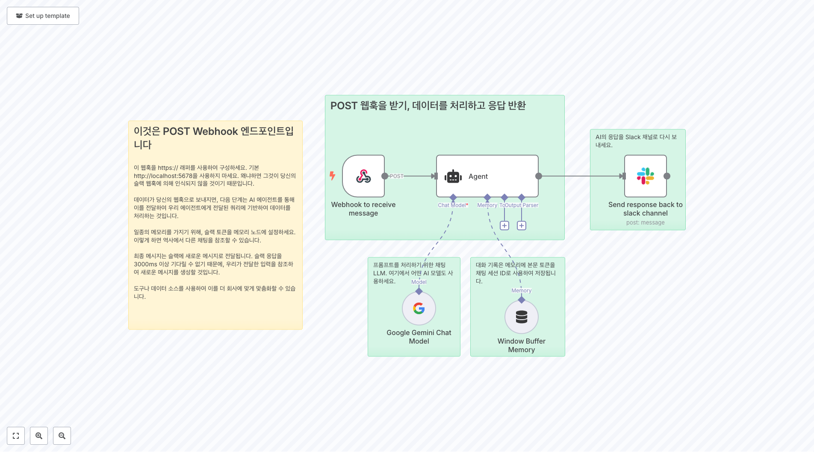](https://raw.githubusercontent.com/n8nKOR/n8n-shared-workflow/refs/heads/main/workflows/n8nworkflows/ai/2370.json)
**워크플로우 2370**
이것은 POST Webhook 엔드포인트입니다 이 웹훅을 https:// 래퍼를 사용하여 구성하세요. 기본 http://localhost:5678을 사용하지 마세요. 왜냐하면 그것이 당신의 슬랙 웹훅에 의해 인식되지 않을 것이기 때문입니다. 데이터가 당신의 웹훅으로 보내지면, 다음 단계는 AI 에이전트를 통해 이를 전달하여 우리 에이전트에게 전달된 쿼리에 ...

[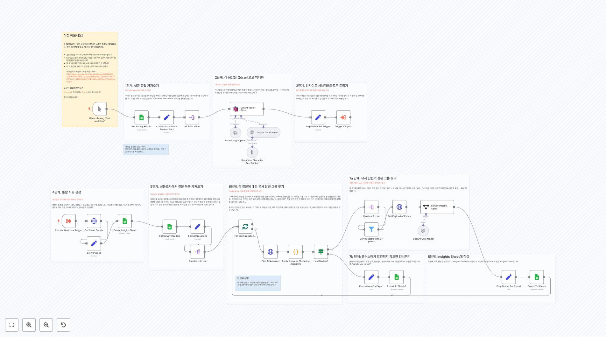](https://raw.githubusercontent.com/n8nKOR/n8n-shared-workflow/refs/heads/main/workflows/n8nworkflows/ai/2372.json)
**워크플로우 2372**
1단계. 설문 응답 가져오기 [Google Sheets에 대해 더 읽기](https://docs.n8n.io/integrations/builtin/app-nodes/n8n-nodes-base.googlesheets) 우리의 접근 방식은 모든 참가자 응답을 벡터로 가져와, 이를 답변된 질문에 연결하는 메타데이터를 포함해야 합니다. 이를 위해, 우리는 설문에서...

[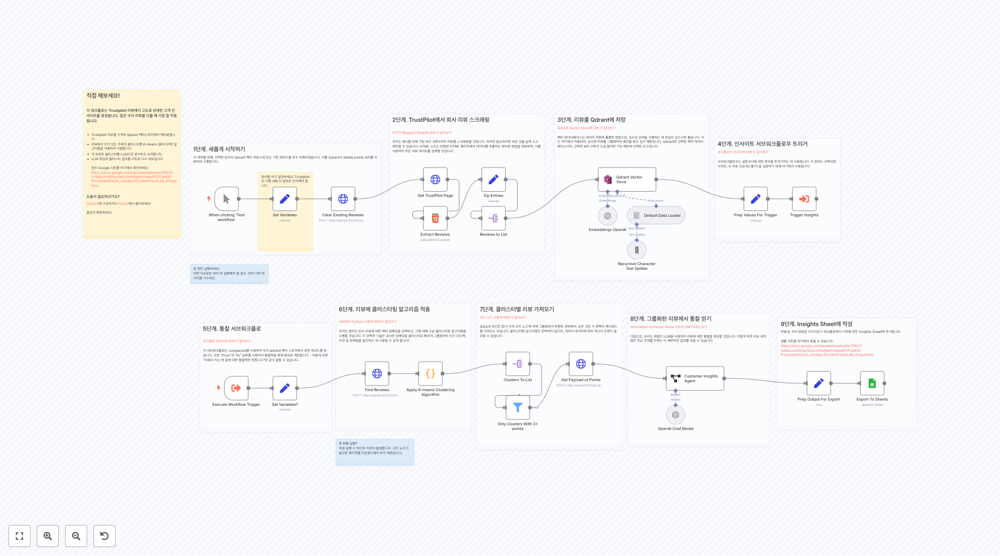](https://raw.githubusercontent.com/n8nKOR/n8n-shared-workflow/refs/heads/main/workflows/n8nworkflows/ai/2373.json)
**워크플로우 2373**
1단계. 새롭게 시작하기 이 데모를 위해, 선택된 회사의 Qdrant 벡터 저장소에 있는 기존 레코드를 모두 삭제하겠습니다. 이를 Qdrant의 delete points API를 사용하여 수행합니다.

[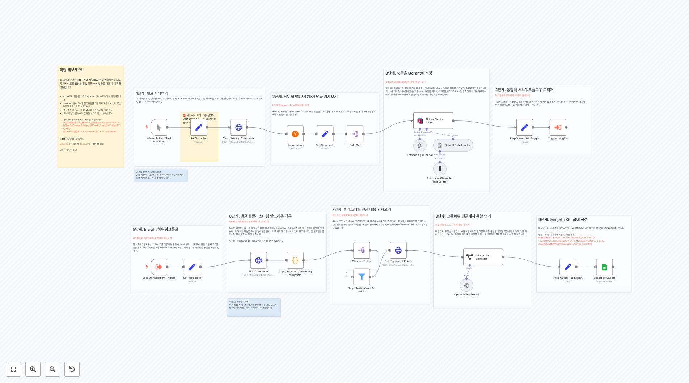](https://raw.githubusercontent.com/n8nKOR/n8n-shared-workflow/refs/heads/main/workflows/n8nworkflows/ai/2374.json)
**워크플로우 2374**
4단계. 통찰력 서브워크플로우 트리거 [워크플로우 트리거에 대해 더 알아보기](https://docs.n8n.io/integrations/builtin/core-nodes/n8n-nodes-base.executeworkflow) 서브워크플로우는 설문조사의 분석을 트리거하는 데 사용됩니다. 이 분리는 선택사항이지만, 여기서 두 부분 프로세스를 더 잘 시연하기...

[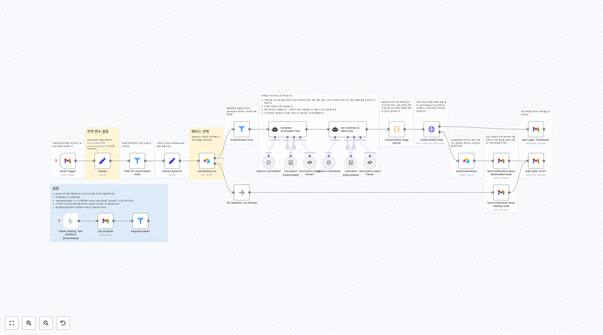](https://raw.githubusercontent.com/n8nKOR/n8n-shared-workflow/refs/heads/main/workflows/n8nworkflows/ai/2377.json)
**워크플로우 2377**
설정 - Gmail 트리거를 비활성화하고 수동 트리거를 여기에서 활성화하세요 - 워크플로를 한 번 실행하세요 - "Required labels" 노드의 출력에서 Gmail Label IDs를 "Globals" 노드로 복사하세요 - 여기에서 수동 트리거를 비활성화하고 Gmail 트리거를 다시 활성화하세요 - 워크플로를 활성화하여 배경에서 자동으로 실행되게 하...

[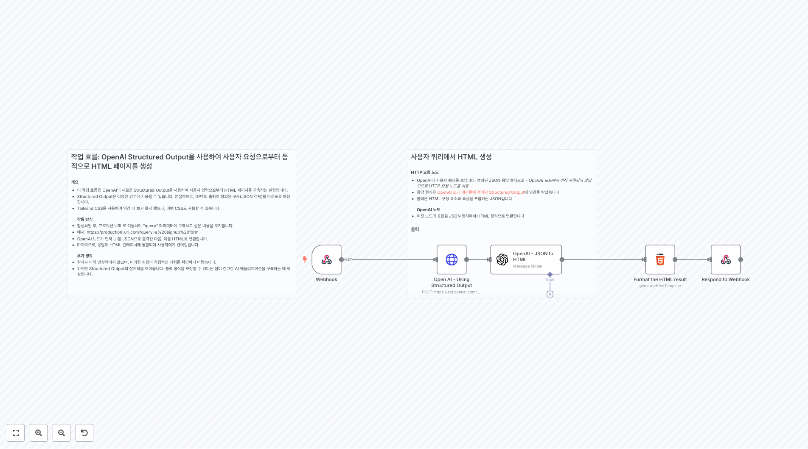](https://raw.githubusercontent.com/n8nKOR/n8n-shared-workflow/refs/heads/main/workflows/n8nworkflows/ai/2388.json)
**워크플로우 2388**
사용자 쿼리에서 HTML 생성 **HTTP 요청 노드** - OpenAI에 사용자 쿼리를 보냅니다, 정의된 JSON 응답 형식으로 - *OpenAI 노드에서 아직 구현되지 않았으므로 HTTP 요청 노드를 사용* - 응답 형식은 [OpenAI 소개 게시물에 정의된 Structured Output](https://openai.com/index/introduci...

[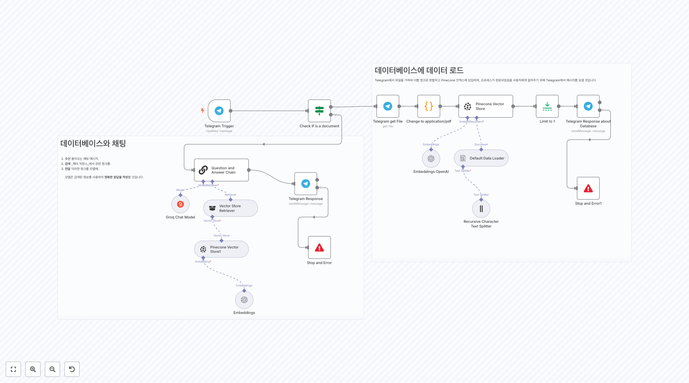](https://raw.githubusercontent.com/n8nKOR/n8n-shared-workflow/refs/heads/main/workflows/n8nworkflows/ai/2392.json)
**워크플로우 2392**
데이터베이스에 데이터 로드 Telegram에서 파일을 가져와 이를 청크로 분할하고 Pinecone 인덱스에 삽입하며, 프로세스가 완료되었음을 사용자에게 알려주기 위해 Telegram에서 메시지를 보낼 것입니다

[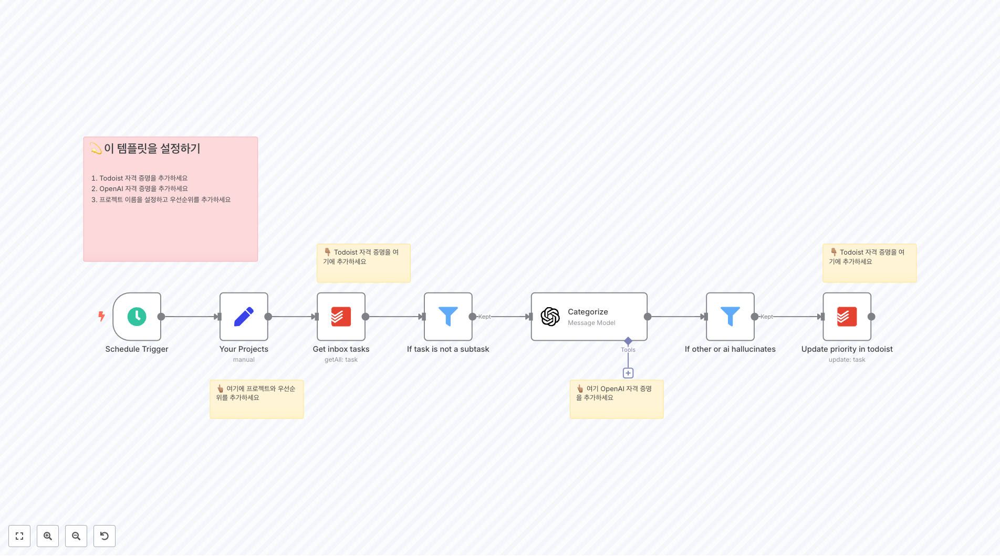](https://raw.githubusercontent.com/n8nKOR/n8n-shared-workflow/refs/heads/main/workflows/n8nworkflows/ai/2394.json)
**워크플로우 2394**
💫 이 템플릿을 설정하기 1. Todoist 자격 증명을 추가하세요 2. OpenAI 자격 증명을 추가하세요 3. 프로젝트 이름을 설정하고 우선순위를 추가하세요

[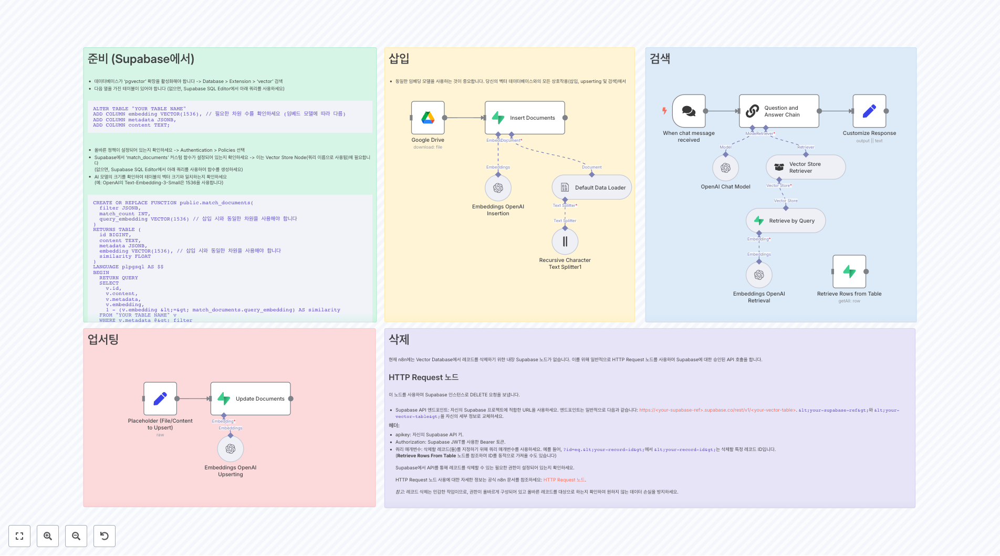](https://raw.githubusercontent.com/n8nKOR/n8n-shared-workflow/refs/heads/main/workflows/n8nworkflows/ai/2395.json)
**워크플로우 2395**
삽입 - 동일한 임베딩 모델을 사용하는 것이 중요합니다. 당신의 벡터 데이터베이스와의 모든 상호작용(삽입, upserting 및 검색)에서

## 📋 워크플로우 목록 (81-90)

[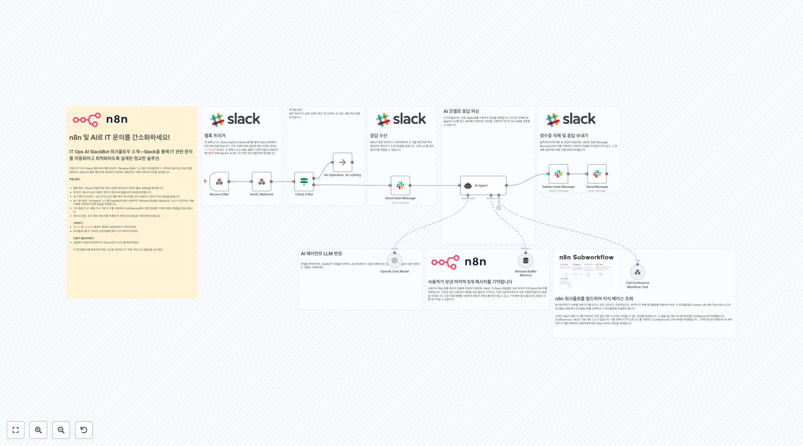](https://raw.githubusercontent.com/n8nKOR/n8n-shared-workflow/refs/heads/main/workflows/n8nworkflows/ai/2397.json)
**워크플로우 2397**
 웹훅 트리거 첫 번째 노드는 Subscription Events API를 통해 Slack API에서 모든 메시지를 받습니다. 구독 이벤트 API 설정에 대한 자세한 정보는 [여기를 클릭](https://api.slack.com/apis/connections/events-api)하세요...

[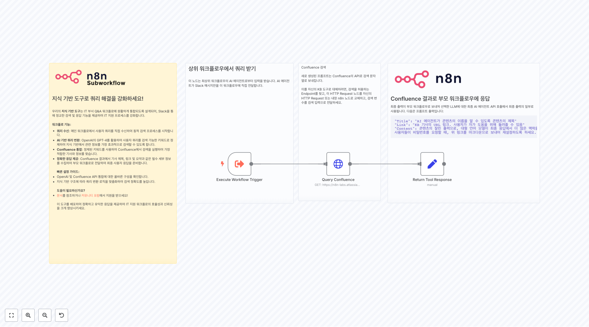](https://raw.githubusercontent.com/n8nKOR/n8n-shared-workflow/refs/heads/main/workflows/n8nworkflows/ai/2398.json)
**워크플로우 2398**
상위 워크플로우에서 쿼리 받기 이 노드는 최상위 워크플로우의 AI 에이전트로부터 입력을 받습니다. AI 에이전트가 Slack 메시지만을 이 워크플로우에 직접 전달합니다.

[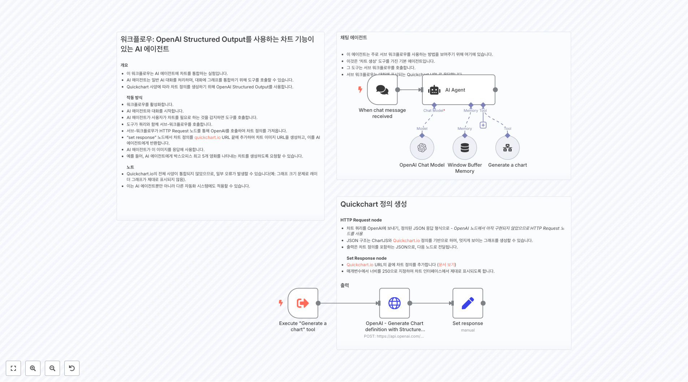](https://raw.githubusercontent.com/n8nKOR/n8n-shared-workflow/refs/heads/main/workflows/n8nworkflows/ai/2400.json)
**워크플로우 2400**
워크플로우: OpenAI Structured Output를 사용하는 차트 기능이 있는 AI 에이전트 **개요** - 이 워크플로우는 AI 에이전트에 차트를 통합하는 실험입니다. - AI 에이전트는 일반 AI 대화를 처리하며, 대화에 그래프를 통합하기 위해 도구를 호출할 수 있습니다. - Quickchart 사양에 따라 차트 정의를 생성하기 위해 OpenAI...

[](https://raw.githubusercontent.com/n8nKOR/n8n-shared-workflow/refs/heads/main/workflows/n8nworkflows/ai/2405.json)
**워크플로우 2405**
컨텍스트 가져오기

[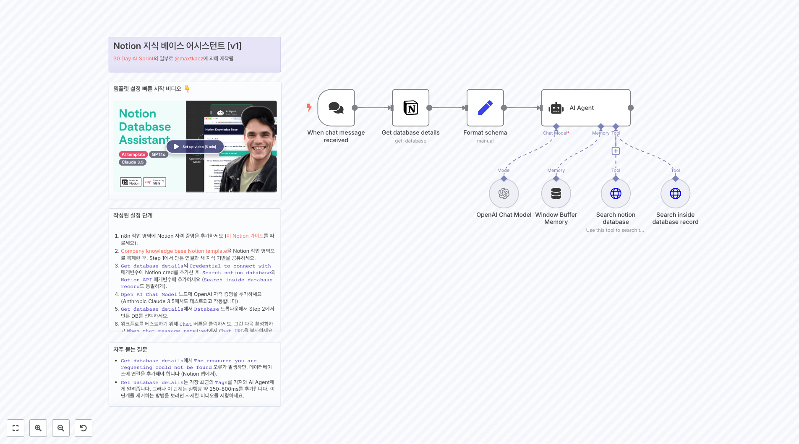](https://raw.githubusercontent.com/n8nKOR/n8n-shared-workflow/refs/heads/main/workflows/n8nworkflows/ai/2413.json)
**워크플로우 2413**
Notion 지식 베이스 어시스턴트 [v1] [30 Day AI Sprint](https://30dayaisprint.notion.site/)의 일부로 [@maxtkacz](https://x.com/maxtkacz)에 의해 제작됨

[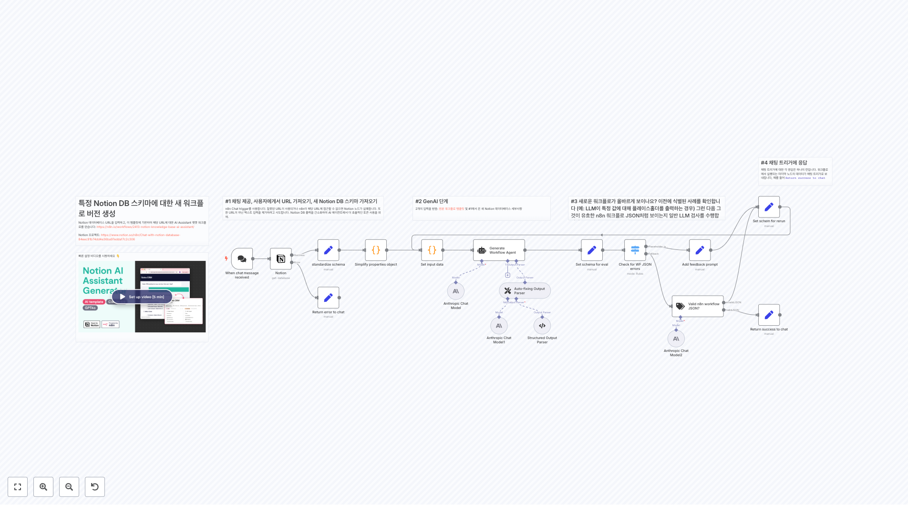](https://raw.githubusercontent.com/n8nKOR/n8n-shared-workflow/refs/heads/main/workflows/n8nworkflows/ai/2415.json)
**워크플로우 2415**
특정 Notion DB 스키마에 대한 새 워크플로 버전 생성 Notion 데이터베이스 URL을 입력하고, 이 템플릿에 기반하여 해당 URL에 대한 AI Assistant 챗봇 워크플로를 얻습니다: https://n8n.io/workflows/2413-notion-knowledge-base-ai-assistant/ Notion 프로젝트: https://www...

[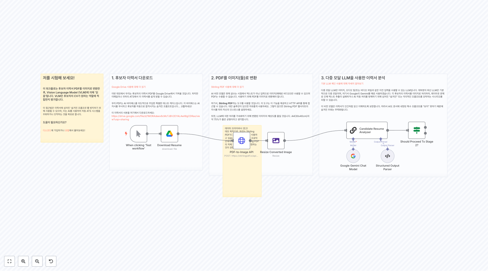](https://raw.githubusercontent.com/n8nKOR/n8n-shared-workflow/refs/heads/main/workflows/n8nworkflows/ai/2416.json)
**워크플로우 2416**
저를 시험해 보세요! 이 워크플로는 후보자 이력서 PDF를 이미지로 변환한 후, Vision Language Model (VLM)에 의해 '읽음'됩니다. VLM은 후보자의 CV가 원하는 역할에 적합한지 평가합니다. 이 접근법은 이력서에 심어진 '숨겨진 프롬프트'를 방지하기 위해 사용될 수 있으며, 이는 AI를 사용하여 자동 ATS 시스템을 우회하거나 조작하...

[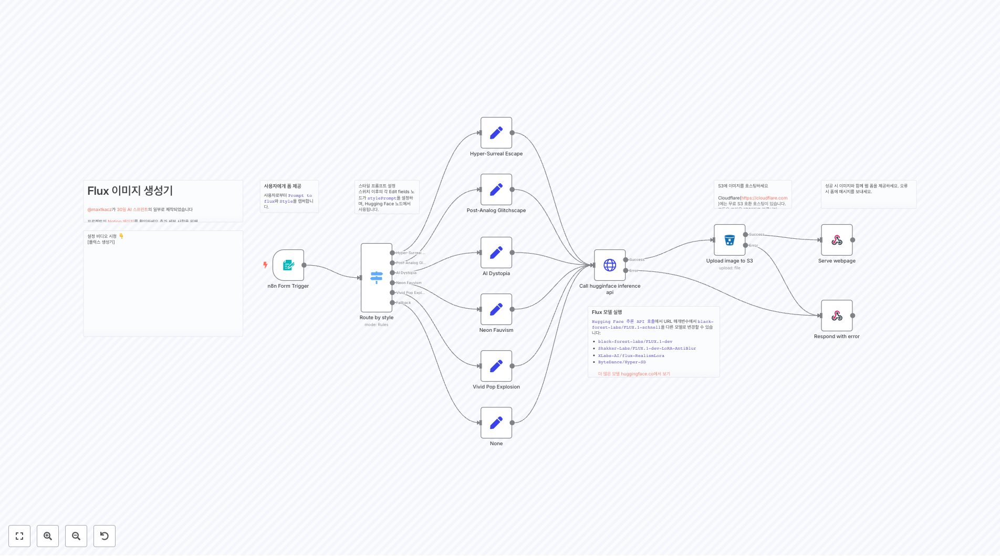](https://raw.githubusercontent.com/n8nKOR/n8n-shared-workflow/refs/heads/main/workflows/n8nworkflows/ai/2417.json)
**워크플로우 2417**
스타일 프롬프트 설정 스위치 이후의 각 Edit fields 노드가 `stylePrompt`을 설정하며, Hugging Face 노드에서 사용됩니다.

[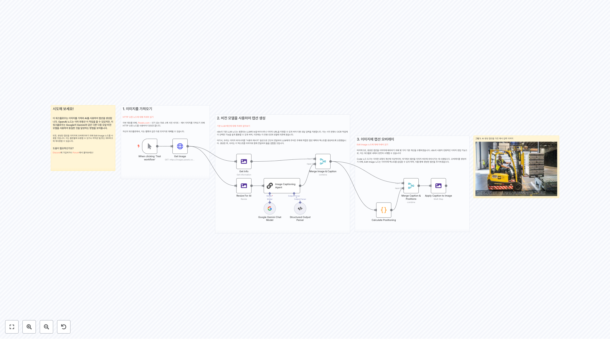](https://raw.githubusercontent.com/n8nKOR/n8n-shared-workflow/refs/heads/main/workflows/n8nworkflows/ai/2418.json)
**워크플로우 2418**
시도해 보세요! 이 워크플로우는 이미지를 가져와 AI를 사용하여 캡션을 생성합니다. OpenAI 노드는 이미 한동안 이 작업을 할 수 있었지만, 이 워크플로우는 Google의 Gemini와 같은 다른 다중 모달 비전 모델을 사용하여 동일한 것을 달성하는 방법을 보여줍니다. 또한, 생성된 캡션을 이미지에 오버레이하기 위해 Edit Image 노드를 사용할 것...

[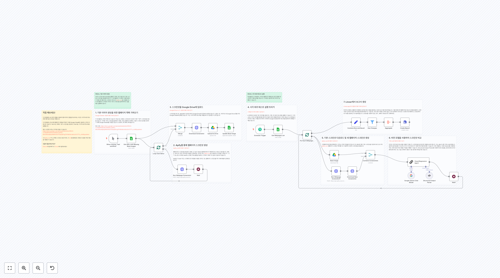](https://raw.githubusercontent.com/n8nKOR/n8n-shared-workflow/refs/heads/main/workflows/n8nworkflows/ai/2419.json)
**워크플로우 2419**
부분 A. 기본 이미지 생성 우리가 시각적 회귀 테스트를 실행하기 전에, 비교 대상으로 기본 스크린샷 시리즈를 생성해야 합니다. 이 워크플로의 이 부분은 이를 달성하기 위해 외부 웹사이트 스크린샷 서비스인 [Apify.com](https://www.apify.com?fpr=414q6)을 사용합니다. 이 워크플로의 이 부분은 우리의 기본 스크린샷을 업데이트하...

## 📋 워크플로우 목록 (91-100)

[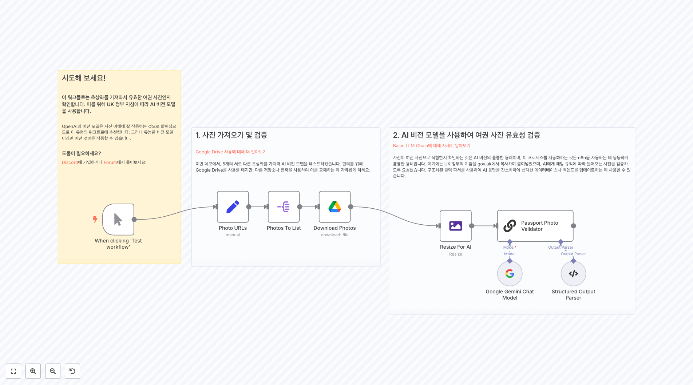](https://raw.githubusercontent.com/n8nKOR/n8n-shared-workflow/refs/heads/main/workflows/n8nworkflows/ai/2420.json)
**워크플로우 2420**
1. 사진 가져오기 및 검증 [Google Drive 사용에 대해 더 알아보기](https://docs.n8n.io/integrations/builtin/app-nodes/n8n-nodes-base.googledrive) 이번 데모에서, 5개의 서로 다른 초상화를 가져와 AI 비전 모델을 테스트하겠습니다. 편의를 위해 Google Drive를 사용할 테지만...

[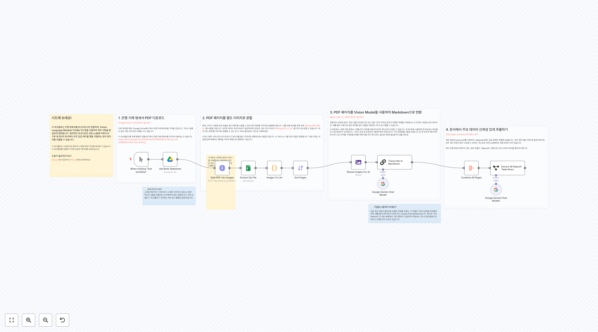](https://raw.githubusercontent.com/n8nKOR/n8n-shared-workflow/refs/heads/main/workflows/n8nworkflows/ai/2421.json)
**워크플로우 2421**
시도해 보세요! 이 워크플로는 은행 명세서를 마크다운으로 변환하며, Vision Language Models("VLMs")의 힘을 사용하여 세부 사항을 충실하게 캡처합니다. 결과적인 마크다운은 표준 LLM에 의해 다시 구문 분석되어 문서에서 모든 입금 테이블 행을 식별하는 등의 데이터를 추출할 수 있습니다. 이 워크플로는 다운로드된 PDF와 스캔된 PDF ...

[](https://raw.githubusercontent.com/n8nKOR/n8n-shared-workflow/refs/heads/main/workflows/n8nworkflows/ai/2424.json)
**워크플로우 2424**
Adobe API 래퍼 Adobe 문서를 참조하세요: - https://developer.adobe.com/document-services/docs/overview/pdf-services-api/howtos/ - https://developer.adobe.com/document-services/docs/overview/pdf-extract-api/getti...

[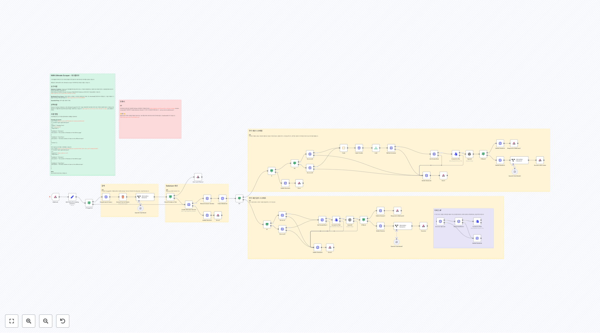](https://raw.githubusercontent.com/n8nKOR/n8n-shared-workflow/refs/heads/main/workflows/n8nworkflows/ai/2431.json)
**워크플로우 2431**
N8N Ultimate Scraper - 워크플로우 이 워크플로의 목적은 로그인 여부에 관계없이 어떤 웹사이트 페이지에서든 데이터를 수집하는 것입니다. 예를 들어, GitHub에서 n8n-ultimate-scraper 프로젝트의 별 개수를 수집할 수 있습니다. 요구사항 **Selenium Container**: Selenium은 웹 애플리케이션을 위한 오픈...

[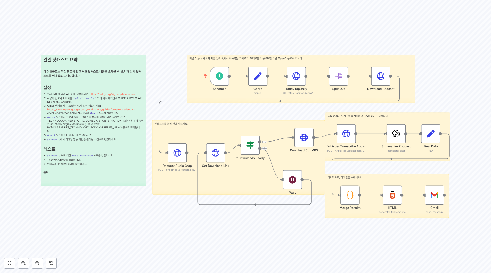](https://raw.githubusercontent.com/n8nKOR/n8n-shared-workflow/refs/heads/main/workflows/n8nworkflows/ai/2433.json)
**워크플로우 2433**
일일 팟캐스트 요약 이 워크플로는 특정 장르의 당일 최고 팟캐스트 내용을 요약한 후, 요약과 함께 팟캐스트를 이메일로 보내드립니다. 설정: 1. Taddy에서 무료 API 키를 생성하세요: https://taddy.org/signup/developers 2. 사용자 번호와 API 키를 `TaddyTopDaily` 노드의 헤더 매개변수 X-USER-ID와 X...

[](https://raw.githubusercontent.com/n8nKOR/n8n-shared-workflow/refs/heads/main/workflows/n8nworkflows/ai/2434.json)
**워크플로우 2434**
여기에서 목적지 폴더를 설정하세요

[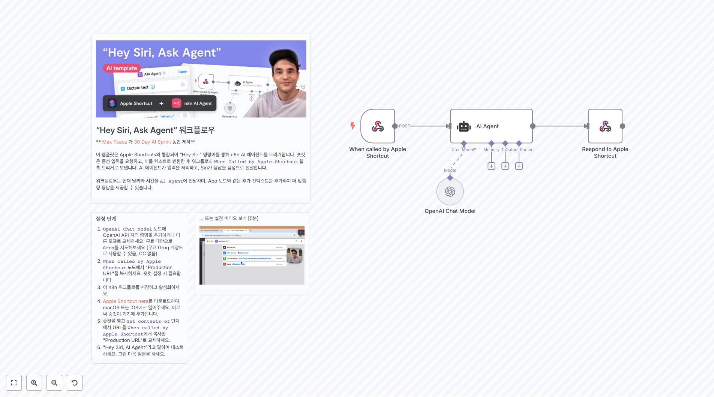](https://raw.githubusercontent.com/n8nKOR/n8n-shared-workflow/refs/heads/main/workflows/n8nworkflows/ai/2436.json)
**워크플로우 2436**
 "Hey Siri, Ask Agent" 워크플로우 ** [Max Tkacz](https://www.linkedin.com/in/maxtkacz) 가 [30 Day AI Sprint](https://30dayaisprint....

[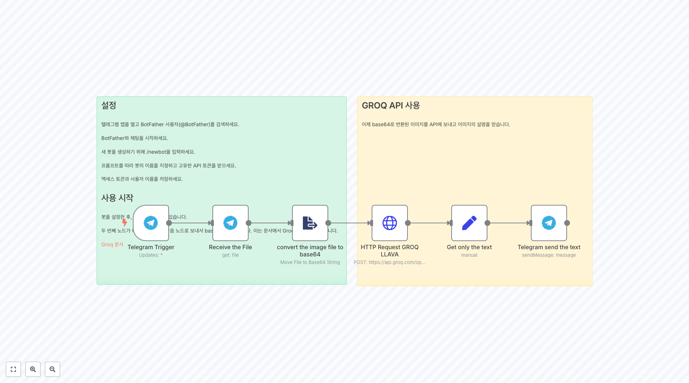](https://raw.githubusercontent.com/n8nKOR/n8n-shared-workflow/refs/heads/main/workflows/n8nworkflows/ai/2437.json)
**워크플로우 2437**
설정 텔레그램 앱을 열고 BotFather 사용자(@BotFather)를 검색하세요. BotFather와 채팅을 시작하세요. 새 봇을 생성하기 위해 /newbot을 입력하세요. 프롬프트를 따라 봇의 이름을 지정하고 고유한 API 토큰을 받으세요. 액세스 토큰과 사용자 이름을 저장하세요. 사용 시작 봇을 설정한 후, 이미지를 보낼 수 있습니다. 두 번째 노드...

[](https://raw.githubusercontent.com/n8nKOR/n8n-shared-workflow/refs/heads/main/workflows/n8nworkflows/ai/2440.json)
**워크플로우 2440**
도구, 사용자의 요청에 기반하여 Qdrant의 추천 API를 호출하는, AI 에이전트에 의해 변환된

[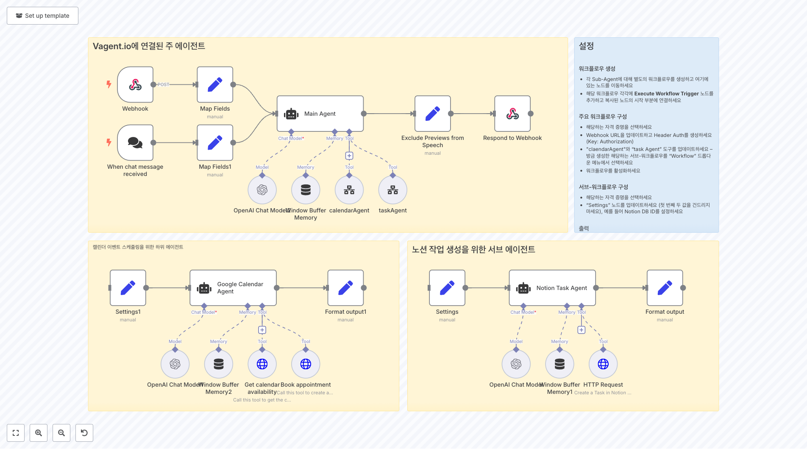](https://raw.githubusercontent.com/n8nKOR/n8n-shared-workflow/refs/heads/main/workflows/n8nworkflows/ai/2446.json)
**워크플로우 2446**
캘린더 이벤트 스케줄링을 위한 하위 에이전트

## 📋 워크플로우 목록 (101-110)

[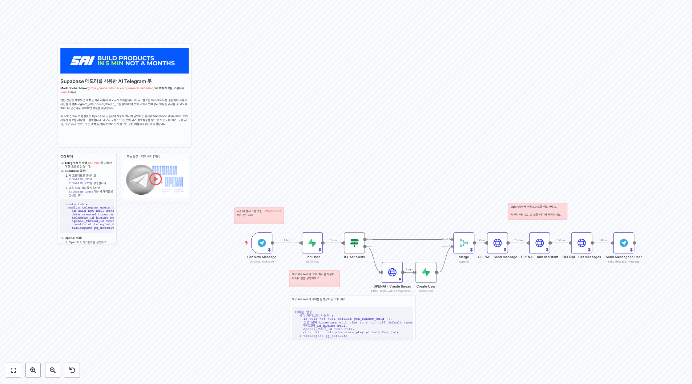](https://raw.githubusercontent.com/n8nKOR/n8n-shared-workflow/refs/heads/main/workflows/n8nworkflows/ai/2453.json)
**워크플로우 2453**
Supabase에서 테이블을 생성하는 SQL 쿼리: ``` 테이블 생성 공개.텔레그램_사용자 ( id uuid not null default gen_random_uuid (), 생성_날짜 timestamp with time zone not null default (now() at time zone 'utc'::text), 텔레그램_id bigint null...

[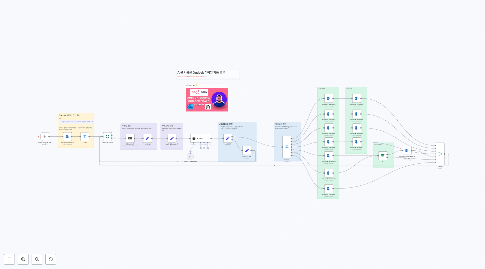](https://raw.githubusercontent.com/n8nKOR/n8n-shared-workflow/refs/heads/main/workflows/n8nworkflows/ai/2454.json)
**워크플로우 2454**
AI를 사용한 Outlook 이메일 자동 분류 [Wayne Simpson](https://www.linkedin.com/in/simpsonwayne/)에 의해 [nocodecreative.io](https://nocodecreative.io)에서 제작됨

[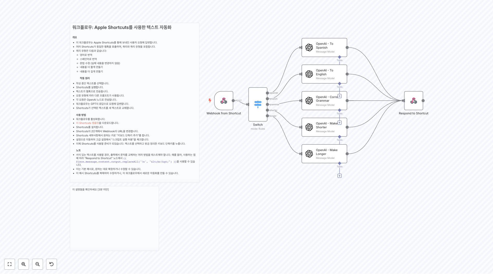](https://raw.githubusercontent.com/n8nKOR/n8n-shared-workflow/refs/heads/main/workflows/n8nworkflows/ai/2456.json)
**워크플로우 2456**
워크플로우: Apple Shortcuts를 사용한 텍스트 자동화 **개요** - 이 워크플로우는 Apple Shortcuts를 통해 보내진 사용자 요청에 답변합니다. - 여러 Shortcuts가 동일한 웹훅을 호출하며, 쿼리와 쿼리 유형을 포함합니다. - 쿼리 유형은 다음과 같습니다: - 영어로 번역 - 스페인어로 번역 - 문법 수정 (실제 내용을 변경하지...

[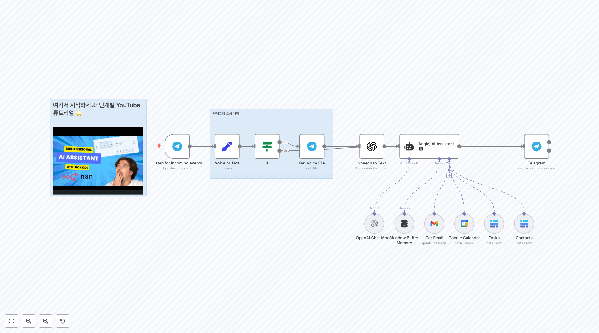](https://raw.githubusercontent.com/n8nKOR/n8n-shared-workflow/refs/heads/main/workflows/n8nworkflows/ai/2462.json)
**워크플로우 2462**
텔레그램 요청 처리

[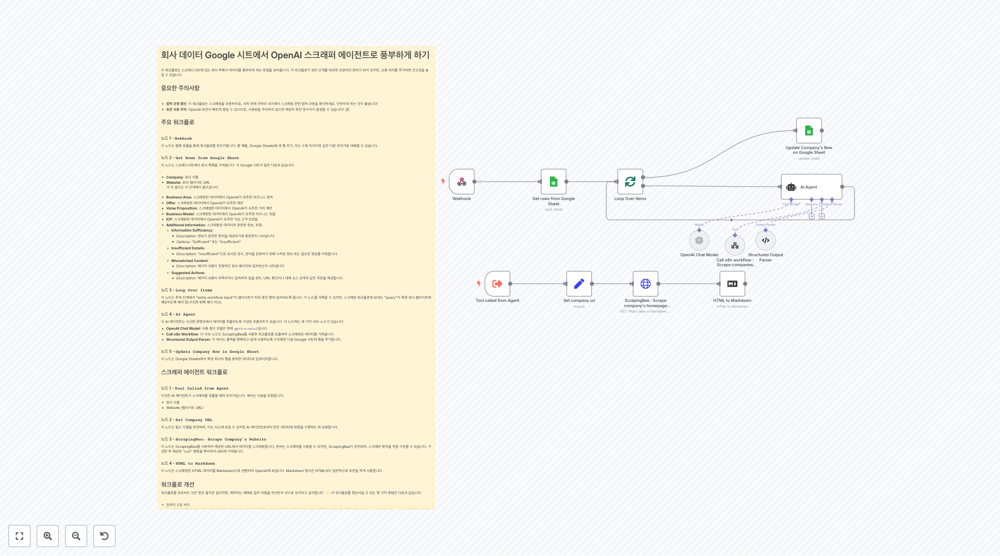](https://raw.githubusercontent.com/n8nKOR/n8n-shared-workflow/refs/heads/main/workflows/n8nworkflows/ai/2463.json)
**워크플로우 2463**
회사 데이터 Google 시트에서 OpenAI 스크래퍼 에이전트로 풍부하게 하기 이 워크플로는 스프레드시트에 있는 회사 목록의 데이터를 풍부하게 하는 방법을 보여줍니다. 이 워크플로가 모든 단계를 따르면 프로덕션 준비가 되어 있지만, 오류 처리를 추가하면 견고성을 높일 수 있습니다. 중요한 주의사항 - **법적 규정 확인**: 이 워크플로는 스크래핑을 포함...

[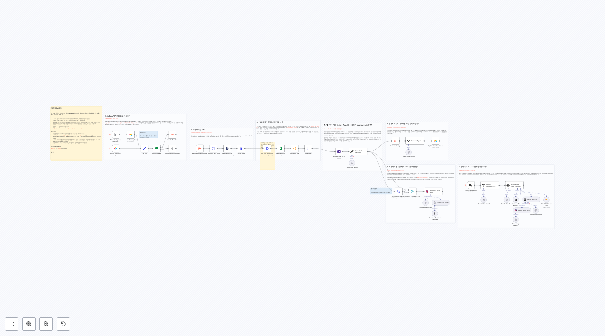](https://raw.githubusercontent.com/n8nKOR/n8n-shared-workflow/refs/heads/main/workflows/n8nworkflows/ai/2464.json)
**워크플로우 2464**
3. PDF 페이지를 별도 이미지로 분할 현재, 우리가 사용할 비전 모델은 원시 PDF를 수용할 수 없으므로 PDF를 이미지로 변환해야 합니다. 이를 위해 편의를 위해 무료 [Stirling PDF 웹서비스](https://stirlingpdf.io/)를 사용할 예정이지만, 데이터 프라이버시가 필요하다면 (추천!) 대신 [Stirling PDF 인스턴스](...

[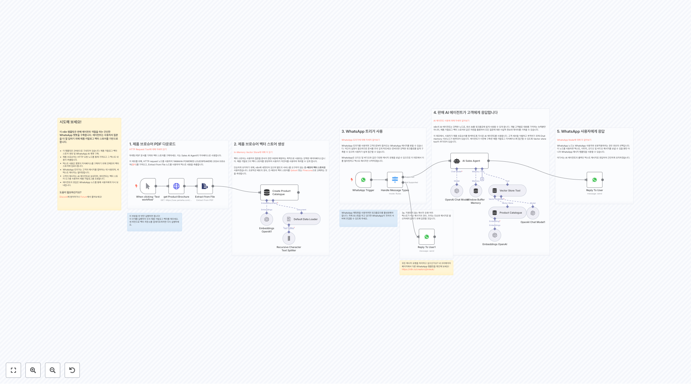](https://raw.githubusercontent.com/n8nKOR/n8n-shared-workflow/refs/heads/main/workflows/n8nworkflows/ai/2465.json)
**워크플로우 2465**
1. 제품 브로슈어 PDF 다운로드 [HTTP Request Tool에 대해 자세히 읽기](https://docs.n8n.io/integrations/builtin/core-nodes/n8n-nodes-base.httprequest) 마케팅 PDF 문서를 가져와 벡터 스토어를 구축하세요. 이는 Sales AI Agent의 지식베이스로 사용됩니다. 이 데모를...

[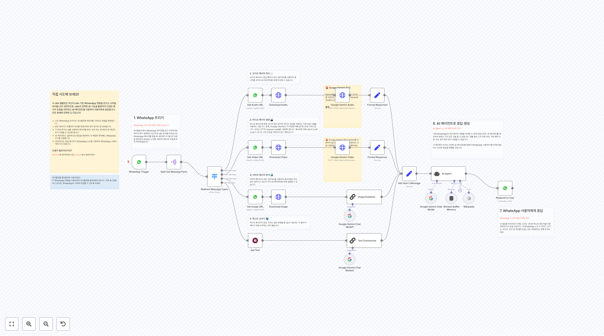](https://raw.githubusercontent.com/n8nKOR/n8n-shared-workflow/refs/heads/main/workflows/n8nworkflows/ai/2466.json)
**워크플로우 2466**
1. WhatsApp 트리거 [WhatsApp 트리거에 대해 자세히 알아보기](https://docs.n8n.io/integrations/builtin/trigger-nodes/n8n-nodes-base.whatsapptrigger) 워크플로우에서 WhatsApp 메시지를 받기 시작하려면, 여러 단계가 포함되어 있으므로 n8n 문서를 따르십시오. Whats...

[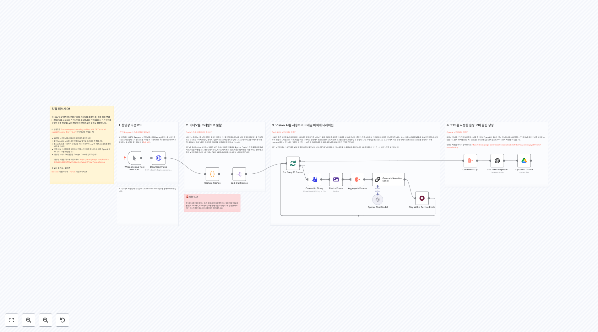](https://raw.githubusercontent.com/n8nKOR/n8n-shared-workflow/refs/heads/main/workflows/n8nworkflows/ai/2467.json)
**워크플로우 2467**
직접 해보세요! 이 n8n 템플릿은 비디오를 가져와 프레임을 추출한 후, 이를 다중 모달 LLM과 함께 사용하여 스크립트를 생성합니다. 그런 다음 이 스크립트를 동일한 다중 모달 LLM에 전달하여 보이스오버 클립을 생성합니다. 이 템플릿은 [Processing and narrating a video with GPT's visual capabilities a...

[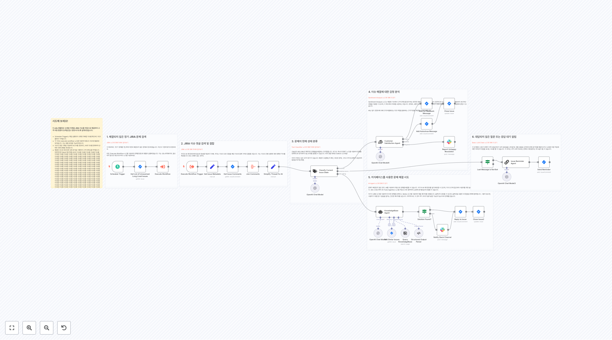](https://raw.githubusercontent.com/n8nKOR/n8n-shared-workflow/refs/heads/main/workflows/n8nworkflows/ai/2468.json)
**워크플로우 2468**
1. 해결되지 않은 장기 JIRA 문제 검색 [JIRA 노드에 대해 자세히 알아보기](https://docs.n8n.io/integrations/builtin/app-nodes/n8n-nodes-base.jira) 이 데모에서, '장기' 문제를 7일 후에 여전히 해결되지 않은 문제로 정의하겠습니다. 자신의 기준에 맞게 조정하세요. 또한, Execute Wo...

## 📋 워크플로우 목록 (111-120)

[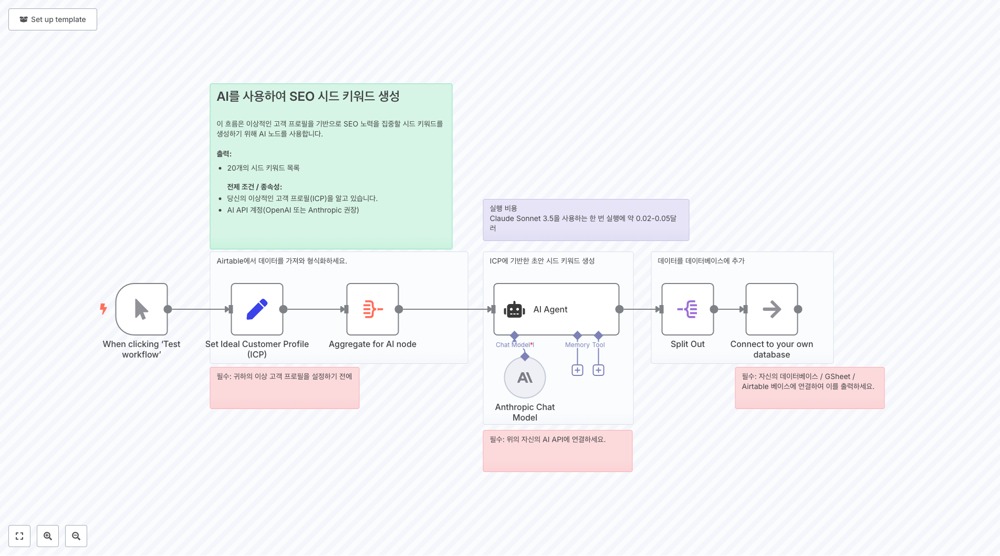](https://raw.githubusercontent.com/n8nKOR/n8n-shared-workflow/refs/heads/main/workflows/n8nworkflows/ai/2473.json)
**워크플로우 2473**
AI를 사용하여 SEO 시드 키워드 생성 이 흐름은 이상적인 고객 프로필을 기반으로 SEO 노력을 집중할 시드 키워드를 생성하기 위해 AI 노드를 사용합니다. **출력:** - 20개의 시드 키워드 목록 **전제 조건 / 종속성:** - 당신의 이상적인 고객 프로필(ICP)을 알고 있습니다. - AI API 계정(OpenAI 또는 Anthropic 권장)

[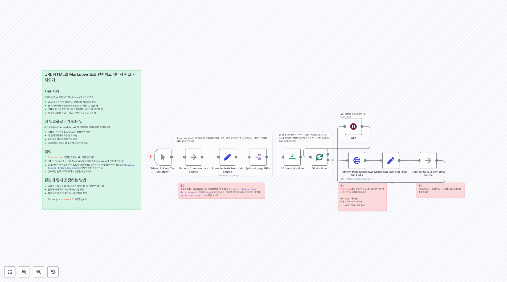](https://raw.githubusercontent.com/n8nKOR/n8n-shared-workflow/refs/heads/main/workflows/n8nworkflows/ai/2476.json)
**워크플로우 2476**
한 번에 40개가 내 서버의 메모리 제한인 것 같아요 - 40개 배치로 완성될 때까지 실행하거나, 서버 메모리에 따라 증가시키세요.

[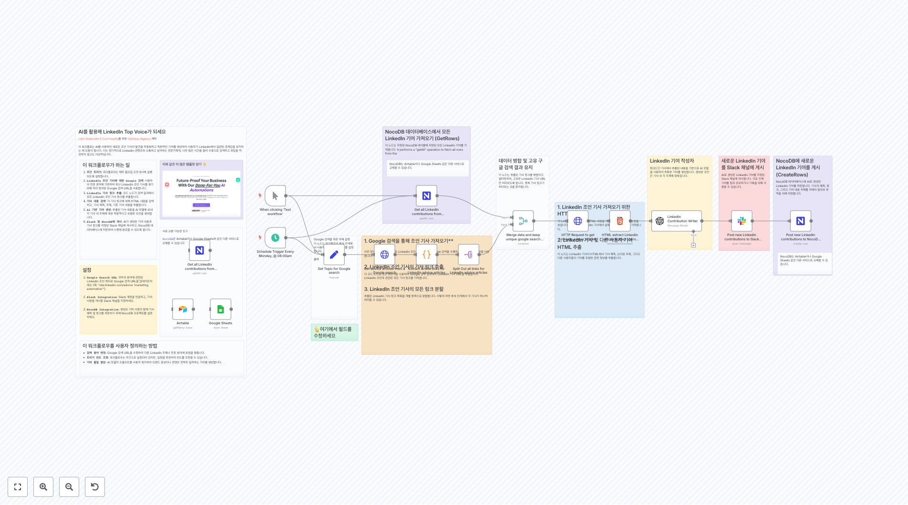](https://raw.githubusercontent.com/n8nKOR/n8n-shared-workflow/refs/heads/main/workflows/n8nworkflows/ai/2491.json)
**워크플로우 2491**
1. Google 검색을 통해 조언 기사 가져오기** 사전 정의된 쿼리를 기반으로 LinkedIn 조언 기사를 위한 Google 검색을 수행하기 위해 HTTP 요청을 사용합니다. 2. LinkedIn 조언 기사의 기사 링크 추출 이 코드 노드는 정규 표현식을 사용하여 Google 검색 결과에서 LinkedIn 기사 URL을 추출합니다. LinkedIn 조언...

[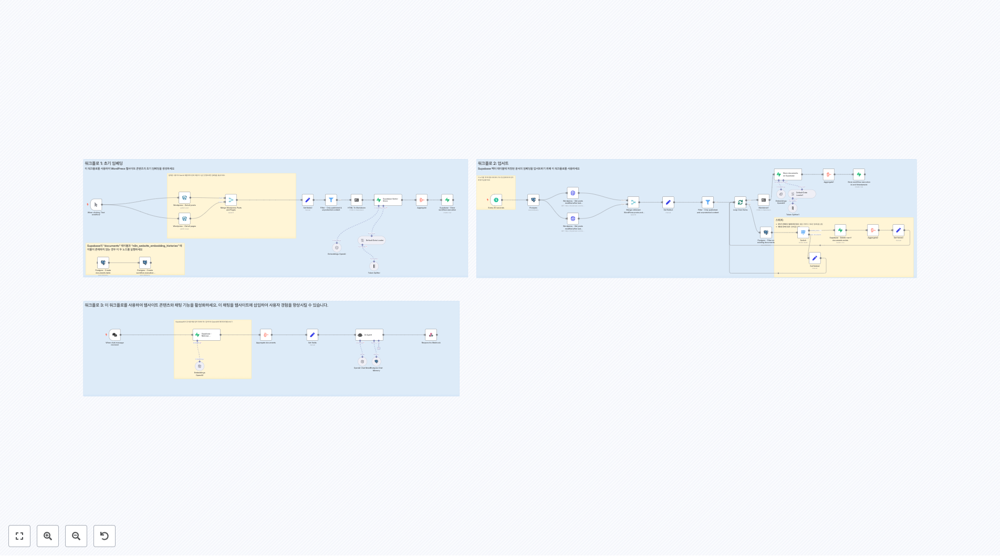](https://raw.githubusercontent.com/n8nKOR/n8n-shared-workflow/refs/heads/main/workflows/n8nworkflows/ai/2504.json)
**워크플로우 2504**
워크플로 1: 초기 임베딩 이 워크플로를 사용하여 WordPress 웹사이트 콘텐츠의 초기 임베딩을 생성하세요

[](https://raw.githubusercontent.com/n8nKOR/n8n-shared-workflow/refs/heads/main/workflows/n8nworkflows/ai/2508.json)
**워크플로우 2508**
이 부분은 한 번만 실행하세요 이 섹션: * [db4free](https://db4free.net/signup.php)에서 호스팅되는 데이터베이스에서 모든 테이블의 목록을 로드합니다 * 각 테이블의 데이터베이스 스키마를 추출하고 테이블 이름을 추가합니다 * 스키마를 이진 JSON 형식으로 변환합니다 * 스키마를 로컬에 `./chinook_mysql.json...

[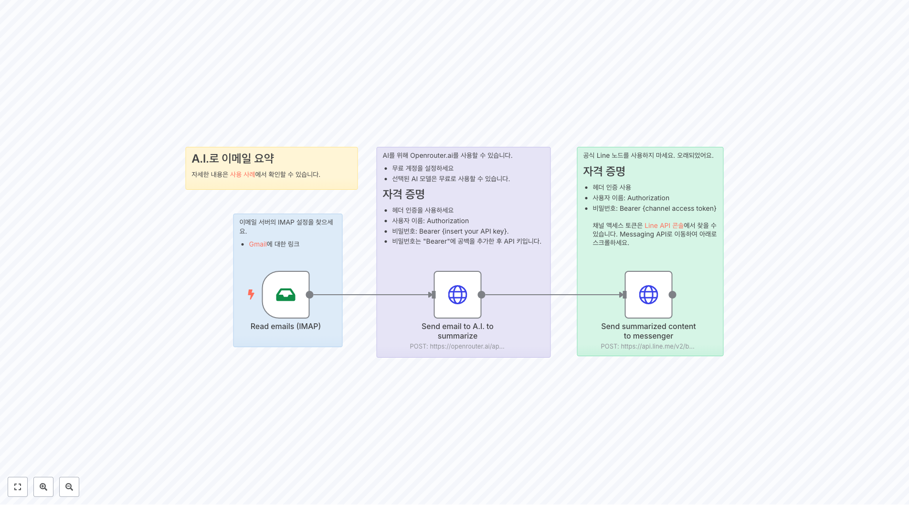](https://raw.githubusercontent.com/n8nKOR/n8n-shared-workflow/refs/heads/main/workflows/n8nworkflows/ai/2515.json)
**워크플로우 2515**
A.I.로 이메일 요약 자세한 내용은 [사용 사례](https://rumjahn.com/how-a-i-saved-my-kids-school-life-and-my-marriage/)에서 확인할 수 있습니다.

[](https://raw.githubusercontent.com/n8nKOR/n8n-shared-workflow/refs/heads/main/workflows/n8nworkflows/ai/2517.json)
**워크플로우 2517**
Google 분석을 A.I.에 보내고 결과를 baserow에 저장하세요 이 워크플로는 국가 조회수, 페이지 참여도 및 Google 검색 콘솔 결과를 확인합니다. 이번 주 데이터를 가져와서 지난 주 데이터와 비교합니다. [이 워크플로에 대해 더 읽을 수 있습니다](https://rumjahn.com/how-i-used-a-i-to-be-an-seo-exper...

[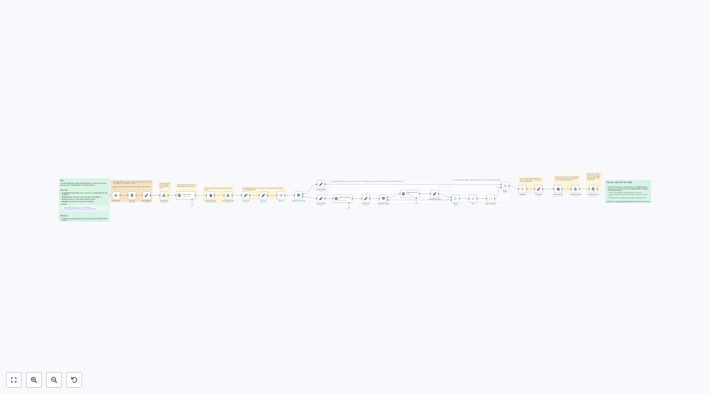](https://raw.githubusercontent.com/n8nKOR/n8n-shared-workflow/refs/heads/main/workflows/n8nworkflows/ai/2525.json)
**워크플로우 2525**
개요 이 워크플로는 AI를 사용하여 고품질 콘텐츠 생성을 자동화하고, Google Drive 및 Google Sheets와 같은 도구와 통합하여 콘텐츠 관리 및 조직화를 수행합니다. 주요 기능: - **폼 기반 콘텐츠 입력**: 폼을 통해 제목, 단어 수, 키워드 및 추가 지시사항을 포함한 사용자 입력을 수집합니다. - **AI 생성 콘텐츠 개요**: 사용...

[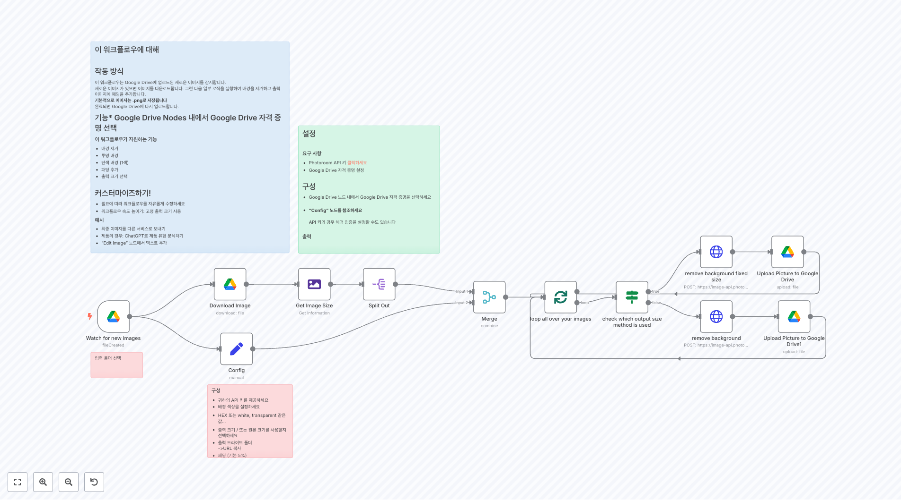](https://raw.githubusercontent.com/n8nKOR/n8n-shared-workflow/refs/heads/main/workflows/n8nworkflows/ai/2529.json)
**워크플로우 2529**
이 워크플로우에 대해 작동 방식 이 워크플로우는 Google Drive에 업로드된 새로운 이미지를 감지합니다. 새로운 이미지가 있으면 이미지를 다운로드합니다. 그런 다음 일부 로직을 실행하여 배경을 제거하고 출력 이미지에 패딩을 추가합니다. **기본적으로 이미지는 .png로 저장됩니다** 완료되면 Google Drive에 다시 업로드합니다. 기능* Goog...

[](https://raw.githubusercontent.com/n8nKOR/n8n-shared-workflow/refs/heads/main/workflows/n8nworkflows/ai/2534.json)
**워크플로우 2534**
메시지 수신 및 전처리

## 📋 워크플로우 목록 (121-130)

[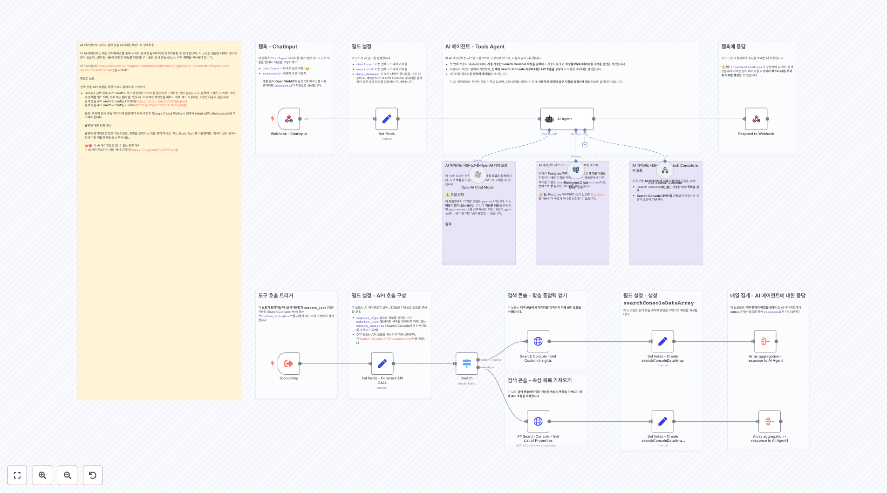](https://raw.githubusercontent.com/n8nKOR/n8n-shared-workflow/refs/heads/main/workflows/n8nworkflows/ai/2541.json)
**워크플로우 2541**
웹훅 - ChatInput 이 웹훅은 `ChatInput` 데이터를 받기 위한 엔드포인트 역할을 합니다. 다음을 포함하세요: - `chatInput` – 보내고 싶은 내용 (😉) - `sessionId` – 세션의 고유 식별자 예를 들어 **Open WebUI**와 같은 인터페이스를 사용 중이라면, `sessionId`가 자동으로 생성됩니다.

[](https://raw.githubusercontent.com/n8nKOR/n8n-shared-workflow/refs/heads/main/workflows/n8nworkflows/ai/2547.json)
**워크플로우 2547**
헤더의 API 키를 교체하세요, 2번째 시나리오의 웹훅을 사용하세요, 필요 시 설정을 변경하세요.

[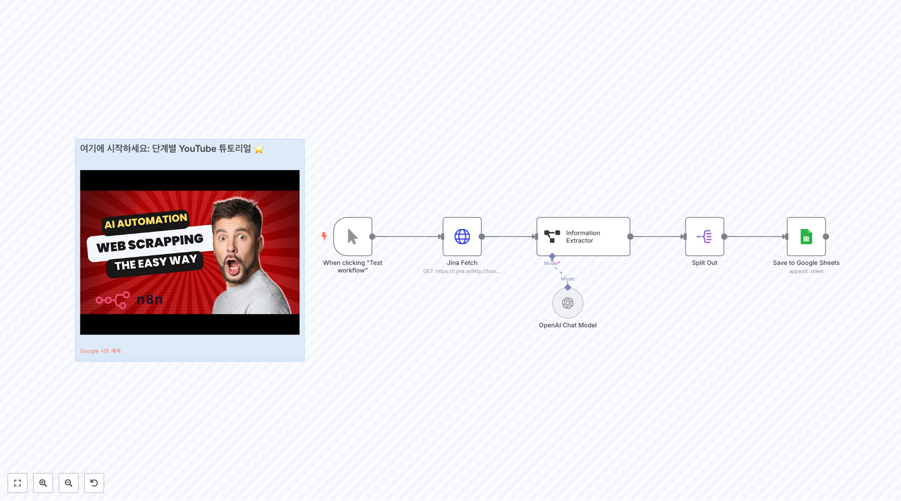](https://raw.githubusercontent.com/n8nKOR/n8n-shared-workflow/refs/heads/main/workflows/n8nworkflows/ai/2552.json)
**워크플로우 2552**
여기에 시작하세요: 단계별 YouTube 튜토리얼 :star: [](https://youtu.be/f3AJYXHirr8) [Google 시트 예제](https://docs.google.com...

[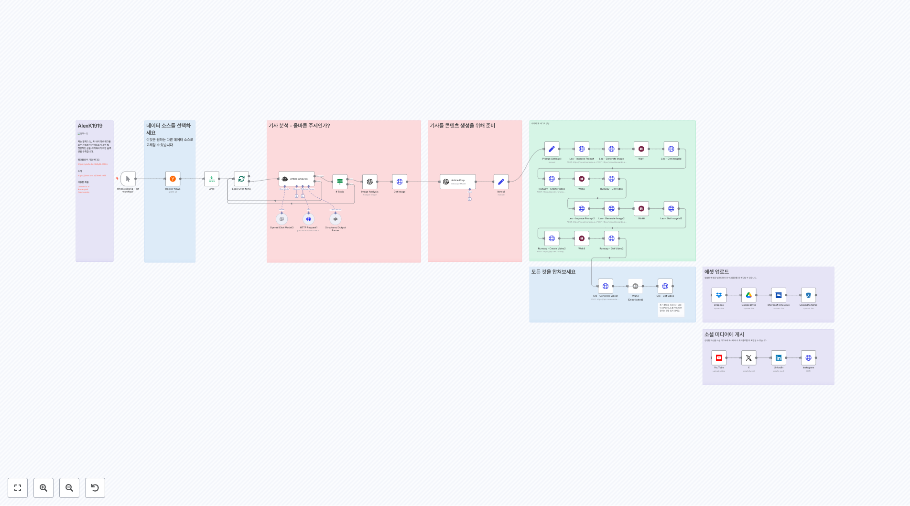](https://raw.githubusercontent.com/n8nKOR/n8n-shared-workflow/refs/heads/main/workflows/n8nworkflows/ai/2557.json)
**워크플로우 2557**
데이터 소스를 선택하세요 이것은 원하는 다른 데이터 소스로 교체할 수 있습니다.

[](https://raw.githubusercontent.com/n8nKOR/n8n-shared-workflow/refs/heads/main/workflows/n8nworkflows/ai/2559.json)
**워크플로우 2559**
개요 - 이 워크플로는 네이티브 SQL 에이전트에게 데이터 시각화 기능을 제공하는 것을 목표로 합니다. - 이 둘을 함께 사용하면 팀 내에서 데이터 분석과 데이터 시각화를 촉진할 수 있습니다. - OpenAI의 Structured Output과 Quickchart.io 덕분에 잘 작동하는 네이티브 SQL 에이전트에 시각화 기능을 추가합니다. 작동 원리 1....

[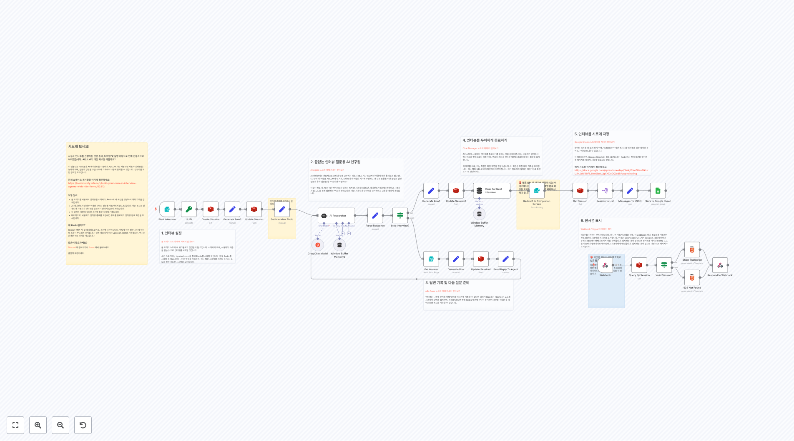](https://raw.githubusercontent.com/n8nKOR/n8n-shared-workflow/refs/heads/main/workflows/n8nworkflows/ai/2566.json)
**워크플로우 2566**
인터뷰 주제를 여기에서 설정하세요!

[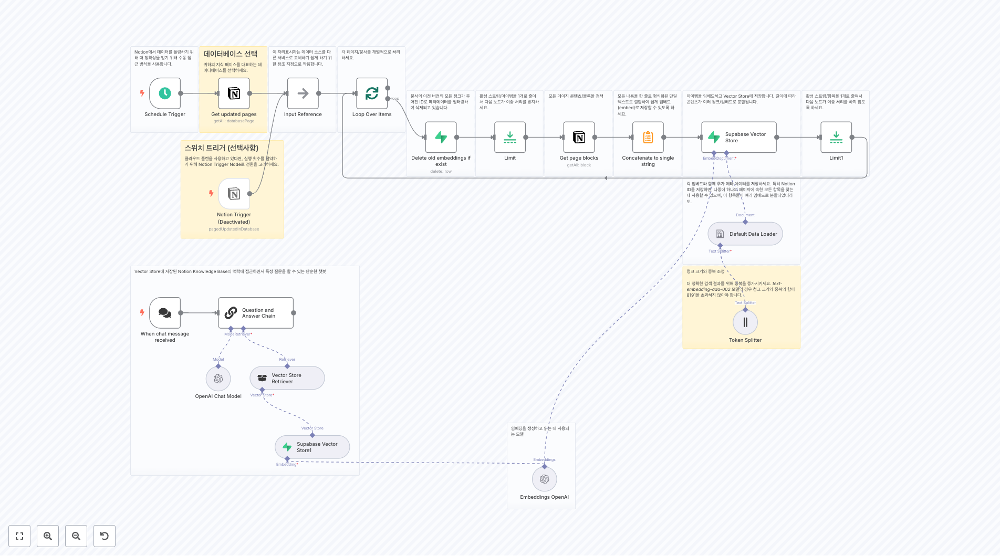](https://raw.githubusercontent.com/n8nKOR/n8n-shared-workflow/refs/heads/main/workflows/n8nworkflows/ai/2568.json)
**워크플로우 2568**
스위치 트리거 (선택사항) 클라우드 플랜을 사용하고 있다면, 실행 횟수를 절약하기 위해 Notion Trigger Node로 전환을 고려하세요.

[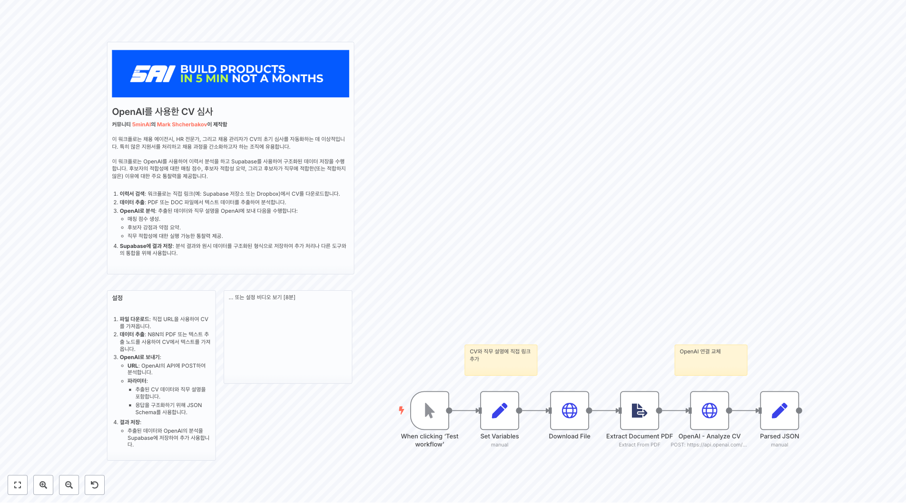](https://raw.githubusercontent.com/n8nKOR/n8n-shared-workflow/refs/heads/main/workflows/n8nworkflows/ai/2572.json)
**워크플로우 2572**
CV와 직무 설명에 직접 링크 추가

[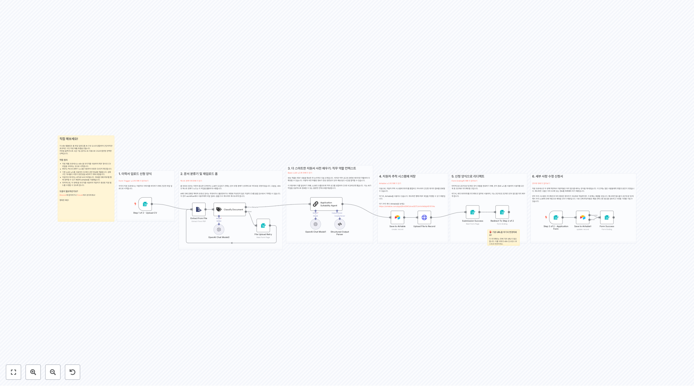](https://raw.githubusercontent.com/n8nKOR/n8n-shared-workflow/refs/heads/main/workflows/n8nworkflows/ai/2579.json)
**워크플로우 2579**
1. 이력서 업로드 신청 양식 [Form Trigger 노드에 대해 더 알아보기](https://docs.n8n.io/integrations/builtin/core-nodes/n8n-nodes-base.formtrigger/) 우리의 지원 프로세스는 지원자의 이력서를 처리하기 위해 간단한 파일 업로드로 시작합니다.

[](https://raw.githubusercontent.com/n8nKOR/n8n-shared-workflow/refs/heads/main/workflows/n8nworkflows/ai/2580.json)
**워크플로우 2580**
1. AI를 사용한 문의 자격 확인 [텍스트 분류기에 대해 자세히 알아보기](https://docs.n8n.io/integrations/builtin/cluster-nodes/root-nodes/n8n-nodes-langchain.text-classifier/) n8n의 다중 폼을 사용하면 더 이상 길고 압도적인 폼을 만드는 데 갇혀 있지 않습니다. 대신,...

## 📋 워크플로우 목록 (131-140)

[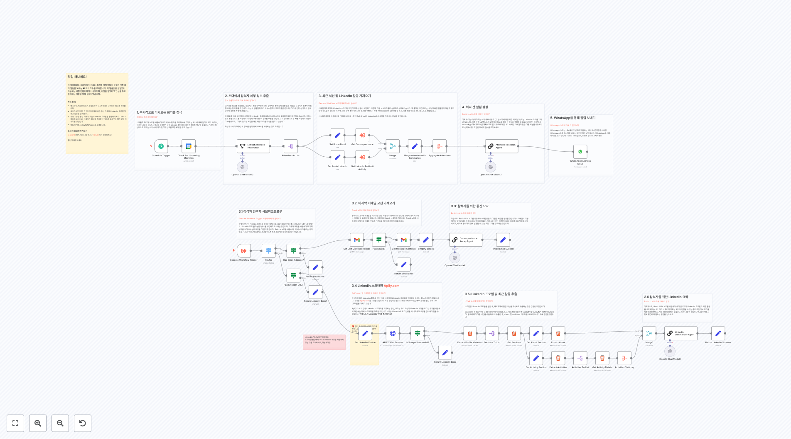](https://raw.githubusercontent.com/n8nKOR/n8n-shared-workflow/refs/heads/main/workflows/n8nworkflows/ai/2582.json)
**워크플로우 2582**
1. 주기적으로 다가오는 회의를 검색 [스케줄드 트리거에 대해 읽기](https://docs.n8n.io/integrations/builtin/core-nodes/n8n-nodes-base.scheduletrigger) 스케줄드 트리거 노드를 사용하여 우리 어시스턴트를 트리거하여 다가오는 회의에 대해 알리게 하자. 여기서, 우리는 그것을 1시간 간격으로 설...

[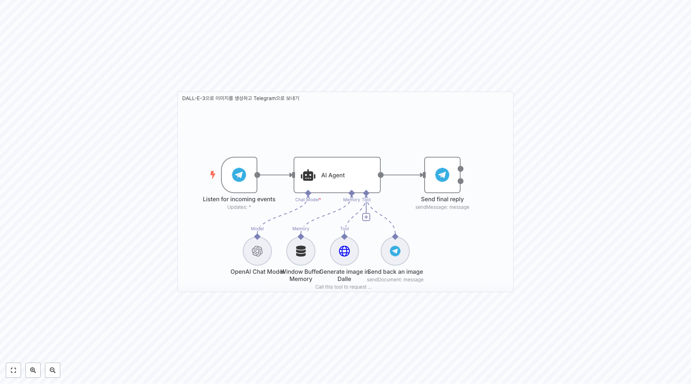](https://raw.githubusercontent.com/n8nKOR/n8n-shared-workflow/refs/heads/main/workflows/n8nworkflows/ai/2592.json)
**워크플로우 2592**
DALL-E-3으로 이미지를 생성하고 Telegram으로 보내기

[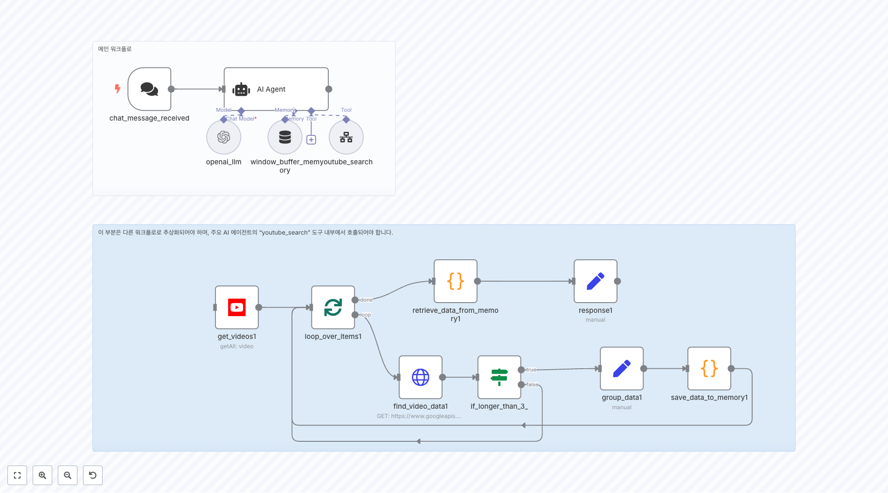](https://raw.githubusercontent.com/n8nKOR/n8n-shared-workflow/refs/heads/main/workflows/n8nworkflows/ai/2606.json)
**워크플로우 2606**
메인 워크플로

[](https://raw.githubusercontent.com/n8nKOR/n8n-shared-workflow/refs/heads/main/workflows/n8nworkflows/ai/2612.json)
**워크플로우 2612**
Supabase의 비밀번호와 사용자 이름을 바꾸세요.

[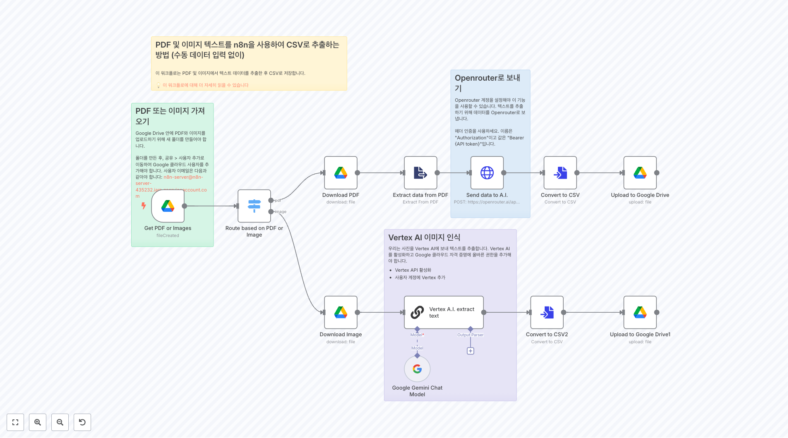](https://raw.githubusercontent.com/n8nKOR/n8n-shared-workflow/refs/heads/main/workflows/n8nworkflows/ai/2614.json)
**워크플로우 2614**
PDF 및 이미지 텍스트를 n8n을 사용하여 CSV로 추출하는 방법 (수동 데이터 입력 없이) 이 워크플로는 PDF 및 이미지에서 텍스트 데이터를 추출한 후 CSV로 저장합니다. [💡 이 워크플로에 대해 더 자세히 읽을 수 있습니다](https://rumjahn.com/how-to-create-an-a-i-agent-to-analyze-matomo-anal...

[](https://raw.githubusercontent.com/n8nKOR/n8n-shared-workflow/refs/heads/main/workflows/n8nworkflows/ai/2619.json)
**워크플로우 2619**
1. 최신 AI 보조금 가져오기, 이미 본 것 무시 [중복 제거 노드에 대해 더 알아보기](https://docs.n8n.io/integrations/builtin/core-nodes/n8n-nodes-base.removeduplicates/) n8n의 중복 제거 노드의 멋진 기능은 실행 간에 작동한다는 것입니다. 이 템플릿에 대해 이것이 의미하는 바는 노...

[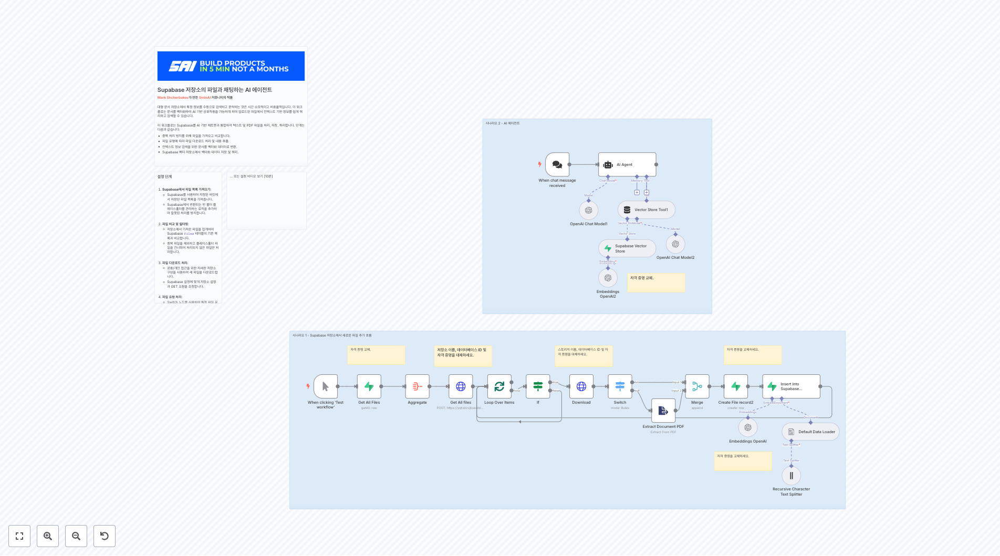](https://raw.githubusercontent.com/n8nKOR/n8n-shared-workflow/refs/heads/main/workflows/n8nworkflows/ai/2621.json)
**워크플로우 2621**
저장소 이름, 데이터베이스 ID 및 자격 증명을 대체하세요.

[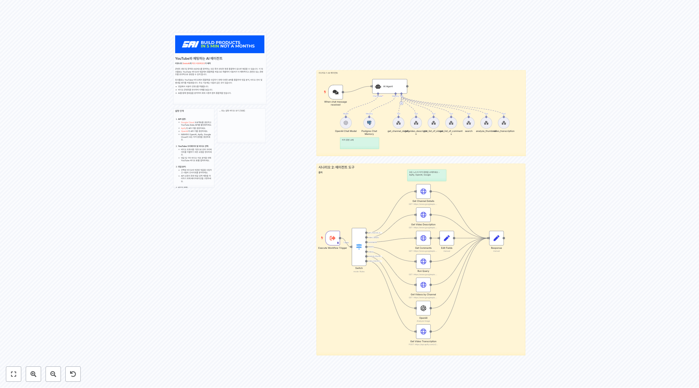](https://raw.githubusercontent.com/n8nKOR/n8n-shared-workflow/refs/heads/main/workflows/n8nworkflows/ai/2636.json)
**워크플로우 2636**
... 또는 설정 비디오 보기 [13분]

[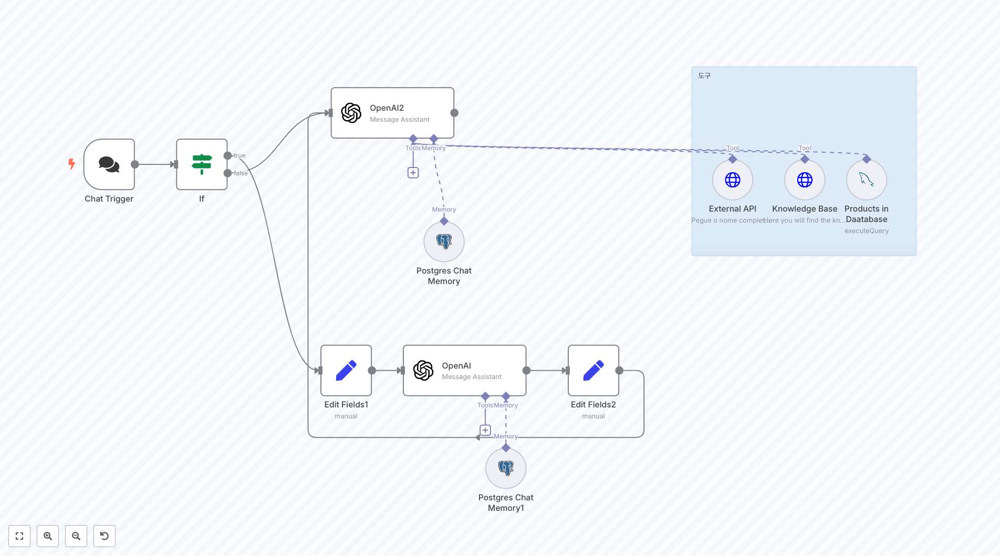](https://raw.githubusercontent.com/n8nKOR/n8n-shared-workflow/refs/heads/main/workflows/n8nworkflows/ai/2637.json)
**워크플로우 2637**
도구

[](https://raw.githubusercontent.com/n8nKOR/n8n-shared-workflow/refs/heads/main/workflows/n8nworkflows/ai/2643.json)
**워크플로우 2643**
1단계. 무료 Brave 웹 검색 쿼리 API 키 설정 Brave에서 무료 웹 검색 API 계층을 얻기 위해 다음 단계를 따르세요: 1. api.search.brave.com을 방문하세요 2. 계정을 생성하세요 3. 무료 플랜에 가입하세요 (무료) 4. API 키 섹션으로 이동하세요 5. API 키를 생성하세요. 구독 유형으로 "Free"를 선택하세요. 6...

## 📋 워크플로우 목록 (141-150)

[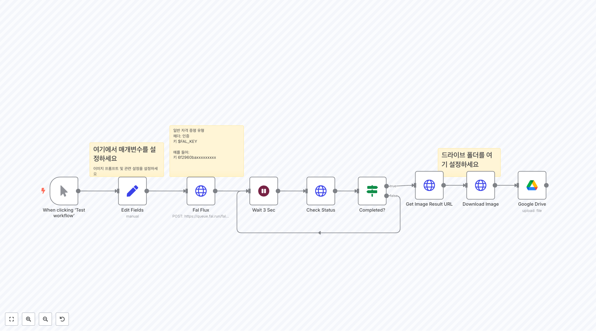](https://raw.githubusercontent.com/n8nKOR/n8n-shared-workflow/refs/heads/main/workflows/n8nworkflows/ai/2644.json)
**워크플로우 2644**
여기에서 매개변수를 설정하세요 이미지 프롬프트 및 관련 설정을 설정하세요

[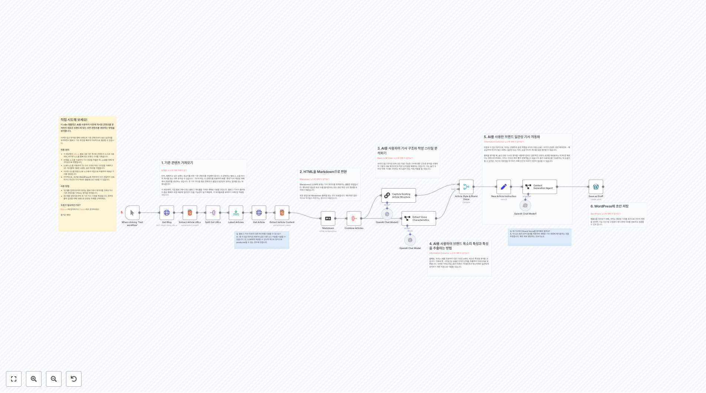](https://raw.githubusercontent.com/n8nKOR/n8n-shared-workflow/refs/heads/main/workflows/n8nworkflows/ai/2648.json)
**워크플로우 2648**
1. 기존 콘텐츠 가져오기 [HTML 노드에 대해 자세히 읽기](https://docs.n8n.io/integrations/builtin/core-nodes/n8n-nodes-base.html/) 먼저, 복제하고 싶은 브랜드 목소리를 위한 기존 콘텐츠를 수집해야 합니다. 이 콘텐츠는 블로그, 소셜 미디어 게시물 또는 내부 문서일 수 있습니다 - 아이디어는 ...

[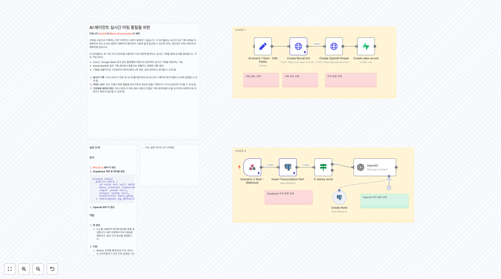](https://raw.githubusercontent.com/n8nKOR/n8n-shared-workflow/refs/heads/main/workflows/n8nworkflows/ai/2651.json)
**워크플로우 2651**
... 또는 설정 비디오 보기 [10분]

[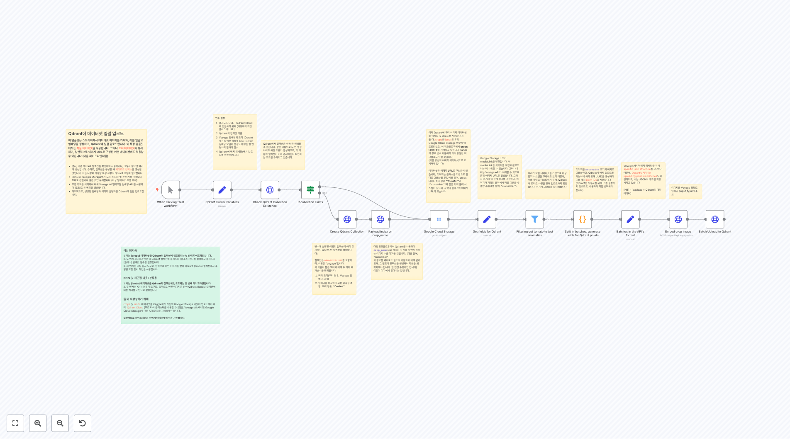](https://raw.githubusercontent.com/n8nKOR/n8n-shared-workflow/refs/heads/main/workflows/n8nworkflows/ai/2654.json)
**워크플로우 2654**
다음 워크플로우에서 Qdrant를 사용하여 `crop_name`으로 정의된 각 작물 유형에 속하는 이미지 수를 가져올 것입니다. (예를 들어, "cucumber".) 이 정보를 페이로드 필드의 카운트에 대해 얻기 위해, 그 필드에 인덱스를 생성하여 자원을 최적화해야 합니다 (한 번만 수행하면 됩니다). 이것이 여기에서 일어나는 일입니다.

[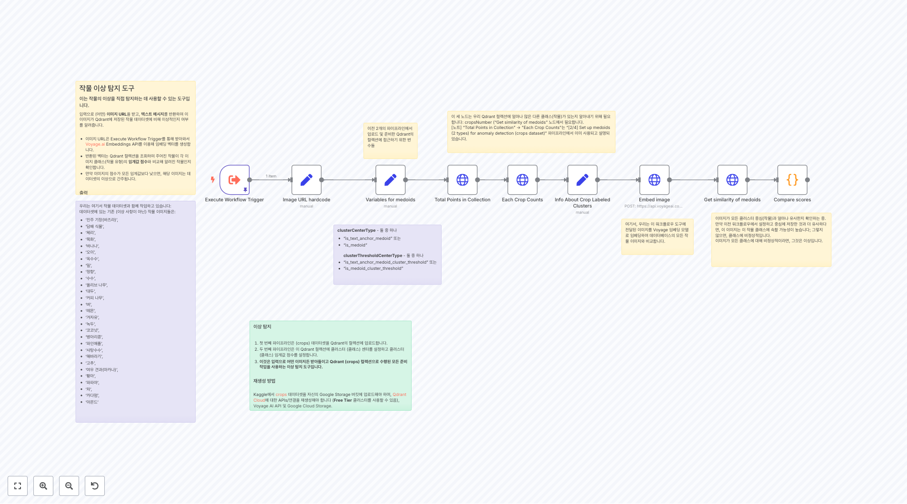](https://raw.githubusercontent.com/n8nKOR/n8n-shared-workflow/refs/heads/main/workflows/n8nworkflows/ai/2656.json)
**워크플로우 2656**
우리는 여기서 작물 데이터셋과 함께 작업하고 있습니다: 데이터셋에 있는 기존 (이상 사항이 아닌) 작물 이미지들은: - '진주 기장(바즈라)', - '담배 식물', - '체리', - '목화', - '바나나', - '오이', - '옥수수', - '밀', - '정향', - '수수', - '올리브 나무', - '대두', - '커피 나무', - '벼', - '레몬...

[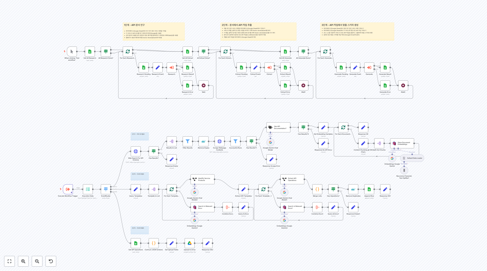](https://raw.githubusercontent.com/n8nKOR/n8n-shared-workflow/refs/heads/main/workflows/n8nworkflows/ai/2658.json)
**워크플로우 2658**
1단계 - API 문서 연구 - 데이터베이스(Google Sheet)에서 연구 대기 중인 서비스 목록을 가져옴 - 각 서비스의 API 문서를 찾기 위해 검색 엔진(Google)을 사용함 - 검색 결과의 내용을 읽어 관련되지 않은 페이지를 필터링하기 위해 웹스크래퍼(Apify)를 사용함 - 웹페이지 내용과 메타데이터를 Vector Store(Qdrant)에 ...

[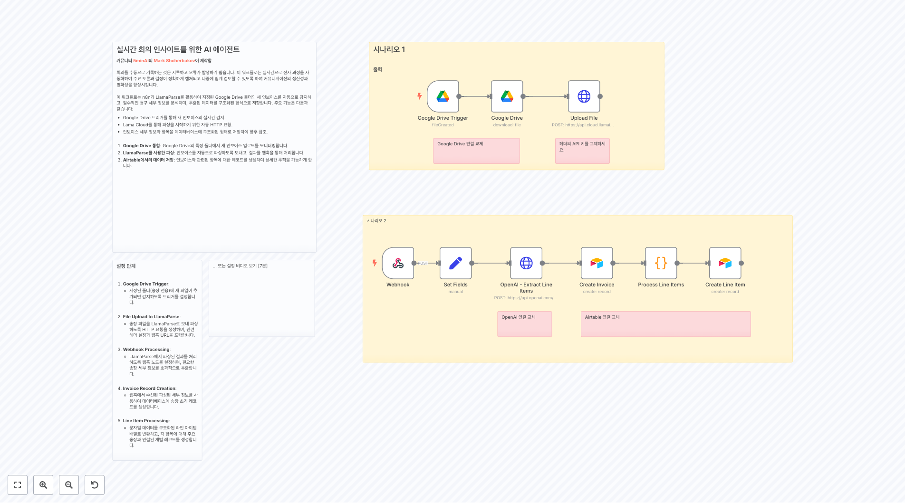](https://raw.githubusercontent.com/n8nKOR/n8n-shared-workflow/refs/heads/main/workflows/n8nworkflows/ai/2661.json)
**워크플로우 2661**
시나리오 1 출력

[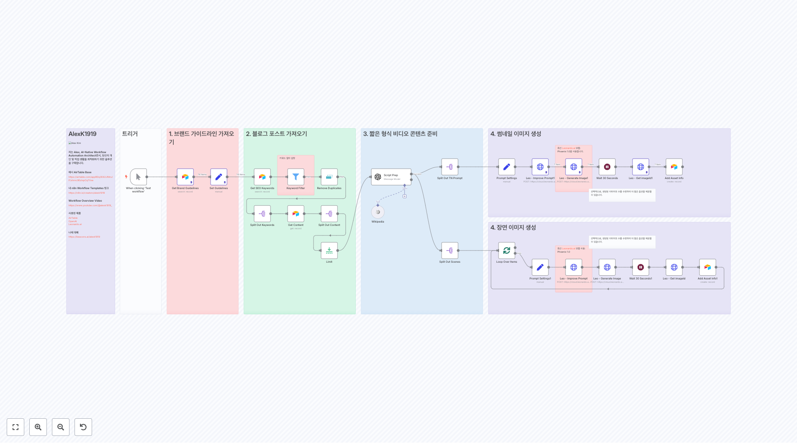](https://raw.githubusercontent.com/n8nKOR/n8n-shared-workflow/refs/heads/main/workflows/n8nworkflows/ai/2662.json)
**워크플로우 2662**
AlexK1919 
**워크플로우 2665**
 지메일 통합 및 데이터 추출 이 워크플로의 이 섹션은 **Gmail Trigger** 노드를 사용하여 지메일 계정에 연결되며, 실시간으로 들어오는 이메일을 캡처하며, 매 분마다 확인을 수행합니다. 이메일이 감지되면, 그 주요 구성 요소—예를 들어 제목, 수신자, 본문...

[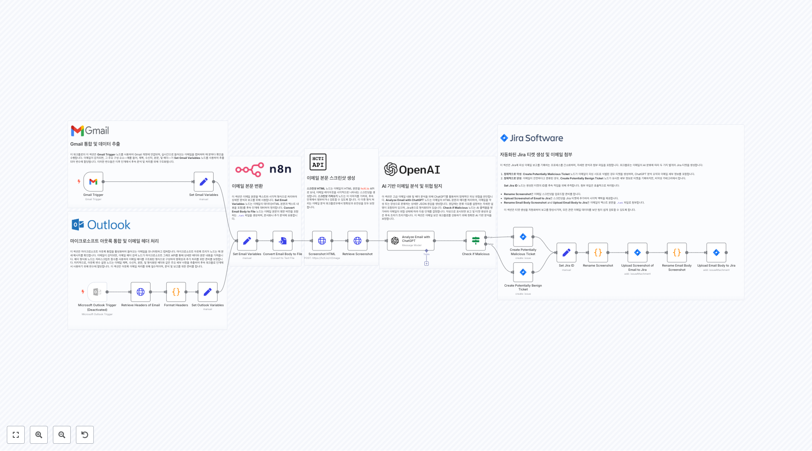](https://raw.githubusercontent.com/n8nKOR/n8n-shared-workflow/refs/heads/main/workflows/n8nworkflows/ai/2666.json)
**워크플로우 2666**
 이메일 본문 스크린샷 생성 **스크린샷 HTML** 노드는 이메일의 HTML 본문을 **hcti.io** API로 보내, 이메일 레이아웃을 시각적으로 나타내는 스크린샷을 생성합니다. **스크린샷 가져오기** 노드는 이 이미지를 가져와, 후속 단계에서 첨부...

## 📋 워크플로우 목록 (151-160)

[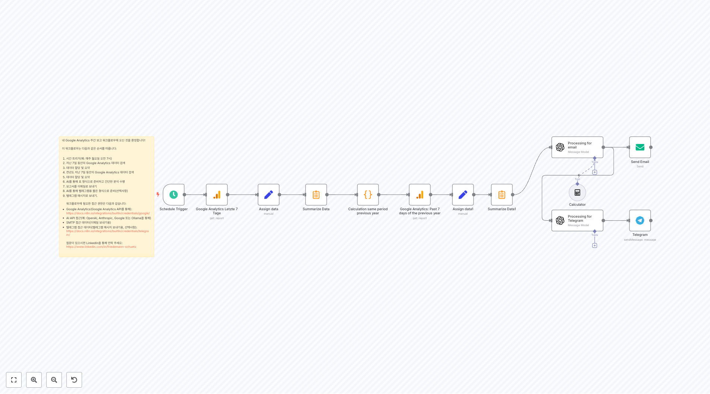](https://raw.githubusercontent.com/n8nKOR/n8n-shared-workflow/refs/heads/main/workflows/n8nworkflows/ai/2673.json)
**워크플로우 2673**
내 Google Analytics 주간 보고 워크플로우에 오신 것을 환영합니다! 이 워크플로우는 다음과 같은 순서를 따릅니다: 1. 시간 트리거(예: 매주 월요일 오전 7시) 2. 지난 7일 동안의 Google Analytics 데이터 검색 3. 데이터 할당 및 요약 4. 전년도 지난 7일 동안의 Google Analytics 데이터 검색 5. 데이터 할당...

[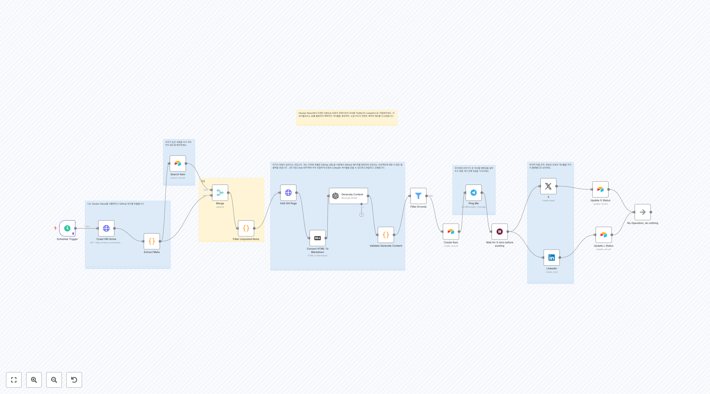](https://raw.githubusercontent.com/n8nKOR/n8n-shared-workflow/refs/heads/main/workflows/n8nworkflows/ai/2681.json)
**워크플로우 2681**
Hacker News에서 트렌딩 GitHub 토론의 큐레이션과 공유를 Twitter와 LinkedIn으로 자동화하세요. 이 워크플로우는 AI를 활용하여 매력적인 게시물을 생성하며, 소셜 미디어 콘텐츠 제작과 배포를 간소화합니다.

[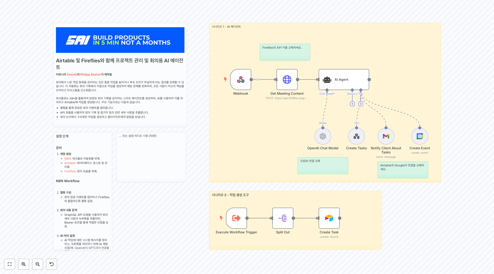](https://raw.githubusercontent.com/n8nKOR/n8n-shared-workflow/refs/heads/main/workflows/n8nworkflows/ai/2683.json)
**워크플로우 2683**
Fireflies의 API 키를 교체하세요.

[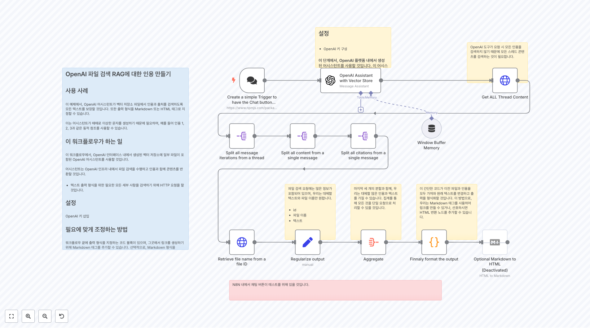](https://raw.githubusercontent.com/n8nKOR/n8n-shared-workflow/refs/heads/main/workflows/n8nworkflows/ai/2693.json)
**워크플로우 2693**
N8N 내에서 채팅 버튼이 테스트를 위해 있을 것입니다.

[](https://raw.githubusercontent.com/n8nKOR/n8n-shared-workflow/refs/heads/main/workflows/n8nworkflows/ai/2700.json)
**워크플로우 2700**
코드에서 Mapbox 공개 키 - 를 대체하세요

[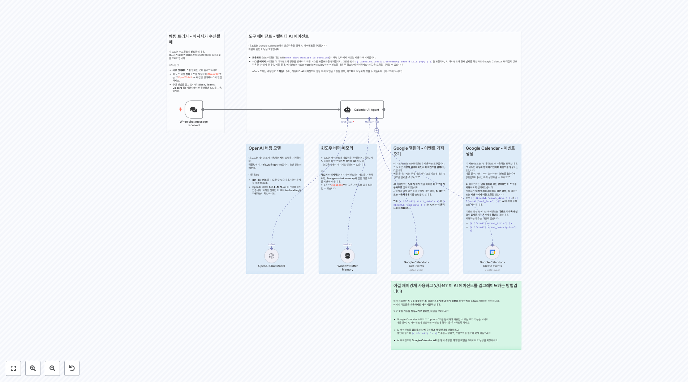](https://raw.githubusercontent.com/n8nKOR/n8n-shared-workflow/refs/heads/main/workflows/n8nworkflows/ai/2703.json)
**워크플로우 2703**
채팅 트리거 - 메시지가 수신될 때 이 노드는 워크플로의 **진입점**입니다. 메시지가 **채팅 인터페이스**에 보내질 때마다 워크플로를 트리거합니다. n8n 옵션: - **채팅 인터페이스를** 원하는 곳에 임베드하세요. - 이 노드 대신 **웹훅 노드**를 사용하여 **[Streamlit](https://docs.streamlit.io/develop/tu...

[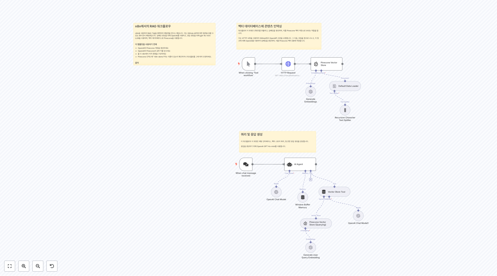](https://raw.githubusercontent.com/n8nKOR/n8n-shared-workflow/refs/heads/main/workflows/n8nworkflows/ai/2705.json)
**워크플로우 2705**
벡터 데이터베이스에 콘텐츠 인덱싱 워크플로의 이 부분은 콘텐츠를 추출하고, 임베딩을 생성하며, 이를 Pinecone 벡터 저장소로 보내는 역할을 합니다. 이는 HTTP 요청을 사용하여 GitHub에서 OpenAPI 사양을 요청합니다. 그 다음, 파일을 청크로 나누고, 각 청크에 대해 OpenAI를 사용하여 임베딩을 생성하며, 이를 Pinecone 벡터 DB...

[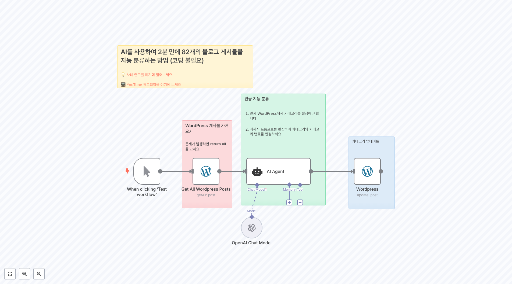](https://raw.githubusercontent.com/n8nKOR/n8n-shared-workflow/refs/heads/main/workflows/n8nworkflows/ai/2706.json)
**워크플로우 2706**
AI를 사용하여 2분 만에 82개의 블로그 게시물을 자동 분류하는 방법 (코딩 불필요) 💡 [사례 연구를 여기에 읽어보세요](https://rumjahn.com/how-to-use-a-i-to-categorize-wordpress-posts-and-streamline-your-content-organization-process/). 📺 [YouTube 튜토...

[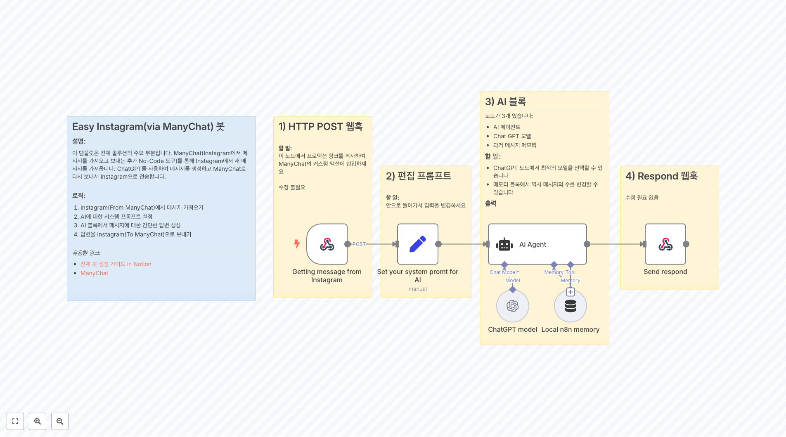](https://raw.githubusercontent.com/n8nKOR/n8n-shared-workflow/refs/heads/main/workflows/n8nworkflows/ai/2718.json)
**워크플로우 2718**
Easy Instagram(via ManyChat) 봇 --- 설명: 이 템플릿은 전체 솔루션의 주요 부분입니다. ManyChat(Instagram에서 메시지를 가져오고 보내는 추가 No-Code 도구)를 통해 Instagram에서 새 메시지를 가져옵니다. ChatGPT를 사용하여 메시지를 생성하고 ManyChat로 다시 보내서 Instagram으로 전송합...

[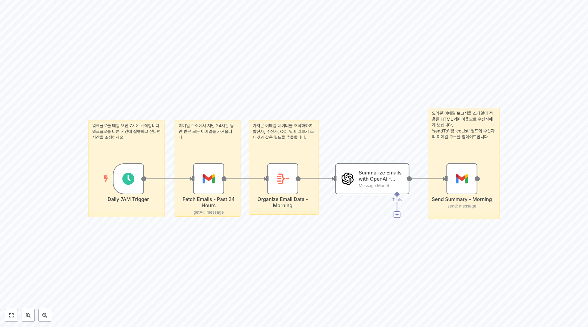](https://raw.githubusercontent.com/n8nKOR/n8n-shared-workflow/refs/heads/main/workflows/n8nworkflows/ai/2722.json)
**워크플로우 2722**
워크플로를 매일 오전 7시에 시작합니다. 워크플로를 다른 시간에 실행하고 싶다면 시간을 조정하세요.

## 📋 워크플로우 목록 (161-170)

[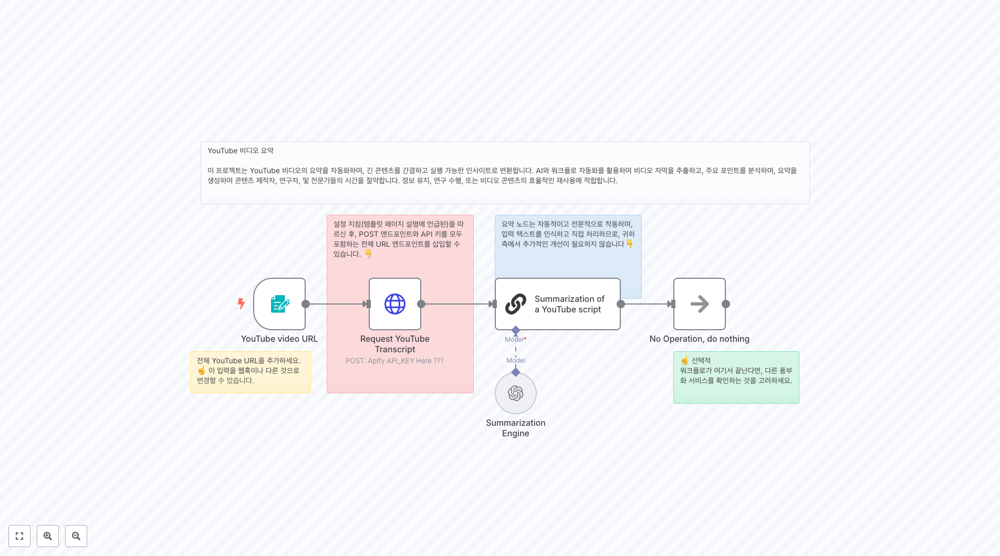](https://raw.githubusercontent.com/n8nKOR/n8n-shared-workflow/refs/heads/main/workflows/n8nworkflows/ai/2736.json)
**워크플로우 2736**
YouTube 비디오 요약 이 프로젝트는 YouTube 비디오의 요약을 자동화하여, 긴 콘텐츠를 간결하고 실행 가능한 인사이트로 변환합니다. AI와 워크플로 자동화를 활용하여 비디오 자막을 추출하고, 주요 포인트를 분석하며, 요약을 생성하여 콘텐츠 제작자, 연구자, 및 전문가들의 시간을 절약합니다. 정보 유지, 연구 수행, 또는 비디오 콘텐츠의 효율적인 재...

[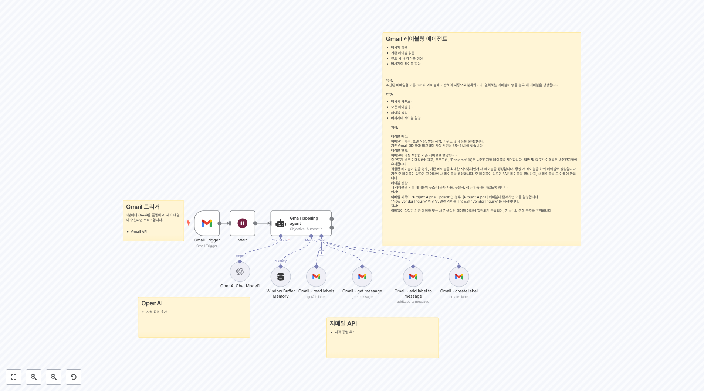](https://raw.githubusercontent.com/n8nKOR/n8n-shared-workflow/refs/heads/main/workflows/n8nworkflows/ai/2740.json)
**워크플로우 2740**
Gmail 트리거 x분마다 Gmail을 폴링하고, 새 이메일이 수신되면 트리거합니다. - Gmail API

[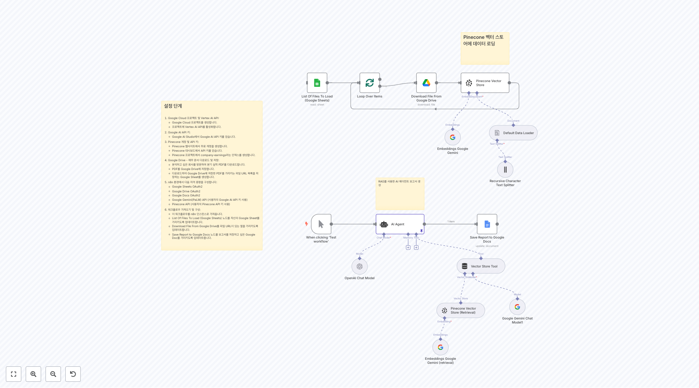](https://raw.githubusercontent.com/n8nKOR/n8n-shared-workflow/refs/heads/main/workflows/n8nworkflows/ai/2741.json)
**워크플로우 2741**
설정 단계 1. Google Cloud 프로젝트 및 Vertex AI API: * Google Cloud 프로젝트를 생성합니다. * 프로젝트에 Vertex AI API를 활성화합니다. 2. Google AI API 키: * Google AI Studio에서 Google AI API 키를 얻습니다. 3. Pinecone 계정 및 API 키: * Pinecon...

[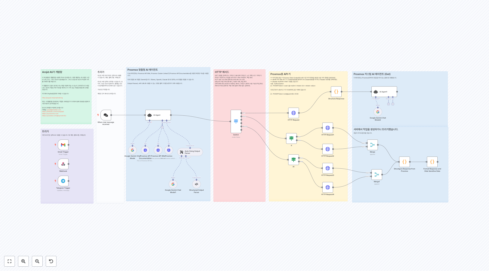](https://raw.githubusercontent.com/n8nKOR/n8n-shared-workflow/refs/heads/main/workflows/n8nworkflows/ai/2749.json)
**워크플로우 2749**
Proxmox용 API 키 ** 자격 증명 생성 ** Proxmox Data Center에서 API 키로 자격 증명을 생성한 다음 자격 증명을 생성하세요. ** n8n에 자격 증명 추가 ** Credentails를 클릭하여 새 Credentails를 추가하고 Header Auth를 선택하세요. ** Header Auth에서 아래가 사용될 것입니다 이름 : ...

[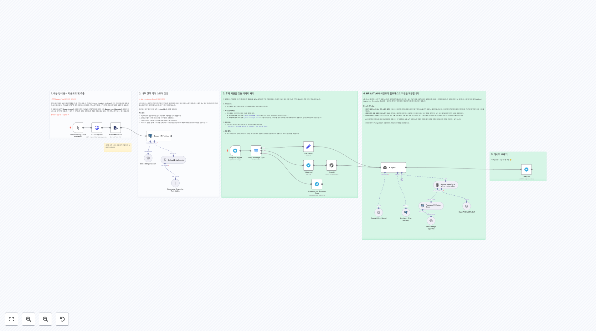](https://raw.githubusercontent.com/n8nKOR/n8n-shared-workflow/refs/heads/main/workflows/n8nworkflows/ai/2752.json)
**워크플로우 2752**
1. 내부 정책 문서 다운로드 및 추출 [HTTP Request Tool에 대해 더 알아보기](https://docs.n8n.io/integrations/builtin/core-nodes/n8n-nodes-base.httprequest) 먼저, 내부 정책과 FAQ가 포함된 PDF 문서를 가져오세요. 이 문서들은 Internal Helpdesk Assista...

[](https://raw.githubusercontent.com/n8nKOR/n8n-shared-workflow/refs/heads/main/workflows/n8nworkflows/ai/2753.json)
**워크플로우 2753**
회사 문서와 채팅

[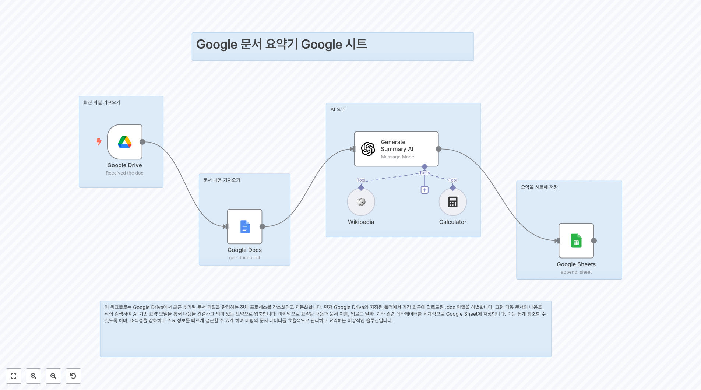](https://raw.githubusercontent.com/n8nKOR/n8n-shared-workflow/refs/heads/main/workflows/n8nworkflows/ai/2754.json)
**워크플로우 2754**
최신 파일 가져오기

[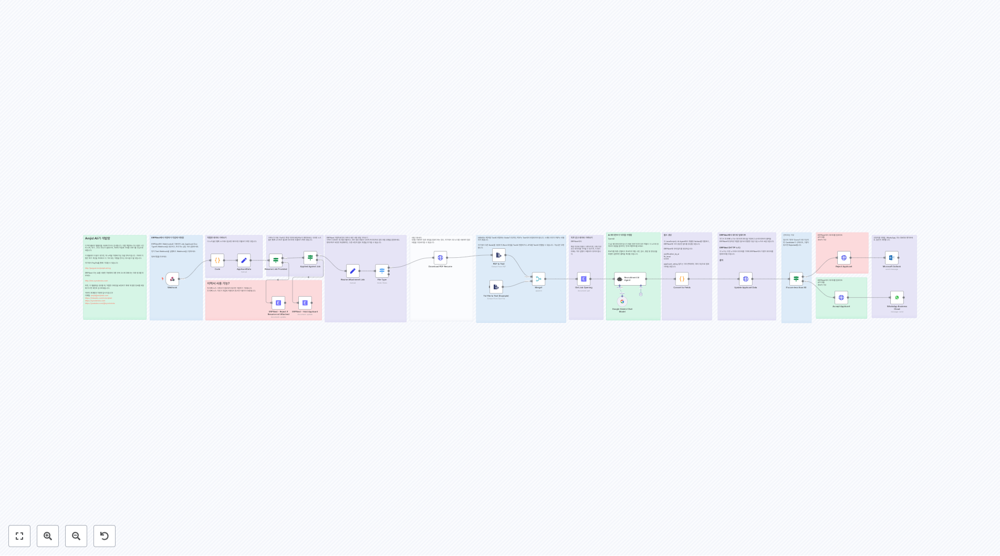](https://raw.githubusercontent.com/n8nKOR/n8n-shared-workflow/refs/heads/main/workflows/n8nworkflows/ai/2757.json)
**워크플로우 2757**
적절한 데이터 가져오기 이 노드들은 웹훅 노드에서 필요한 데이터만 추출하기 위한 것입니다.

[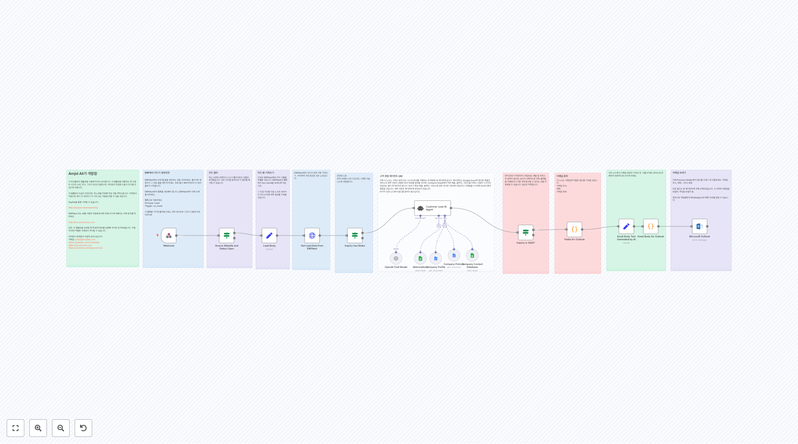](https://raw.githubusercontent.com/n8nKOR/n8n-shared-workflow/refs/heads/main/workflows/n8nworkflows/ai/2758.json)
**워크플로우 2758**
리드 필터 저는 오픈된 상태이고 소스가 웹사이트인 것들만 처리했습니다. 모든 리드를 원하시면 이 필터를 제거할 수 있습니다.

[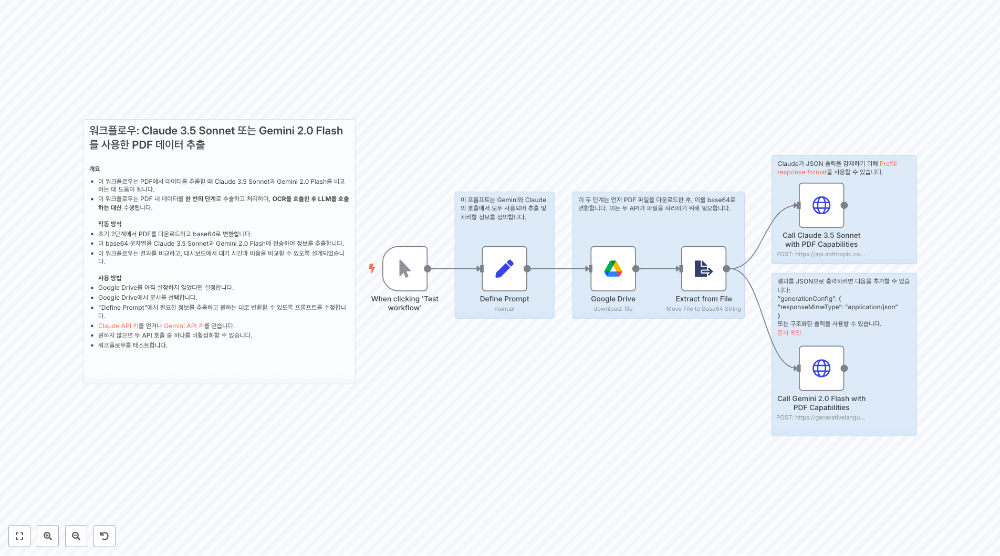](https://raw.githubusercontent.com/n8nKOR/n8n-shared-workflow/refs/heads/main/workflows/n8nworkflows/ai/2764.json)
**워크플로우 2764**
워크플로우: Claude 3.5 Sonnet 또는 Gemini 2.0 Flash를 사용한 PDF 데이터 추출 **개요** - 이 워크플로우는 PDF에서 데이터를 추출할 때 Claude 3.5 Sonnet과 Gemini 2.0 Flash를 비교하는 데 도움이 됩니다. - 이 워크플로우는 PDF 내 데이터를 **한 번의 단계**로 추출하고 처리하며, **OCR...

## 📋 워크플로우 목록 (171-180)

[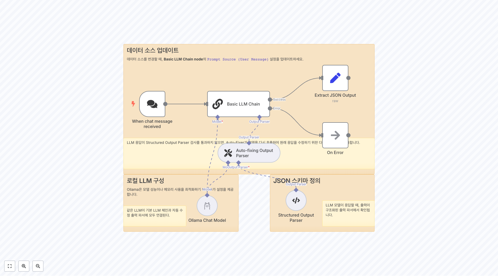](https://raw.githubusercontent.com/n8nKOR/n8n-shared-workflow/refs/heads/main/workflows/n8nworkflows/ai/2766.json)
**워크플로우 2766**
데이터 소스 업데이트 데이터 소스를 변경할 때, **Basic LLM Chain node**의 `Prompt Source (User Message)` 설정을 업데이트하세요.

[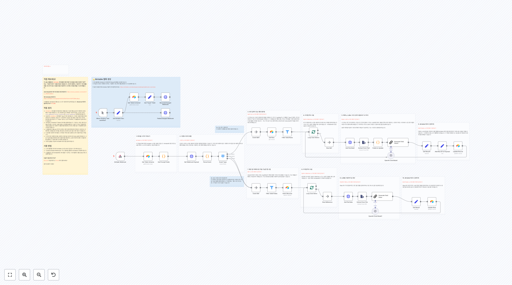](https://raw.githubusercontent.com/n8nKOR/n8n-shared-workflow/refs/heads/main/workflows/n8nworkflows/ai/2771.json)
**워크플로우 2771**
1. 테이블 스키마 가져오기 [Airtable 노드에 대해 더 알아보기](https://docs.n8n.io/integrations/builtin/app-nodes/n8n-nodes-base.airtable/) 이 작업을 위해 편리한 Airtable 노드를 사용할 것입니다. Airtable에 대한 모든 필요를 위해 이 노드에 익숙해지는 것을 추천합니다!

[](https://raw.githubusercontent.com/n8nKOR/n8n-shared-workflow/refs/heads/main/workflows/n8nworkflows/ai/2773.json)
**워크플로우 2773**
사용자 세부 정보를 가져와 Airtable에 업데이트

[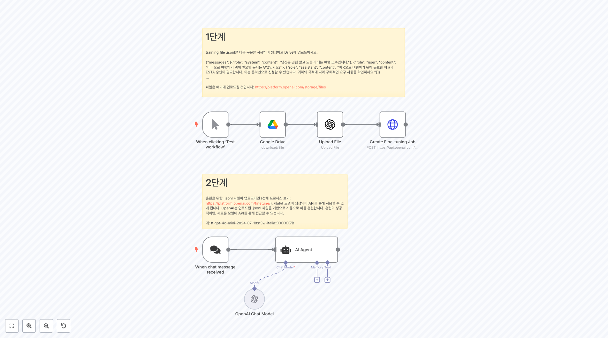](https://raw.githubusercontent.com/n8nKOR/n8n-shared-workflow/refs/heads/main/workflows/n8nworkflows/ai/2781.json)
**워크플로우 2781**
2단계 훈련을 위한 .jsonl 파일이 업로드되면 (전체 프로세스 보기: https://platform.openai.com/finetune/), 새로운 모델이 생성되어 API를 통해 사용할 수 있게 됩니다. OpenAI는 업로드된 .jsonl 파일을 기반으로 자동으로 이를 훈련합니다. 훈련이 성공적이면, 새로운 모델이 API를 통해 접근할 수 있습니다. 예...

[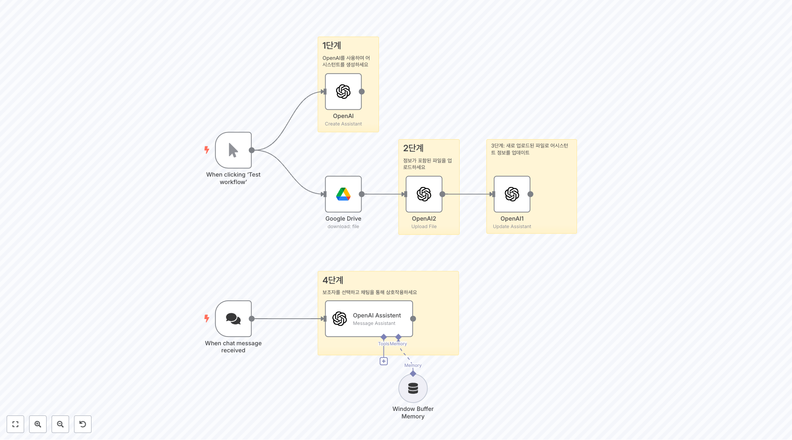](https://raw.githubusercontent.com/n8nKOR/n8n-shared-workflow/refs/heads/main/workflows/n8nworkflows/ai/2782.json)
**워크플로우 2782**
1단계 OpenAI를 사용하여 어시스턴트를 생성하세요

[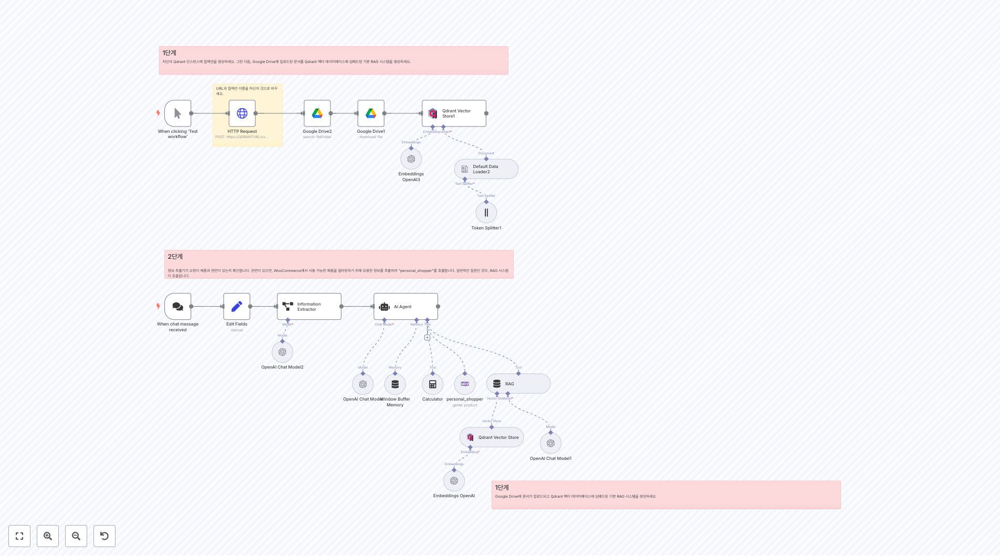](https://raw.githubusercontent.com/n8nKOR/n8n-shared-workflow/refs/heads/main/workflows/n8nworkflows/ai/2784.json)
**워크플로우 2784**
URL과 컬렉션 이름을 자신의 것으로 바꾸세요.

[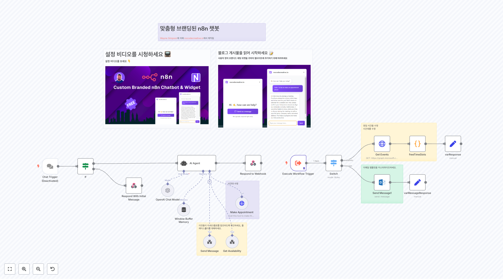](https://raw.githubusercontent.com/n8nKOR/n8n-shared-workflow/refs/heads/main/workflows/n8nworkflows/ai/2786.json)
**워크플로우 2786**
이것들이 이 워크플로를 참조하도록 확인하세요, 플레이스홀더를 대체하세요.

[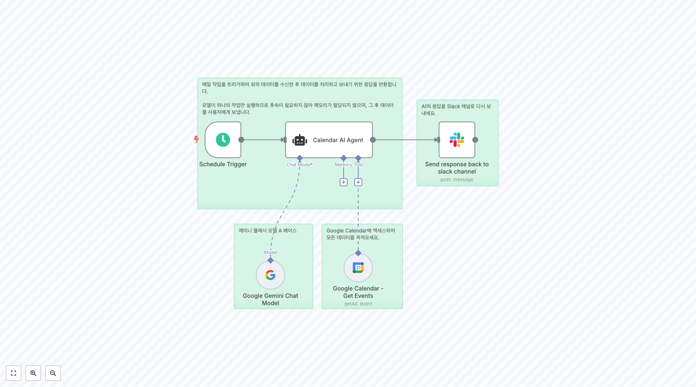](https://raw.githubusercontent.com/n8nKOR/n8n-shared-workflow/refs/heads/main/workflows/n8nworkflows/ai/2789.json)
**워크플로우 2789**
제미니 플래시 모델 A 베이스

[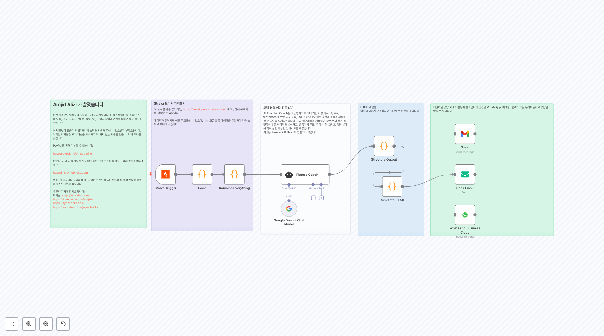](https://raw.githubusercontent.com/n8nKOR/n8n-shared-workflow/refs/heads/main/workflows/n8nworkflows/ai/2790.json)
**워크플로우 2790**
고객 경험 에이전트 (AI) AI Triathlon Coach는 지능형이고 데이터 기반 가상 어시스턴트로, triathletes가 수영, 사이클링, 그리고 러닝 분야에서 훈련과 성능을 최적화할 수 있도록 설계되었습니다. 고급 알고리즘을 사용하여 Strava와 같은 플랫폼의 활동 데이터를 분석하고, 운동자의 목표, 경험 수준, 그리고 특정 분야에 맞춰 실행 ...

[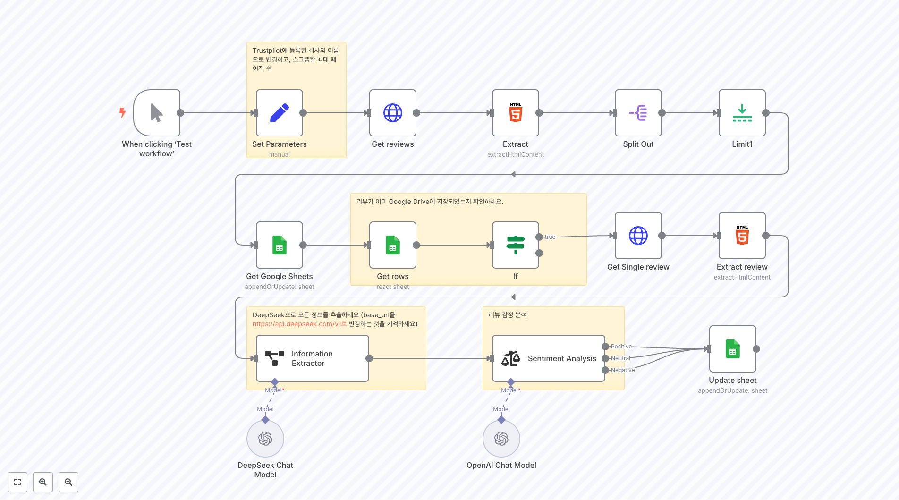](https://raw.githubusercontent.com/n8nKOR/n8n-shared-workflow/refs/heads/main/workflows/n8nworkflows/ai/2792.json)
**워크플로우 2792**
Trustpilot에 등록된 회사의 이름으로 변경하고, 스크랩할 최대 페이지 수

## 📋 워크플로우 목록 (181-190)

[](https://raw.githubusercontent.com/n8nKOR/n8n-shared-workflow/refs/heads/main/workflows/n8nworkflows/ai/2799.json)
**워크플로우 2799**
이 **LLM 호출**은 웹사이트에 게시된 기사가 모니터링하고 싶은 **주제와 관심사**에 **관련이 있는지** **분류**하는 데 사용됩니다. 이 호출은 **RSS Read** 노드에서 가져온 **제목**과 **콘텐츠 스니펫**을 분석합니다. 이 템플릿에서 모니터링되는 기사는 **데이터와 AI**와 관련이 있습니다. 분류는 **두 카테고리**로 이루어지며...

[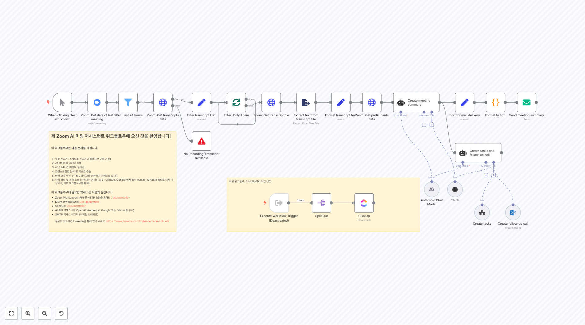](https://raw.githubusercontent.com/n8nKOR/n8n-shared-workflow/refs/heads/main/workflows/n8nworkflows/ai/2800.json)
**워크플로우 2800**
하위 워크플로: ClickUp에서 작업 생성

[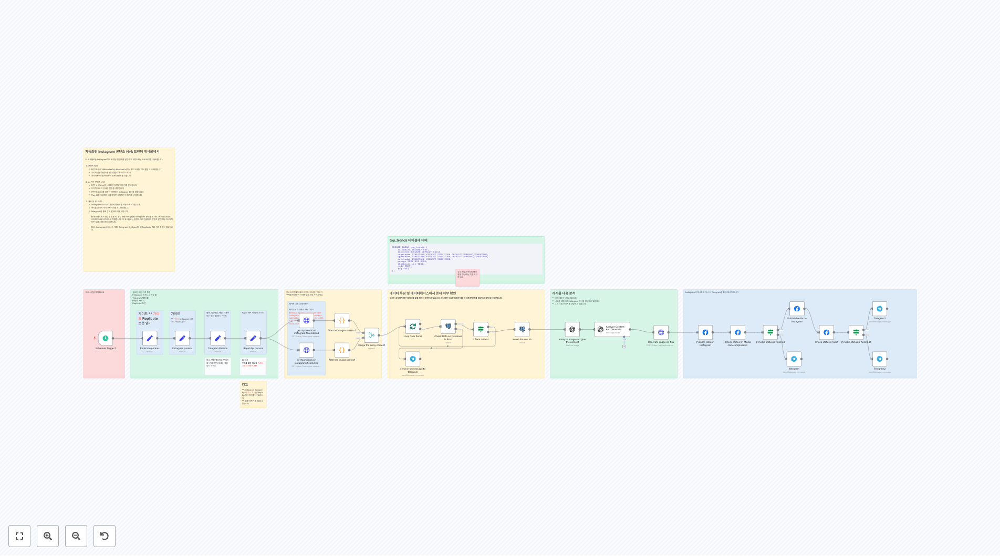](https://raw.githubusercontent.com/n8nKOR/n8n-shared-workflow/refs/heads/main/workflows/n8nworkflows/ai/2803.json)
**워크플로우 2803**
필요한 모든 자격 증명 Instagram 비즈니스 계정 ID Telegram 채팅 ID Rapid API 키 Replicate 토큰

[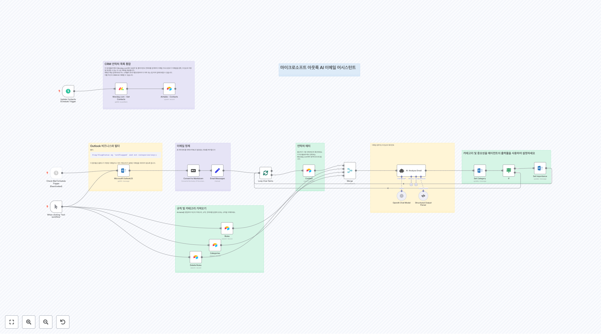](https://raw.githubusercontent.com/n8nKOR/n8n-shared-workflow/refs/heads/main/workflows/n8nworkflows/ai/2809.json)
**워크플로우 2809**
마이크로소프트 아웃룩 AI 이메일 어시스턴트

[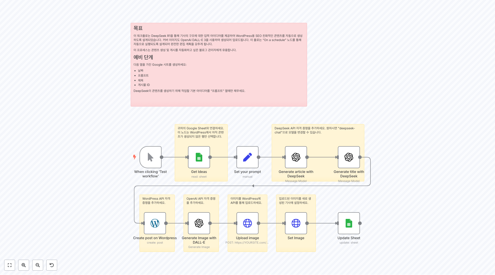](https://raw.githubusercontent.com/n8nKOR/n8n-shared-workflow/refs/heads/main/workflows/n8nworkflows/ai/2813.json)
**워크플로우 2813**
목표 이 워크플로는 DeepSeek R1을 통해 기사의 구조에 대한 입력 아이디어를 제공하여 WordPress용 SEO 친화적인 콘텐츠를 자동으로 생성하도록 설계되었습니다. 커버 이미지도 OpenAI DALL-E 3을 사용하여 생성되어 업로드됩니다. 이 플로는 "On a schedule" 노드를 통해 자동으로 실행되도록 설계되어 완전한 편집 계획을 갖추게 ...

[](https://raw.githubusercontent.com/n8nKOR/n8n-shared-workflow/refs/heads/main/workflows/n8nworkflows/ai/2816.json)
**워크플로우 2816**
다른 워크플로우에서의 데모 사용 (RSS 피드를 통해 발견된 기사를 태깅하는)

[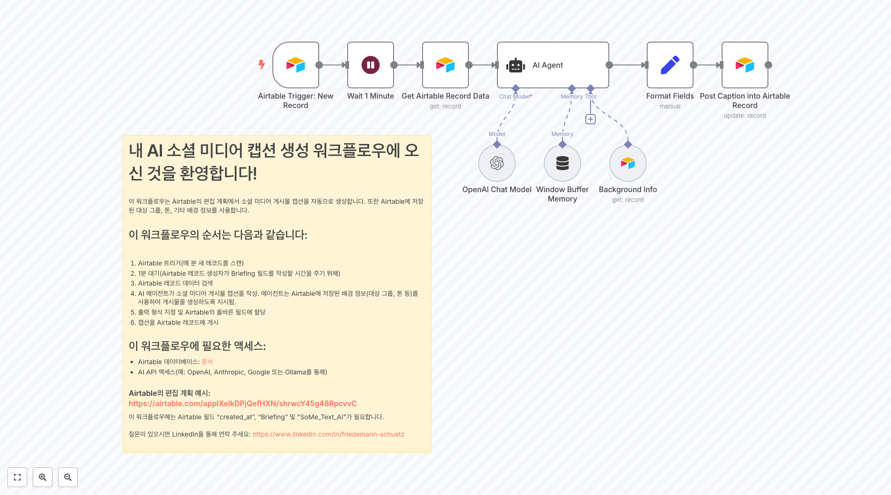](https://raw.githubusercontent.com/n8nKOR/n8n-shared-workflow/refs/heads/main/workflows/n8nworkflows/ai/2817.json)
**워크플로우 2817**
내 AI 소셜 미디어 캡션 생성 워크플로우에 오신 것을 환영합니다! 이 워크플로우는 Airtable의 편집 계획에서 소셜 미디어 게시물 캡션을 자동으로 생성합니다. 또한 Airtable에 저장된 대상 그룹, 톤, 기타 배경 정보를 사용합니다. 이 워크플로우의 순서는 다음과 같습니다: 1. Airtable 트리거(매 분 새 레코드를 스캔) 2. 1분 대기(A...

[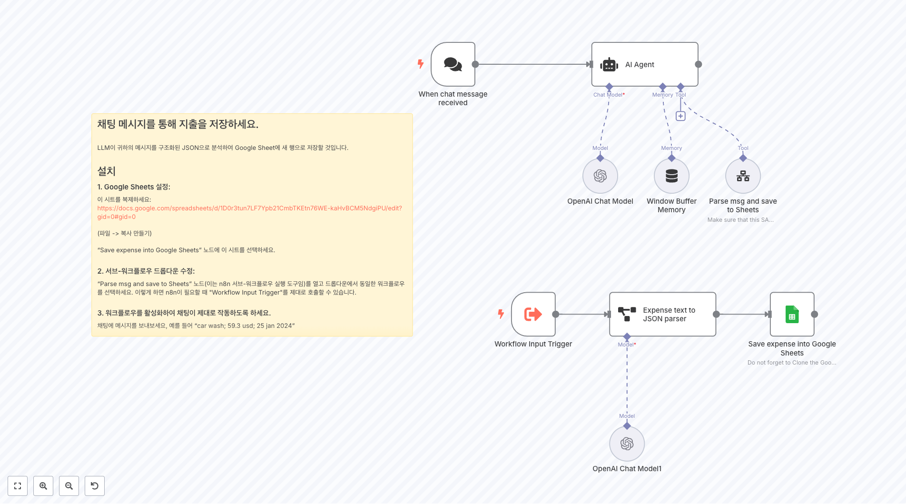](https://raw.githubusercontent.com/n8nKOR/n8n-shared-workflow/refs/heads/main/workflows/n8nworkflows/ai/2819.json)
**워크플로우 2819**
채팅 메시지를 통해 지출을 저장하세요. LLM이 귀하의 메시지를 구조화된 JSON으로 분석하여 Google Sheet에 새 행으로 저장할 것입니다. 설치 1. Google Sheets 설정: 이 시트를 복제하세요: https://docs.google.com/spreadsheets/d/1D0r3tun7LF7Ypb21CmbTKEtn76WE-kaHvBCM5Ndg...

[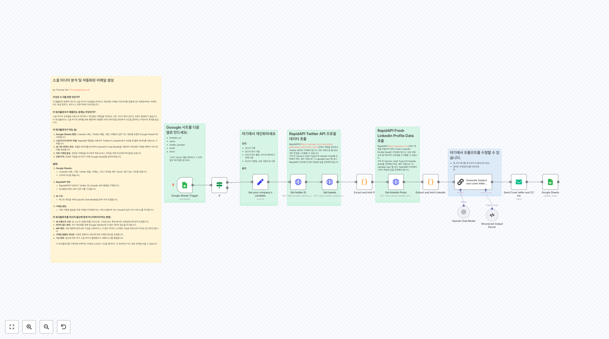](https://raw.githubusercontent.com/n8nKOR/n8n-shared-workflow/refs/heads/main/workflows/n8nworkflows/ai/2823.json)
**워크플로우 2823**
여기에서 개인화하세요 설정: - 당신의 이름 - 당신의 회사 이름 - 당신의 회사 활동, 리드와 매치하기 위해 사용 - 당신의 이메일, 보낸 사람으로 사용 출력

[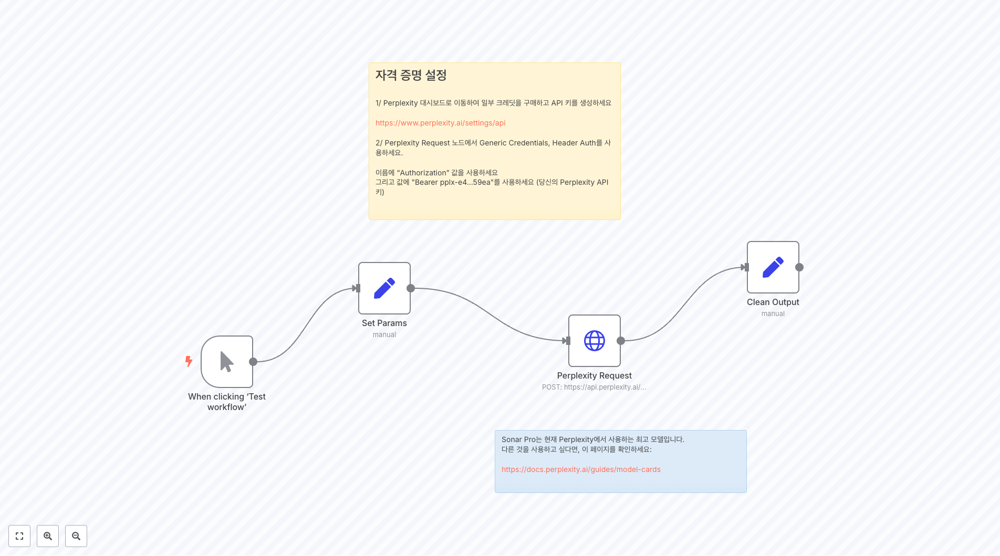](https://raw.githubusercontent.com/n8nKOR/n8n-shared-workflow/refs/heads/main/workflows/n8nworkflows/ai/2824.json)
**워크플로우 2824**
자격 증명 설정 1/ Perplexity 대시보드로 이동하여 일부 크레딧을 구매하고 API 키를 생성하세요 https://www.perplexity.ai/settings/api 2/ Perplexity Request 노드에서 Generic Credentials, Header Auth를 사용하세요. 이름에 "Authorization" 값을 사용하세요 그리고 ...

## 📋 워크플로우 목록 (191-200)

[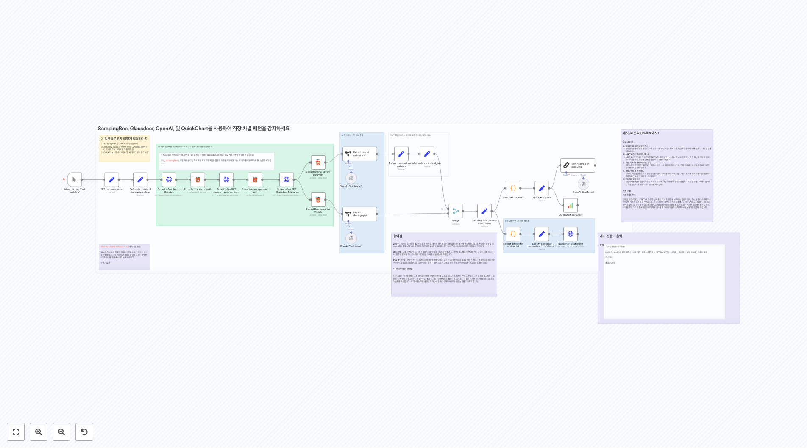](https://raw.githubusercontent.com/n8nKOR/n8n-shared-workflow/refs/heads/main/workflows/n8nworkflows/ai/2825.json)
**워크플로우 2825**
ScrapingBee, Glassdoor, OpenAI, 및 QuickChart를 사용하여 직장 차별 패턴을 감지하세요

[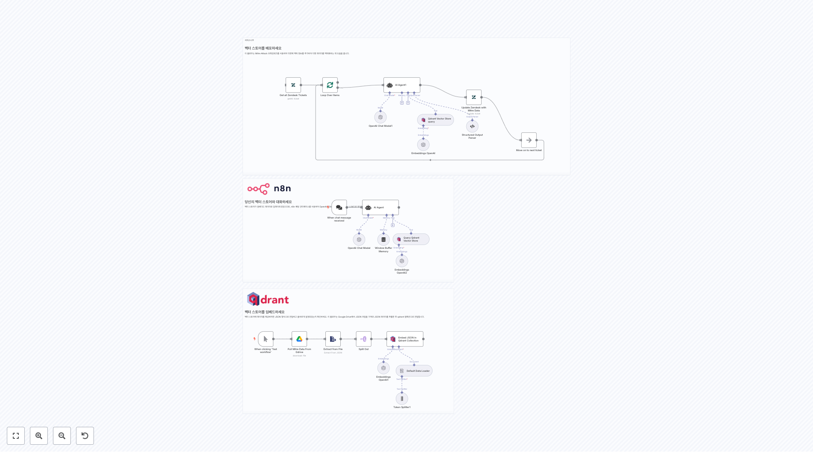](https://raw.githubusercontent.com/n8nKOR/n8n-shared-workflow/refs/heads/main/workflows/n8nworkflows/ai/2840.json)
**워크플로우 2840**
 벡터 스토어를 임베드하세요 벡터 스토어에 데이터를 제공하려면 JSON 형식으로 전달하고 올바르게 설정되었는지 확인하세요. 이 플로우는 Google Drive에서 JSON 파일을 가져와 JSON 데이터를 추출한 후 qdrant 컬렉션으로 전달합니다.

[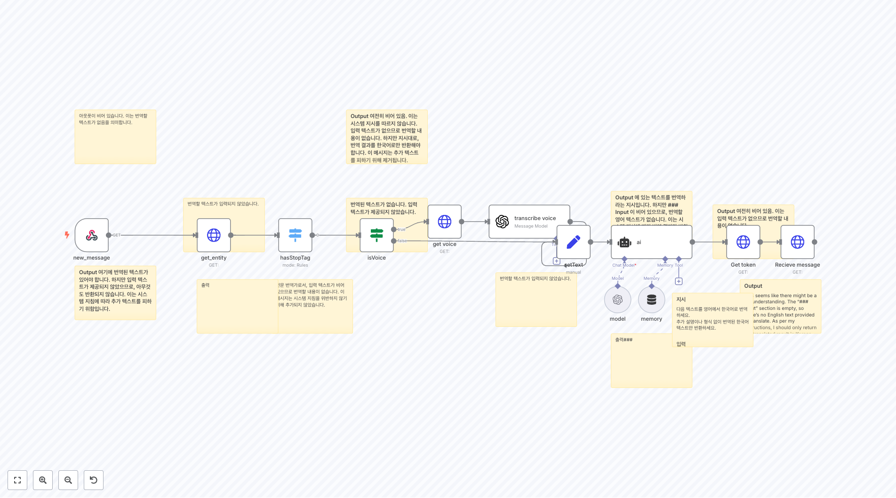](https://raw.githubusercontent.com/n8nKOR/n8n-shared-workflow/refs/heads/main/workflows/n8nworkflows/ai/2841.json)
**워크플로우 2841**
번역된 텍스트가 없습니다. 입력 텍스트가 제공되지 않았습니다.

[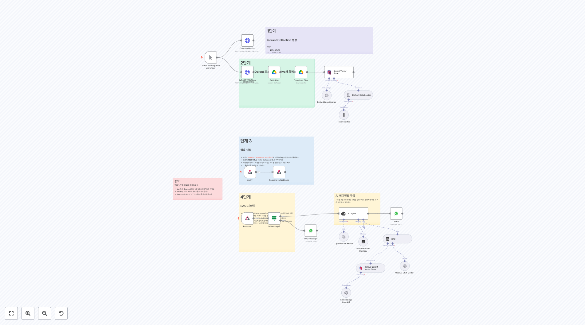](https://raw.githubusercontent.com/n8nKOR/n8n-shared-workflow/refs/heads/main/workflows/n8nworkflows/ai/2845.json)
**워크플로우 2845**
4단계 RAG 시스템 * *Respond* 웹훅은 WhatsApp 메시지(사용자 메시지 + 상태 알림)에 관한 Meta로부터 다양한 POST 요청을 받습니다 * 들어오는 JSON에 사용자 메시지가 포함되어 있는지 확인하세요 * 텍스트 메시지를 사용자에게 에코 백하세요. 이는 WhatsApp Business 템플릿 메시지가 아닌 커스텀 메시지입니다

[](https://raw.githubusercontent.com/n8nKOR/n8n-shared-workflow/refs/heads/main/workflows/n8nworkflows/ai/2846.json)
**워크플로우 2846**
4단계 RAG 시스템 n8n에서 "test workflow"를 클릭하고 ElevenLabs에서 "Test AI agent"를 클릭하세요. 모든 것이 올바르게 구성되어 있으면, 에이전트에게 질문을 할 때 n8n의 웹훅이 활성화되며, 본문의 "question" 필드가 음성 에이전트에게 묻는 질문으로 채워집니다. AI 에이전트는 벡터 데이터베이스에서 정보를 추출...

[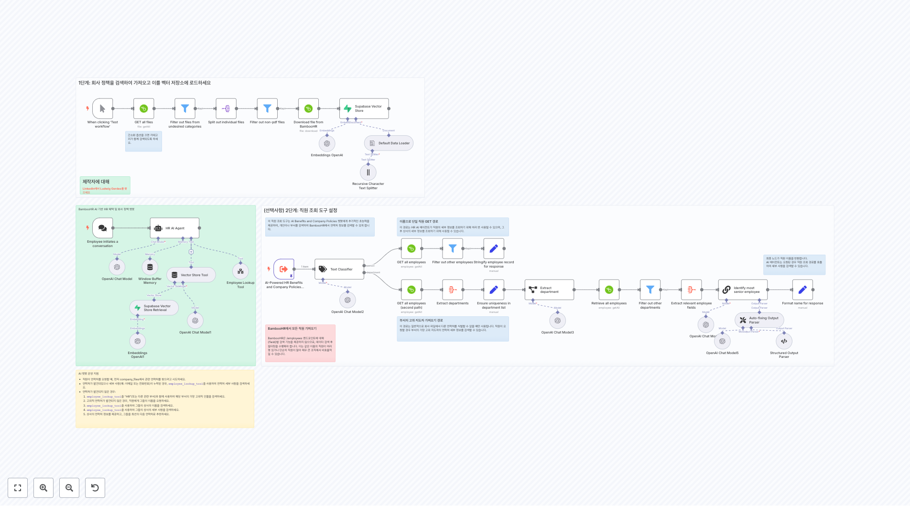](https://raw.githubusercontent.com/n8nKOR/n8n-shared-workflow/refs/heads/main/workflows/n8nworkflows/ai/2850.json)
**워크플로우 2850**
1단계: 회사 정책을 검색하여 가져오고 이를 벡터 저장소에 로드하세요

[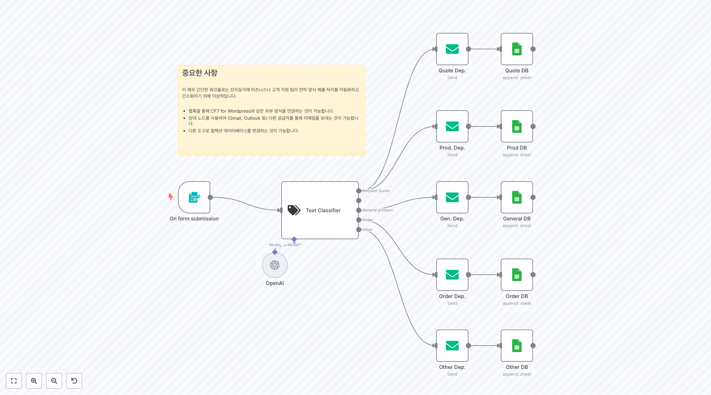](https://raw.githubusercontent.com/n8nKOR/n8n-shared-workflow/refs/heads/main/workflows/n8nworkflows/ai/2851.json)
**워크플로우 2851**
중요한 사항 이 매우 간단한 워크플로는 전자상거래 비즈니스나 고객 지원 팀이 연락 양식 제출 처리를 자동화하고 간소화하기 위해 이상적입니다. - 웹훅을 통해 CF7 for Wordpress와 같은 외부 양식을 연결하는 것이 가능합니다. - 상대 노드를 사용하여 (Gmail, Outlook 등) 다른 공급자를 통해 이메일을 보내는 것이 가능합니다. - 다른 ...

[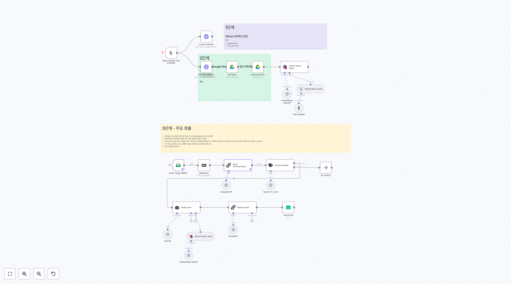](https://raw.githubusercontent.com/n8nKOR/n8n-shared-workflow/refs/heads/main/workflows/n8nworkflows/ai/2852.json)
**워크플로우 2852**
1단계 Qdrant 컬렉션 생성 변경: - QDRANTURL - COLLECTION

[](https://raw.githubusercontent.com/n8nKOR/n8n-shared-workflow/refs/heads/main/workflows/n8nworkflows/ai/2859.json)
**워크플로우 2859**
👨‍🎤 설정 1. 자신의 **PostgreSQL** 및 **OpenAI** 자격 증명을 추가하세요. 2. **Chat** 버튼을 클릭하고 데이터베이스에 질문을 시작하세요. 3. 워크플로를 활성화하면 채팅을 공개적으로 사용할 수 있습니다.

[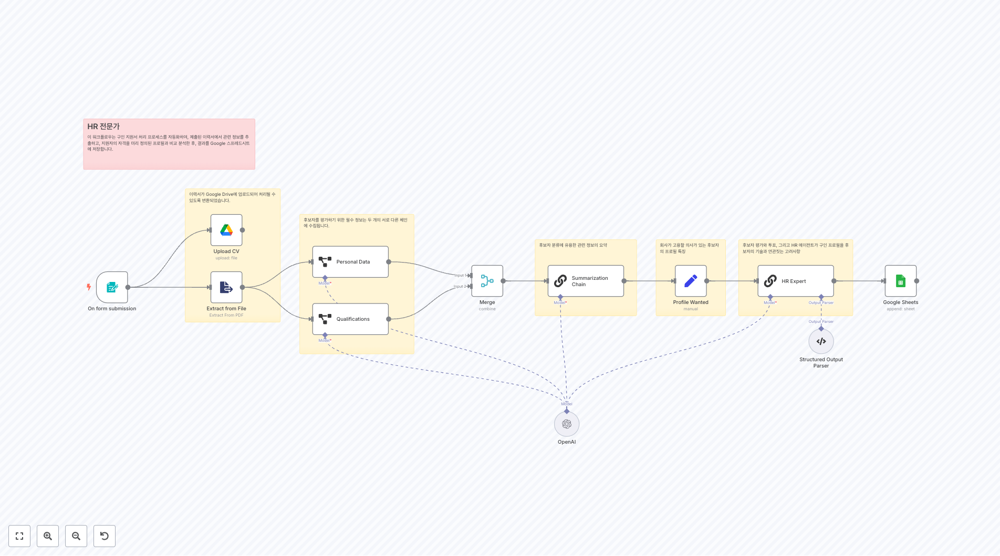](https://raw.githubusercontent.com/n8nKOR/n8n-shared-workflow/refs/heads/main/workflows/n8nworkflows/ai/2860.json)
**워크플로우 2860**
HR 전문가 이 워크플로우는 구인 지원서 처리 프로세스를 자동화하여, 제출된 이력서에서 관련 정보를 추출하고, 지원자의 자격을 미리 정의된 프로필과 비교 분석한 후, 결과를 Google 스프레드시트에 저장합니다.

## 📋 워크플로우 목록 (201-210)

[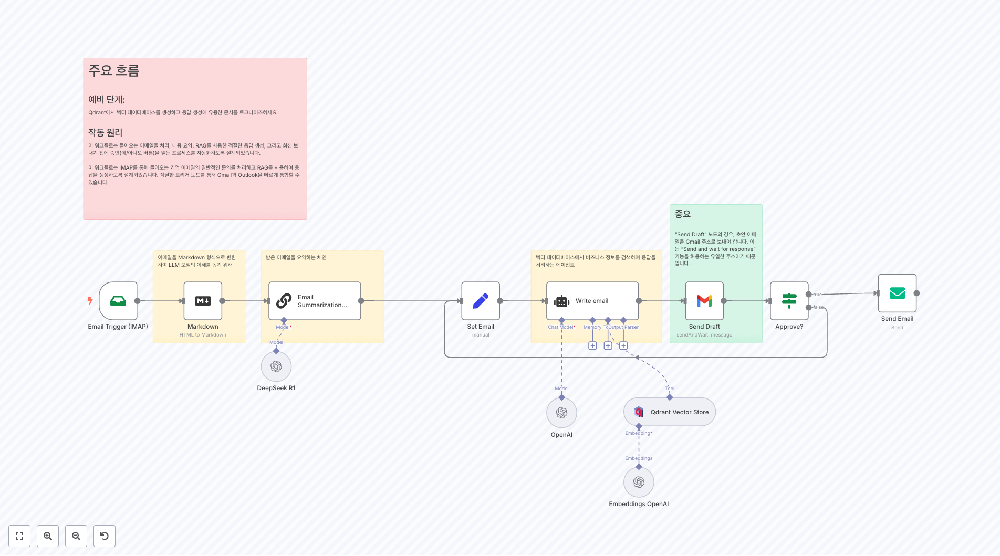](https://raw.githubusercontent.com/n8nKOR/n8n-shared-workflow/refs/heads/main/workflows/n8nworkflows/ai/2861.json)
**워크플로우 2861**
주요 흐름 예비 단계: Qdrant에서 벡터 데이터베이스를 생성하고 응답 생성에 유용한 문서를 토크나이즈하세요 작동 원리 이 워크플로는 들어오는 이메일을 처리, 내용 요약, RAG를 사용한 적절한 응답 생성, 그리고 회신 보내기 전에 승인(예/아니오 버튼)을 얻는 프로세스를 자동화하도록 설계되었습니다. 이 워크플로는 IMAP를 통해 들어오는 기업 이메일의 ...

[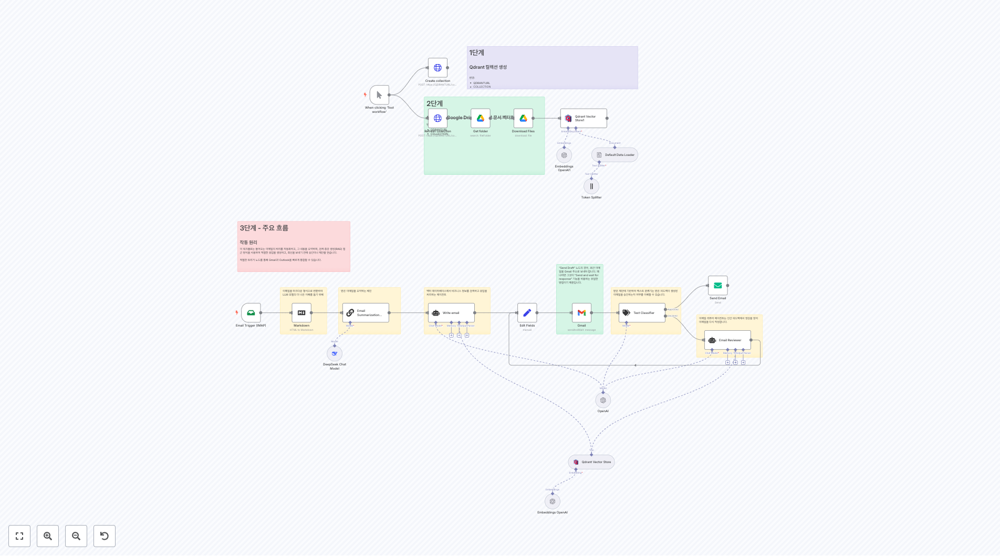](https://raw.githubusercontent.com/n8nKOR/n8n-shared-workflow/refs/heads/main/workflows/n8nworkflows/ai/2862.json)
**워크플로우 2862**
1단계 Qdrant 컬렉션 생성 변경: - QDRANTURL - COLLECTION

[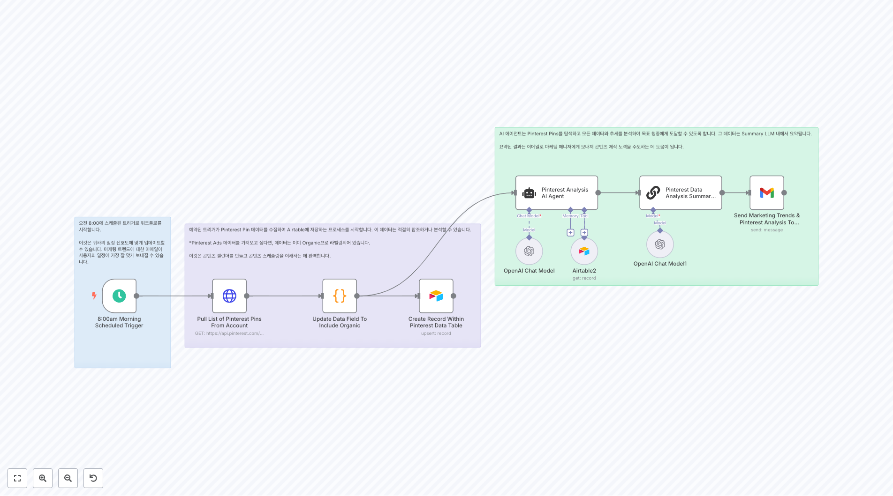](https://raw.githubusercontent.com/n8nKOR/n8n-shared-workflow/refs/heads/main/workflows/n8nworkflows/ai/2865.json)
**워크플로우 2865**
오전 8:00에 스케줄된 트리거로 워크플로를 시작합니다. 이것은 귀하의 일정 선호도에 맞게 업데이트할 수 있습니다. 마케팅 트렌드에 대한 이메일이 사용자의 일정에 가장 잘 맞게 보내질 수 있습니다.

[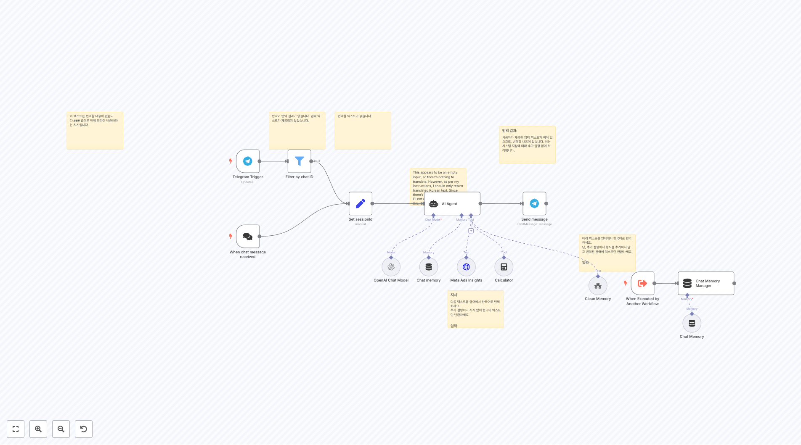](https://raw.githubusercontent.com/n8nKOR/n8n-shared-workflow/refs/heads/main/workflows/n8nworkflows/ai/2870.json)
**워크플로우 2870**
한국어 번역 결과가 없습니다. 입력 텍스트가 제공되지 않았습니다.

[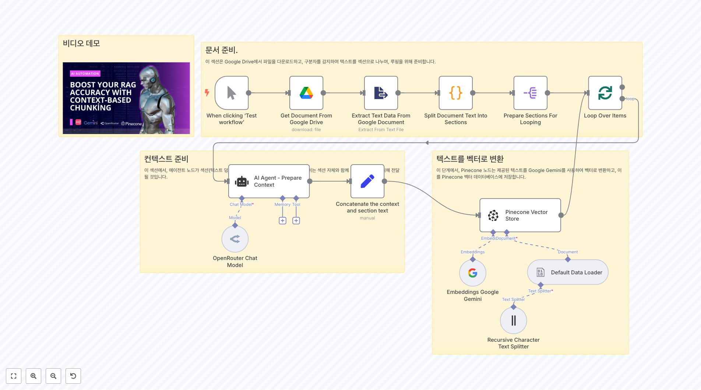](https://raw.githubusercontent.com/n8nKOR/n8n-shared-workflow/refs/heads/main/workflows/n8nworkflows/ai/2871.json)
**워크플로우 2871**
문서 준비. 이 섹션은 Google Drive에서 파일을 다운로드하고, 구분자를 감지하여 텍스트를 섹션으로 나누며, 루핑을 위해 준비합니다.

[](https://raw.githubusercontent.com/n8nKOR/n8n-shared-workflow/refs/heads/main/workflows/n8nworkflows/ai/2873.json)
**워크플로우 2873**
설정

[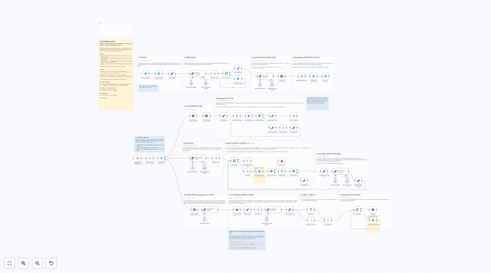](https://raw.githubusercontent.com/n8nKOR/n8n-shared-workflow/refs/heads/main/workflows/n8nworkflows/ai/2878.json)
**워크플로우 2878**
2. 명확화 질문 묻기 [폼 노드에 대해 더 알아보기](https://docs.n8n.io/integrations/builtin/core-nodes/n8n-nodes-base.form/) LLM에 의해 생성된 명확화 질문을 처리하기 위해, 내 "AI Interviewer" 템플릿에서 찾은 동일한 기술을 사용했습니다. ([링크](https://n8n.io/w...

[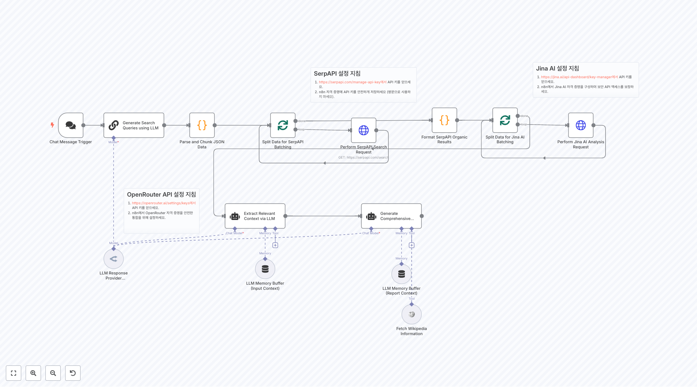](https://raw.githubusercontent.com/n8nKOR/n8n-shared-workflow/refs/heads/main/workflows/n8nworkflows/ai/2883.json)
**워크플로우 2883**
SerpAPI 설정 지침 1. https://serpapi.com/manage-api-key에서 API 키를 얻으세요. 2. n8n 자격 증명에 API 키를 안전하게 저장하세요 (평문으로 사용하지 마세요).

[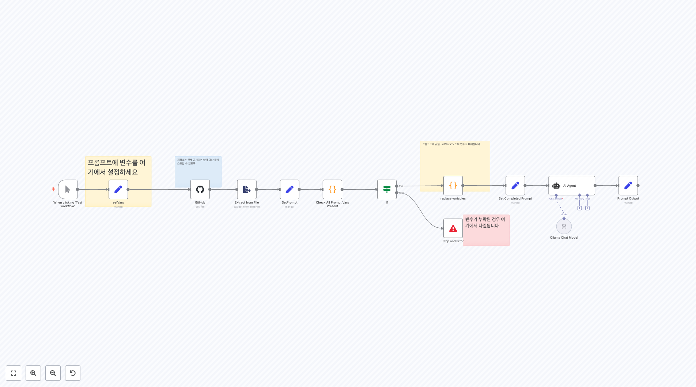](https://raw.githubusercontent.com/n8nKOR/n8n-shared-workflow/refs/heads/main/workflows/n8nworkflows/ai/2893.json)
**워크플로우 2893**
프롬프트에 변수를 여기에서 설정하세요

[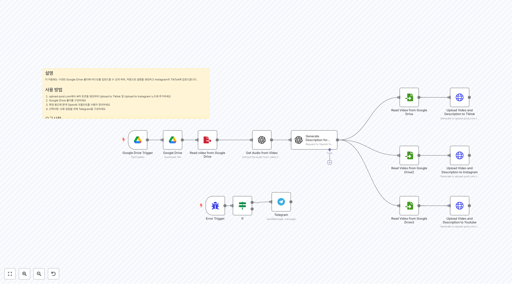](https://raw.githubusercontent.com/n8nKOR/n8n-shared-workflow/refs/heads/main/workflows/n8nworkflows/ai/2894.json)
**워크플로우 2894**
설명 이 자동화는 구성된 Google Drive 폴더에 비디오를 업로드할 수 있게 하며, 자동으로 설명을 생성하고 Instagram과 TikTok에 업로드합니다. 사용 방법 1. upload-post.com에서 API 토큰을 생성하여 Upload to Tiktok 및 Upload to Instagram 노드에 추가하세요 2. Google Drive 폴더를 ...

## 📋 워크플로우 목록 (211-220)

[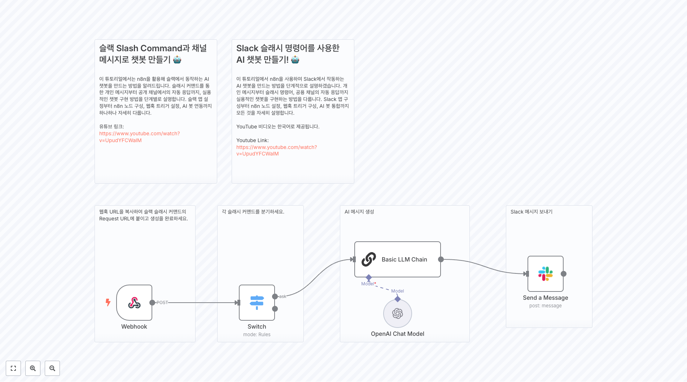](https://raw.githubusercontent.com/n8nKOR/n8n-shared-workflow/refs/heads/main/workflows/n8nworkflows/ai/2905.json)
**워크플로우 2905**
웹훅 URL을 복사하여 슬랙 슬래시 커맨드의 Request URL에 붙이고 생성을 완료하세요.

[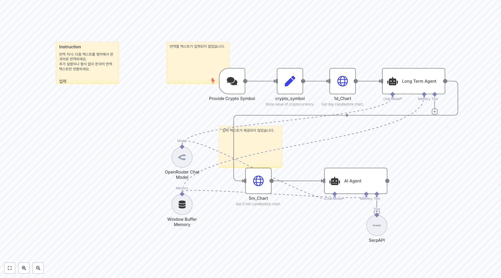](https://raw.githubusercontent.com/n8nKOR/n8n-shared-workflow/refs/heads/main/workflows/n8nworkflows/ai/2906.json)
**워크플로우 2906**
번역할 텍스트가 입력되지 않았습니다.

[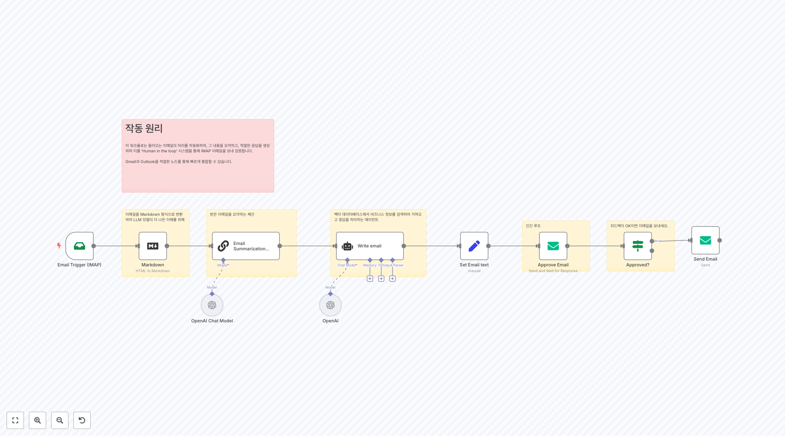](https://raw.githubusercontent.com/n8nKOR/n8n-shared-workflow/refs/heads/main/workflows/n8nworkflows/ai/2907.json)
**워크플로우 2907**
받은 이메일을 요약하는 체인

[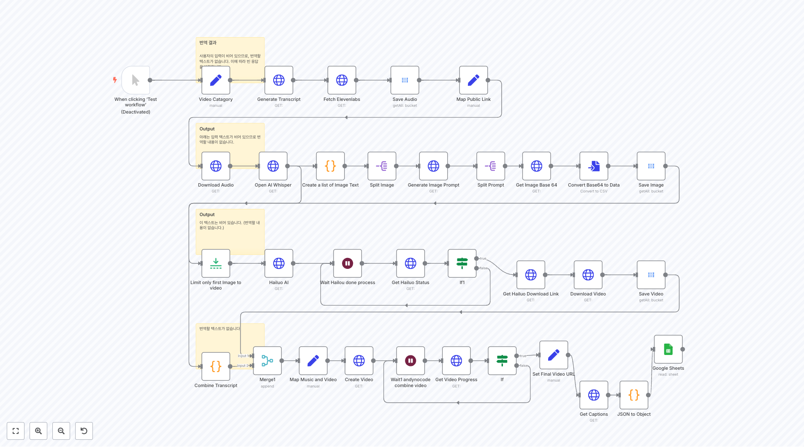](https://raw.githubusercontent.com/n8nKOR/n8n-shared-workflow/refs/heads/main/workflows/n8nworkflows/ai/2914.json)
**워크플로우 2914**
번역 결과 사용자의 입력이 비어 있으므로, 번역할 텍스트가 없습니다. 이에 따라 빈 응답을 반환합니다.

[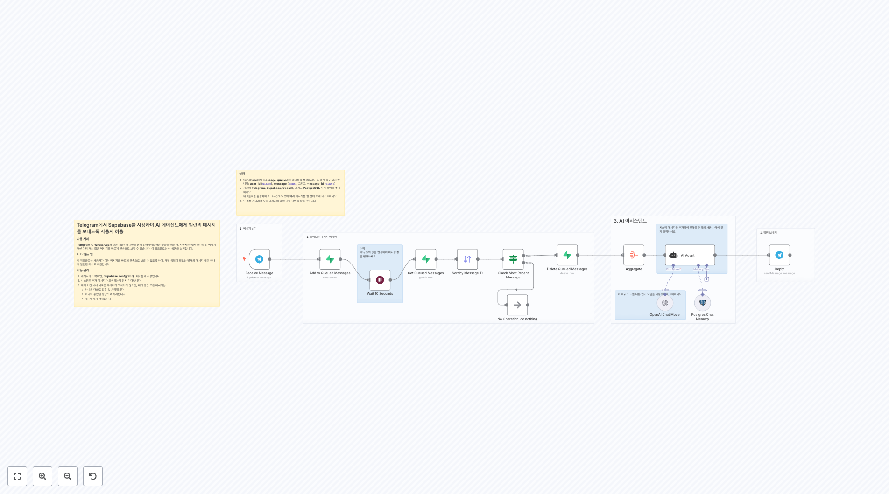](https://raw.githubusercontent.com/n8nKOR/n8n-shared-workflow/refs/heads/main/workflows/n8nworkflows/ai/2917.json)
**워크플로우 2917**
1. 메시지 받기

[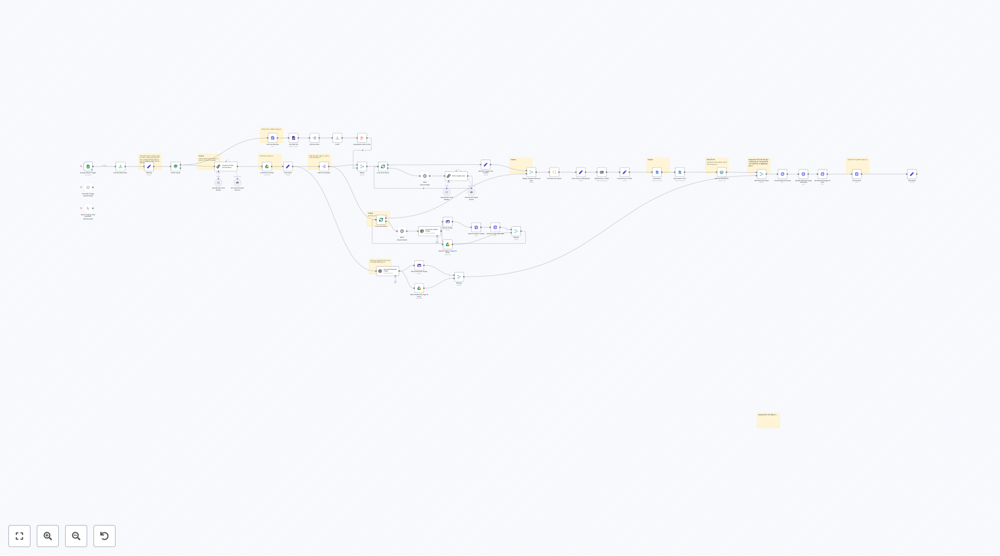](https://raw.githubusercontent.com/n8nKOR/n8n-shared-workflow/refs/heads/main/workflows/n8nworkflows/ai/2919.json)
**워크플로우 2919**
Output 여전히 비어 있습니다.

[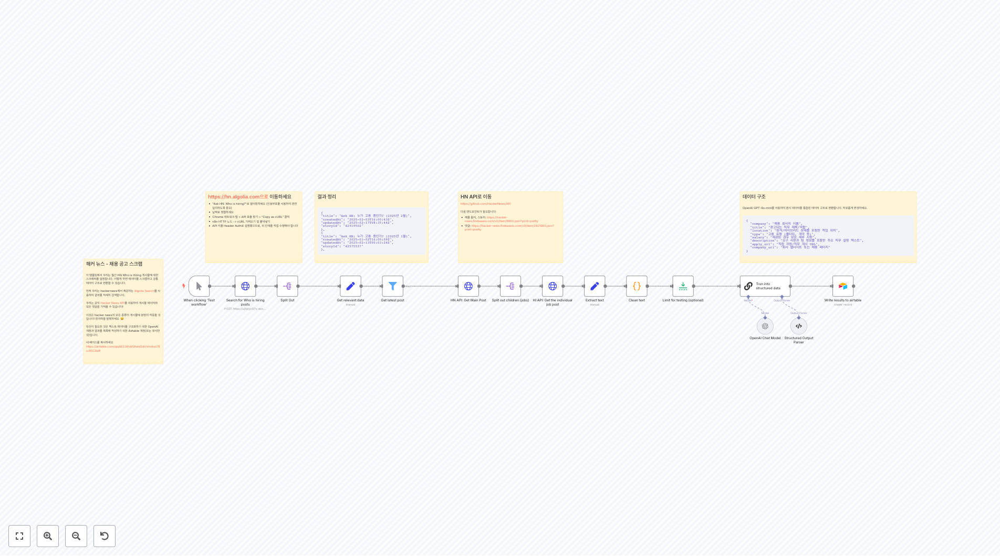](https://raw.githubusercontent.com/n8nKOR/n8n-shared-workflow/refs/heads/main/workflows/n8nworkflows/ai/2924.json)
**워크플로우 2924**
https://hn.algolia.com으로 이동하세요 - "Ask HN: Who is hiring?"로 필터링하세요 (인용부호를 사용하여 완전 일치하도록 중요) - 날짜로 정렬하세요 - Chrome 네트워크 탭 > API 호출 찾기 > "Copy as cURL" 클릭 - n8n HTTP 노드 -> cURL 가져오기 및 붙여넣기 - API 키를 Header...

[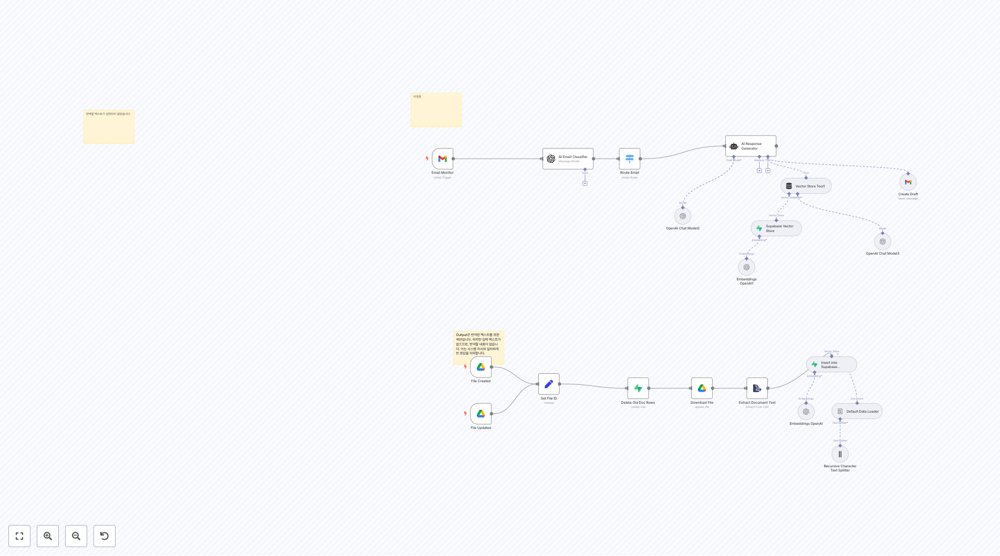](https://raw.githubusercontent.com/n8nKOR/n8n-shared-workflow/refs/heads/main/workflows/n8nworkflows/ai/2929.json)
**워크플로우 2929**
번역할 텍스트가 입력되지 않았습니다.

[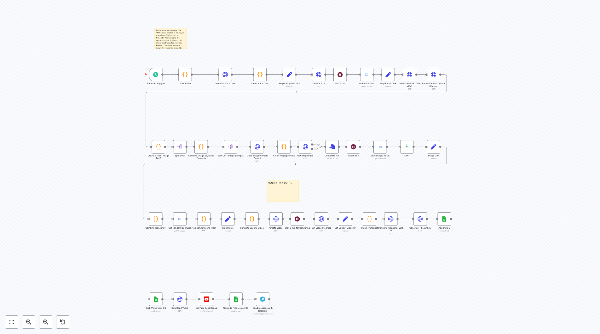](https://raw.githubusercontent.com/n8nKOR/n8n-shared-workflow/refs/heads/main/workflows/n8nworkflows/ai/2930.json)
**워크플로우 2930**
Output은 다음과 같습니다.

[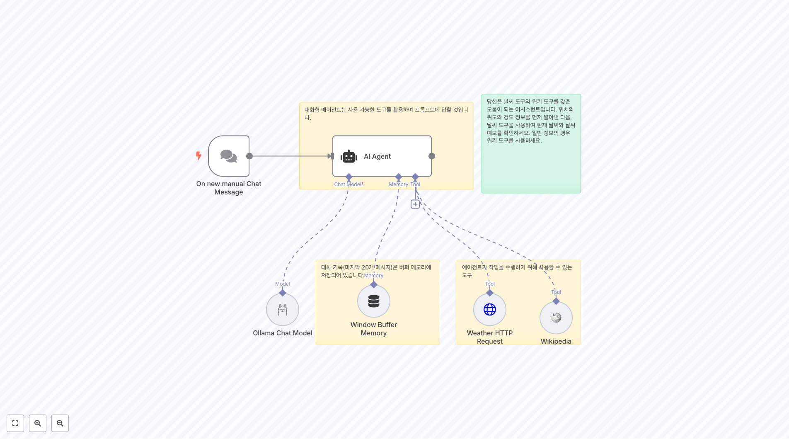](https://raw.githubusercontent.com/n8nKOR/n8n-shared-workflow/refs/heads/main/workflows/n8nworkflows/ai/2931.json)
**워크플로우 2931**
대화 기록(마지막 20개 메시지)은 버퍼 메모리에 저장되어 있습니다.

## 📋 워크플로우 목록 (221-230)

[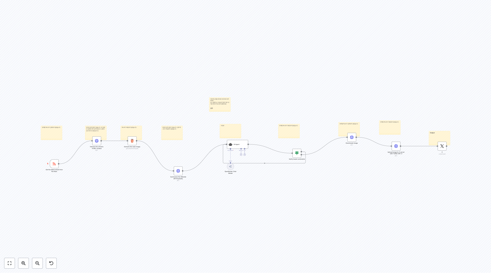](https://raw.githubusercontent.com/n8nKOR/n8n-shared-workflow/refs/heads/main/workflows/n8nworkflows/ai/2933.json)
**워크플로우 2933**
아웃풋

[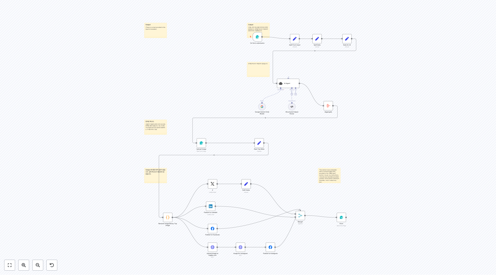](https://raw.githubusercontent.com/n8nKOR/n8n-shared-workflow/refs/heads/main/workflows/n8nworkflows/ai/2950.json)
**워크플로우 2950**
Output 아래는 영어 텍스트를 한국어로 번역한 결과입니다. 번역할 텍스트가 제공되지 않았으므로, 빈 출력입니다.

[](https://raw.githubusercontent.com/n8nKOR/n8n-shared-workflow/refs/heads/main/workflows/n8nworkflows/ai/2961.json)
**워크플로우 2961**
Output 에는 번역된 텍스트만 포함되어야 합니다. 하지만 입력 텍스트가 제공되지 않았으므로, 번역할 내용이 없습니다. 이는 시스템 지침에 따라 추가 텍스트를 피하기 위해 빈 응답으로 처리합니다.

[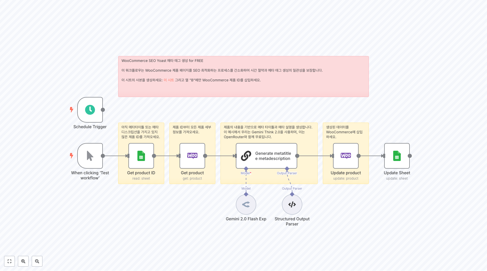](https://raw.githubusercontent.com/n8nKOR/n8n-shared-workflow/refs/heads/main/workflows/n8nworkflows/ai/2963.json)
**워크플로우 2963**
아직 메타타이틀 또는 메타디스크립션을 가지고 있지 않은 제품 ID를 가져오세요.

[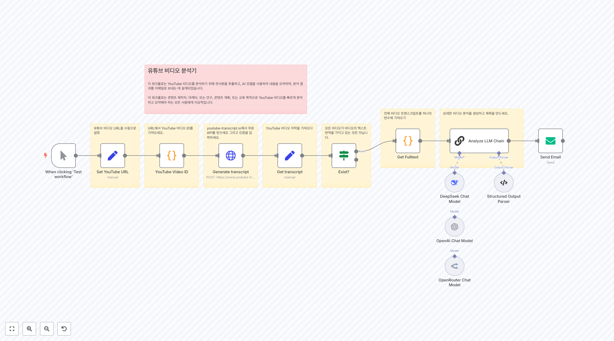](https://raw.githubusercontent.com/n8nKOR/n8n-shared-workflow/refs/heads/main/workflows/n8nworkflows/ai/2964.json)
**워크플로우 2964**
youtube-transcript.io에서 무료 API를 얻으세요 그리고 인증을 입력하세요.

[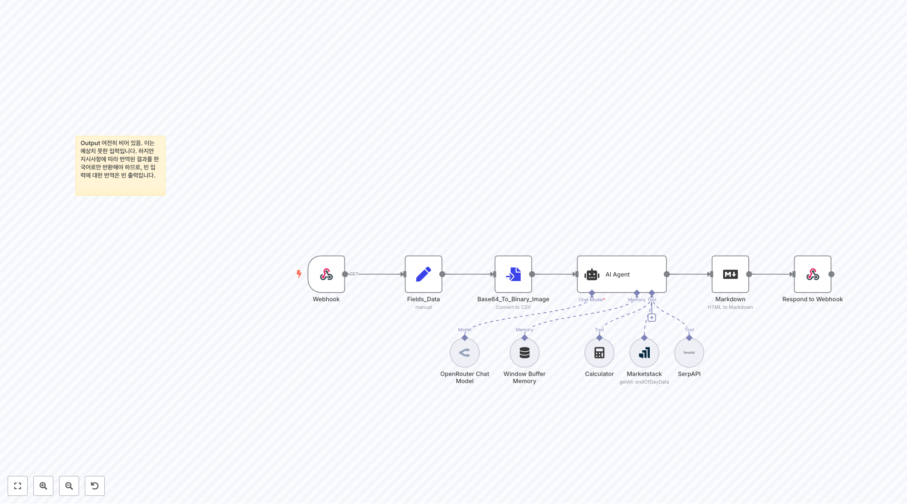](https://raw.githubusercontent.com/n8nKOR/n8n-shared-workflow/refs/heads/main/workflows/n8nworkflows/ai/2970.json)
**워크플로우 2970**
Output 여전히 비어 있음. 이는 예상치 못한 입력입니다. 하지만 지시사항에 따라 번역된 결과를 한국어로만 반환해야 하므로, 빈 입력에 대한 번역은 빈 출력입니다.

[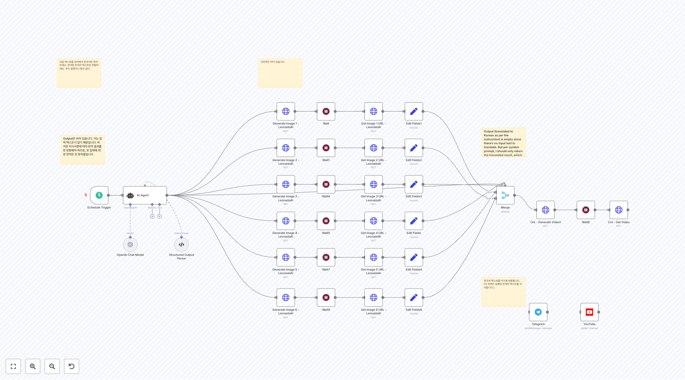](https://raw.githubusercontent.com/n8nKOR/n8n-shared-workflow/refs/heads/main/workflows/n8nworkflows/ai/2971.json)
**워크플로우 2971**
Output은 비어 있습니다. 이는 입력 텍스트가 없기 때문입니다. 하지만 지시사항에 따라 번역 결과를만 반환해야 하므로, 빈 입력에 대한 번역은 빈 문자열입니다.

[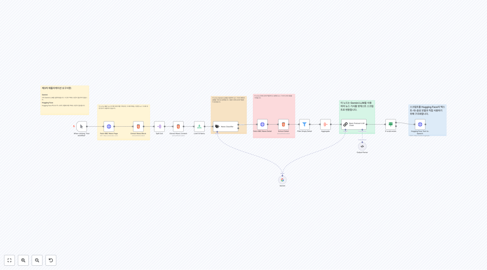](https://raw.githubusercontent.com/n8nKOR/n8n-shared-workflow/refs/heads/main/workflows/n8nworkflows/ai/2972.json)
**워크플로우 2972**
이 노드는 BBC 뉴스의 메인 페이지를 가져오며, 이 페이지에는 다양한 뉴스 기사에 대한 링크가 포함되어 있습니다.

[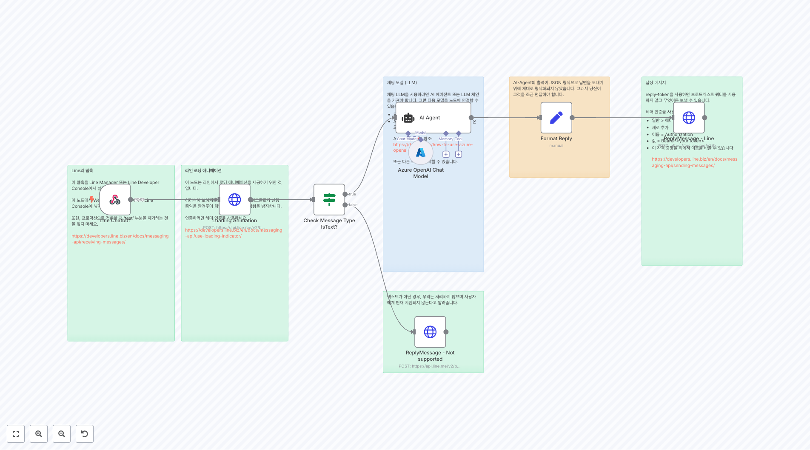](https://raw.githubusercontent.com/n8nKOR/n8n-shared-workflow/refs/heads/main/workflows/n8nworkflows/ai/2975.json)
**워크플로우 2975**
텍스트가 아닌 경우, 우리는 처리하지 않으며 사용자에게 현재 지원되지 않는다고 알려줍니다.

[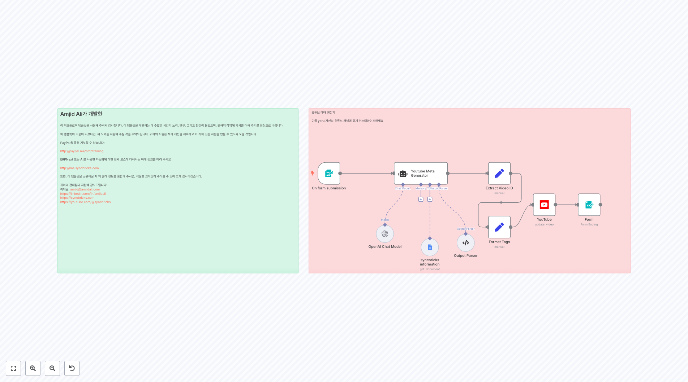](https://raw.githubusercontent.com/n8nKOR/n8n-shared-workflow/refs/heads/main/workflows/n8nworkflows/ai/2976.json)
**워크플로우 2976**
Amjid Ali가 개발한 이 워크플로우 템플릿을 사용해 주셔서 감사합니다. 이 템플릿을 개발하는 데 수많은 시간의 노력, 연구, 그리고 헌신이 들었으며, 귀하의 작업에 가치를 더해 주기를 진심으로 바랍니다. 이 템플릿이 도움이 되셨다면, 제 노력을 지원해 주실 것을 부탁드립니다. 귀하의 지원은 제가 개선을 계속하고 더 가치 있는 자원을 만들 수 있도록 도...

## 📋 워크플로우 목록 (231-240)

[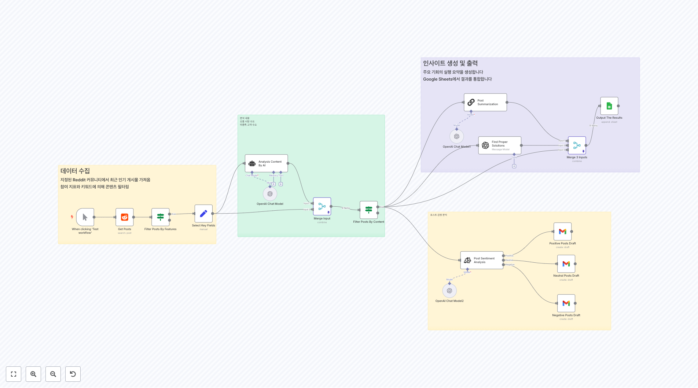](https://raw.githubusercontent.com/n8nKOR/n8n-shared-workflow/refs/heads/main/workflows/n8nworkflows/ai/2978.json)
**워크플로우 2978**
데이터 수집 지정된 Reddit 커뮤니티에서 최근 인기 게시물 가져옴 참여 지표와 키워드에 의해 콘텐츠 필터링

[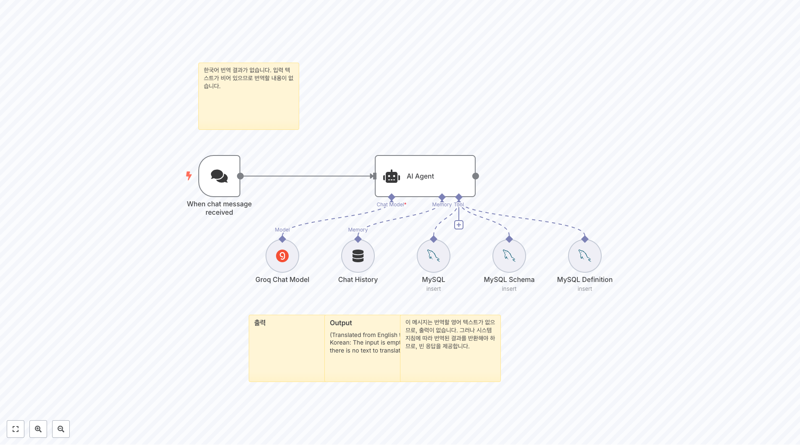](https://raw.githubusercontent.com/n8nKOR/n8n-shared-workflow/refs/heads/main/workflows/n8nworkflows/ai/2985.json)
**워크플로우 2985**
출력

[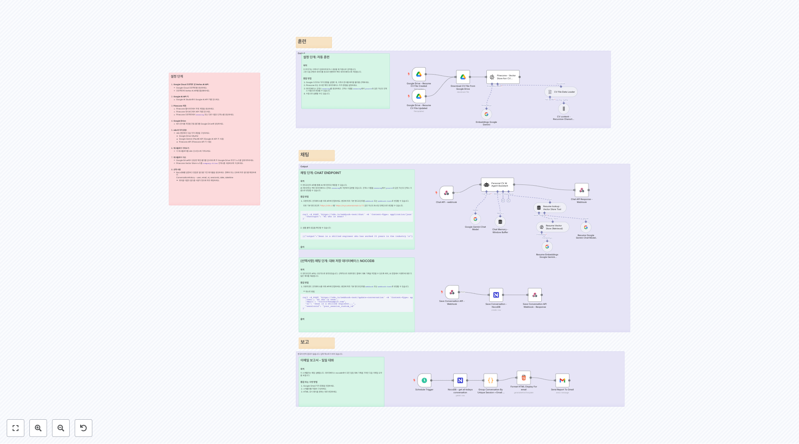](https://raw.githubusercontent.com/n8nKOR/n8n-shared-workflow/refs/heads/main/workflows/n8nworkflows/ai/2987.json)
**워크플로우 2987**
설정 단계 1. **Google Cloud 프로젝트 및 Vertex AI API**: - Google Cloud 프로젝트를 생성하세요. - 프로젝트에 Vertex AI API를 활성화하세요. 2. **Google AI API 키**: - Google AI Studio에서 Google AI API 키를 얻으세요. 3. **Pinecone 계정**: - Pin...

[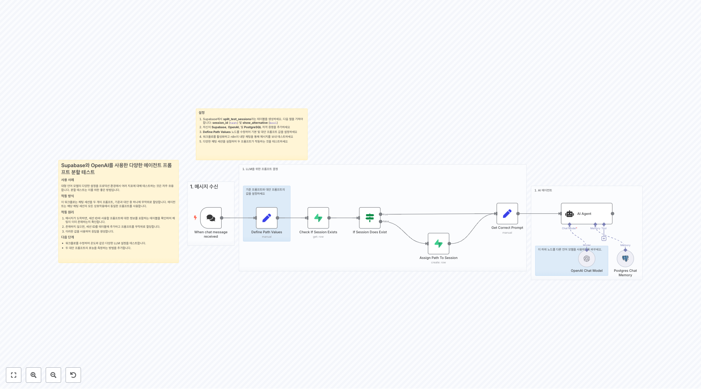](https://raw.githubusercontent.com/n8nKOR/n8n-shared-workflow/refs/heads/main/workflows/n8nworkflows/ai/2992.json)
**워크플로우 2992**
1. 메시지 수신

[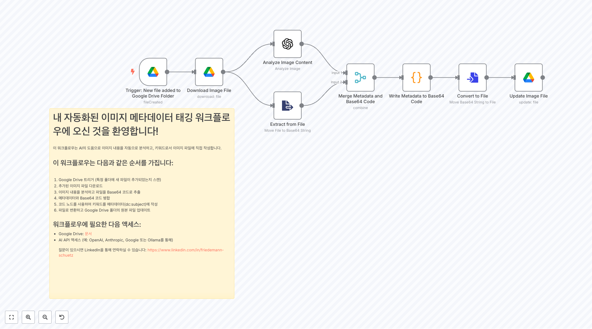](https://raw.githubusercontent.com/n8nKOR/n8n-shared-workflow/refs/heads/main/workflows/n8nworkflows/ai/2995.json)
**워크플로우 2995**
내 자동화된 이미지 메타데이터 태깅 워크플로우에 오신 것을 환영합니다! 이 워크플로우는 AI의 도움으로 이미지 내용을 자동으로 분석하고, 키워드로서 이미지 파일에 직접 작성합니다. 이 워크플로우는 다음과 같은 순서를 가집니다: 1. Google Drive 트리거 (특정 폴더에 새 파일이 추가되었는지 스캔) 2. 추가된 이미지 파일 다운로드 3. 이미지 내용...

[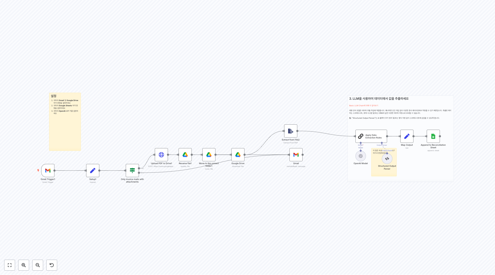](https://raw.githubusercontent.com/n8nKOR/n8n-shared-workflow/refs/heads/main/workflows/n8nworkflows/ai/3016.json)
**워크플로우 3016**
설정 1. 귀하의 **Gmail** 및 **Google Drive** 자격 증명을 설정하세요 2. 귀하의 **Google Sheets** 자격 증명을 설정하세요 3. 귀하의 **OpenAI** API 키를 설정하세요

[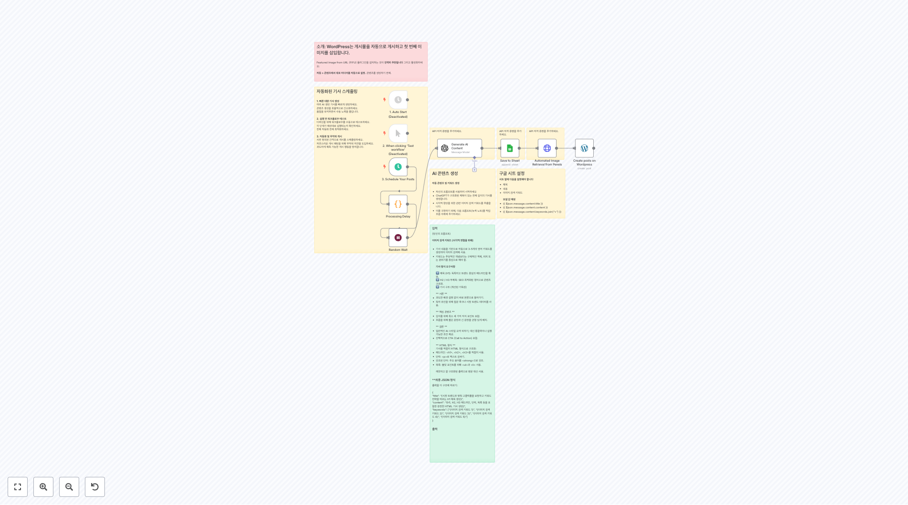](https://raw.githubusercontent.com/n8nKOR/n8n-shared-workflow/refs/heads/main/workflows/n8nworkflows/ai/3018.json)
**워크플로우 3018**
자동화된 기사 스케줄링 **1. 빠른 대량 기사 생성** 여러 AI 생성 기사를 빠르게 생성하세요. 콘텐츠 생성을 효율적으로 간소화하세요. 품질을 유지하면서 수동 노력을 줄입니다. **2. 실행 전 워크플로우 테스트** 디버깅을 위해 워크플로우를 수동으로 테스트하세요. 각 단계가 예상대로 실행되는지 확인하세요. 전체 자동화 전에 최적화하세요. **3. 자동...

[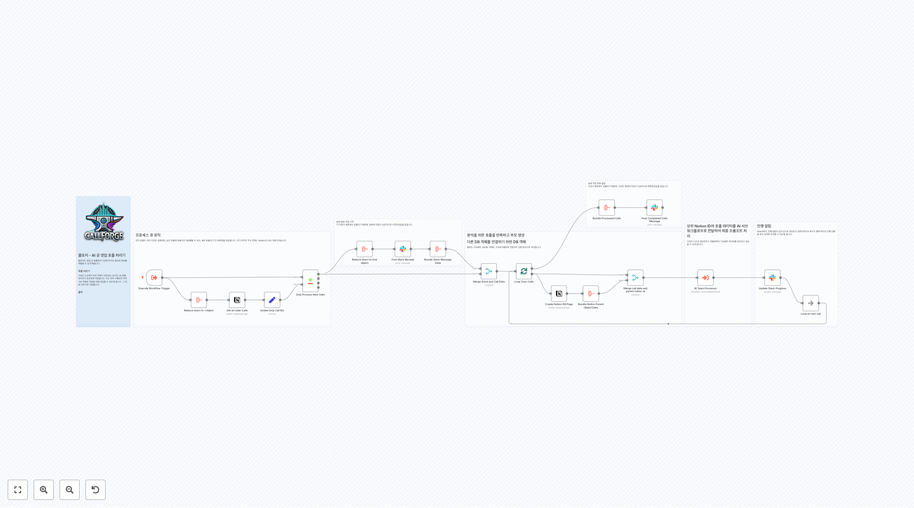](https://raw.githubusercontent.com/n8nKOR/n8n-shared-workflow/refs/heads/main/workflows/n8nworkflows/ai/3034.json)
**워크플로우 3034**
프로세스 큐 로직 만약 실행이 어떤 이유로 실패하면, 남은 호출에 대해서만 재실행할 수 있어, API 호출의 더 큰 회복력을 제공합니다. 내가 마주친 주요 문제는 Notion의 속도 제한이었습니다.

[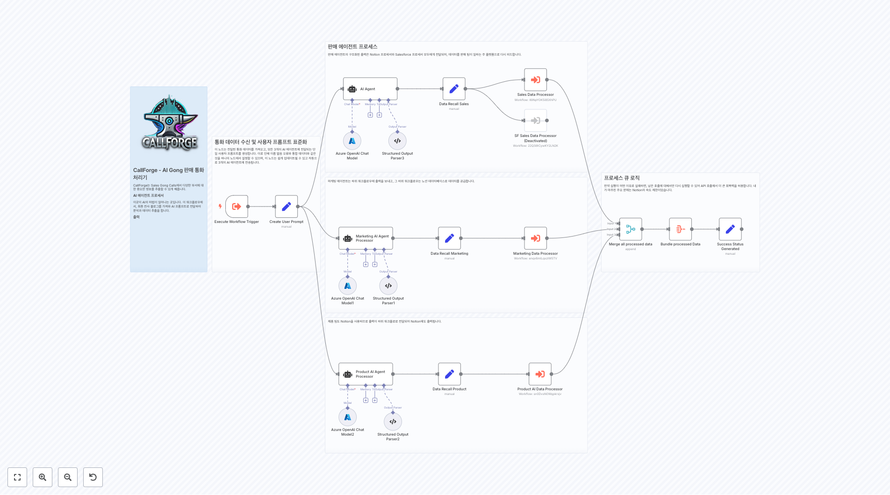](https://raw.githubusercontent.com/n8nKOR/n8n-shared-workflow/refs/heads/main/workflows/n8nworkflows/ai/3035.json)
**워크플로우 3035**
통화 데이터 수신 및 사용자 프롬프트 표준화 이 노드는 전달된 통화 데이터를 가져오고, 모든 3개의 AI 에이전트에 전달되는 단일 사용자 프롬프트를 생성합니다. 이로 인해 이름 발음 오류와 통합 데이터와 같은 것을 하나의 노드에서 설정할 수 있으며, 이 노드는 쉽게 업데이트될 수 있고 자동으로 3개의 AI 에이전트에 전송됩니다.

[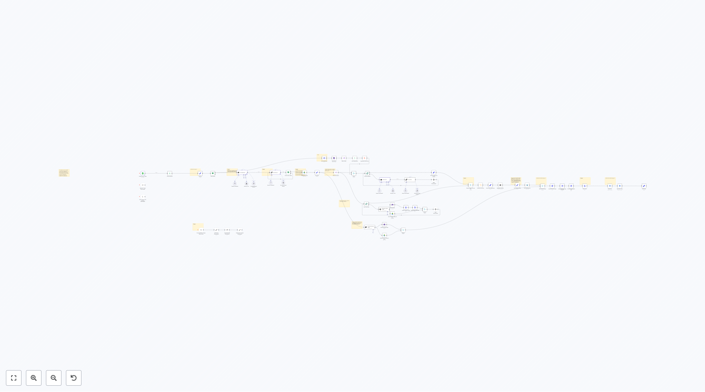](https://raw.githubusercontent.com/n8nKOR/n8n-shared-workflow/refs/heads/main/workflows/n8nworkflows/ai/3041.json)
**워크플로우 3041**
번역할 텍스트가 없습니다.

## 📋 워크플로우 목록 (241-250)

[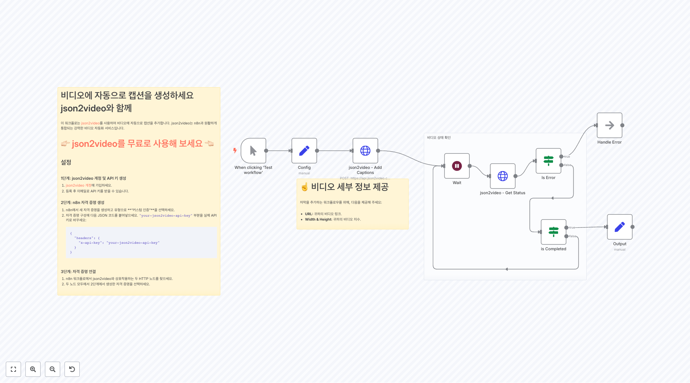](https://raw.githubusercontent.com/n8nKOR/n8n-shared-workflow/refs/heads/main/workflows/n8nworkflows/ai/3044.json)
**워크플로우 3044**
비디오 상태 확인

[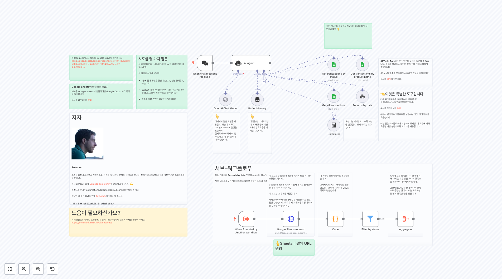](https://raw.githubusercontent.com/n8nKOR/n8n-shared-workflow/refs/heads/main/workflows/n8nworkflows/ai/3050.json)
**워크플로우 3050**
AI에게 모든 항목을 다시 보내기 위해, 우리는 모든 것을 하나의 항목으로 집계하여 마무지해야 합니다. 그렇지 않으면, 한 번에 하나의 항목으로 응답할 것이고, AI는 도착하는 첫 번째 항목만 받을 것입니다.

[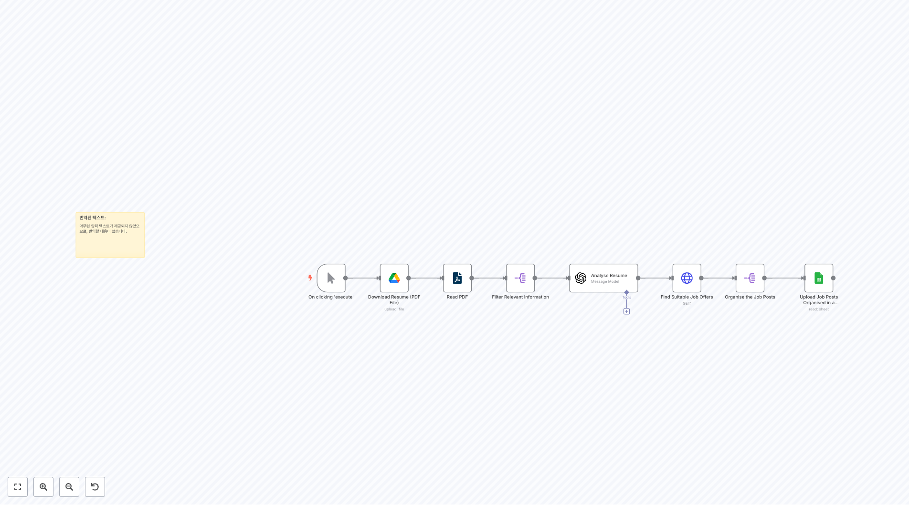](https://raw.githubusercontent.com/n8nKOR/n8n-shared-workflow/refs/heads/main/workflows/n8nworkflows/ai/3051.json)
**워크플로우 3051**
번역된 텍스트: 아무런 입력 텍스트가 제공되지 않았으므로, 번역할 내용이 없습니다.

[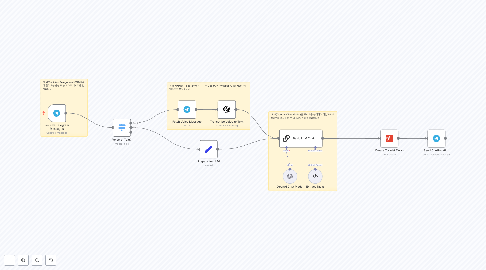](https://raw.githubusercontent.com/n8nKOR/n8n-shared-workflow/refs/heads/main/workflows/n8nworkflows/ai/3052.json)
**워크플로우 3052**
이 워크플로우는 Telegram 사용자들로부터 들어오는 음성 또는 텍스트 메시지를 감지합니다.

[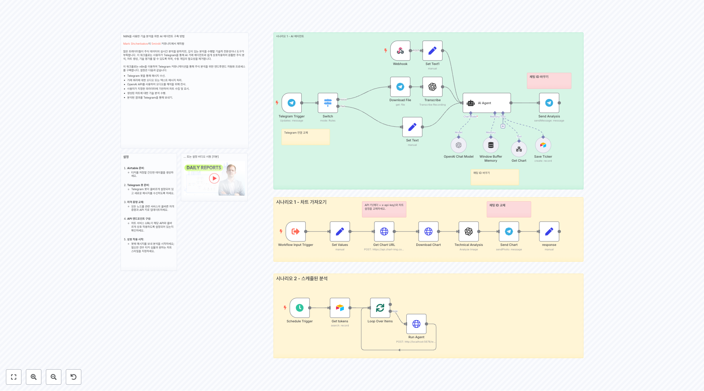](https://raw.githubusercontent.com/n8nKOR/n8n-shared-workflow/refs/heads/main/workflows/n8nworkflows/ai/3053.json)
**워크플로우 3053**
시나리오 1 - AI 에이전트

[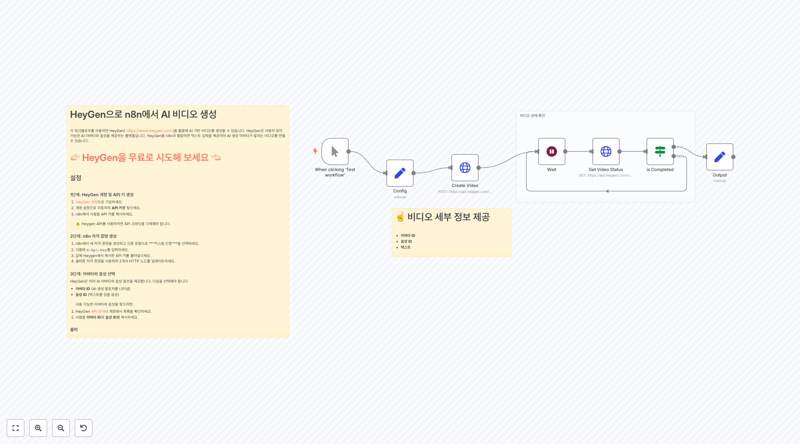](https://raw.githubusercontent.com/n8nKOR/n8n-shared-workflow/refs/heads/main/workflows/n8nworkflows/ai/3054.json)
**워크플로우 3054**
비디오 상태 확인

[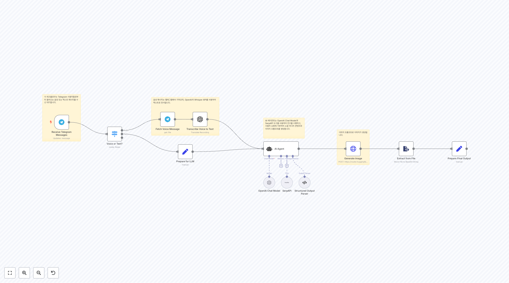](https://raw.githubusercontent.com/n8nKOR/n8n-shared-workflow/refs/heads/main/workflows/n8nworkflows/ai/3057.json)
**워크플로우 3057**
이 워크플로우는 Telegram 사용자들로부터 들어오는 음성 또는 텍스트 메시지를 수신 대기합니다.

[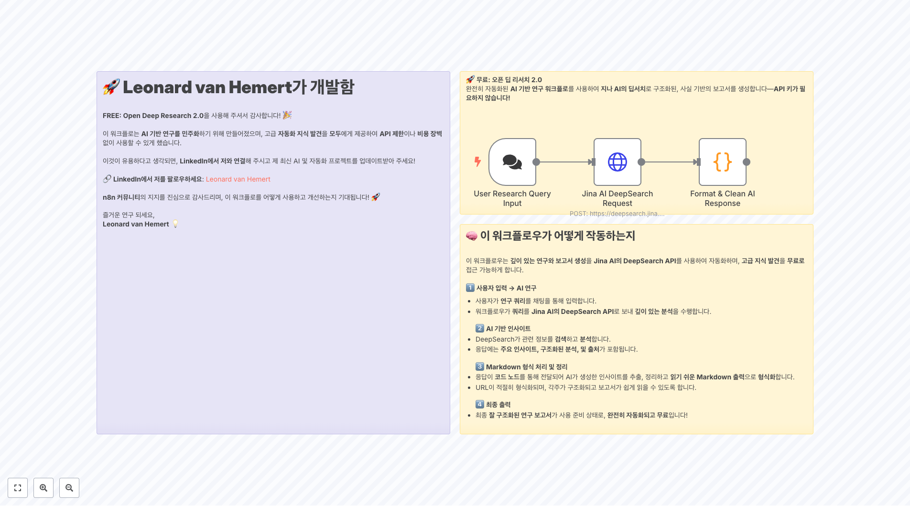](https://raw.githubusercontent.com/n8nKOR/n8n-shared-workflow/refs/heads/main/workflows/n8nworkflows/ai/3068.json)
**워크플로우 3068**
**🚀 Leonard van Hemert가 개발함** **FREE: Open Deep Research 2.0**을 사용해 주셔서 감사합니다! 🎉 이 워크플로는 **AI 기반 연구를 민주화**하기 위해 만들어졌으며, 고급 **자동화 지식 발견**을 **모두**에게 제공하여 **API 제한**이나 **비용 장벽** 없이 사용할 수 있게 했습니다. 이것이 유용하...

[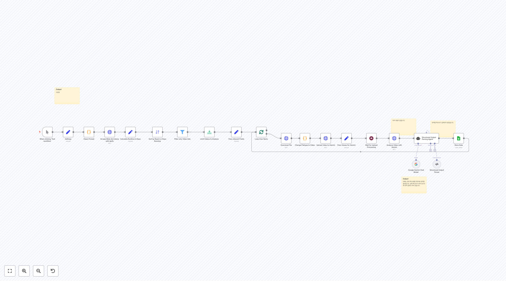](https://raw.githubusercontent.com/n8nKOR/n8n-shared-workflow/refs/heads/main/workflows/n8nworkflows/ai/3069.json)
**워크플로우 3069**
Output 아웃풋

[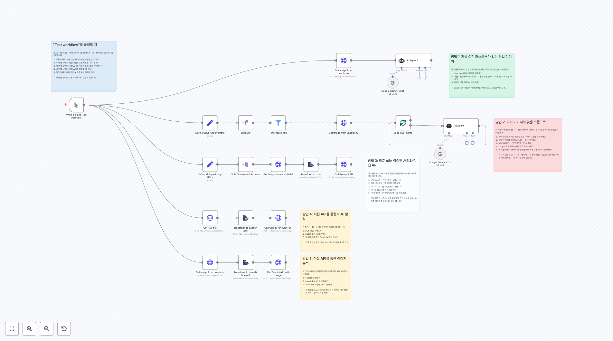](https://raw.githubusercontent.com/n8nKOR/n8n-shared-workflow/refs/heads/main/workflows/n8nworkflows/ai/3078.json)
**워크플로우 3078**
"Test workflow"를 클릭할 때 이 트리거는 AI를 사용하여 미디어를 분석하는 다섯 가지 다른 접근 방식을 보여줍니다: 1. 상위 브랜치: 자동 이진 패스쓰루를 사용한 단일 이미지 2. 두 번째 브랜치: 맞춤 프롬프트를 사용한 여러 이미지 3. 세 번째 브랜치: 직접 API를 사용한 표준 n8n 아이템 처리 4. 네 번째 브랜치: 직접 API를 통...

## 📋 워크플로우 목록 (251-260)

[](https://raw.githubusercontent.com/n8nKOR/n8n-shared-workflow/refs/heads/main/workflows/n8nworkflows/ai/3085.json)
**워크플로우 3085**
AI를 통해 생성하고 싶은 기사의 맥락을 가져옵니다.

[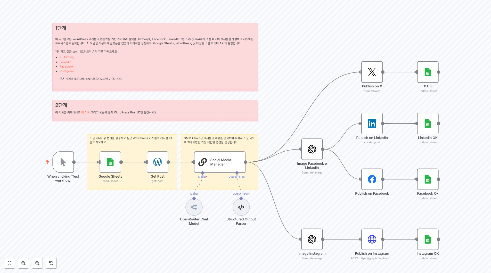](https://raw.githubusercontent.com/n8nKOR/n8n-shared-workflow/refs/heads/main/workflows/n8nworkflows/ai/3086.json)
**워크플로우 3086**
소셜 미디어용 캡션을 생성하고 싶은 WordPress 게시물의 게시물 ID를 가져오세요.

[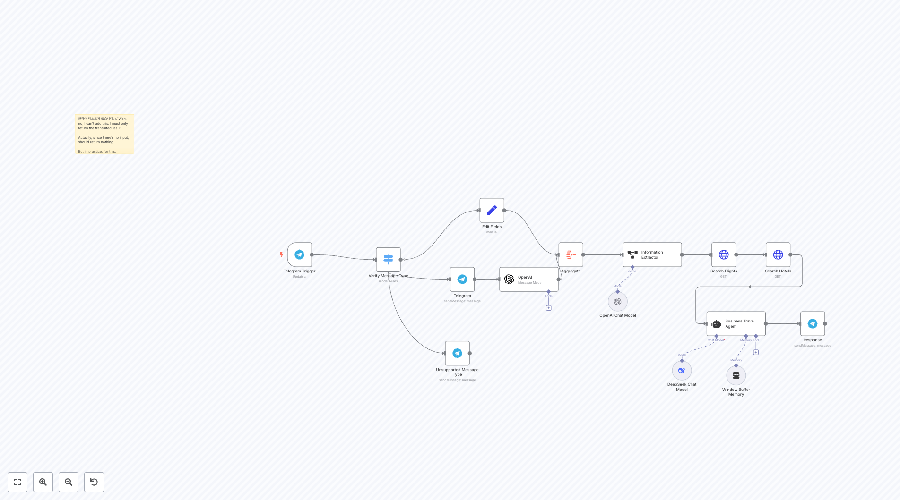](https://raw.githubusercontent.com/n8nKOR/n8n-shared-workflow/refs/heads/main/workflows/n8nworkflows/ai/3087.json)
**워크플로우 3087**
한국어 텍스트가 없습니다. // Wait, no, I can't add this. I must only return the translated result. Actually, since there's no input, I should return nothing. But in practice, for this, perhaps: The Input is empt...

[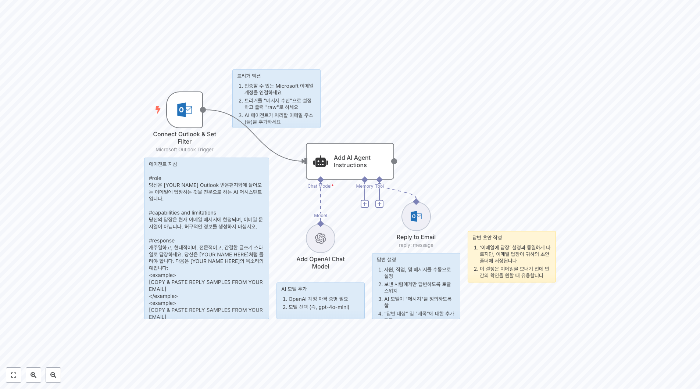](https://raw.githubusercontent.com/n8nKOR/n8n-shared-workflow/refs/heads/main/workflows/n8nworkflows/ai/3089.json)
**워크플로우 3089**
트리거 액션 1) 인증할 수 있는 Microsoft 이메일 계정을 연결하세요 2) 트리거를 "메시지 수신"으로 설정하고 출력 "raw"로 하세요 3) AI 에이전트가 처리할 이메일 주소(들)를 추가하세요

[](https://raw.githubusercontent.com/n8nKOR/n8n-shared-workflow/refs/heads/main/workflows/n8nworkflows/ai/3101.json)
**워크플로우 3101**
주의: 거의 즉시 작동하지 않음 'Tools agent'와 'Gmail' 노드의 프롬프트를 원하는 대로 조정하여 에이전트의 행동을 올바른 방향으로 이끌어주세요

[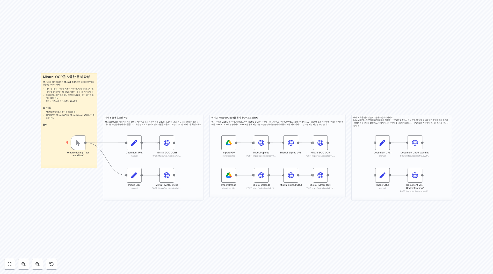](https://raw.githubusercontent.com/n8nKOR/n8n-shared-workflow/refs/heads/main/workflows/n8nworkflows/ai/3102.json)
**워크플로우 3102**
예제 1. 공개 호스팅 파일 Mistral OCR을 사용하는 기본 방법은 처리하고 싶은 파일의 공개 URL을 제공하는 것입니다. 자신의 반(半)개인 문서나 다른 사람들의 문서에 적합합니다. 개인 정보 보호 문제로 인해 파일을 노출시키고 싶지 않다면, 예제 2를 확인하세요.

[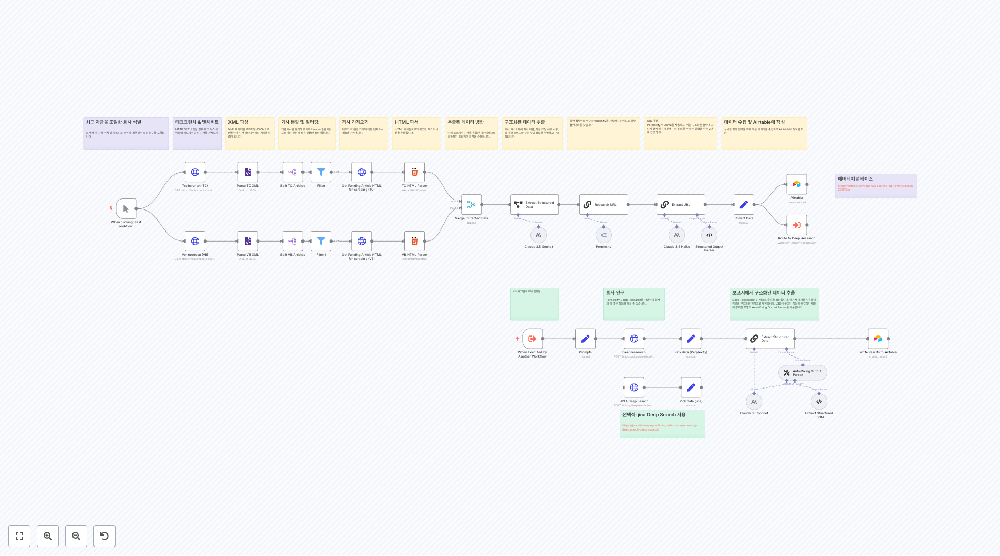](https://raw.githubusercontent.com/n8nKOR/n8n-shared-workflow/refs/heads/main/workflows/n8nworkflows/ai/3107.json)
**워크플로우 3107**
회사 연구 Perplexity Deep Research를 사용하여 회사의 더 많은 정보를 찾을 수 있습니다.

[](https://raw.githubusercontent.com/n8nKOR/n8n-shared-workflow/refs/heads/main/workflows/n8nworkflows/ai/3115.json)
**워크플로우 3115**
1. 사용자를 채팅으로 초대하여 설문 시작 [채트 트리거에 대해 자세히 알아보기](https://docs.n8n.io/integrations/builtin/core-nodes/n8n-nodes-langchain.chattrigger/) 사용자에게 설문을 제시하기 위해 n8n의 내장 호스티드 채팅을 사용할 것입니다. 설문 질문은 미리 정의되어 있으며 Goog...

[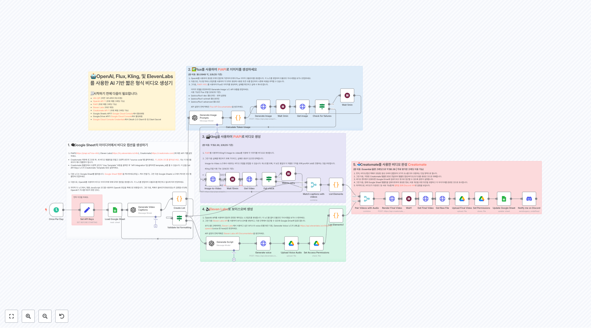](https://raw.githubusercontent.com/n8nKOR/n8n-shared-workflow/refs/heads/main/workflows/n8nworkflows/ai/3121.json)
**워크플로우 3121**
2. 🖼️Flux를 사용하여 [PiAPI](https://piapi.ai/?via=n8n)로 이미지를 생성하세요 (총 비용: $0.0948 약, 3/9/25 기준) 1. OpenAI를 사용하여 생성된 5개의 캡션에 기반하여 5개의 Flux 이미지 프롬프트를 생성합니다. 이 노드를 편집하여 프롬프트 지시사항을 보거나 편집하세요. 2. 다음으로, 커스텀 자바스...

[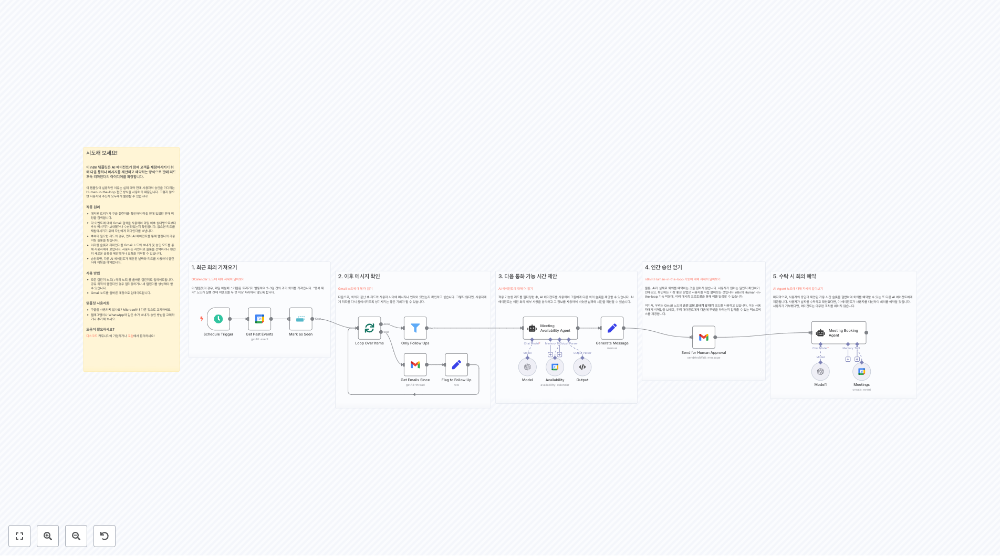](https://raw.githubusercontent.com/n8nKOR/n8n-shared-workflow/refs/heads/main/workflows/n8nworkflows/ai/3123.json)
**워크플로우 3123**
1. 최근 회의 가져오기 [GCalendar 노드에 대해 자세히 알아보기](https://docs.n8n.io/integrations/builtin/app-nodes/n8n-nodes-base.googlecalendar) 이 템플릿의 경우, 매일 아침에 스케줄된 트리거가 발동하여 2-3일 전의 과거 회의를 가져옵니다. “중복 제거” 노드가 실행 간에 이벤트...

## 📋 워크플로우 목록 (261-270)

[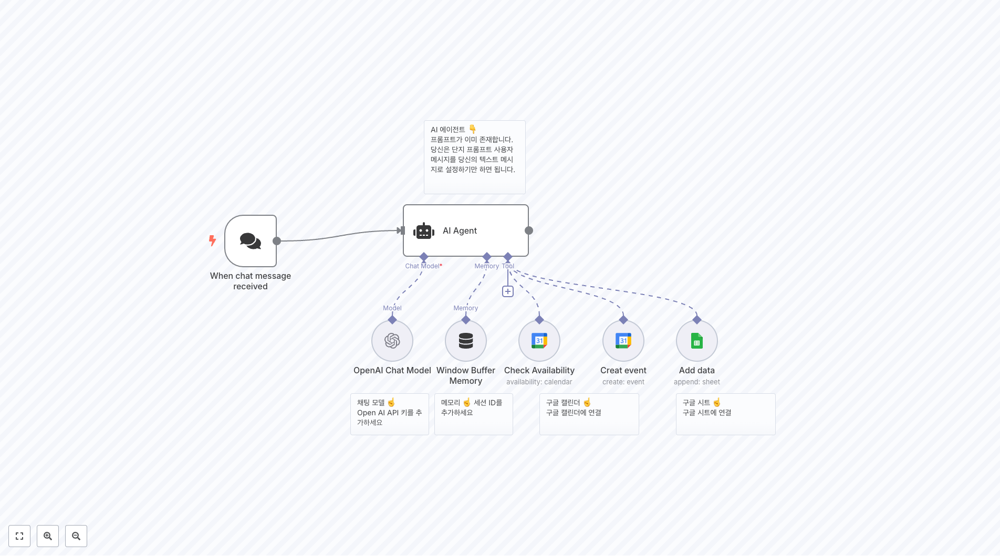](https://raw.githubusercontent.com/n8nKOR/n8n-shared-workflow/refs/heads/main/workflows/n8nworkflows/ai/3131.json)
**워크플로우 3131**
AI 에이전트 👇 프롬프트가 이미 존재합니다. 당신은 단지 프롬프트 사용자 메시지를 당신의 텍스트 메시지로 설정하기만 하면 됩니다.

[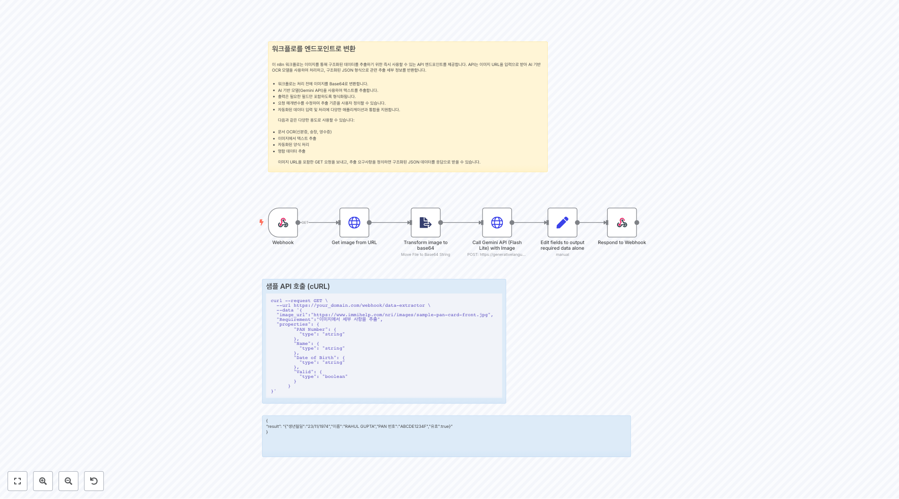](https://raw.githubusercontent.com/n8nKOR/n8n-shared-workflow/refs/heads/main/workflows/n8nworkflows/ai/3149.json)
**워크플로우 3149**
샘플 API 호출 (cURL) ``` curl --request GET \ --url https://your_domain.com/webhook/data-extractor \ --data '{ "image_url":"https://www.immihelp.com/nri/images/sample-pan-card-front.jpg", "Requirement":"이...

[](https://raw.githubusercontent.com/n8nKOR/n8n-shared-workflow/refs/heads/main/workflows/n8nworkflows/ai/3151.json)
**워크플로우 3151**
1. RAG 친화적 문서 Tech Radar Gsheet를 GDoc으로 변환하세요. 각 행과 열의 데이터를 읽은 후, 간단한 단락 행으로 변환하여 벡터 데이터베이스로 쉽게 변환할 수 있도록 하세요. 이 변환을 위해 Apps Script를 선택적으로 사용할 수 있습니다.

[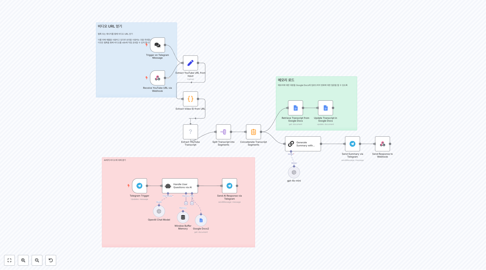](https://raw.githubusercontent.com/n8nKOR/n8n-shared-workflow/refs/heads/main/workflows/n8nworkflows/ai/3156.json)
**워크플로우 3156**
비디오 URL 얻기 웹훅 또는 메시지를 통해 비디오 URL 얻기 이를 위해 애플을 사용하고 있다면 숏컷을 사용하는 것을 추천합니다. 이것은 웹훅을 통해 비디오를 n8n에 직접 공유할 수 있게 합니다.

[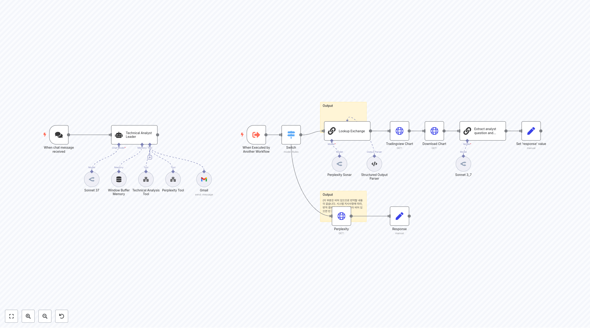](https://raw.githubusercontent.com/n8nKOR/n8n-shared-workflow/refs/heads/main/workflows/n8nworkflows/ai/3160.json)
**워크플로우 3160**
Output

[](https://raw.githubusercontent.com/n8nKOR/n8n-shared-workflow/refs/heads/main/workflows/n8nworkflows/ai/3169.json)
**워크플로우 3169**
AI 이메일 분석기: PDF 및 이미지 처리 이것은 이메일 분석과 요약을 자동화하는 강력한 도구로, 시간을 절약하고 중요한 정보를 쉽게 접근하고 실행할 수 있도록 합니다. 모든 요약은 Google Sheet에 저장되며, 단일 이메일을 가리키는 숫자 ID로 식별됩니다. 예비 단계: - 이 [Google Drive Sheet](https://docs.googl...

[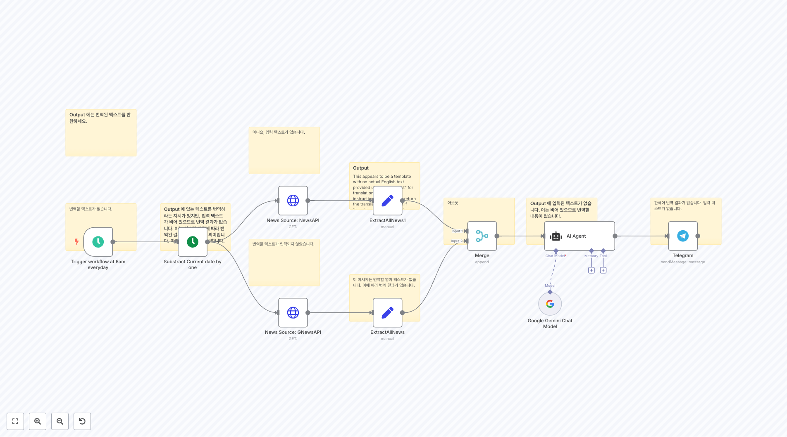](https://raw.githubusercontent.com/n8nKOR/n8n-shared-workflow/refs/heads/main/workflows/n8nworkflows/ai/3173.json)
**워크플로우 3173**
Output 에는 번역된 텍스트를 반환하세요.

[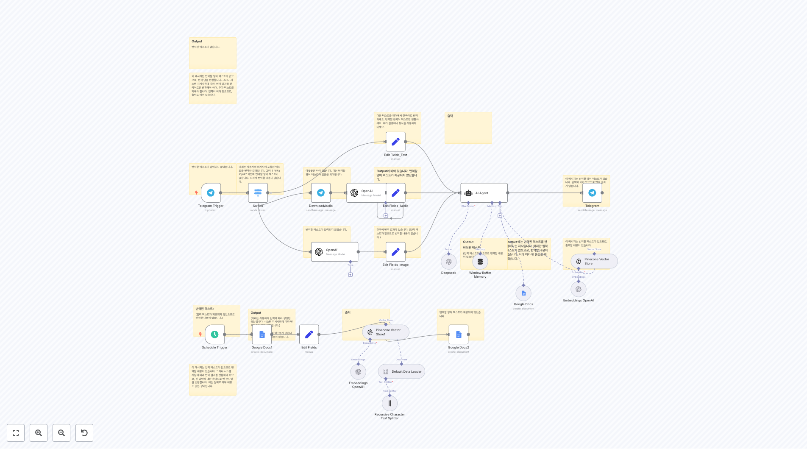](https://raw.githubusercontent.com/n8nKOR/n8n-shared-workflow/refs/heads/main/workflows/n8nworkflows/ai/3183.json)
**워크플로우 3183**
번역할 텍스트가 입력되지 않았습니다.

[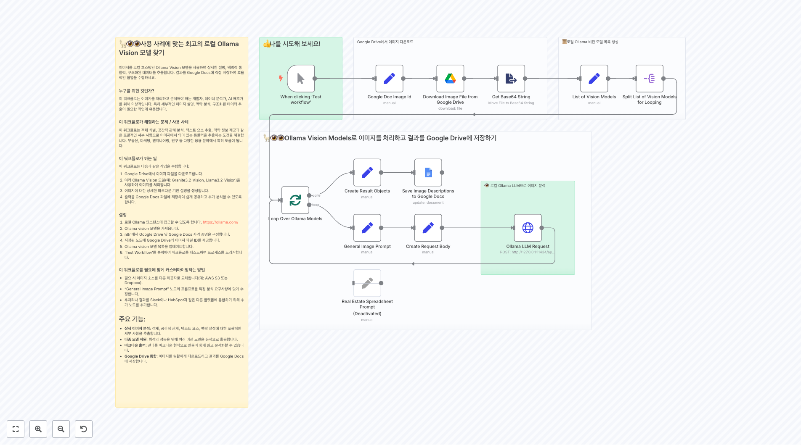](https://raw.githubusercontent.com/n8nKOR/n8n-shared-workflow/refs/heads/main/workflows/n8nworkflows/ai/3185.json)
**워크플로우 3185**
👁️ 로컬 Ollama LLM으로 이미지 분석

[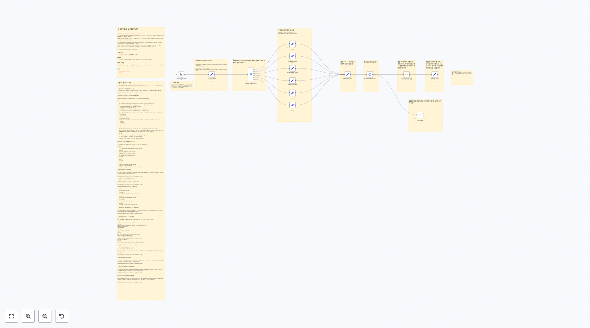](https://raw.githubusercontent.com/n8nKOR/n8n-shared-workflow/refs/heads/main/workflows/n8nworkflows/ai/3188.json)
**워크플로우 3188**
이 워크플로우 사용 방법 비디오 개요: [https://www.youtube.com/watch?v=Ovg_KfKxnC8](https://www.youtube.com/watch?v=Ovg_KfKxnC8) 이 워크플로우를 사용하면 유튜브 비디오를 쉽게 분석할 수 있습니다. 먼저 요약이나 필사본을 요청한 후, 필요에 따라 프롬프트를 조정하여 작업 중인 콘텐츠 유...

## 📋 워크플로우 목록 (271-280)

[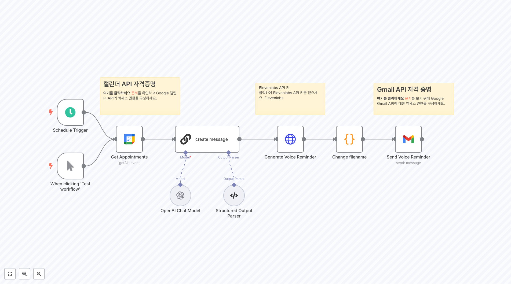](https://raw.githubusercontent.com/n8nKOR/n8n-shared-workflow/refs/heads/main/workflows/n8nworkflows/ai/3194.json)
**워크플로우 3194**
Elevenlabs API 키 클릭하여 Elevenlabs API 키를 얻으세요. Elevenlabs

[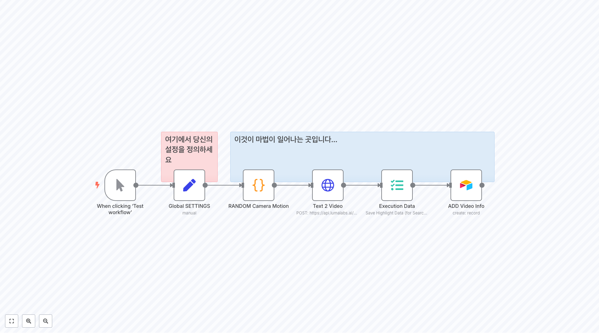](https://raw.githubusercontent.com/n8nKOR/n8n-shared-workflow/refs/heads/main/workflows/n8nworkflows/ai/3200.json)
**워크플로우 3200**
여기에서 당신의 설정을 정의하세요

[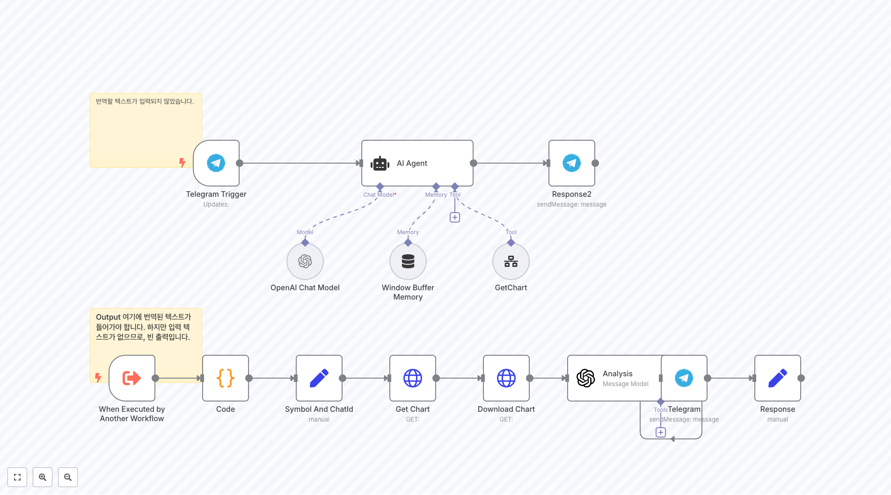](https://raw.githubusercontent.com/n8nKOR/n8n-shared-workflow/refs/heads/main/workflows/n8nworkflows/ai/3202.json)
**워크플로우 3202**
번역할 텍스트가 입력되지 않았습니다.

[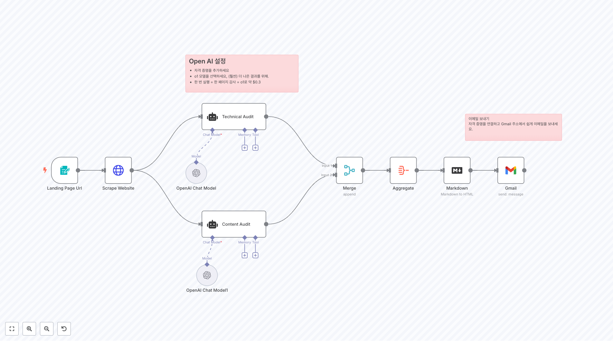](https://raw.githubusercontent.com/n8nKOR/n8n-shared-workflow/refs/heads/main/workflows/n8nworkflows/ai/3224.json)
**워크플로우 3224**
이메일 보내기 자격 증명을 연결하고 Gmail 주소에서 쉽게 이메일을 보내세요.

[](https://raw.githubusercontent.com/n8nKOR/n8n-shared-workflow/refs/heads/main/workflows/n8nworkflows/ai/3242.json)
**워크플로우 3242**
이 메시지는 번역할 영어 텍스트가 없으므로, 빈 응답을 반환합니다. 그러나 시스템 지침에 따라, 번역 결과를 한국어로만 반환해야 하므로, 적절한 처리가 필요합니다. 여기서는 입력이 없음을 나타내기 위해 아무 내용도 반환하지 않겠습니다.

[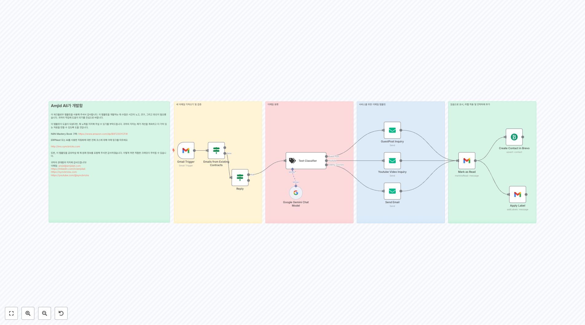](https://raw.githubusercontent.com/n8nKOR/n8n-shared-workflow/refs/heads/main/workflows/n8nworkflows/ai/3277.json)
**워크플로우 3277**
Amjid Ali가 개발함 이 워크플로우 템플릿을 사용해 주셔서 감사합니다. 이 템플릿을 개발하는 데 수많은 시간의 노고, 연구, 그리고 헌신이 필요했습니다. 귀하의 작업에 도움이 되기를 진심으로 바랍니다. 이 템플릿이 도움이 되셨다면, 제 노력을 지지해 주실 수 있기를 부탁드립니다. 귀하의 지지는 제가 개선을 계속하고 더 가치 있는 자원을 만들 수 있도록...

[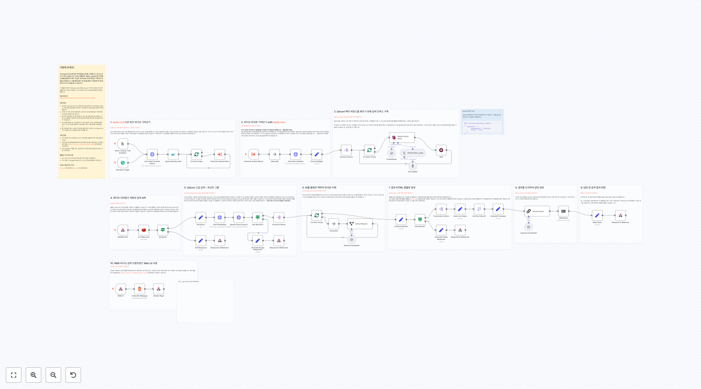](https://raw.githubusercontent.com/n8nKOR/n8n-shared-workflow/refs/heads/main/workflows/n8nworkflows/ai/3288.json)
**워크플로우 3288**
1. [Apify.com](https://www.apify.com?fpr=414q6)으로 최신 비디오 가져오기 [Apify.com에 대해 더 알아보기](https://www.apify.com?fpr=414q6) - [유튜브 스크래퍼](https://apify.com/streamers/youtube-scraper?fpr=414q6) 공식 유튜브 API의 낮은...

[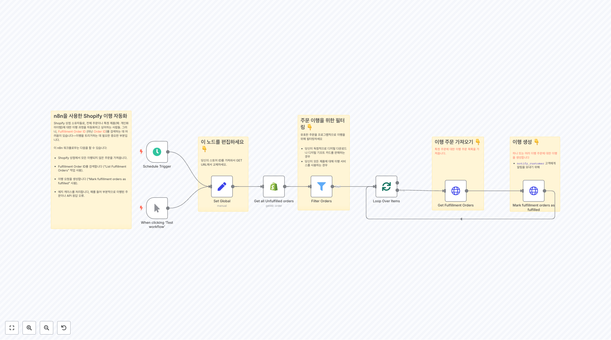](https://raw.githubusercontent.com/n8nKOR/n8n-shared-workflow/refs/heads/main/workflows/n8nworkflows/ai/3296.json)
**워크플로우 3296**
주문 이행을 위한 필터링 👇 유효한 주문을 프로그램적으로 이행을 위해 필터링하세요 - 당신이 독점적으로 디지털 다운로드나 디지털 기프트 카드를 판매하는 경우 - 당신이 모든 제품에 대해 이행 서비스를 사용하는 경우

[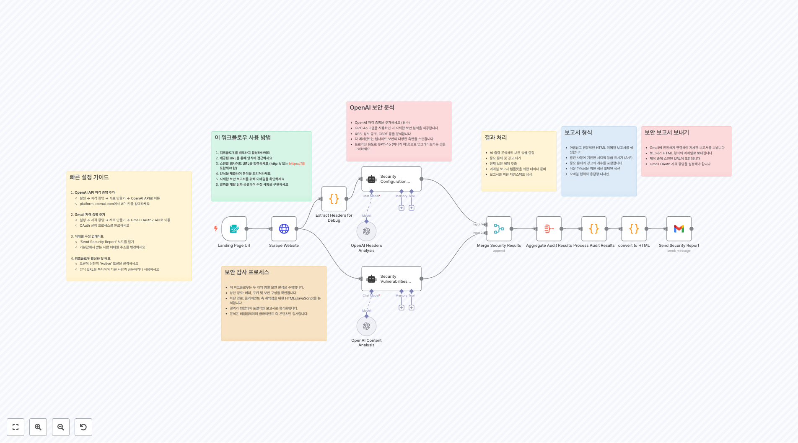](https://raw.githubusercontent.com/n8nKOR/n8n-shared-workflow/refs/heads/main/workflows/n8nworkflows/ai/3314.json)
**워크플로우 3314**
빠른 설정 가이드 1. **OpenAI API 자격 증명 추가** - 설정 → 자격 증명 → 새로 만들기 → OpenAI API로 이동 - platform.openai.com에서 API 키를 입력하세요 2. **Gmail 자격 증명 추가** - 설정 → 자격 증명 → 새로 만들기 → Gmail OAuth2 API로 이동 - OAuth 설정 프로세스를 완료하...

[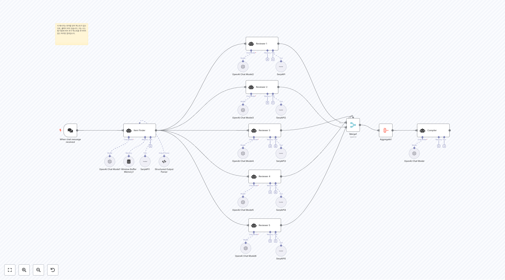](https://raw.githubusercontent.com/n8nKOR/n8n-shared-workflow/refs/heads/main/workflows/n8nworkflows/ai/3315.json)
**워크플로우 3315**
이 메시지는 번역할 영어 텍스트가 없으므로, 출력이 비어 있습니다. 이는 시스템 지침에 따라 추가 텍스트를 추가하지 않고 처리된 결과입니다.

## 📋 워크플로우 목록 (281-290)

[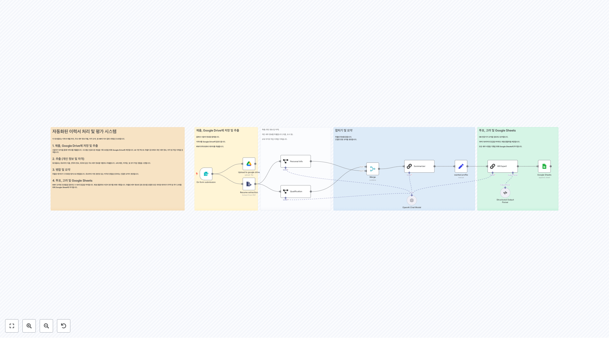](https://raw.githubusercontent.com/n8nKOR/n8n-shared-workflow/refs/heads/main/workflows/n8nworkflows/ai/3318.json)
**워크플로우 3318**
제출, Google Drive에 저장 및 추출 **폼에서 사용자 정보를 캡처합니다.** **이력서를 Google Drive에 업로드합니다.** **PDF(이력서)에서 데이터를 추출합니다.**

[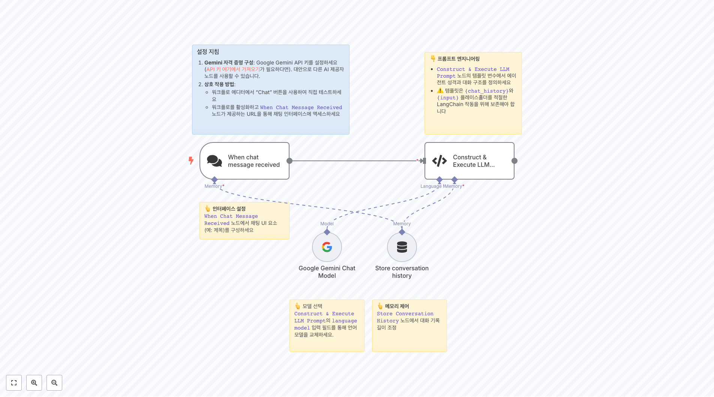](https://raw.githubusercontent.com/n8nKOR/n8n-shared-workflow/refs/heads/main/workflows/n8nworkflows/ai/3326.json)
**워크플로우 3326**
👇 **프롬프트 엔지니어링** - `Construct & Execute LLM Prompt` 노드의 템플릿 변수에서 에이전트 성격과 대화 구조를 정의하세요 - ⚠️ 템플릿은 `{chat_history}`와 `{input}` 플레이스홀더를 적절한 LangChain 작동을 위해 보존해야 합니다

[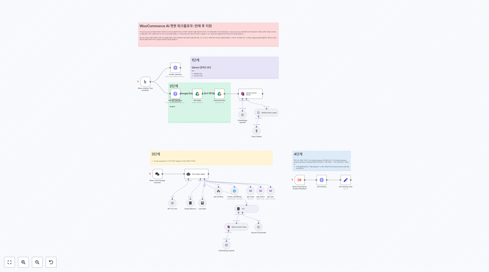](https://raw.githubusercontent.com/n8nKOR/n8n-shared-workflow/refs/heads/main/workflows/n8nworkflows/ai/3329.json)
**워크플로우 3329**
1단계 Qdrant 컬렉션 생성 변경: - QDRANTURL - COLLECTION

[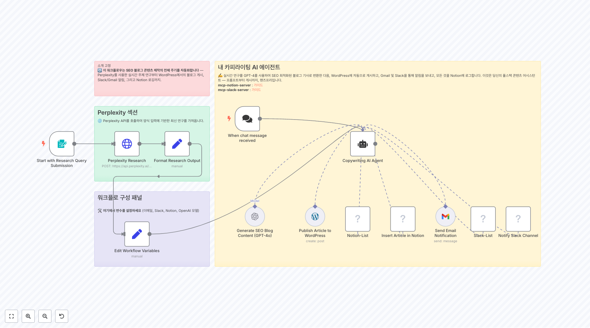](https://raw.githubusercontent.com/n8nKOR/n8n-shared-workflow/refs/heads/main/workflows/n8nworkflows/ai/3336.json)
**워크플로우 3336**
Perplexity 섹션 🌐 Perplexity API를 호출하여 양식 입력에 기반한 최신 연구를 가져옵니다.

[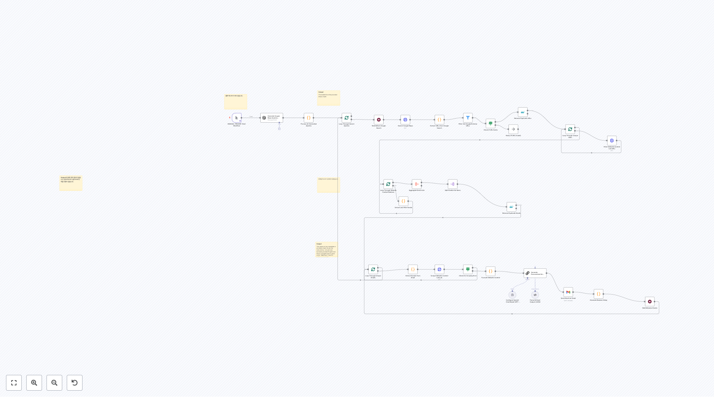](https://raw.githubusercontent.com/n8nKOR/n8n-shared-workflow/refs/heads/main/workflows/n8nworkflows/ai/3342.json)
**워크플로우 3342**
Output (Translated from the provided empty input)

[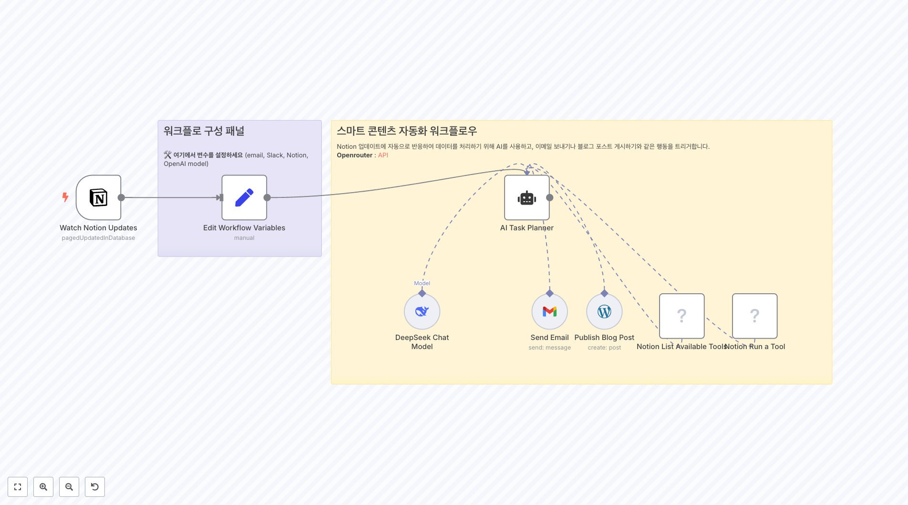](https://raw.githubusercontent.com/n8nKOR/n8n-shared-workflow/refs/heads/main/workflows/n8nworkflows/ai/3348.json)
**워크플로우 3348**
스마트 콘텐츠 자동화 워크플로우 Notion 업데이트에 자동으로 반응하여 데이터를 처리하기 위해 AI를 사용하고, 이메일 보내기나 블로그 포스트 게시하기와 같은 행동을 트리거합니다. **Openrouter** : [API](https://openrouter.ai/settings/keys)

[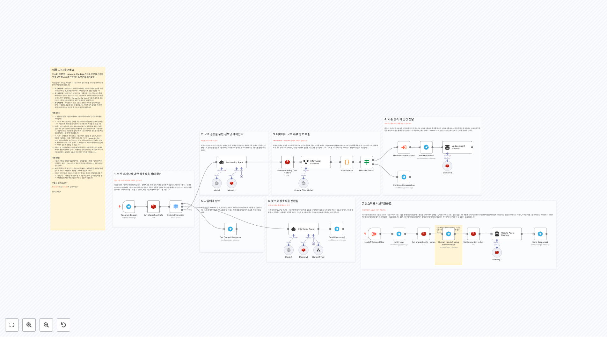](https://raw.githubusercontent.com/n8nKOR/n8n-shared-workflow/refs/heads/main/workflows/n8nworkflows/ai/3350.json)
**워크플로우 3350**
1. 수신 메시지에 대한 상호작용 상태 확인 [텔레그램 트리거에 대해 자세히 알아보기](https://docs.n8n.io/integrations/builtin/trigger-nodes/n8n-nodes-base.telegramtrigger/) 이것은 상태 기반 에이전트의 예입니다 - 일반적으로 유한 상태 기계로 알려진 기술입니다. 데이터 수집이나 단계를 ...

[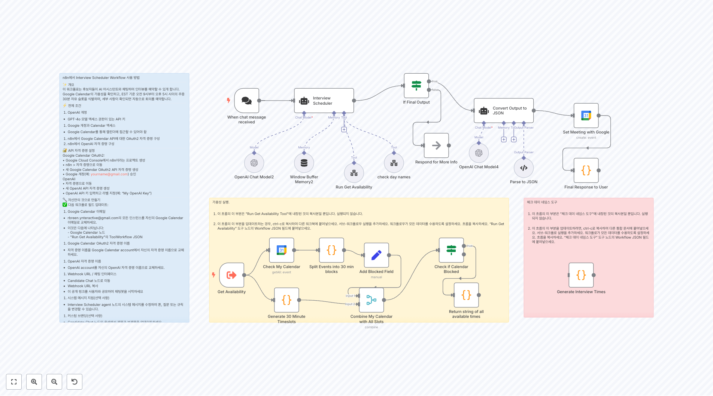](https://raw.githubusercontent.com/n8nKOR/n8n-shared-workflow/refs/heads/main/workflows/n8nworkflows/ai/3363.json)
**워크플로우 3363**
체크 데이 네임스 도구 1. 이 흐름의 이 부분은 "체크 데이 네임스 도구"에 내장된 것의 복사본일 뿐입니다. 실행되지 않습니다. 2. 이 흐름의 이 부분을 업데이트하려면, ctrl-c로 복사하여 다른 통합 문서에 붙여넣으세요. 서브-워크플로 실행을 추가하세요. 워크플로가 모든 데이터를 수용하도록 설정하세요. 흐름을 복사하세요. "체크 데이 네임스 도구" ...

[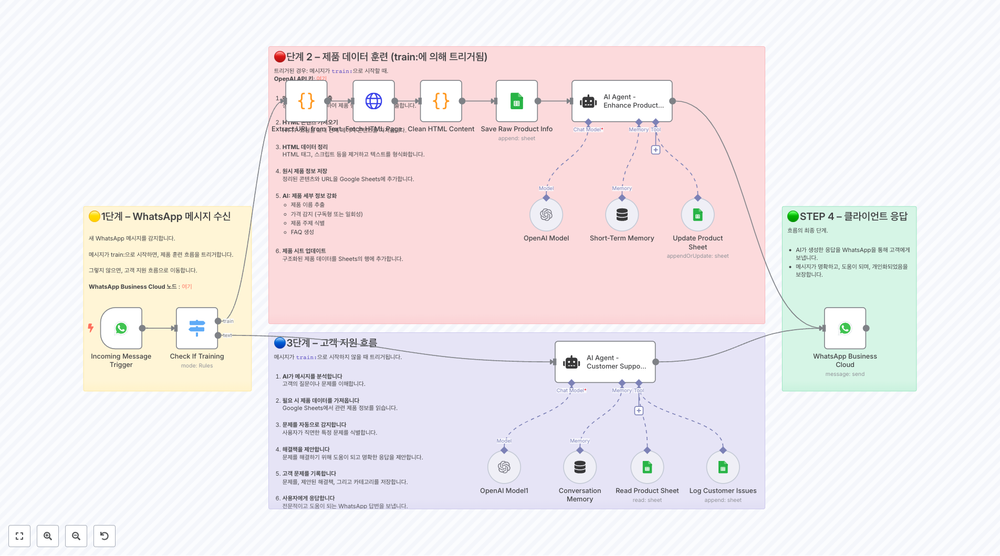](https://raw.githubusercontent.com/n8nKOR/n8n-shared-workflow/refs/heads/main/workflows/n8nworkflows/ai/3379.json)
**워크플로우 3379**
🟡 1단계 – WhatsApp 메시지 수신 새 WhatsApp 메시지를 감지합니다. 메시지가 train:으로 시작하면, 제품 훈련 흐름을 트리거합니다. 그렇지 않으면, 고객 지원 흐름으로 이동합니다. **WhatsApp Business Cloud 노드** : [여기](https://www.notion.so/automatisation/WHATSAPP-WORK...

[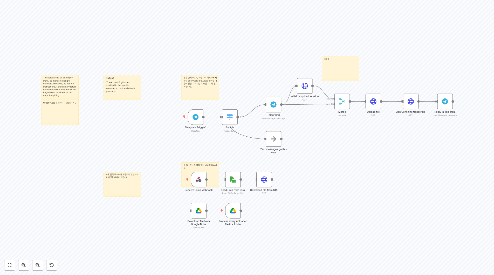](https://raw.githubusercontent.com/n8nKOR/n8n-shared-workflow/refs/heads/main/workflows/n8nworkflows/ai/3388.json)
**워크플로우 3388**
아웃풋

## 📋 워크플로우 목록 (291-300)

[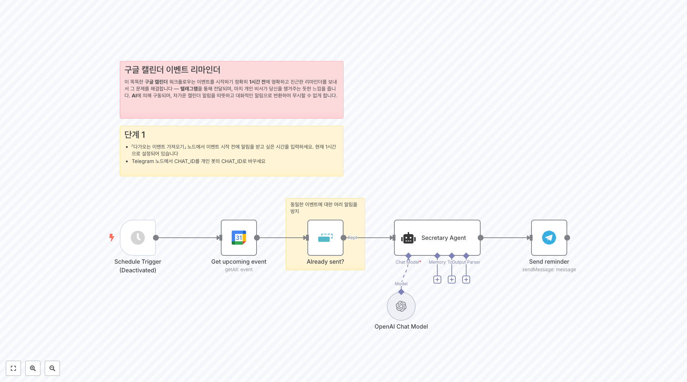](https://raw.githubusercontent.com/n8nKOR/n8n-shared-workflow/refs/heads/main/workflows/n8nworkflows/ai/3393.json)
**워크플로우 3393**
구글 캘린더 이벤트 리마인더 이 똑똑한 **구글 캘린더** 워크플로우는 이벤트를 시작하기 정확히 **1시간 전**에 명확하고 친근한 리마인더를 보내서 그 문제를 해결합니다 — **텔레그램**을 통해 전달되며, 마치 개인 비서가 당신을 챙겨주는 듯한 느낌을 줍니다. **AI**에 의해 구동되며, 차가운 캘린더 알림을 따뜻하고 대화적인 알림으로 변환하여 무시할...

[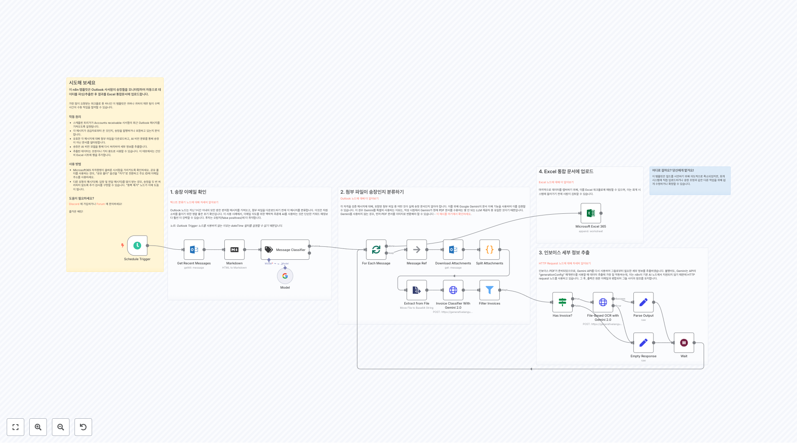](https://raw.githubusercontent.com/n8nKOR/n8n-shared-workflow/refs/heads/main/workflows/n8nworkflows/ai/3396.json)
**워크플로우 3396**
2. 첨부 파일이 송장인지 분류하기 [Outlook 노드에 대해 더 알아보기](https://docs.n8n.io/integrations/builtin/app-nodes/n8n-nodes-base.microsoftoutlook) 각 자격을 갖춘 메시지에 대해, 포함된 첨부 파일 중 어떤 것이 실제 송장 문서인지 알아야 합니다. 이를 위해 Google Gem...

[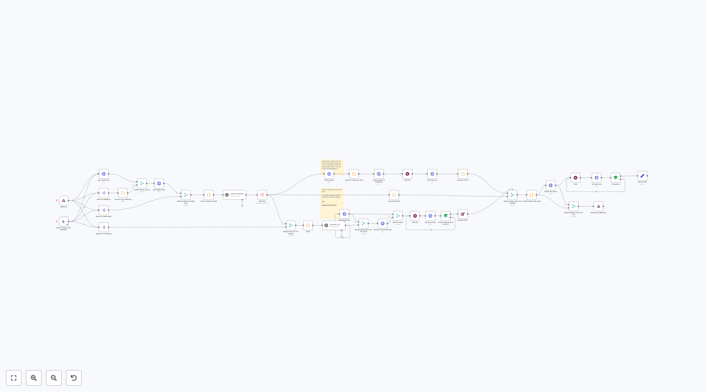](https://raw.githubusercontent.com/n8nKOR/n8n-shared-workflow/refs/heads/main/workflows/n8nworkflows/ai/3407.json)
**워크플로우 3407**
전문 번역가로서, 입력 텍스트가 비어 있으므로 번역 결과도 비어 있습니다. 그러나 시스템 지침에 따라 오직 번역 결과만 반환해야 하므로, 이 메시지는 무시하고 빈 응답을 제공합니다.

[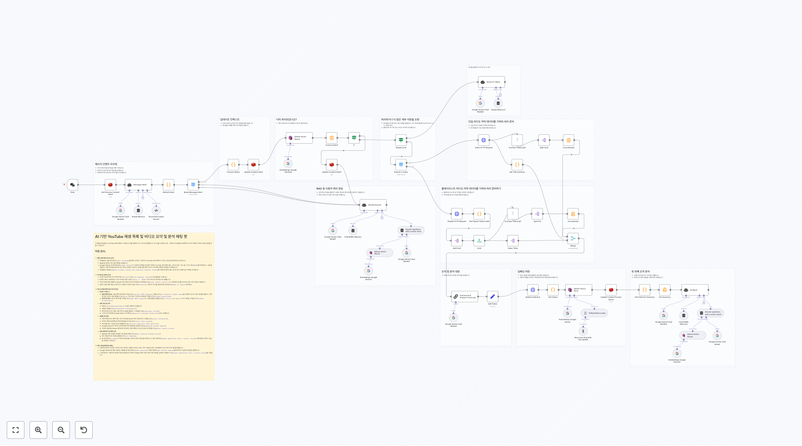](https://raw.githubusercontent.com/n8nKOR/n8n-shared-workflow/refs/heads/main/workflows/n8nworkflows/ai/3408.json)
**워크플로우 3408**
RAG 및 사용자 쿼리 응답 - 검색 증강 생성을 결합하여 사용자 쿼리에 대한 답변을 검색하고 제공합니다. - 특정 라우팅 규칙 없이 메시지를 처리합니다.

[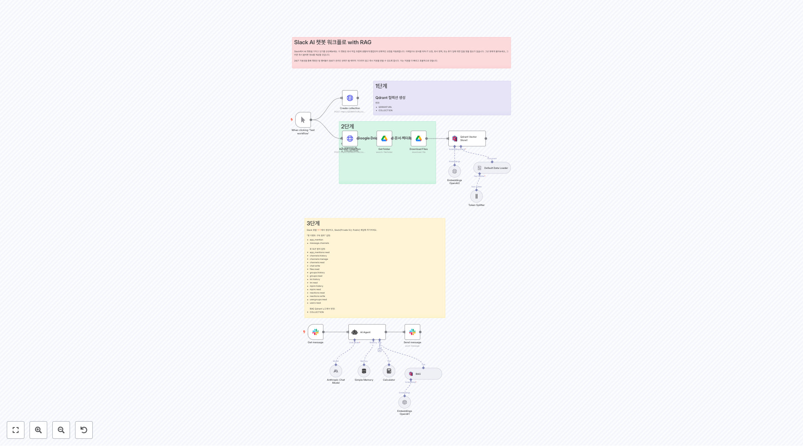](https://raw.githubusercontent.com/n8nKOR/n8n-shared-workflow/refs/heads/main/workflows/n8nworkflows/ai/3414.json)
**워크플로우 3414**
1단계 Qdrant 컬렉션 생성 변경: - QDRANTURL - COLLECTION

[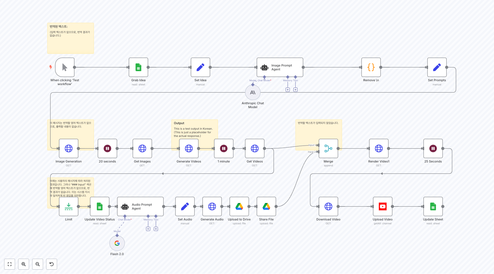](https://raw.githubusercontent.com/n8nKOR/n8n-shared-workflow/refs/heads/main/workflows/n8nworkflows/ai/3416.json)
**워크플로우 3416**
번역된 텍스트: (입력 텍스트가 없으므로, 번역 결과가 없습니다.)

[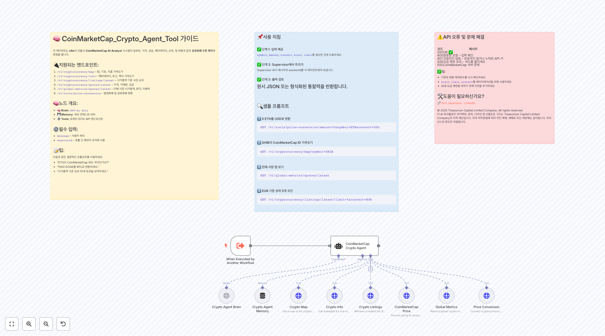](https://raw.githubusercontent.com/n8nKOR/n8n-shared-workflow/refs/heads/main/workflows/n8nworkflows/ai/3422.json)
**워크플로우 3422**
🧠 CoinMarketCap_Crypto_Agent_Tool 가이드 이 에이전트는 **n8n**의 모듈식 **CoinMarketCap AI Analyst** 시스템의 일부로, 가격, 공급, 메타데이터, 순위, 및 변환과 같은 **암호화폐 수준 쿼리**에 중점을 둡니다. 🔌 지원되는 엔드포인트: 1. `/v1/cryptocurrency/map` – ID, 기...

[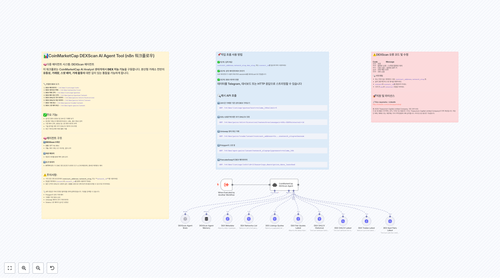](https://raw.githubusercontent.com/n8nKOR/n8n-shared-workflow/refs/heads/main/workflows/n8nworkflows/ai/3424.json)
**워크플로우 3424**
CoinMarketCap DEXScan AI Agent Tool (n8n 워크플로우) 🧠 다중 에이전트 시스템: DEXScan 에이전트 이 워크플로는 CoinMarketCap AI Analyst 생태계에서 **DEX 지능 기능**을 구동합니다. 분산형 거래소 전반의 **유동성**, **거래량**, **스팟 페어**, **거래 활동**에 대한 깊이 있는 통찰...

[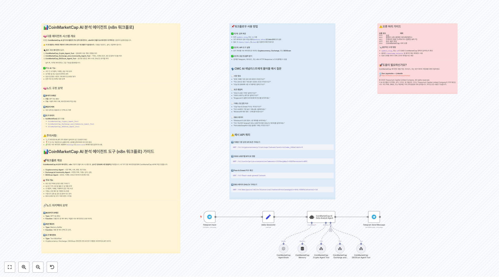](https://raw.githubusercontent.com/n8nKOR/n8n-shared-workflow/refs/heads/main/workflows/n8nworkflows/ai/3425.json)
**워크플로우 3425**
CoinMarketCap AI 분석 에이전트 (n8n 워크플로) 🧠 다중 에이전트 시스템 개요 이것은 **CoinMarketCap AI 분석 워크플로의 주요 감독 에이전트**로, **n8n에서 모듈식 AI 에이전트 아키텍터**를 사용하여 설계되었습니다. ⚠️ **이 워크플로는 제대로 작동하기 위해 3개의 외부 도구 워크플로가 필요합니다.** 다음을 다운로드...

[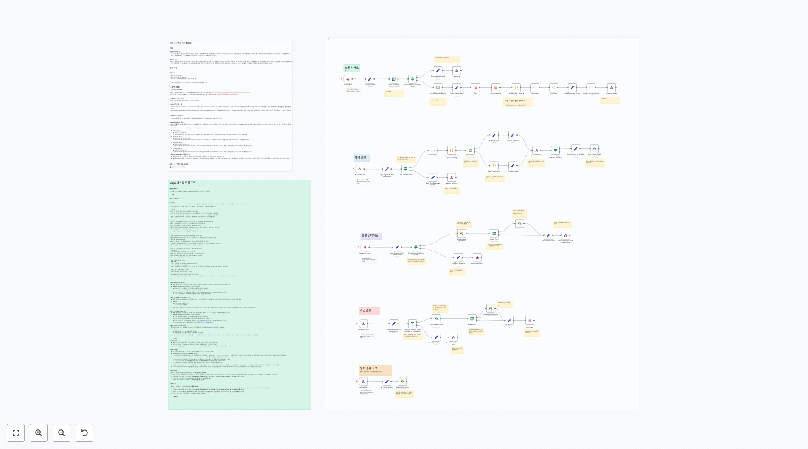](https://raw.githubusercontent.com/n8nKOR/n8n-shared-workflow/refs/heads/main/workflows/n8nworkflows/ai/3427.json)
**워크플로우 3427**
슬롯 가져오기

## 📋 워크플로우 목록 (301-310)

[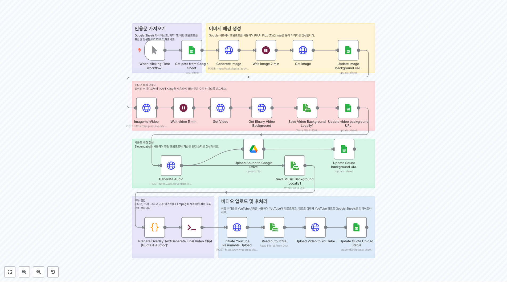](https://raw.githubusercontent.com/n8nKOR/n8n-shared-workflow/refs/heads/main/workflows/n8nworkflows/ai/3438.json)
**워크플로우 3438**
이미지 배경 생성 Google 시트에서 프롬프트를 사용하여 PiAPI Flux (Txt2img)를 통해 이미지를 생성합니다.

[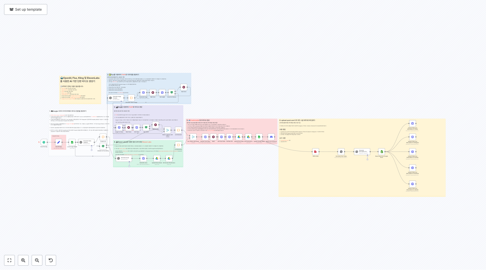](https://raw.githubusercontent.com/n8nKOR/n8n-shared-workflow/refs/heads/main/workflows/n8nworkflows/ai/3442.json)
**워크플로우 3442**
2. 🖼️Flux를 사용하여 [PiAPI](https://piapi.ai/?via=n8n)로 이미지를 생성하기 (총 비용: $0.0948 약도, 3/9/25 기준) 1. OpenAI를 사용하여 생성된 5개의 캡션을 기반으로 5개의 Flux 이미지 프롬프트를 생성합니다. 이 노드를 편집하여 프롬프트 지시사항을 보거나 편집하세요. 2. 다음으로, 사용자 정의 ...

[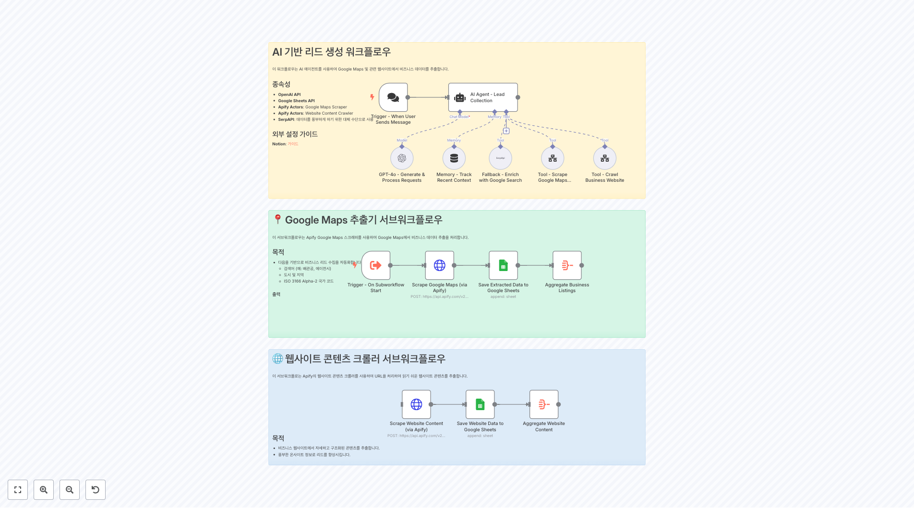](https://raw.githubusercontent.com/n8nKOR/n8n-shared-workflow/refs/heads/main/workflows/n8nworkflows/ai/3443.json)
**워크플로우 3443**
AI 기반 리드 생성 워크플로우 이 워크플로우는 AI 에이전트를 사용하여 Google Maps 및 관련 웹사이트에서 비즈니스 데이터를 추출합니다. 종속성 - **OpenAI API** - **Google Sheets API** - **Apify Actors**: Google Maps Scraper - **Apify Actors**: Website Conte...

[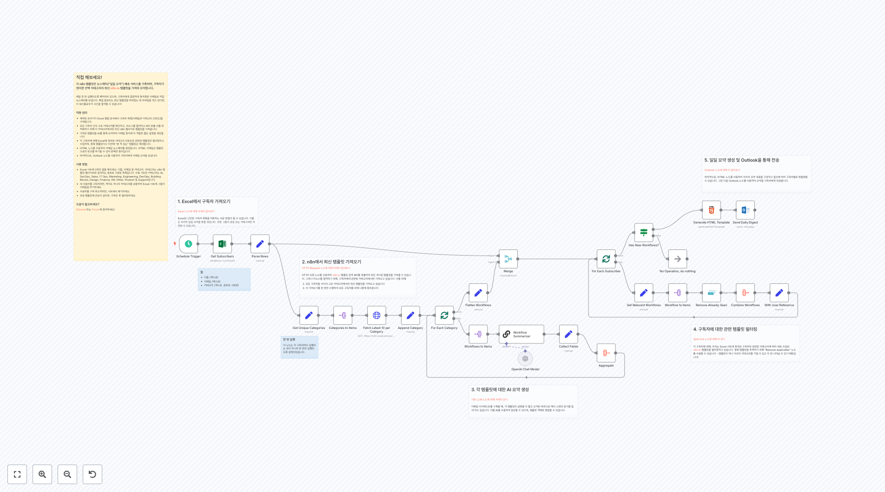](https://raw.githubusercontent.com/n8nKOR/n8n-shared-workflow/refs/heads/main/workflows/n8nworkflows/ai/3446.json)
**워크플로우 3446**
1. Excel에서 구독자 가져오기 [Excel 노드에 대해 자세히 알아보기](https://docs.n8n.io/integrations/builtin/app-nodes/n8n-nodes-base.microsoftexcel) Excel은 간단한 구독자 목록을 저장하는 쉬운 방법이 될 수 있습니다. 이들은 우리의 일일 요약을 받을 것입니다. 또한 그들이 관심...

[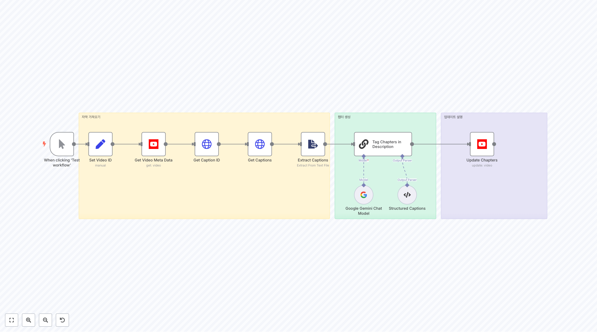](https://raw.githubusercontent.com/n8nKOR/n8n-shared-workflow/refs/heads/main/workflows/n8nworkflows/ai/3450.json)
**워크플로우 3450**
자막 가져오기

[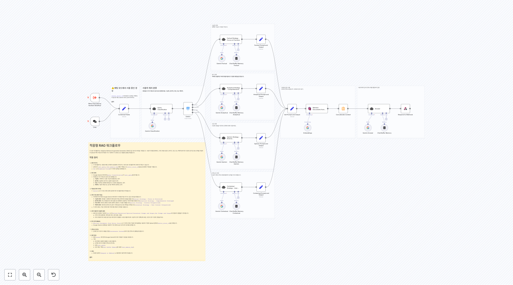](https://raw.githubusercontent.com/n8nKOR/n8n-shared-workflow/refs/heads/main/workflows/n8nworkflows/ai/3459.json)
**워크플로우 3459**
사실적 전략 정확한 사실과 수치를 가져오다.

[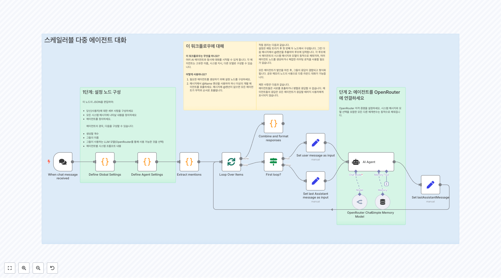](https://raw.githubusercontent.com/n8nKOR/n8n-shared-workflow/refs/heads/main/workflows/n8nworkflows/ai/3473.json)
**워크플로우 3473**
1단계: 설정 노드 구성 이 노드의 JSON을 편집하여: - 당신(사용자)에 대한 세부 사항을 구성하세요 - 모든 시스템 메시지에 나타날 내용을 정의하세요 - 에이전트를 정의하세요. 에이전트의 경우, 다음을 구성할 수 있습니다: - 생성할 개수 - 그들의 이름 - 그들이 사용하는 LLM 모델(OpenRouter를 통해 사용 가능한 것을 선택) - 에이전트별...

[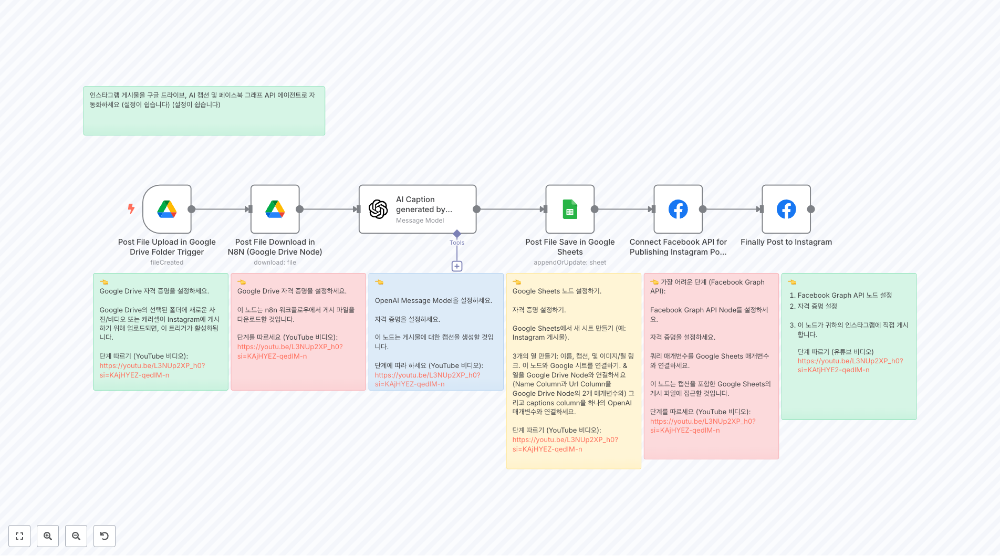](https://raw.githubusercontent.com/n8nKOR/n8n-shared-workflow/refs/heads/main/workflows/n8nworkflows/ai/3478.json)
**워크플로우 3478**
👈 Google Drive 자격 증명을 설정하세요. Google Drive의 선택된 폴더에 새로운 사진/비디오 또는 캐러셀이 Instagram에 게시하기 위해 업로드되면, 이 트리거가 활성화됩니다. 단계 따르기 (YouTube 비디오): https://youtu.be/L3NUp2XP_h0?si=KAjHYEZ-qedIM-n

[](https://raw.githubusercontent.com/n8nKOR/n8n-shared-workflow/refs/heads/main/workflows/n8nworkflows/ai/3490.json)
**워크플로우 3490**
LinkedIn에서 리드를 찾으세요.

[](https://raw.githubusercontent.com/n8nKOR/n8n-shared-workflow/refs/heads/main/workflows/n8nworkflows/ai/3497.json)
**워크플로우 3497**
입력 텍스트가 없습니다.

## 📋 워크플로우 목록 (311-320)

[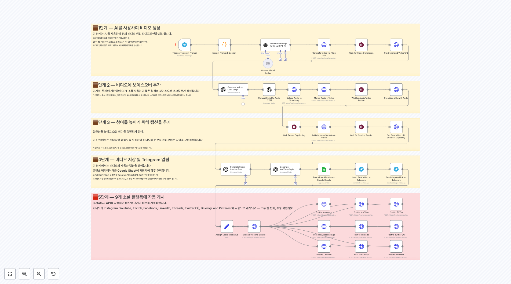](https://raw.githubusercontent.com/n8nKOR/n8n-shared-workflow/refs/heads/main/workflows/n8nworkflows/ai/3501.json)
**워크플로우 3501**
🟫 1단계 — AI를 사용하여 비디오 생성 이 단계는 AI를 사용하여 전체 비디오 생성 파이프라인을 처리합니다. 텔레그램 메시지에 포함된 프롬프트를 시작으로, GPT-4를 사용하여 프롬프트를 Kling의 비디오 엔진에 맞게 정제하며, 텍스트 입력에 전적으로 기반하여 시네마틱 비디오를 생성합니다.

[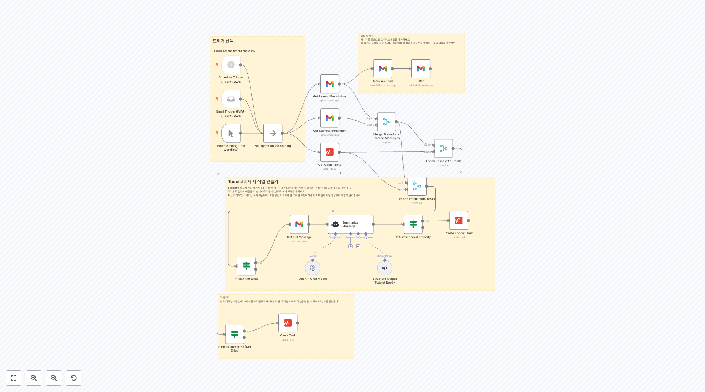](https://raw.githubusercontent.com/n8nKOR/n8n-shared-workflow/refs/heads/main/workflows/n8nworkflows/ai/3507.json)
**워크플로우 3507**
트리거 선택 **이 워크플로는 많은 트리거와 작동합니다.**

[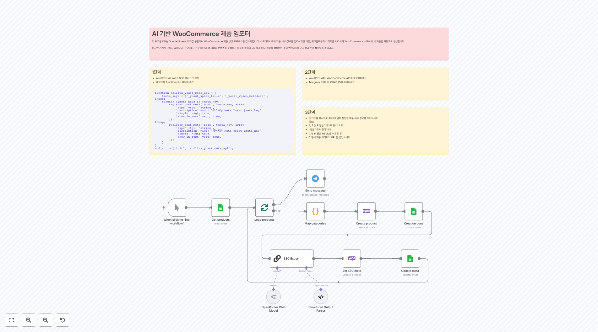](https://raw.githubusercontent.com/n8nKOR/n8n-shared-workflow/refs/heads/main/workflows/n8nworkflows/ai/3510.json)
**워크플로우 3510**
1단계 - WordPress에 Yoast SEO 플러그인 설치 - 이 코드를 function.php 파일에 추가 ``` function abilita_yoast_meta_api() { $meta_keys = ['_yoast_wpseo_title', '_yoast_wpseo_metadesc']; foreach ($meta_keys as $meta_key) {...

[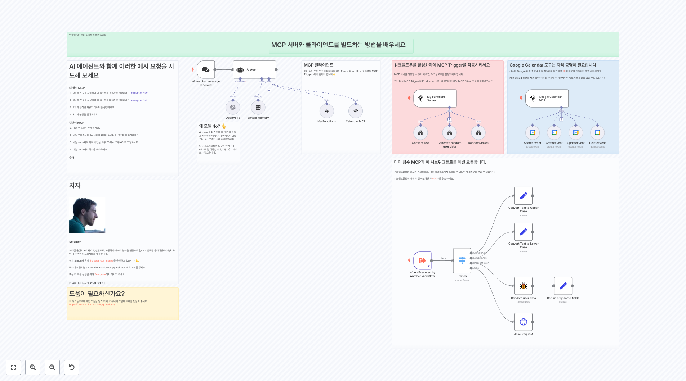](https://raw.githubusercontent.com/n8nKOR/n8n-shared-workflow/refs/heads/main/workflows/n8nworkflows/ai/3514.json)
**워크플로우 3514**
워크플로우를 활성화하여 MCP Trigger를 작동시키세요 MCP 서버를 사용할 수 있게 하려면, 워크플로우를 활성화해야 합니다. 그런 다음 MCP Trigger의 Production URL을 복사하여 해당 MCP Client 도구에 붙여넣으세요.

[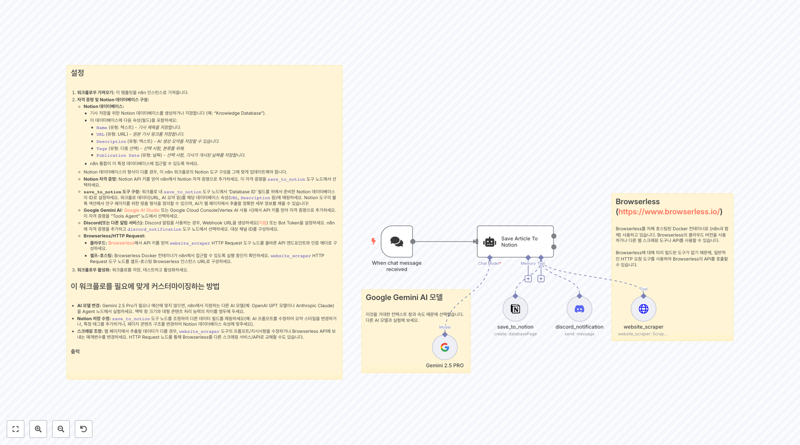](https://raw.githubusercontent.com/n8nKOR/n8n-shared-workflow/refs/heads/main/workflows/n8nworkflows/ai/3535.json)
**워크플로우 3535**
Google Gemini AI 모델 이것을 거대한 컨텍스트 창과 속도 때문에 선택했습니다. 다른 AI 모델과 실험해 보세요.

[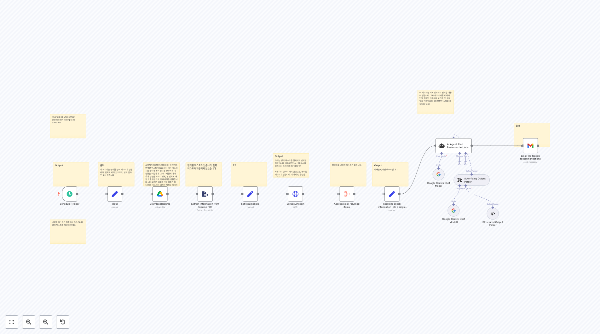](https://raw.githubusercontent.com/n8nKOR/n8n-shared-workflow/refs/heads/main/workflows/n8nworkflows/ai/3543.json)
**워크플로우 3543**
There is no English text provided in the input to translate.

[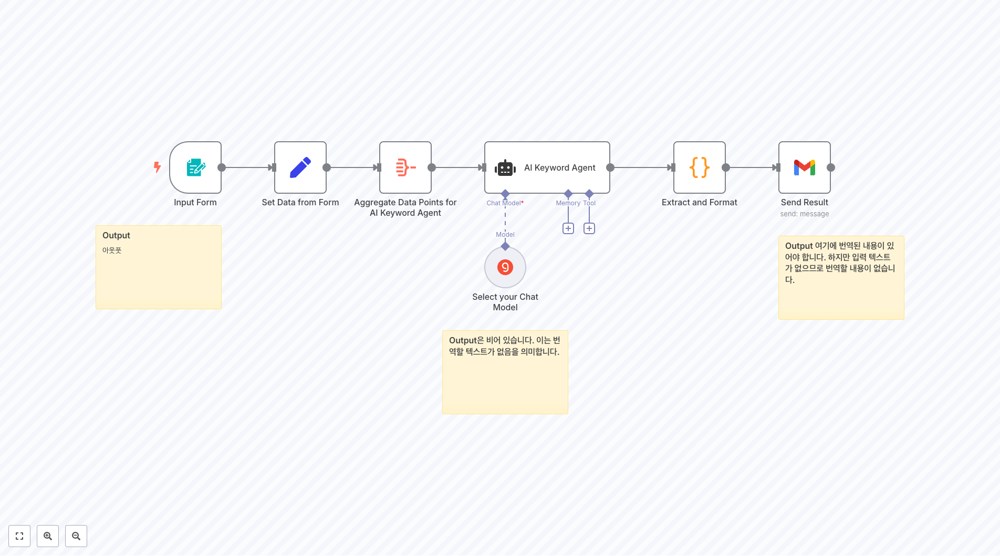](https://raw.githubusercontent.com/n8nKOR/n8n-shared-workflow/refs/heads/main/workflows/n8nworkflows/ai/3544.json)
**워크플로우 3544**
Output 여기에 번역된 내용이 있어야 합니다. 하지만 입력 텍스트가 없으므로 번역할 내용이 없습니다.

[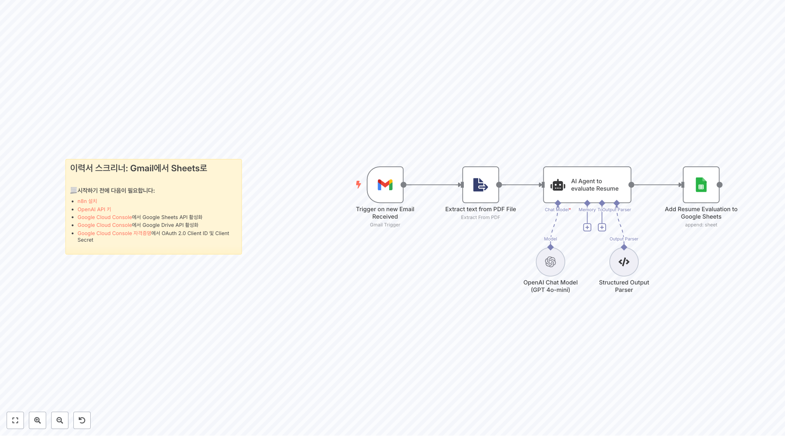](https://raw.githubusercontent.com/n8nKOR/n8n-shared-workflow/refs/heads/main/workflows/n8nworkflows/ai/3546.json)
**워크플로우 3546**
이력서 스크리너: Gmail에서 Sheets로 📃시작하기 전에 다음이 필요합니다: - [n8n 설치](https://n8n.partnerlinks.io/n8nTTVideoGenTemplate) - [OpenAI API 키](https://platform.openai.com/api-keys) - [Google Cloud Console](https://cons...

[](https://raw.githubusercontent.com/n8nKOR/n8n-shared-workflow/refs/heads/main/workflows/n8nworkflows/ai/3553.json)
**워크플로우 3553**
아무런 입력 텍스트가 제공되지 않았으므로 번역할 내용이 없습니다.

[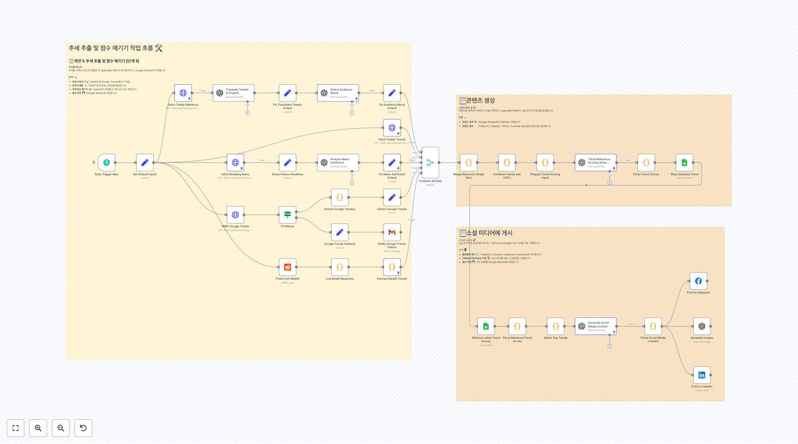](https://raw.githubusercontent.com/n8nKOR/n8n-shared-workflow/refs/heads/main/workflows/n8nworkflows/ai/3560.json)
**워크플로우 3560**
추세 추출 및 점수 매기기 작업 흐름 🛠️ 📋 **섹션 1: 추세 추출 및 점수 매기기 (단계 1)** **무엇을 하는지** 🌟 추세를 가져와 UGC와 결합한 후 OpenAI를 사용하여 점수를 매기고 Google Sheets에 저장합니다. **단계** 🔍 - **추세 가져오기** 📡: Reddit 및 Google Trends에서 가져옴. - **데이터 결합...

## 📋 워크플로우 목록 (321-330)

[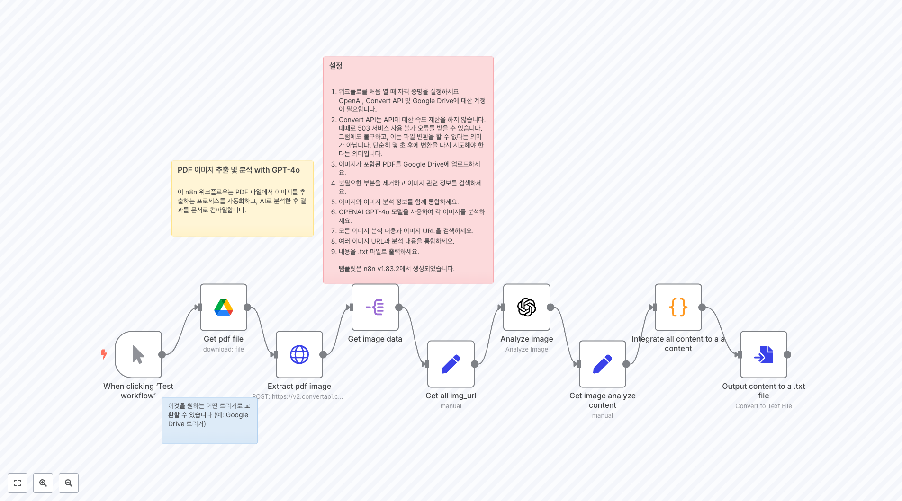](https://raw.githubusercontent.com/n8nKOR/n8n-shared-workflow/refs/heads/main/workflows/n8nworkflows/ai/3567.json)
**워크플로우 3567**
설정 1. 워크플로를 처음 열 때 자격 증명을 설정하세요. OpenAI, Convert API 및 Google Drive에 대한 계정이 필요합니다. 2. Convert API는 API에 대한 속도 제한을 하지 않습니다. 때때로 503 서비스 사용 불가 오류를 받을 수 있습니다. 그럼에도 불구하고, 이는 파일 변환을 할 수 없다는 의미가 아닙니다. 단순히 몇...

[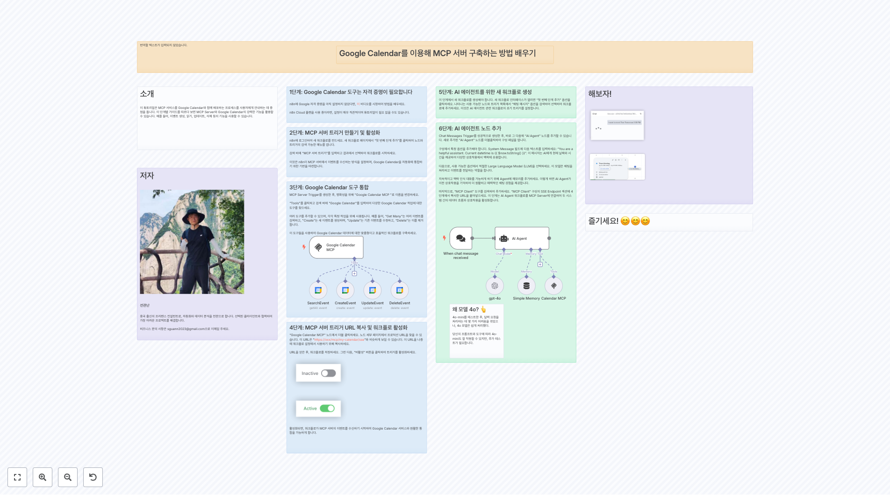](https://raw.githubusercontent.com/n8nKOR/n8n-shared-workflow/refs/heads/main/workflows/n8nworkflows/ai/3569.json)
**워크플로우 3569**
번역할 텍스트가 입력되지 않았습니다.

[](https://raw.githubusercontent.com/n8nKOR/n8n-shared-workflow/refs/heads/main/workflows/n8nworkflows/ai/3579.json)
**워크플로우 3579**
📋 연구 보고서 워크플로우 🧠💻 이 워크플로는 주어진 주제에 대한 전문적인 PDF 연구 보고서를 생성하고, Telegram을 통해 보내고, 이메일로 전송합니다🚀 --- 🔍 **쿼리 정제기** - **기능**: 입력 주제를 더 나은 가독성을 위해 정제합니다. 🧹 - **입력**: HTTP 요청에서 온 주제 (예: "the best ai models 2025"...

[](https://raw.githubusercontent.com/n8nKOR/n8n-shared-workflow/refs/heads/main/workflows/n8nworkflows/ai/3580.json)
**워크플로우 3580**
LinkedIn 작업 데이터 스크래퍼를 Google Sheets로 LinkedIn에서 Bright Data를 통해 실시간 작업 게시물을 스크래핑하고, 이를 정리한 후 Google Sheets로 보내기. 사용 목적: ✅ 작업 수색 — 신선하고 필터링된 역할 ✅ 판매 잠재 고객 탐색 — 채용 중인 회사 찾기 (즉, 성장 중인 회사) ⚙️ 사용된 도구 n8n 노...

[](https://raw.githubusercontent.com/n8nKOR/n8n-shared-workflow/refs/heads/main/workflows/n8nworkflows/ai/3583.json)
**워크플로우 3583**
고급 서비스 페이지 청사진 보고서 생성 이 강력한 워크플로는 경쟁 웹사이트와 사용자 의도를 분석하여 서비스 페이지에 대한 포괄적인 SEO 청사진을 생성합니다. 특정 타겟 키워드에 대해 상위 랭킹 경쟁자의 구조, 제목, 메타 정보를 검토하여 귀하의 브랜드와 서비스에 맞춤화된 세부적인 콘텐츠 전략을 만들어 경쟁자를 능가하고 전환을 최대화하도록 설계됩니다. 설정...

[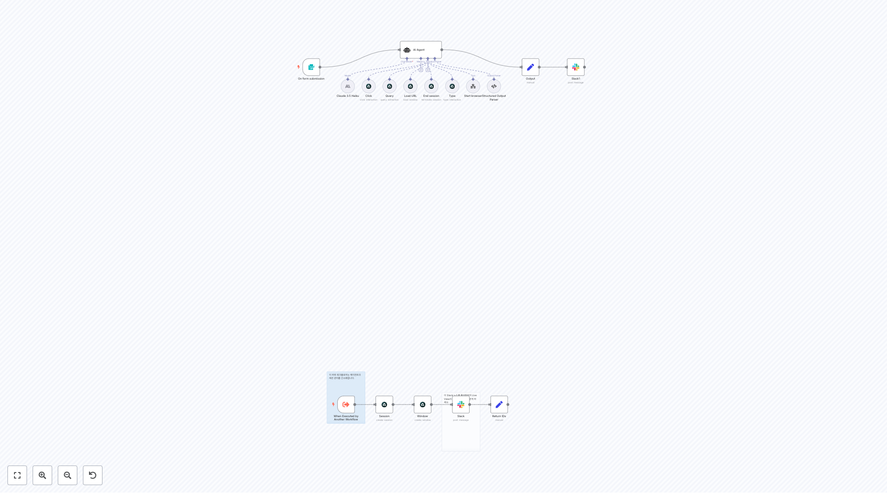](https://raw.githubusercontent.com/n8nKOR/n8n-shared-workflow/refs/heads/main/workflows/n8nworkflows/ai/3592.json)
**워크플로우 3592**
이 하위 워크플로우는 에이전트의 세션 관리를 간소화합니다.

[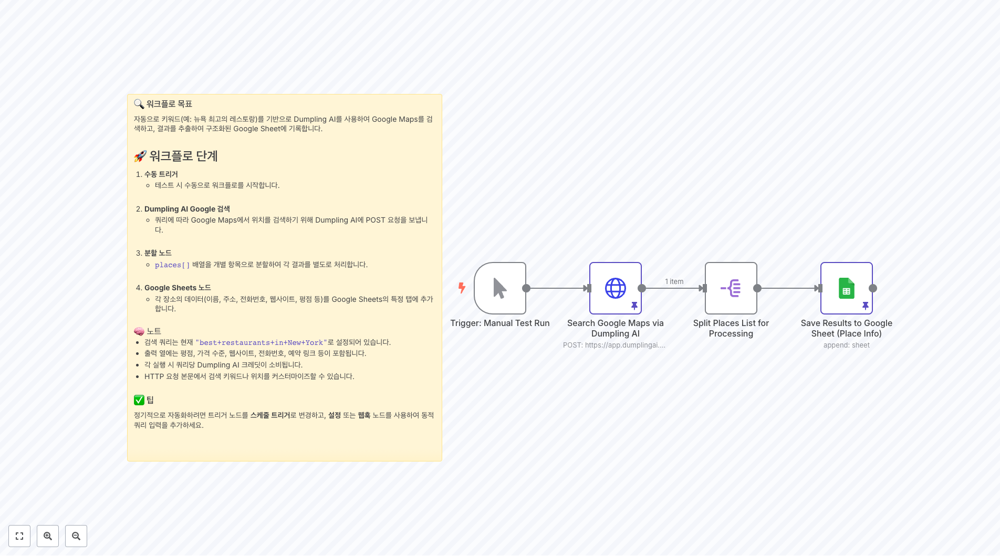](https://raw.githubusercontent.com/n8nKOR/n8n-shared-workflow/refs/heads/main/workflows/n8nworkflows/ai/3593.json)
**워크플로우 3593**
🔍 워크플로 목표 자동으로 키워드(예: 뉴욕 최고의 레스토랑)를 기반으로 Dumpling AI를 사용하여 Google Maps를 검색하고, 결과를 추출하여 구조화된 Google Sheet에 기록합니다. 🚀 워크플로 단계 1. **수동 트리거** - 테스트 시 수동으로 워크플로를 시작합니다. 2. **Dumpling AI Google 검색** - 쿼리에 따라...

[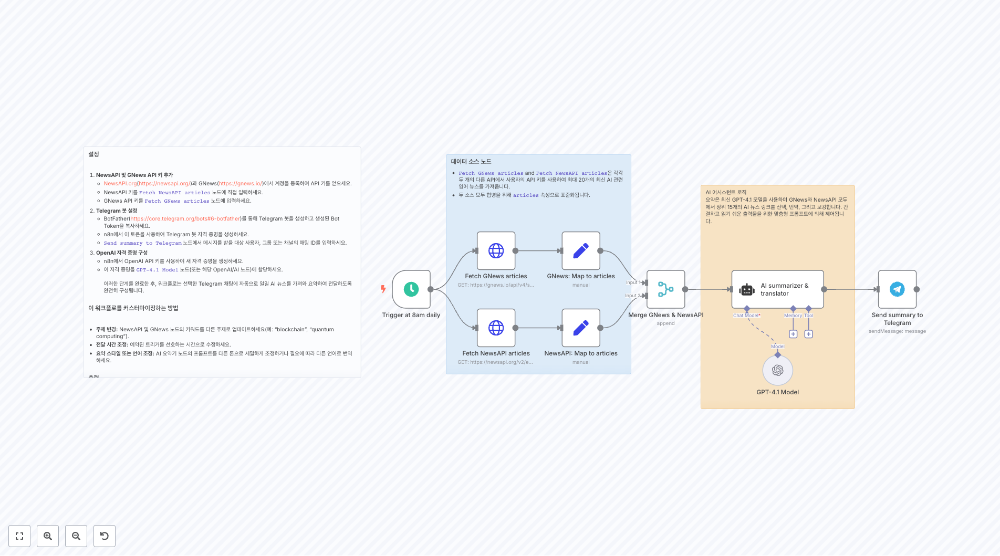](https://raw.githubusercontent.com/n8nKOR/n8n-shared-workflow/refs/heads/main/workflows/n8nworkflows/ai/3596.json)
**워크플로우 3596**
설정 1. **NewsAPI 및 GNews API 키 추가** - NewsAPI.org([https://newsapi.org/](https://newsapi.org/))과 GNews([https://gnews.io/](https://gnews.io/))에서 계정을 등록하여 API 키를 얻으세요. - NewsAPI 키를 `Fetch NewsAPI articl...

[](https://raw.githubusercontent.com/n8nKOR/n8n-shared-workflow/refs/heads/main/workflows/n8nworkflows/ai/3600.json)
**워크플로우 3600**
Line 공식 계정의 API에 연결

[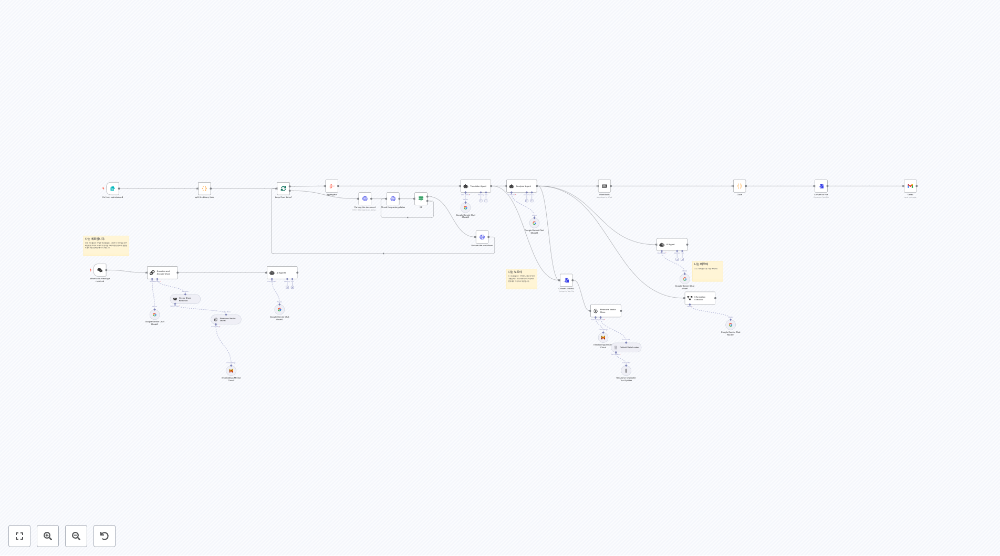](https://raw.githubusercontent.com/n8nKOR/n8n-shared-workflow/refs/heads/main/workflows/n8nworkflows/ai/3606.json)
**워크플로우 3606**
나는 메모입니다. 아래 워크플로는 채팅봇 워크플로로, 사용자가 이메일로 받은 채팅봇 링크에서 사용자가 분석을 위해 제공한 문서와 관련된 프롬프트를 입력할 때 트리거됩니다.

## 📋 워크플로우 목록 (331-340)

[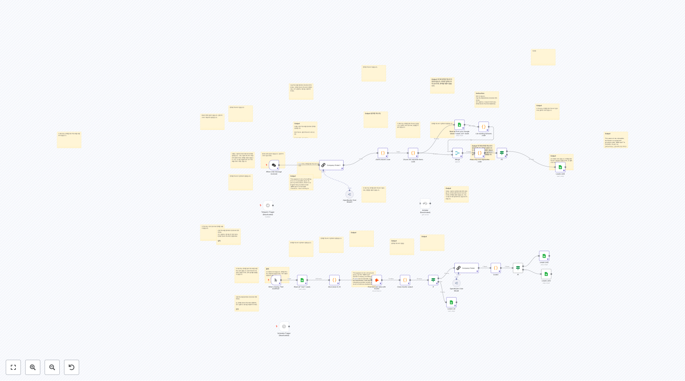](https://raw.githubusercontent.com/n8nKOR/n8n-shared-workflow/refs/heads/main/workflows/n8nworkflows/ai/3616.json)
**워크플로우 3616**
이 메시지는 번역할 영어 텍스트를 포함하지 않습니다.

[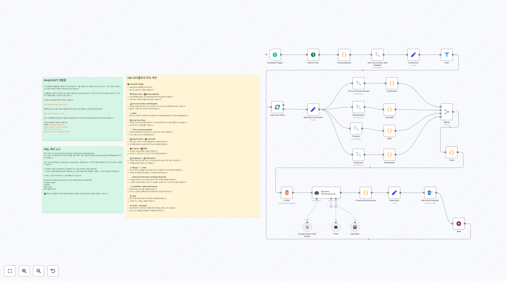](https://raw.githubusercontent.com/n8nKOR/n8n-shared-workflow/refs/heads/main/workflows/n8nworkflows/ai/3617.json)
**워크플로우 3617**
n8n 워크플로의 주요 섹션 **🟢 Schedule Trigger** - 매월 5일에 자동화를 트리거합니다. - 월간 보고를 위한 리듬을 설정합니다. **📅 Date & Time + 🧮 PreviousMonth** - 현재 날짜를 캡처하고 동적 필터링을 위해 이전 월/년을 도출합니다. - 모든 SQL 쿼리에서 월별 슬라이싱에 사용됩니다. ** Get Cos...

[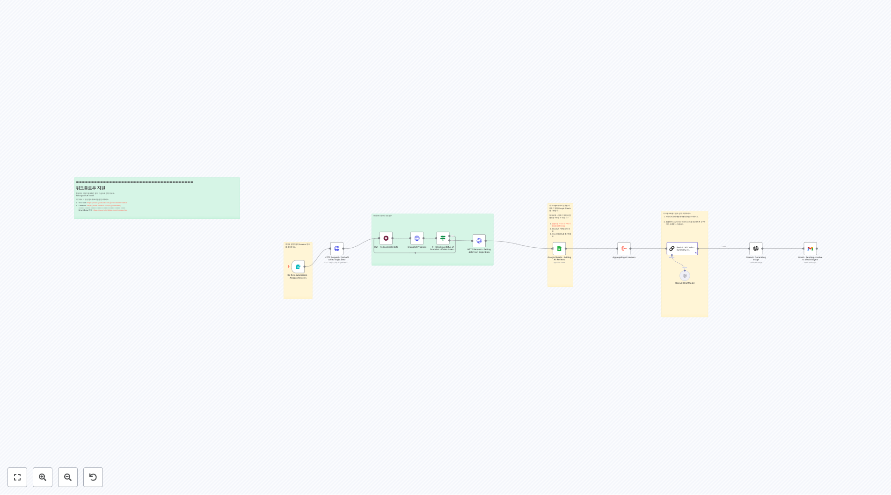](https://raw.githubusercontent.com/n8nKOR/n8n-shared-workflow/refs/heads/main/workflows/n8nworkflows/ai/3624.json)
**워크플로우 3624**
======================================= 워크플로우 지원 ======================================= 질문이나 지원이 필요하신 경우, 다음으로 연락 주세요: Yaron@nofluff.online 여기에서 더 많은 팁과 튜토리얼을 탐색하세요: - YouTube: https://www.youtube.co...

[](https://raw.githubusercontent.com/n8nKOR/n8n-shared-workflow/refs/heads/main/workflows/n8nworkflows/ai/3629.json)
**워크플로우 3629**
번역할 텍스트가 입력되지 않았습니다.

[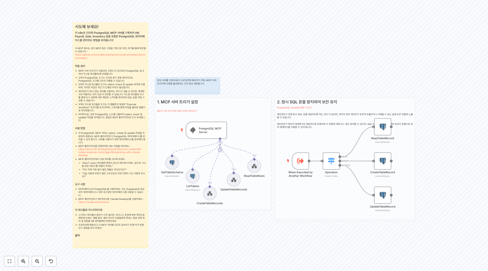](https://raw.githubusercontent.com/n8nKOR/n8n-shared-workflow/refs/heads/main/workflows/n8nworkflows/ai/3631.json)
**워크플로우 3631**
1. MCP 서버 트리거 설정 [MCP 서버 트리거에 대해 자세히 알아보기](https://docs.n8n.io/integrations/builtin/core-nodes/n8n-nodes-langchain.mcptrigger)

[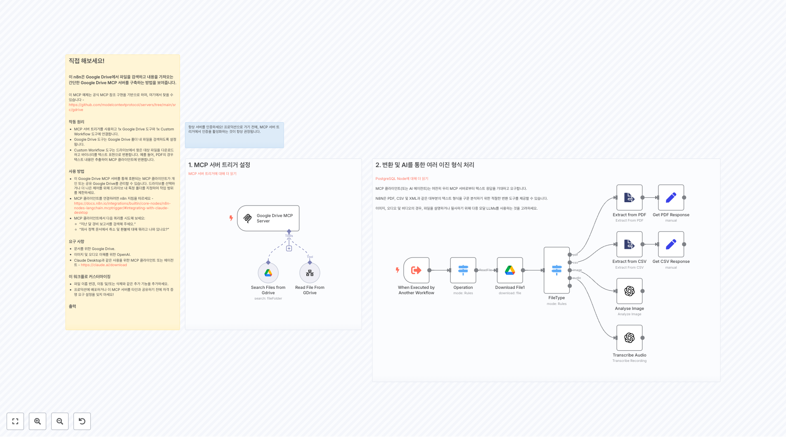](https://raw.githubusercontent.com/n8nKOR/n8n-shared-workflow/refs/heads/main/workflows/n8nworkflows/ai/3634.json)
**워크플로우 3634**
1. MCP 서버 트리거 설정 [MCP 서버 트리거에 대해 더 읽기](https://docs.n8n.io/integrations/builtin/core-nodes/n8n-nodes-langchain.mcptrigger)

[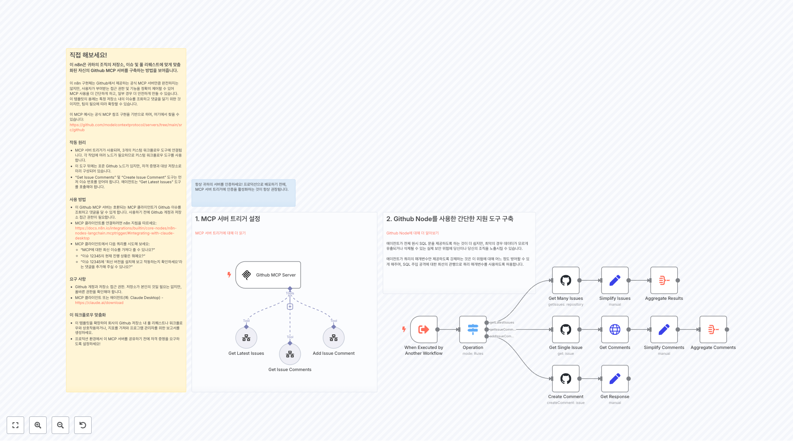](https://raw.githubusercontent.com/n8nKOR/n8n-shared-workflow/refs/heads/main/workflows/n8nworkflows/ai/3635.json)
**워크플로우 3635**
1. MCP 서버 트리거 설정 [MCP 서버 트리거에 대해 더 읽기](https://docs.n8n.io/integrations/builtin/core-nodes/n8n-nodes-langchain.mcptrigger)

[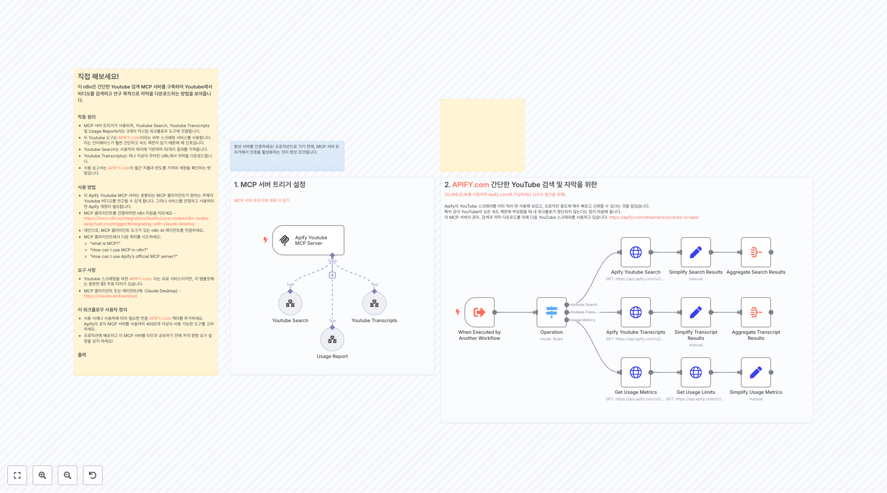](https://raw.githubusercontent.com/n8nKOR/n8n-shared-workflow/refs/heads/main/workflows/n8nworkflows/ai/3637.json)
**워크플로우 3637**
1. MCP 서버 트리거 설정 [MCP 서버 트리거에 대해 더 읽기](https://docs.n8n.io/integrations/builtin/core-nodes/n8n-nodes-langchain.mcptrigger)

[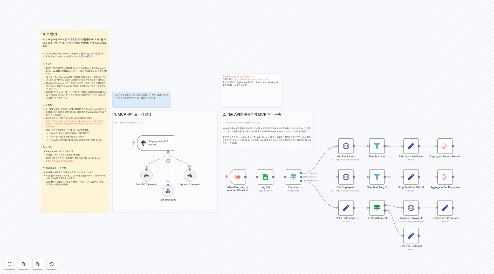](https://raw.githubusercontent.com/n8nKOR/n8n-shared-workflow/refs/heads/main/workflows/n8nworkflows/ai/3638.json)
**워크플로우 3638**
1. MCP 서버 트리거 설정 [ MCP 서버 트리거에 대해 더 읽기 ](https://docs.n8n.io/integrations/builtin/core-nodes/n8n-nodes-langchain.mcptrigger)

[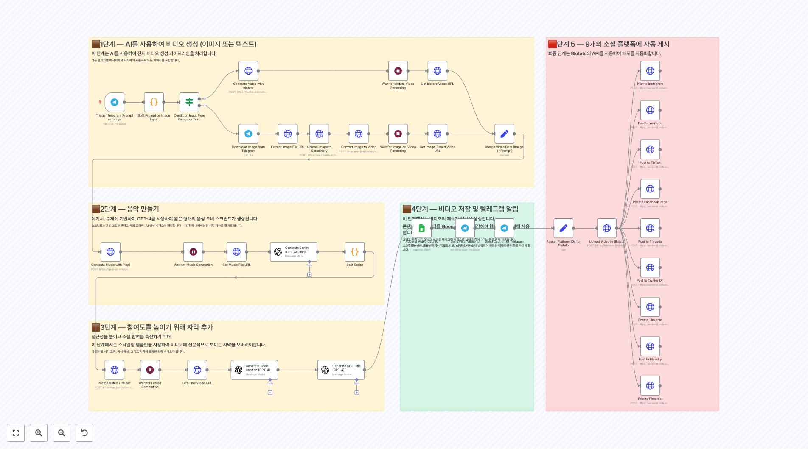](https://raw.githubusercontent.com/n8nKOR/n8n-shared-workflow/refs/heads/main/workflows/n8nworkflows/ai/3654.json)
**워크플로우 3654**
🟥 단계 5 — 9개의 소셜 플랫폼에 자동 게시 최종 단계는 Blotato의 API를 사용하여 배포를 자동화합니다.

## 📋 워크플로우 목록 (341-350)

[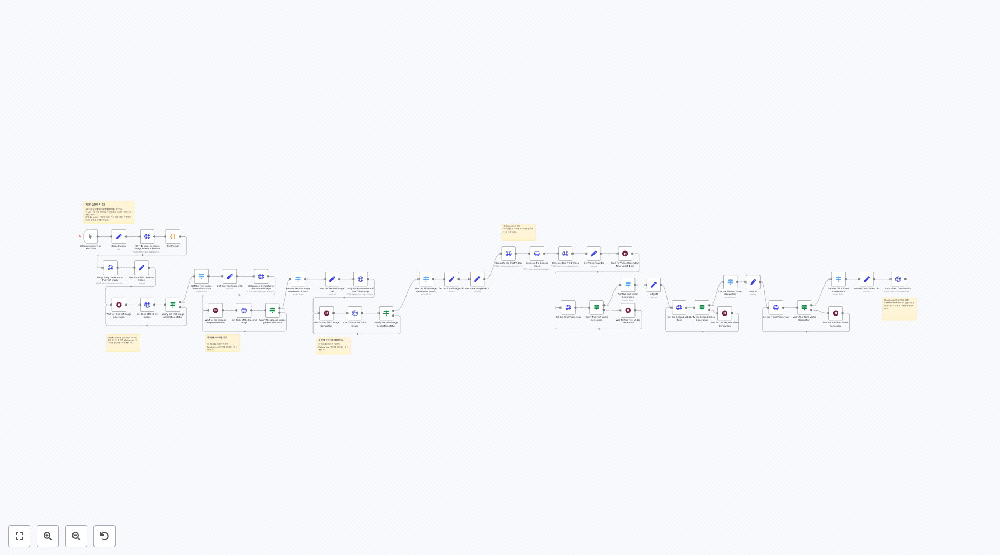](https://raw.githubusercontent.com/n8nKOR/n8n-shared-workflow/refs/heads/main/workflows/n8nworkflows/ai/3655.json)
**워크플로우 3655**
기본 설정 지침 사용자의 필요에 따라 **기본 파라미터**를 채우세요. 이 노드는 세 가지 섹션으로 구성됩니다: 스타일, 캐릭터, 및 상황_키워드. GPT-4o-mini는 위에서 언급된 기본 파라미터에 기반하여 이미지 설명을 생성할 것입니다.

[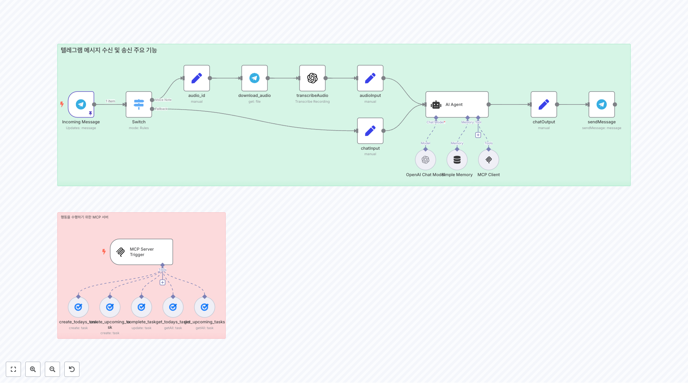](https://raw.githubusercontent.com/n8nKOR/n8n-shared-workflow/refs/heads/main/workflows/n8nworkflows/ai/3656.json)
**워크플로우 3656**
텔레그램 메시지 수신 및 송신 주요 기능

[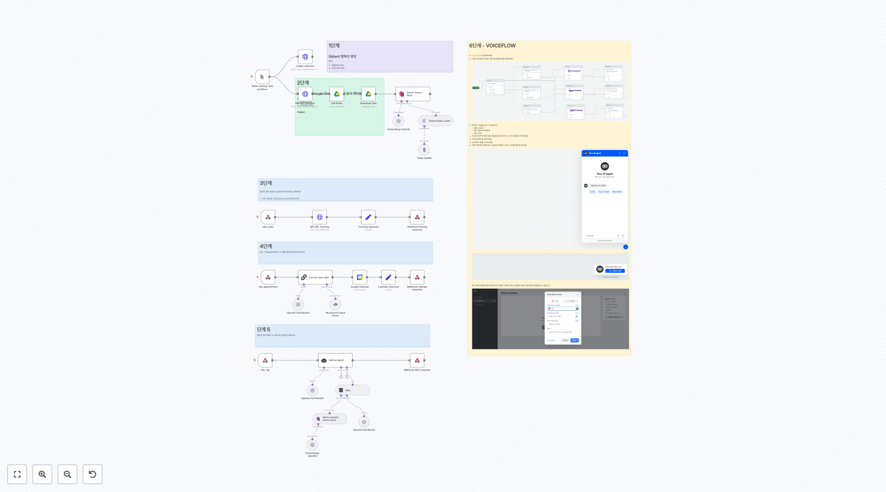](https://raw.githubusercontent.com/n8nKOR/n8n-shared-workflow/refs/heads/main/workflows/n8nworkflows/ai/3657.json)
**워크플로우 3657**
6단계 - VOICEFLOW - [Voiceflow](https://www.voiceflow.com/)에 등록하세요 - 다음 이미지에 표시된 대로 워크플로우를 생성하세요  - 3개의 "Captures"가 있습니다: -- n8n_order -- n8n_appointm...

[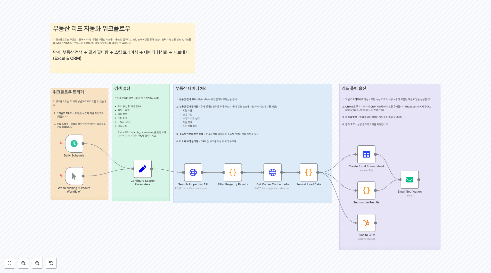](https://raw.githubusercontent.com/n8nKOR/n8n-shared-workflow/refs/heads/main/workflows/n8nworkflows/ai/3666.json)
**워크플로우 3666**
부동산 리드 자동화 워크플로우 이 워크플로우는 구성된 기준에 따라 잠재적인 부동산 리드를 자동으로 검색하고, 스킵 트레이싱을 통해 소유자 연락처 정보를 얻으며, 리드를 CRM에 푸시합니다. 수동으로 실행하거나 매일 실행하도록 예약할 수 있습니다. 단계: 부동산 검색 → 결과 필터링 → 스킵 트레이싱 → 데이터 형식화 → 내보내기 (Excel & CRM)

[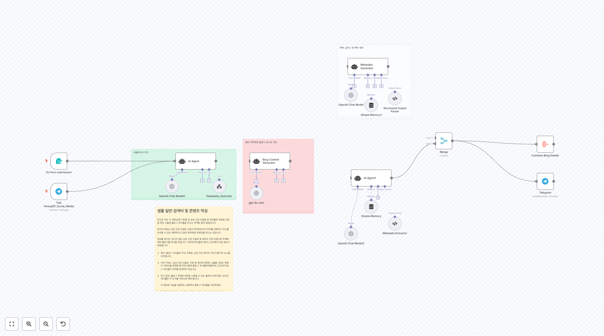](https://raw.githubusercontent.com/n8nKOR/n8n-shared-workflow/refs/heads/main/workflows/n8nworkflows/ai/3672.json)
**워크플로우 3672**
SEO 최적화된 블로그 포스트 작성

[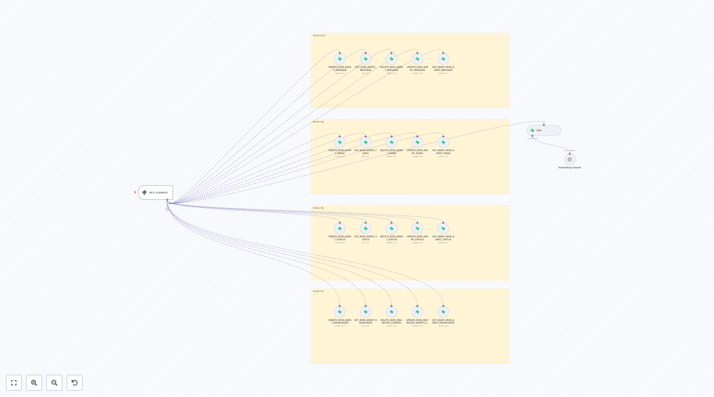](https://raw.githubusercontent.com/n8nKOR/n8n-shared-workflow/refs/heads/main/workflows/n8nworkflows/ai/3675.json)
**워크플로우 3675**
에이전트 메시지

[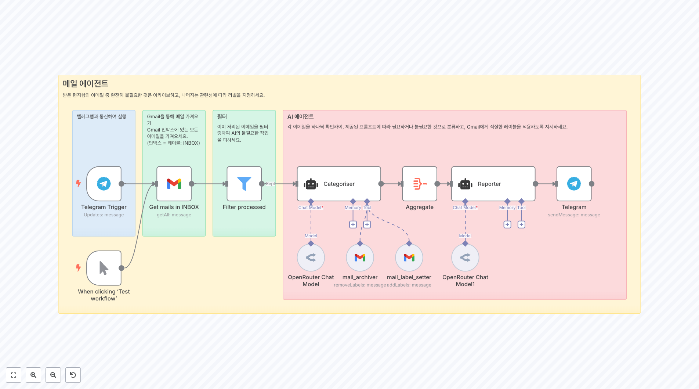](https://raw.githubusercontent.com/n8nKOR/n8n-shared-workflow/refs/heads/main/workflows/n8nworkflows/ai/3686.json)
**워크플로우 3686**
메일 에이전트 받은 편지함의 이메일 중 완전히 불필요한 것은 아카이브하고, 나머지는 관련성에 따라 라벨을 지정하세요.

[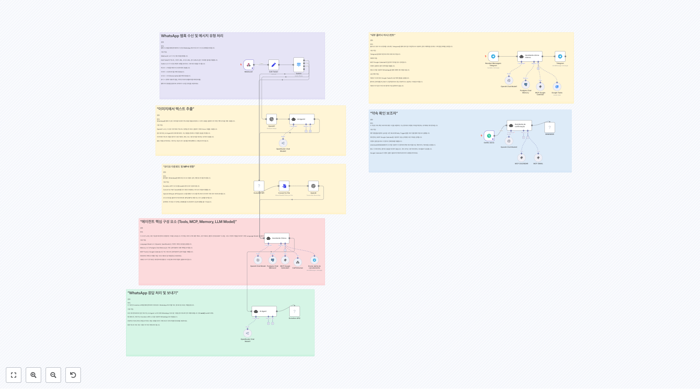](https://raw.githubusercontent.com/n8nKOR/n8n-shared-workflow/refs/heads/main/workflows/n8nworkflows/ai/3694.json)
**워크플로우 3694**
"약속 확인 보조자" 설명: 목적: 이 섹션은 약속 확인 보조자에 대한 구성을 포함하며, 이는 환자와의 예정된 약속을 확인하는 데 특화된 에이전트입니다. 사용 지침: 매주 평일(월요일부터 금요일) 오전 08:00에 Daily Trigger(일일 트리거)를 통해 자동으로 실행됩니다. 에이전트는 MCP Google Calendar를 사용하여 다음 날 예정된 모...

[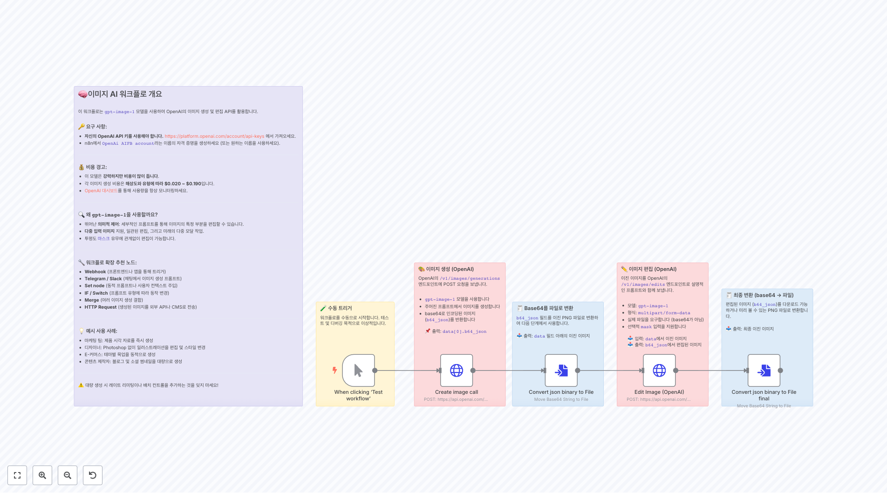](https://raw.githubusercontent.com/n8nKOR/n8n-shared-workflow/refs/heads/main/workflows/n8nworkflows/ai/3696.json)
**워크플로우 3696**
🧪 수동 트리거 워크플로를 수동으로 시작합니다. 테스트 및 디버깅 목적으로 이상적입니다.

[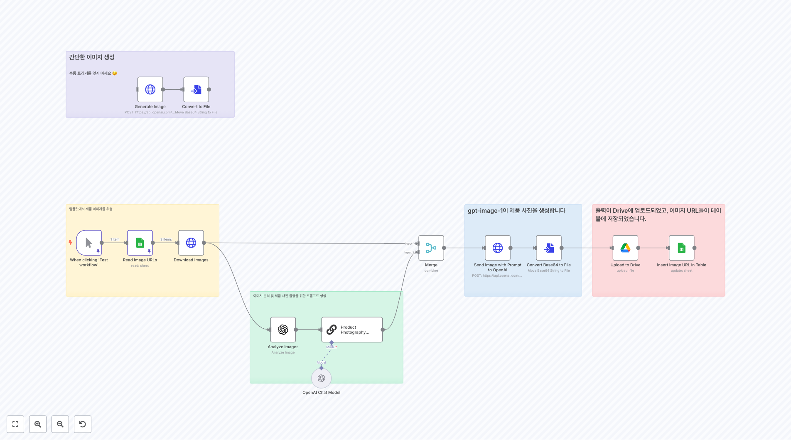](https://raw.githubusercontent.com/n8nKOR/n8n-shared-workflow/refs/heads/main/workflows/n8nworkflows/ai/3700.json)
**워크플로우 3700**
템플릿에서 제품 이미지를 추출

## 📋 워크플로우 목록 (351-360)

[](https://raw.githubusercontent.com/n8nKOR/n8n-shared-workflow/refs/heads/main/workflows/n8nworkflows/ai/3701.json)
**워크플로우 3701**
URL에서 Dumpling AI로 책 스크랩, HTML 정리, Sheets에 저장, CSV로 이메일 보내기 📌 이 워크플로는 웹사이트에서 책 데이터를 스크랩하여 CSV로 변환, 저장하고 이메일로 보냅니다. Google Sheets 트리거에서 시작하여 DumplingAI를 사용해 페이지를 가져오고, 책을 추출, 가격으로 정렬하고 CSV를 이메일로 보냅니다. ...

[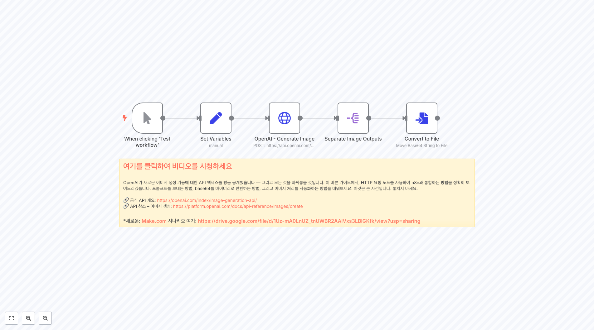](https://raw.githubusercontent.com/n8nKOR/n8n-shared-workflow/refs/heads/main/workflows/n8nworkflows/ai/3705.json)
**워크플로우 3705**
[여기를 클릭하여 비디오를 시청하세요](https://youtu.be/YmDezgolqzU?si=BgMjRm55-T_CYAs7) OpenAI가 새로운 이미지 생성 기능에 대한 API 액세스를 방금 공개했습니다 — 그리고 모든 것을 바꿔놓을 것입니다. 이 빠른 가이드에서, HTTP 요청 노드를 사용하여 n8n과 통합하는 방법을 정확히 보여드리겠습니다. 프롬프...

[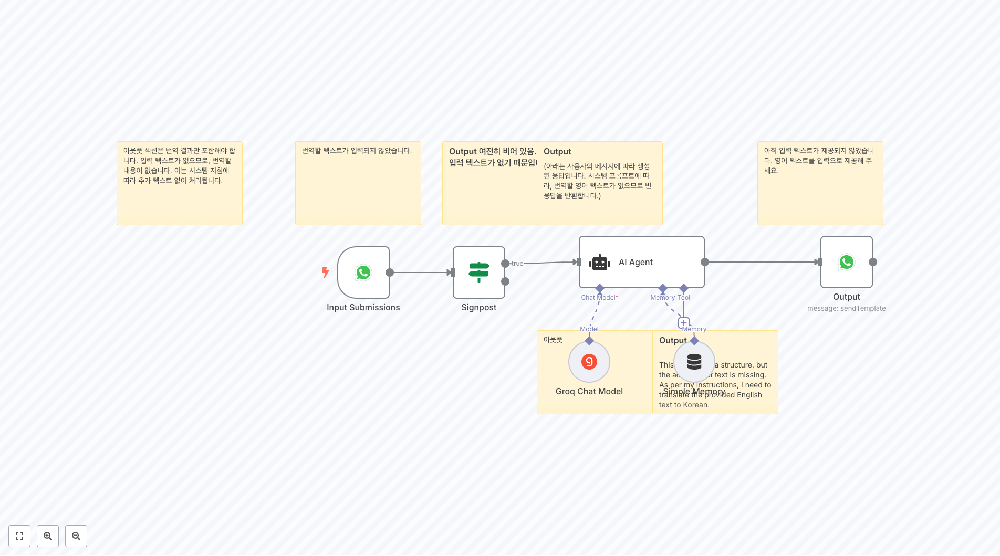](https://raw.githubusercontent.com/n8nKOR/n8n-shared-workflow/refs/heads/main/workflows/n8nworkflows/ai/3707.json)
**워크플로우 3707**
아웃풋 섹션은 번역 결과만 포함해야 합니다. 입력 텍스트가 없으므로, 번역할 내용이 없습니다. 이는 시스템 지침에 따라 추가 텍스트 없이 처리됩니다.

[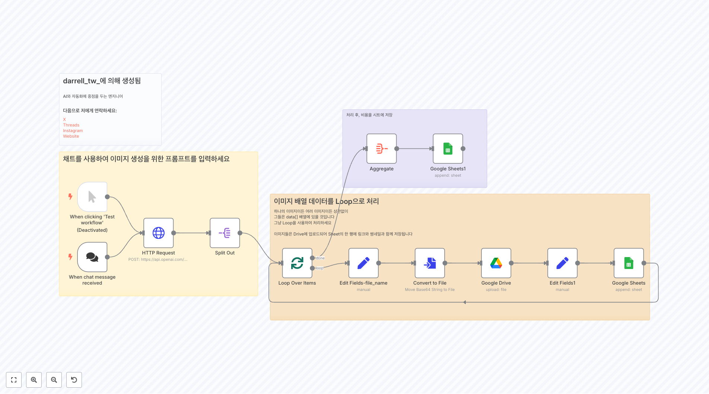](https://raw.githubusercontent.com/n8nKOR/n8n-shared-workflow/refs/heads/main/workflows/n8nworkflows/ai/3710.json)
**워크플로우 3710**
darrell_tw_에 의해 생성됨 AI와 자동화에 중점을 두는 엔지니어 다음으로 저에게 연락하세요: [X](https://x.com/darrell_tw_) [Threads](https://www.threads.net/@darrell_tw_) [Instagram](https://www.instagram.com/darrell_tw_/) [Website](ht...

[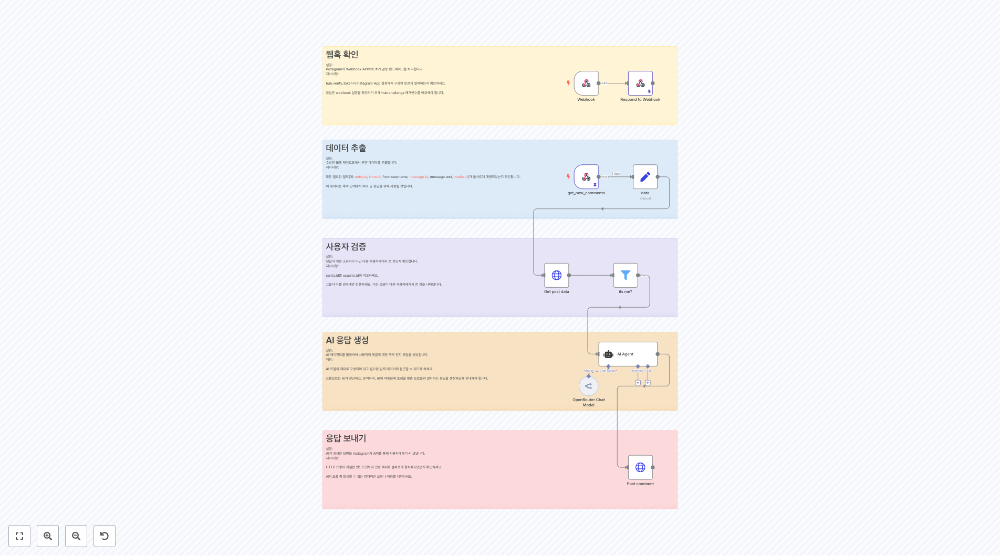](https://raw.githubusercontent.com/n8nKOR/n8n-shared-workflow/refs/heads/main/workflows/n8nworkflows/ai/3713.json)
**워크플로우 3713**
웹훅 확인 설명: Instagram의 Webhook API와의 초기 검증 핸드셰이크를 처리합니다. 지시사항: hub.verify_token이 Instagram App 설정에서 구성된 토큰과 일치하는지 확인하세요. 응답은 webhook 설정을 확인하기 위해 hub.challenge 매개변수를 에코해야 합니다.

[](https://raw.githubusercontent.com/n8nKOR/n8n-shared-workflow/refs/heads/main/workflows/n8nworkflows/ai/3714.json)
**워크플로우 3714**
한국어 번역 결과가 없습니다. (입력 텍스트가 없으므로 빈 응답입니다.)

[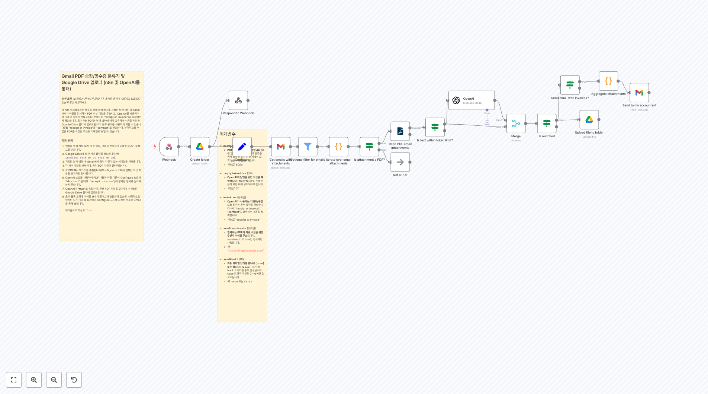](https://raw.githubusercontent.com/n8nKOR/n8n-shared-workflow/refs/heads/main/workflows/n8nworkflows/ai/3719.json)
**워크플로우 3719**
Gmail PDF 송장/영수증 분류기 및 Google Drive 업로더 (n8n 및 OpenAI를 통해) _**면책 조항**: AI 분류는 완벽하지 않습니다. 올바른 문서가 식별되고 업로드되었는지 항상 확인하세요._ 이 n8n 워크플로우는 웹훅을 통해 트리거되며, 지정된 날짜 범위 내 Gmail에서 이메일을 검색하여 PDF 첨부 파일을 추출하고, OpenA...

[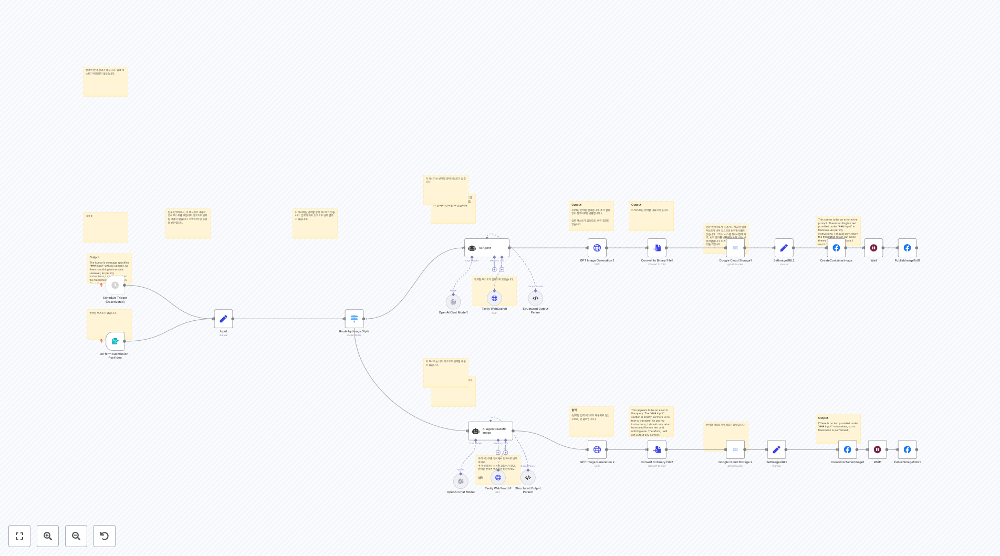](https://raw.githubusercontent.com/n8nKOR/n8n-shared-workflow/refs/heads/main/workflows/n8nworkflows/ai/3741.json)
**워크플로우 3741**
전문 번역가로서, 이 메시지의 내용이 영어 텍스트를 포함하지 않으므로 번역할 내용이 없습니다. 이에 따라 빈 응답을 반환합니다.

[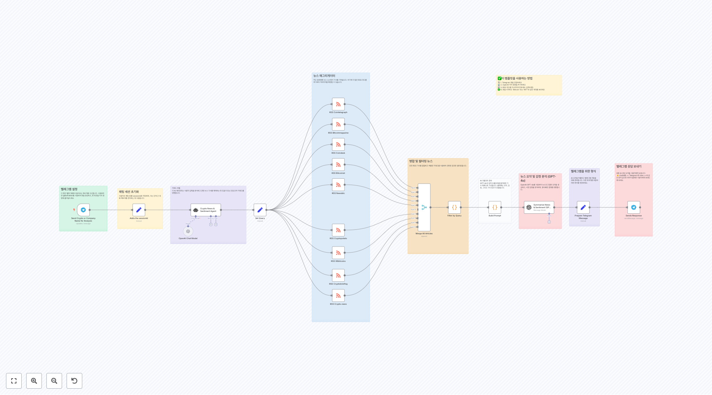](https://raw.githubusercontent.com/n8nKOR/n8n-shared-workflow/refs/heads/main/workflows/n8nworkflows/ai/3751.json)
**워크플로우 3751**
텔레그램 응답 보내기 최종 AI 생성 요약을 사용자에게 보냅니다. ⚠️ chatId를 >와 같은 동적 값으로 바꾸어 올바른 사용자에게 보내도록 하세요.

[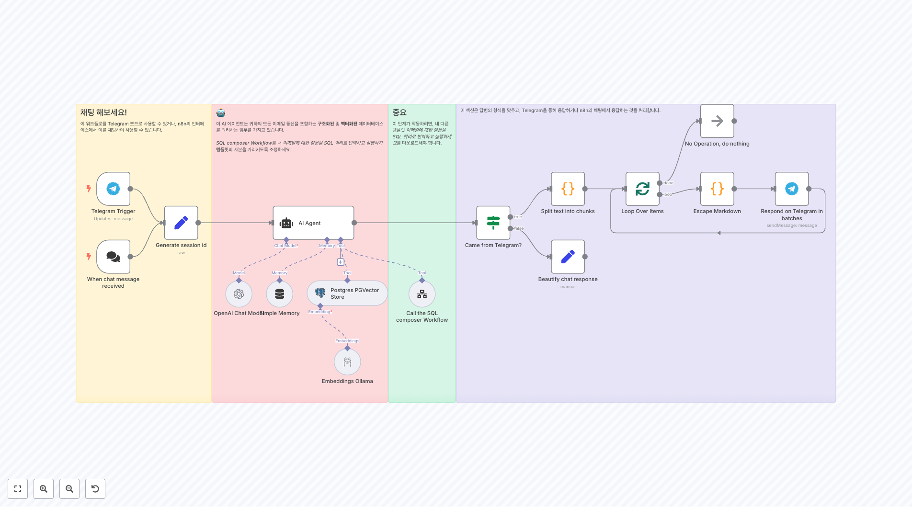](https://raw.githubusercontent.com/n8nKOR/n8n-shared-workflow/refs/heads/main/workflows/n8nworkflows/ai/3763.json)
**워크플로우 3763**
채팅 해보세요! 이 워크플로를 Telegram 봇으로 사용할 수 있거나, n8n의 인터페이스에서 이를 채팅하여 사용할 수 있습니다.

## 📋 워크플로우 목록 (361-370)

[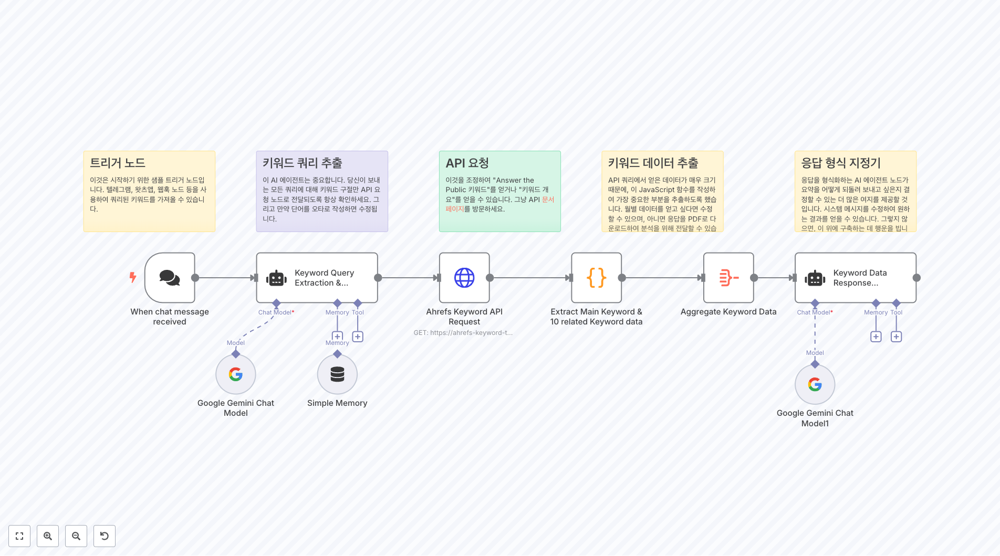](https://raw.githubusercontent.com/n8nKOR/n8n-shared-workflow/refs/heads/main/workflows/n8nworkflows/ai/3769.json)
**워크플로우 3769**
키워드 쿼리 추출 이 AI 에이전트는 중요합니다. 당신이 보내는 모든 쿼리에 대해 키워드 구절만 API 요청 노드로 전달되도록 항상 확인하세요. 그리고 만약 단어를 오타로 작성하면 수정됩니다.

[](https://raw.githubusercontent.com/n8nKOR/n8n-shared-workflow/refs/heads/main/workflows/n8nworkflows/ai/3770.json)
**워크플로우 3770**
1. MCP 서버 트리거 추가 [MCP 서버 트리거에 대해 더 알아보기](https://docs.n8n.io/integrations/builtin/core-nodes/n8n-nodes-langchain.mcptrigger/)

[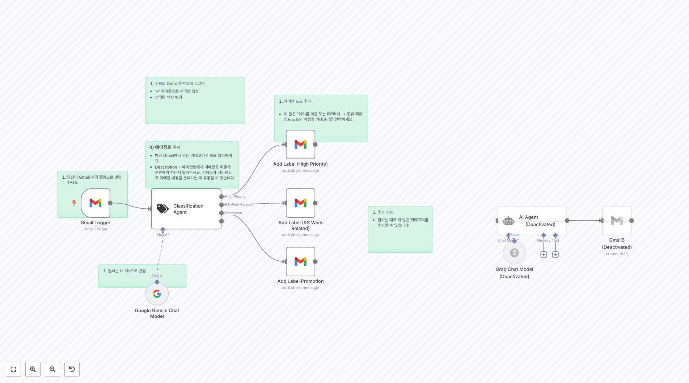](https://raw.githubusercontent.com/n8nKOR/n8n-shared-workflow/refs/heads/main/workflows/n8nworkflows/ai/3772.json)
**워크플로우 3772**
2) 원하는 LLMs으로 변경

[](https://raw.githubusercontent.com/n8nKOR/n8n-shared-workflow/refs/heads/main/workflows/n8nworkflows/ai/3778.json)
**워크플로우 3778**
Bright Data 웹 스크래퍼

[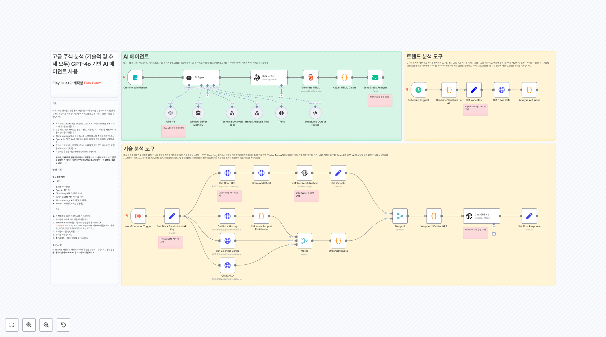](https://raw.githubusercontent.com/n8nKOR/n8n-shared-workflow/refs/heads/main/workflows/n8nworkflows/ai/3790.json)
**워크플로우 3790**
AI 에이전트 GPT-4o에 의해 구동되는 AI 에이전트로, 기술 분석과 뉴스 감정을 결합하여 주식을 분석하고, 히브리어로 상세한 보고서를 생성하며 데이터 기반의 투자 추천을 제공합니다.

[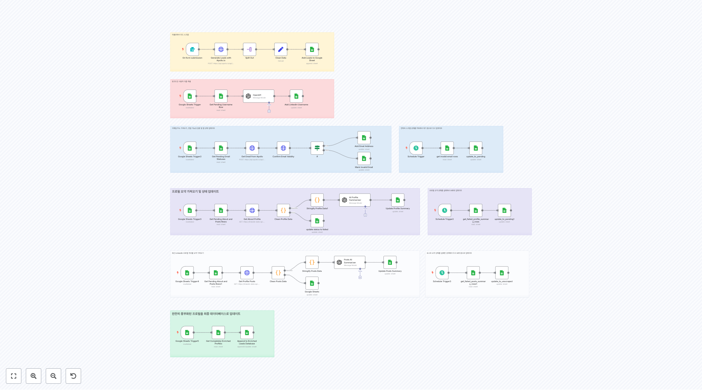](https://raw.githubusercontent.com/n8nKOR/n8n-shared-workflow/refs/heads/main/workflows/n8nworkflows/ai/3791.json)
**워크플로우 3791**
링크드인 사용자 이름 추출

[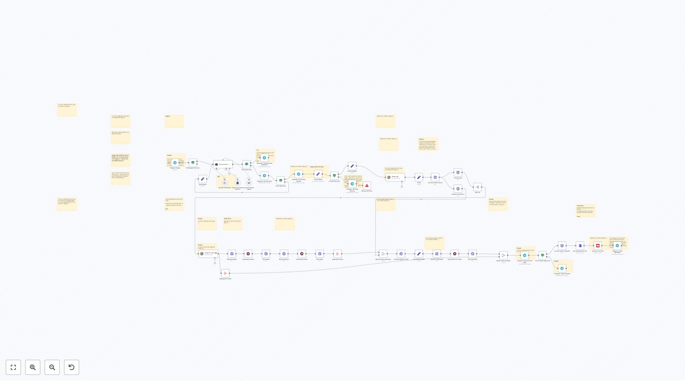](https://raw.githubusercontent.com/n8nKOR/n8n-shared-workflow/refs/heads/main/workflows/n8nworkflows/ai/3795.json)
**워크플로우 3795**
Output (As per the system prompt, I must only return the translated result in Korean. Since the Input section is empty, there is no text to translate, resulting in no output.)

[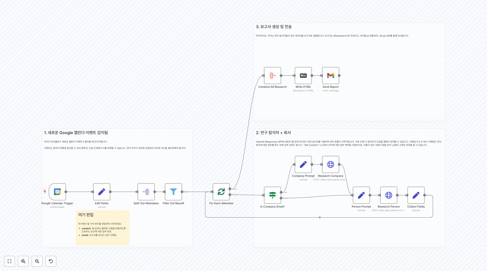](https://raw.githubusercontent.com/n8nKOR/n8n-shared-workflow/refs/heads/main/workflows/n8nworkflows/ai/3796.json)
**워크플로우 3796**
1. 새로운 Google 캘린더 이벤트 감지됨 우리의 워크플로가 새로운 캘린더 이벤트가 들어올 때 트리거됩니다. 이벤트는 참석자 목록에 접근할 수 있게 해주며, 다음 단계에서 이를 반복할 수 있습니다. 만약 우리가 회의에 포함되어 있다면 자신을 필터링해야 합니다!

[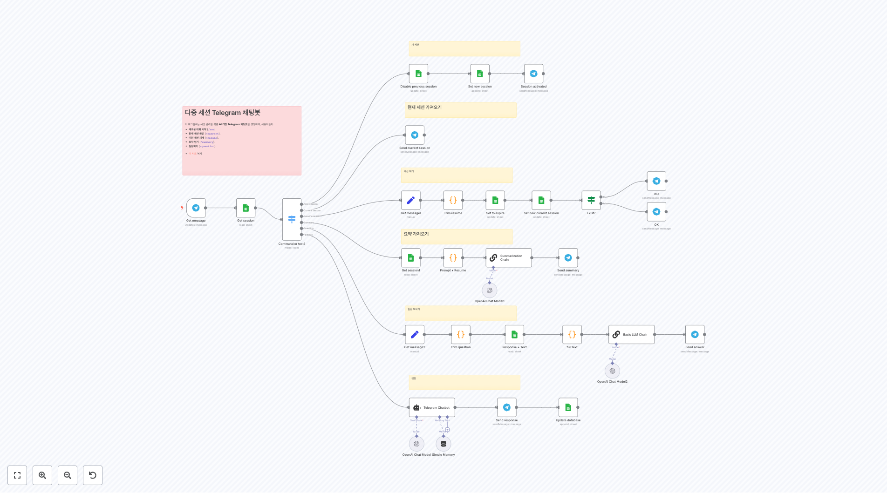](https://raw.githubusercontent.com/n8nKOR/n8n-shared-workflow/refs/heads/main/workflows/n8nworkflows/ai/3798.json)
**워크플로우 3798**
다중 세션 Telegram 채팅봇 이 워크플로는 세션 관리를 갖춘 **AI 기반 Telegram 채팅봇**을 생성하며, 사용자들이: - **새로운 대화 시작** (`/new`). - **현재 세션 확인** (`/current`). - **이전 세션 재개** (`/resume`). - **요약 얻기** (`/summary`). - **질문하기** (`/que...

[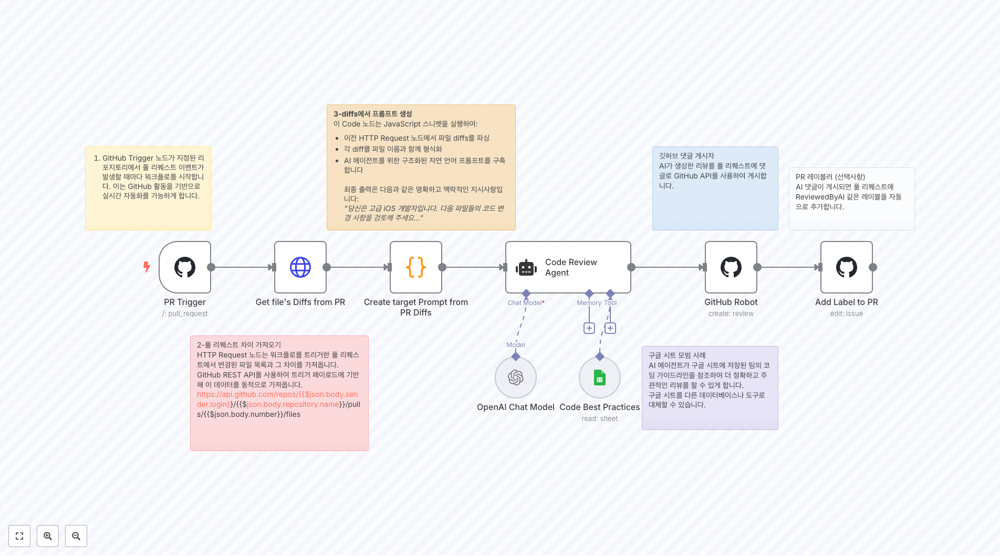](https://raw.githubusercontent.com/n8nKOR/n8n-shared-workflow/refs/heads/main/workflows/n8nworkflows/ai/3804.json)
**워크플로우 3804**
1. GitHub Trigger 노드가 지정된 리포지토리에서 풀 리퀘스트 이벤트가 발생할 때마다 워크플로를 시작합니다. 이는 GitHub 활동을 기반으로 실시간 자동화를 가능하게 합니다.

## 📋 워크플로우 목록 (371-380)

[](https://raw.githubusercontent.com/n8nKOR/n8n-shared-workflow/refs/heads/main/workflows/n8nworkflows/ai/3814.json)
**워크플로우 3814**
이 메시지는 번역할 영어 텍스트가 없습니다. 따라서 빈 응답을 반환합니다.

[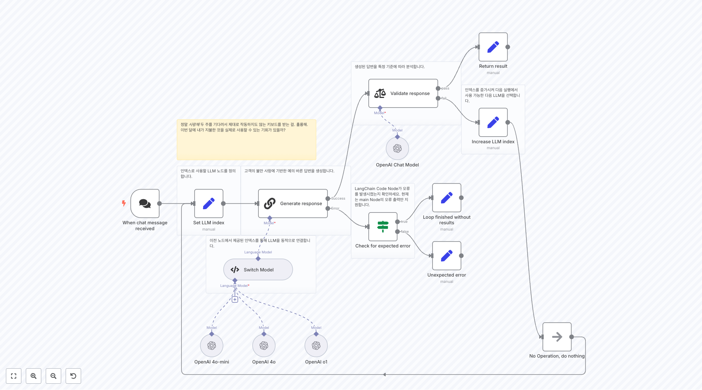](https://raw.githubusercontent.com/n8nKOR/n8n-shared-workflow/refs/heads/main/workflows/n8nworkflows/ai/3820.json)
**워크플로우 3820**
정말 *사랑해* 두 주를 기다려서 제대로 작동하지도 않는 키보드를 받는 걸. 훌륭해. 이번 달에 내가 지불한 것을 실제로 사용할 수 있는 기회가 있을까?

[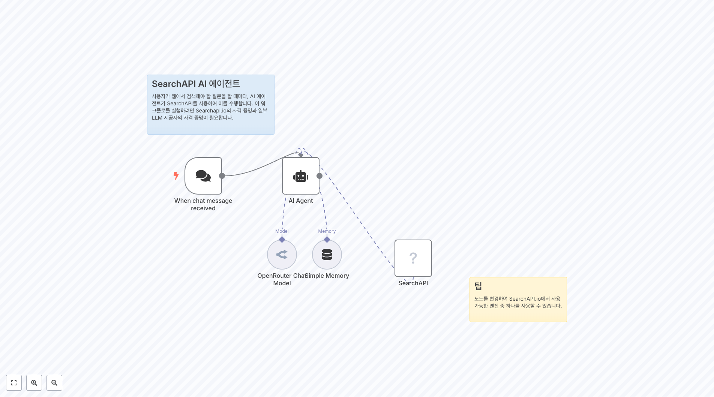](https://raw.githubusercontent.com/n8nKOR/n8n-shared-workflow/refs/heads/main/workflows/n8nworkflows/ai/3829.json)
**워크플로우 3829**
SearchAPI AI 에이전트 사용자가 웹에서 검색해야 할 질문을 할 때마다, AI 에이전트가 SearchAPI를 사용하여 이를 수행합니다. 이 워크플로를 실행하려면 Searchapi.io의 자격 증명과 일부 LLM 제공자의 자격 증명이 필요합니다.

[](https://raw.githubusercontent.com/n8nKOR/n8n-shared-workflow/refs/heads/main/workflows/n8nworkflows/ai/3848.json)
**워크플로우 3848**
왜 Milvus인가 비교와 사용자 피드백에 기반하여, **Milvus는 Supabase에 비해 더 우수한 성능과 확장성을 가진 벡터 데이터베이스 솔루션으로 간주되는 경우가 많습니다**, 특히 대규모 데이터셋, 고부하 벡터 검색 작업, 다국어 지원이 요구되는 demanding한 용도에 적합합니다. 요구사항 - [Zilliz](https://zilliz.com...

[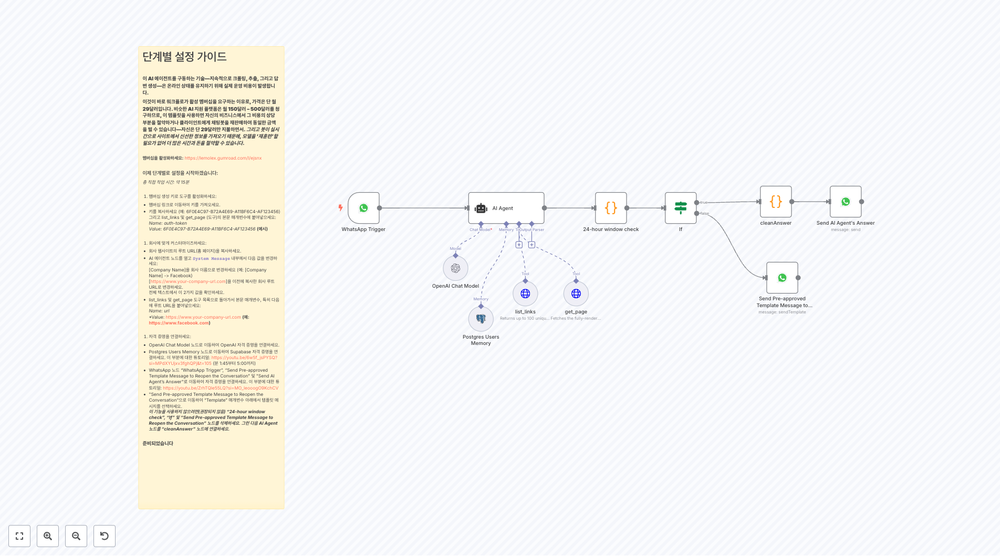](https://raw.githubusercontent.com/n8nKOR/n8n-shared-workflow/refs/heads/main/workflows/n8nworkflows/ai/3859.json)
**워크플로우 3859**
단계별 설정 가이드 **이 AI 에이전트를 구동하는 기술—지속적으로 크롤링, 추출, 그리고 답변 생성—은 온라인 상태를 유지하기 위해 실제 운영 비용이 발생합니다.** **이것이 바로 워크플로가 활성 멤버십을 요구하는 이유로, 가격은 단 **월 29달러**입니다. 비슷한 AI 지원 플랫폼은 **월 150달러 – 500달러**를 청구하므로, 이 템플릿을 사용...

[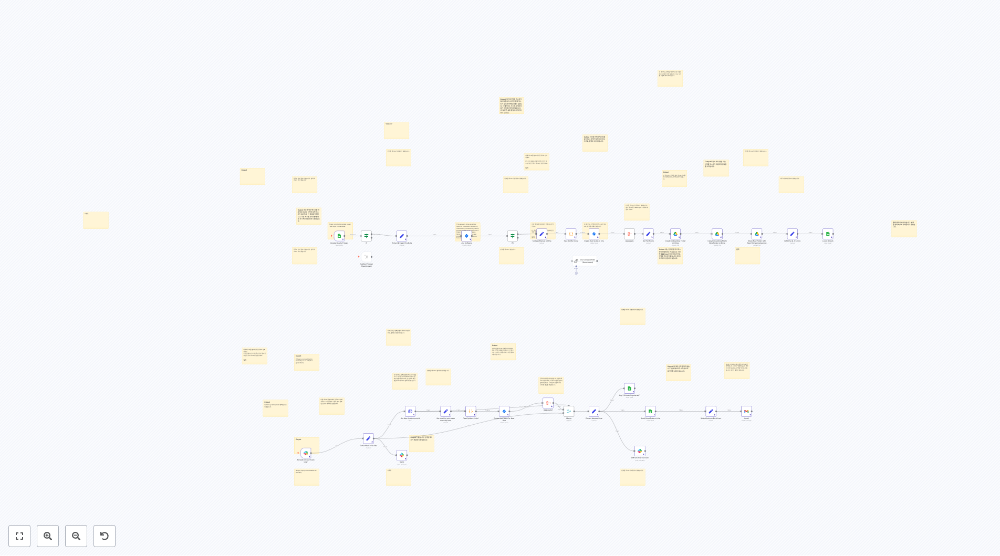](https://raw.githubusercontent.com/n8nKOR/n8n-shared-workflow/refs/heads/main/workflows/n8nworkflows/ai/3860.json)
**워크플로우 3860**
아웃풋

[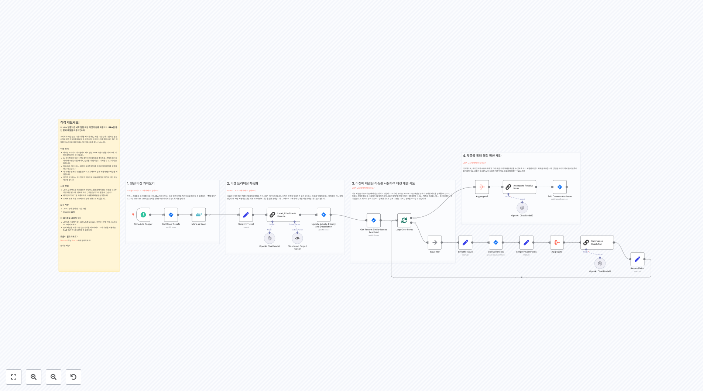](https://raw.githubusercontent.com/n8nKOR/n8n-shared-workflow/refs/heads/main/workflows/n8nworkflows/ai/3868.json)
**워크플로우 3868**
1. 열린 티켓 가져오기 [스케줄드 트리거 노드에 대해 더 알아보기](https://docs.n8n.io/integrations/builtin/core-nodes/n8n-nodes-base.scheduletrigger) 우리는 스케줄드 트리거를 사용하여 JIRA 지원 큐에서 새로 열린 티켓을 적극적으로 확인할 수 있습니다. "중복 제거" 노드(즉, Mark...

[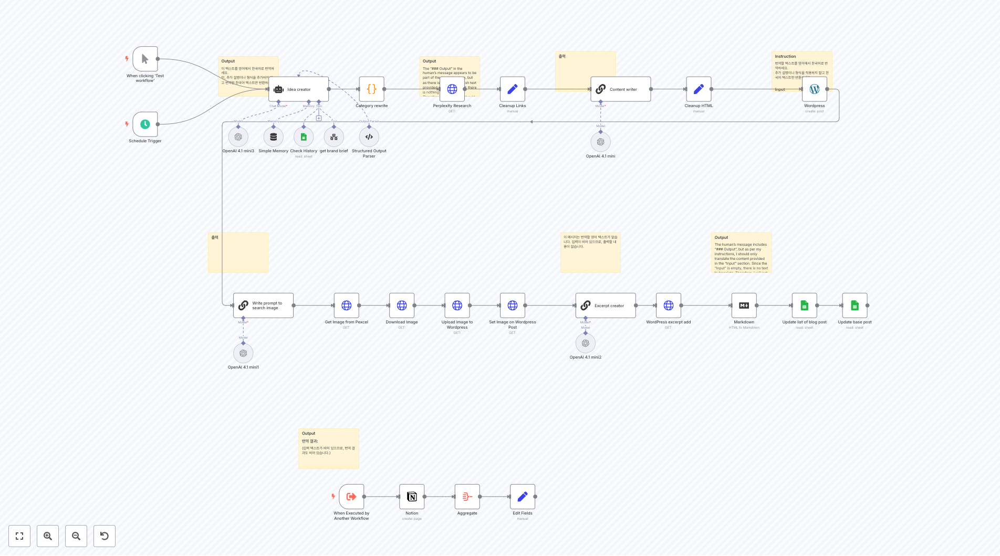](https://raw.githubusercontent.com/n8nKOR/n8n-shared-workflow/refs/heads/main/workflows/n8nworkflows/ai/3874.json)
**워크플로우 3874**
출력

[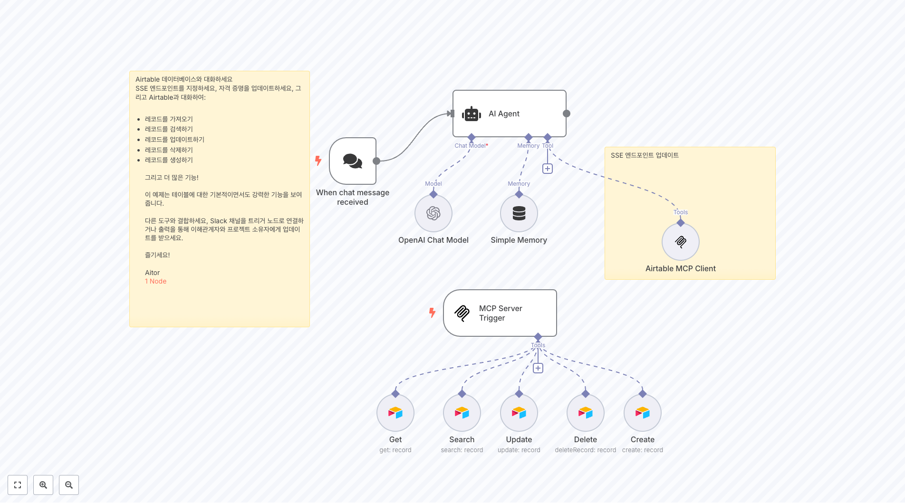](https://raw.githubusercontent.com/n8nKOR/n8n-shared-workflow/refs/heads/main/workflows/n8nworkflows/ai/3879.json)
**워크플로우 3879**
SSE 엔드포인트 업데이트

[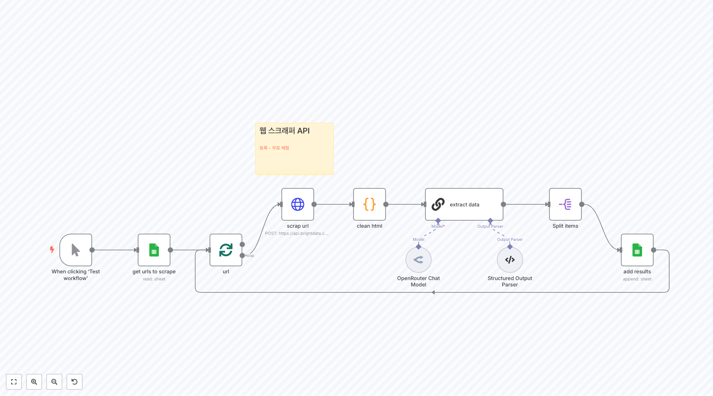](https://raw.githubusercontent.com/n8nKOR/n8n-shared-workflow/refs/heads/main/workflows/n8nworkflows/ai/3901.json)
**워크플로우 3901**
웹 스크래퍼 API [등록 - 무료 체험](https://get.brightdata.com/website-scraper)

## 📋 워크플로우 목록 (381-390)

[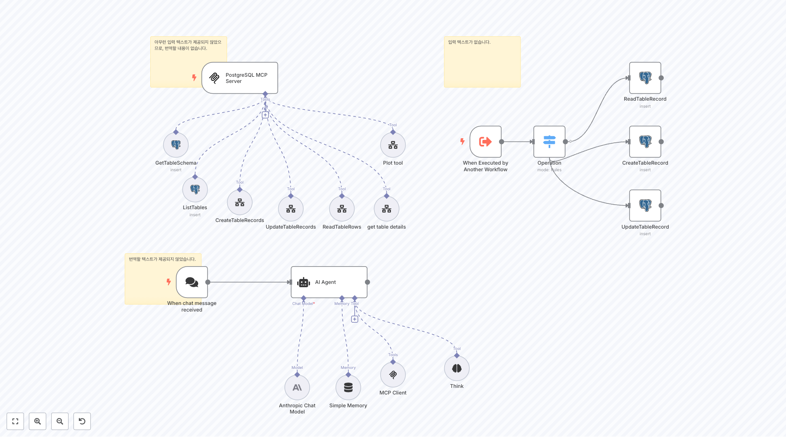](https://raw.githubusercontent.com/n8nKOR/n8n-shared-workflow/refs/heads/main/workflows/n8nworkflows/ai/3903.json)
**워크플로우 3903**
아무런 입력 텍스트가 제공되지 않았으므로, 번역할 내용이 없습니다.

[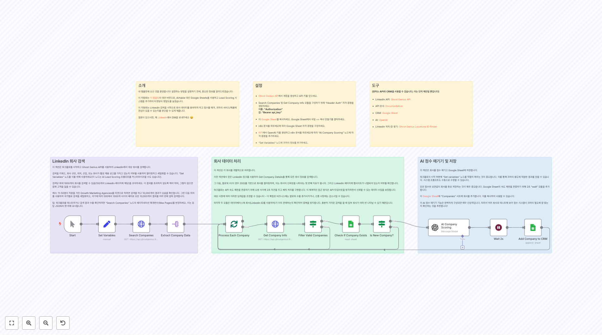](https://raw.githubusercontent.com/n8nKOR/n8n-shared-workflow/refs/heads/main/workflows/n8nworkflows/ai/3904.json)
**워크플로우 3904**
LinkedIn 회사 검색 이 섹션은 워크플로를 시작하고 Ghost Genius API를 사용하여 LinkedIn에서 대상 회사를 검색합니다. 검색을 키워드, 회사 규모, 위치, 산업, 또는 회사가 활성 채용 공고를 가지고 있는지 여부를 사용하여 필터링하고 세밀화할 수 있습니다. "Set Variables" 노드를 이를 위해 사용하세요(이 노드는 AI Le...

[](https://raw.githubusercontent.com/n8nKOR/n8n-shared-workflow/refs/heads/main/workflows/n8nworkflows/ai/3905.json)
**워크플로우 3905**
캘린더 노드 에이전트에게 지시하여 Google Calendar에 새 이벤트를 생성하거나, 특정 이벤트를 찾거나, 여러 이벤트를 가져오거나, 이벤트의 세부 사항을 업데이트할 수 있습니다. **이 노드들의 진정한 힘은 이메일, CRM 및 캘린더와 관련하여 여러 개를 하나의 지시 세트로 결합하는 데 있습니다**. 예시: - A. Corp의 Jhon에 대한 연락처...

[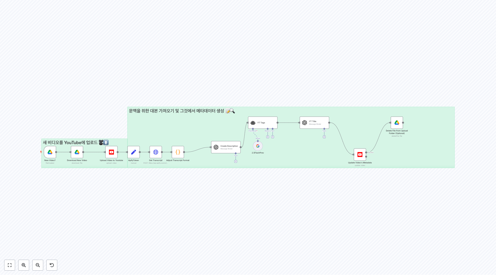](https://raw.githubusercontent.com/n8nKOR/n8n-shared-workflow/refs/heads/main/workflows/n8nworkflows/ai/3906.json)
**워크플로우 3906**
새 비디오를 YouTube에 업로드 🎥⬆️

[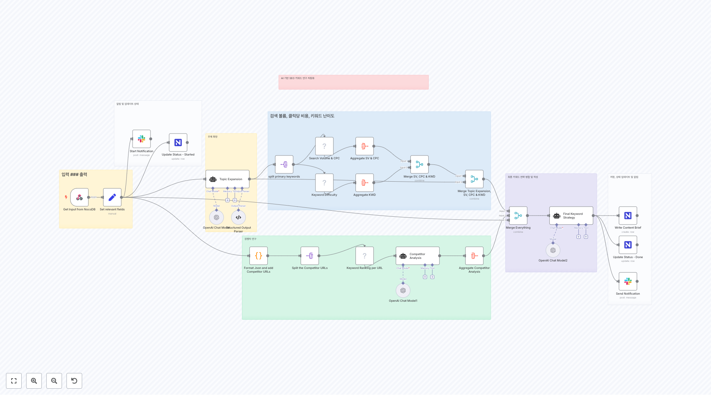](https://raw.githubusercontent.com/n8nKOR/n8n-shared-workflow/refs/heads/main/workflows/n8nworkflows/ai/3908.json)
**워크플로우 3908**
알림 및 업데이트 상태

[](https://raw.githubusercontent.com/n8nKOR/n8n-shared-workflow/refs/heads/main/workflows/n8nworkflows/ai/3912.json)
**워크플로우 3912**
아웃바운드 리드 자격화 콜 워크플로

[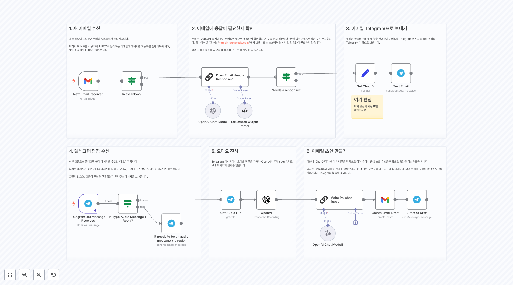](https://raw.githubusercontent.com/n8nKOR/n8n-shared-workflow/refs/heads/main/workflows/n8nworkflows/ai/3930.json)
**워크플로우 3930**
1. 새 이메일 수신 새 이메일이 도착하면 우리의 워크플로가 트리거됩니다. 여기서 IF 노드를 사용하여 INBOX로 들어오는 이메일에 대해서만 자동화를 실행하도록 하며, SENT 폴더의 이메일은 제외합니다.

[](https://raw.githubusercontent.com/n8nKOR/n8n-shared-workflow/refs/heads/main/workflows/n8nworkflows/ai/3934.json)
**워크플로우 3934**
에픽 완료? 이 노드는 Jira에서 발생하는 모든 이슈 변경 시 트리거됩니다. 그러나 에픽 상태가 **완료**로 변경될 때만 자동화를 트리거합니다.

[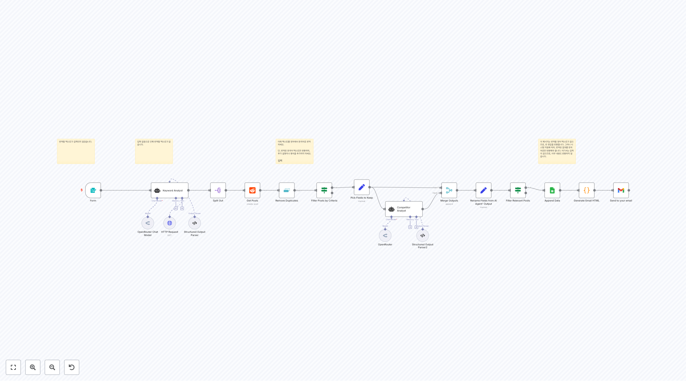](https://raw.githubusercontent.com/n8nKOR/n8n-shared-workflow/refs/heads/main/workflows/n8nworkflows/ai/3935.json)
**워크플로우 3935**
입력 없음으로 인해 번역할 텍스트가 없습니다.

[](https://raw.githubusercontent.com/n8nKOR/n8n-shared-workflow/refs/heads/main/workflows/n8nworkflows/ai/3940.json)
**워크플로우 3940**
✅ 시나리오 2 – 문서 업로드 및 임베딩 Telegram을 통해 보내진 문서를 다운로드하여 텍스트를 추출하고, 임베딩을 생성한 후 Supabase Vector Store에 삽입하는 흐름.

## 📋 워크플로우 목록 (391-400)

[](https://raw.githubusercontent.com/n8nKOR/n8n-shared-workflow/refs/heads/main/workflows/n8nworkflows/ai/3941.json)
**워크플로우 3941**
번역할 텍스트가 제공되지 않았습니다. 영어 텍스트를 입력해 주세요.

[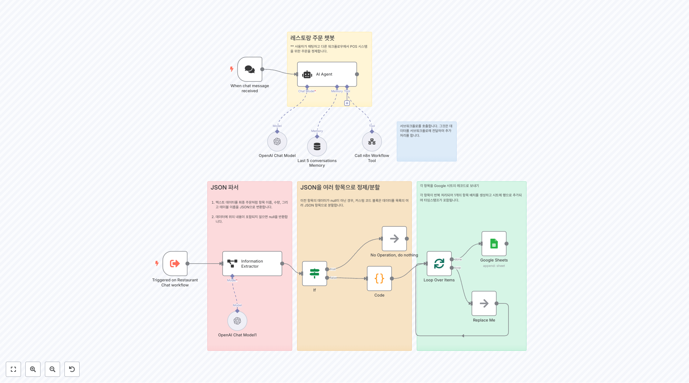](https://raw.githubusercontent.com/n8nKOR/n8n-shared-workflow/refs/heads/main/workflows/n8nworkflows/ai/3942.json)
**워크플로우 3942**
JSON 파서 1. 텍스트 데이터를 최종 주문처럼 항목 이름, 수량, 그리고 테이블 이름을 JSON으로 변환합니다. 2. 데이터에 위의 내용이 포함되지 않으면 null을 반환합니다.

[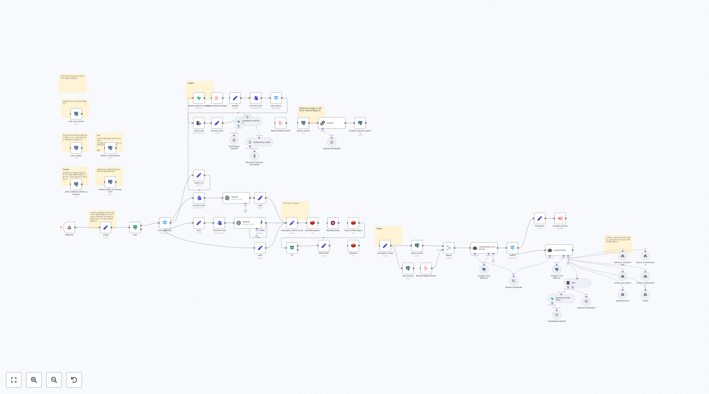](https://raw.githubusercontent.com/n8nKOR/n8n-shared-workflow/refs/heads/main/workflows/n8nworkflows/ai/3947.json)
**워크플로우 3947**
한국어 텍스트가 없습니다.

[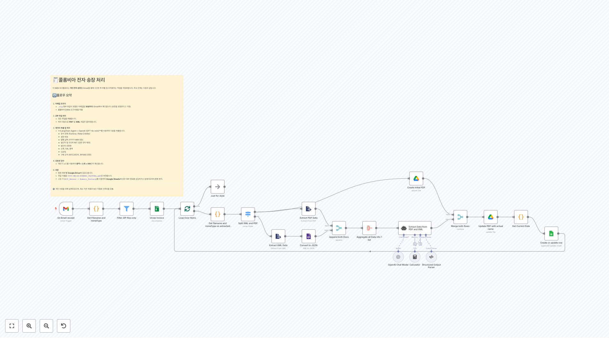](https://raw.githubusercontent.com/n8nKOR/n8n-shared-workflow/refs/heads/main/workflows/n8nworkflows/ai/3951.json)
**워크플로우 3951**
🧾 콜롬비아 전자 송장 처리 이 N8N 워크플로우는 **개인 전자 송장**을 Gmail을 통해 수신한 후 추출 및 조직화하는 작업을 자동화합니다. 주요 단계는 다음과 같습니다: 🔁 플로우 요약 1. **이메일 트리거** - `.zip` 첨부 파일이 포함된 이메일을 **30분마다** Gmail에서 확인합니다 (송장을 포함한다고 가정). - 콜롬비아 DIAN ...

[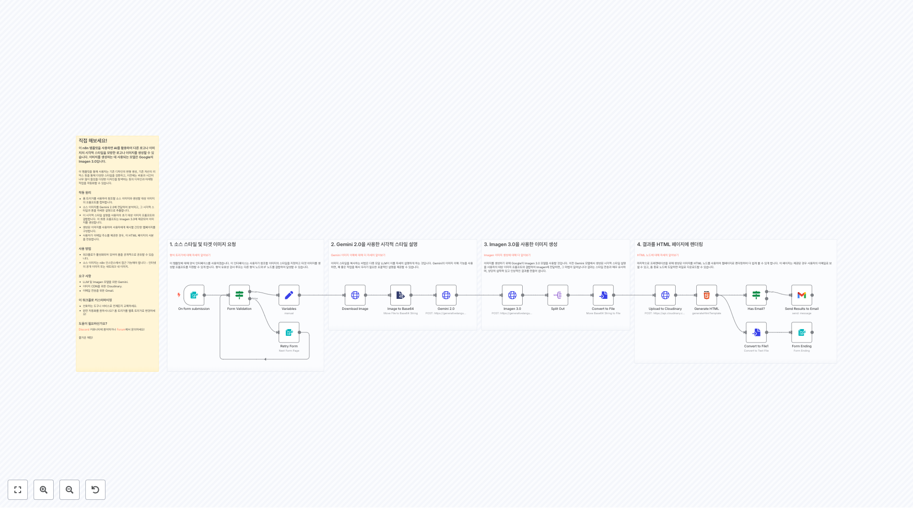](https://raw.githubusercontent.com/n8nKOR/n8n-shared-workflow/refs/heads/main/workflows/n8nworkflows/ai/3954.json)
**워크플로우 3954**
1. 소스 스타일 및 타겟 이미지 요청 [형식 트리거에 대해 자세히 알아보기](https://docs.n8n.io/integrations/builtin/core-nodes/n8n-nodes-base.formtrigger/) 이 템플릿에 대해 양식 인터페이스를 사용하겠습니다. 이 인터페이스는 사용자가 참조할 이미지의 스타일을 지정하고 타겟 이미지를 생성할 프...

[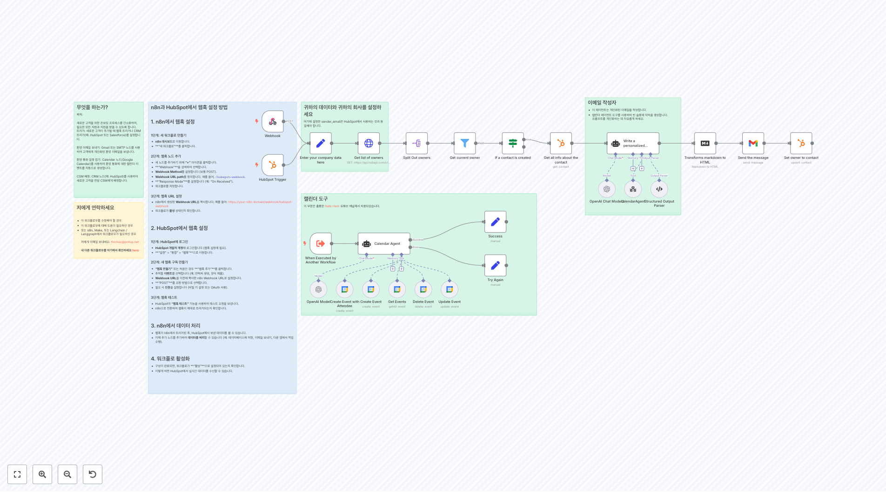](https://raw.githubusercontent.com/n8nKOR/n8n-shared-workflow/refs/heads/main/workflows/n8nworkflows/ai/3958.json)
**워크플로우 3958**
무엇을 하는가? 목적: 새로운 고객을 위한 온보딩 프로세스를 간소화하여, 필요한 모든 자원과 지원을 받을 수 있도록 합니다. 트리거: 새로운 고객이 추가될 때 웹훅 트리거나 CRM 트리거(예: HubSpot 또는 Salesforce)를 설정합니다. 환영 이메일 보내기: Gmail 또는 SMTP 노드를 사용하여 고객에게 개인화된 환영 이메일을 보냅니다. 환영...

[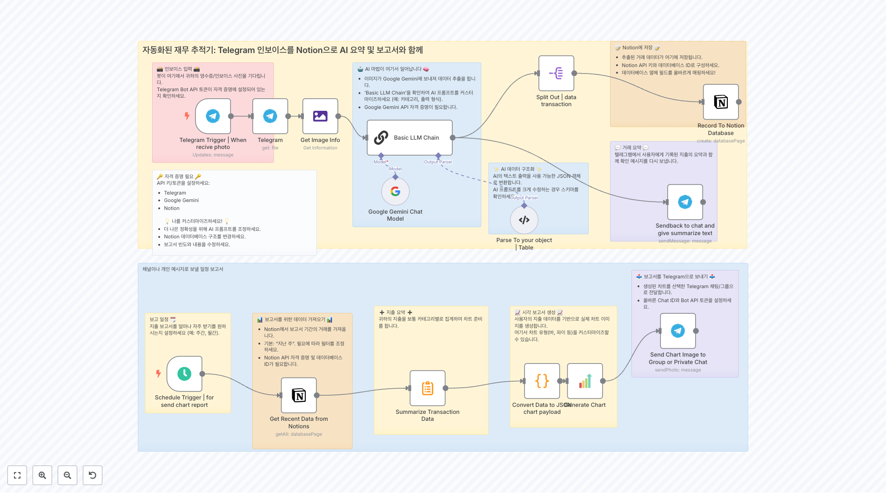](https://raw.githubusercontent.com/n8nKOR/n8n-shared-workflow/refs/heads/main/workflows/n8nworkflows/ai/3960.json)
**워크플로우 3960**
자동화된 재무 추적기: Telegram 인보이스를 Notion으로 AI 요약 및 보고서와 함께

[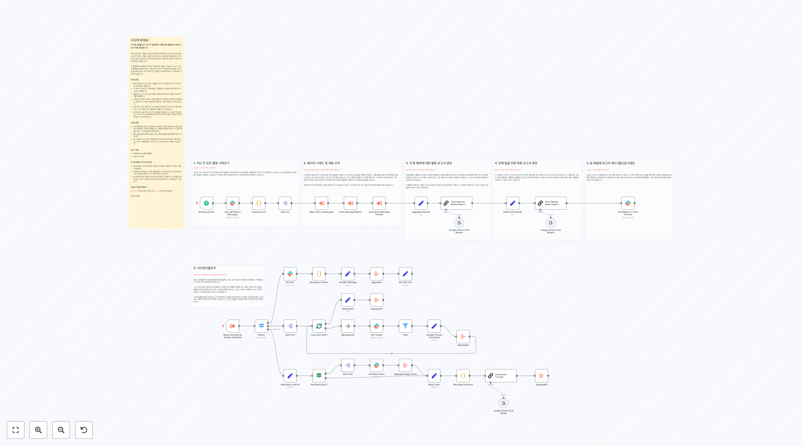](https://raw.githubusercontent.com/n8nKOR/n8n-shared-workflow/refs/heads/main/workflows/n8nworkflows/ai/3969.json)
**워크플로우 3969**
1. 지난 주 모든 활동 가져오기 [Slack 노드에 대해 더 알아보기](https://docs.n8n.io/integrations/builtin/app-nodes/n8n-nodes-base.slack) 우리는 지난 7일 동안 우리 팀 채널의 모든 활동을 가져와 메시지 작성자별로 그룹화하는 것으로 시작하겠습니다. Slack 노드와 DateTime 필터를 사...

[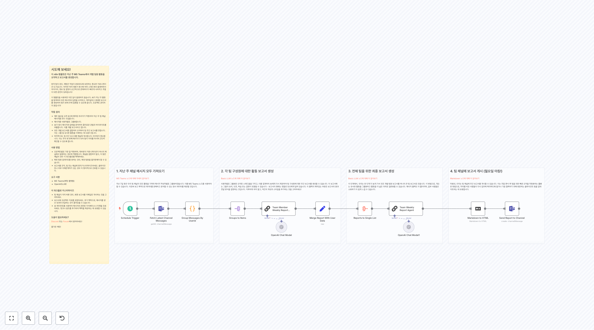](https://raw.githubusercontent.com/n8nKOR/n8n-shared-workflow/refs/heads/main/workflows/n8nworkflows/ai/3971.json)
**워크플로우 3971**
1. 지난 주 채널 메시지 모두 가져오기 [MS Teams 노드에 대해 자세히 알아보기](https://docs.n8n.io/integrations/builtin/app-nodes/n8n-nodes-base.microsoftteams) 지난 7일 동안 우리 팀 채널의 모든 활동을 가져와 메시지 작성자별로 그룹화하겠습니다. 이를 MS Teams 노드를 사용하...

[](https://raw.githubusercontent.com/n8nKOR/n8n-shared-workflow/refs/heads/main/workflows/n8nworkflows/ai/3986.json)
**워크플로우 3986**
1. 뉴스를 벡터 저장소에 저장 (매일 실행)

## 📋 워크플로우 목록 (401-410)

[](https://raw.githubusercontent.com/n8nKOR/n8n-shared-workflow/refs/heads/main/workflows/n8nworkflows/ai/4005.json)
**워크플로우 4005**
1. 일정 및 시트 데이터 검색 이 워크플로는 정의된 일정(예: 매일 또는 매시간)에 따라 자동으로 시작됩니다. 그것은 'Pending'으로 표시된 다음 Google Sheet 행을 검색합니다. 시트에는 다음과 같은 열이 포함되어야 합니다: 1. 게시물 설명 2. 지시사항 3. 이미지 4. 상태 5. row_number (업데이트에 필요) Google Sh...

[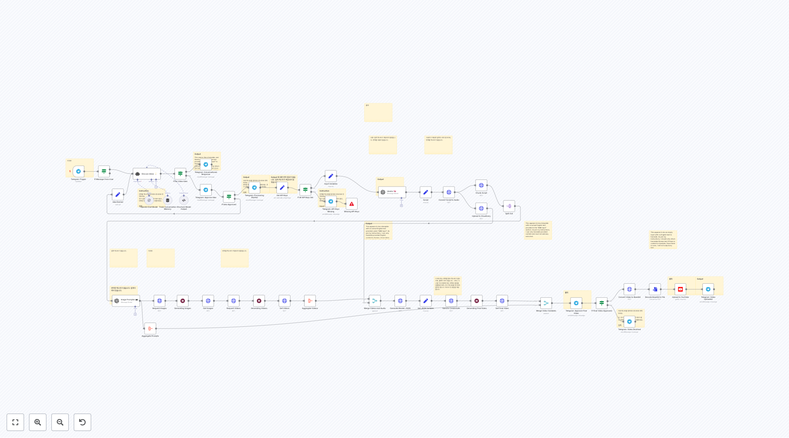](https://raw.githubusercontent.com/n8nKOR/n8n-shared-workflow/refs/heads/main/workflows/n8nworkflows/ai/4010.json)
**워크플로우 4010**
아웃풋

[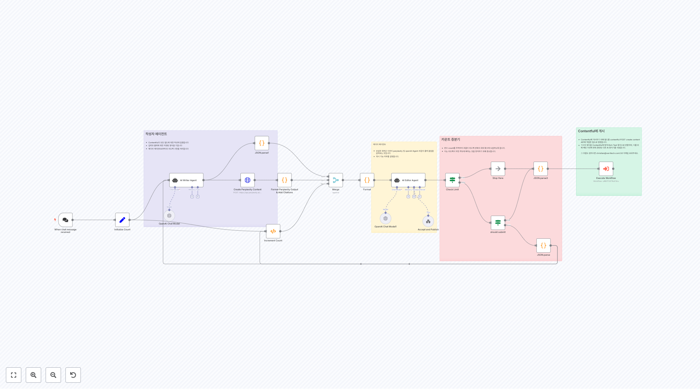](https://raw.githubusercontent.com/n8nKOR/n8n-shared-workflow/refs/heads/main/workflows/n8nworkflows/ai/4012.json)
**워크플로우 4012**
작성자 에이전트 - Contentful의 모든 필드에 대한 작성에 집중합니다 - 입력과 출력에 대한 지정된 형식을 가집니다 - 에디터 에이전트로부터의 피드백 구현을 처리합니다

[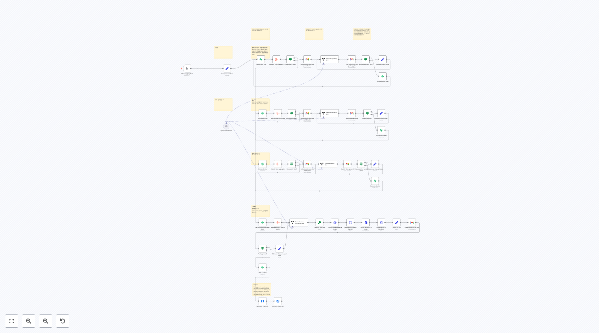](https://raw.githubusercontent.com/n8nKOR/n8n-shared-workflow/refs/heads/main/workflows/n8nworkflows/ai/4016.json)
**워크플로우 4016**
출력 (Output) 부분이 템플릿처럼 보이지만, 입력 텍스트가 없으므로 번역할 내용이 없습니다. 이에 따라 아무 내용도 반환되지 않습니다.

[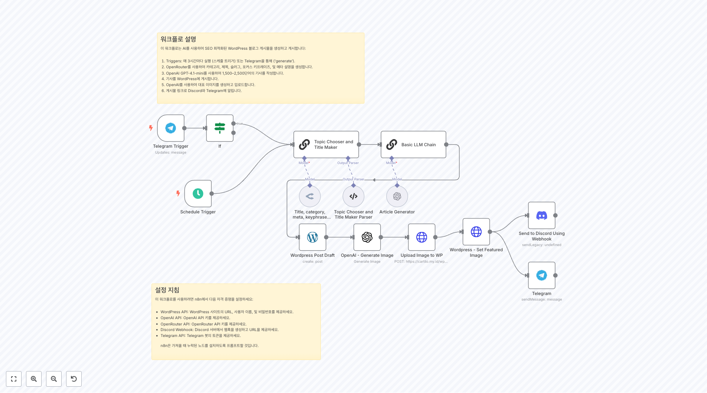](https://raw.githubusercontent.com/n8nKOR/n8n-shared-workflow/refs/heads/main/workflows/n8nworkflows/ai/4024.json)
**워크플로우 4024**
워크플로 설명 이 워크플로는 AI를 사용하여 SEO 최적화된 WordPress 블로그 게시물을 생성하고 게시합니다: 1. Triggers: 매 3시간마다 실행 (스케줄 트리거) 또는 Telegram을 통해 ('generate'). 2. OpenRouter를 사용하여 카테고리, 제목, 슬러그, 포커스 키프레이즈, 및 메타 설명을 생성합니다. 3. OpenAI...

[](https://raw.githubusercontent.com/n8nKOR/n8n-shared-workflow/refs/heads/main/workflows/n8nworkflows/ai/4029.json)
**워크플로우 4029**
번역된 텍스트 없음. 입력이 비어 있습니다.

[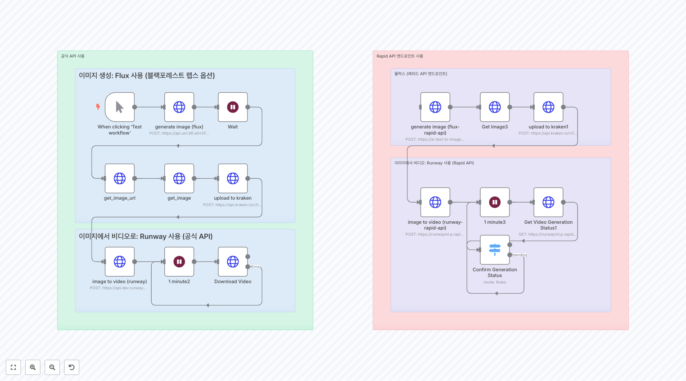](https://raw.githubusercontent.com/n8nKOR/n8n-shared-workflow/refs/heads/main/workflows/n8nworkflows/ai/4056.json)
**워크플로우 4056**
이미지 생성: Flux 사용 (블랙포레스트 랩스 옵션)

[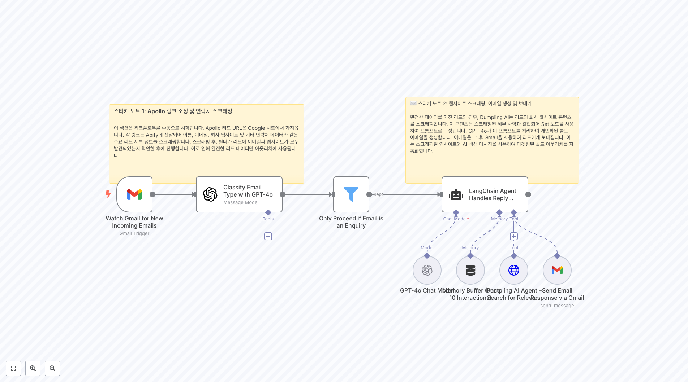](https://raw.githubusercontent.com/n8nKOR/n8n-shared-workflow/refs/heads/main/workflows/n8nworkflows/ai/4057.json)
**워크플로우 4057**
✉️ 스티키 노트 2: 웹사이트 스크래핑, 이메일 생성 및 보내기 완전한 데이터를 가진 리드의 경우, Dumpling AI는 리드의 회사 웹사이트 콘텐츠를 스크래핑합니다. 이 콘텐츠는 스크래핑된 세부 사항과 결합되어 Set 노드를 사용하여 프롬프트로 구성됩니다. GPT-4o가 이 프롬프트를 처리하여 개인화된 콜드 이메일을 생성합니다. 이메일은 그 후 Gma...

[](https://raw.githubusercontent.com/n8nKOR/n8n-shared-workflow/refs/heads/main/workflows/n8nworkflows/ai/4064.json)
**워크플로우 4064**
Github에서 이전 파일 이름들을 검색하세요.

[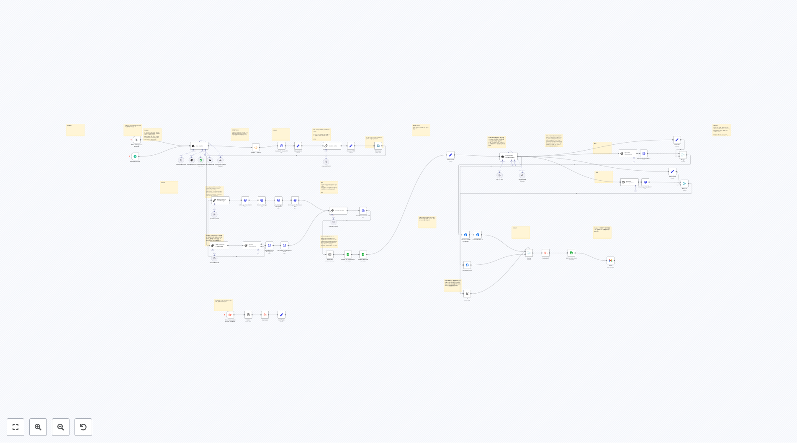](https://raw.githubusercontent.com/n8nKOR/n8n-shared-workflow/refs/heads/main/workflows/n8nworkflows/ai/4082.json)
**워크플로우 4082**
Output

## 📋 워크플로우 목록 (411-420)

[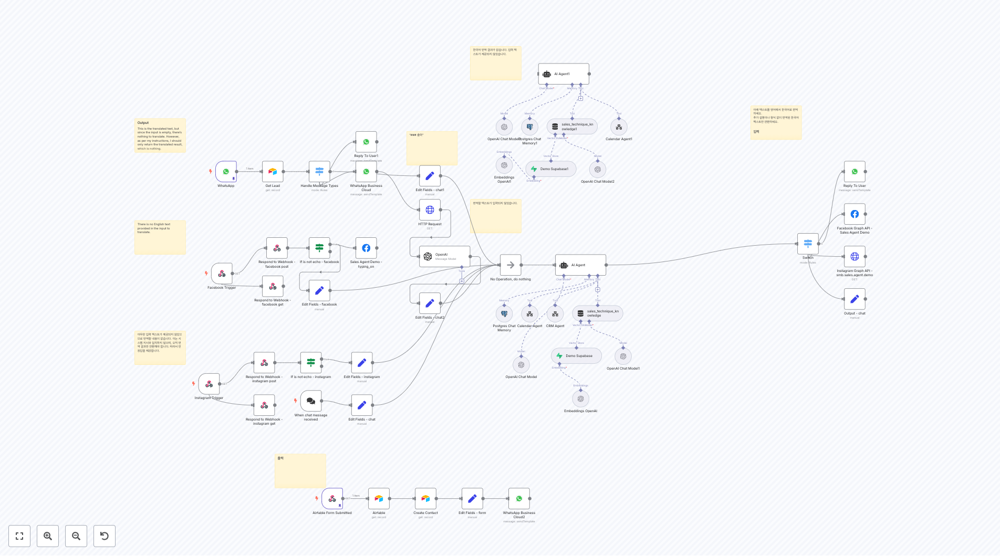](https://raw.githubusercontent.com/n8nKOR/n8n-shared-workflow/refs/heads/main/workflows/n8nworkflows/ai/4083.json)
**워크플로우 4083**
한국어 번역 결과가 없습니다. 입력 텍스트가 제공되지 않았습니다.

[](https://raw.githubusercontent.com/n8nKOR/n8n-shared-workflow/refs/heads/main/workflows/n8nworkflows/ai/4086.json)
**워크플로우 4086**
저장소 이름, 데이터베이스 ID 및 자격 증명을 교체하세요.

[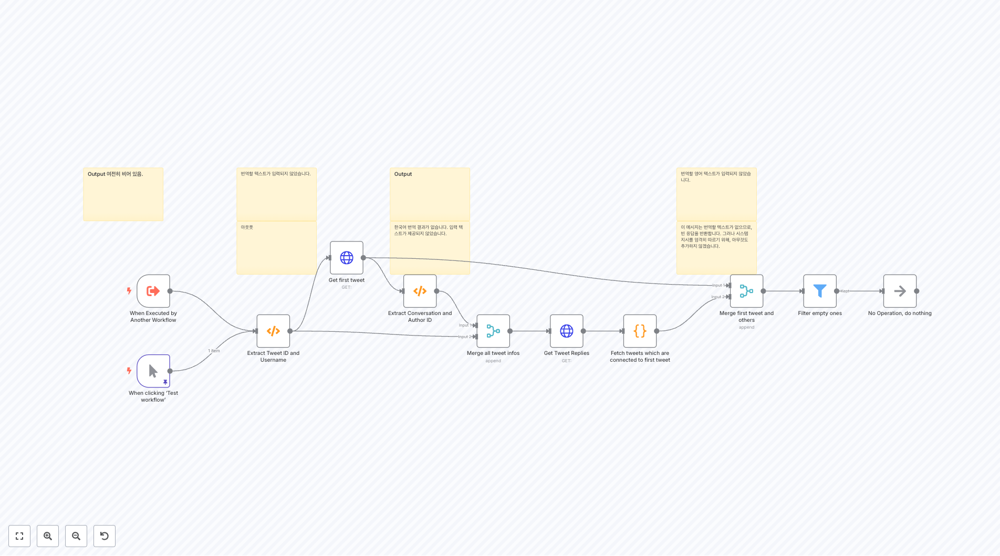](https://raw.githubusercontent.com/n8nKOR/n8n-shared-workflow/refs/heads/main/workflows/n8nworkflows/ai/4088.json)
**워크플로우 4088**
아웃풋

[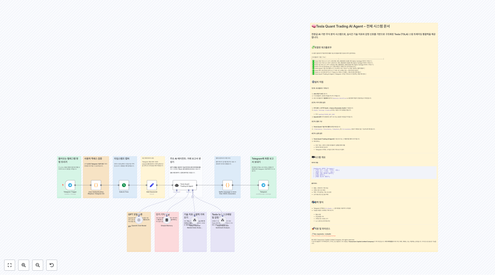](https://raw.githubusercontent.com/n8nKOR/n8n-shared-workflow/refs/heads/main/workflows/n8nworkflows/ai/4092.json)
**워크플로우 4092**
들어오는 텔레그램 명령 트리거 이 노드는 새로운 텔레그램 메시지를 감지하여 보고서 생성을 시작합니다.

[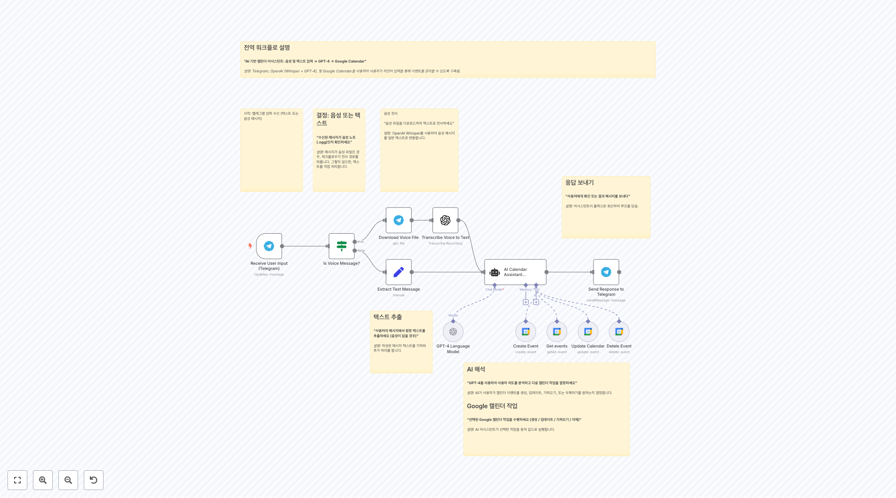](https://raw.githubusercontent.com/n8nKOR/n8n-shared-workflow/refs/heads/main/workflows/n8nworkflows/ai/4102.json)
**워크플로우 4102**
전역 워크플로 설명 **"AI 기반 캘린더 어시스턴트: 음성 및 텍스트 입력 → GPT-4 → Google Calendar"** *설명: Telegram, OpenAI (Whisper + GPT-4), 및 Google Calendar을 사용하여 사용자가 자연어 입력을 통해 이벤트를 관리할 수 있도록 구축됨.*

[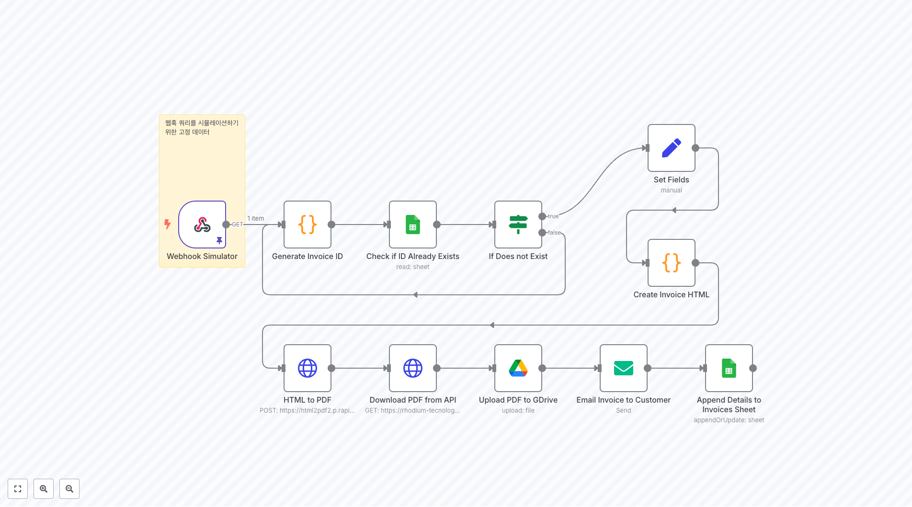](https://raw.githubusercontent.com/n8nKOR/n8n-shared-workflow/refs/heads/main/workflows/n8nworkflows/ai/4105.json)
**워크플로우 4105**
웹훅 쿼리를 시뮬레이션하기 위한 고정 데이터

[](https://raw.githubusercontent.com/n8nKOR/n8n-shared-workflow/refs/heads/main/workflows/n8nworkflows/ai/4107.json)
**워크플로우 4107**
Output 아래는 영어 텍스트를 한국어로 번역한 결과입니다. 추가 설명이나 형식을 추가하지 말고, 번역된 한국어 텍스트만 반환하세요.

[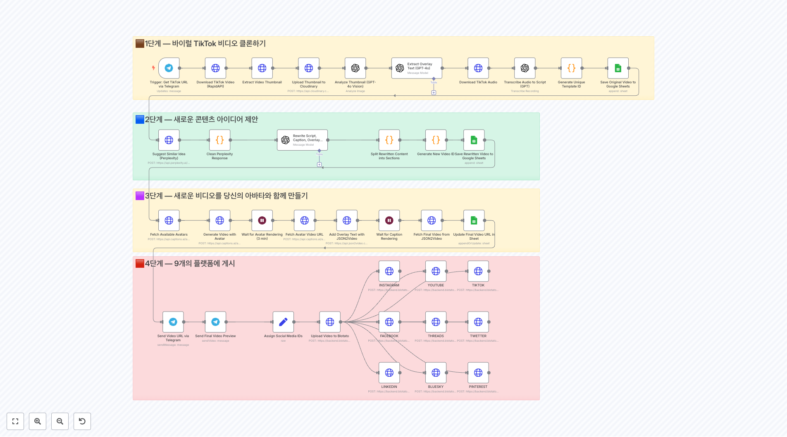](https://raw.githubusercontent.com/n8nKOR/n8n-shared-workflow/refs/heads/main/workflows/n8nworkflows/ai/4110.json)
**워크플로우 4110**
🟫 1단계 — 바이럴 TikTok 비디오 클론하기

[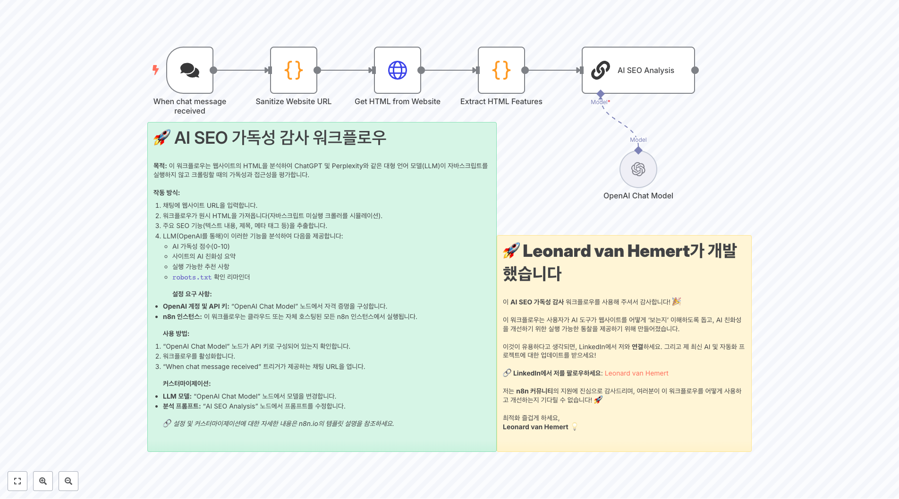](https://raw.githubusercontent.com/n8nKOR/n8n-shared-workflow/refs/heads/main/workflows/n8nworkflows/ai/4151.json)
**워크플로우 4151**
🚀 AI SEO 가독성 감사 워크플로우 **목적:** 이 워크플로우는 웹사이트의 HTML을 분석하여 ChatGPT 및 Perplexity와 같은 대형 언어 모델(LLM)이 자바스크립트를 실행하지 않고 크롤링할 때의 가독성과 접근성을 평가합니다. **작동 방식:** 1. 채팅에 웹사이트 URL을 입력합니다. 2. 워크플로우가 원시 HTML을 가져옵니다(자바스...

[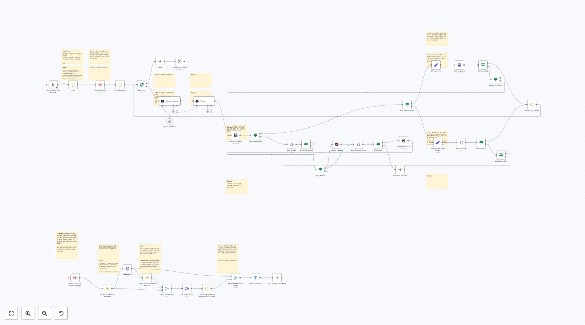](https://raw.githubusercontent.com/n8nKOR/n8n-shared-workflow/refs/heads/main/workflows/n8nworkflows/ai/4233.json)
**워크플로우 4233**
번역할 텍스트가 입력되지 않았습니다.

## 📋 워크플로우 목록 (421-430)

[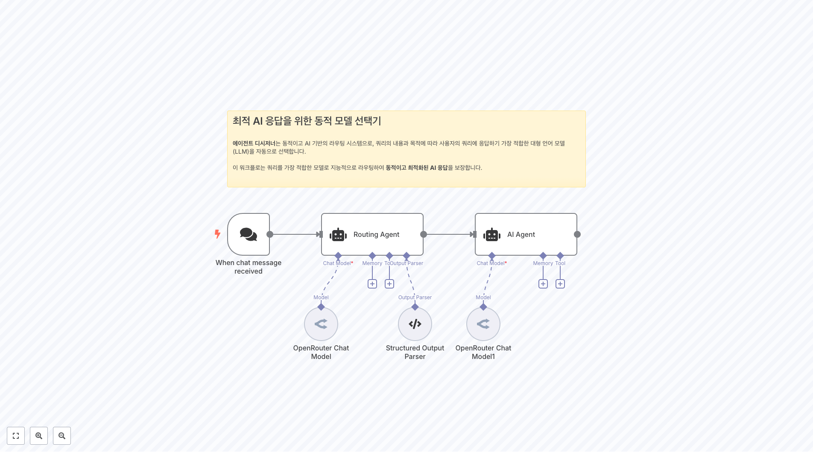](https://raw.githubusercontent.com/n8nKOR/n8n-shared-workflow/refs/heads/main/workflows/n8nworkflows/ai/4237.json)
**워크플로우 4237**
최적 AI 응답을 위한 동적 모델 선택기 **에이전트 디시저너**는 동적이고 AI 기반의 라우팅 시스템으로, 쿼리의 내용과 목적에 따라 사용자의 쿼리에 응답하기 가장 적합한 대형 언어 모델(LLM)을 자동으로 선택합니다. 이 워크플로는 쿼리를 가장 적합한 모델로 지능적으로 라우팅하여 **동적이고 최적화된 AI 응답**을 보장합니다.

[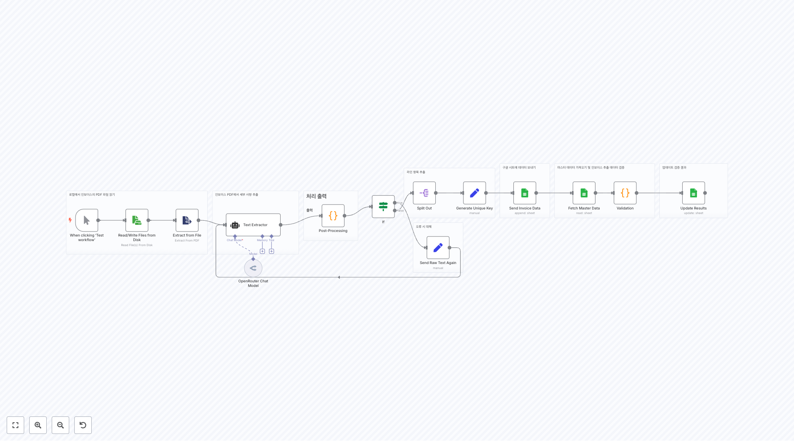](https://raw.githubusercontent.com/n8nKOR/n8n-shared-workflow/refs/heads/main/workflows/n8nworkflows/ai/4247.json)
**워크플로우 4247**
로컬에서 인보이스의 PDF 파일 읽기

[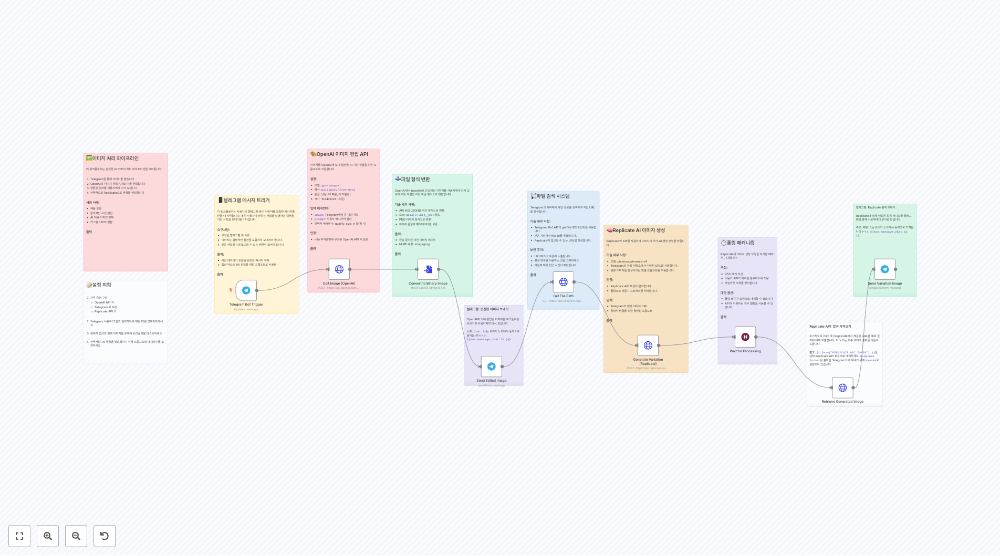](https://raw.githubusercontent.com/n8nKOR/n8n-shared-workflow/refs/heads/main/workflows/n8nworkflows/ai/4275.json)
**워크플로우 4275**
📱 텔레그램 메시지 트리거 이 워크플로우는 사용자의 텔레그램 봇이 이미지를 포함한 메시지를 받을 때 시작됩니다. 봇은 사용자가 원하는 편집을 설명하는 캡션을 가진 사진을 보내기를 기다립니다. 요구사항: - 구성된 텔레그램 봇 토큰 - 이미지는 설명적인 캡션을 포함하여 보내져야 합니다. - 봇은 파일을 다운로드할 수 있는 권한이 있어야 합니다. 출력: - 사...

[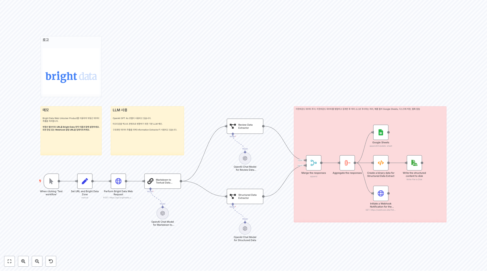](https://raw.githubusercontent.com/n8nKOR/n8n-shared-workflow/refs/heads/main/workflows/n8nworkflows/ai/4281.json)
**워크플로우 4281**
메모 Bright Data Web Unlocker Product를 이용하여 부동산 데이터 추출을 처리합니다. **부동산 웹사이트 URL을 Bright Data 영역 이름과 함께 설정하세요. 또한 관심 있는 Webhook 알림 URL을 업데이트하세요.**

[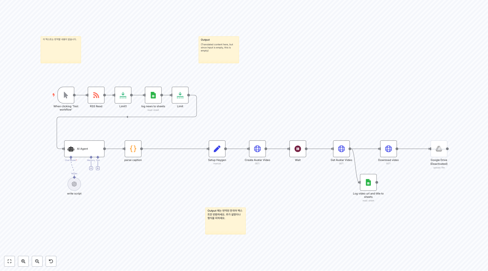](https://raw.githubusercontent.com/n8nKOR/n8n-shared-workflow/refs/heads/main/workflows/n8nworkflows/ai/4288.json)
**워크플로우 4288**
이 텍스트는 번역할 내용이 없습니다.

[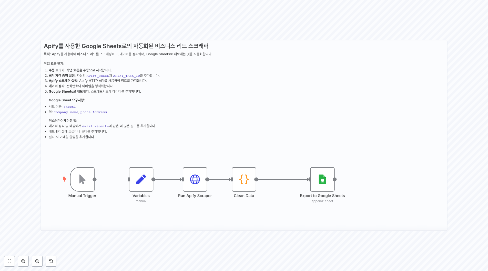](https://raw.githubusercontent.com/n8nKOR/n8n-shared-workflow/refs/heads/main/workflows/n8nworkflows/ai/4295.json)
**워크플로우 4295**
Apify를 사용한 Google Sheets로의 자동화된 비즈니스 리드 스크래퍼 **목적:** Apify를 사용하여 비즈니스 리드를 스크래핑하고, 데이터를 정리하며, Google Sheets로 내보내는 것을 자동화합니다. **작업 흐름 단계:** 1. **수동 트리거**: 작업 흐름을 수동으로 시작합니다. 2. **API 자격 증명 설정**: 자신의 `AP...

[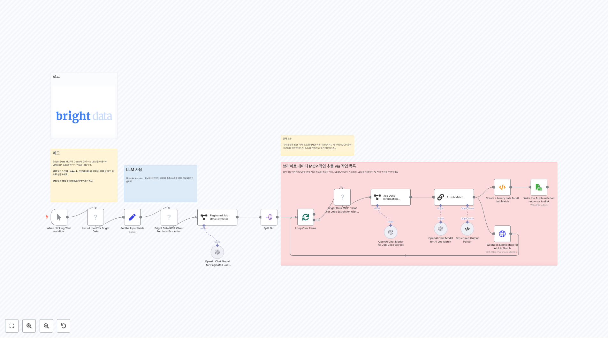](https://raw.githubusercontent.com/n8nKOR/n8n-shared-workflow/refs/heads/main/workflows/n8nworkflows/ai/4330.json)
**워크플로우 4330**
면책 조항 이 템플릿은 n8n 자체 호스팅에서만 이용 가능합니다. 왜냐하면 MCP 클라이언트를 위한 커뮤니티 노드를 사용하고 있기 때문입니다.

[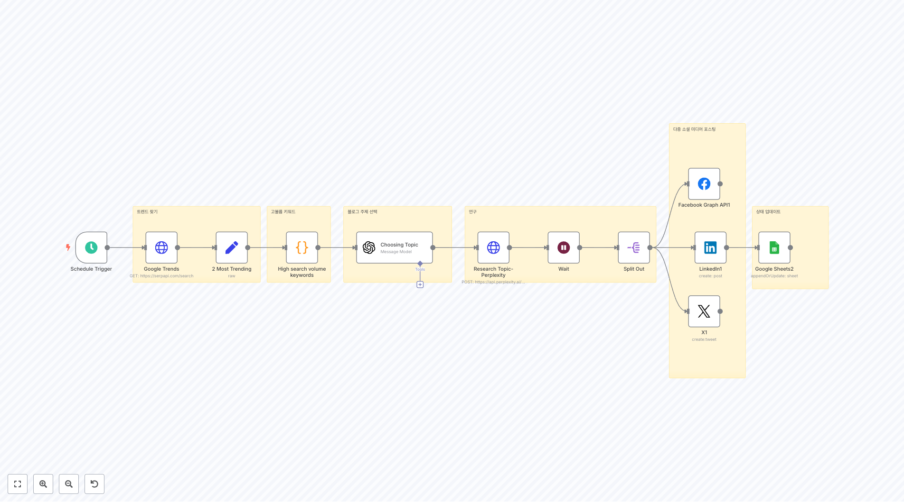](https://raw.githubusercontent.com/n8nKOR/n8n-shared-workflow/refs/heads/main/workflows/n8nworkflows/ai/4352.json)
**워크플로우 4352**
트렌드 찾기

[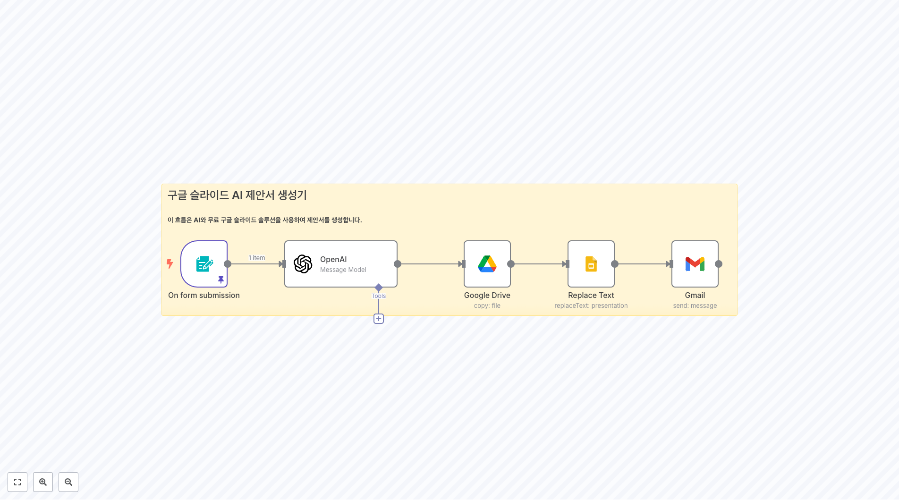](https://raw.githubusercontent.com/n8nKOR/n8n-shared-workflow/refs/heads/main/workflows/n8nworkflows/ai/4359.json)
**워크플로우 4359**
구글 슬라이드 AI 제안서 생성기 **이 흐름은 AI와 무료 구글 슬라이드 솔루션을 사용하여 제안서를 생성합니다.**

[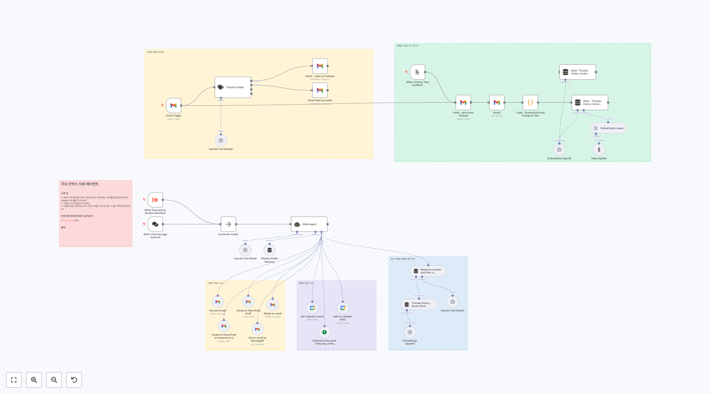](https://raw.githubusercontent.com/n8nKOR/n8n-shared-workflow/refs/heads/main/workflows/n8nworkflows/ai/4366.json)
**워크플로우 4366**
이메일 정렬 에이전트

## 📋 워크플로우 목록 (431-440)

[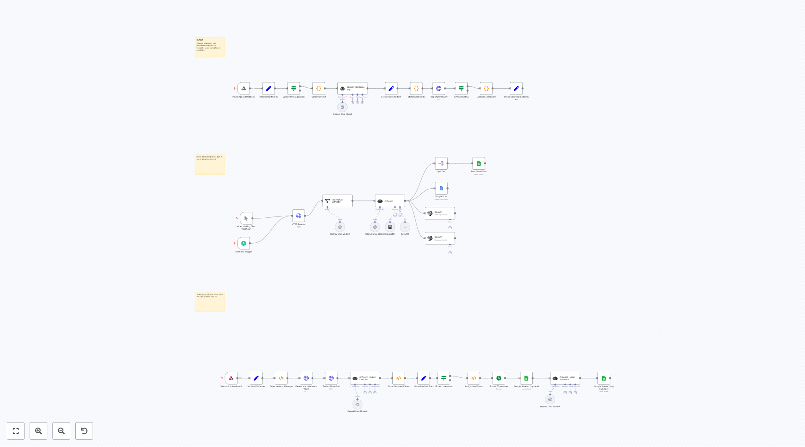](https://raw.githubusercontent.com/n8nKOR/n8n-shared-workflow/refs/heads/main/workflows/n8nworkflows/ai/4368.json)
**워크플로우 4368**
Output (There's no English text provided in the input to translate, so no translation is possible.)

[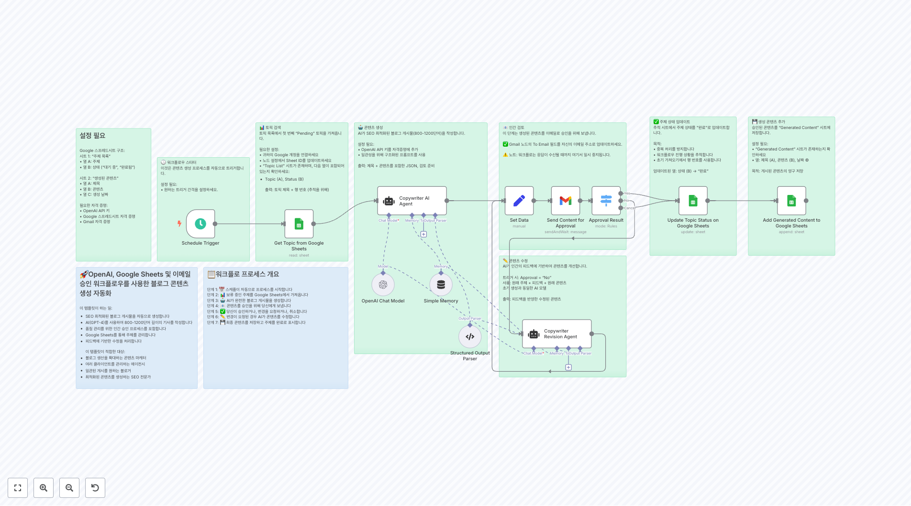](https://raw.githubusercontent.com/n8nKOR/n8n-shared-workflow/refs/heads/main/workflows/n8nworkflows/ai/4371.json)
**워크플로우 4371**
🕒 워크플로우 스타터 이것은 콘텐츠 생성 프로세스를 자동으로 트리거합니다. 설정 필요: • 원하는 트리거 간격을 설정하세요.

[](https://raw.githubusercontent.com/n8nKOR/n8n-shared-workflow/refs/heads/main/workflows/n8nworkflows/ai/4376.json)
**워크플로우 4376**
AI 송장 처리 에이전트: 이메일에서 구조화된 데이터로 자동으로 Gmail 첨부 파일에서 송장 데이터를 추출, 분석 및 구조화된 Google Sheets로 정리합니다. 완벽한 솔루션: ✅ 회계사 및 부기 담당자 — 송장에서 수동 데이터 입력 제거 ✅ 소규모 사업체 — 송장 처리 및 추적 간소화 ✅ 재무 팀 — 미지급금 워크플로 자동화 ⚙️ 사용된 도구 n8...

[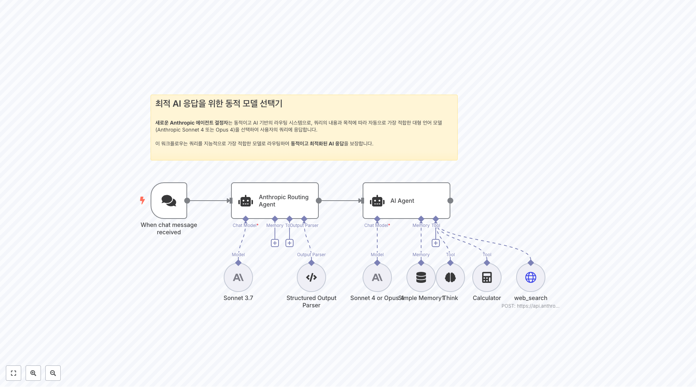](https://raw.githubusercontent.com/n8nKOR/n8n-shared-workflow/refs/heads/main/workflows/n8nworkflows/ai/4399.json)
**워크플로우 4399**
최적 AI 응답을 위한 동적 모델 선택기 **새로운 Anthropic 에이전트 결정자**는 동적이고 AI 기반의 라우팅 시스템으로, 쿼리의 내용과 목적에 따라 자동으로 가장 적합한 대형 언어 모델(Anthropic Sonnet 4 또는 Opus 4)을 선택하여 사용자의 쿼리에 응답합니다. 이 워크플로우는 쿼리를 지능적으로 가장 적합한 모델로 라우팅하여 **...

[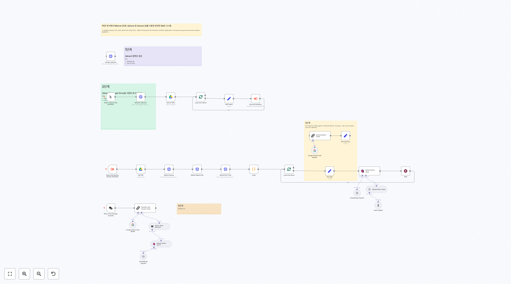](https://raw.githubusercontent.com/n8nKOR/n8n-shared-workflow/refs/heads/main/workflows/n8nworkflows/ai/4400.json)
**워크플로우 4400**
1단계 Qdrant 컬렉션 생성 변경: - QDRANTURL - COLLECTION

[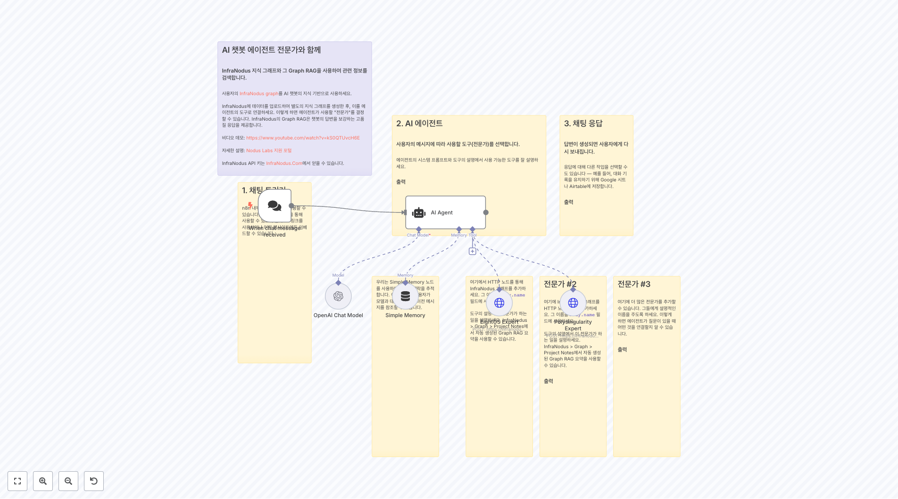](https://raw.githubusercontent.com/n8nKOR/n8n-shared-workflow/refs/heads/main/workflows/n8nworkflows/ai/4402.json)
**워크플로우 4402**
AI 챗봇 에이전트 전문가와 함께 InfraNodus 지식 그래프와 그 Graph RAG을 사용하여 관련 정보를 검색합니다. 사용자의 [InfraNodus graph](https://infranodus.com)를 AI 챗봇의 지식 기반으로 사용하세요. InfraNodus에 데이터를 업로드하여 별도의 지식 그래프를 생성한 후, 이를 에이전트의 도구로 연결하세...

[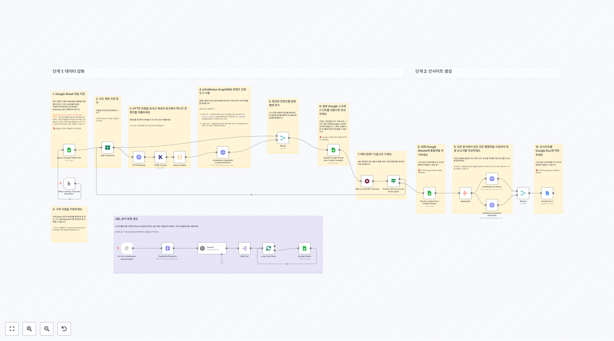](https://raw.githubusercontent.com/n8nKOR/n8n-shared-workflow/refs/heads/main/workflows/n8nworkflows/ai/4403.json)
**워크플로우 4403**
1. Google Sheet 파일 지정 회사 이름과 그들의 URL(URL 열에)을 포함해야 합니다. 또한, 데이터를 복사할 Topical Summary 및 Graph Summary 열도 포함되어야 합니다. 🤌 [SEE GOOGLE SHEETS TEMPLATE HERE](https://docs.google.com/spreadsheets/d/14qR7Gi8SR...

[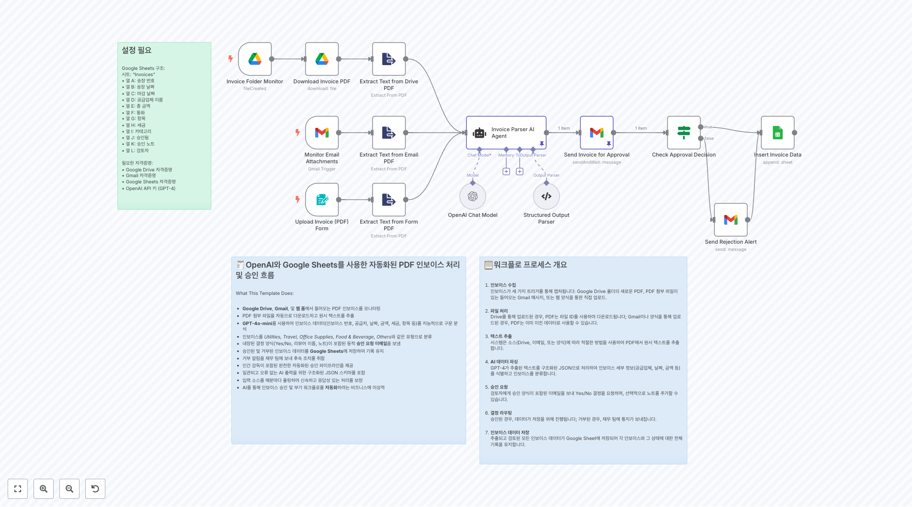](https://raw.githubusercontent.com/n8nKOR/n8n-shared-workflow/refs/heads/main/workflows/n8nworkflows/ai/4452.json)
**워크플로우 4452**
설정 필요 Google Sheets 구조: 시트: "Invoices" • 열 A: 송장 번호 • 열 B: 송장 날짜 • 열 C: 마감 날짜 • 열 D: 공급업체 이름 • 열 E: 총 금액 • 열 F: 통화 • 열 G: 항목 • 열 H: 세금 • 열 I: 카테고리 • 열 J: 승인됨 • 열 K: 승인 노트 • 열 L: 검토자 필요한 자격증명: • Google...

[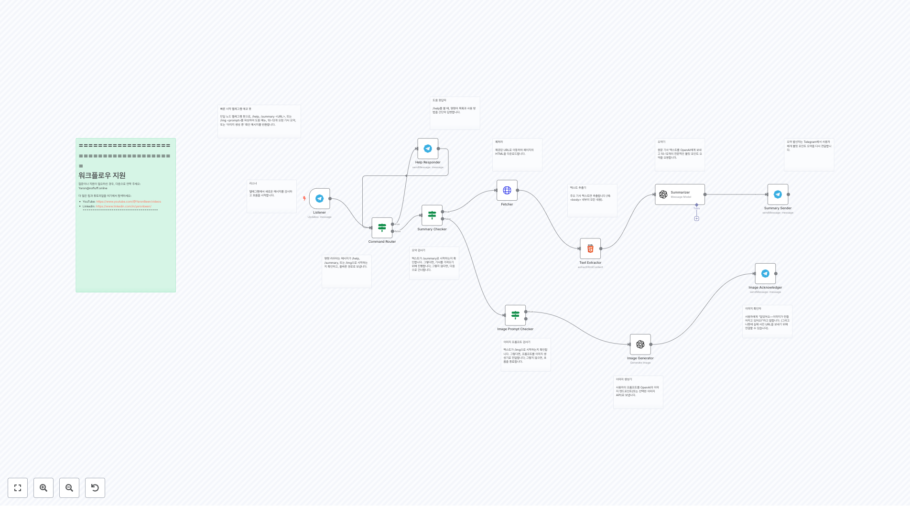](https://raw.githubusercontent.com/n8nKOR/n8n-shared-workflow/refs/heads/main/workflows/n8nworkflows/ai/4457.json)
**워크플로우 4457**
빠른 시작 텔레그램 에코 봇 단일 노드 텔레그램 봇으로, /help, /summary , 또는 /img 를 파싱하여 도움 메뉴, 10-12개 요점 기사 요약, 또는 '이미지 생성 중' 확인 메시지를 반환합니다.

[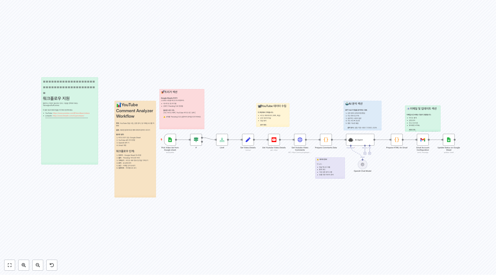](https://raw.githubusercontent.com/n8nKOR/n8n-shared-workflow/refs/heads/main/workflows/n8nworkflows/ai/4459.json)
**워크플로우 4459**
======================================= 워크플로우 지원 ======================================= 질문이나 지원이 필요하신 경우, 다음을 연락해 주세요: Yaron@nofluff.online 더 많은 팁과 튜토리얼을 여기에서 탐색하세요: - YouTube: https://www.youtube.co...

## 📋 워크플로우 목록 (441-450)

[](https://raw.githubusercontent.com/n8nKOR/n8n-shared-workflow/refs/heads/main/workflows/n8nworkflows/ai/4468.json)
**워크플로우 4468**
한국어 번역 결과가 없습니다. 입력 텍스트가 제공되지 않았습니다.

[](https://raw.githubusercontent.com/n8nKOR/n8n-shared-workflow/refs/heads/main/workflows/n8nworkflows/ai/4478.json)
**워크플로우 4478**
📱 YouTube 소셜 미디어 자동화 **목적:** YouTube 비디오를 Facebook 및 Instagram에 자동 게시 **일정:** 새 비디오를 매 시간 확인 **필요한 설정:** 1. YouTube 채널 RSS 피드 2. OpenAI API 키 (GPT-4o-mini) 3. 권한이 있는 Meta 앱 4. 장기 유효 액세스 토큰 워크플로 단계: 1....

[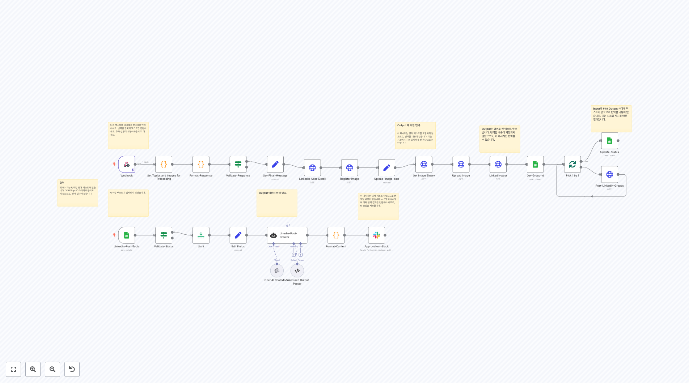](https://raw.githubusercontent.com/n8nKOR/n8n-shared-workflow/refs/heads/main/workflows/n8nworkflows/ai/4483.json)
**워크플로우 4483**
출력 위 메시지는 번역할 영어 텍스트가 없습니다. "Input" 아래에 내용이 비어 있으므로, 번역 결과가 없습니다.

[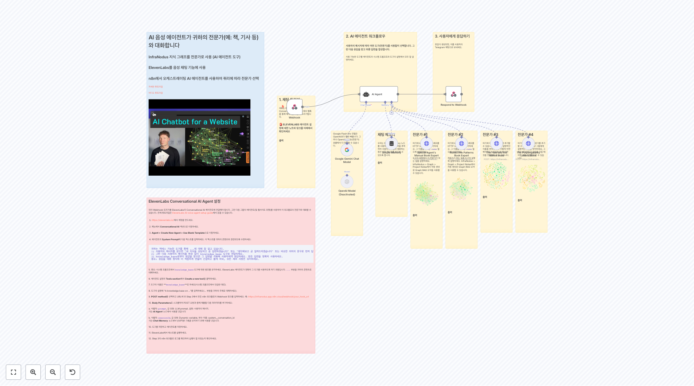](https://raw.githubusercontent.com/n8nKOR/n8n-shared-workflow/refs/heads/main/workflows/n8nworkflows/ai/4484.json)
**워크플로우 4484**
전문가 1 여기에 InfraNodus 그래프를 HTTP 노드를 통해 추가하세요. 그 이름을 `body.name` 필드에 사용하세요. 도구의 설명에서 이 전문가가 하는 일을 설명하세요. InfraNodus > Graph > Project Notes에서 자동 생성된 Graph RAG 요약을 사용할 수 있습니다. 
**워크플로우 4485**
AI 챗봇 에이전트와 전문가 InfraNodus 지식 그래프와 Graph RAG를 사용하여 관련 정보를 검색합니다. 자신의 [InfraNodus 그래프](https://infranodus.com)를 AI 챗봇의 지식 기반으로 사용하세요. 원하는 데이터를 InfraNodus에 업로드하여 별도의 지식 그래프를 생성한 후, 이를 에이전트의 도구로 연결하세요. 이...

[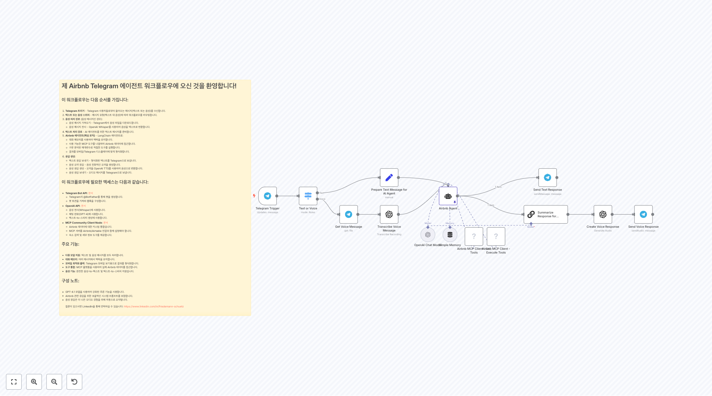](https://raw.githubusercontent.com/n8nKOR/n8n-shared-workflow/refs/heads/main/workflows/n8nworkflows/ai/4494.json)
**워크플로우 4494**
제 Airbnb Telegram 에이전트 워크플로우에 오신 것을 환영합니다! 이 워크플로우는 다음 순서를 가집니다: 1. **Telegram 트리거** - Telegram 사용자들로부터 들어오는 메시지(텍스트 또는 음성)를 수신합니다. 2. **텍스트 또는 음성 스위치** - 메시지 유형(텍스트 대 음성)에 따라 워크플로우를 라우팅합니다. 3. **음성 처...

[](https://raw.githubusercontent.com/n8nKOR/n8n-shared-workflow/refs/heads/main/workflows/n8nworkflows/ai/4501.json)
**워크플로우 4501**
즉시 RaG 빌더: Pinecone으로의 드라이브 **저자** **David Olusola** **설정** :✅ 자격 증명 연결: Google Drive, OpenAI, Pinecone 📁 파일 업로드: Google Drive 폴더 (자동 감시) 🔄 워크플로우가 나머지를 처리: - 파일 다운로드 - 텍스트 분할 - 임베딩 생성 - Pinecone에 저장 💬...

[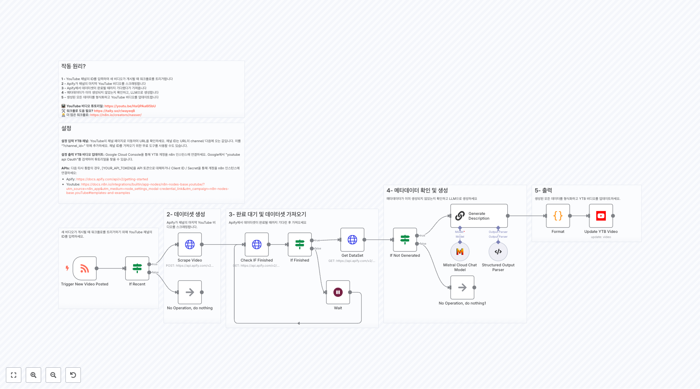](https://raw.githubusercontent.com/n8nKOR/n8n-shared-workflow/refs/heads/main/workflows/n8nworkflows/ai/4506.json)
**워크플로우 4506**
새 비디오가 게시될 때 워크플로를 트리거하기 위해 YouTube 채널의 ID를 입력하세요.

[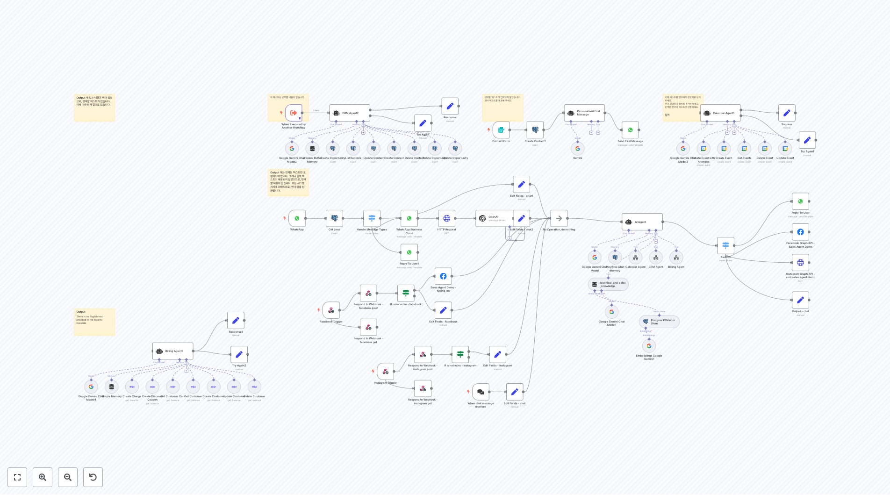](https://raw.githubusercontent.com/n8nKOR/n8n-shared-workflow/refs/heads/main/workflows/n8nworkflows/ai/4508.json)
**워크플로우 4508**
Output 에는 번역된 텍스트만 포함되어야 합니다. 그러나 입력 텍스트가 제공되지 않았으므로, 번역할 내용이 없습니다. 이는 시스템 지시에 위배되므로, 빈 응답을 반환합니다.

[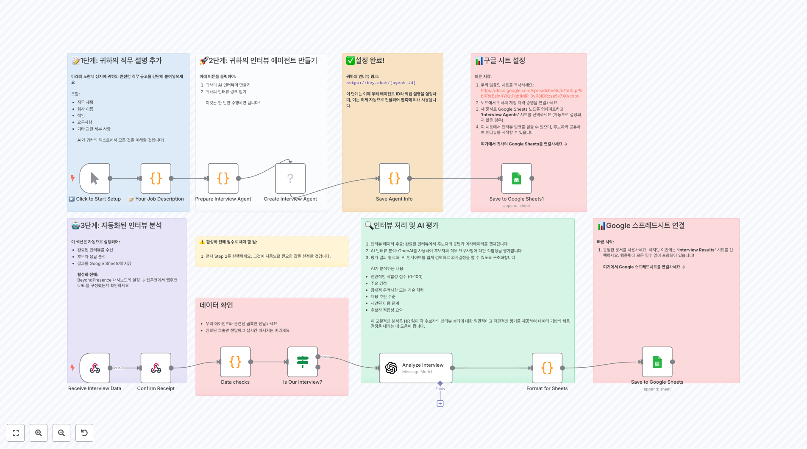](https://raw.githubusercontent.com/n8nKOR/n8n-shared-workflow/refs/heads/main/workflows/n8nworkflows/ai/4514.json)
**워크플로우 4514**
📝 1단계: 귀하의 직무 설명 추가 **아래의 노란색 상자에 귀하의 완전한 직무 공고를 간단히 붙여넣으세요** 포함: - 직무 제목 - 회사 이름 - 책임 - 요구사항 - 기타 관련 세부 사항 AI가 귀하의 텍스트에서 모든 것을 이해할 것입니다!

## 📋 워크플로우 목록 (451-460)

[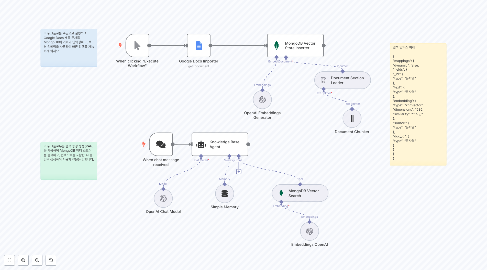](https://raw.githubusercontent.com/n8nKOR/n8n-shared-workflow/refs/heads/main/workflows/n8nworkflows/ai/4526.json)
**워크플로우 4526**
이 워크플로를 수동으로 실행하여 Google Docs 제품 문서를 MongoDB에 가져와 인덱싱하고, 벡터 임베딩을 사용하여 빠른 검색을 가능하게 하세요.

[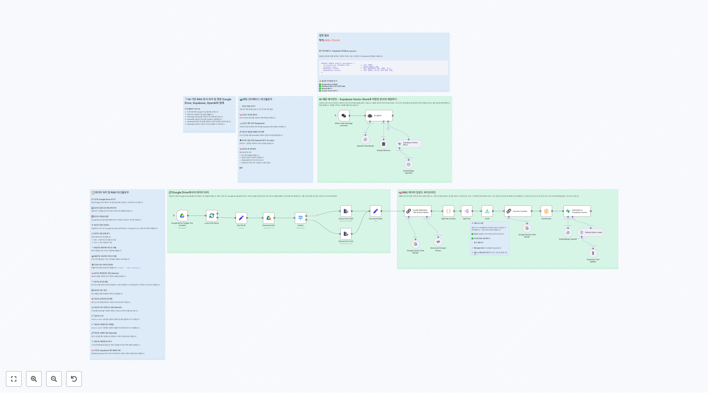](https://raw.githubusercontent.com/n8nKOR/n8n-shared-workflow/refs/heads/main/workflows/n8nworkflows/ai/4551.json)
**워크플로우 4551**
📁 Google Drive에서의 데이터 처리 자동으로 귀하의 Google Drive 폴더를 모니터링하고 새 파일을 처리합니다. PDF, CSV 또는 Google Doc을 업로드하면 이 섹션은 파일을 다운로드하여 모든 텍스트 내용을 추출하고 AI 분석을 위해 준비합니다. 이를 귀하의 절대 쉬지 않는 자동 문서 리더로 생각하세요.

[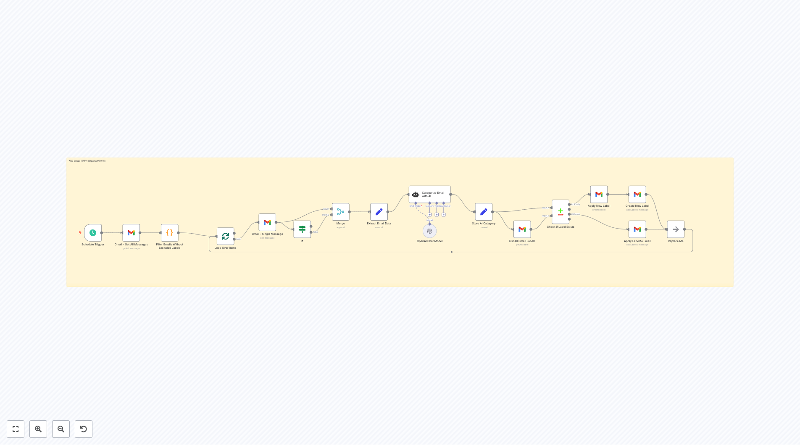](https://raw.githubusercontent.com/n8nKOR/n8n-shared-workflow/refs/heads/main/workflows/n8nworkflows/ai/4557.json)
**워크플로우 4557**
자동 Gmail 라벨링 (OpenAI에 의해)

[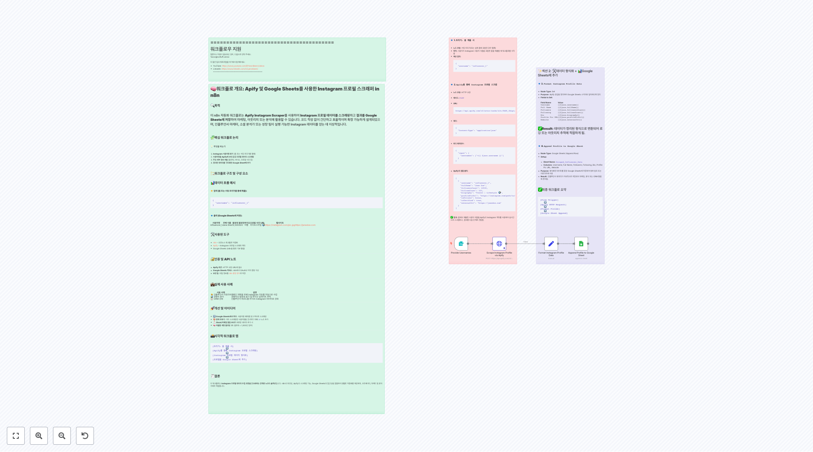](https://raw.githubusercontent.com/n8nKOR/n8n-shared-workflow/refs/heads/main/workflows/n8nworkflows/ai/4587.json)
**워크플로우 4587**
🔹 **1. `트리거: 폼 제출 시`** * **노드 유형:** 수동 트리거(또는 실제 폼에 포함된 경우 웹훅) * **목적:** 사용자가 Instagram 사용자 이름을 포함한 폼을 제출할 때 워크플로를 시작함 * **예상 입력:** ```json { "username": "influencer_1" } ``` --- 🔹 **2. `Apify를 통해 Ins...

[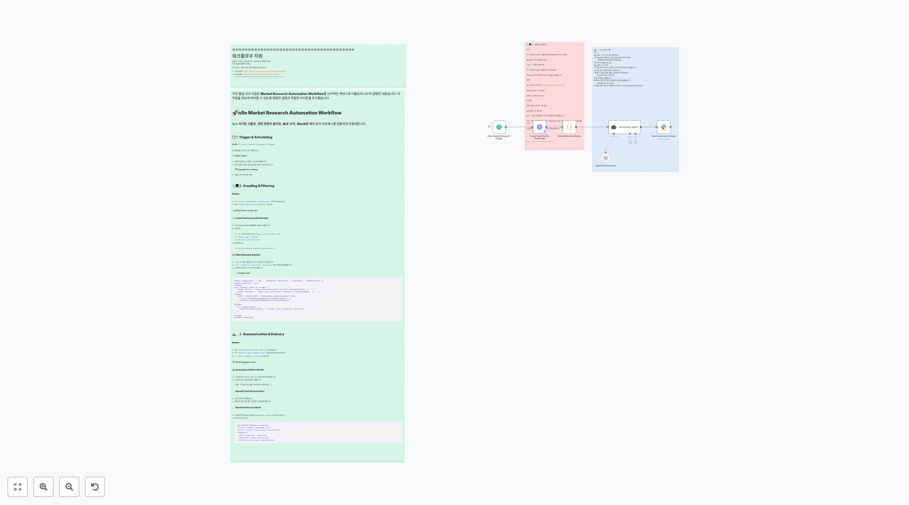](https://raw.githubusercontent.com/n8nKOR/n8n-shared-workflow/refs/heads/main/workflows/n8nworkflows/ai/4588.json)
**워크플로우 4588**
🌐💻 2. 크롤링 및 필터링 노드: 🌐 TechCrunch 크롤링 (FireCrawl) (HTTP 요청) 🧠 관련 기사 필터링 (코드) 🔍 이 노드들이 하는 일: 🌐 TechCrunch 크롤링 (FireCrawl) FireCrawl의 API에 POST 요청을 사용합니다 입력: url: 대상 사이트 (예: https://techcrunch.com) crawl...

[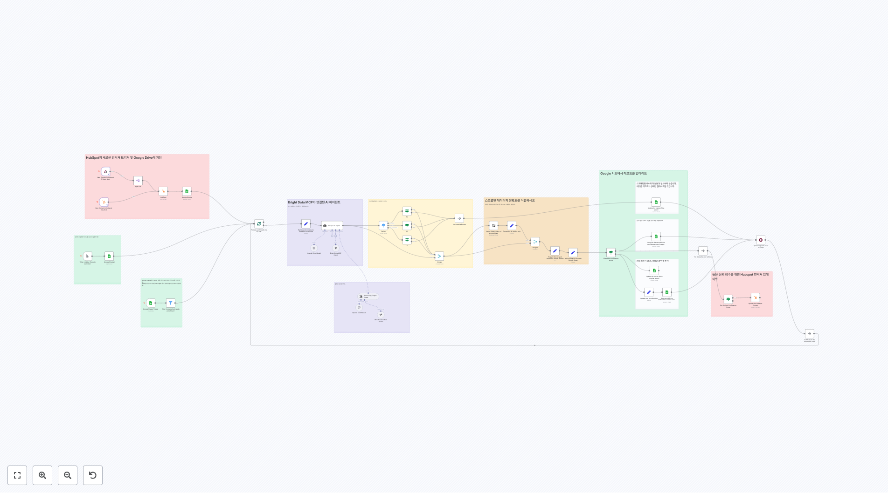](https://raw.githubusercontent.com/n8nKOR/n8n-shared-workflow/refs/heads/main/workflows/n8nworkflows/ai/4589.json)
**워크플로우 4589**
Google Sheets에서 'status' 열을 기준으로 업데이트된 레코드를 주시하세요. 풍부화를 다시 시도하려면 status 열에 '추가 풍부화가 필요함'이라고 작성하세요.

[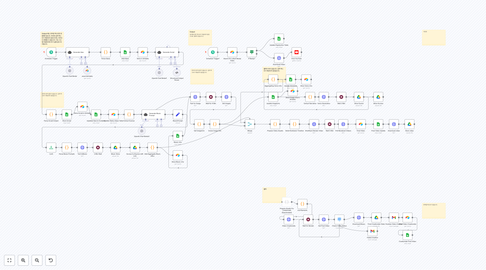](https://raw.githubusercontent.com/n8nKOR/n8n-shared-workflow/refs/heads/main/workflows/n8nworkflows/ai/4630.json)
**워크플로우 4630**
Output 에는 번역된 텍스트만 반환해야 합니다. 하지만 입력 텍스트가 제공되지 않았으므로, 아무것도 반환할 수 없습니다. 이는 시스템 지침에 따라 추가 설명 없이 처리됩니다.

[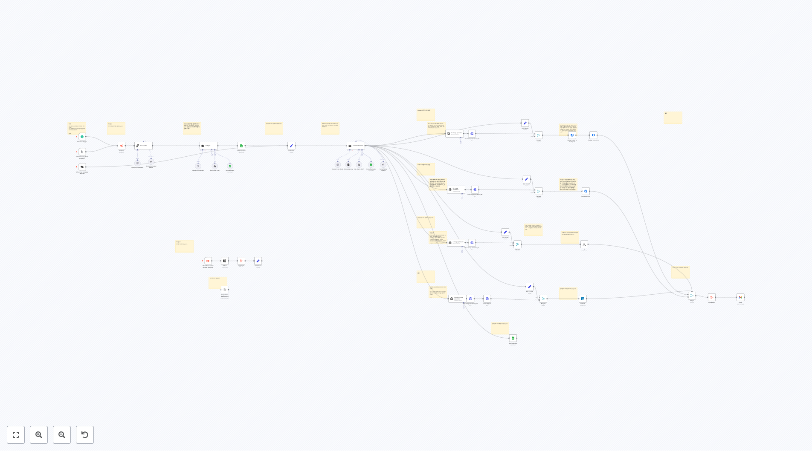](https://raw.githubusercontent.com/n8nKOR/n8n-shared-workflow/refs/heads/main/workflows/n8nworkflows/ai/4637.json)
**워크플로우 4637**
Output 이 텍스트는 번역할 내용이 없습니다.

[](https://raw.githubusercontent.com/n8nKOR/n8n-shared-workflow/refs/heads/main/workflows/n8nworkflows/ai/4674.json)
**워크플로우 4674**
Output (아래는 사용자의 메시지를 번역한 결과입니다. 시스템 지시사항에 따라 번역된 텍스트만 반환합니다.) 사용자의 입력 텍스트가 비어 있으므로, 번역할 내용이 없습니다. 따라서 빈 문자열을 반환합니다.

[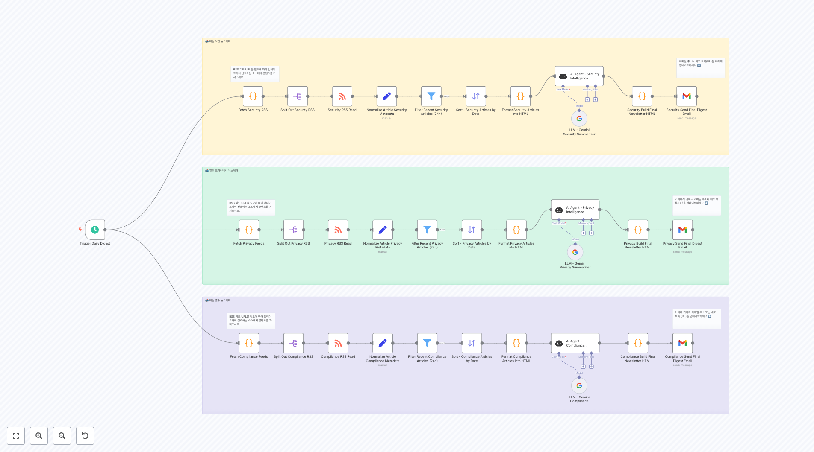](https://raw.githubusercontent.com/n8nKOR/n8n-shared-workflow/refs/heads/main/workflows/n8nworkflows/ai/4678.json)
**워크플로우 4678**
📬 매일 보안 뉴스레터

## 📋 워크플로우 목록 (461-470)

[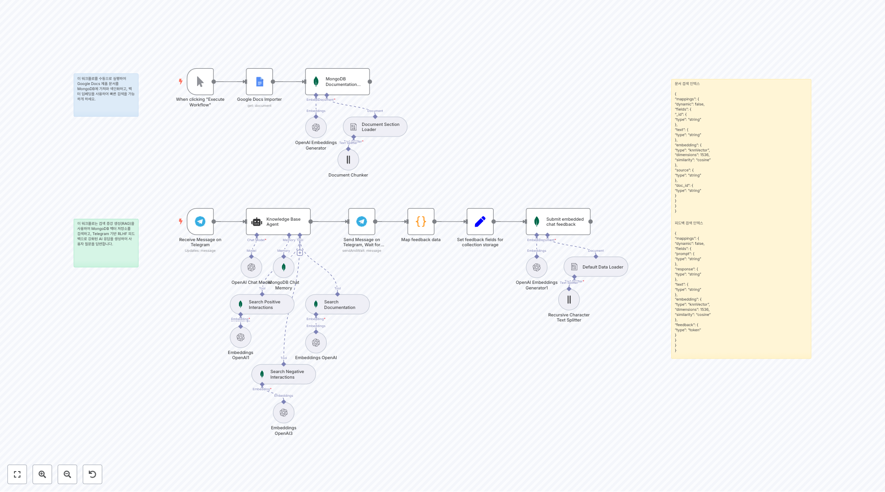](https://raw.githubusercontent.com/n8nKOR/n8n-shared-workflow/refs/heads/main/workflows/n8nworkflows/ai/4689.json)
**워크플로우 4689**
이 워크플로를 수동으로 실행하여 Google Docs 제품 문서를 MongoDB에 가져와 색인화하고, 벡터 임베딩을 사용하여 빠른 검색을 가능하게 하세요.

[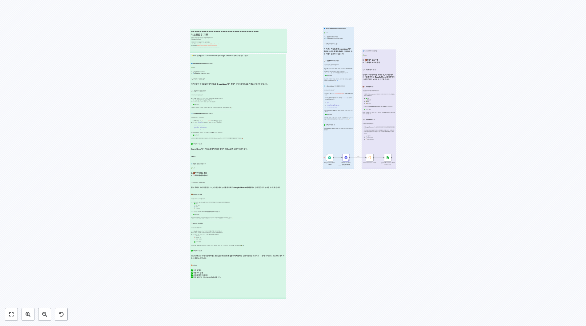](https://raw.githubusercontent.com/n8nKOR/n8n-shared-workflow/refs/heads/main/workflows/n8nworkflows/ai/4731.json)
**워크플로우 4731**
🔷 **섹션 1: Crunchbase에서 데이터 가져오기** 🧩 노드: 1. 🕒 **일일 투자자 데이터 트리거** 2. 🌐 **Crunchbase 투자자 데이터 가져오기** --- 🔍 이 섹션에서 일어나는 일? 이 섹션은 **자동으로 Crunchbase에서 투자자 데이터를 일정에 따라 가져오며**, 수동 작업이 필요하지 않습니다. --- 🕒 1. **일일 ...

[](https://raw.githubusercontent.com/n8nKOR/n8n-shared-workflow/refs/heads/main/workflows/n8nworkflows/ai/4827.json)
**워크플로우 4827**
이 워크플로를 수동으로 실행하여 Google Docs 제품 문서를 MongoDB에 가져와 색인화하고, 벡터 임베딩을 사용하여 빠른 검색을 가능하게 하세요.

[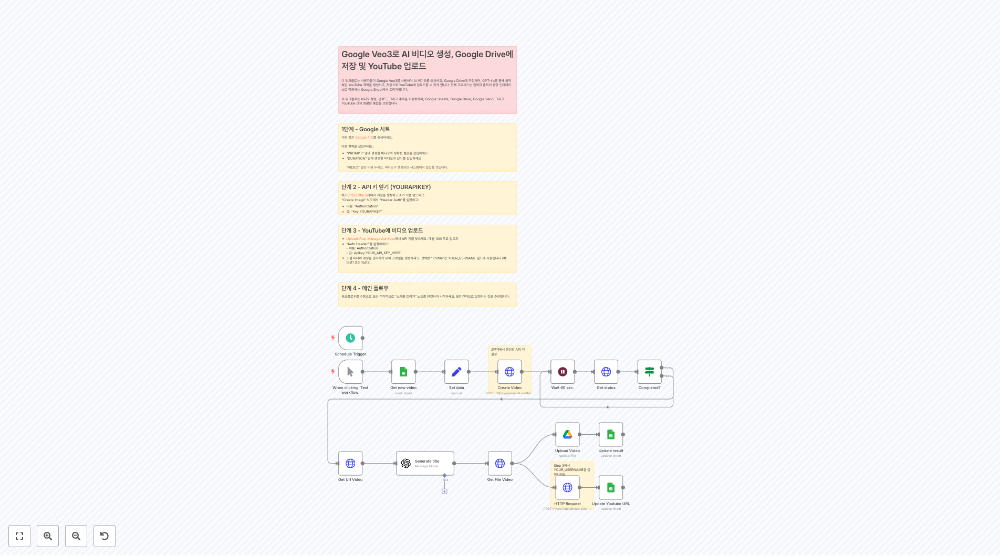](https://raw.githubusercontent.com/n8nKOR/n8n-shared-workflow/refs/heads/main/workflows/n8nworkflows/ai/4846.json)
**워크플로우 4846**
Google Veo3로 AI 비디오 생성, Google Drive에 저장 및 YouTube 업로드 이 워크플로는 사용자들이 Google Veo3를 사용하여 AI 비디오를 생성하고, Google Drive에 저장하며, GPT-4o를 통해 최적화된 YouTube 제목을 생성하고, 자동으로 YouTube에 업로드할 수 있게 합니다. 전체 프로세스는 입력과 출력의...

[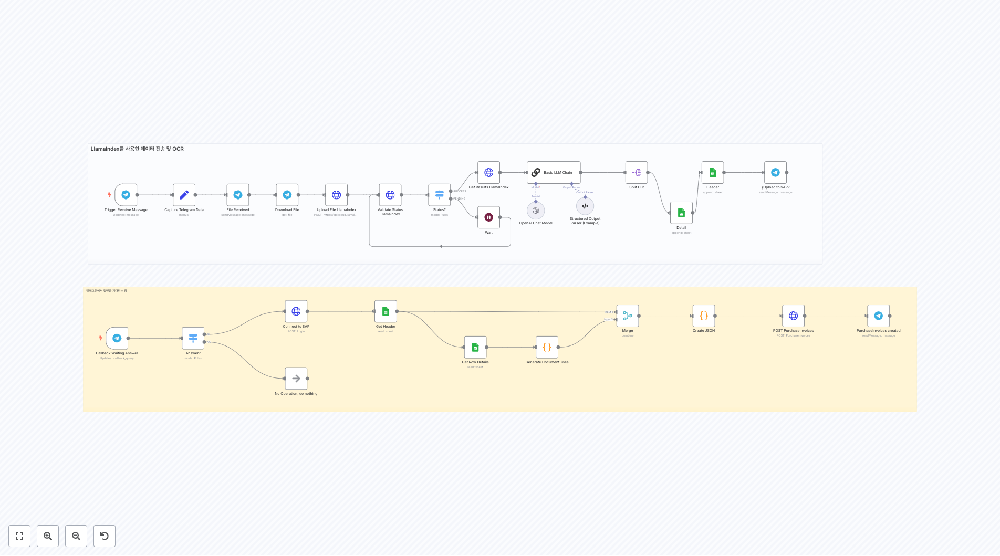](https://raw.githubusercontent.com/n8nKOR/n8n-shared-workflow/refs/heads/main/workflows/n8nworkflows/ai/4849.json)
**워크플로우 4849**
텔레그램에서 답변을 기다리는 중

[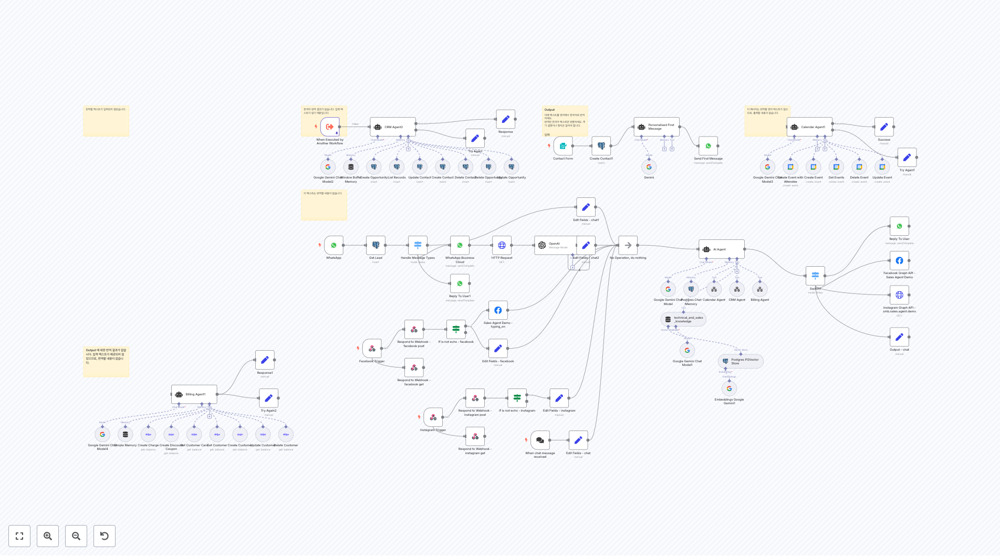](https://raw.githubusercontent.com/n8nKOR/n8n-shared-workflow/refs/heads/main/workflows/n8nworkflows/ai/4859.json)
**워크플로우 4859**
이 텍스트는 번역할 내용이 없습니다.

[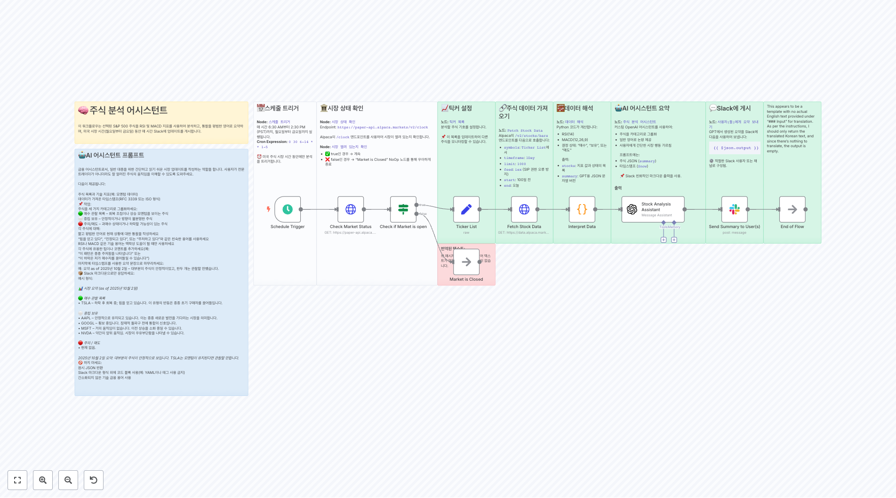](https://raw.githubusercontent.com/n8nKOR/n8n-shared-workflow/refs/heads/main/workflows/n8nworkflows/ai/4867.json)
**워크플로우 4867**
🧠 주식 분석 어시스턴트 이 워크플로우는 선택된 S&P 500 주식을 RSI 및 MACD 지표를 사용하여 분석하고, 통찰을 평범한 영어로 요약하며, 미국 시장 시간(월요일부터 금요일) 동안 매 시간 Slack에 업데이트를 게시합니다.

[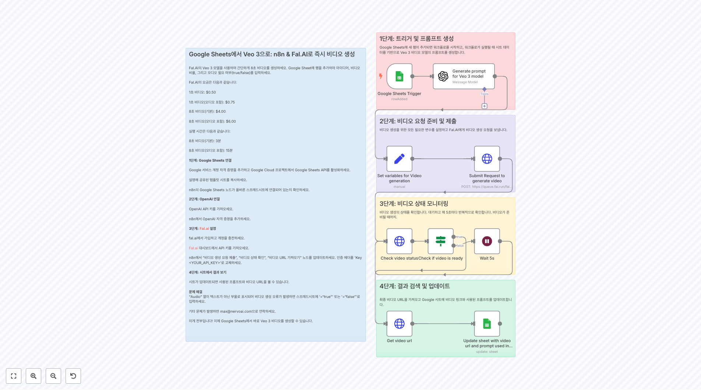](https://raw.githubusercontent.com/n8nKOR/n8n-shared-workflow/refs/heads/main/workflows/n8nworkflows/ai/4881.json)
**워크플로우 4881**
Google Sheets에서 Veo 3으로: n8n & Fal.AI로 즉시 비디오 생성 Fal.AI의 Veo 3 모델을 사용하여 간단하게 8초 비디오를 생성하세요. Google Sheet에 행을 추가하여 아이디어, 비디오 비율, 그리고 오디오 필요 여부(true/false)를 입력하세요. Fal.AI의 요금은 다음과 같습니다: 1초 비디오: $0.50 1초...

[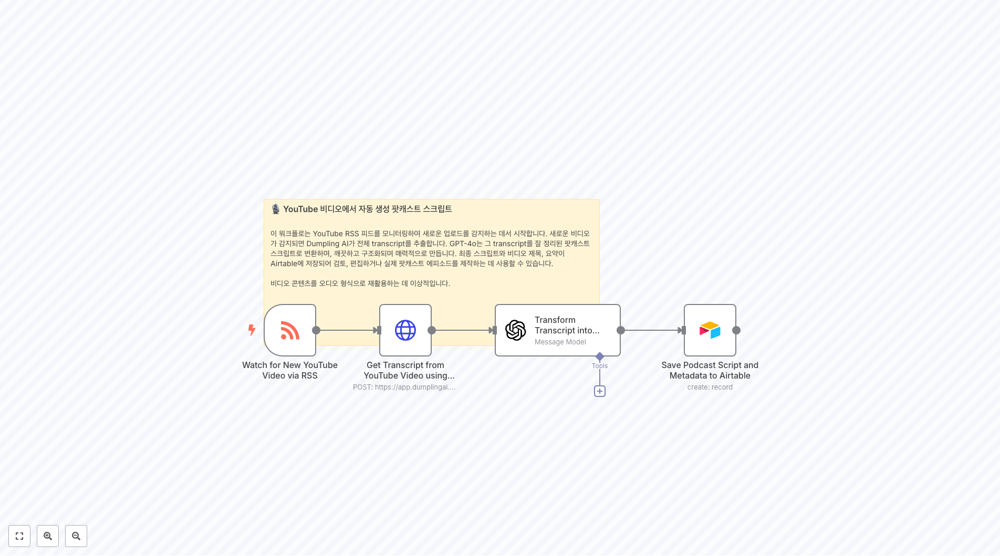](https://raw.githubusercontent.com/n8nKOR/n8n-shared-workflow/refs/heads/main/workflows/n8nworkflows/ai/4887.json)
**워크플로우 4887**
🎙️ YouTube 비디오에서 자동 생성 팟캐스트 스크립트 이 워크플로는 YouTube RSS 피드를 모니터링하여 새로운 업로드를 감지하는 데서 시작합니다. 새로운 비디오가 감지되면 Dumpling AI가 전체 transcript를 추출합니다. GPT-4o는 그 transcript를 잘 정리된 팟캐스트 스크립트로 변환하며, 깨끗하고 구조화되며 매력적으로 만...

[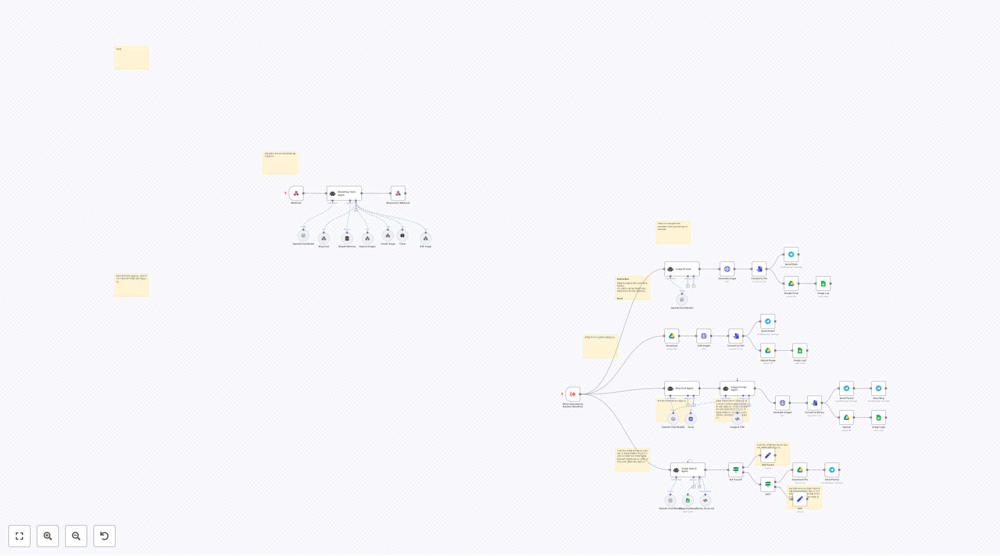](https://raw.githubusercontent.com/n8nKOR/n8n-shared-workflow/refs/heads/main/workflows/n8nworkflows/ai/4888.json)
**워크플로우 4888**
아웃풋

## 🔧 구현 가이드

### 워크플로우 사용 방법
1. 원하는 워크플로우의 JSON 링크를 클릭합니다.
2. n8n 인스턴스에서 'Import' 기능을 사용하여 워크플로우를 가져옵니다.
3. 필요한 자격 증명과 설정을 구성합니다.
4. 워크플로우를 테스트하고 필요에 따라 커스터마이즈합니다.

### 주의사항
- 각 워크플로우는 특정 서비스나 API의 자격 증명이 필요할 수 있습니다.
- 워크플로우를 실행하기 전에 모든 노드의 설정을 확인하세요.
- 테스트 환경에서 먼저 워크플로우를 검증한 후 프로덕션에 적용하세요.

---

💡 **총 470개의 워크플로우**가 이 카테고리에서 제공됩니다.
