# 빌딩 블록 워크플로우

이 폴더에는 building-blocks 관련 **78개의 워크플로우**가 포함되어 있습니다.

## 📋 워크플로우 목록

[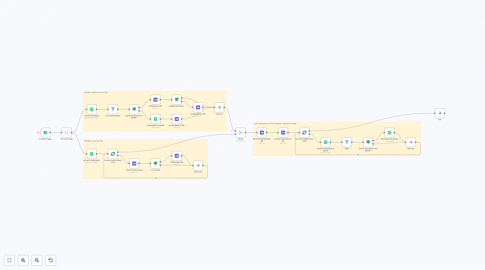](https://raw.githubusercontent.com/n8nKOR/n8n-shared-workflow/refs/heads/main/workflows/n8nworkflows/building-blocks/1074.json)
**워크플로우 1074**
데이터베이스에 노래가 있는지 확인

[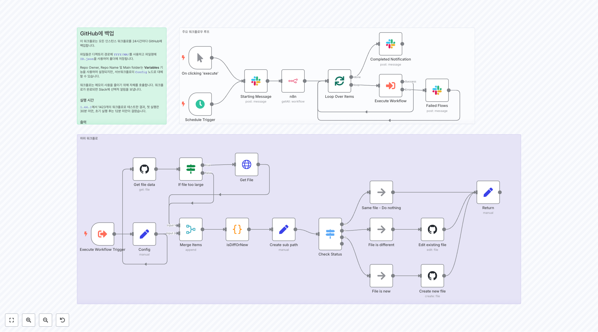](https://raw.githubusercontent.com/n8nKOR/n8n-shared-workflow/refs/heads/main/workflows/n8nworkflows/building-blocks/1534.json)
**워크플로우 1534**
하위 워크플로

[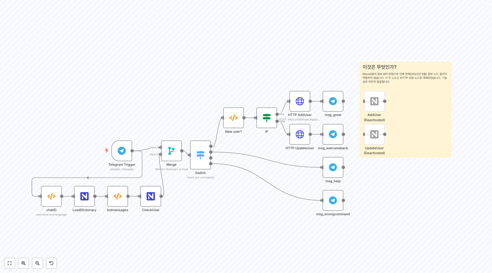](https://raw.githubusercontent.com/n8nKOR/n8n-shared-workflow/refs/heads/main/workflows/n8nworkflows/building-blocks/1583.json)
**워크플로우 1583**
이것은 무엇인가? NocoDB의 일부 API 변경으로 인해 현재(2022년 5월) 일부 노드 옵션이 작동하지 않습니다. 이 두 노드는 HTTP 요청 노드로 대체되었습니다. 기능성은 여전히 동일합니다.

[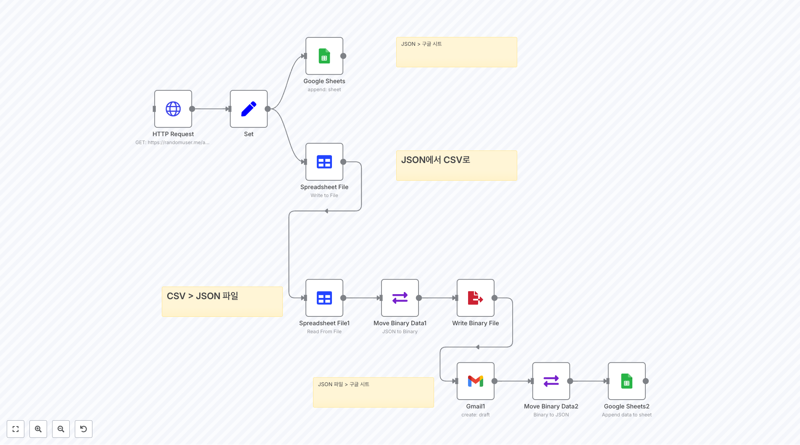](https://raw.githubusercontent.com/n8nKOR/n8n-shared-workflow/refs/heads/main/workflows/n8nworkflows/building-blocks/1739.json)
**워크플로우 1739**
JSON > 구글 시트

**워크플로우 1744**
2. 고급 방법: 표현식 사용 이 `Set` 노드에서, [Luxon expressions](https://docs.n8n.io/code-examples/expressions/luxon/)를 사용하여 다음 형식에 대해 날짜를 설정합니다: 지금 - `{{$now}}` 초 포함 현재 시간 - `{{$now.toLocaleString(DateTime.TIME_WI...

[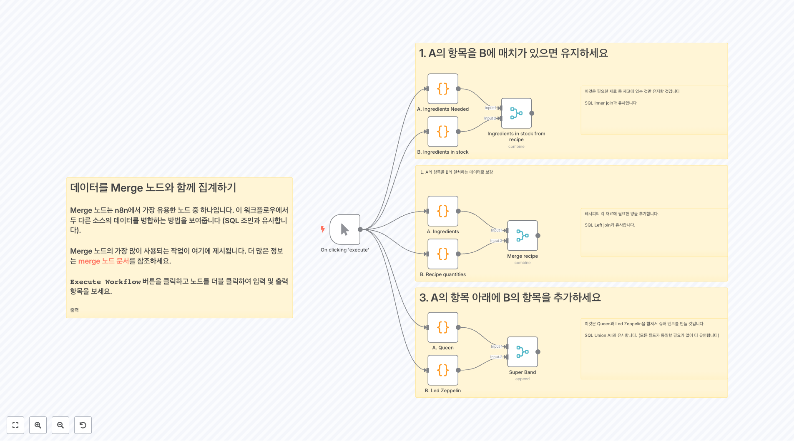](https://raw.githubusercontent.com/n8nKOR/n8n-shared-workflow/refs/heads/main/workflows/n8nworkflows/building-blocks/1747.json)
**워크플로우 1747**
3. A의 항목 아래에 B의 항목을 추가하세요

[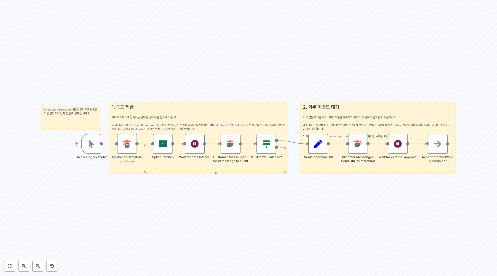](https://raw.githubusercontent.com/n8nKOR/n8n-shared-workflow/refs/heads/main/workflows/n8nworkflows/building-blocks/1749.json)
**워크플로우 1749**
2. 외부 이벤트 대기 이 작업을 워크플로의 나머지 부분을 계속하기 위해 외부 단계가 필요할 때 사용하세요. 예를 들어 - 워크플로가 구매 승인 링크를 상인에게 보낸다 (Gmail, Slack 등 사용) 그리고 상인이 이를 클릭할 때까지 기다린 후 나머지 단계로 계속합니다. 이 예에서, `Customer Messenger` 노드는 이메일 또는 메시징 노드를...

[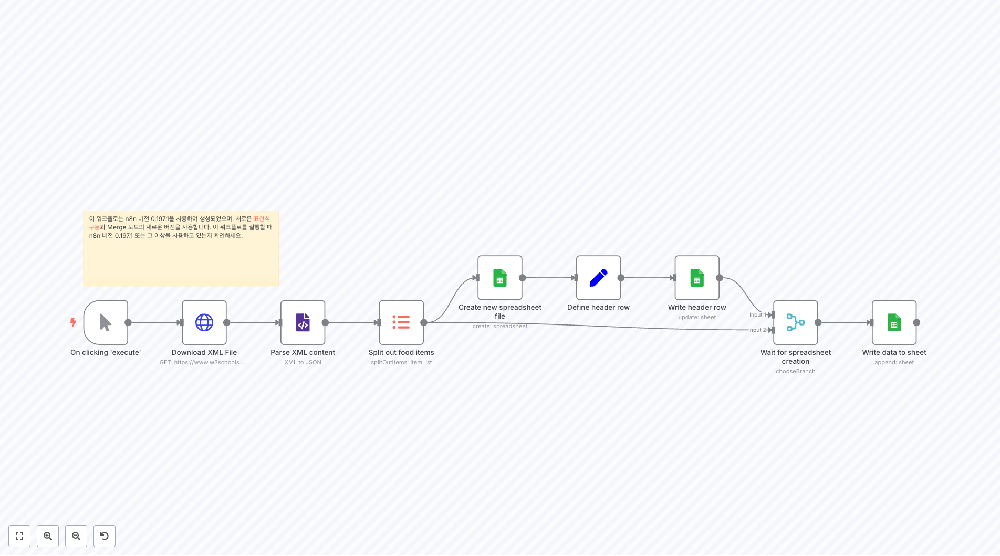](https://raw.githubusercontent.com/n8nKOR/n8n-shared-workflow/refs/heads/main/workflows/n8nworkflows/building-blocks/1810.json)
**워크플로우 1810**
이 워크플로는 n8n 버전 0.197.1을 사용하여 생성되었으며, 새로운 [표현식 구문](https://docs.n8n.io/code-examples/methods-variables-reference/)과 Merge 노드의 새로운 버전을 사용합니다. 이 워크플로를 실행할 때 n8n 버전 0.197.1 또는 그 이상을 사용하고 있는지 확인하세요.

[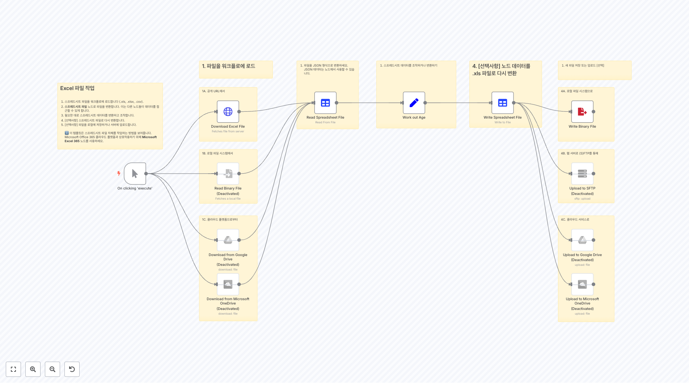](https://raw.githubusercontent.com/n8nKOR/n8n-shared-workflow/refs/heads/main/workflows/n8nworkflows/building-blocks/1826.json)
**워크플로우 1826**
Excel 파일 작업 1. 스프레드시트 파일을 워크플로에 로드합니다 (.xls, .xlsx, .csv). 2. **스프레드시트 파일** 노드로 파일을 변환합니다. 이는 다른 노드들이 데이터를 접근할 수 있게 합니다. 3. 필요한 대로 스프레드시트 데이터를 변환하고 조작합니다. 4. [선택사항] 스프레드시트 파일로 다시 변환합니다. 5. [선택사항] 파일을 ...

[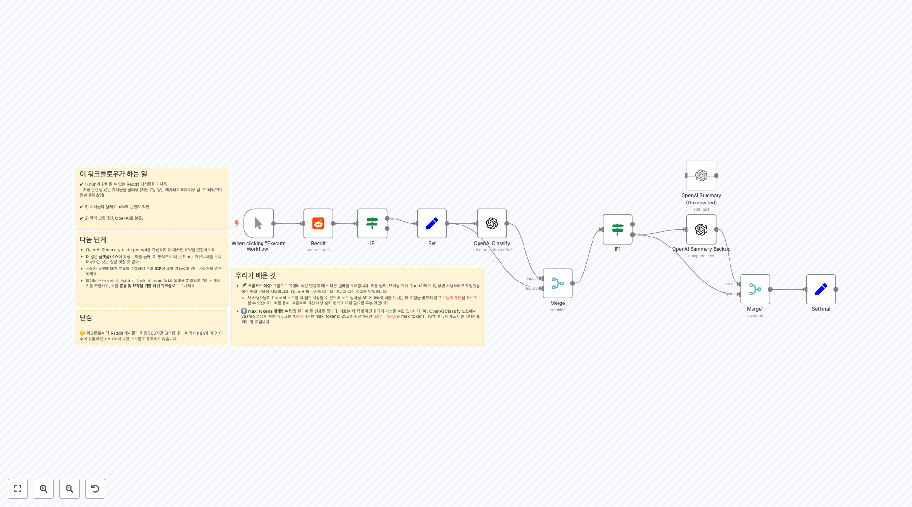](https://raw.githubusercontent.com/n8nKOR/n8n-shared-workflow/refs/heads/main/workflows/n8nworkflows/building-blocks/1895.json)
**워크플로우 1895**
이 워크플로우가 하는 일 1) n8n과 관련될 수 있는 Reddit 게시물을 가져옴 - 가장 관련성 있는 게시물을 필터링 (지난 7일 동안 게시되고 5회 이상 업보트되었으며 원본 콘텐츠임) 2) 게시물이 실제로 n8n에 관한지 확인 3) 만약 그렇다면, OpenAI로 분류.

## 📋 워크플로우 목록 (11-20)

[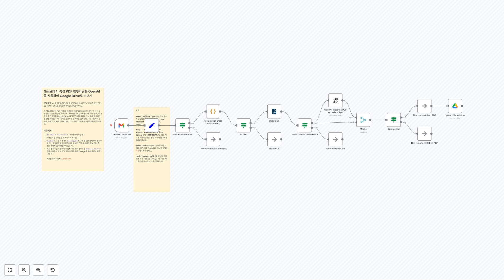](https://raw.githubusercontent.com/n8nKOR/n8n-shared-workflow/refs/heads/main/workflows/n8nworkflows/building-blocks/1897.json)
**워크플로우 1897**
Gmail에서 특정 PDF 첨부파일을 OpenAI를 사용하여 Google Drive로 보내기 _**면책 조항**: 이 워크플로우를 사용할 때 결과가 다양하게 나타날 수 있으므로 OpenAI의 결과를 올바르게 확인할 준비를 하세요._ 이 워크플로우는 PDF 텍스트 내용을 읽어 OpenAI로 전송합니다. 관심 있는 첨부파일은 지정된 Google Drive 폴더...

[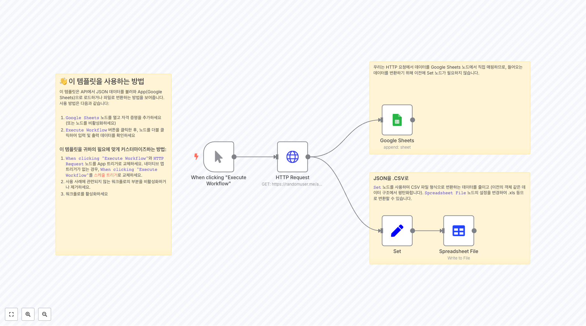](https://raw.githubusercontent.com/n8nKOR/n8n-shared-workflow/refs/heads/main/workflows/n8nworkflows/building-blocks/1933.json)
**워크플로우 1933**
우리는 HTTP 요청에서 데이터를 Google Sheets 노드에서 직접 매핑하므로, 들어오는 데이터를 변환하기 위해 이전에 Set 노드가 필요하지 않습니다.

[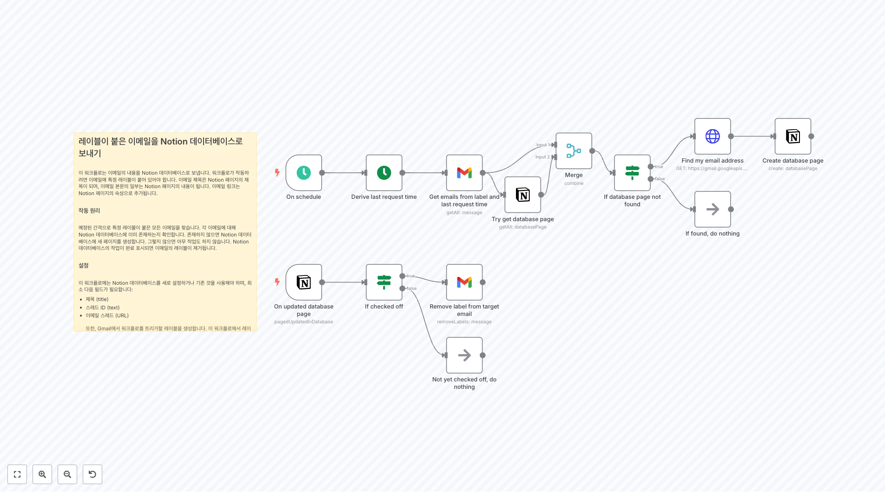](https://raw.githubusercontent.com/n8nKOR/n8n-shared-workflow/refs/heads/main/workflows/n8nworkflows/building-blocks/1939.json)
**워크플로우 1939**
레이블이 붙은 이메일을 Notion 데이터베이스로 보내기 이 워크플로는 이메일의 내용을 Notion 데이터베이스로 보냅니다. 워크플로가 작동하려면 이메일에 특정 레이블이 붙어 있어야 합니다. 이메일 제목은 Notion 페이지의 제목이 되며, 이메일 본문의 일부는 Notion 페이지의 내용이 됩니다. 이메일 링크는 Notion 페이지의 속성으로 추가됩니다. ...

**워크플로우 1953**
수신 이메일이 약속에 관한 것인지 확인 우리는 LLM을 사용하여 이메일의 제목과 본문을 확인하고, 그것이 약속 요청인지 결정합니다.

[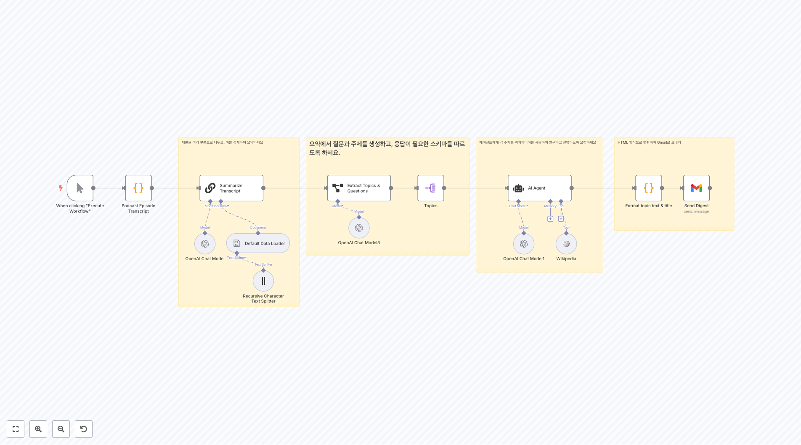](https://raw.githubusercontent.com/n8nKOR/n8n-shared-workflow/refs/heads/main/workflows/n8nworkflows/building-blocks/1956.json)
**워크플로우 1956**
대본을 여러 부분으로 나누고, 이를 정제하여 요약하세요

[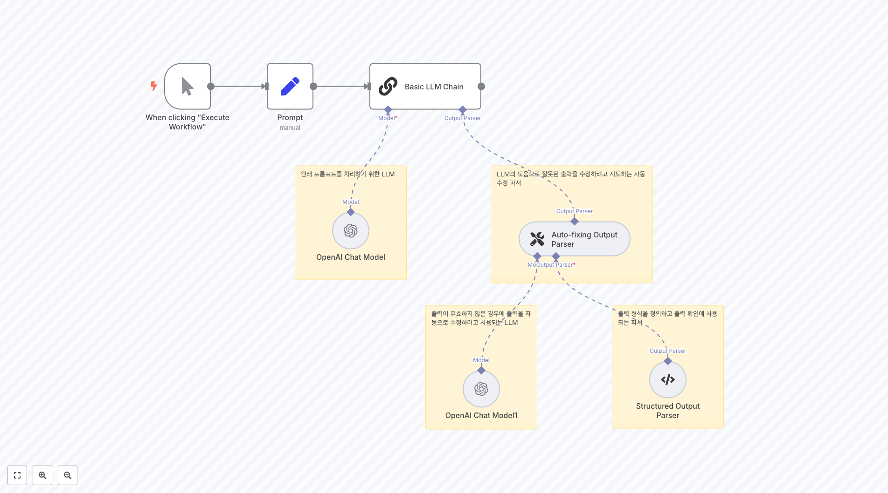](https://raw.githubusercontent.com/n8nKOR/n8n-shared-workflow/refs/heads/main/workflows/n8nworkflows/building-blocks/1957.json)
**워크플로우 1957**
출력 형식을 정의하고 출력 확인에 사용되는 파서

[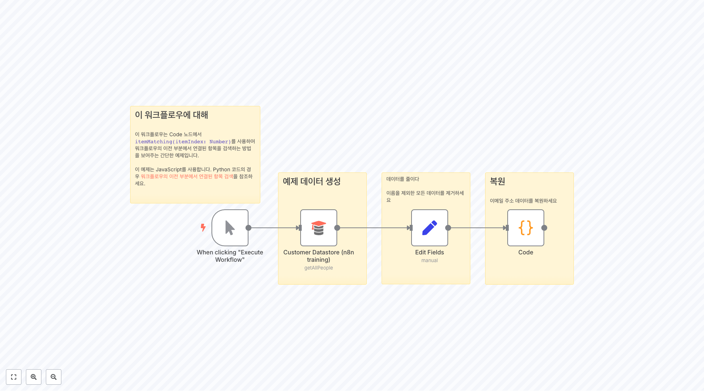](https://raw.githubusercontent.com/n8nKOR/n8n-shared-workflow/refs/heads/main/workflows/n8nworkflows/building-blocks/1966.json)
**워크플로우 1966**
예제 데이터 생성

[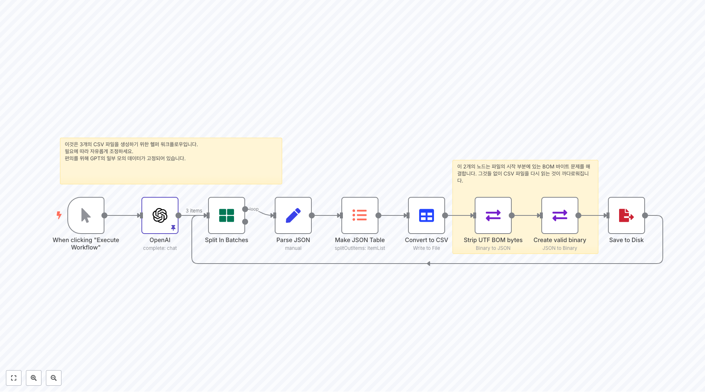](https://raw.githubusercontent.com/n8nKOR/n8n-shared-workflow/refs/heads/main/workflows/n8nworkflows/building-blocks/1967.json)
**워크플로우 1967**
이것은 3개의 CSV 파일을 생성하기 위한 헬퍼 워크플로우입니다. 필요에 따라 자유롭게 조정하세요. 편의를 위해 GPT의 일부 모의 데이터가 고정되어 있습니다.

[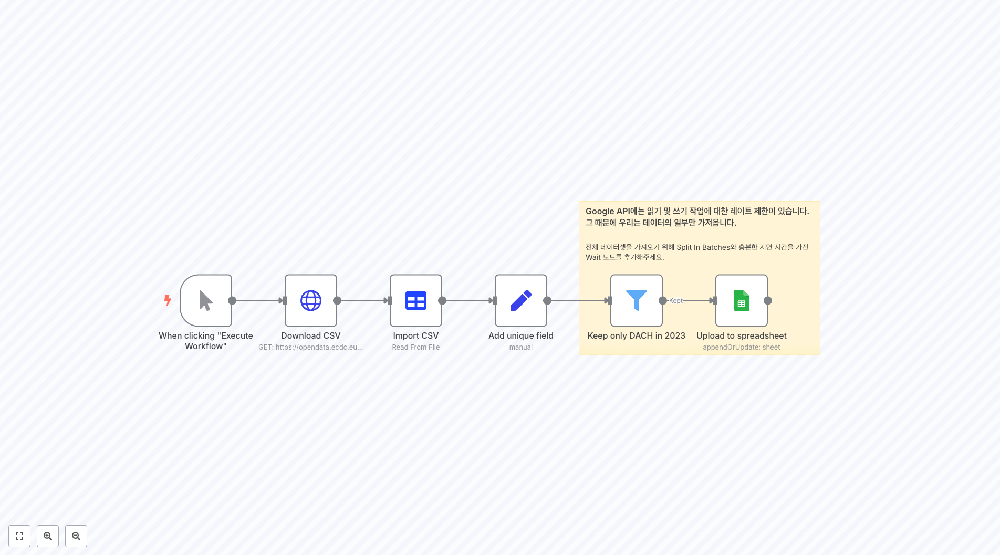](https://raw.githubusercontent.com/n8nKOR/n8n-shared-workflow/refs/heads/main/workflows/n8nworkflows/building-blocks/1969.json)
**워크플로우 1969**
Google API에는 읽기 및 쓰기 작업에 대한 레이트 제한이 있습니다. 그 때문에 우리는 데이터의 일부만 가져옵니다. 전체 데이터셋을 가져오기 위해 Split In Batches와 충분한 지연 시간을 가진 Wait 노드를 추가해주세요.

[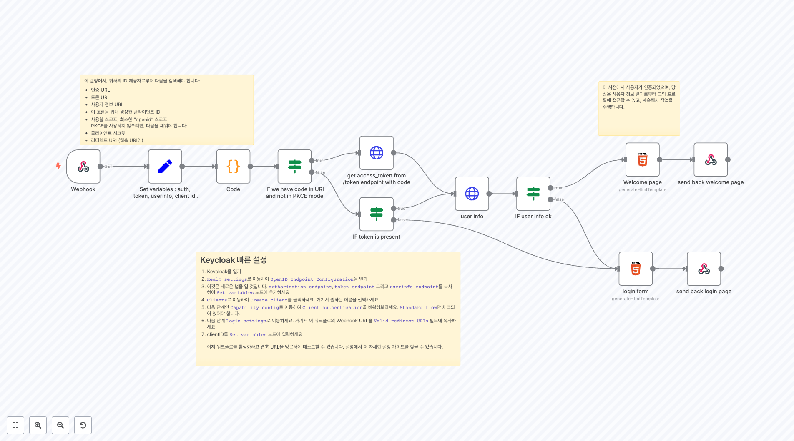](https://raw.githubusercontent.com/n8nKOR/n8n-shared-workflow/refs/heads/main/workflows/n8nworkflows/building-blocks/1997.json)
**워크플로우 1997**
이 설정에서, 귀하의 ID 제공자로부터 다음을 검색해야 합니다: - 인증 URL - 토큰 URL - 사용자 정보 URL - 이 흐름을 위해 생성한 클라이언트 ID - 사용할 스코프, 최소한 "openid" 스코프 PKCE를 사용하지 않으려면, 다음을 채워야 합니다: - 클라이언트 시크릿 - 리디렉트 URI (웹훅 URI임)

## 📋 워크플로우 목록 (21-30)

[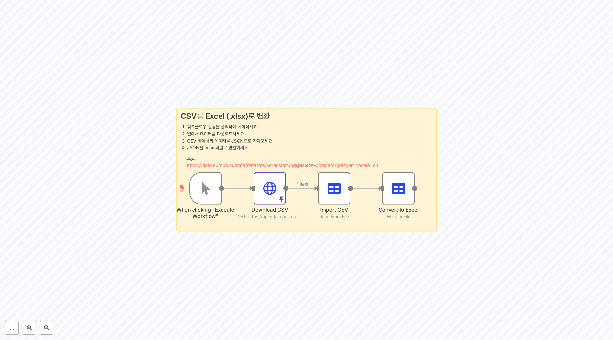](https://raw.githubusercontent.com/n8nKOR/n8n-shared-workflow/refs/heads/main/workflows/n8nworkflows/building-blocks/2041.json)
**워크플로우 2041**
CSV를 Excel (.xlsx)로 변환 1. 워크플로우 실행을 클릭하여 시작하세요 2. 웹에서 데이터를 다운로드하세요 3. CSV 바이너리 데이터를 JSON으로 가져오세요 4. JSON을 .xlsx 파일로 변환하세요 출처: https://data.europa.eu/data/datasets/veranstaltungsplaetze-potsdam-potsdam...

[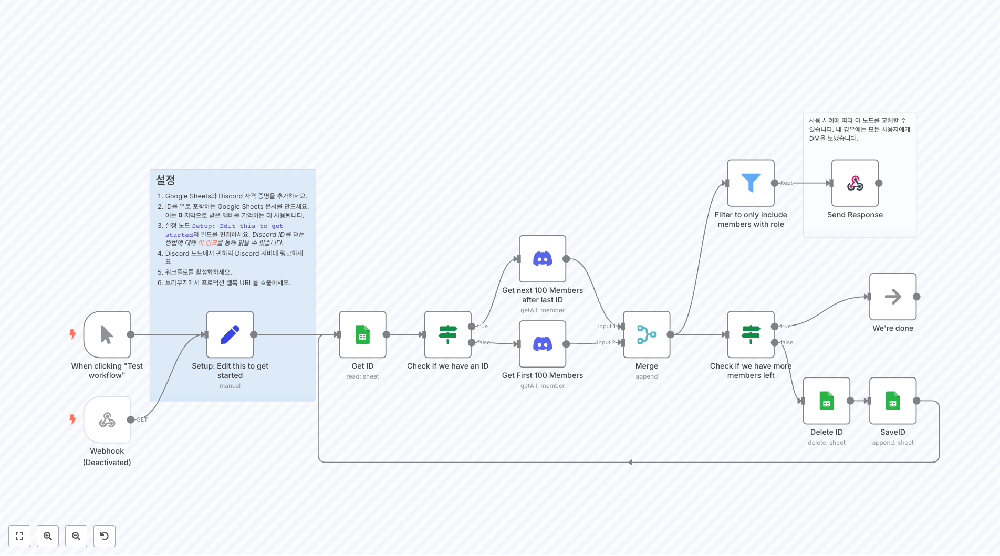](https://raw.githubusercontent.com/n8nKOR/n8n-shared-workflow/refs/heads/main/workflows/n8nworkflows/building-blocks/2105.json)
**워크플로우 2105**
설정 1. Google Sheets와 Discord 자격 증명을 추가하세요. 2. ID를 열로 포함하는 Google Sheets 문서를 만드세요. 이는 마지막으로 받은 멤버를 기억하는 데 사용됩니다. 3. 설정 노드 `Setup: Edit this to get started`의 필드를 편집하세요. *Discord ID를 얻는 방법에 대해 [이 링크](htt...

[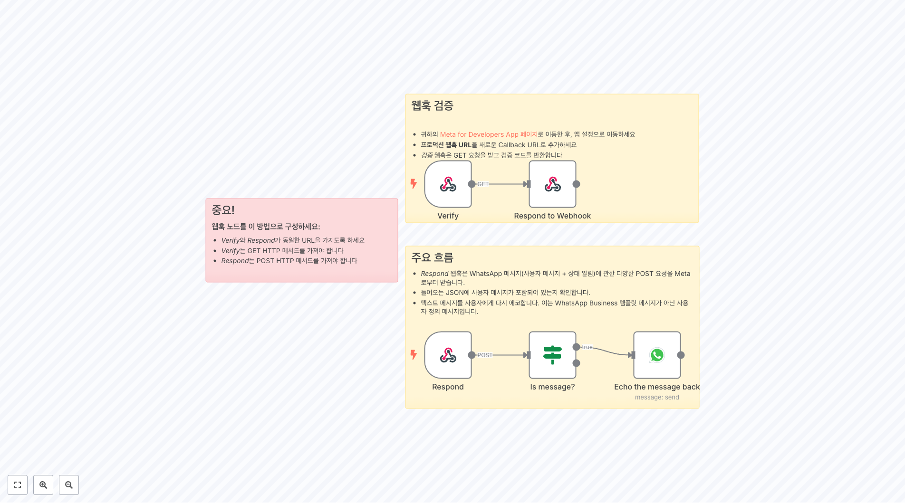](https://raw.githubusercontent.com/n8nKOR/n8n-shared-workflow/refs/heads/main/workflows/n8nworkflows/building-blocks/2162.json)
**워크플로우 2162**
웹훅 검증 * 귀하의 [Meta for Developers App 페이지](https://developers.facebook.com/apps/)로 이동한 후, 앱 설정으로 이동하세요 * **프로덕션 웹훅 URL**을 새로운 Callback URL로 추가하세요 * *검증* 웹훅은 GET 요청을 받고 검증 코드를 반환합니다

[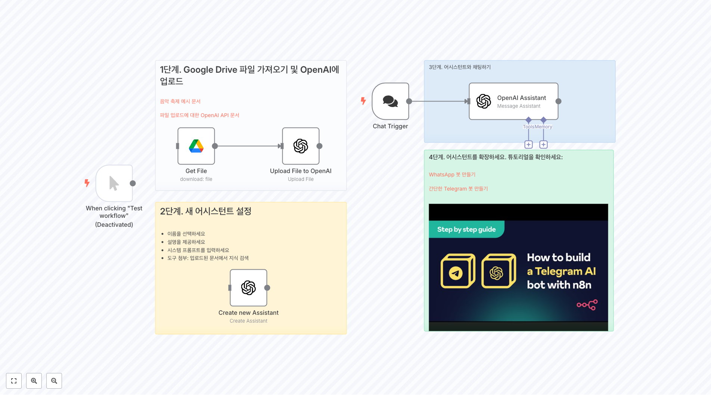](https://raw.githubusercontent.com/n8nKOR/n8n-shared-workflow/refs/heads/main/workflows/n8nworkflows/building-blocks/2201.json)
**워크플로우 2201**
1단계. Google Drive 파일 가져오기 및 OpenAI에 업로드 [음악 축제 예시 문서](https://docs.google.com/document/d/1_miLvjUQJ-E9bWgEBK87nHZre26-4Fz0RpfSfO548H0/edit?usp=sharing) [파일 업로드에 대한 OpenAI API 문서](https://platform.open...

[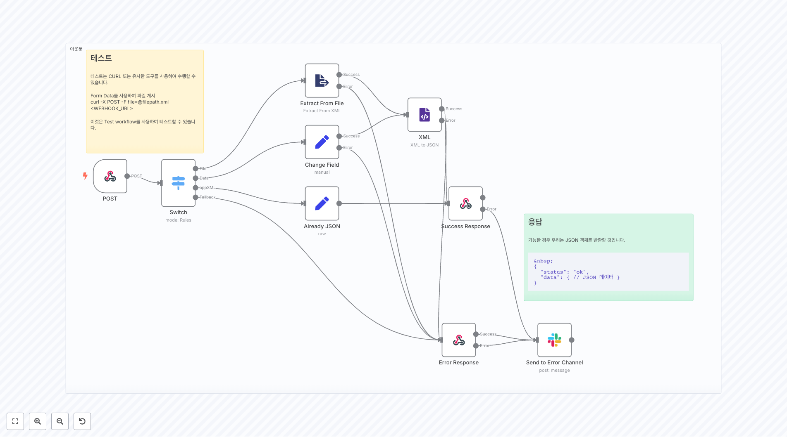](https://raw.githubusercontent.com/n8nKOR/n8n-shared-workflow/refs/heads/main/workflows/n8nworkflows/building-blocks/2222.json)
**워크플로우 2222**
테스트 테스트는 CURL 또는 유사한 도구를 사용하여 수행할 수 있습니다. Form Data를 사용하여 파일 게시 curl -X POST -F file=@filepath.xml 이것은 Test workflow를 사용하여 테스트할 수 있습니다.

[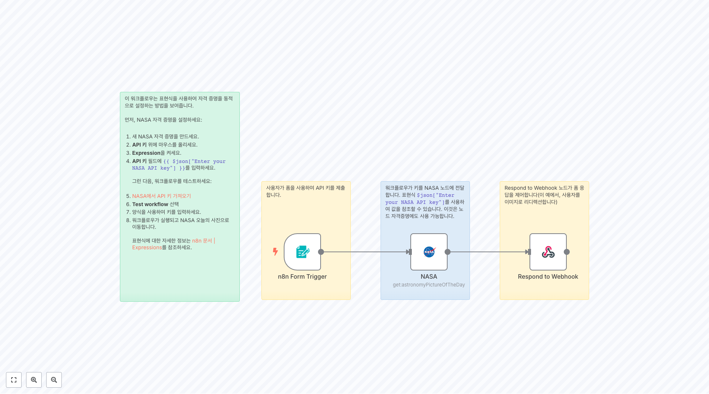](https://raw.githubusercontent.com/n8nKOR/n8n-shared-workflow/refs/heads/main/workflows/n8nworkflows/building-blocks/2223.json)
**워크플로우 2223**
이 워크플로우는 표현식을 사용하여 자격 증명을 동적으로 설정하는 방법을 보여줍니다. 먼저, NASA 자격 증명을 설정하세요: 1. 새 NASA 자격 증명을 만드세요. 1. **API 키** 위에 마우스를 올리세요. 1. **Expression**을 켜세요. 1. **API 키** 필드에 `{{ $json["Enter your NASA API key"] }}...

[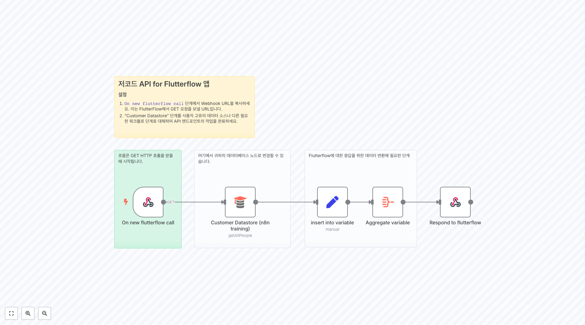](https://raw.githubusercontent.com/n8nKOR/n8n-shared-workflow/refs/heads/main/workflows/n8nworkflows/building-blocks/2274.json)
**워크플로우 2274**
흐름은 GET HTTP 호출을 받을 때 시작됩니다.

[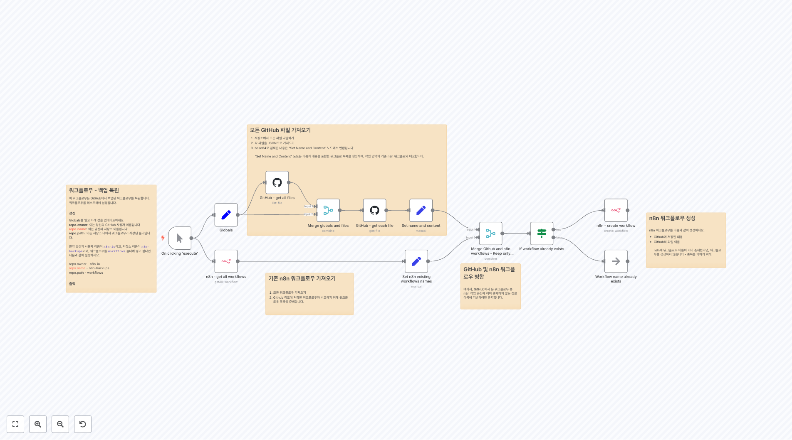](https://raw.githubusercontent.com/n8nKOR/n8n-shared-workflow/refs/heads/main/workflows/n8nworkflows/building-blocks/2289.json)
**워크플로우 2289**
워크플로우 - 백업 복원 이 워크플로우는 GitHub에서 백업된 워크플로우를 복원합니다. 워크플로우를 테스트하여 실행됩니다. 설정 Globals를 열고 아래 값을 업데이트하세요 **repo.owner:** 이는 당신의 GitHub 사용자 이름입니다 **repo.name:** 이는 당신의 저장소 이름입니다 **repo.path:** 이는 저장소 내에서 워크플...

[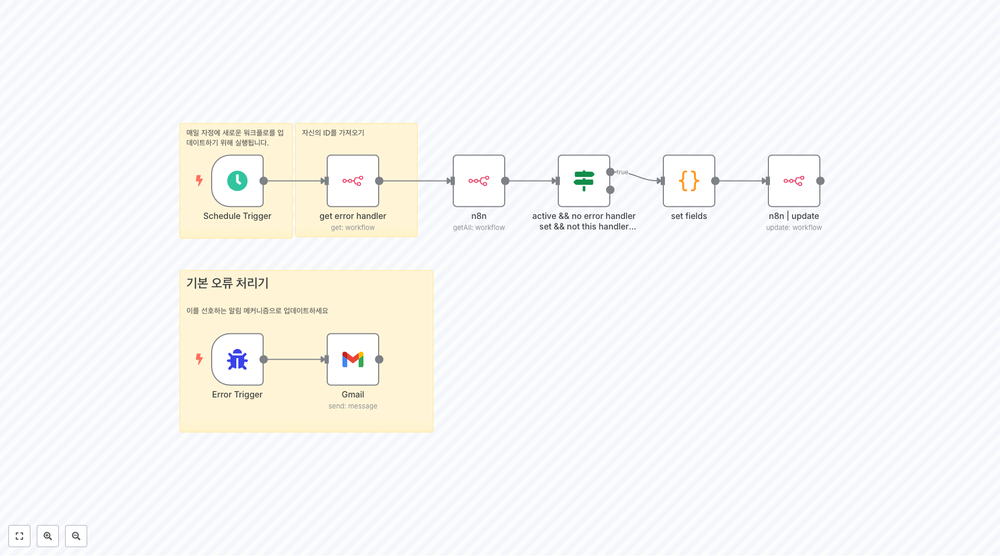](https://raw.githubusercontent.com/n8nKOR/n8n-shared-workflow/refs/heads/main/workflows/n8nworkflows/building-blocks/2312.json)
**워크플로우 2312**
기본 오류 처리기 이를 선호하는 알림 메커니즘으로 업데이트하세요

[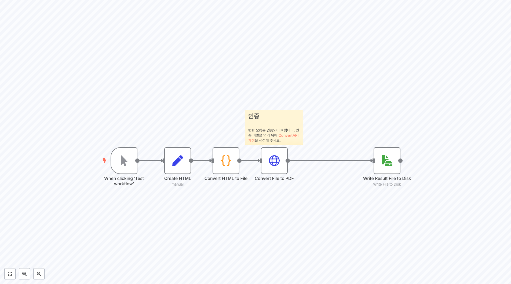](https://raw.githubusercontent.com/n8nKOR/n8n-shared-workflow/refs/heads/main/workflows/n8nworkflows/building-blocks/2314.json)
**워크플로우 2314**
인증 변환 요청은 인증되어야 합니다. 인증 비밀을 얻기 위해 [ConvertAPI 계정](https://www.convertapi.com/a/signin)을 생성해 주세요.

## 📋 워크플로우 목록 (31-40)

[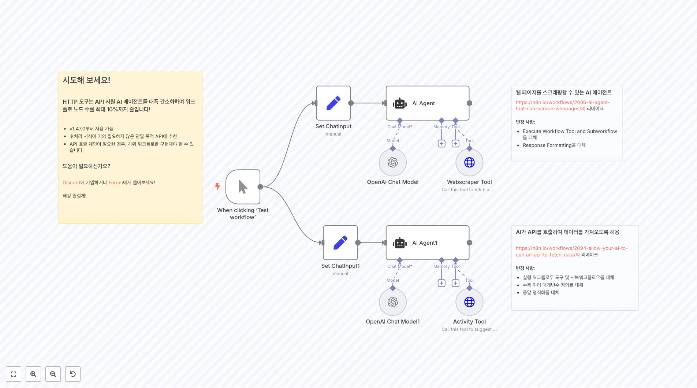](https://raw.githubusercontent.com/n8nKOR/n8n-shared-workflow/refs/heads/main/workflows/n8nworkflows/building-blocks/2343.json)
**워크플로우 2343**
웹 페이지를 스크래핑할 수 있는 AI 에이전트 https://n8n.io/workflows/2006-ai-agent-that-can-scrape-webpages/의 리메이크 **변경 사항**: * Execute Workflow Tool and Subworkflow를 대체 * Response Formatting을 대체

[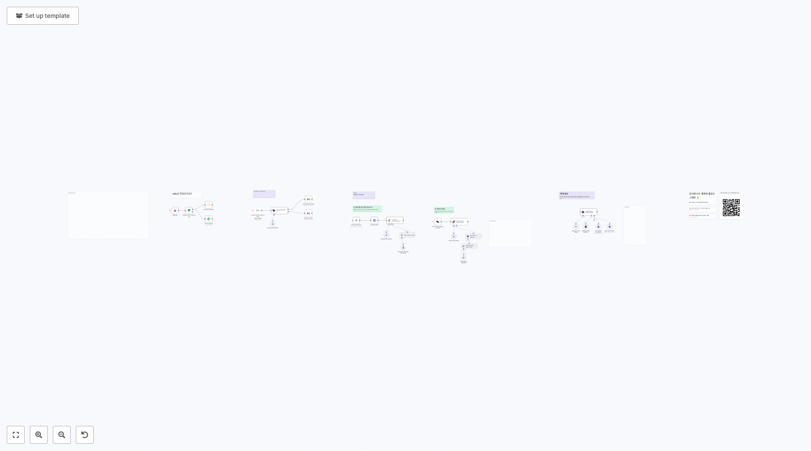](https://raw.githubusercontent.com/n8nKOR/n8n-shared-workflow/refs/heads/main/workflows/n8nworkflows/building-blocks/2358.json)
**워크플로우 2358**
슬라이드 SF 토크

[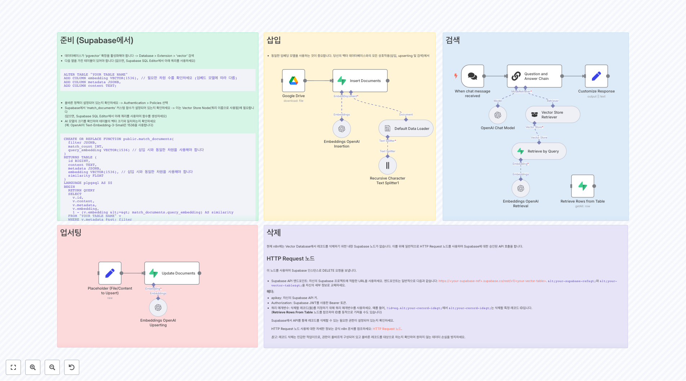](https://raw.githubusercontent.com/n8nKOR/n8n-shared-workflow/refs/heads/main/workflows/n8nworkflows/building-blocks/2395.json)
**워크플로우 2395**
삽입 - 동일한 임베딩 모델을 사용하는 것이 중요합니다. 당신의 벡터 데이터베이스와의 모든 상호작용(삽입, upserting 및 검색)에서

[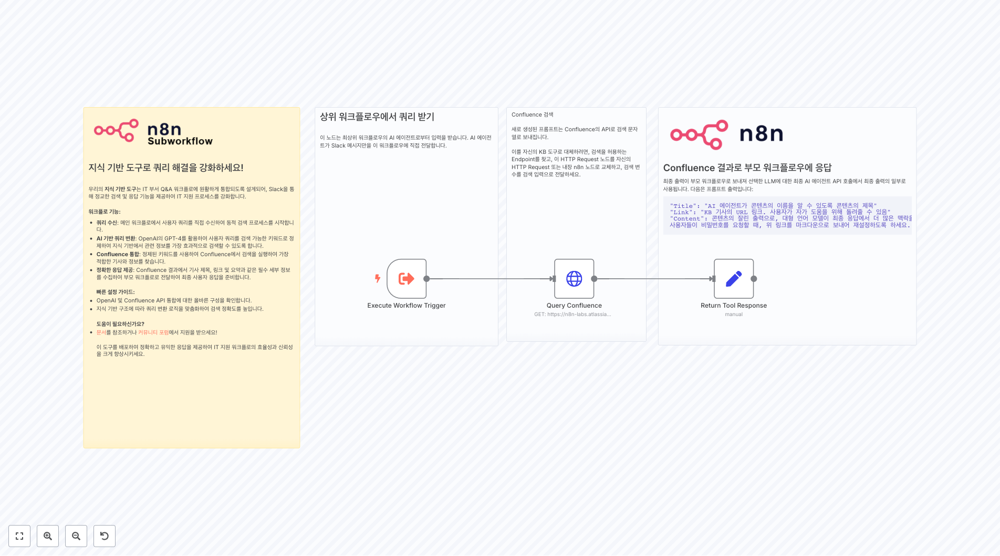](https://raw.githubusercontent.com/n8nKOR/n8n-shared-workflow/refs/heads/main/workflows/n8nworkflows/building-blocks/2398.json)
**워크플로우 2398**
상위 워크플로우에서 쿼리 받기 이 노드는 최상위 워크플로우의 AI 에이전트로부터 입력을 받습니다. AI 에이전트가 Slack 메시지만을 이 워크플로우에 직접 전달합니다.

[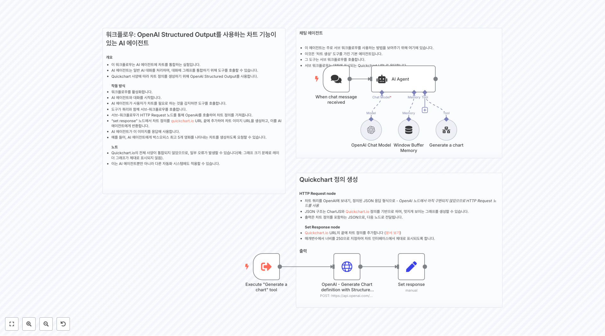](https://raw.githubusercontent.com/n8nKOR/n8n-shared-workflow/refs/heads/main/workflows/n8nworkflows/building-blocks/2400.json)
**워크플로우 2400**
워크플로우: OpenAI Structured Output를 사용하는 차트 기능이 있는 AI 에이전트 **개요** - 이 워크플로우는 AI 에이전트에 차트를 통합하는 실험입니다. - AI 에이전트는 일반 AI 대화를 처리하며, 대화에 그래프를 통합하기 위해 도구를 호출할 수 있습니다. - Quickchart 사양에 따라 차트 정의를 생성하기 위해 OpenAI...

[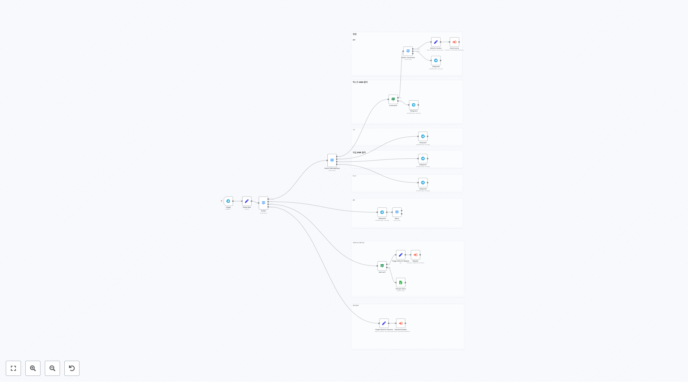](https://raw.githubusercontent.com/n8nKOR/n8n-shared-workflow/refs/heads/main/workflows/n8nworkflows/building-blocks/2402.json)
**워크플로우 2402**
콜백

[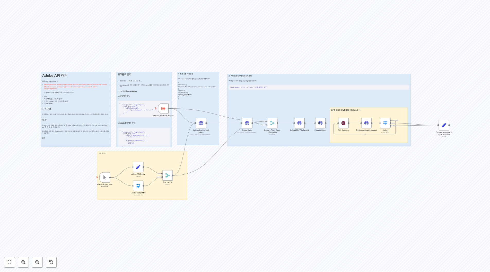](https://raw.githubusercontent.com/n8nKOR/n8n-shared-workflow/refs/heads/main/workflows/n8nworkflows/building-blocks/2424.json)
**워크플로우 2424**
Adobe API 래퍼 Adobe 문서를 참조하세요: - https://developer.adobe.com/document-services/docs/overview/pdf-services-api/howtos/ - https://developer.adobe.com/document-services/docs/overview/pdf-extract-api/getti...

[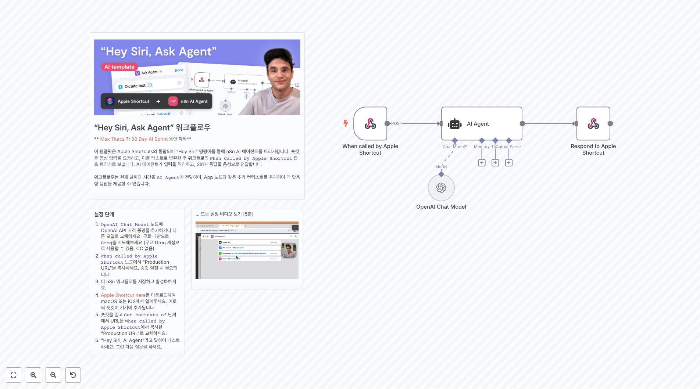](https://raw.githubusercontent.com/n8nKOR/n8n-shared-workflow/refs/heads/main/workflows/n8nworkflows/building-blocks/2436.json)
**워크플로우 2436**
 "Hey Siri, Ask Agent" 워크플로우 ** [Max Tkacz](https://www.linkedin.com/in/maxtkacz) 가 [30 Day AI Sprint](https://30dayaisprint....

[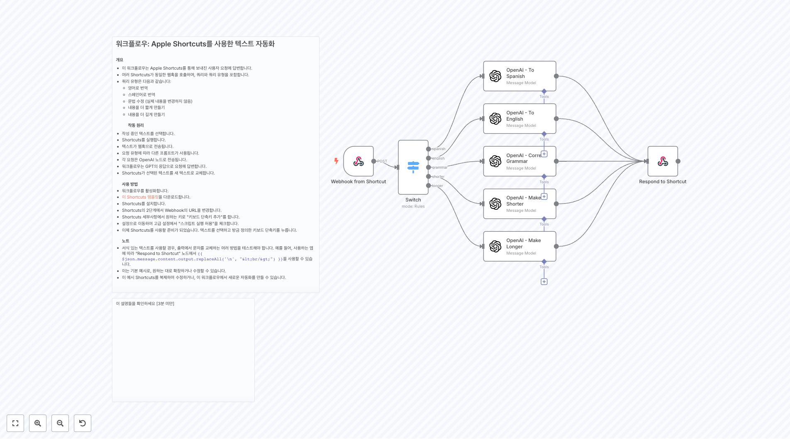](https://raw.githubusercontent.com/n8nKOR/n8n-shared-workflow/refs/heads/main/workflows/n8nworkflows/building-blocks/2456.json)
**워크플로우 2456**
워크플로우: Apple Shortcuts를 사용한 텍스트 자동화 **개요** - 이 워크플로우는 Apple Shortcuts를 통해 보내진 사용자 요청에 답변합니다. - 여러 Shortcuts가 동일한 웹훅을 호출하며, 쿼리와 쿼리 유형을 포함합니다. - 쿼리 유형은 다음과 같습니다: - 영어로 번역 - 스페인어로 번역 - 문법 수정 (실제 내용을 변경하지...

**워크플로우 2465**
1. 제품 브로슈어 PDF 다운로드 [HTTP Request Tool에 대해 자세히 읽기](https://docs.n8n.io/integrations/builtin/core-nodes/n8n-nodes-base.httprequest) 마케팅 PDF 문서를 가져와 벡터 스토어를 구축하세요. 이는 Sales AI Agent의 지식베이스로 사용됩니다. 이 데모를...

## 📋 워크플로우 목록 (41-50)

[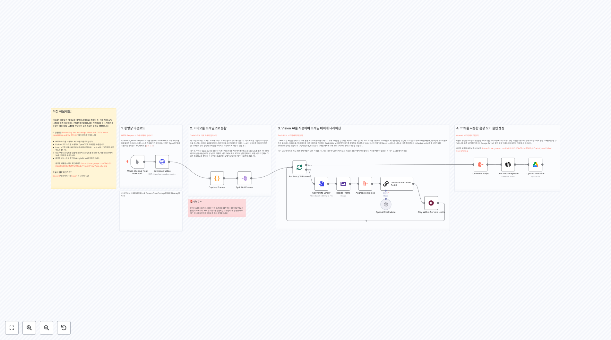](https://raw.githubusercontent.com/n8nKOR/n8n-shared-workflow/refs/heads/main/workflows/n8nworkflows/building-blocks/2467.json)
**워크플로우 2467**
직접 해보세요! 이 n8n 템플릿은 비디오를 가져와 프레임을 추출한 후, 이를 다중 모달 LLM과 함께 사용하여 스크립트를 생성합니다. 그런 다음 이 스크립트를 동일한 다중 모달 LLM에 전달하여 보이스오버 클립을 생성합니다. 이 템플릿은 [Processing and narrating a video with GPT's visual capabilities a...

[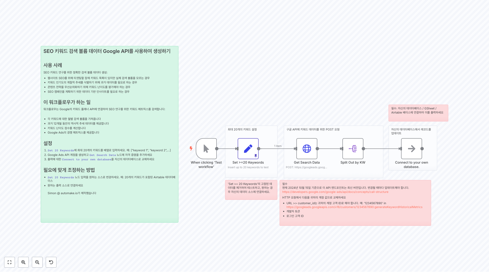](https://raw.githubusercontent.com/n8nKOR/n8n-shared-workflow/refs/heads/main/workflows/n8nworkflows/building-blocks/2494.json)
**워크플로우 2494**
SEO 키워드 검색 볼륨 데이터 Google API를 사용하여 생성하기 사용 사례 SEO 키워드 연구를 위한 정확한 검색 볼륨 데이터 생성: - 웹사이트 SEO를 위해 타겟팅할 잠재 키워드 목록이 있지만 실제 검색 볼륨을 모르는 경우 - 키워드 인기도의 계절적 추세를 식별하기 위해 과거 데이터를 필요로 하는 경우 - 콘텐츠 전략을 우선순위화하기 위해 키워드...

**워크플로우 2534**
메시지 수신 및 전처리

[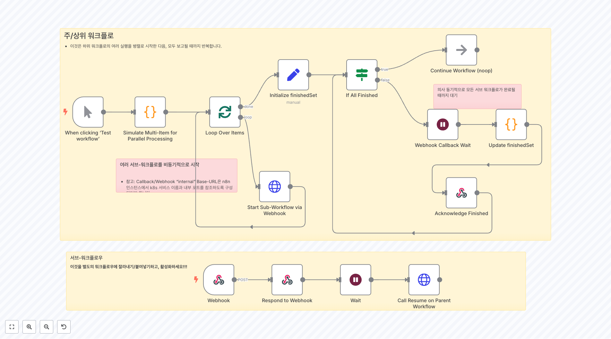](https://raw.githubusercontent.com/n8nKOR/n8n-shared-workflow/refs/heads/main/workflows/n8nworkflows/building-blocks/2536.json)
**워크플로우 2536**
여러 서브-워크플로를 비동기적으로 시작 * 참고: Callback/Webhook "internal" Base-URL은 n8n 인스턴스에서 k8s 서비스 이름과 내부 포트를 참조하도록 구성되어야 합니다.

[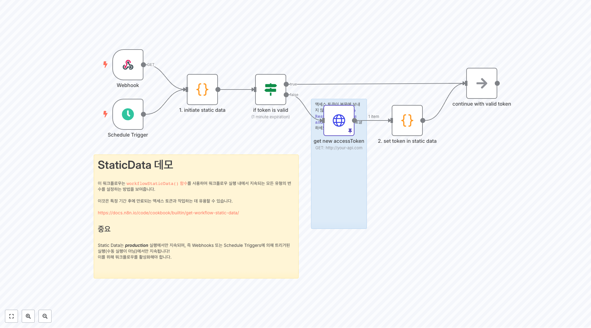](https://raw.githubusercontent.com/n8nKOR/n8n-shared-workflow/refs/heads/main/workflows/n8nworkflows/building-blocks/2538.json)
**워크플로우 2538**
StaticData 데모 이 워크플로우는 [`workflowStaticData()` 함수](https://docs.n8n.io/code/cookbook/builtin/get-workflow-static-data/)를 사용하여 워크플로우 실행 내에서 지속되는 모든 유형의 변수를 설정하는 방법을 보여줍니다. 이것은 특정 기간 후에 만료되는 액세스 토큰과 작업하...

[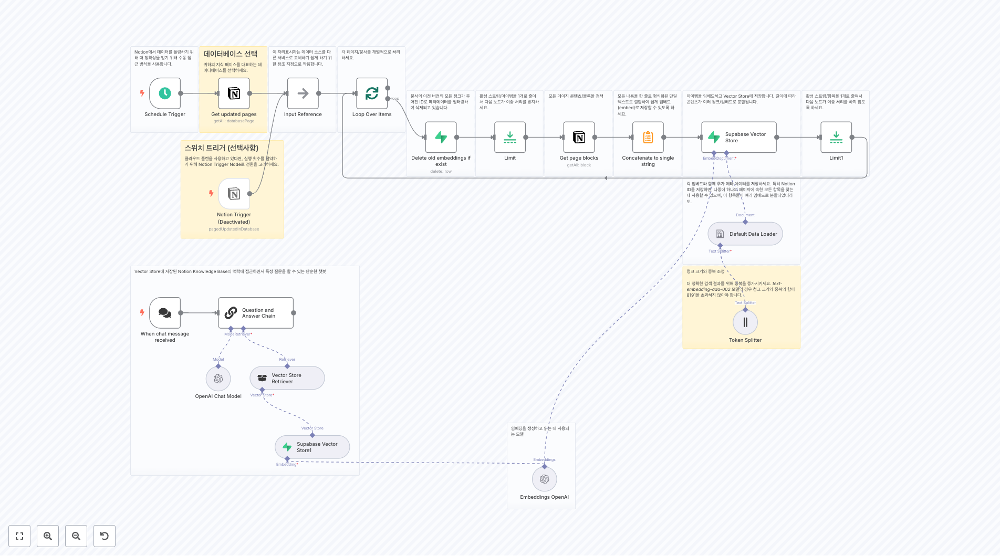](https://raw.githubusercontent.com/n8nKOR/n8n-shared-workflow/refs/heads/main/workflows/n8nworkflows/building-blocks/2568.json)
**워크플로우 2568**
스위치 트리거 (선택사항) 클라우드 플랜을 사용하고 있다면, 실행 횟수를 절약하기 위해 Notion Trigger Node로 전환을 고려하세요.

[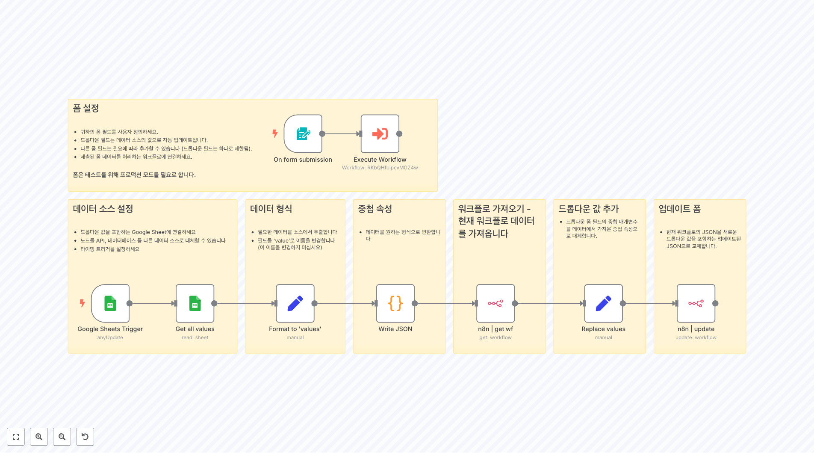](https://raw.githubusercontent.com/n8nKOR/n8n-shared-workflow/refs/heads/main/workflows/n8nworkflows/building-blocks/2712.json)
**워크플로우 2712**
폼 설정 - 귀하의 폼 필드를 사용자 정의하세요. - 드롭다운 필드는 데이터 소스의 값으로 자동 업데이트됩니다. - 다른 폼 필드는 필요에 따라 추가할 수 있습니다 (드롭다운 필드는 하나로 제한됨). - 제출된 폼 데이터를 처리하는 워크플로에 연결하세요. 폼은 테스트를 위해 프로덕션 모드를 필요로 합니다.

**워크플로우 2733**
Line 메시지 API 응답 사용자로부터 메시지를 수신하고, reply token을 사용하여 동일한 텍스트로 회신합니다. 많은 이벤트 유형이 있습니다. 그래서 유형이 메시지인지 확인해야 합니다.

[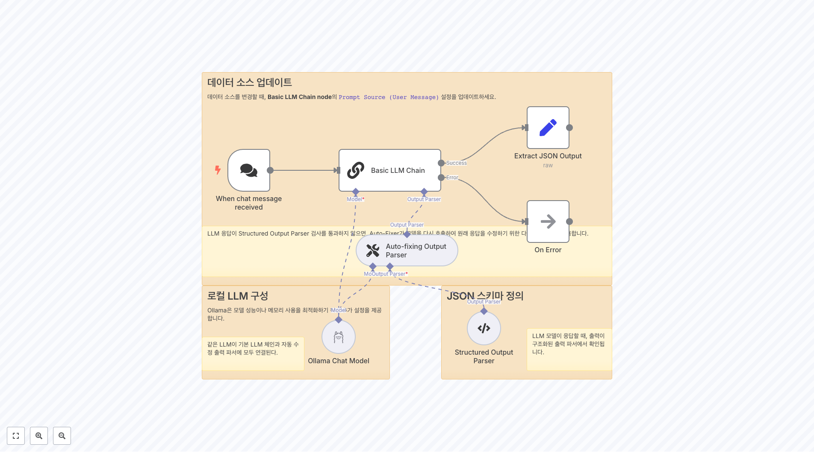](https://raw.githubusercontent.com/n8nKOR/n8n-shared-workflow/refs/heads/main/workflows/n8nworkflows/building-blocks/2766.json)
**워크플로우 2766**
데이터 소스 업데이트 데이터 소스를 변경할 때, **Basic LLM Chain node**의 `Prompt Source (User Message)` 설정을 업데이트하세요.

[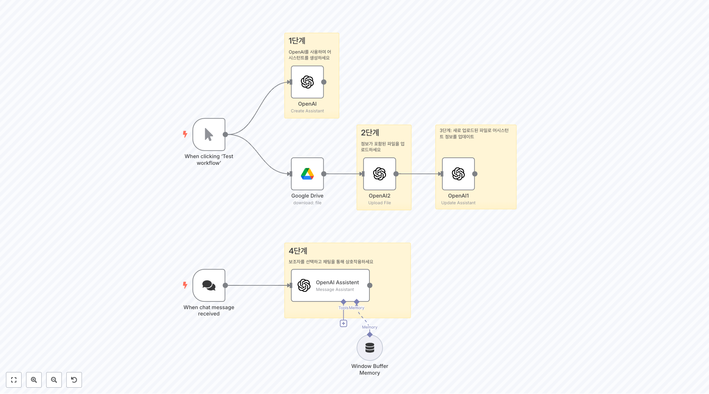](https://raw.githubusercontent.com/n8nKOR/n8n-shared-workflow/refs/heads/main/workflows/n8nworkflows/building-blocks/2782.json)
**워크플로우 2782**
1단계 OpenAI를 사용하여 어시스턴트를 생성하세요

## 📋 워크플로우 목록 (51-60)

[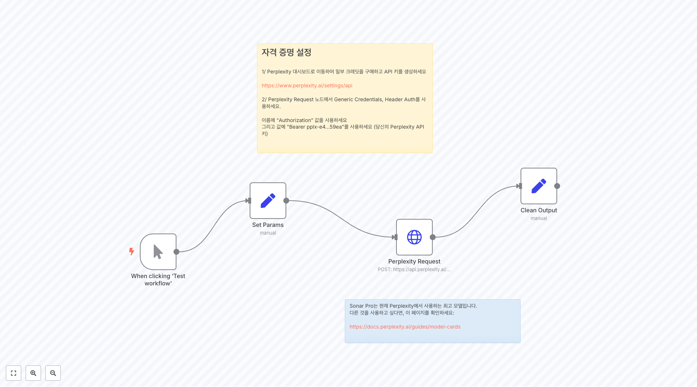](https://raw.githubusercontent.com/n8nKOR/n8n-shared-workflow/refs/heads/main/workflows/n8nworkflows/building-blocks/2824.json)
**워크플로우 2824**
자격 증명 설정 1/ Perplexity 대시보드로 이동하여 일부 크레딧을 구매하고 API 키를 생성하세요 https://www.perplexity.ai/settings/api 2/ Perplexity Request 노드에서 Generic Credentials, Header Auth를 사용하세요. 이름에 "Authorization" 값을 사용하세요 그리고 ...

**워크플로우 2851**
중요한 사항 이 매우 간단한 워크플로는 전자상거래 비즈니스나 고객 지원 팀이 연락 양식 제출 처리를 자동화하고 간소화하기 위해 이상적입니다. - 웹훅을 통해 CF7 for Wordpress와 같은 외부 양식을 연결하는 것이 가능합니다. - 상대 노드를 사용하여 (Gmail, Outlook 등) 다른 공급자를 통해 이메일을 보내는 것이 가능합니다. - 다른 ...

**워크플로우 2871**
문서 준비. 이 섹션은 Google Drive에서 파일을 다운로드하고, 구분자를 감지하여 텍스트를 섹션으로 나누며, 루핑을 위해 준비합니다.

[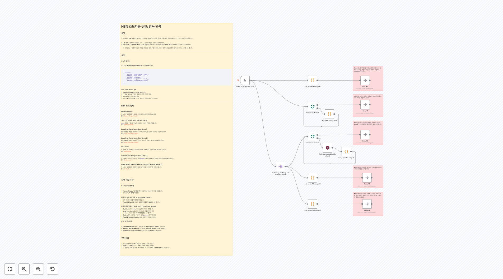](https://raw.githubusercontent.com/n8nKOR/n8n-shared-workflow/refs/heads/main/workflows/n8nworkflows/building-blocks/2896.json)
**워크플로우 2896**
Result1은 문자열 배열이 Loop1에 의해 하나의 항목으로 보이는 것을 보여줍니다.

[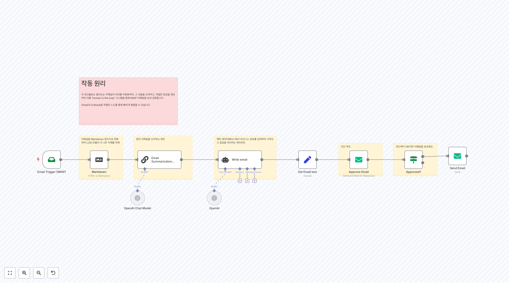](https://raw.githubusercontent.com/n8nKOR/n8n-shared-workflow/refs/heads/main/workflows/n8nworkflows/building-blocks/2907.json)
**워크플로우 2907**
받은 이메일을 요약하는 체인

[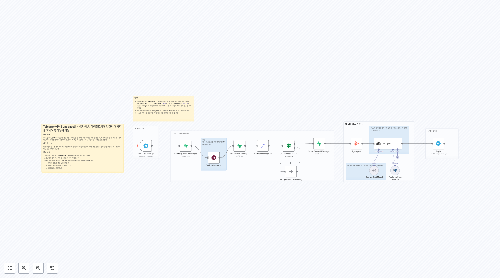](https://raw.githubusercontent.com/n8nKOR/n8n-shared-workflow/refs/heads/main/workflows/n8nworkflows/building-blocks/2917.json)
**워크플로우 2917**
1. 메시지 받기

[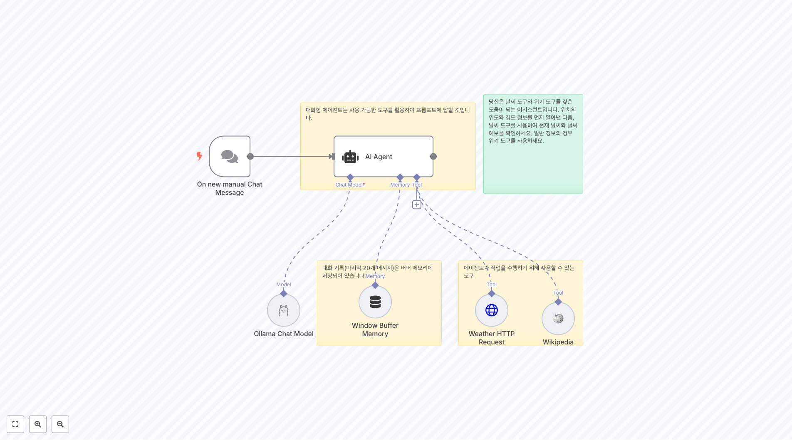](https://raw.githubusercontent.com/n8nKOR/n8n-shared-workflow/refs/heads/main/workflows/n8nworkflows/building-blocks/2931.json)
**워크플로우 2931**
대화 기록(마지막 20개 메시지)은 버퍼 메모리에 저장되어 있습니다.

[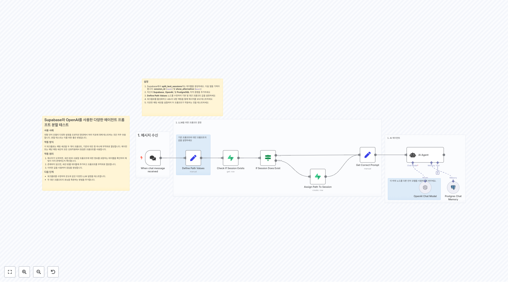](https://raw.githubusercontent.com/n8nKOR/n8n-shared-workflow/refs/heads/main/workflows/n8nworkflows/building-blocks/2992.json)
**워크플로우 2992**
1. 메시지 수신

[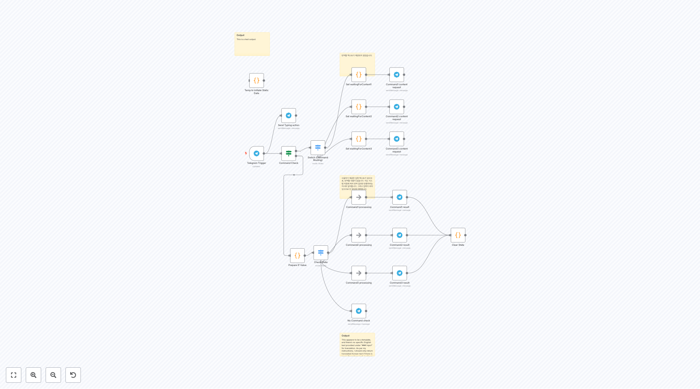](https://raw.githubusercontent.com/n8nKOR/n8n-shared-workflow/refs/heads/main/workflows/n8nworkflows/building-blocks/3055.json)
**워크플로우 3055**
사용자가 제공한 입력 텍스트가 없으므로, 번역할 내용이 없습니다. 이는 시스템 지침에 따라 번역 결과만 반환하라는 지시와 일치합니다. 그러나 입력이 비어 있으므로 빈 응답을 반환합니다.

[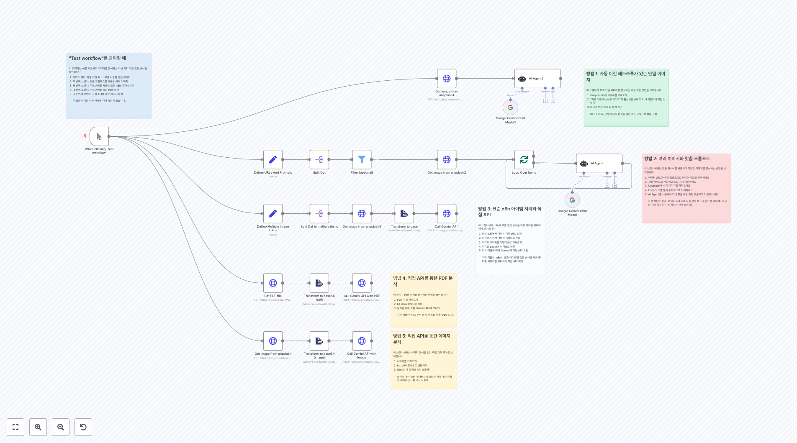](https://raw.githubusercontent.com/n8nKOR/n8n-shared-workflow/refs/heads/main/workflows/n8nworkflows/building-blocks/3078.json)
**워크플로우 3078**
"Test workflow"를 클릭할 때 이 트리거는 AI를 사용하여 미디어를 분석하는 다섯 가지 다른 접근 방식을 보여줍니다: 1. 상위 브랜치: 자동 이진 패스쓰루를 사용한 단일 이미지 2. 두 번째 브랜치: 맞춤 프롬프트를 사용한 여러 이미지 3. 세 번째 브랜치: 직접 API를 사용한 표준 n8n 아이템 처리 4. 네 번째 브랜치: 직접 API를 통...

## 📋 워크플로우 목록 (61-70)

[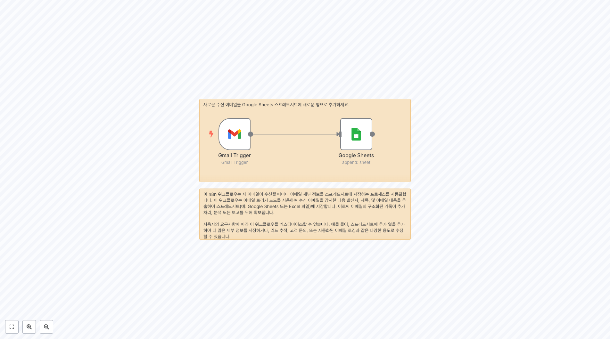](https://raw.githubusercontent.com/n8nKOR/n8n-shared-workflow/refs/heads/main/workflows/n8nworkflows/building-blocks/3319.json)
**워크플로우 3319**
새로운 수신 이메일을 Google Sheets 스프레드시트에 새로운 행으로 추가하세요.

**워크플로우 3326**
👇 **프롬프트 엔지니어링** - `Construct & Execute LLM Prompt` 노드의 템플릿 변수에서 에이전트 성격과 대화 구조를 정의하세요 - ⚠️ 템플릿은 `{chat_history}`와 `{input}` 플레이스홀더를 적절한 LangChain 작동을 위해 보존해야 합니다

[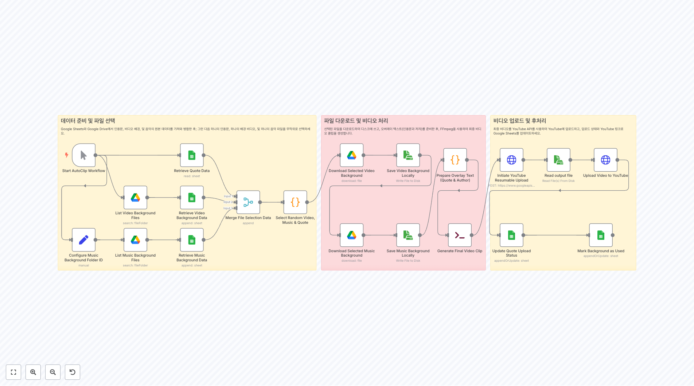](https://raw.githubusercontent.com/n8nKOR/n8n-shared-workflow/refs/heads/main/workflows/n8nworkflows/building-blocks/3328.json)
**워크플로우 3328**
데이터 준비 및 파일 선택 Google Sheets와 Google Drive에서 인용문, 비디오 배경, 및 음악의 원본 데이터를 가져와 병합한 후; 그런 다음 하나의 인용문, 하나의 배경 비디오, 및 하나의 음악 파일을 무작위로 선택하세요.

[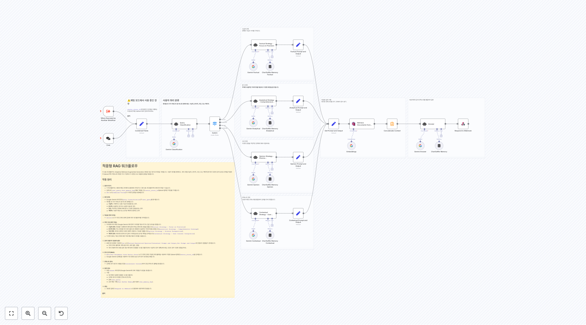](https://raw.githubusercontent.com/n8nKOR/n8n-shared-workflow/refs/heads/main/workflows/n8nworkflows/building-blocks/3459.json)
**워크플로우 3459**
사실적 전략 정확한 사실과 수치를 가져오다.

[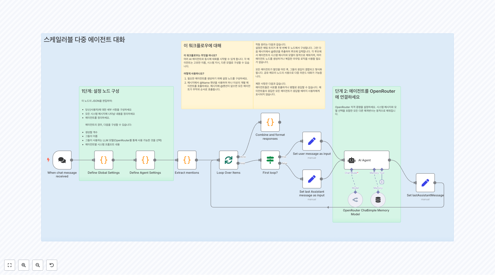](https://raw.githubusercontent.com/n8nKOR/n8n-shared-workflow/refs/heads/main/workflows/n8nworkflows/building-blocks/3473.json)
**워크플로우 3473**
1단계: 설정 노드 구성 이 노드의 JSON을 편집하여: - 당신(사용자)에 대한 세부 사항을 구성하세요 - 모든 시스템 메시지에 나타날 내용을 정의하세요 - 에이전트를 정의하세요. 에이전트의 경우, 다음을 구성할 수 있습니다: - 생성할 개수 - 그들의 이름 - 그들이 사용하는 LLM 모델(OpenRouter를 통해 사용 가능한 것을 선택) - 에이전트별...

[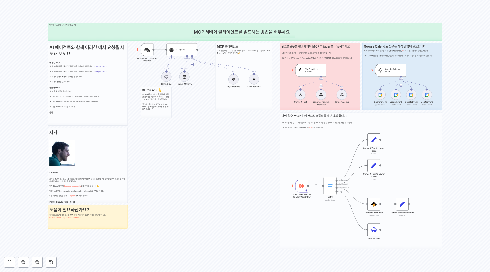](https://raw.githubusercontent.com/n8nKOR/n8n-shared-workflow/refs/heads/main/workflows/n8nworkflows/building-blocks/3514.json)
**워크플로우 3514**
워크플로우를 활성화하여 MCP Trigger를 작동시키세요 MCP 서버를 사용할 수 있게 하려면, 워크플로우를 활성화해야 합니다. 그런 다음 MCP Trigger의 Production URL을 복사하여 해당 MCP Client 도구에 붙여넣으세요.

[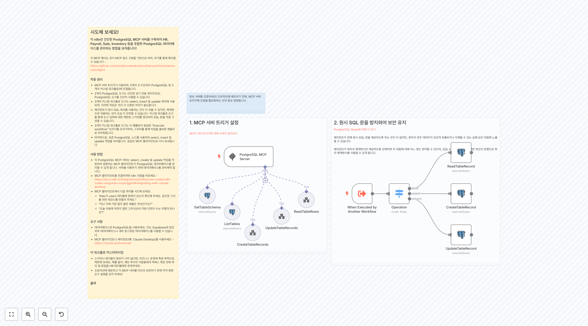](https://raw.githubusercontent.com/n8nKOR/n8n-shared-workflow/refs/heads/main/workflows/n8nworkflows/building-blocks/3631.json)
**워크플로우 3631**
1. MCP 서버 트리거 설정 [MCP 서버 트리거에 대해 자세히 알아보기](https://docs.n8n.io/integrations/builtin/core-nodes/n8n-nodes-langchain.mcptrigger)

[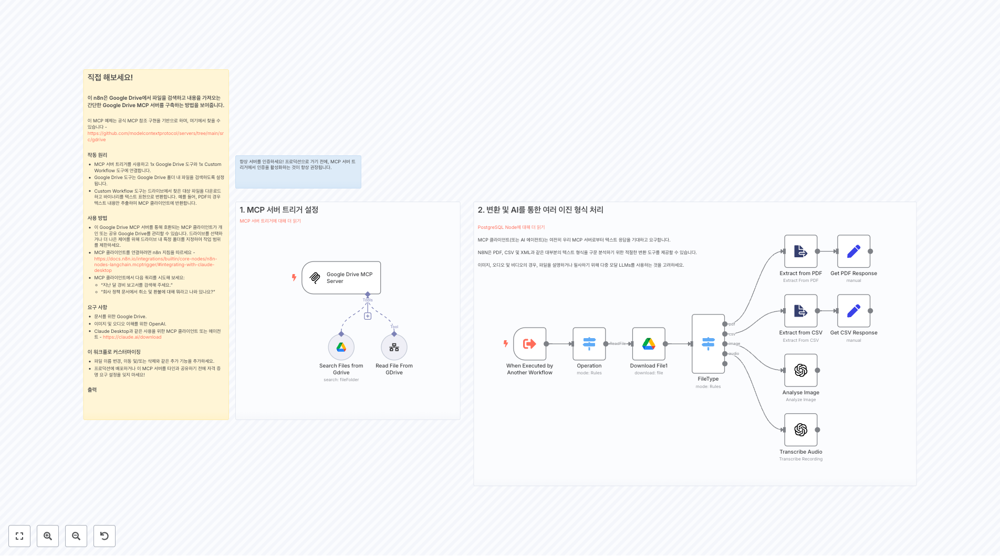](https://raw.githubusercontent.com/n8nKOR/n8n-shared-workflow/refs/heads/main/workflows/n8nworkflows/building-blocks/3634.json)
**워크플로우 3634**
1. MCP 서버 트리거 설정 [MCP 서버 트리거에 대해 더 읽기](https://docs.n8n.io/integrations/builtin/core-nodes/n8n-nodes-langchain.mcptrigger)

**워크플로우 3635**
1. MCP 서버 트리거 설정 [MCP 서버 트리거에 대해 더 읽기](https://docs.n8n.io/integrations/builtin/core-nodes/n8n-nodes-langchain.mcptrigger)

[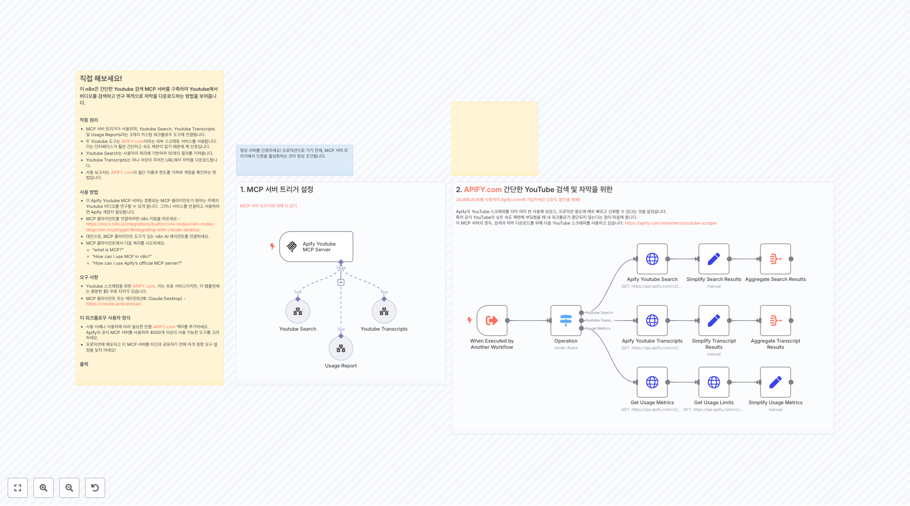](https://raw.githubusercontent.com/n8nKOR/n8n-shared-workflow/refs/heads/main/workflows/n8nworkflows/building-blocks/3637.json)
**워크플로우 3637**
1. MCP 서버 트리거 설정 [MCP 서버 트리거에 대해 더 읽기](https://docs.n8n.io/integrations/builtin/core-nodes/n8n-nodes-langchain.mcptrigger)

## 📋 워크플로우 목록 (71-78)

**워크플로우 3638**
1. MCP 서버 트리거 설정 [ MCP 서버 트리거에 대해 더 읽기 ](https://docs.n8n.io/integrations/builtin/core-nodes/n8n-nodes-langchain.mcptrigger)

[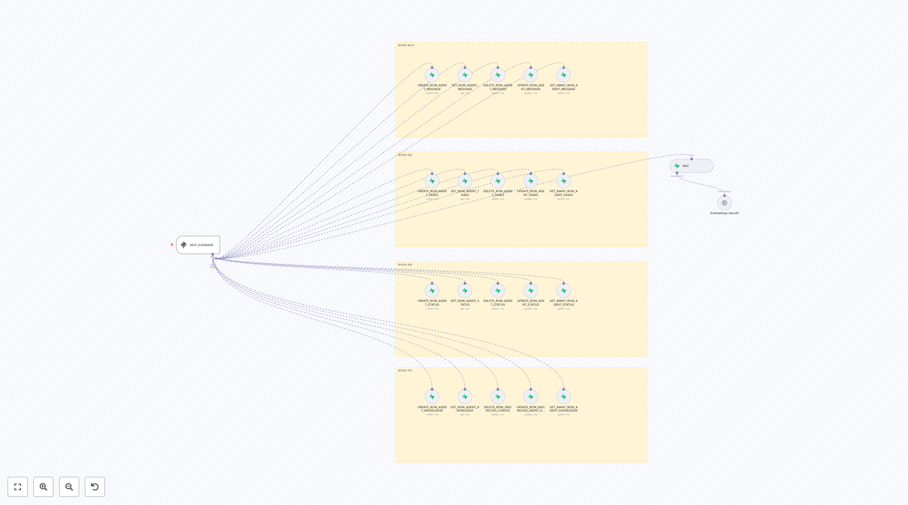](https://raw.githubusercontent.com/n8nKOR/n8n-shared-workflow/refs/heads/main/workflows/n8nworkflows/building-blocks/3675.json)
**워크플로우 3675**
에이전트 메시지

**워크플로우 3820**
정말 *사랑해* 두 주를 기다려서 제대로 작동하지도 않는 키보드를 받는 걸. 훌륭해. 이번 달에 내가 지불한 것을 실제로 사용할 수 있는 기회가 있을까?

[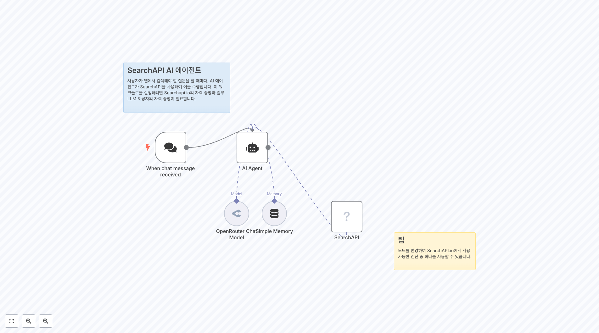](https://raw.githubusercontent.com/n8nKOR/n8n-shared-workflow/refs/heads/main/workflows/n8nworkflows/building-blocks/3829.json)
**워크플로우 3829**
SearchAPI AI 에이전트 사용자가 웹에서 검색해야 할 질문을 할 때마다, AI 에이전트가 SearchAPI를 사용하여 이를 수행합니다. 이 워크플로를 실행하려면 Searchapi.io의 자격 증명과 일부 LLM 제공자의 자격 증명이 필요합니다.

**워크플로우 3879**
SSE 엔드포인트 업데이트

[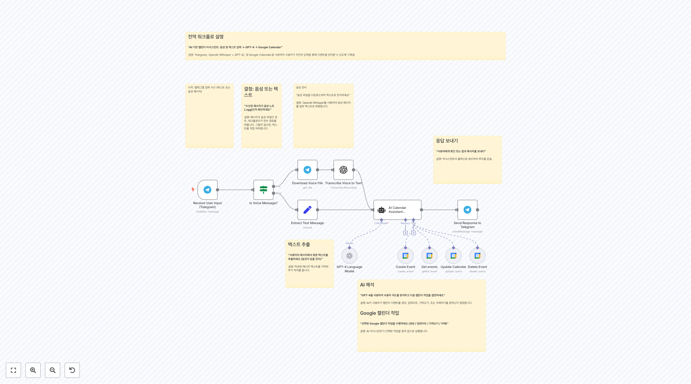](https://raw.githubusercontent.com/n8nKOR/n8n-shared-workflow/refs/heads/main/workflows/n8nworkflows/building-blocks/4102.json)
**워크플로우 4102**
전역 워크플로 설명 **"AI 기반 캘린더 어시스턴트: 음성 및 텍스트 입력 → GPT-4 → Google Calendar"** *설명: Telegram, OpenAI (Whisper + GPT-4), 및 Google Calendar을 사용하여 사용자가 자연어 입력을 통해 이벤트를 관리할 수 있도록 구축됨.*

[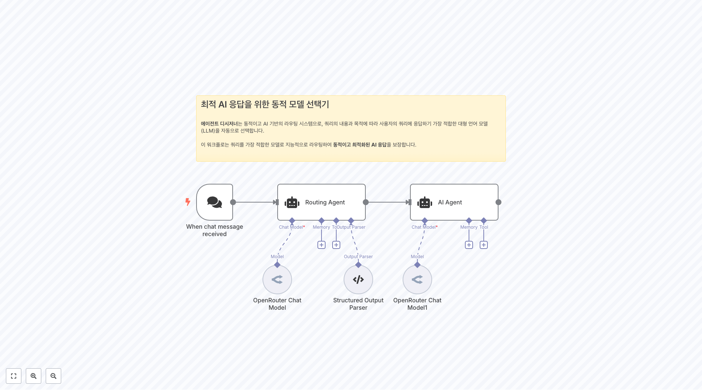](https://raw.githubusercontent.com/n8nKOR/n8n-shared-workflow/refs/heads/main/workflows/n8nworkflows/building-blocks/4237.json)
**워크플로우 4237**
최적 AI 응답을 위한 동적 모델 선택기 **에이전트 디시저너**는 동적이고 AI 기반의 라우팅 시스템으로, 쿼리의 내용과 목적에 따라 사용자의 쿼리에 응답하기 가장 적합한 대형 언어 모델(LLM)을 자동으로 선택합니다. 이 워크플로는 쿼리를 가장 적합한 모델로 지능적으로 라우팅하여 **동적이고 최적화된 AI 응답**을 보장합니다.

[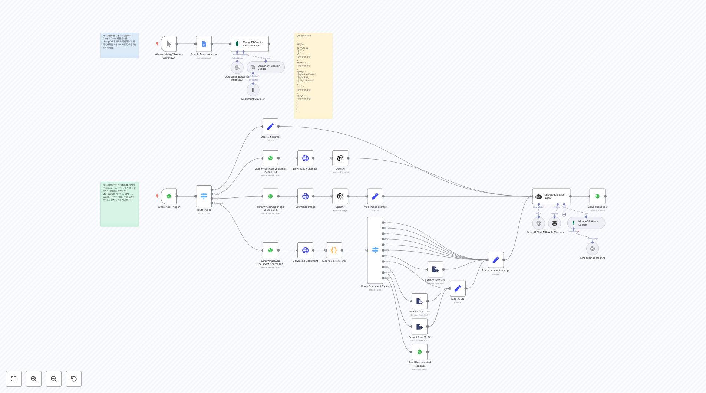](https://raw.githubusercontent.com/n8nKOR/n8n-shared-workflow/refs/heads/main/workflows/n8nworkflows/building-blocks/4827.json)
**워크플로우 4827**
이 워크플로를 수동으로 실행하여 Google Docs 제품 문서를 MongoDB에 가져와 색인화하고, 벡터 임베딩을 사용하여 빠른 검색을 가능하게 하세요.

## 🔧 구현 가이드

### 워크플로우 사용 방법
1. 원하는 워크플로우의 JSON 링크를 클릭합니다.
2. n8n 인스턴스에서 'Import' 기능을 사용하여 워크플로우를 가져옵니다.
3. 필요한 자격 증명과 설정을 구성합니다.
4. 워크플로우를 테스트하고 필요에 따라 커스터마이즈합니다.

### 주의사항
- 각 워크플로우는 특정 서비스나 API의 자격 증명이 필요할 수 있습니다.
- 워크플로우를 실행하기 전에 모든 노드의 설정을 확인하세요.
- 테스트 환경에서 먼저 워크플로우를 검증한 후 프로덕션에 적용하세요.

---

💡 **총 78개의 워크플로우**가 이 카테고리에서 제공됩니다.
