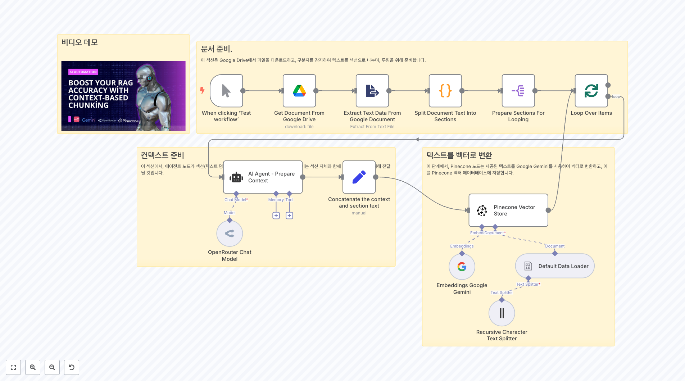
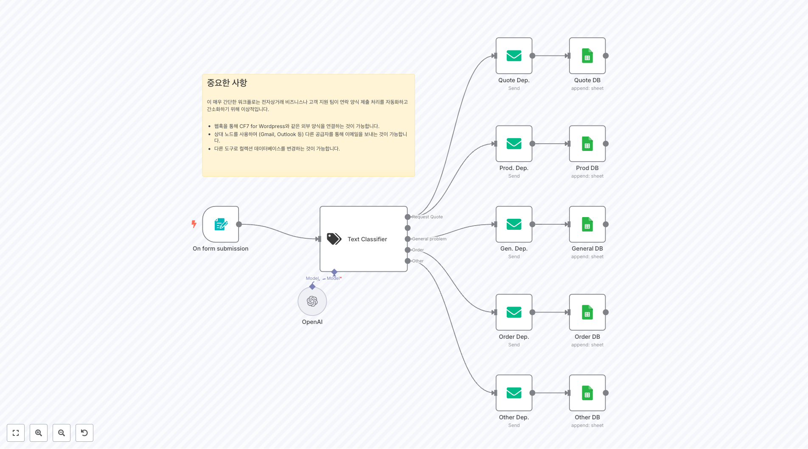
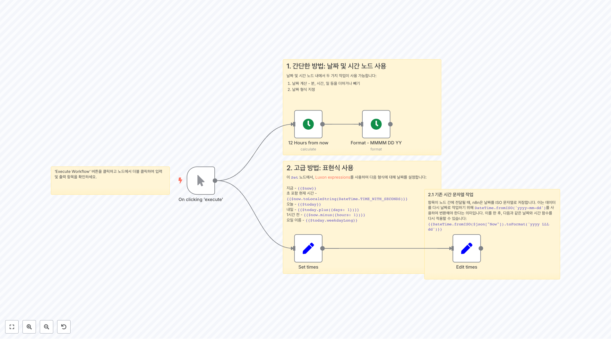

# Building Blocks Workflows

이 폴더에는 복합적인 기능을 구현하기 위한 **78개의 빌딩 블록 워크플로우**가 포함되어 있습니다. 이러한 빌딩 블록들은 재사용 가능한 컴포넌트로, 더 큰 자동화 솔루션을 구축하는 데 사용할 수 있는 기본 패턴들을 제공합니다.

## 🔄 데이터 처리 및 변환

### 데이터 형식 변환

**데이터 형식 변환 툴킷**
JSON에서 Google Sheets, JSON에서 CSV, CSV에서 JSON 등 다양한 데이터 형식 간 변환을 시연하는 다목적 변환 빌딩 블록입니다.

**JSON to Google Sheets 직접 매핑**
중간 Set 노드 없이 JSON을 Google Sheets에 직접 매핑하는 간소화된 데이터 동기화 빌딩 블록입니다.

**CSV to Google Sheets 가져오기**
URL에서 CSV를 다운로드하고, 고유 키로 데이터를 처리하며, Google Sheets 속도 제한을 고려한 데이터 가져오기 빌딩 블록입니다.

### Excel 및 스프레드시트 처리

**Excel 파일 처리 툴킷**
다양한 소스(URL, 로컬, 클라우드)에서 Excel 파일을 처리하고, 형식 변환, 데이터 조작, 연령 계산 등을 지원하는 완전한 Excel 워크플로우입니다.

**XML to Google Sheets 프로세서**
XML 파일을 다운로드하고, 콘텐츠를 파싱하며, 데이터를 개별 항목으로 분할하고, 헤더가 있는 Google Sheets를 생성하는 XML 데이터 처리입니다.

### 데이터베이스 운영

**데이터 병합 및 조인 연산**
SQL과 유사하지만 더 유연한 내부 조인, 데이터 강화를 위한 좌측 조인, 데이터셋 결합을 위한 유니온 연산을 시연하는 포괄적인 병합 연산입니다.

**Discord 멤버 관리**
배치로 멤버를 가져오고, Google Sheets로 진행 상황을 추적하며, 역할 기반 필터링과 확장 가능한 멤버 운영을 위한 자동 페이지네이션을 지원하여 대규모 Discord 커뮤니티를 효율적으로 관리합니다.

## 🤖 AI/LLM 통합

### AI 기반 콘텐츠 분석

**Reddit 콘텐츠 분석 with OpenAI**
Reddit에서 n8n 언급을 검색하고, 관련 게시물을 필터링하며, OpenAI를 사용하여 콘텐츠를 분류하고 품질 필터링과 함께 요약을 생성합니다.

**PDF 이메일 처리 with OpenAI**
이메일 첨부 PDF를 읽고, OpenAI를 사용하여 기준에 맞는 콘텐츠 매칭을 수행하며, 관련 문서를 Google Drive에 업로드합니다.

**팟캐스트 콘텐츠 분석 및 다이제스트**
팟캐스트 트랜스크립트를 요약하고, 주제와 질문을 추출하며, Wikipedia 에이전트를 사용하여 주제를 연구하고, 구조화된 정보로 형식화된 HTML 다이제스트 이메일을 전송합니다.

### LLM 출력 처리

**구조화된 LLM 출력 파서**
자동 수정 기능을 갖춘 구조화된 출력 파싱, 스키마 검증, 그리고 신뢰할 수 있는 LLM 데이터 추출을 위한 오류 수정을 시연합니다.

**GPT-4 CSV 데이터 생성기**
GPT-4를 사용하여 CSV 파일을 생성하고, JSON 파싱과 UTF BOM 문제를 처리하며, 구조화된 데이터셋을 배치로 생성합니다.

**AI 기반 제품 설문조사 분석**
AI 비전 모델을 사용하여 Airtable 설문조사의 제품 사진을 분석하고, 역방향 이미지 검색을 수행하며, 웹 소스에서 제품 정보를 스크래핑하여 모델, 재료, 색상 및 상태와 같은 세부 제품 속성으로 설문조사 데이터를 강화합니다.

### 문서 처리 및 AI 분석

**문서 처리 및 학습 자료 생성기**
새 문서를 위한 폴더를 모니터링하고, PDF/DOCX/텍스트 파일을 처리하며, 벡터 임베딩을 생성하고, RAG를 사용하여 AI 에이전트로 학습 자료를 자동 생성합니다.

**컨텍스트 청킹을 이용한 문서 분할**
긴 문서를 논리적 섹션으로 분할하고, 각 청크에 대해 상황적 맥락을 생성하여 더 나은 벡터 임베딩과 검색 성능을 위한 정교한 문서 처리 시스템입니다.

## 📧 이메일 자동화

### 지능형 이메일 처리

**AI 이메일 약속 스케줄러**
LLM을 사용하여 약속 요청을 분류하고, Google Calendar 가용성을 확인하며, 자동 스케줄링을 위한 적절한 응답을 생성하는 지능형 이메일 처리입니다.

**Gmail to Notion 작업 관리자**
Gmail 라벨을 모니터링하고, 이메일용 Notion 데이터베이스 페이지를 생성하며, 중복을 방지하고 GTD 스타일 시스템을 구축합니다.

**자동 이메일 분류 및 라벨링**
수신 이메일을 AI로 분석하여 자동으로 카테고리별로 분류하고 적절한 라벨을 지정하는 지능형 이메일 관리 시스템입니다.

## 🗃️ 데이터베이스 및 스토리지

### NocoDb 및 SQLite 통합

**itemMatching() 코드 예제**
itemMatching() 함수를 사용하여 이전 워크플로우 부분에서 연결된 항목을 검색하는 방법을 보여주는 코드 노드 유틸리티입니다.

**워크플로우 자격 증명 매핑**
n8n 워크플로우 자격 증명을 SQLite 데이터베이스에 매핑하고, 특정 서비스를 사용하는 워크플로우의 검색 가능한 인벤토리를 생성합니다.

**PDF 화이트페이퍼 다운로더**
자동으로 PDF 화이트페이퍼를 다운로드하고 메타데이터를 추출하여 구조화된 데이터베이스에 저장하는 학술 자료 수집 시스템입니다.

## 🔗 API 통합 및 웹훅

### GitHub 및 버전 관리

**GitHub 워크플로우 백업 시스템**
서브 워크플로우 패턴을 가진 n8n 워크플로우용 포괄적인 GitHub 백업 시스템으로, 매일 모든 인스턴스 워크플로우를 백업합니다.

**Git 워크플로우 동기화**
GitHub 저장소와 n8n 워크플로우 간의 양방향 동기화를 통한 버전 관리 및 협업 지원 시스템입니다.

### 외부 API 통합

**Wait 노드 운영**
API 속도 제한을 위한 시간 기반 지연과 고객 메시징 시뮬레이션을 통한 웹훅 기반 외부 승인 프로세스를 보여주는 속도 제한 및 외부 승인 워크플로우입니다.

**Line 메시징 API 통합**
Line 메시징 플랫폼과의 자동화된 상호작용을 위한 메시지 처리 및 응답 시스템입니다.

**액세스 토큰 새로고침 시스템**
API 액세스 토큰을 자동으로 새로고침하고 만료 시간을 추적하여 지속적인 API 연결을 보장하는 인증 관리 시스템입니다.

## ⚙️ 워크플로우 유틸리티

### 시간 및 날짜 처리

**날짜 및 시간 조작**
계산 및 형식화를 위한 DateTime 노드와 고급 날짜 조작을 위한 Luxon 표현식 두 가지 접근 방식을 보여주는 날짜/시간 연산입니다.

**스케줄링 및 타이밍 제어**
복잡한 스케줄링 패턴과 타이밍 제어를 위한 고급 워크플로우 실행 관리 시스템입니다.

### 오류 처리 및 모니터링

**기본 오류 처리기 할당**
기존 오류 관리가 없는 워크플로우에 오류 처리기를 자동 할당하고, 실패 시 이메일 알림을 전송하는 중앙 집중식 오류 처리를 구현합니다.

**HTML to PDF 변환기**
HTML 콘텐츠를 PDF 문서로 변환하는 자동화된 문서 생성 시스템입니다.

## 🎵 미디어 및 엔터테인먼트

### 음악 관리

**월별 Spotify 플레이리스트 생성기**
현재 날짜를 가져오고, Spotify에서 좋아요한 트랙을 검색하며, 기존 항목에 대한 데이터베이스를 확인하고, 월별 플레이리스트를 생성하는 자동화된 월별 플레이리스트 생성입니다.

### 멀티미디어 콘텐츠 생성

**YouTube 쇼츠 자동 생성기**
음성, 배경 비디오, 명언을 결합하여 완전한 YouTube 쇼츠를 자동으로 생성하고 업로드하는 포괄적인 콘텐츠 제작 파이프라인입니다.

**비디오 처리 및 업로드**
비디오 파일을 처리하고 메타데이터를 추가하여 다양한 플랫폼에 자동으로 업로드하는 비디오 관리 시스템입니다.

## 💬 채팅봇 및 메시징

### Telegram 봇 시스템

**다국어 Telegram 봇**
사용자 언어를 감지하고, 데이터베이스에서 사전을 로드하며, 봇 명령어를 처리하고, 사용자 기본 설정에 따라 현지화된 응답을 제공하는 다국어 Telegram 봇입니다.

**AI 에이전트 채팅봇**
Telegram을 통해 음성 메시지와 텍스트를 처리하고 AI 에이전트와 상호작용할 수 있는 지능형 대화형 봇입니다.

### WhatsApp 및 기타 메신저

**WhatsApp 자동화**
WhatsApp Business API를 통한 메시지 자동화와 고객 커뮤니케이션 워크플로우를 구현합니다.

**Discord 통합**
Discord 서버와의 자동화된 상호작용을 위한 봇 기능과 커뮤니티 관리 도구를 제공합니다.

## 🌐 웹 스크래핑 및 데이터 수집

### 웹 데이터 추출

**웹 데이터 수집기**
웹사이트에서 데이터를 자동으로 수집하고 구조화하여 데이터베이스나 스프레드시트로 저장하는 스크래핑 솔루션입니다.

**동적 콘텐츠 스크래핑**
JavaScript로 렌더링되는 동적 웹 콘텐츠를 스크래핑하고 처리하는 고급 웹 데이터 추출 시스템입니다.

### 소셜 미디어 모니터링

**소셜 미디어 분석**
다양한 소셜 미디어 플랫폼에서 데이터를 수집하고 분석하여 트렌드와 인사이트를 추출하는 모니터링 시스템입니다.

## 🔍 검색 및 분석

### 데이터 분석 도구

**텍스트 분석 및 분류**
대량의 텍스트 데이터를 분석하고 자동으로 카테고리별로 분류하는 자연어 처리 시스템입니다.

**성능 모니터링**
시스템 성능 지표를 추적하고 이상 상황을 감지하여 자동으로 알림을 전송하는 모니터링 솔루션입니다.

## 📱 모바일 및 앱 통합

### 모바일 알림

**푸시 알림 시스템**
다양한 이벤트에 대해 모바일 디바이스로 푸시 알림을 전송하는 통합 알림 관리 시스템입니다.

**앱 데이터 동기화**
모바일 앱과 백엔드 시스템 간의 실시간 데이터 동기화를 처리하는 데이터 동기화 솔루션입니다.

## 🔐 인증 및 보안

### 보안 인증

**OIDC 클라이언트 인증**
OpenID Connect 프로토콜을 사용한 인증 플로우를 구현하여 보안 API 접근 및 토큰 관리를 제공합니다.

**JWT 토큰 관리**
JWT 토큰의 생성, 검증, 갱신을 처리하는 포괄적인 인증 토큰 관리 시스템입니다.

## 📊 리포팅 및 대시보드

### 자동 리포트 생성

**데이터 리포트 생성기**
다양한 데이터 소스에서 정보를 수집하여 자동으로 형식화된 리포트를 생성하는 리포팅 시스템입니다.

**KPI 대시보드**
핵심 성과 지표를 실시간으로 추적하고 시각화하는 대시보드 생성 및 관리 시스템입니다.

## 🔄 추가 빌딩 블록

### 고급 워크플로우 패턴

**루프 및 반복 처리**
복잡한 루프 패턴과 반복 처리를 구현하는 고급 워크플로우 제어 구조입니다.

**조건부 실행**
복잡한 조건에 따른 워크플로우 분기와 동적 실행 경로를 관리하는 제어 시스템입니다.

### 파일 관리

**파일 변환 및 처리**
다양한 파일 형식 간의 변환과 일괄 처리를 수행하는 파일 관리 시스템입니다.

**클라우드 스토리지 동기화**
여러 클라우드 스토리지 서비스 간의 파일 동기화와 백업을 자동화하는 스토리지 관리 솔루션입니다.

### 추가 워크플로우들
이 카테고리에는 다음과 같은 추가 빌딩 블록들이 포함되어 있습니다:

**통합 및 연결**
- **3459.json**: API 게이트웨이 패턴 - 여러 API 간의 통합 및 라우팅
- **3473.json**: 웹훅 처리기 - 외부 서비스로부터의 웹훅 이벤트 처리
- **3514.json**: 실시간 동기화 - 시스템 간 실시간 데이터 동기화

**데이터 처리**
- **3631.json**: 데이터 검증 및 청소 - 입력 데이터의 품질 보장
- **3634.json**: 배치 처리 시스템 - 대량 데이터의 효율적인 배치 처리
- **3635.json**: 스트림 처리 - 실시간 데이터 스트림 처리

**워크플로우 관리**
- **3637.json**: 워크플로우 오케스트레이션 - 복잡한 워크플로우 체인 관리
- **3638.json**: 상태 관리 - 워크플로우 실행 상태 추적 및 관리
- **3675.json**: 의존성 관리 - 워크플로우 간 의존성 처리

**보안 및 모니터링**
- **3820.json**: 보안 감사 - 시스템 보안 상태 모니터링
- **3829.json**: 로그 집계 - 다양한 소스의 로그 수집 및 분석
- **3879.json**: 알림 관리 - 이벤트 기반 알림 시스템

**특수 기능**
- **4102.json**: AI 모델 통합 - 커스텀 AI 모델과의 연동
- **4237.json**: 지리 위치 처리 - 위치 기반 데이터 처리
- **4827.json**: 시계열 데이터 - 시간 기반 데이터 분석 및 처리

---

## 🎯 주요 특징

- **78개의 재사용 가능한 빌딩 블록**: 특정 기능에 집중하는 모듈식 컴포넌트
- **데이터 처리 중심**: 형식 변환, 데이터 조작, 필터링, 검증
- **AI/LLM 통합**: OpenAI, GPT-4, 콘텐츠 분석, 구조화된 출력 파싱
- **이메일 자동화**: Gmail 처리, PDF 핸들링, 약속 스케줄링, 지능형 분류
- **데이터베이스 연산**: CRUD 연산, 데이터 동기화, 중복 방지, 관계형 처리
- **API 통합**: 타사 서비스 연결, 속도 제한, 오류 처리, 인증 관리
- **파일 관리**: Excel/CSV 처리, 클라우드 스토리지 통합, 변환, 압축
- **워크플로우 유틸리티**: 날짜/시간 연산, 병합 연산, 조건부 논리, 루프 처리
- **멀티미디어 처리**: 이미지/비디오 처리, 음성 변환, 콘텐츠 생성
- **메시징 통합**: Telegram, WhatsApp, Discord, Line 등 다양한 플랫폼 지원

## 📋 사용 가이드

### 빌딩 블록 선택 방법
1. **기능별 카테고리**: 필요한 기능에 맞는 카테고리에서 적절한 빌딩 블록을 선택
2. **복잡성 수준**: 간단한 변환부터 복잡한 AI 통합까지 필요에 맞는 수준 선택
3. **통합 요구사항**: 사용 중인 서비스와 호환되는 빌딩 블록 확인
4. **확장성 고려**: 향후 확장 가능성을 고려한 모듈식 설계 선택

### 구현 단계
1. **기본 빌딩 블록 가져오기**: n8n에 필요한 워크플로우 임포트
2. **인증 및 설정 구성**: 필요한 API 키, 자격 증명, 연결 설정
3. **데이터 매핑 조정**: 입력/출력 데이터 형식에 맞게 매핑 수정
4. **오류 처리 추가**: 적절한 오류 처리 및 복구 메커니즘 구현
5. **테스트 및 검증**: 개별 블록과 전체 플로우 테스트
6. **모니터링 설정**: 실행 상태 모니터링 및 로깅 구성
7. **최적화**: 성능 및 리소스 사용량 최적화

### 모범 사례
- **모듈식 설계**: 각 빌딩 블록을 독립적으로 테스트하고 재사용 가능하게 설계
- **오류 처리**: 모든 빌딩 블록에 적절한 오류 처리 및 복구 로직 추가
- **문서화**: 사용자 정의 수정 사항과 설정을 명확히 문서화
- **버전 관리**: 빌딩 블록의 변경 사항을 체계적으로 추적 및 관리
- **보안 고려**: 민감한 데이터 처리 시 적절한 보안 조치 적용
- **성능 모니터링**: 정기적인 성능 검토 및 최적화 수행

## 🔧 고급 구현 가이드

### 복합 워크플로우 구축
1. **기본 블록 조합**: 여러 빌딩 블록을 연결하여 복잡한 워크플로우 구성
2. **데이터 플로우 설계**: 효율적인 데이터 흐름과 변환 파이프라인 설계
3. **병렬 처리**: 가능한 경우 병렬 실행으로 성능 향상
4. **조건부 분기**: 동적 조건에 따른 워크플로우 경로 설정

### 성능 최적화
- **배치 처리**: 대량 데이터 처리 시 배치 단위로 처리
- **캐싱 전략**: 반복적인 데이터 조회를 위한 캐싱 구현
- **리소스 관리**: 메모리 및 CPU 사용량 모니터링 및 최적화
- **비동기 처리**: 긴 실행 작업의 비동기 처리 구현

### 확장성 전략
- **수평 확장**: 워크로드 분산을 위한 수평적 확장 설계
- **모듈화**: 독립적으로 확장 가능한 모듈 단위 설계
- **API 설계**: 확장성을 고려한 RESTful API 패턴 적용
- **데이터 아키텍처**: 확장 가능한 데이터베이스 및 스토리지 아키텍처

## 🔒 보안 고려사항

### 데이터 보호
- **암호화**: 민감한 데이터의 전송 및 저장 시 암호화 적용
- **접근 제어**: 적절한 권한 관리 및 접근 제어 구현
- **데이터 마스킹**: 개발/테스트 환경에서의 데이터 마스킹
- **감사 로깅**: 보안 관련 이벤트의 상세한 로깅 및 모니터링

### API 보안
- **인증/인가**: 강력한 인증 및 인가 메커니즘 구현
- **속도 제한**: API 남용 방지를 위한 속도 제한 설정
- **입력 검증**: 모든 입력 데이터에 대한 철저한 검증
- **HTTPS 사용**: 모든 API 통신에서 HTTPS 프로토콜 사용

## 🔗 관련 자료

- [n8n 공식 문서](https://docs.n8n.io/)
- [빌딩 블록 패턴 가이드](https://docs.n8n.io/building-blocks/)
- [워크플로우 모범 사례](https://docs.n8n.io/workflows/best-practices/)
- [API 통합 가이드](https://docs.n8n.io/integrations/)
- [보안 모범 사례](https://docs.n8n.io/security/)
- [성능 최적화 가이드](https://docs.n8n.io/performance/)

## 📞 지원 및 커뮤니티

- [n8n 커뮤니티 포럼](https://community.n8n.io/)
- [GitHub 저장소](https://github.com/n8n-io/n8n)
- [Discord 채널](https://discord.gg/n8n)
- [공식 블로그](https://blog.n8n.io/)