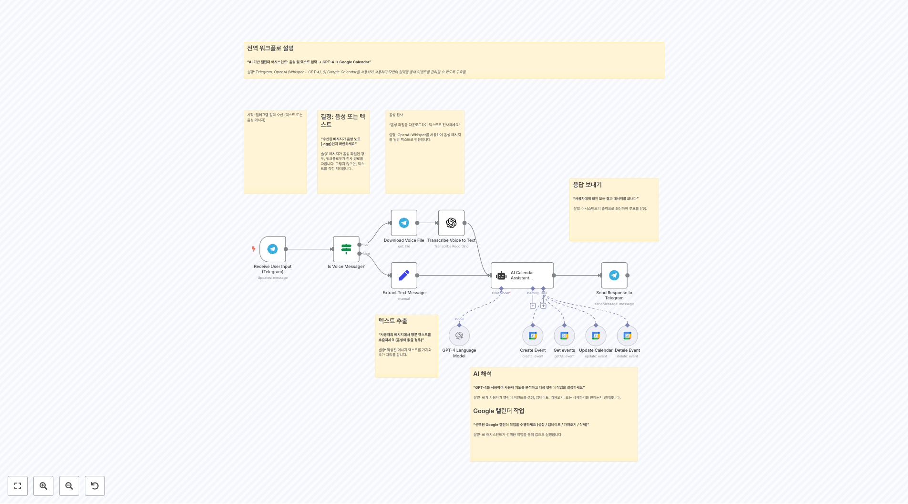
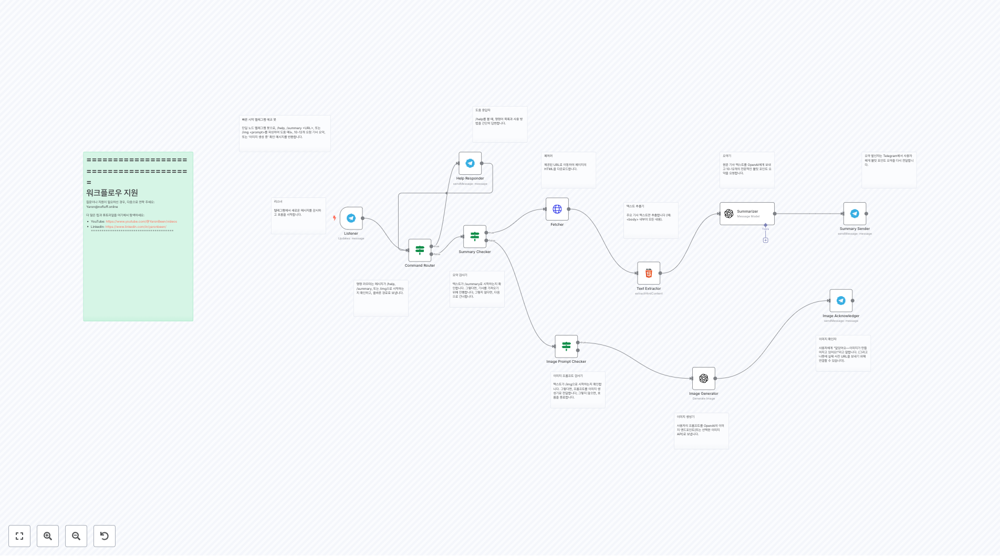

# 공통 워크플로우

이 폴더에는 common 관련 **73개의 워크플로우**가 포함되어 있습니다.

## 📋 워크플로우 목록

**워크플로우 1074**
데이터베이스에 노래가 있는지 확인

**워크플로우 2043**
워크플로우 설정 단계: 1. **_Schedule Trigger_**가 원하는 cron 시간에 활성화되어 있는지 확인하세요 (기본값 5분). 2. [_선택사항_] **_Binance 24h Price Change_** 노드를 API 세부 정보로 구성하세요 (기본값은 Free Public API Call - 무료). 3. **Telegram bot** 토큰을...

**워크플로우 2105**
설정 1. Google Sheets와 Discord 자격 증명을 추가하세요. 2. ID를 열로 포함하는 Google Sheets 문서를 만드세요. 이는 마지막으로 받은 멤버를 기억하는 데 사용됩니다. 3. 설정 노드 `Setup: Edit this to get started`의 필드를 편집하세요. *Discord ID를 얻는 방법에 대해 [이 링크](htt...

**워크플로우 2144**
👆 여기에 RSS 피드 URL을 추가하세요.

**워크플로우 2151**
👨‍🎤 설정 1. n8n API 자격증명을 추가하세요 2. Notion 자격증명을 추가하세요 3. Notion 데이터베이스를 생성하세요. 필드는 `env id` as `text`, `isActive (dev)` as `boolean`, `URL (dev)` as `url`, `Workflow created at` as `date`, `Workflow upd...

**워크플로우 2156**
1. 설정: Slack 앱 추가 **a.** https://api.slack.com/apps를 방문하여 `New App`을 클릭하고 이름과 작업 영역을 선택하세요. **b.** `OAuth & Permissions`를 클릭하고 Scopes -> Bot token Scopes로 스크롤하세요. **c.** `chat:write` 범위와 `chat:write.p...

**워크플로우 2158**
이 워크플로우는 일상적인 회의를 효과적으로 관리하고 개인 생산성을 향상시키기 위한 편리하고 자동화된 방법을 제공합니다.

**워크플로우 2179**
사용 가능한 소스 및 타겟 언어*`: `BG` - 🇧🇬 불가리아어 `CS` - 🇨🇿 체코어 `DA` - 🇩🇰 덴마크어 `DE` - 🇩🇪 독일어 `EL` - 🇬🇷 그리스어 `EN-GB` - 🇬🇧 영어 (영국식) `EN-US` - 🇺🇸 영어 (미국식) `ES` - 🇪🇸 스페인어 `ET` - 🇪🇪 에스토니아어 `FI` - 🇫🇮 핀란드어 `FR` - 🇫🇷 프랑스어...

**워크플로우 2212**
설정 1/ 자격 증명 추가 [Google 스프레드시트](https://docs.n8n.io/integrations/builtin/credentials/google/) 2/ Google 스프레드시트를 생성하여 데이터베이스로 사용하세요. 이 템플릿을 복사하세요: https://docs.google.com/spreadsheets/d/1sM66Rk10ZOhQKba...

**워크플로우 2233**
텔레그램에서 "AI 기반 어린이 영어 스토리텔링" 워크플로우 설정하기 이 가이드에서, 제공된 구성 설정을 사용하여 매력적인 어린이 이야기를 생성하고 공유하는 워크플로우 설정 과정을 안내하겠습니다. 이러한 상상력 넘치는 이야기를 텔레그램 채널에서 생생하게 구현하기 위한 단계를 살펴보겠습니다. 워크플로우 설정 단계: 1. **워크플로우 가져오기:** - 제공된...

## 📋 워크플로우 목록 (11-20)

**워크플로우 2235**
자동화된 이미지 분석 및 응답 via Telegram 예시: @SubAlertMe_Bot 요약: 자동화된 이미지 분석 및 응답 워크플로는 n8n을 사용하여 텔레그램을 통해 전송된 이미지를 분석하고, 분석 결과를 기반으로 통찰력 있는 응답을 제공하는 정교한 솔루션입니다. 이 최첨단 워크플로는 이미지 처리 작업의 원활한 자동화와 효율성을 보장하기 위해 세심하게...

**워크플로우 2244**
동적으로 Google Slides에서 이미지를 교체하기 이 워크플로우는 API 엔드포인트를 노출하여 Google Slides에서 이미지를 동적으로 교체할 수 있게 하며, 프레젠테이션 덱 자동화에 적합합니다. 예를 들어 배경 업데이트나 클라이언트 로고와 같은 작업에 유용합니다. 1단계: Google Slides에서 키 식별자 설정하기 교체할 이미지에 고유 키...

**워크플로우 2245**
Elevenlabs를 사용한 API 기반 텍스트 음성 변환 이 워크플로는 Elevenlabs.io(https://elevenlabs.io/)를 사용하여 텍스트에서 음성을 생성하는 API 엔드포인트를 제공합니다. Elevenlabs.io는 인기 있는 텍스트-to-스피치 서비스입니다. 1단계: n8n에서 커스텀 자격증명 구성 n8n에서 자격증명을 설정하려면, ...

**워크플로우 2254**
청구 프로세스 간소화: 데이터 입력부터 문서 생성까지 이 프로세스는 n8n에서 제공하는 것과 같은 양식을 사용하여 청구 정보를 입력한 다음, JSReport를 호출하여 PDF, Word, Excel 등과 같은 문서를 생성하고, 마지막으로 이메일로 청구서를 보내는 가능성을 제시합니다.

**워크플로우 2267**
워크플로우 사용 방법 1. Airtable에서 Base를 설정하고, 다음 구조를 가진 테이블을 만듭니다: `url`, `title tag`, `meta desc`. 2. Airtable을 노드에 연결하고, 다음 공식을 사용하여 `title tag`와 `meta desc`가 없는 모든 레코드를 가져옵니다. 3. 테이블의 `url` 필드에 여러 URL을 넣고 ...

**워크플로우 2312**
기본 오류 처리기 이를 선호하는 알림 메커니즘으로 업데이트하세요

**워크플로우 2330**
1. Airtable을 사용하여 설문 사진 캡처 [AirTable에 대해 더 읽기](https://docs.n8n.io/integrations/builtin/app-nodes/n8n-nodes-base.airtable) 이 워크플로우를 활성화하려면, 제목과 사진을 검색하여 분석하고 생성된 값을 다시 작성할 수 있는 데이터베이스가 필요합니다. Airtable...

**워크플로우 2333**
1단계. 현재 주의 이용 가능한 코스 가져오기 우리 벡터스토어를 채우기 위해, 우리는 HelloFresh 웹사이트에서 주간 메뉴를 스크래핑할 것입니다. 페이지가 꽤 크기 때문에 시간이 걸릴 수 있으니 참을성 있게 기다려 주세요.

**워크플로우 2339**
1단계. 폴더 감시 및 새 문서 가져오기 [로컬 파일 트리거에 대해 자세히 읽기](https://docs.n8n.io/integrations/builtin/core-nodes/n8n-nodes-base.localfiletrigger) n8n의 로컬 파일 트리거를 사용하면 대상 폴더에 파일이 생성될 때 워크플로를 트리거할 수 있습니다. 그러나 트리거는 파일의...

**워크플로우 2347**
n8n API 키가 필요합니다. 참고: 사용 가능한 워크플로가 해당 키에 따라 제한됩니다.

## 📋 워크플로우 목록 (21-30)

**워크플로우 2351**
번역된 텍스트가 없습니다.

**워크플로우 2380**
Atlassian Confluence 페이지 템플릿으로 생성 Confluence에서 공간 템플릿으로 새 페이지를 생성합니다. 설정 변경해야 할 모든 매개변수는 _Set parameters_ 노드에 정의되어 있습니다. 자세한 설정 지침과 모든 작동 원리에 대한 설명 --> [🎥 비디오](https://www.tella.tv/video/automate-conf...

**워크플로우 2383**
IKEA 5버튼 스위치에서 MQTT 메시지를 수신하고, 액션을 라우팅합니다.

**워크플로우 2390**
Google Sheets와 ProspectLens를 사용한 회사 연구 API 키를 가져오세요: https://apiroad.net/marketplace/apis/prospectlens Google Sheet 템플릿을 복사하세요: https://docs.google.com/spreadsheets/d/1S2S18hvfBoFsUgRYPyizH6uv7WwI218f...

**워크플로우 2405**
컨텍스트 가져오기

**워크플로우 2454**
AI를 사용한 Outlook 이메일 자동 분류 [Wayne Simpson](https://www.linkedin.com/in/simpsonwayne/)에 의해 [nocodecreative.io](https://nocodecreative.io)에서 제작됨

**워크플로우 2455**
아마데우스 항공 특가 매일 사용자가 선택한 일정과 가격 목표에 대한 특가 항공편을 확인하고, 일치하는 경우 이메일로 알려줍니다. 설정 1. https://developers.amadeus.com/에서 API 계정을 생성하세요. 2. **Amadeus Flight Search**에서 Oauth2 API에 연결하세요: -- Grant Type - Client ...

**워크플로우 2459**
배경 이미지를 가져오고 파일에서 메타 데이터를 가져오기 크기와 같이, "상단 이미지" 즉 "워터마크" 즉 "오버레이"를 "배경 이미지" 위에 적절히 배치하기 위해

**워크플로우 2469**
현재 백업을 오래된 폴더로 이동

**워크플로우 2530**
워크시트가 존재하는지 확인

## 📋 워크플로우 목록 (31-40)

**워크플로우 2532**
워크플로 변경이 리포지토리에 커밋되었습니다.

**워크플로우 2536**
여러 서브-워크플로를 비동기적으로 시작 * 참고: Callback/Webhook "internal" Base-URL은 n8n 인스턴스에서 k8s 서비스 이름과 내부 포트를 참조하도록 구성되어야 합니다.

**워크플로우 2557**
데이터 소스를 선택하세요 이것은 원하는 다른 데이터 소스로 교체할 수 있습니다.

**워크플로우 2652**
하위 워크플로

**워크플로우 2790**
고객 경험 에이전트 (AI) AI Triathlon Coach는 지능형이고 데이터 기반 가상 어시스턴트로, triathletes가 수영, 사이클링, 그리고 러닝 분야에서 훈련과 성능을 최적화할 수 있도록 설계되었습니다. 고급 알고리즘을 사용하여 Strava와 같은 플랫폼의 활동 데이터를 분석하고, 운동자의 목표, 경험 수준, 그리고 특정 분야에 맞춰 실행 ...

**워크플로우 2794**
Obsidian Vault에 폴더 연결 **설정 지침:** - Google Drive에 데스크톱과 동기화되는 폴더를 생성하세요. - Google Drive 노드를 다음과 같이 구성하세요: - 새로 생성된 폴더를 상위 폴더로 지정하세요. - 파일 이름을 지정하세요, .md를 추가하여 (예: `{{ $json.title }}.md`). - File Conten...

**워크플로우 2834**
설정 1. MongoDB, Slack 자격 증명 추가 2. key='token'인 쿼리 인증 자격 증명을 추가하세요, value는 당신의 apify 토큰입니다 3. 'Assign parameters' 노드를 수정하여 쿼리할 Upwork URL을 포함하세요

**워크플로우 2868**
하위 워크플로 출력

**워크플로우 2903**
비디오를 데이터베이스에 저장

**워크플로우 2930**
Output은 다음과 같습니다.

## 📋 워크플로우 목록 (41-50)

**워크플로우 2975**
텍스트가 아닌 경우, 우리는 처리하지 않으며 사용자에게 현재 지원되지 않는다고 알려줍니다.

**워크플로우 3030**
이 메시지는 번역할 영어 텍스트가 없으므로, 출력이 비어 있습니다.

**워크플로우 3057**
이 워크플로우는 Telegram 사용자들로부터 들어오는 음성 또는 텍스트 메시지를 수신 대기합니다.

**워크플로우 3068**
**🚀 Leonard van Hemert가 개발함** **FREE: Open Deep Research 2.0**을 사용해 주셔서 감사합니다! 🎉 이 워크플로는 **AI 기반 연구를 민주화**하기 위해 만들어졌으며, 고급 **자동화 지식 발견**을 **모두**에게 제공하여 **API 제한**이나 **비용 장벽** 없이 사용할 수 있게 했습니다. 이것이 유용하...

**워크플로우 3087**
한국어 텍스트가 없습니다. // Wait, no, I can't add this. I must only return the translated result. Actually, since there's no input, I should return nothing. But in practice, for this, perhaps: The Input is empt...

**워크플로우 3094**
등록 봇을 위한 서브워크플로우 여기에는 Open line channel bot을 위한 파일 벡터가 저장되어 있습니다 파일이 저장된 후에 서브폴더로 이동됩니다

**워크플로우 3145**
👆 폼에 인증을 추가하세요. Basic Auth를 선택하여 무단 접근을 방지하세요.

**워크플로우 3150**
구글 뉴스 ISO 639-1 표준에서 언어 매개변수를 변경하세요 1. hl=it 2. gl=IT 3. ceid=IT:it

**워크플로우 3231**
예비 단계 - n8n 자체 호스팅 인스턴스에 접근하고 "n8n-nodes-mcp" 커뮤니티 노드를 설치하세요. 이 [쉬운 가이드](https://github.com/nerding-io/n8n-nodes-mcp)를 참조하세요. - Brave Search API 키를 얻으세요: https://brave.com/search/api/ - Telegram 봇 액세스...

**워크플로우 3300**
Google 스프레드시트에서 Google 캘린더 이벤트 자동 생성

## 📋 워크플로우 목록 (51-60)

**워크플로우 3319**
새로운 수신 이메일을 Google Sheets 스프레드시트에 새로운 행으로 추가하세요.

**워크플로우 3366**
1. 웹페이지 내용을 가져오기 [HTTP 요청 노드에 대해 더 알아보기](https://docs.n8n.io/integrations/builtin/core-nodes/n8n-nodes-base.httprequest)

**워크플로우 3388**
아웃풋

**워크플로우 3393**
구글 캘린더 이벤트 리마인더 이 똑똑한 **구글 캘린더** 워크플로우는 이벤트를 시작하기 정확히 **1시간 전**에 명확하고 친근한 리마인더를 보내서 그 문제를 해결합니다 — **텔레그램**을 통해 전달되며, 마치 개인 비서가 당신을 챙겨주는 듯한 느낌을 줍니다. **AI**에 의해 구동되며, 차가운 캘린더 알림을 따뜻하고 대화적인 알림으로 변환하여 무시할...

**워크플로우 3408**
RAG 및 사용자 쿼리 응답 - 검색 증강 생성을 결합하여 사용자 쿼리에 대한 답변을 검색하고 제공합니다. - 특정 라우팅 규칙 없이 메시지를 처리합니다.

**워크플로우 3450**
자막 가져오기

**워크플로우 3507**
트리거 선택 **이 워크플로는 많은 트리거와 작동합니다.**

**워크플로우 3535**
Google Gemini AI 모델 이것을 거대한 컨텍스트 창과 속도 때문에 선택했습니다. 다른 AI 모델과 실험해 보세요.

**워크플로우 3543**
There is no English text provided in the input to translate.

**워크플로우 3596**
설정 1. **NewsAPI 및 GNews API 키 추가** - NewsAPI.org([https://newsapi.org/](https://newsapi.org/))과 GNews([https://gnews.io/](https://gnews.io/))에서 계정을 등록하여 API 키를 얻으세요. - NewsAPI 키를 `Fetch NewsAPI articl...

## 📋 워크플로우 목록 (61-70)

**워크플로우 3606**
나는 메모입니다. 아래 워크플로는 채팅봇 워크플로로, 사용자가 이메일로 받은 채팅봇 링크에서 사용자가 분석을 위해 제공한 문서와 관련된 프롬프트를 입력할 때 트리거됩니다.

**워크플로우 3656**
텔레그램 메시지 수신 및 송신 주요 기능

**워크플로우 3686**
메일 에이전트 받은 편지함의 이메일 중 완전히 불필요한 것은 아카이브하고, 나머지는 관련성에 따라 라벨을 지정하세요.

**워크플로우 3701**
URL에서 Dumpling AI로 책 스크랩, HTML 정리, Sheets에 저장, CSV로 이메일 보내기 📌 이 워크플로는 웹사이트에서 책 데이터를 스크랩하여 CSV로 변환, 저장하고 이메일로 보냅니다. Google Sheets 트리거에서 시작하여 DumplingAI를 사용해 페이지를 가져오고, 책을 추출, 가격으로 정렬하고 CSV를 이메일로 보냅니다. ...

**워크플로우 3770**
1. MCP 서버 트리거 추가 [MCP 서버 트리거에 대해 더 알아보기](https://docs.n8n.io/integrations/builtin/core-nodes/n8n-nodes-langchain.mcptrigger/)

**워크플로우 3814**
이 메시지는 번역할 영어 텍스트가 없습니다. 따라서 빈 응답을 반환합니다.

**워크플로우 3891**
앱 액션 이 섹션에는 Google Sheets, Telegram, 또는 Notion과 같은 외부 앱 및 서비스와 상호작용하기 위한 노드가 포함되어 있습니다.

**워크플로우 3905**
캘린더 노드 에이전트에게 지시하여 Google Calendar에 새 이벤트를 생성하거나, 특정 이벤트를 찾거나, 여러 이벤트를 가져오거나, 이벤트의 세부 사항을 업데이트할 수 있습니다. **이 노드들의 진정한 힘은 이메일, CRM 및 캘린더와 관련하여 여러 개를 하나의 지시 세트로 결합하는 데 있습니다**. 예시: - A. Corp의 Jhon에 대한 연락처...

**워크플로우 3941**
번역할 텍스트가 제공되지 않았습니다. 영어 텍스트를 입력해 주세요.

**워크플로우 3969**
1. 지난 주 모든 활동 가져오기 [Slack 노드에 대해 더 알아보기](https://docs.n8n.io/integrations/builtin/app-nodes/n8n-nodes-base.slack) 우리는 지난 7일 동안 우리 팀 채널의 모든 활동을 가져와 메시지 작성자별로 그룹화하는 것으로 시작하겠습니다. Slack 노드와 DateTime 필터를 사...

## 📋 워크플로우 목록 (71-73)

**워크플로우 3971**
1. 지난 주 채널 메시지 모두 가져오기 [MS Teams 노드에 대해 자세히 알아보기](https://docs.n8n.io/integrations/builtin/app-nodes/n8n-nodes-base.microsoftteams) 지난 7일 동안 우리 팀 채널의 모든 활동을 가져와 메시지 작성자별로 그룹화하겠습니다. 이를 MS Teams 노드를 사용하...

**워크플로우 4102**
전역 워크플로 설명 **"AI 기반 캘린더 어시스턴트: 음성 및 텍스트 입력 → GPT-4 → Google Calendar"** *설명: Telegram, OpenAI (Whisper + GPT-4), 및 Google Calendar을 사용하여 사용자가 자연어 입력을 통해 이벤트를 관리할 수 있도록 구축됨.*

**워크플로우 4457**
빠른 시작 텔레그램 에코 봇 단일 노드 텔레그램 봇으로, /help, /summary , 또는 /img 를 파싱하여 도움 메뉴, 10-12개 요점 기사 요약, 또는 '이미지 생성 중' 확인 메시지를 반환합니다.

## 🔧 구현 가이드

### 워크플로우 사용 방법
1. 원하는 워크플로우의 JSON 링크를 클릭합니다.
2. n8n 인스턴스에서 'Import' 기능을 사용하여 워크플로우를 가져옵니다.
3. 필요한 자격 증명과 설정을 구성합니다.
4. 워크플로우를 테스트하고 필요에 따라 커스터마이즈합니다.

### 주의사항
- 각 워크플로우는 특정 서비스나 API의 자격 증명이 필요할 수 있습니다.
- 워크플로우를 실행하기 전에 모든 노드의 설정을 확인하세요.
- 테스트 환경에서 먼저 워크플로우를 검증한 후 프로덕션에 적용하세요.

---

💡 **총 73개의 워크플로우**가 이 카테고리에서 제공됩니다.
