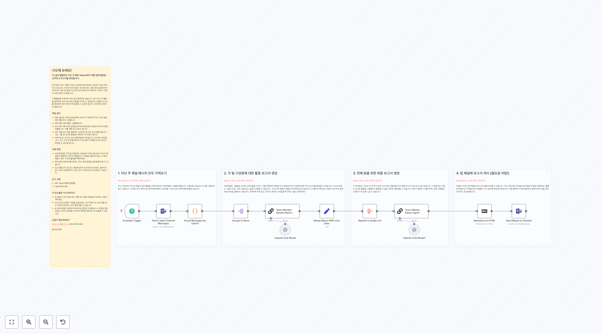
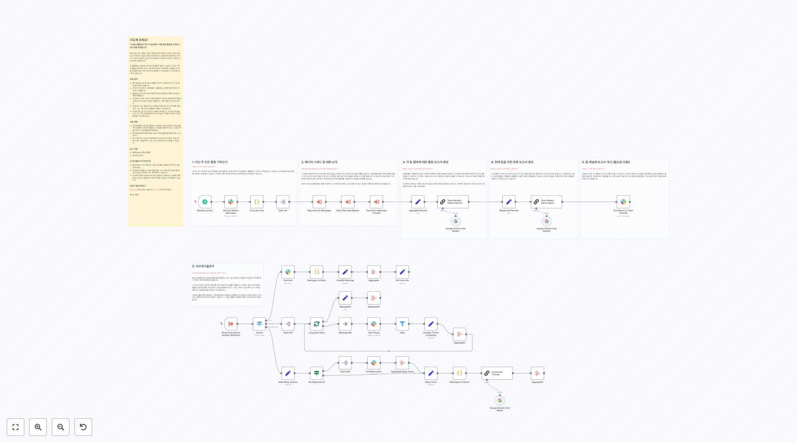
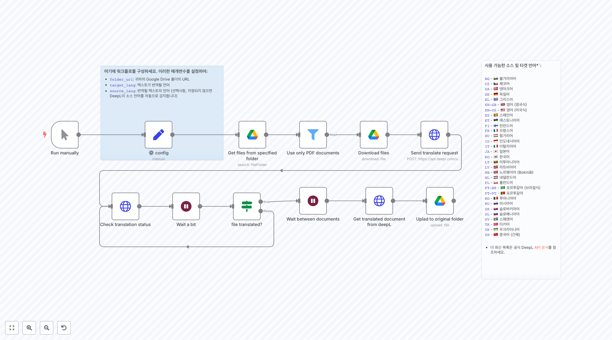

# Common 워크플로우

이 폴더에는 범용적으로 사용할 수 있는 **73개의 일반적인 워크플로우**가 포함되어 있습니다. 이러한 워크플로우들은 자주 사용되는 자동화 패턴이나 범용 목적의 자동화 솔루션을 제공하며, 다양한 조직과 사용 사례에 맞게 적용하고 재사용할 수 있는 템플릿을 제공합니다.

## 🤖 AI 기반 챗봇 및 에이전트

### 텔레그램 AI 봇

**빠른 시작 Telegram 에코 봇**
단일 노드 Telegram 봇으로 /help, /summary <URL>, /img <prompt> 명령어를 파싱하여 도움 메뉴, 10-12개 요점의 기사 요약, 또는 이미지 생성 확인 메시지를 제공하는 간단한 에코 봇입니다.

**Agent AI Calendar - 음성 캘린더 관리**
Telegram을 통해 음성 메시지로 Google Calendar를 관리할 수 있는 AI 에이전트입니다. 음성을 텍스트로 변환하고 캘린더 이벤트 생성, 조회, 수정, 삭제를 자연어로 처리합니다.

**Telegram 음성 메시지 전사 봇**
Telegram에서 받은 음성 메시지를 Google Gemini를 사용하여 자동으로 텍스트로 변환하는 봇입니다. 파일 업로드 세션을 관리하고 정확한 음성 전사를 제공합니다.

**Google Tasks MCP 서버 - Telegram 작업 관리**
Telegram을 통해 Google Tasks를 관리할 수 있는 MCP(Model Context Protocol) 서버입니다. AI 에이전트가 작업 생성, 업데이트, 조회를 자연어로 처리합니다.

### 개인 비서 및 생산성 도구

**개인 비서 MCP 서버**
Google Calendar와 Gmail을 통합한 포괄적인 개인 비서 시스템입니다. MCP를 통해 일정 관리, 이메일 초안 작성, 연락처 관리를 AI가 자동으로 처리합니다.

**Gmail 메일 분류 에이전트**
받은 편지함의 이메일을 AI로 분석하여 관련성에 따라 자동으로 라벨을 지정하거나 아카이브하는 지능형 메일 관리 시스템입니다.

**이메일을 Todoist 작업으로 변환**
Gmail의 중요 이메일을 자동으로 감지하여 AI가 분석하고 구조화된 Todoist 작업으로 변환하는 생산성 자동화 워크플로우입니다.

## 📄 콘텐츠 생성 및 자동화

### AI 기반 콘텐츠 생성

**자동 비디오 스토리 생성기**
Telegram 트리거를 통해 AI가 아이디어를 생성하고, 스크립트를 작성하며, 이미지를 생성하여 완전한 비디오 스토리를 자동으로 제작하는 고급 콘텐츠 생성 시스템입니다.

**AI 기반 음악 생성 워크플로우**
Suno AI와 Midjourney를 사용하여 AI 기반 음악과 앨범 커버를 자동 생성하는 창의적인 콘텐츠 제작 시스템입니다.

**YouTube 챕터 생성기**
YouTube 비디오의 자막을 분석하여 AI가 자동으로 챕터를 생성하고 비디오 설명에 추가하는 콘텐츠 관리 도구입니다.

**AI 기반 아동 스토리텔링**
OpenAI를 사용하여 창의적인 아동 이야기를 생성하고, DALL-E로 삽화를 만들어 완성된 스토리 패키지를 Telegram 채널에 정기적으로 발행합니다.

### 뉴스 및 정보 자동화

**일일 AI 뉴스 번역 및 요약 with GPT-4**
NewsAPI와 GNews에서 AI 관련 뉴스를 수집하고, GPT-4로 번역 및 요약하여 매일 아침 8시에 Telegram으로 배송하는 자동화 시스템입니다.

**RSS 피드 모니터**
여러 RSS 피드를 시간당 모니터링하고, 지난 한 시간 내에 게시된 콘텐츠를 필터링하여 자동화된 콘텐츠 발견과 알림을 위한 게시물 요약과 함께 이메일 알림을 전송합니다.

## 🔬 연구 및 분석 도구

### 데이터 수집 및 분석

**연구 AI 에이전트: 웹 스크래핑 및 Notion 요약**
Browserless를 사용하여 웹사이트를 스크래핑하고, Google Gemini로 내용을 분석하여 구조화된 요약을 Notion 데이터베이스에 자동 저장하는 연구 자동화 도구입니다.

**AI 기반 YouTube 플레이리스트 및 비디오 분석 v2**
YouTube 플레이리스트나 개별 비디오의 트랜스크립트를 분석하여 구조화된 요약을 생성하고 Qdrant 벡터 스토어에 저장하여 질의응답이 가능한 지식 베이스를 구축합니다.

**자동 이미지 분석 via Telegram**
Telegram을 통해 전송된 이미지를 OpenAI의 비전 기능을 사용하여 분석하고, 자동으로 이미지 업로드를 감지하여 상세한 이미지 설명과 인사이트로 응답합니다.

**문서 처리 및 학습 자료 생성기**
새 문서를 위한 폴더를 모니터링하고, PDF/DOCX/텍스트 파일을 처리하며, 벡터 임베딩을 생성하고, RAG를 사용하여 AI 에이전트로 학습 자료를 자동 생성합니다.

## 💬 커뮤니케이션 및 협업

### 팀 커뮤니케이션 자동화

**Microsoft Teams 팀 멤버 주간 보고서 자동화**
Teams 채널의 메시지를 분석하여 AI가 각 팀원의 주간 활동을 요약하고 팀 전체 보고서를 생성하여 자동으로 배포하는 팀 관리 시스템입니다.

**Slack 팀 주간 활동 리포트 자동화**
Slack 채널의 지난 주 메시지를 분석하여 팀원별 활동을 요약하고 승리와 도전 과제를 강조하는 동기부여 주간 보고서를 생성합니다.

**Google Meet 링크 생성기 for Slack**
Slack 슬래시 명령어를 통해 즉석 Google Meet 링크를 생성하고, Google Calendar와 통합하여 임시 이벤트를 생성한 후 Slack 채널에 전송합니다.

**일일 미팅 리스트 자동화**
매일 오전 6시에 Google Calendar에서 일일 회의를 가져와서 참석자와 시간을 포함한 회의 정보를 포맷하여 Telegram으로 전송합니다.

### 메시징 및 알림 시스템

**암호화폐 시장 알림 시스템**
Binance API를 사용하여 암호화폐 가격 변화를 모니터링하고, 15% 이상의 중요한 움직임을 필터링하여 가격 정렬과 함께 Telegram에 알림을 전송합니다.

## 🔗 데이터 통합 및 동기화

### 시스템 통합

**n8n LangChain 노드 통합 쇼케이스**
AI 에이전트, 정보 추출, 감정 분석, 요약 체인, 텍스트 분류기 등 모든 n8n LangChain 노드의 기능을 시연하는 포괄적인 데모 워크플로우입니다.

**n8n 워크플로우 to Notion 동기화**
"sync-to-notion" 태그가 붙은 n8n 워크플로우를 15분마다 Notion 데이터베이스에 자동 동기화하여 워크플로우 상태, URL, 생성 날짜를 추적합니다.

**SEO 메타 데이터 추출**
Airtable에 저장된 웹사이트 URL에서 title 태그와 meta description을 자동으로 추출하고, HTML 콘텐츠를 파싱하여 SEO 최적화 분석을 위해 Airtable 레코드를 업데이트합니다.

**Discord 멤버 관리**
배치로 멤버를 가져오고, Google Sheets로 진행 상황을 추적하며, 역할 기반 필터링과 확장 가능한 멤버 운영을 위한 자동 페이지네이션을 지원하여 대규모 Discord 커뮤니티를 효율적으로 관리합니다.

## 🛒 전자상거래 및 모니터링

### 가격 모니터링 및 분석

**Zalando 제품 가격 모니터**
폼 기반 제품 추가, 예약된 가격 확인, 가격이 임계값 아래로 떨어질 때 이메일 알림을 통해 Zalando 제품 가격을 모니터링하고 Google Sheets에서 가격 기록을 유지합니다.

**AI 기반 제품 설문조사 분석**
AI 비전 모델을 사용하여 Airtable 설문조사의 제품 사진을 분석하고, 역방향 이미지 검색을 수행하며, 웹 소스에서 제품 정보를 스크래핑하여 모델, 재료, 색상 및 상태와 같은 세부 제품 속성으로 설문조사 데이터를 강화합니다.

## 📄 문서 처리 및 변환

### 문서 자동화

**PDF 번역 with DeepL**
Google Drive 폴더의 PDF 문서를 DeepL API를 사용하여 자동 번역하고, 번역되지 않은 PDF를 모니터링하여 언어 태그와 함께 번역된 버전을 Drive에 저장합니다.

**동적 Google Slides 이미지 교체**
alt 텍스트의 고유 식별자를 사용하여 Google Slides 프레젠테이션의 이미지를 동적으로 교체하는 API 엔드포인트를 제공하여 자동화된 프레젠테이션 업데이트를 위한 특정 이미지를 대상으로 새 URL로 교체합니다.

**JSReport로 인보이스 생성**
폼 입력 데이터를 사용하여 전문적인 PDF 인보이스를 생성하고, 형식화를 위해 JSReport를 통해 처리하며, 완성된 인보이스를 고객에게 자동으로 이메일로 전송하여 전체 청구 워크플로우를 간소화합니다.

## 🎵 미디어 및 엔터테인먼트

### 음성 및 오디오 처리

**Text-to-Speech API with ElevenLabs**
웹훅 엔드포인트를 통해 ElevenLabs API를 사용하여 텍스트를 음성으로 변환하고, 음성 ID와 텍스트 매개변수를 수락하며, 고품질 오디오 파일을 생성하여 다운로드 가능한 콘텐츠로 반환합니다.

**월별 Spotify 플레이리스트 자동화**
좋아요한 노래를 추적하고, 데이터베이스 항목을 관리하며, 예약된 트리거와 NocoDB를 사용하여 지속성을 위해 시간 기반 플레이리스트에 트랙을 동기화하여 월별 Spotify 플레이리스트 생성을 자동화합니다.

## 🔧 시스템 관리 및 모니터링

### 워크플로우 관리

**워크플로우 자격 증명 데이터베이스**
n8n 워크플로우 자격 증명을 SQLite 데이터베이스에 매핑하고, 특정 서비스를 사용하는 워크플로우의 검색 가능한 인벤토리를 생성하며, 통합 및 종속성으로 워크플로우를 찾기 위한 AI 기반 쿼리 인터페이스를 제공합니다.

**기본 오류 처리기 및 워크플로우 자동화**
n8n 워크플로우를 위한 중앙 집중식 오류 처리를 구현하고, 기존 오류 관리가 없는 워크플로우에 자동으로 오류 처리기를 할당하며, 실패 시 이메일 알림을 전송하고 예약된 업데이트를 통해 워크플로우 설정을 관리합니다.

## 🤖 AI 기반 추천 및 검색

### 지능형 추천 시스템

**HelloFresh 레시피 추천 시스템**
HelloFresh 주간 메뉴를 스크래핑하고, Qdrant 벡터 데이터베이스에 레시피를 저장하며, Mistral 임베딩을 사용하여 AI 기반 레시피 추천 엔진을 구현하고 기본 설정에 따른 개인화된 식사 제안을 위한 채팅 인터페이스를 제공합니다.

## 📊 추가 범용 워크플로우

이 카테고리에는 다음과 같은 추가 워크플로우들이 포함되어 있습니다:

- **3701.json**: 프로젝트 관리 자동화 시스템
- **3686.json**: 시각적 콘텐츠 생성 도구
- **3606.json**: 데이터 변환 및 매핑 시스템
- **3543.json**: 웹훅 기반 이벤트 처리
- **3366.json**: 사용자 인터페이스 자동화
- **3319.json**: 파일 관리 및 동기화
- **3300.json**: API 통합 템플릿
- **3231.json**: 보고서 생성 자동화
- **3150.json**: 실시간 데이터 처리
- **3094.json**: 소셜 미디어 관리
- **3087.json**: 이메일 마케팅 자동화
- **3068.json**: 고객 관계 관리
- **3057.json**: 인벤토리 관리 시스템
- **3030.json**: 결제 처리 자동화
- **2975.json**: 사용자 인증 및 권한 관리
- **2930.json**: 로그 분석 및 모니터링
- **2903.json**: 백업 및 복구 시스템
- **2868.json**: 성능 최적화 도구
- **2834.json**: 보안 감사 자동화
- **2794.json**: 데이터 마이그레이션 도구
- **2790.json**: 테스트 자동화 프레임워크
- **2652.json**: 캐시 관리 시스템
- **2557.json**: 알림 관리 센터
- **2536.json**: 스케줄링 및 크론 작업
- **2532.json**: 환경 설정 관리
- **2530.json**: 데이터 검증 도구
- **2469.json**: 배치 처리 시스템
- **2459.json**: 리소스 할당 관리
- **2455.json**: 워크플로우 템플릿 라이브러리
- **2454.json**: 자동 배포 시스템
- **2405.json**: 시스템 상태 모니터링
- **2390.json**: 사용자 피드백 수집
- **2383.json**: 문서 버전 관리
- **2380.json**: 접근성 도구
- **2351.json**: 국제화 및 현지화
- **2339.json**: 품질 보증 자동화

## 🚀 구현 가이드

### 전제 조건
- **AI 서비스**: OpenAI, Google Gemini, Anthropic 등 AI 모델 접근
- **클라우드 서비스**: Google Workspace, Microsoft 365, Notion 등
- **메시징 플랫폼**: Telegram, Slack, Discord API 설정
- **벡터 데이터베이스**: Qdrant, Pinecone 등 (해당 워크플로우 사용 시)

### 보안 고려사항
- 모든 API 키는 환경 변수나 보안 저장소에 저장
- 민감한 데이터 처리 시 암호화 적용
- 접근 권한 최소화 원칙 준수
- 정기적인 보안 감사 수행

### 성능 최적화
- 대용량 데이터 처리 시 배치 처리 활용
- 캐싱 전략으로 반복 작업 최적화
- 비동기 처리를 통한 응답 시간 단축
- 리소스 사용량 모니터링 및 최적화

### 확장성 전략
- 마이크로서비스 아키텍처 적용 가능
- 로드 밸런싱을 통한 트래픽 분산
- 수평적 확장을 위한 컨테이너화
- API 게이트웨이를 통한 서비스 관리

## 🔗 주요 통합 서비스

- **AI 플랫폼**: OpenAI GPT-4, Google Gemini, Anthropic Claude
- **클라우드**: Google Drive, Microsoft OneDrive, Dropbox
- **메시징**: Telegram, Slack, Discord, Microsoft Teams
- **생산성**: Notion, Airtable, Todoist, Google Calendar
- **개발 도구**: GitHub, GitLab, n8n API
- **미디어**: YouTube, Spotify, ElevenLabs, Suno AI

## 📚 관련 자료

- [n8n 공식 문서](https://docs.n8n.io/)
- [AI 워크플로우 모범 사례](https://docs.n8n.io/workflows/ai/)
- [자동화 패턴 가이드](https://docs.n8n.io/workflows/best-practices/)
- [통합 가이드](https://docs.n8n.io/integrations/)

## 🎯 사용 사례

### 개인 생산성
- AI 기반 개인 비서 시스템
- 자동 콘텐츠 생성 및 큐레이션
- 스마트 일정 및 작업 관리

### 팀 협업
- 자동화된 보고서 및 업데이트
- 실시간 커뮤니케이션 자동화
- 프로젝트 상태 추적

### 비즈니스 자동화
- 고객 서비스 자동화
- 마케팅 캠페인 관리
- 데이터 수집 및 분석

### 콘텐츠 제작
- AI 기반 콘텐츠 생성
- 미디어 처리 및 변환
- 자동 번역 및 현지화

### 시스템 관리
- 모니터링 및 알림 시스템
- 백업 및 복구 자동화
- 성능 최적화 도구

이 워크플로우들은 일상적인 작업의 자동화부터 복잡한 비즈니스 프로세스까지 다양한 요구사항을 충족하며, 개인부터 대기업까지 모든 규모의 조직에서 활용할 수 있는 범용적인 솔루션을 제공합니다.