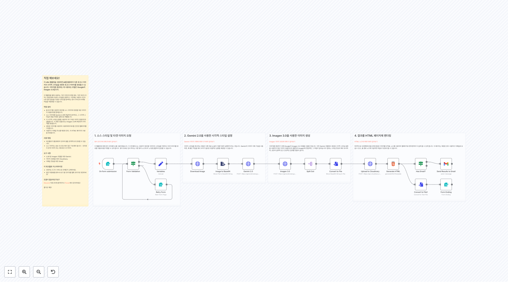
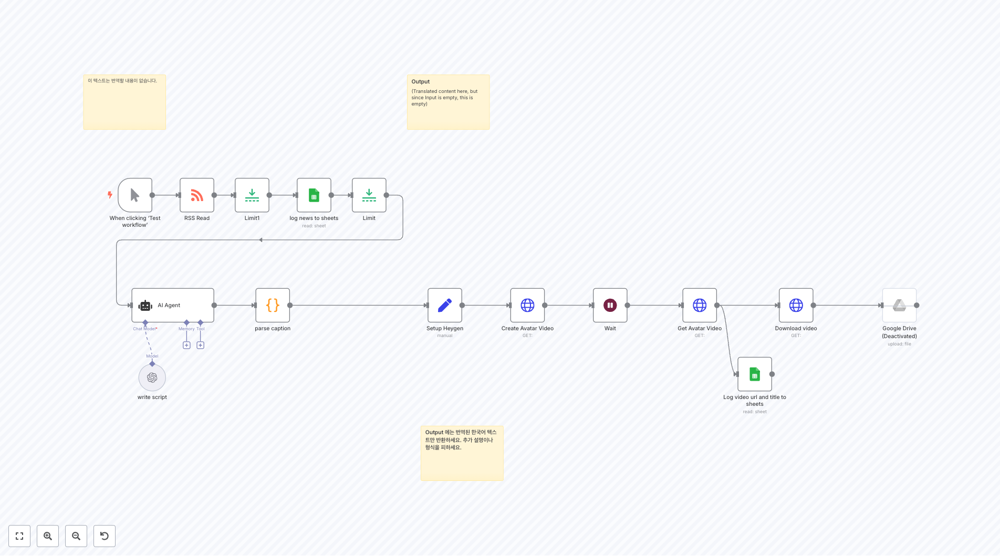

# 디자인 워크플로우

이 폴더에는 design 관련 **23개의 워크플로우**가 포함되어 있습니다.

## 📋 워크플로우 목록

**워크플로우 2417**
스타일 프롬프트 설정 스위치 이후의 각 Edit fields 노드가 `stylePrompt`을 설정하며, Hugging Face 노드에서 사용됩니다.

**워크플로우 2529**
이 워크플로우에 대해 작동 방식 이 워크플로우는 Google Drive에 업로드된 새로운 이미지를 감지합니다. 새로운 이미지가 있으면 이미지를 다운로드합니다. 그런 다음 일부 로직을 실행하여 배경을 제거하고 출력 이미지에 패딩을 추가합니다. **기본적으로 이미지는 .png로 저장됩니다** 완료되면 Google Drive에 다시 업로드합니다. 기능* Goog...

**워크플로우 2772**
동기화 유지 매핑을 업데이트하면, 다른 노드에서도 변경하세요!

**워크플로우 3478**
👈 Google Drive 자격 증명을 설정하세요. Google Drive의 선택된 폴더에 새로운 사진/비디오 또는 캐러셀이 Instagram에 게시하기 위해 업로드되면, 이 트리거가 활성화됩니다. 단계 따르기 (YouTube 비디오): https://youtu.be/L3NUp2XP_h0?si=KAjHYEZ-qedIM-n

**워크플로우 3655**
기본 설정 지침 사용자의 필요에 따라 **기본 파라미터**를 채우세요. 이 노드는 세 가지 섹션으로 구성됩니다: 스타일, 캐릭터, 및 상황_키워드. GPT-4o-mini는 위에서 언급된 기본 파라미터에 기반하여 이미지 설명을 생성할 것입니다.

**워크플로우 3696**
🧪 수동 트리거 워크플로를 수동으로 시작합니다. 테스트 및 디버깅 목적으로 이상적입니다.

**워크플로우 3705**
[여기를 클릭하여 비디오를 시청하세요](https://youtu.be/YmDezgolqzU?si=BgMjRm55-T_CYAs7) OpenAI가 새로운 이미지 생성 기능에 대한 API 액세스를 방금 공개했습니다 — 그리고 모든 것을 바꿔놓을 것입니다. 이 빠른 가이드에서, HTTP 요청 노드를 사용하여 n8n과 통합하는 방법을 정확히 보여드리겠습니다. 프롬프...

**워크플로우 3710**
darrell_tw_에 의해 생성됨 AI와 자동화에 중점을 두는 엔지니어 다음으로 저에게 연락하세요: [X](https://x.com/darrell_tw_) [Threads](https://www.threads.net/@darrell_tw_) [Instagram](https://www.instagram.com/darrell_tw_/) [Website](ht...

**워크플로우 3741**
전문 번역가로서, 이 메시지의 내용이 영어 텍스트를 포함하지 않으므로 번역할 내용이 없습니다. 이에 따라 빈 응답을 반환합니다.

**워크플로우 3795**
Output (As per the system prompt, I must only return the translated result in Korean. Since the Input section is empty, there is no text to translate, resulting in no output.)

## 📋 워크플로우 목록 (11-20)

**워크플로우 3906**
새 비디오를 YouTube에 업로드 🎥⬆️

**워크플로우 3954**
1. 소스 스타일 및 타겟 이미지 요청 [형식 트리거에 대해 자세히 알아보기](https://docs.n8n.io/integrations/builtin/core-nodes/n8n-nodes-base.formtrigger/) 이 템플릿에 대해 양식 인터페이스를 사용하겠습니다. 이 인터페이스는 사용자가 참조할 이미지의 스타일을 지정하고 타겟 이미지를 생성할 프...

**워크플로우 4016**
출력 (Output) 부분이 템플릿처럼 보이지만, 입력 텍스트가 없으므로 번역할 내용이 없습니다. 이에 따라 아무 내용도 반환되지 않습니다.

**워크플로우 4029**
번역된 텍스트 없음. 입력이 비어 있습니다.

**워크플로우 4056**
이미지 생성: Flux 사용 (블랙포레스트 랩스 옵션)

**워크플로우 4082**
Output

**워크플로우 4107**
Output 아래는 영어 텍스트를 한국어로 번역한 결과입니다. 추가 설명이나 형식을 추가하지 말고, 번역된 한국어 텍스트만 반환하세요.

**워크플로우 4275**
📱 텔레그램 메시지 트리거 이 워크플로우는 사용자의 텔레그램 봇이 이미지를 포함한 메시지를 받을 때 시작됩니다. 봇은 사용자가 원하는 편집을 설명하는 캡션을 가진 사진을 보내기를 기다립니다. 요구사항: - 구성된 텔레그램 봇 토큰 - 이미지는 설명적인 캡션을 포함하여 보내져야 합니다. - 봇은 파일을 다운로드할 수 있는 권한이 있어야 합니다. 출력: - 사...

**워크플로우 4288**
이 텍스트는 번역할 내용이 없습니다.

**워크플로우 4468**
한국어 번역 결과가 없습니다. 입력 텍스트가 제공되지 않았습니다.

## 📋 워크플로우 목록 (21-23)

**워크플로우 4478**
📱 YouTube 소셜 미디어 자동화 **목적:** YouTube 비디오를 Facebook 및 Instagram에 자동 게시 **일정:** 새 비디오를 매 시간 확인 **필요한 설정:** 1. YouTube 채널 RSS 피드 2. OpenAI API 키 (GPT-4o-mini) 3. 권한이 있는 Meta 앱 4. 장기 유효 액세스 토큰 워크플로 단계: 1....

**워크플로우 4637**
Output 이 텍스트는 번역할 내용이 없습니다.

**워크플로우 4674**
Output (아래는 사용자의 메시지를 번역한 결과입니다. 시스템 지시사항에 따라 번역된 텍스트만 반환합니다.) 사용자의 입력 텍스트가 비어 있으므로, 번역할 내용이 없습니다. 따라서 빈 문자열을 반환합니다.

## 🔧 구현 가이드

### 워크플로우 사용 방법
1. 원하는 워크플로우의 JSON 링크를 클릭합니다.
2. n8n 인스턴스에서 'Import' 기능을 사용하여 워크플로우를 가져옵니다.
3. 필요한 자격 증명과 설정을 구성합니다.
4. 워크플로우를 테스트하고 필요에 따라 커스터마이즈합니다.

### 주의사항
- 각 워크플로우는 특정 서비스나 API의 자격 증명이 필요할 수 있습니다.
- 워크플로우를 실행하기 전에 모든 노드의 설정을 확인하세요.
- 테스트 환경에서 먼저 워크플로우를 검증한 후 프로덕션에 적용하세요.

---

💡 **총 23개의 워크플로우**가 이 카테고리에서 제공됩니다.
