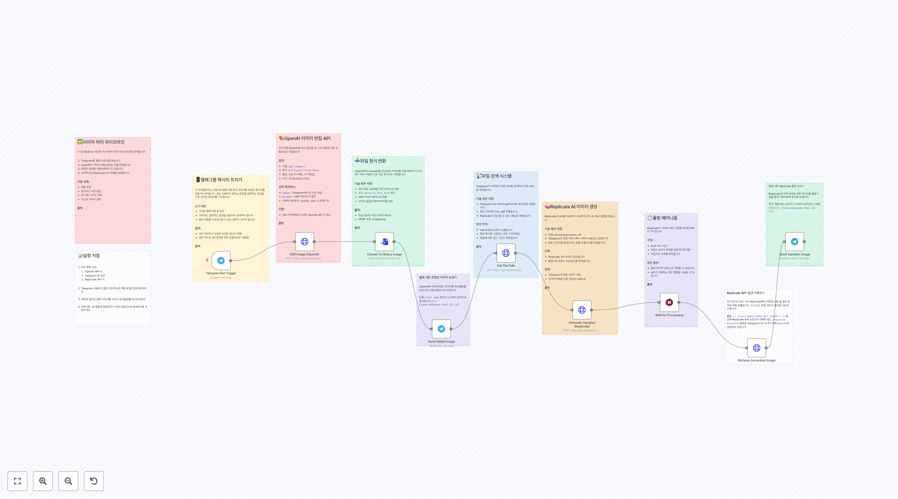
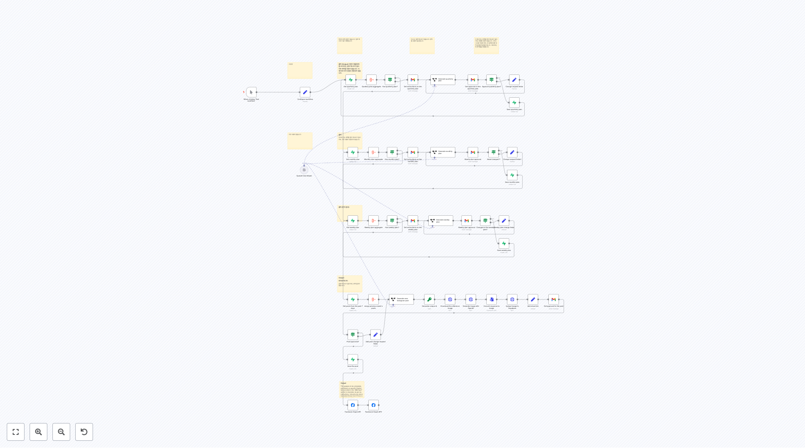

# Design 워크플로우

이 폴더에는 AI 기반 이미지 생성, 소셜 미디어 자동화, 멀티미디어 콘텐츠 제작 및 디자인 프로세스 자동화에 중점을 둔 n8n 워크플로우들이 포함되어 있습니다.

## 🎨 AI 기반 이미지 생성

### 최신 이미지 생성 API

**OpenAI 새 이미지 생성 API**
OpenAI의 최신 이미지 생성 API(`gpt-image-1`)를 활용하여 고품질 이미지를 생성하는 워크플로우입니다. 사용자 정의 프롬프트, 크기, 품질 설정을 지원하며 base64를 바이너리로 변환하여 사용 가능한 형태로 출력합니다.

**OpenAI 이미지 생성 및 편집 파이프라인**
이미지 생성과 편집을 연속적으로 수행하는 파이프라인입니다. 먼저 AI로 이미지를 생성한 후, 추가 프롬프트를 사용해 이미지를 편집하고 향상시킬 수 있습니다.

**ChatGPT 이미지 생성과 Google Drive 자동 저장**
OpenAI 이미지 생성 API로 이미지를 생성하고 자동으로 Google Drive에 저장하며 Google Sheets에 메타데이터를 기록하는 완전한 관리 시스템입니다.

### AI 스타일 생성기

**Flux AI 이미지 스타일 생성기**
Flux AI 모델을 활용하여 다양한 예술적 스타일로 이미지를 생성하는 워크플로우입니다. 하이퍼 리얼, 포스트 아날로그 글리치, AI 디스토피아, 네온 포비즘 등 사전 정의된 스타일로 이미지를 생성할 수 있습니다.

**Google Imagen 3.0 스타일 복사 시스템**
폼 기반 인터페이스로 소스 이미지의 스타일을 새로운 프롬프트에 적용하여 Imagen 3.0으로 이미지를 생성하는 스타일 전이 시스템입니다. 이메일 알림 기능도 포함되어 있습니다.

### 이미지 처리 도구

**Google Drive 이미지 고급 배경 제거**
PhotoRoom API를 사용하여 Google Drive의 이미지에서 배경을 제거하고, 사용자 정의 배경색과 패딩을 적용한 후 결과를 자동으로 Google Drive에 저장하는 전문적인 이미지 처리 도구입니다.

**AI 기반 Telegram 이미지 편집 파이프라인**
Telegram 봇을 통해 이미지를 받아 OpenAI의 이미지 편집 API로 사용자 지시에 따라 편집하고, 선택적으로 Replicate API를 사용해 추가 변형을 생성하는 완전한 이미지 처리 파이프라인입니다.

## 📱 소셜 미디어 자동화

### 크로스 플랫폼 게시

**소셜 미디어 크로스 포스팅 플랫폼**
Instagram, Facebook, Twitter, LinkedIn 등 여러 플랫폼에 AI 기반 콘텐츠 적응과 이미지 생성을 통해 콘텐츠를 자동으로 배포하는 고급 시스템입니다.

**LinkedIn AI 자동 포스트 생성**
LangChain AI 에이전트를 사용하여 LinkedIn 포스트 콘텐츠와 이미지 프롬프트를 자동으로 생성하는 폼 기반 워크플로우입니다.

### Instagram 자동화

**Instagram 궁극 자동화 워크플로우**
AI 기반 콘텐츠 생성, 이미지 생성, 자동 캡션 작성을 통해 Instagram 게시를 완전히 자동화하는 포괄적인 시스템입니다. 웹 검색 및 트렌드 분석 기능도 포함되어 있습니다.

**Instagram Google Drive 자동화**
Google Drive 폴더를 모니터링하여 새로운 콘텐츠를 자동으로 Instagram에 게시하는 워크플로우입니다. OpenAI를 사용해 AI 캡션을 생성하고 Google Sheets에 데이터를 저장합니다.

### YouTube 자동화

**YouTube 새 비디오 업로드 자동화**
Google Drive에서 새 비디오를 감지하여 자동으로 YouTube에 업로드하고, AI로 설명과 태그를 생성하며 메타데이터를 자동 설정하는 완전한 YouTube 관리 시스템입니다.

**YouTube to Instagram/Facebook 자동화**
새로운 YouTube 비디오를 감지하고 AI가 생성한 소셜 미디어 캡션과 함께 Facebook 및 Instagram에 자동으로 크로스 포스팅하는 통합 시스템입니다.

## 🎬 멀티미디어 콘텐츠 제작

### 비디오 생성 파이프라인

**AI 기반 뉴스 to 비디오 생성**
RSS 피드에서 뉴스를 가져와 AI로 스크립트를 생성하고 Heygen API를 사용해 아바타 비디오를 만드는 자동화된 뉴스 비디오 제작 파이프라인입니다.

**이미지 생성 및 비디오 변환 파이프라인**
Flux AI로 이미지를 생성한 후 Kraken API로 최적화하고 다양한 비디오 플랫폼으로 변환하는 멀티미디어 제작 파이프라인입니다.

**AI 기반 YouTube Shorts 자동화**
OpenAI와 ElevenLabs를 사용하여 아이디어 생성부터 음성 합성, 이미지 생성, 비디오 제작까지 YouTube Shorts를 완전히 자동으로 생성하는 포괄적인 시스템입니다.

### 애니메이션 및 스토리 제작

**AI 애니메이션 스토리 생성**
GPT-4o-mini, Midjourney, Kling, Creatomate API를 결합하여 스크립트에서 애니메이션 스토리까지 완전한 멀티미디어 콘텐츠를 생성하는 고급 AI 파이프라인입니다.

**스케줄 기반 자동 비디오 생성**
정기적으로 AI 콘텐츠를 생성하고 이미지를 만들어 비디오로 변환한 후 Google Drive에 저장하는 완전히 자동화된 콘텐츠 제작 시스템입니다.

## 💼 비즈니스 및 관리 도구

### 복합 AI 워크플로우

**고급 AI 기반 콘텐츠 생성 시스템**
LangChain, 구조화된 출력 파서, Leonardo AI를 사용하여 복잡한 멀티단계 콘텐츠 생성을 수행하는 고급 AI 워크플로우입니다.

**자동 블로그 작성 및 소셜 미디어 프로모션**
AI로 블로그 콘텐츠를 작성하고 이미지를 생성하여 WordPress에 게시한 후 소셜 미디어에서 자동으로 프로모션하는 통합 콘텐츠 마케팅 시스템입니다.

### 인플루언서 관리

**Instagram 인플루언서 관리 시스템**
Supabase와 Gmail을 사용하여 인플루언서의 월간/주간 계획을 관리하고 승인 프로세스를 자동화하는 포괄적인 관리 솔루션입니다.

### 생산성 도구

**실시간 Notion Todoist 양방향 동기화**
Notion 데이터베이스와 Todoist 프로젝트 간의 실시간 양방향 동기화를 구현하여 작업 관리를 통합하는 생산성 향상 도구입니다.

**고급 이미지 생성 워크플로우**
외부 이미지 생성 API와의 통합, 오류 처리, 대기 메커니즘을 포함한 강력한 이미지 생성 시스템입니다.

## 🛠 구현 가이드

### 필수 설정
1. **AI 서비스 API 키**
   - OpenAI API (이미지 생성/편집)
   - Hugging Face (Flux 모델)
   - Google Gemini/PaLM API
   - Anthropic Claude API (선택사항)

2. **소셜 미디어 인증**
   - Facebook Graph API (Instagram/Facebook)
   - YouTube Data API
   - LinkedIn API
   - Twitter API

3. **클라우드 서비스**
   - Google Drive API
   - Google Sheets API
   - Notion API
   - Supabase (데이터베이스)

### 보안 고려사항
- 모든 API 키를 안전하게 저장하고 정기적으로 로테이션
- 소셜 미디어 토큰의 만료일 관리
- 이미지 및 비디오 파일의 접근 권한 제어
- 사용자 데이터 프라이버시 보호

### 성능 최적화
- 이미지 생성 시 적절한 대기 시간 설정
- 배치 처리를 통한 API 호출 효율화
- 캐싱을 통한 중복 작업 방지
- 오류 재시도 메커니즘 구현

## 📈 스케일링 전략

### 콘텐츠 볼륨 관리
- 스케줄 트리거를 사용한 자동 콘텐츠 생성
- 큐 시스템을 통한 작업 부하 분산
- 클라우드 스토리지를 활용한 미디어 파일 관리

### 다중 계정 지원
- 계정별 설정 분리
- 템플릿 기반 워크플로우 복제
- 중앙집중식 모니터링 및 관리

## 🔗 관련 자료

- [OpenAI 이미지 API 가이드](https://platform.openai.com/docs/guides/images)
- [Facebook Graph API 문서](https://developers.facebook.com/docs/graph-api/)
- [YouTube Data API 참조](https://developers.google.com/youtube/v3)
- [Instagram Business API](https://developers.facebook.com/docs/instagram-api/)
- [n8n 커뮤니티 템플릿](https://n8n.io/workflows/)

## 💡 사용 사례

### 개인 크리에이터
- 소셜 미디어 콘텐츠 자동 생성
- 개인 브랜드 일관성 유지
- 크로스 플랫폼 콘텐츠 배포

### 중소기업
- 마케팅 콘텐츠 자동화
- 고객 engagement 증대
- 비용 효율적인 콘텐츠 제작

### 대행사
- 다중 클라이언트 관리
- 확장 가능한 콘텐츠 파이프라인
- 자동화된 보고 및 분석