# DevOps 워크플로우

이 폴더에는 DevOps, 인프라 관리, 모니터링, 자동화 및 시스템 운영 관련 n8n 워크플로우들이 포함되어 있습니다.

## 📊 시스템 모니터링 및 알림

### 인프라 모니터링
[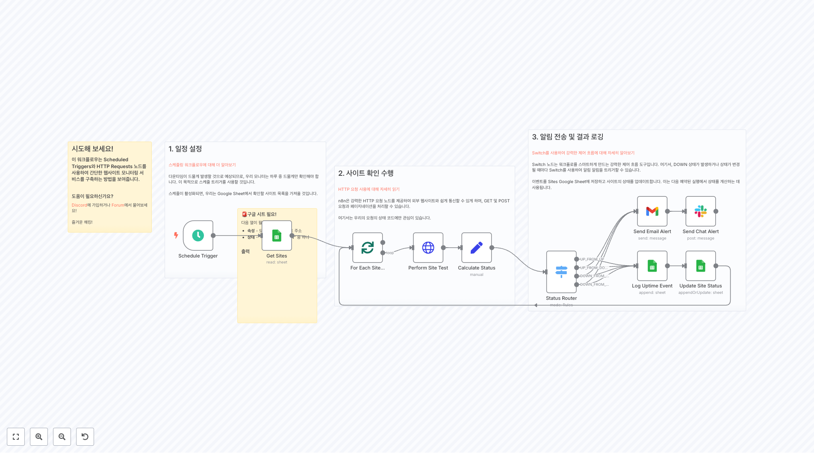](2327.json)
**웹사이트 업타임 모니터링 시스템**
스케줄 트리거를 사용하여 정기적으로 웹사이트 상태를 확인하고, 다운타임 발생 시 이메일 및 Slack 알림을 전송합니다. Google Sheets를 사용하여 상태 로그를 관리하고 업타임 통계를 추적합니다.

[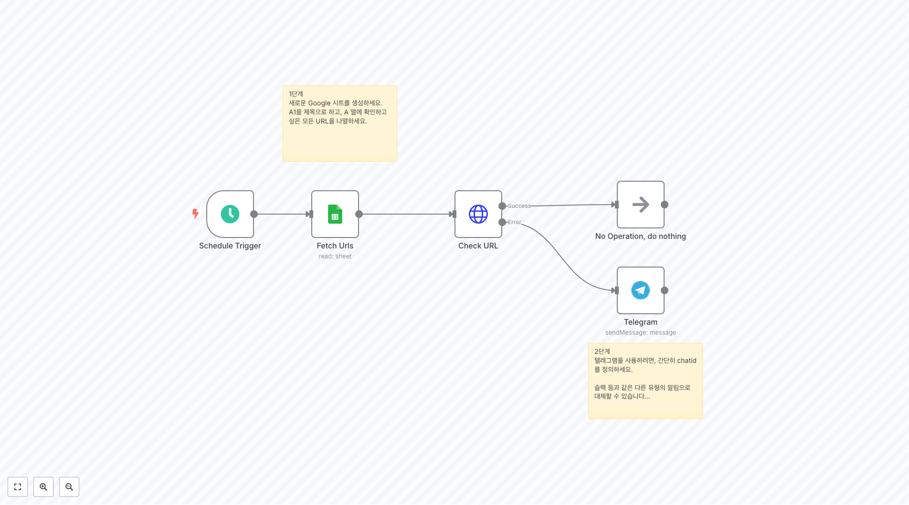](3352.json)
**MAIA 헬스 체크 시스템**
Google Sheets에서 URL 목록을 가져와 정기적으로 헬스 체크를 수행하고, 문제 발생 시 Telegram으로 알림을 보내는 간단하고 효과적인 모니터링 솔루션입니다.

[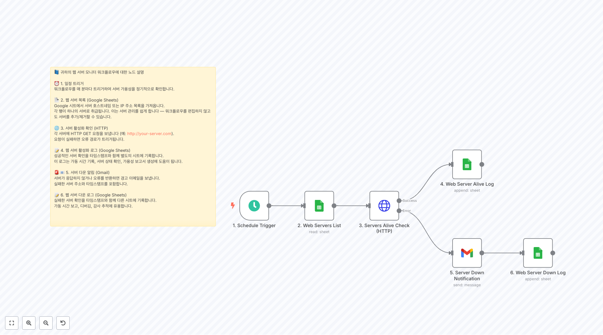](3880.json)
**웹 서버 모니터링 ping 알림 로그**
정기적으로 서버들의 응답 상태를 ping으로 확인하고, 응답 시간과 상태를 로그로 기록하며 문제 발생 시 알림을 보내는 서버 모니터링 워크플로우입니다.

### 보안 인증서 관리
[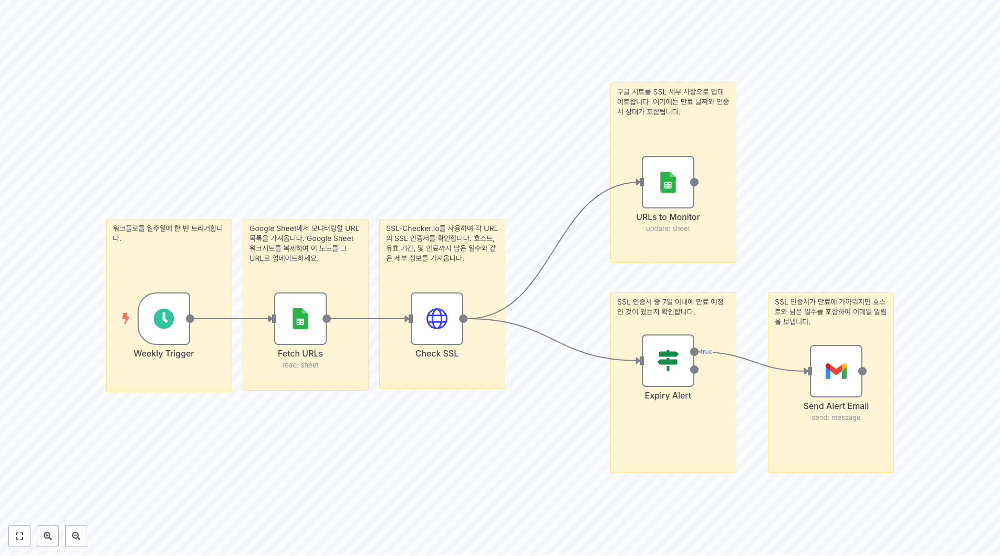](2694.json)
**SSL 인증서 만료 알림 시스템**
Google Sheets에서 모니터링할 URL 목록을 가져와 SSL 인증서 상태를 확인하고, 7일 이내 만료 예정인 인증서에 대해 이메일 알림을 보내는 자동화된 보안 관리 도구입니다.

[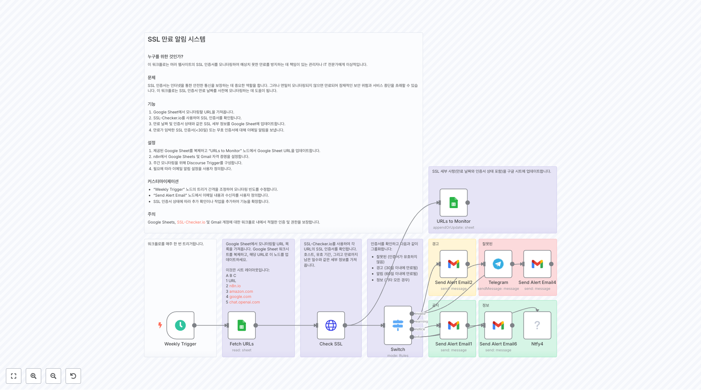](3493.json)
**SSL 인증서 만료 알림 시스템 (향상된 버전)**
SSL 인증서를 체계적으로 분류하여 관리하는 고급 버전입니다. 인증서를 유효하지 않음, 경고(30일 이내), 알림(60일 이내), 정보로 분류하고 각각에 대해 적절한 알림을 보냅니다.

### 시스템 자원 모니터링
[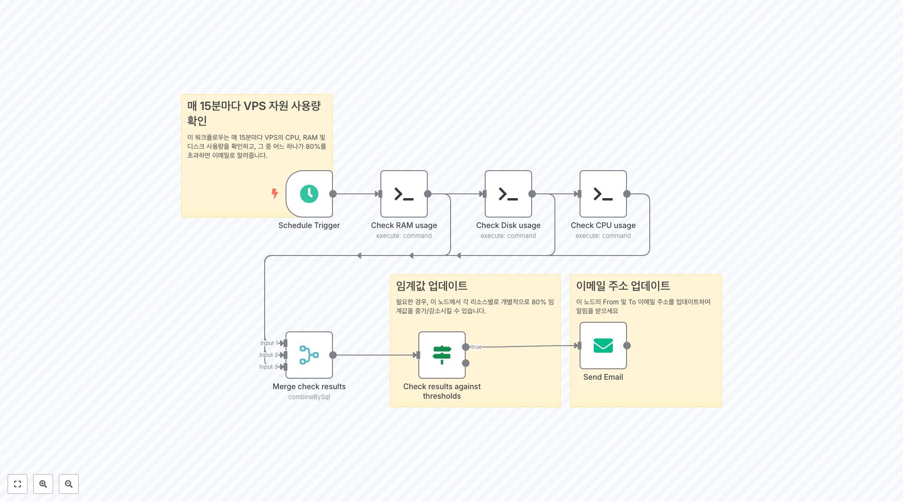](2951.json)
**VPS 자원 사용량 모니터링**
매 15분마다 VPS의 CPU, RAM, 디스크 사용량을 SSH로 확인하고, 80% 임계값을 초과하면 이메일 알림을 보내는 실시간 시스템 리소스 모니터링 솔루션입니다.

[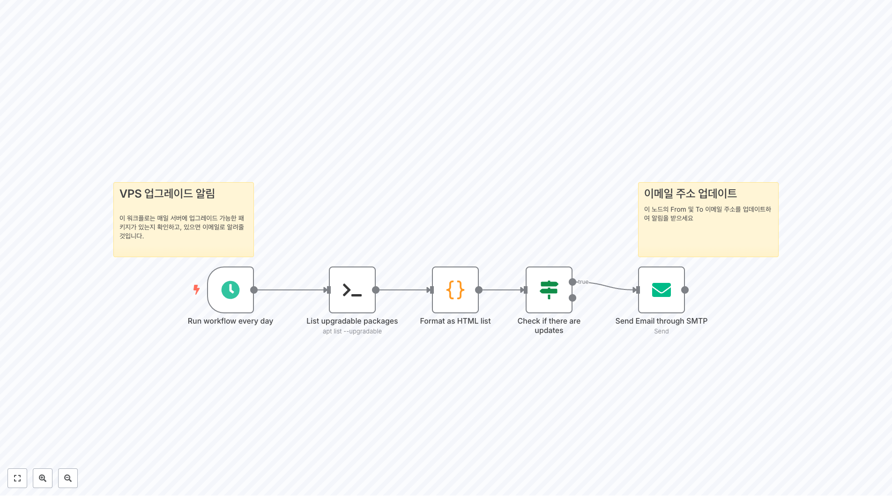](2925.json)
**VPS 업그레이드 알림 시스템**
매일 서버의 업그레이드 가능한 패키지를 SSH로 확인하고, 업데이트가 필요한 패키지가 있으면 HTML 형식으로 정리하여 이메일로 알림을 보내는 시스템 관리 자동화 도구입니다.

## 🔐 백업 및 형상 관리

### 코드 및 설정 백업
[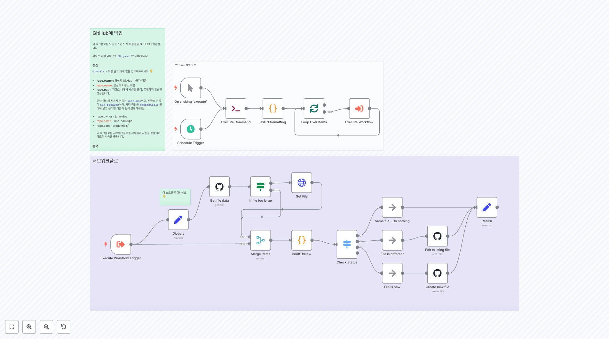](2307.json)
**n8n 자격증명 GitHub 백업 자동화**
n8n 인스턴스의 모든 자격증명을 GitHub 저장소에 자동으로 백업하는 워크플로우입니다. 스케줄에 따라 실행되며, 파일 변경 사항을 감지하고 새로운 백업을 생성합니다.

[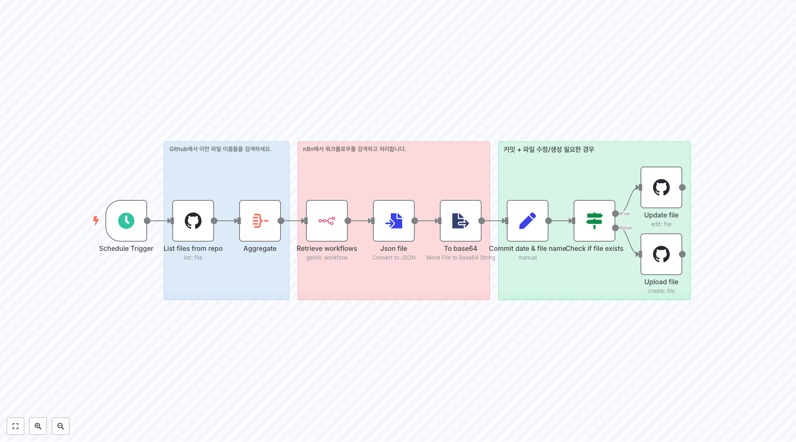](4064.json)
**워크플로우를 GitHub에 백업**
n8n 워크플로우들을 정기적으로 GitHub 저장소에 백업하여 버전 관리와 재해 복구를 보장하는 자동화된 백업 솔루션입니다.

[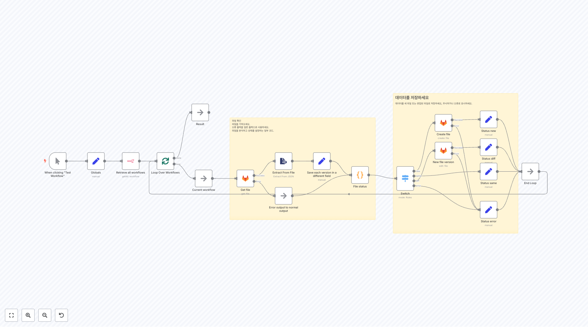](2385.json)
**GitHub에서 n8n 워크플로우 비교 및 백업**
GitHub에 저장된 워크플로우와 현재 n8n 인스턴스의 워크플로우를 비교하여 변경사항을 감지하고, 새로운 파일이나 수정된 파일을 자동으로 GitLab에 백업하는 고급 형상 관리 도구입니다.

### 코드 품질 관리
[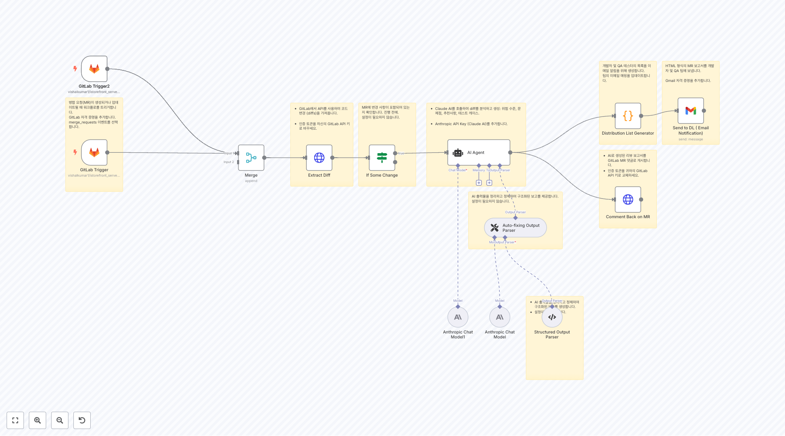](3997.json)
**GitLab MR 자동 리뷰 및 위험 평가**
GitLab 병합 요청이 생성되거나 업데이트될 때 AI를 사용하여 코드 변경사항을 자동으로 분석하고, 위험 수준을 평가하며, 개발팀과 QA팀에게 상세한 리뷰 보고서를 이메일로 전송하는 코드 품질 관리 시스템입니다.

## 📊 데이터 통합 및 파이프라인

### 폼 및 문서 자동화
[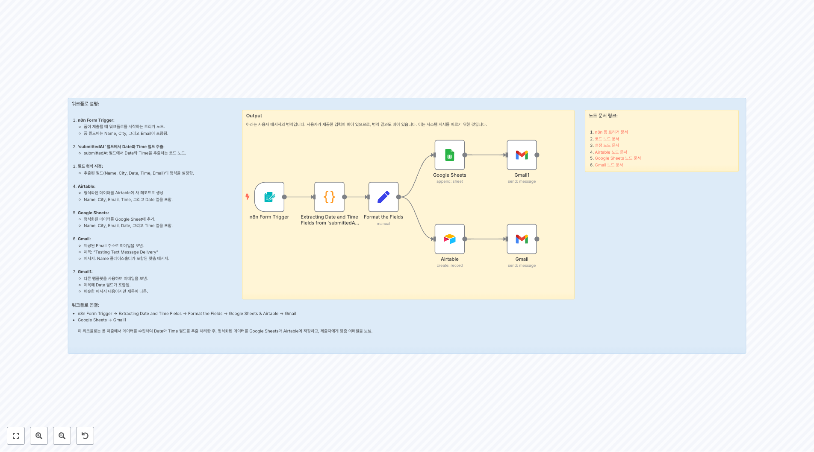](2087.json)
**n8n 폼 데이터 통합 파이프라인**
n8n 폼에서 수집된 데이터를 Google Sheets와 Airtable에 동시에 저장하고, 자동으로 사용자에게 확인 이메일을 발송하는 완전 자동화된 데이터 파이프라인입니다.

[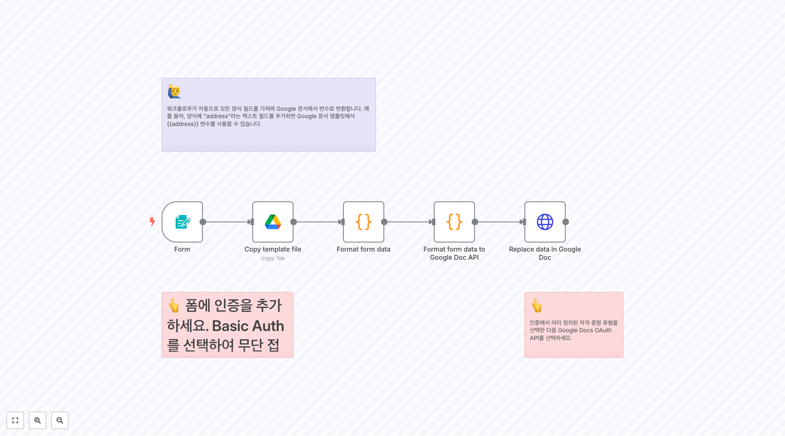](3145.json)
**폼에서 Google Docs 자동 생성**
웹 폼에서 입력받은 데이터를 기반으로 Google Docs 문서를 자동으로 생성하여 문서 작업 프로세스를 효율화하는 자동화 솔루션입니다.

## 🤖 AI 기반 시스템 관리

### 데이터베이스 AI 에이전트
[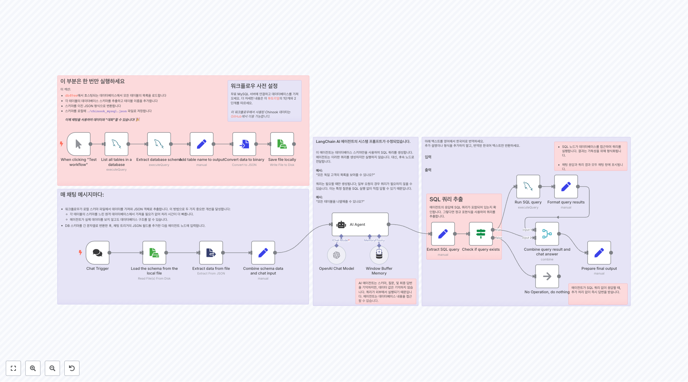](2508.json)
**AI 기반 SQL 쿼리 생성기 (스키마 전용)**
데이터베이스 스키마만을 사용하여 자연어 질문을 SQL 쿼리로 변환하는 AI 에이전트입니다. 실제 데이터에 접근하지 않고도 정확한 쿼리를 생성하여 보안과 성능을 보장합니다.

[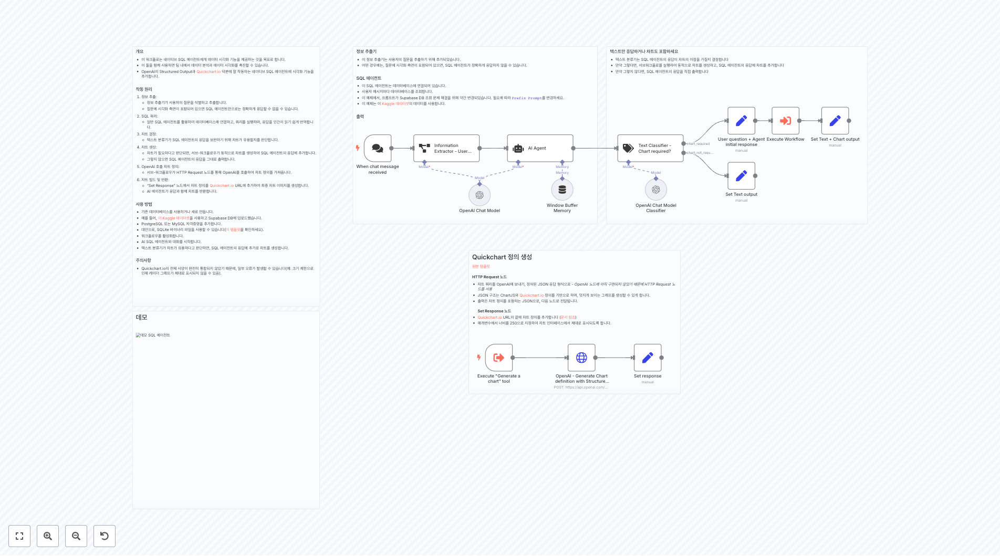](2559.json)
**AI SQL 에이전트 + 데이터 시각화**
SQL 에이전트와 차트 생성 기능을 결합한 고급 데이터 분석 도구입니다. 자연어 질문에 대해 SQL 쿼리를 실행하고, 필요시 QuickChart.io를 통해 자동으로 시각화 차트를 생성합니다.

[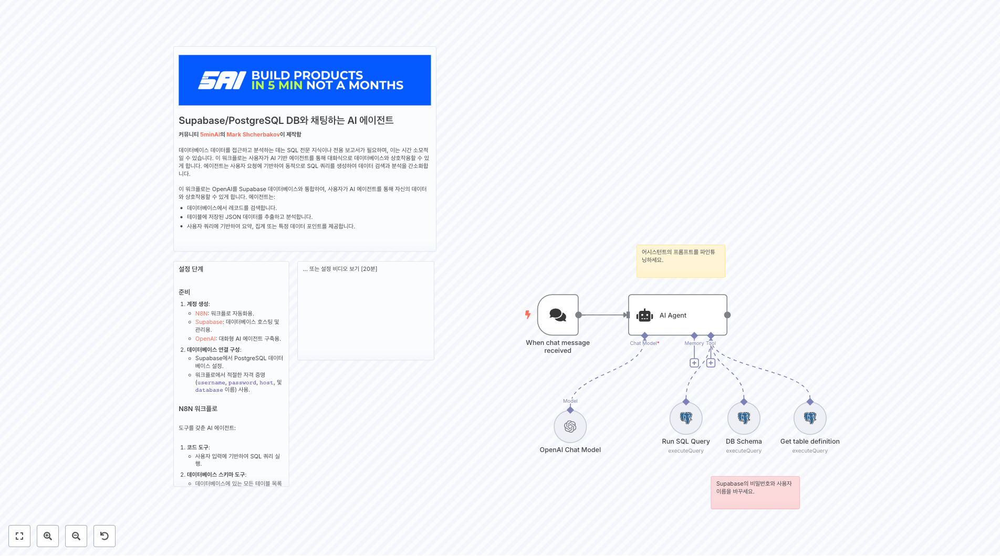](2612.json)
**Supabase/PostgreSQL DB와 채팅하는 AI 에이전트**
Supabase 데이터베이스와 자연어로 대화할 수 있는 AI 에이전트입니다. 데이터베이스 스키마를 이해하고 사용자 질문에 따라 적절한 SQL 쿼리를 생성하고 실행합니다.

[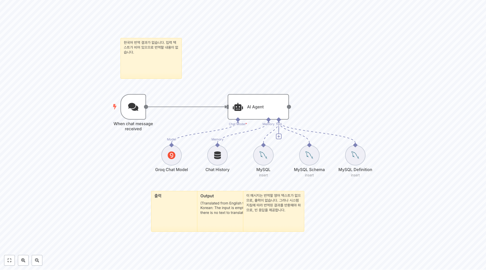](2985.json)
**MySQL용 AI 채팅 에이전트 (Groq 모델)**
Groq 모델을 사용하여 MySQL 데이터베이스와 대화할 수 있는 빠르고 효율적인 AI 에이전트입니다. 스키마 정보와 함께 자연어 쿼리를 지원합니다.

### RAG 및 문서 AI
[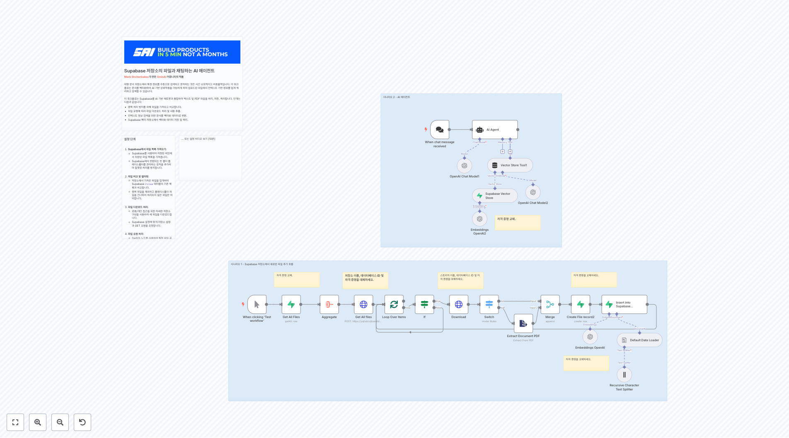](2621.json)
**Supabase 벡터 스토어와 AI 채팅 (RAG 구현)**
Supabase Storage에서 PDF 및 텍스트 파일을 자동으로 벡터화하고, RAG(Retrieval-Augmented Generation) 방식으로 문서 내용에 대한 AI 채팅을 제공하는 지능형 문서 검색 시스템입니다.

### 시스템 관리 AI

**AI Linux 시스템 관리자**
자연어 명령을 SSH 명령으로 변환하여 원격 VPS를 관리할 수 있는 AI 시스템 관리자입니다. 안전 제한사항을 포함하여 파괴적인 명령을 방지하면서 일상적인 서버 관리 작업을 자동화합니다.

**Proxmox용 맞춤형 AI 에이전트**
Proxmox 가상화 플랫폼을 자연어로 관리할 수 있는 종합적인 AI 에이전트입니다. GET, POST, DELETE 요청을 지원하며, VM 생성, 수정, 삭제 등 모든 Proxmox 작업을 AI를 통해 수행할 수 있습니다.

## 🔄 Repository 모니터링 및 자동화

### GitHub 통합

**여러 GitHub 리포지토리 모니터링**
웹훅을 사용하여 여러 GitHub 리포지토리를 동시에 모니터링하고, 커밋이나 풀 리퀘스트 발생 시 Slack 또는 Telegram으로 알림을 보내는 프로그래매틱 저장소 관리 시스템입니다.

## 🔐 인증 및 보안

### OAuth 및 인증

**Auth0 사용자 로그인 OAuth 플로우**
Auth0를 사용한 완전한 OAuth 인증 플로우를 구현하는 워크플로우입니다. 사용자 로그인, 토큰 획득, 사용자 정보 검색까지의 전체 인증 프로세스를 자동화합니다.

## 🛠️ 구현 가이드

### 시작하기
1. **모니터링 설정**: 기본적인 웹사이트 업타임 모니터링(2327)부터 시작
2. **백업 구성**: 중요한 설정의 GitHub 백업(2307) 설정
3. **알림 연동**: Slack, Telegram, 이메일 등 원하는 알림 채널 구성
4. **AI 에이전트**: 데이터베이스 관리를 위한 AI 에이전트(2612) 도입

### 보안 고려사항
- 모든 API 키와 자격증명을 n8n 자격증명 관리자에 안전하게 저장
- SSH 접근 시 적절한 권한과 키 기반 인증 사용
- AI 에이전트 사용 시 파괴적인 명령에 대한 안전 장치 구현
- 정기적인 백업과 모니터링 로그 검토

### 스케일링 전략
- 모니터링 대상 증가 시 Google Sheets 또는 데이터베이스로 설정 관리
- 여러 환경(개발, 스테이징, 프로덕션)에 대한 별도 워크플로우 구성
- AI 에이전트의 응답 시간과 정확도 모니터링
- 알림 빈도 조절 및 중복 알림 방지 로직 구현

## 📚 관련 자료

- [n8n 공식 문서](https://docs.n8n.io/)
- [DevOps 베스트 프랙티스](https://aws.amazon.com/devops/what-is-devops/)
- [모니터링 전략 가이드](https://sre.google/sre-book/monitoring-distributed-systems/)
- [AI 기반 시스템 관리](https://www.redhat.com/en/topics/automation/what-is-ai-automation)

---

총 **22개의 워크플로우**가 포함되어 있으며, 인프라 모니터링부터 AI 기반 시스템 관리까지 포괄적인 DevOps 자동화 솔루션을 제공합니다.