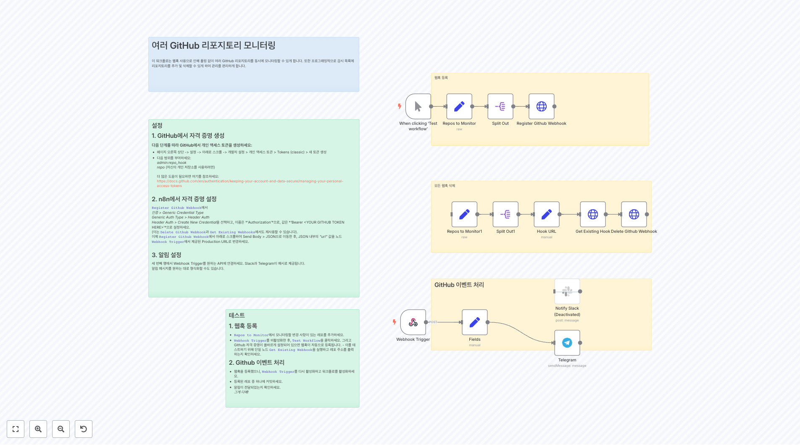
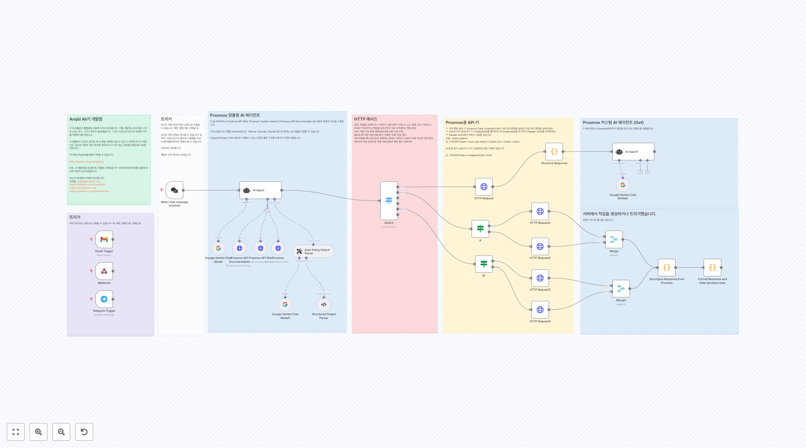
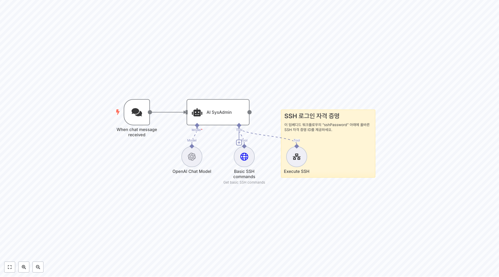

# DevOps 워크플로우

이 폴더에는 devops 관련 **22개의 워크플로우**가 포함되어 있습니다.

## 📋 워크플로우 목록

**워크플로우 2087**
워크플로 설명: 1. **n8n Form Trigger:** - 폼이 제출될 때 워크플로를 시작하는 트리거 노드. - 폼 필드에는 Name, City, 그리고 Email이 포함됨. 2. **'submittedAt' 필드에서 Date와 Time 필드 추출:** - submittedAt 필드에서 Date와 Time을 추출하는 코드 노드. 3. **필드 형식 지...

**워크플로우 2307**
서브워크플로

**워크플로우 2327**
1. 일정 설정 [스케줄링 워크플로우에 대해 더 알아보기](https://docs.n8n.io/integrations/builtin/core-nodes/n8n-nodes-base.scheduletrigger/) 다운타임이 드물게 발생할 것으로 예상되므로, 우리 모니터는 하루 중 드물게만 확인해야 합니다. 이 목적으로 스케줄 트리거를 사용할 것입니다. 스케줄...

**워크플로우 2385**
파일 확인 파일을 가져오세요. 오류 출력을 일반 출력으로 사용하세요. 파일을 분석하고 상태를 설정하는 일부 코드.

**워크플로우 2408**
또한, 인가 URL의 끝에 &connection=github을 추가하면 사용자가 GitHub, Facebook 등을 통해 로그인할 수 있습니다.

**워크플로우 2435**
여러 GitHub 리포지토리 모니터링 이 워크플로는 웹훅 사용으로 인해 폴링 없이 여러 GitHub 리포지토리를 동시에 모니터링할 수 있게 합니다. 또한 프로그래밍적으로 감시 목록에 리포지토리를 추가 및 삭제할 수 있게 하여 관리를 편리하게 합니다.

**워크플로우 2508**
이 부분은 한 번만 실행하세요 이 섹션: * [db4free](https://db4free.net/signup.php)에서 호스팅되는 데이터베이스에서 모든 테이블의 목록을 로드합니다 * 각 테이블의 데이터베이스 스키마를 추출하고 테이블 이름을 추가합니다 * 스키마를 이진 JSON 형식으로 변환합니다 * 스키마를 로컬에 `./chinook_mysql.json...

**워크플로우 2559**
개요 - 이 워크플로는 네이티브 SQL 에이전트에게 데이터 시각화 기능을 제공하는 것을 목표로 합니다. - 이 둘을 함께 사용하면 팀 내에서 데이터 분석과 데이터 시각화를 촉진할 수 있습니다. - OpenAI의 Structured Output과 Quickchart.io 덕분에 잘 작동하는 네이티브 SQL 에이전트에 시각화 기능을 추가합니다. 작동 원리 1....

**워크플로우 2612**
Supabase의 비밀번호와 사용자 이름을 바꾸세요.

**워크플로우 2621**
저장소 이름, 데이터베이스 ID 및 자격 증명을 대체하세요.

## 📋 워크플로우 목록 (11-20)

**워크플로우 2694**
워크플로를 일주일에 한 번 트리거합니다.

**워크플로우 2749**
Proxmox용 API 키 ** 자격 증명 생성 ** Proxmox Data Center에서 API 키로 자격 증명을 생성한 다음 자격 증명을 생성하세요. ** n8n에 자격 증명 추가 ** Credentails를 클릭하여 새 Credentails를 추가하고 Header Auth를 선택하세요. ** Header Auth에서 아래가 사용될 것입니다 이름 : ...

**워크플로우 2925**
VPS 업그레이드 알림 이 워크플로는 매일 서버에 업그레이드 가능한 패키지가 있는지 확인하고, 있으면 이메일로 알려줄 것입니다.

**워크플로우 2951**
이메일 주소 업데이트 이 노드의 From 및 To 이메일 주소를 업데이트하여 알림을 받으세요

**워크플로우 2985**
출력

**워크플로우 3020**
SSH 로그인 자격 증명 이 임베디드 워크플로우의 "sshPassword" 아래에 올바른 SSH 자격 증명 ID를 제공하세요.

**워크플로우 3145**
👆 폼에 인증을 추가하세요. Basic Auth를 선택하여 무단 접근을 방지하세요.

**워크플로우 3352**
1단계 새로운 Google 시트를 생성하세요. A1을 제목으로 하고, A 열에 확인하고 싶은 모든 URL을 나열하세요.

**워크플로우 3493**
SSL-Checker.io를 사용하여 각 URL의 SSL 인증서를 확인합니다. 호스트, 유효 기간, 그리고 만료까지 남은 일수와 같은 세부 정보를 가져옵니다.

**워크플로우 3880**
📘 귀하의 웹 서버 모니터 워크플로우에 대한 노드 설명 ⏰ 1. 일정 트리거 워크플로우를 매 분마다 트리거하여 서버 가용성을 정기적으로 확인합니다. 📄 2. 웹 서버 목록 (Google Sheets) Google 시트에서 서버 호스트네임 또는 IP 주소 목록을 가져옵니다. 각 행이 하나의 서버로 취급됩니다. 이는 서버 관리를 쉽게 합니다 — 워크플로우를 편...

## 📋 워크플로우 목록 (21-22)

**워크플로우 3997**
병합 요청(MR)이 생성되거나 업데이트될 때 워크플로를 트리거합니다. GitLab 자격 증명을 추가합니다. merge_requests 이벤트를 선택합니다.

**워크플로우 4064**
Github에서 이전 파일 이름들을 검색하세요.

## 🔧 구현 가이드

### 워크플로우 사용 방법
1. 원하는 워크플로우의 JSON 링크를 클릭합니다.
2. n8n 인스턴스에서 'Import' 기능을 사용하여 워크플로우를 가져옵니다.
3. 필요한 자격 증명과 설정을 구성합니다.
4. 워크플로우를 테스트하고 필요에 따라 커스터마이즈합니다.

### 주의사항
- 각 워크플로우는 특정 서비스나 API의 자격 증명이 필요할 수 있습니다.
- 워크플로우를 실행하기 전에 모든 노드의 설정을 확인하세요.
- 테스트 환경에서 먼저 워크플로우를 검증한 후 프로덕션에 적용하세요.

---

💡 **총 22개의 워크플로우**가 이 카테고리에서 제공됩니다.
