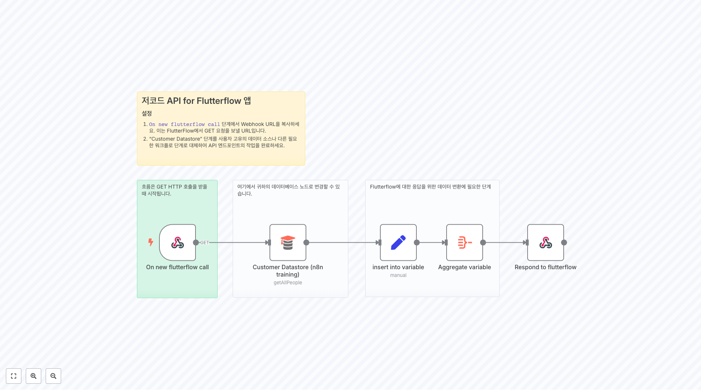
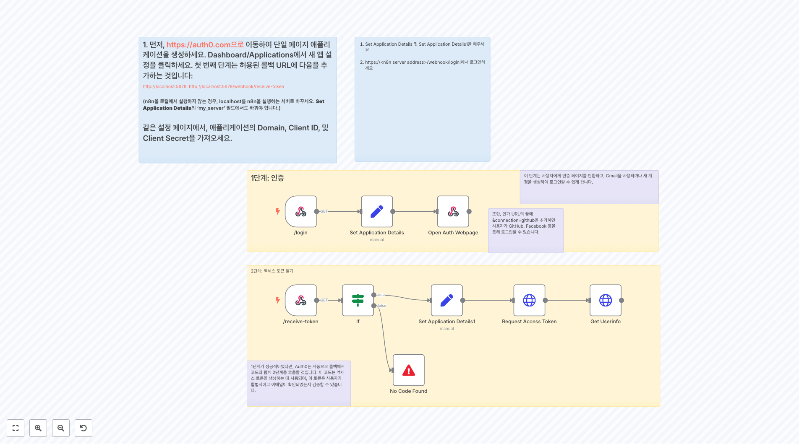

# 엔지니어링 워크플로우

이 폴더에는 engineering 관련 **58개의 워크플로우**가 포함되어 있습니다.

## 📋 워크플로우 목록

**워크플로우 1534**
하위 워크플로

**워크플로우 1747**
3. A의 항목 아래에 B의 항목을 추가하세요

**워크플로우 1804**
IF 및 Switch GitHub에서 이슈에 대해 어떤 조치가 취해졌는지에 따라 다릅니다.

**워크플로우 1831**
IF 및 Switch 노드 이 조건부 노드들(IF 및 Switch)은 Notion의 CRUD 작업이 수행될지를 결정합니다.

**워크플로우 1898**
구성 자신의 스프레드시트를 사용하기로 결정하면, 이 워크플로를 실행하기 전에 모든 열이 존재하는지 확인하는 것은 당신의 책임입니다. 이를 효과적으로 수행하는 방법은 **비어 있는** `spreadsheetid`와 `worksheetId` 변수를 사용하여 이 워크플로를 한 번 실행하는 것입니다( `Configure` 노드를 참조). 그런 다음 `Store s...

**워크플로우 1930**
이 템플릿을 사용하는 방법 이 템플릿은 하나의 서비스에서 다른 서비스로 데이터를 동기화하는 방법을 보여줍니다. 이 예제에서는 새로운 자격을 갖춘 리드를 Google Sheets 파일에 저장합니다. 템플릿을 테스트하는 방법은 다음과 같습니다: 1. 우리의 [Google Sheets](https://docs.google.com/spreadsheets/d/1gV...

**워크플로우 1942**
하나의 파일을 GitHub 노드를 통해 직접 원격 GitHub 저장소에 푸시

**워크플로우 1955**
자체 코딩된 LLM 체인 노드

**워크플로우 1964**
여러 변수가 있는 새 Google Forms를 생성하세요: - 이메일 주소 - 이름 - 어떤 이벤트를 조직하고 있나요? - 이벤트는 언제 열리나요? - 이벤트는 어디에서 열리나요? - 이벤트에 대해 더 알려주세요. - 타임스탬프 변수는 자동으로 추가됩니다 - Google Sheet에서 "DB Status"를 수동으로 추가하세요

**워크플로우 2063**
빈도를 자신의 필요에 맞게 조정하세요

## 📋 워크플로우 목록 (11-20)

**워크플로우 2081**
설정 이 자동화를 작동시키기 위해 몇 가지 조정을 해야 합니다: 1. 해당 Nodes에 Postgres 및 Google Sheets 자격 증명을 추가하세요 2. 동기화하려는 Sheet (Google Sheets)와 테이블 (Postgres)을 선택하세요 3. Insert 및 Update Queries를 업데이트하여, 첫 번째 단계에서 선택한 테이블에 데이터...

**워크플로우 2087**
워크플로 설명: 1. **n8n Form Trigger:** - 폼이 제출될 때 워크플로를 시작하는 트리거 노드. - 폼 필드에는 Name, City, 그리고 Email이 포함됨. 2. **'submittedAt' 필드에서 Date와 Time 필드 추출:** - submittedAt 필드에서 Date와 Time을 추출하는 코드 노드. 3. **필드 형식 지...

**워크플로우 2167**
자신의 프롬프트를 편집 ⬇️

**워크플로우 2274**
흐름은 GET HTTP 호출을 받을 때 시작됩니다.

**워크플로우 2289**
워크플로우 - 백업 복원 이 워크플로우는 GitHub에서 백업된 워크플로우를 복원합니다. 워크플로우를 테스트하여 실행됩니다. 설정 Globals를 열고 아래 값을 업데이트하세요 **repo.owner:** 이는 당신의 GitHub 사용자 이름입니다 **repo.name:** 이는 당신의 저장소 이름입니다 **repo.path:** 이는 저장소 내에서 워크플...

**워크플로우 2328**
4. 이 도구는 캘린더 이벤트를 생성합니다 이 도구는 이벤트 세부 정보와 참석자 목록이 주어지면, 새로운 Google 캘린더 이벤트를 생성하고 참석자를 추가할 것입니다.

**워크플로우 2408**
또한, 인가 URL의 끝에 &connection=github을 추가하면 사용자가 GitHub, Facebook 등을 통해 로그인할 수 있습니다.

**워크플로우 2419**
부분 A. 기본 이미지 생성 우리가 시각적 회귀 테스트를 실행하기 전에, 비교 대상으로 기본 스크린샷 시리즈를 생성해야 합니다. 이 워크플로의 이 부분은 이를 달성하기 위해 외부 웹사이트 스크린샷 서비스인 [Apify.com](https://www.apify.com?fpr=414q6)을 사용합니다. 이 워크플로의 이 부분은 우리의 기본 스크린샷을 업데이트하...

**워크플로우 2435**
여러 GitHub 리포지토리 모니터링 이 워크플로는 웹훅 사용으로 인해 폴링 없이 여러 GitHub 리포지토리를 동시에 모니터링할 수 있게 합니다. 또한 프로그래밍적으로 감시 목록에 리포지토리를 추가 및 삭제할 수 있게 하여 관리를 편리하게 합니다.

**워크플로우 2490**
생성: 새로운 레코드를 생성합니다

## 📋 워크플로우 목록 (21-30)

**워크플로우 2508**
이 부분은 한 번만 실행하세요 이 섹션: * [db4free](https://db4free.net/signup.php)에서 호스팅되는 데이터베이스에서 모든 테이블의 목록을 로드합니다 * 각 테이블의 데이터베이스 스키마를 추출하고 테이블 이름을 추가합니다 * 스키마를 이진 JSON 형식으로 변환합니다 * 스키마를 로컬에 `./chinook_mysql.json...

**워크플로우 2513**
이미지 프롬프트 프롬프트는 `set image description` 노드에서 이미지 설명을 입력받아 OpenAI를 사용하여 생성합니다.

**워크플로우 2559**
개요 - 이 워크플로는 네이티브 SQL 에이전트에게 데이터 시각화 기능을 제공하는 것을 목표로 합니다. - 이 둘을 함께 사용하면 팀 내에서 데이터 분석과 데이터 시각화를 촉진할 수 있습니다. - OpenAI의 Structured Output과 Quickchart.io 덕분에 잘 작동하는 네이티브 SQL 에이전트에 시각화 기능을 추가합니다. 작동 원리 1....

**워크플로우 2612**
Supabase의 비밀번호와 사용자 이름을 바꾸세요.

**워크플로우 2621**
저장소 이름, 데이터베이스 ID 및 자격 증명을 대체하세요.

**워크플로우 2651**
... 또는 설정 비디오 보기 [10분]

**워크플로우 2658**
1단계 - API 문서 연구 - 데이터베이스(Google Sheet)에서 연구 대기 중인 서비스 목록을 가져옴 - 각 서비스의 API 문서를 찾기 위해 검색 엔진(Google)을 사용함 - 검색 결과의 내용을 읽어 관련되지 않은 페이지를 필터링하기 위해 웹스크래퍼(Apify)를 사용함 - 웹페이지 내용과 메타데이터를 Vector Store(Qdrant)에 ...

**워크플로우 2700**
코드에서 Mapbox 공개 키 - 를 대체하세요

**워크플로우 2705**
벡터 데이터베이스에 콘텐츠 인덱싱 워크플로의 이 부분은 콘텐츠를 추출하고, 임베딩을 생성하며, 이를 Pinecone 벡터 저장소로 보내는 역할을 합니다. 이는 HTTP 요청을 사용하여 GitHub에서 OpenAPI 사양을 요청합니다. 그 다음, 파일을 청크로 나누고, 각 청크에 대해 OpenAI를 사용하여 임베딩을 생성하며, 이를 Pinecone 벡터 DB...

**워크플로우 2732**
테스트 테스트는 CURL이나 유사한 도구를 사용하여 수행할 수 있습니다. Form Data를 사용한 파일 게시를 위해 curl -X POST "https://yoururl.com/webhook-test/tool/csv-to-json" \ -H "Content-Type: text/csv" \ --data-binary @path/to/your/file.csv ...

## 📋 워크플로우 목록 (31-40)

**워크플로우 2772**
동기화 유지 매핑을 업데이트하면, 다른 노드에서도 변경하세요!

**워크플로우 2796**
 고객 찾기 이 워크플로의 이 부분은 고객 데이터베이스를 조회하여 고객이 발견되면 AI 에이전트에게 고객 세부 정보를 반환합니다. 발견되지 않으면 고객 세부 정보에 대해 NOT_FOUND를 반환합니다.

**워크플로우 2799**
이 **LLM 호출**은 웹사이트에 게시된 기사가 모니터링하고 싶은 **주제와 관심사**에 **관련이 있는지** **분류**하는 데 사용됩니다. 이 호출은 **RSS Read** 노드에서 가져온 **제목**과 **콘텐츠 스니펫**을 분석합니다. 이 템플릿에서 모니터링되는 기사는 **데이터와 AI**와 관련이 있습니다. 분류는 **두 카테고리**로 이루어지며...

**워크플로우 2859**
👨‍🎤 설정 1. 자신의 **PostgreSQL** 및 **OpenAI** 자격 증명을 추가하세요. 2. **Chat** 버튼을 클릭하고 데이터베이스에 질문을 시작하세요. 3. 워크플로를 활성화하면 채팅을 공개적으로 사용할 수 있습니다.

**워크플로우 2893**
프롬프트에 변수를 여기에서 설정하세요

**워크플로우 2925**
VPS 업그레이드 알림 이 워크플로는 매일 서버에 업그레이드 가능한 패키지가 있는지 확인하고, 있으면 이메일로 알려줄 것입니다.

**워크플로우 2985**
출력

**워크플로우 3079**
이것을 이름이 query_executer인 별도의 워크플로우에 배치하세요.

**워크플로우 3115**
1. 사용자를 채팅으로 초대하여 설문 시작 [채트 트리거에 대해 자세히 알아보기](https://docs.n8n.io/integrations/builtin/core-nodes/n8n-nodes-langchain.chattrigger/) 사용자에게 설문을 제시하기 위해 n8n의 내장 호스티드 채팅을 사용할 것입니다. 설문 질문은 미리 정의되어 있으며 Goog...

**워크플로우 3150**
구글 뉴스 ISO 639-1 표준에서 언어 매개변수를 변경하세요 1. hl=it 2. gl=IT 3. ceid=IT:it

## 📋 워크플로우 목록 (41-50)

**워크플로우 3151**
1. RAG 친화적 문서 Tech Radar Gsheet를 GDoc으로 변환하세요. 각 행과 열의 데이터를 읽은 후, 간단한 단락 행으로 변환하여 벡터 데이터베이스로 쉽게 변환할 수 있도록 하세요. 이 변환을 위해 Apps Script를 선택적으로 사용할 수 있습니다.

**워크플로우 3459**
사실적 전략 정확한 사실과 수치를 가져오다.

**워크플로우 3497**
입력 텍스트가 없습니다.

**워크플로우 3635**
1. MCP 서버 트리거 설정 [MCP 서버 트리거에 대해 더 읽기](https://docs.n8n.io/integrations/builtin/core-nodes/n8n-nodes-langchain.mcptrigger)

**워크플로우 3638**
1. MCP 서버 트리거 설정 [ MCP 서버 트리거에 대해 더 읽기 ](https://docs.n8n.io/integrations/builtin/core-nodes/n8n-nodes-langchain.mcptrigger)

**워크플로우 3655**
기본 설정 지침 사용자의 필요에 따라 **기본 파라미터**를 채우세요. 이 노드는 세 가지 섹션으로 구성됩니다: 스타일, 캐릭터, 및 상황_키워드. GPT-4o-mini는 위에서 언급된 기본 파라미터에 기반하여 이미지 설명을 생성할 것입니다.

**워크플로우 3701**
URL에서 Dumpling AI로 책 스크랩, HTML 정리, Sheets에 저장, CSV로 이메일 보내기 📌 이 워크플로는 웹사이트에서 책 데이터를 스크랩하여 CSV로 변환, 저장하고 이메일로 보냅니다. Google Sheets 트리거에서 시작하여 DumplingAI를 사용해 페이지를 가져오고, 책을 추출, 가격으로 정렬하고 CSV를 이메일로 보냅니다. ...

**워크플로우 3804**
1. GitHub Trigger 노드가 지정된 리포지토리에서 풀 리퀘스트 이벤트가 발생할 때마다 워크플로를 시작합니다. 이는 GitHub 활동을 기반으로 실시간 자동화를 가능하게 합니다.

**워크플로우 3820**
정말 *사랑해* 두 주를 기다려서 제대로 작동하지도 않는 키보드를 받는 걸. 훌륭해. 이번 달에 내가 지불한 것을 실제로 사용할 수 있는 기회가 있을까?

**워크플로우 3866**
노트 Amazon 웹 스크래핑을 Bright Data Web Scraper Product를 이용하여 처리합니다. **Bright Data를 설정하세요 -> Dataset Id, Request URL을 설정하고 Webhook Notification URL을 업데이트하세요** 참조 - https://brightdata.com/products/web-scrape...

## 📋 워크플로우 목록 (51-58)

**워크플로우 3934**
에픽 완료? 이 노드는 Jira에서 발생하는 모든 이슈 변경 시 트리거됩니다. 그러나 에픽 상태가 **완료**로 변경될 때만 자동화를 트리거합니다.

**워크플로우 3997**
병합 요청(MR)이 생성되거나 업데이트될 때 워크플로를 트리거합니다. GitLab 자격 증명을 추가합니다. merge_requests 이벤트를 선택합니다.

**워크플로우 4064**
Github에서 이전 파일 이름들을 검색하세요.

**워크플로우 4086**
저장소 이름, 데이터베이스 ID 및 자격 증명을 교체하세요.

**워크플로우 4237**
최적 AI 응답을 위한 동적 모델 선택기 **에이전트 디시저너**는 동적이고 AI 기반의 라우팅 시스템으로, 쿼리의 내용과 목적에 따라 사용자의 쿼리에 응답하기 가장 적합한 대형 언어 모델(LLM)을 자동으로 선택합니다. 이 워크플로는 쿼리를 가장 적합한 모델로 지능적으로 라우팅하여 **동적이고 최적화된 AI 응답**을 보장합니다.

**워크플로우 4399**
최적 AI 응답을 위한 동적 모델 선택기 **새로운 Anthropic 에이전트 결정자**는 동적이고 AI 기반의 라우팅 시스템으로, 쿼리의 내용과 목적에 따라 자동으로 가장 적합한 대형 언어 모델(Anthropic Sonnet 4 또는 Opus 4)을 선택하여 사용자의 쿼리에 응답합니다. 이 워크플로우는 쿼리를 지능적으로 가장 적합한 모델로 라우팅하여 **...

**워크플로우 4501**
즉시 RaG 빌더: Pinecone으로의 드라이브 **저자** **David Olusola** **설정** :✅ 자격 증명 연결: Google Drive, OpenAI, Pinecone 📁 파일 업로드: Google Drive 폴더 (자동 감시) 🔄 워크플로우가 나머지를 처리: - 파일 다운로드 - 텍스트 분할 - 임베딩 생성 - Pinecone에 저장 💬...

**워크플로우 4827**
이 워크플로를 수동으로 실행하여 Google Docs 제품 문서를 MongoDB에 가져와 색인화하고, 벡터 임베딩을 사용하여 빠른 검색을 가능하게 하세요.

## 🔧 구현 가이드

### 워크플로우 사용 방법
1. 원하는 워크플로우의 JSON 링크를 클릭합니다.
2. n8n 인스턴스에서 'Import' 기능을 사용하여 워크플로우를 가져옵니다.
3. 필요한 자격 증명과 설정을 구성합니다.
4. 워크플로우를 테스트하고 필요에 따라 커스터마이즈합니다.

### 주의사항
- 각 워크플로우는 특정 서비스나 API의 자격 증명이 필요할 수 있습니다.
- 워크플로우를 실행하기 전에 모든 노드의 설정을 확인하세요.
- 테스트 환경에서 먼저 워크플로우를 검증한 후 프로덕션에 적용하세요.

---

💡 **총 58개의 워크플로우**가 이 카테고리에서 제공됩니다.
