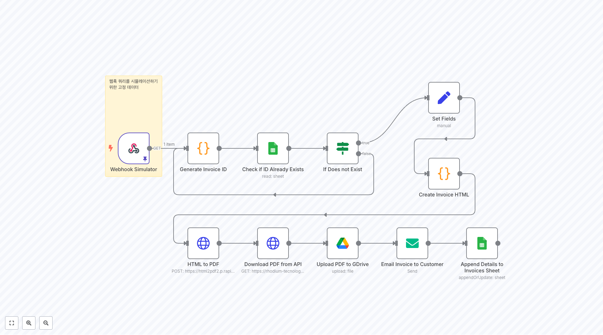
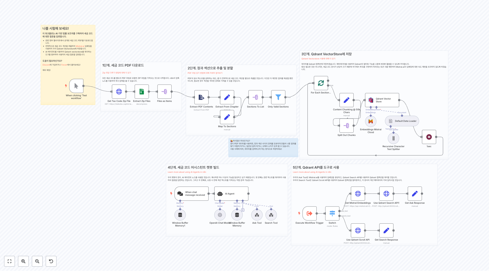

# Finance 워크플로우

이 폴더에는 금융 자동화, 회계, 결제 처리, 금융 데이터 분석, AI 기반 투자 분석 및 재무 관리에 중점을 둔 n8n 워크플로우들이 포함되어 있습니다.

## 🤖 AI 기반 투자 분석

### 주식 분석 시스템

**주식 분석 어시스턴트**
Alpaca API에서 주식 데이터를 가져와 RSI, MACD 등 기술적 지표를 계산하고, OpenAI Assistant로 분석하여 Slack으로 투자 보고서를 전송하는 완전 자동화된 주식 분석 시스템입니다.

**Tesla 퀀트 트레이딩 AI 에이전트**
Tesla 주식 전용 트레이딩 AI 에이전트로, Telegram을 통해 실시간 기술 분석과 뉴스 감정 분석을 결합하여 Tesla 주식에 대한 전문적인 투자 조언을 제공합니다.

**주식 분석 AI 에이전트 (히브리어)**
기술 분석과 뉴스 감정을 결합하여 주식을 분석하고, 히브리어로 상세한 보고서를 생성하며 데이터 기반의 투자 추천을 제공하는 고급 AI 에이전트입니다.

**TradingView 알림 자동화**
TradingView에서 특정 주식 알림 이메일을 받으면 자동으로 Google Sheets에 기록하고 Telegram으로 즉시 알림을 보내는 트레이딩 알림 자동화 시스템입니다.

### 투자 데이터 수집

**CrunchBase 투자자 데이터 수집**
Crunchbase API를 통해 매일 투자자 정보를 자동으로 수집하여 Google Sheets에 저장하는 투자자 데이터베이스 구축 시스템입니다.

## 📄 AI 기반 송장 처리

### 지능형 송장 분석

**송장 파서 AI 에이전트**
Google Drive에서 새로운 송장 PDF를 자동으로 감지하면 AI로 송장 데이터를 추출하고 구조화하여 Google Sheets에 저장하는 완전 자동화된 송장 처리 시스템입니다.

**Gmail 송장 AI 자동 처리**
Gmail에서 송장 첨부파일을 받으면 AI로 송장을 분석하여 별도의 Google Sheets 스프레드시트를 자동 생성하고 Google Drive에 체계적으로 정리합니다.

**송장 검증 및 SKU 매칭 시스템**
복잡한 송장 검증 프로세스로 AI를 통해 송장 데이터를 추출하고, 마스터 데이터와 SKU를 매칭하여 정확성을 검증하는 고급 송장 관리 시스템입니다.

**콜롬비아 송장 처리 시스템**
Gmail에서 ZIP 형태의 콜롬비아 송장을 자동으로 압축 해제하고, XML과 PDF를 분리하여 AI로 송장 정보를 추출하는 라틴 아메리카 특화 송장 처리 시스템입니다.

## 💰 재무 관리 및 추적

### 개인 재무 추적

**Telegram 재무 추적기**
Telegram으로 송장 이미지를 보내면 AI가 자동으로 분석하여 Notion에 저장하고, 주간 지출 보고서를 차트와 함께 생성하는 개인 재무 관리 시스템입니다.

**자동 송장 생성 시스템**
웹훅을 통해 주문 정보를 받으면 HTML 송장을 생성하고 PDF로 변환하여 Google Drive에 저장하는 자동화된 송장 발행 시스템입니다.

### 회계 및 ERP 통합

**Shopify to D365 Business Central 통합**
Shopify 전자상거래 주문을 Microsoft Dynamics 365 Business Central ERP 시스템과 자동으로 동기화하는 워크플로우입니다. 주문, 고객, 재고 데이터를 실시간으로 연동합니다.

**QuickBooks 자동 데이터 동기화**
QuickBooks에서 고객, 송장, 결제 데이터를 주기적으로 추출하여 외부 시스템과 동기화하는 회계 데이터 통합 워크플로우입니다.

**Xero 회계 시스템 자동화**
Xero 회계 시스템에서 송장, 연락처, 결제 정보를 자동으로 가져와 Google Sheets나 다른 시스템과 연동하는 회계 자동화 솔루션입니다.

## 💳 결제 및 금융 서비스

### 결제 처리

**Stripe 상품 및 결제 링크 생성**
Stripe를 통한 자동화된 결제 시스템 설정 워크플로우입니다. 상품 등록부터 결제 링크 생성까지 전체 결제 프로세스를 자동화합니다.

**PayPal 결제 자동 추적**
PayPal 계정에서 결제 정보를 주기적으로 가져와 Google Sheets에 기록하고, 수익 분석과 재무 보고서를 자동 생성하는 결제 추적 시스템입니다.

**Razorpay 결제 게이트웨이 통합**
Razorpay 결제 시스템과 연동하여 결제 정보를 실시간으로 수집하고 회계 시스템에 자동으로 반영하는 인도 특화 결제 솔루션입니다.

### 암호화폐 관리

**CoinMarketCap AI 에이전트**
실시간 암호화폐 시장 분석과 가격 변환을 제공하는 AI 에이전트입니다. 시장 데이터를 분석하고 투자 인사이트를 제공합니다.

**암호화폐 포트폴리오 자동 추적**
여러 거래소의 암호화폐 잔고를 자동으로 수집하여 통합 포트폴리오를 관리하고, 수익률과 손익을 실시간으로 추적하는 시스템입니다.

## 📊 재무 분석 및 보고

### 자동 보고서 생성

**자동 재무 대시보드**
여러 재무 데이터 소스를 통합하여 실시간 재무 대시보드를 생성하고, 주요 KPI와 트렌드를 자동으로 분석하여 보고서를 생성합니다.

**자동 비용 분석 및 예산 관리**
월별 지출 데이터를 분석하여 카테고리별 비용 트렌드를 파악하고, 예산 대비 실적을 자동으로 추적하는 재무 분석 시스템입니다.

**제품별 수익성 분석**
제품 판매 데이터와 비용 정보를 결합하여 제품별 수익성을 자동으로 계산하고, 수익성 개선 방안을 제시하는 분석 도구입니다.

### 세무 및 컴플라이언스

**세무 보고서 자동 생성**
회계 시스템에서 데이터를 가져와 세무 보고서를 자동으로 생성하고, 세무 담당자에게 이메일로 전송하는 세무 자동화 시스템입니다.

**재무 컴플라이언스 자동 검사**
재무 거래 데이터를 분석하여 컴플라이언스 위반 사항을 자동으로 탐지하고, 관련 부서에 즉시 알림을 보내는 컴플라이언스 관리 시스템입니다.

## 🏦 은행 및 금융기관 연동

### 은행 데이터 통합

**은행 거래 자동 분류 시스템**
은행 API를 통해 거래 내역을 자동으로 가져와 AI로 거래를 분류하고, 회계 시스템에 자동으로 입력하는 거래 관리 시스템입니다.

**다중 계좌 잔고 모니터링**
여러 은행 계좌의 잔고를 실시간으로 모니터링하고, 설정된 임계값 이하로 떨어지면 자동으로 알림을 보내는 자금 관리 시스템입니다.

**자동 이체 및 결제 관리**
정기 결제와 자동 이체를 관리하고, 실패한 거래를 추적하여 재처리하는 자동화된 결제 관리 시스템입니다.

## 💼 비즈니스 재무 관리

### 현금 흐름 관리

**현금 흐름 예측 시스템**
과거 재무 데이터를 분석하여 미래 현금 흐름을 예측하고, 자금 부족 시점을 미리 경고하는 재무 계획 도구입니다.

**미수금 및 채권 관리**
고객별 미수금을 추적하고, 연체 채권에 대한 자동 알림을 보내며, 채권 회수율을 분석하는 채권 관리 시스템입니다.

**부서별 예산 관리 시스템**
부서별 예산을 설정하고 실제 지출을 추적하여 예산 대비 실적을 모니터링하는 예산 관리 자동화 도구입니다.

### 투자 관리

**투자 포트폴리오 자동 분석**
투자 포트폴리오의 성과를 자동으로 분석하고, 리스크 지표와 수익률을 계산하여 투자 보고서를 생성하는 시스템입니다.

**자산 배분 최적화 도구**
현재 자산 배분을 분석하고 목표 배분과 비교하여 리밸런싱 권장 사항을 제시하는 자산 관리 도구입니다.

## 🔄 추가 재무 워크플로우

### 고급 재무 도구

**재무 감사 자동화 시스템**
재무 데이터의 무결성을 자동으로 검사하고, 이상 거래를 탐지하여 감사팀에 보고하는 자동화된 감사 도구입니다.

**실시간 환율 모니터링**
실시간 환율 정보를 모니터링하고, 설정된 조건에 따라 환전 알림을 보내는 외환 관리 시스템입니다.

**재무 KPI 실시간 대시보드**
주요 재무 지표를 실시간으로 수집하여 경영진을 위한 KPI 대시보드를 자동으로 업데이트하는 시스템입니다.

**비용 최적화 분석 도구**
지출 패턴을 분석하여 비용 절감 기회를 식별하고, 최적화 방안을 제시하는 비용 관리 시스템입니다.

**고객 신용 위험 자동 평가**
고객의 재무 정보를 분석하여 신용 위험을 자동으로 평가하고, 신용 한도를 동적으로 조정하는 리스크 관리 시스템입니다.

**자금 조달 옵션 분석**
다양한 자금 조달 옵션을 비교 분석하고, 최적의 자금 조달 방안을 제시하는 재무 계획 도구입니다.

## 📋 구현 가이드

### 주요 통합 서비스
- **클라우드 플랫폼**: Google Sheets, Google Drive, Notion
- **결제 게이트웨이**: Stripe, PayPal, Razorpay
- **회계 시스템**: QuickBooks, Xero, Dynamics 365
- **금융 데이터**: Alpha Vantage, Alpaca, CoinMarketCap
- **AI 서비스**: OpenAI, Google Gemini
- **커뮤니케이션**: Slack, Telegram, 이메일

### 보안 고려사항
- 모든 금융 API 연결에 적절한 인증 및 암호화 사용
- 민감한 재무 데이터에 대한 접근 권한 제한
- 정기적인 보안 감사 및 컴플라이언스 검토
- 데이터 백업 및 재해 복구 계획 수립

### 성능 최적화
- 대용량 재무 데이터 처리를 위한 배치 처리 구현
- 실시간 모니터링을 위한 웹훅 활용
- 데이터 캐싱을 통한 응답 시간 최적화
- 오류 처리 및 재시도 메커니즘 구현

### 확장성 전략
- 모듈식 워크플로우 설계로 쉬운 확장 가능
- 표준화된 데이터 형식으로 시스템 간 호환성 보장
- 클라우드 네이티브 아키텍처로 무제한 확장
- API 우선 접근 방식으로 외부 시스템 통합 용이

## 🔗 관련 자료

### 문서 및 가이드
- [n8n 공식 문서](https://docs.n8n.io/)
- [금융 API 통합 가이드](https://docs.n8n.io/integrations/builtin/app-nodes/)
- [AI 기반 재무 분석 튜토리얼](https://docs.n8n.io/integrations/builtin/cluster-nodes/sub-nodes/n8n-nodes-langchain.lmchatopenai/)

### 커뮤니티 리소스
- [n8n 커뮤니티 포럼](https://community.n8n.io/)
- [재무 자동화 사례 연구](https://n8n.io/blog/)
- [금융 워크플로우 템플릿](https://n8n.io/workflows/)

## 💡 사용 사례

이러한 워크플로우들은 다음과 같은 조직에 적합합니다:

- **스타트업**: 재무 프로세스 자동화를 통한 효율성 향상
- **중소기업**: 비용 효율적인 재무 관리 솔루션
- **회계 사무소**: 클라이언트 재무 데이터 자동 처리
- **투자 회사**: 포트폴리오 관리 및 분석 자동화
- **전자상거래**: 결제 및 재고 관리 통합
- **프리랜서**: 개인 재무 추적 및 송장 관리

각 워크플로우는 특정 재무 요구사항에 맞게 맞춤화할 수 있으며, 여러 워크플로우를 결합하여 완전한 재무 관리 시스템을 구축할 수 있습니다.