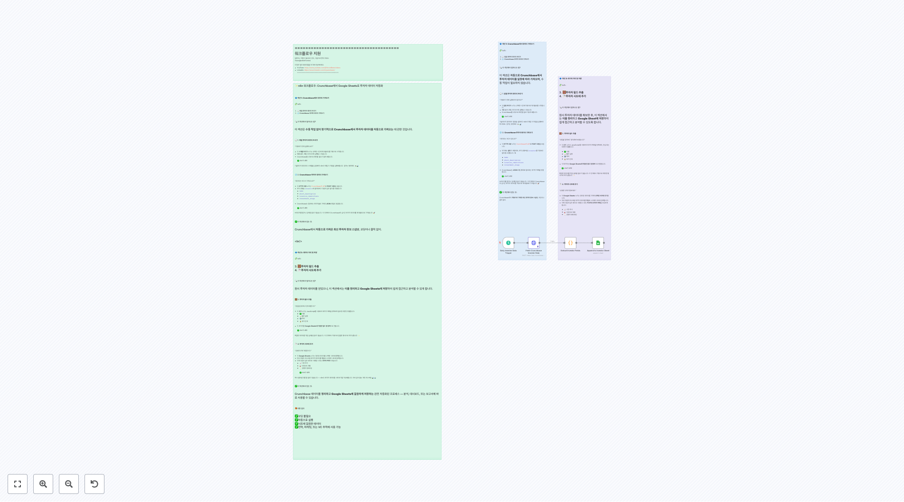

# 금융 워크플로우

이 폴더에는 finance 관련 **40개의 워크플로우**가 포함되어 있습니다.

## 📋 워크플로우 목록

**워크플로우 2079**
Shopify 라인 위치 다중 위치 Shopify 계정의 경우, 이 그룹의 노드들은 각 주문 라인에 대한 활성 위치 ID를 가져옵니다.

**워크플로우 2195**
설정 1/ 자격 증명 추가 [Stripe](https://docs.n8n.io/integrations/builtin/credentials/stripe/) 2/ 구성 노드 채우기 👇

**워크플로우 2320**
2. LlamaParse를 사용한 고급 PDF 처리 [HTTP 요청 사용에 대해 더 읽기](https://docs.n8n.io/integrations/builtin/core-nodes/n8n-nodes-base.httprequest/) LlamaIndex의 LlamaCloud는 클라우드 기반 서비스로, 문서를 업로드, 파싱, 그리고 인덱싱할 수 있게 합니다...

**워크플로우 2328**
4. 이 도구는 캘린더 이벤트를 생성합니다 이 도구는 이벤트 세부 정보와 참석자 목록이 주어지면, 새로운 Google 캘린더 이벤트를 생성하고 참석자를 추가할 것입니다.

**워크플로우 2335**
1단계. 대상 폴더 선택 [로컬 파일 트리거에 대해 자세히 읽기](https://docs.n8n.io/integrations/builtin/core-nodes/n8n-nodes-base.localfiletrigger) 이 워크플로우에서 n8n이 접근할 수 있는 특정 디스크 폴더를 모니터링하겠습니다. 도커를 사용하고 있으므로, n8n 볼륨을 사용하거나 호스트...

**워크플로우 2338**
1단계. 은행 명세서 수신 대기 [로컬 파일 트리거에 대해 자세히 읽기](https://docs.n8n.io/integrations/builtin/core-nodes/n8n-nodes-base.localfiletrigger) 이 데모에서, n8n이 로컬 파일 시스템과 작업하는 데 충분히 유능하다는 것을 보여주겠습니다. 이는 개인 정보 보호와 데이터 보안 측...

**워크플로우 2341**
1단계. 세금 코드 PDF 다운로드 [Zip 파일 다루기 방법에 대해 더 읽기](https://docs.n8n.io/integrations/builtin/core-nodes/n8n-nodes-base.compression/) 모든 세금 코드를 별도의 PDF 파일로 포함한 ZIP 파일을 가져오는 것으로 시작합시다. n8n의 압축 노드를 사용하여 즉시 압축을 ...

**워크플로우 2389**
인보이스를 인식하고 구조화된 JSON으로 변환 비디오 데모 https://youtu.be/mGPt7fqGQD8 빠른 OCR 놀이터 1. OakPDF OCR API 키를 여기서 얻으세요: https://rapidapi.com/restyler/api/receipt-and-invoice-ocr-api 2. OCR 놀이터로 이동하여 문서를 업로드하거나 예제 파일을...

**워크플로우 2421**
시도해 보세요! 이 워크플로는 은행 명세서를 마크다운으로 변환하며, Vision Language Models("VLMs")의 힘을 사용하여 세부 사항을 충실하게 캡처합니다. 결과적인 마크다운은 표준 LLM에 의해 다시 구문 분석되어 문서에서 모든 입금 테이블 행을 식별하는 등의 데이터를 추출할 수 있습니다. 이 워크플로는 다운로드된 PDF와 스캔된 PDF ...

**워크플로우 2619**
1. 최신 AI 보조금 가져오기, 이미 본 것 무시 [중복 제거 노드에 대해 더 알아보기](https://docs.n8n.io/integrations/builtin/core-nodes/n8n-nodes-base.removeduplicates/) n8n의 중복 제거 노드의 멋진 기능은 실행 간에 작동한다는 것입니다. 이 템플릿에 대해 이것이 의미하는 바는 노...

## 📋 워크플로우 목록 (11-20)

**워크플로우 2757**
적절한 데이터 가져오기 이 노드들은 웹훅 노드에서 필요한 데이터만 추출하기 위한 것입니다.

**워크플로우 2758**
리드 필터 저는 오픈된 상태이고 소스가 웹사이트인 것들만 처리했습니다. 모든 리드를 원하시면 이 필터를 제거할 수 있습니다.

**워크플로우 2906**
번역할 텍스트가 입력되지 않았습니다.

**워크플로우 2961**
Output 에는 번역된 텍스트만 포함되어야 합니다. 하지만 입력 텍스트가 제공되지 않았으므로, 번역할 내용이 없습니다. 이는 시스템 지침에 따라 추가 텍스트를 피하기 위해 빈 응답으로 처리합니다.

**워크플로우 2970**
Output 여전히 비어 있음. 이는 예상치 못한 입력입니다. 하지만 지시사항에 따라 번역된 결과를 한국어로만 반환해야 하므로, 빈 입력에 대한 번역은 빈 출력입니다.

**워크플로우 3016**
설정 1. 귀하의 **Gmail** 및 **Google Drive** 자격 증명을 설정하세요 2. 귀하의 **Google Sheets** 자격 증명을 설정하세요 3. 귀하의 **OpenAI** API 키를 설정하세요

**워크플로우 3050**
AI에게 모든 항목을 다시 보내기 위해, 우리는 모든 것을 하나의 항목으로 집계하여 마무지해야 합니다. 그렇지 않으면, 한 번에 하나의 항목으로 응답할 것이고, AI는 도착하는 첫 번째 항목만 받을 것입니다.

**워크플로우 3053**
시나리오 1 - AI 에이전트

**워크플로우 3107**
회사 연구 Perplexity Deep Research를 사용하여 회사의 더 많은 정보를 찾을 수 있습니다.

**워크플로우 3145**
👆 폼에 인증을 추가하세요. Basic Auth를 선택하여 무단 접근을 방지하세요.

## 📋 워크플로우 목록 (21-30)

**워크플로우 3160**
Output

**워크플로우 3202**
번역할 텍스트가 입력되지 않았습니다.

**워크플로우 3396**
2. 첨부 파일이 송장인지 분류하기 [Outlook 노드에 대해 더 알아보기](https://docs.n8n.io/integrations/builtin/app-nodes/n8n-nodes-base.microsoftoutlook) 각 자격을 갖춘 메시지에 대해, 포함된 첨부 파일 중 어떤 것이 실제 송장 문서인지 알아야 합니다. 이를 위해 Google Gem...

**워크플로우 3422**
🧠 CoinMarketCap_Crypto_Agent_Tool 가이드 이 에이전트는 **n8n**의 모듈식 **CoinMarketCap AI Analyst** 시스템의 일부로, 가격, 공급, 메타데이터, 순위, 및 변환과 같은 **암호화폐 수준 쿼리**에 중점을 둡니다. 🔌 지원되는 엔드포인트: 1. `/v1/cryptocurrency/map` – ID, 기...

**워크플로우 3424**
CoinMarketCap DEXScan AI Agent Tool (n8n 워크플로우) 🧠 다중 에이전트 시스템: DEXScan 에이전트 이 워크플로는 CoinMarketCap AI Analyst 생태계에서 **DEX 지능 기능**을 구동합니다. 분산형 거래소 전반의 **유동성**, **거래량**, **스팟 페어**, **거래 활동**에 대한 깊이 있는 통찰...

**워크플로우 3425**
CoinMarketCap AI 분석 에이전트 (n8n 워크플로) 🧠 다중 에이전트 시스템 개요 이것은 **CoinMarketCap AI 분석 워크플로의 주요 감독 에이전트**로, **n8n에서 모듈식 AI 에이전트 아키텍터**를 사용하여 설계되었습니다. ⚠️ **이 워크플로는 제대로 작동하기 위해 3개의 외부 도구 워크플로가 필요합니다.** 다음을 다운로드...

**워크플로우 3617**
n8n 워크플로의 주요 섹션 **🟢 Schedule Trigger** - 매월 5일에 자동화를 트리거합니다. - 월간 보고를 위한 리듬을 설정합니다. **📅 Date & Time + 🧮 PreviousMonth** - 현재 날짜를 캡처하고 동적 필터링을 위해 이전 월/년을 도출합니다. - 모든 SQL 쿼리에서 월별 슬라이싱에 사용됩니다. ** Get Cos...

**워크플로우 3719**
Gmail PDF 송장/영수증 분류기 및 Google Drive 업로더 (n8n 및 OpenAI를 통해) _**면책 조항**: AI 분류는 완벽하지 않습니다. 올바른 문서가 식별되고 업로드되었는지 항상 확인하세요._ 이 n8n 워크플로우는 웹훅을 통해 트리거되며, 지정된 날짜 범위 내 Gmail에서 이메일을 검색하여 PDF 첨부 파일을 추출하고, OpenA...

**워크플로우 3751**
텔레그램 응답 보내기 최종 AI 생성 요약을 사용자에게 보냅니다. ⚠️ chatId를 >와 같은 동적 값으로 바꾸어 올바른 사용자에게 보내도록 하세요.

**워크플로우 3790**
AI 에이전트 GPT-4o에 의해 구동되는 AI 에이전트로, 기술 분석과 뉴스 감정을 결합하여 주식을 분석하고, 히브리어로 상세한 보고서를 생성하며 데이터 기반의 투자 추천을 제공합니다.

## 📋 워크플로우 목록 (31-40)

**워크플로우 3951**
🧾 콜롬비아 전자 송장 처리 이 N8N 워크플로우는 **개인 전자 송장**을 Gmail을 통해 수신한 후 추출 및 조직화하는 작업을 자동화합니다. 주요 단계는 다음과 같습니다: 🔁 플로우 요약 1. **이메일 트리거** - `.zip` 첨부 파일이 포함된 이메일을 **30분마다** Gmail에서 확인합니다 (송장을 포함한다고 가정). - 콜롬비아 DIAN ...

**워크플로우 3960**
자동화된 재무 추적기: Telegram 인보이스를 Notion으로 AI 요약 및 보고서와 함께

**워크플로우 4092**
들어오는 텔레그램 명령 트리거 이 노드는 새로운 텔레그램 메시지를 감지하여 보고서 생성을 시작합니다.

**워크플로우 4105**
웹훅 쿼리를 시뮬레이션하기 위한 고정 데이터

**워크플로우 4247**
로컬에서 인보이스의 PDF 파일 읽기

**워크플로우 4334**
이메일 읽기

**워크플로우 4376**
AI 송장 처리 에이전트: 이메일에서 구조화된 데이터로 자동으로 Gmail 첨부 파일에서 송장 데이터를 추출, 분석 및 구조화된 Google Sheets로 정리합니다. 완벽한 솔루션: ✅ 회계사 및 부기 담당자 — 송장에서 수동 데이터 입력 제거 ✅ 소규모 사업체 — 송장 처리 및 추적 간소화 ✅ 재무 팀 — 미지급금 워크플로 자동화 ⚙️ 사용된 도구 n8...

**워크플로우 4452**
설정 필요 Google Sheets 구조: 시트: "Invoices" • 열 A: 송장 번호 • 열 B: 송장 날짜 • 열 C: 마감 날짜 • 열 D: 공급업체 이름 • 열 E: 총 금액 • 열 F: 통화 • 열 G: 항목 • 열 H: 세금 • 열 I: 카테고리 • 열 J: 승인됨 • 열 K: 승인 노트 • 열 L: 검토자 필요한 자격증명: • Google...

**워크플로우 4731**
🔷 **섹션 1: Crunchbase에서 데이터 가져오기** 🧩 노드: 1. 🕒 **일일 투자자 데이터 트리거** 2. 🌐 **Crunchbase 투자자 데이터 가져오기** --- 🔍 이 섹션에서 일어나는 일? 이 섹션은 **자동으로 Crunchbase에서 투자자 데이터를 일정에 따라 가져오며**, 수동 작업이 필요하지 않습니다. --- 🕒 1. **일일 ...

**워크플로우 4867**
🧠 주식 분석 어시스턴트 이 워크플로우는 선택된 S&P 500 주식을 RSI 및 MACD 지표를 사용하여 분석하고, 통찰을 평범한 영어로 요약하며, 미국 시장 시간(월요일부터 금요일) 동안 매 시간 Slack에 업데이트를 게시합니다.

## 🔧 구현 가이드

### 워크플로우 사용 방법
1. 원하는 워크플로우의 JSON 링크를 클릭합니다.
2. n8n 인스턴스에서 'Import' 기능을 사용하여 워크플로우를 가져옵니다.
3. 필요한 자격 증명과 설정을 구성합니다.
4. 워크플로우를 테스트하고 필요에 따라 커스터마이즈합니다.

### 주의사항
- 각 워크플로우는 특정 서비스나 API의 자격 증명이 필요할 수 있습니다.
- 워크플로우를 실행하기 전에 모든 노드의 설정을 확인하세요.
- 테스트 환경에서 먼저 워크플로우를 검증한 후 프로덕션에 적용하세요.

---

💡 **총 40개의 워크플로우**가 이 카테고리에서 제공됩니다.
