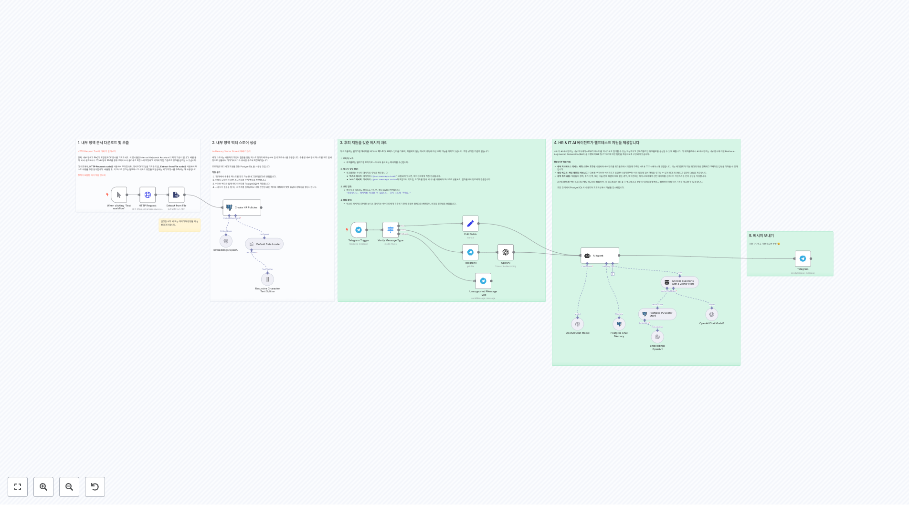
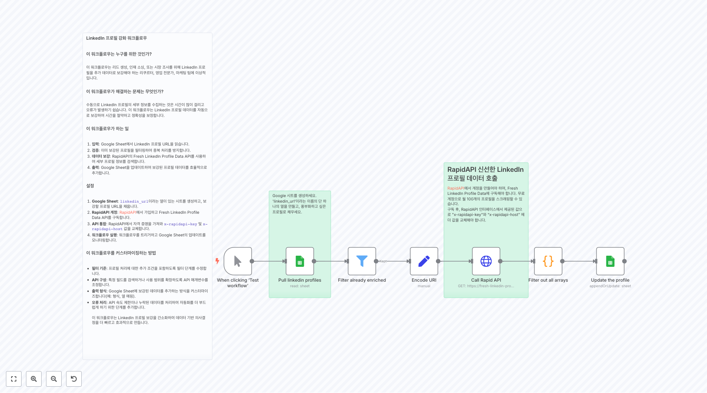

# HR 워크플로우

이 폴더에는 hr 관련 **29개의 워크플로우**가 포함되어 있습니다.

## 📋 워크플로우 목록

**워크플로우 2328**
4. 이 도구는 캘린더 이벤트를 생성합니다 이 도구는 이벤트 세부 정보와 참석자 목록이 주어지면, 새로운 Google 캘린더 이벤트를 생성하고 참석자를 추가할 것입니다.

**워크플로우 2413**
Notion 지식 베이스 어시스턴트 [v1] [30 Day AI Sprint](https://30dayaisprint.notion.site/)의 일부로 [@maxtkacz](https://x.com/maxtkacz)에 의해 제작됨

**워크플로우 2415**
특정 Notion DB 스키마에 대한 새 워크플로 버전 생성 Notion 데이터베이스 URL을 입력하고, 이 템플릿에 기반하여 해당 URL에 대한 AI Assistant 챗봇 워크플로를 얻습니다: https://n8n.io/workflows/2413-notion-knowledge-base-ai-assistant/ Notion 프로젝트: https://www...

**워크플로우 2416**
저를 시험해 보세요! 이 워크플로는 후보자 이력서 PDF를 이미지로 변환한 후, Vision Language Model (VLM)에 의해 '읽음'됩니다. VLM은 후보자의 CV가 원하는 역할에 적합한지 평가합니다. 이 접근법은 이력서에 심어진 '숨겨진 프롬프트'를 방지하기 위해 사용될 수 있으며, 이는 AI를 사용하여 자동 ATS 시스템을 우회하거나 조작하...

**워크플로우 2530**
워크시트가 존재하는지 확인

**워크플로우 2572**
CV와 직무 설명에 직접 링크 추가

**워크플로우 2579**
1. 이력서 업로드 신청 양식 [Form Trigger 노드에 대해 더 알아보기](https://docs.n8n.io/integrations/builtin/core-nodes/n8n-nodes-base.formtrigger/) 우리의 지원 프로세스는 지원자의 이력서를 처리하기 위해 간단한 파일 업로드로 시작합니다.

**워크플로우 2651**
... 또는 설정 비디오 보기 [10분]

**워크플로우 2752**
1. 내부 정책 문서 다운로드 및 추출 [HTTP Request Tool에 대해 더 알아보기](https://docs.n8n.io/integrations/builtin/core-nodes/n8n-nodes-base.httprequest) 먼저, 내부 정책과 FAQ가 포함된 PDF 문서를 가져오세요. 이 문서들은 Internal Helpdesk Assista...

**워크플로우 2772**
동기화 유지 매핑을 업데이트하면, 다른 노드에서도 변경하세요!

## 📋 워크플로우 목록 (11-20)

**워크플로우 2773**
사용자 세부 정보를 가져와 Airtable에 업데이트

**워크플로우 2808**
Google 시트를 생성하세요. 'linkedin_url'이라는 이름의 단 하나의 열을 만들고, 풍부화하고 싶은 프로필로 채우세요.

**워크플로우 2825**
ScrapingBee, Glassdoor, OpenAI, 및 QuickChart를 사용하여 직장 차별 패턴을 감지하세요

**워크플로우 2850**
1단계: 회사 정책을 검색하여 가져오고 이를 벡터 저장소에 로드하세요

**워크플로우 2860**
HR 전문가 이 워크플로우는 구인 지원서 처리 프로세스를 자동화하여, 제출된 이력서에서 관련 정보를 추출하고, 지원자의 자격을 미리 정의된 프로필과 비교 분석한 후, 결과를 Google 스프레드시트에 저장합니다.

**워크플로우 2924**
https://hn.algolia.com으로 이동하세요 - "Ask HN: Who is hiring?"로 필터링하세요 (인용부호를 사용하여 완전 일치하도록 중요) - 날짜로 정렬하세요 - Chrome 네트워크 탭 > API 호출 찾기 > "Copy as cURL" 클릭 - n8n HTTP 노드 -> cURL 가져오기 및 붙여넣기 - API 키를 Header...

**워크플로우 2979**
🗂️ Google Drive에 대한 대량 파일 업로드 및 폴더 관리 개요 이 워크플로우는 폼 제출을 처리하며, 다음을 허용합니다: - 여러 파일 업로드 (모든 형식) - 대상 폴더 이름 입력 워크플로우는 자동으로: - 지정된 폴더가 Google Drive에 존재하는지 확인 - 폴더가 존재하지 않으면 생성 - 모든 파일을 올바른 폴더에 업로드 - 원본 파일 ...

**워크플로우 3051**
번역된 텍스트: 아무런 입력 텍스트가 제공되지 않았으므로, 번역할 내용이 없습니다.

**워크플로우 3145**
👆 폼에 인증을 추가하세요. Basic Auth를 선택하여 무단 접근을 방지하세요.

**워크플로우 3318**
제출, Google Drive에 저장 및 추출 **폼에서 사용자 정보를 캡처합니다.** **이력서를 Google Drive에 업로드합니다.** **PDF(이력서)에서 데이터를 추출합니다.**

## 📋 워크플로우 목록 (21-29)

**워크플로우 3363**
체크 데이 네임스 도구 1. 이 흐름의 이 부분은 "체크 데이 네임스 도구"에 내장된 것의 복사본일 뿐입니다. 실행되지 않습니다. 2. 이 흐름의 이 부분을 업데이트하려면, ctrl-c로 복사하여 다른 통합 문서에 붙여넣으세요. 서브-워크플로 실행을 추가하세요. 워크플로가 모든 데이터를 수용하도록 설정하세요. 흐름을 복사하세요. "체크 데이 네임스 도구" ...

**워크플로우 3546**
이력서 스크리너: Gmail에서 Sheets로 📃시작하기 전에 다음이 필요합니다: - [n8n 설치](https://n8n.partnerlinks.io/n8nTTVideoGenTemplate) - [OpenAI API 키](https://platform.openai.com/api-keys) - [Google Cloud Console](https://cons...

**워크플로우 3580**
LinkedIn 작업 데이터 스크래퍼를 Google Sheets로 LinkedIn에서 Bright Data를 통해 실시간 작업 게시물을 스크래핑하고, 이를 정리한 후 Google Sheets로 보내기. 사용 목적: ✅ 작업 수색 — 신선하고 필터링된 역할 ✅ 판매 잠재 고객 탐색 — 채용 중인 회사 찾기 (즉, 성장 중인 회사) ⚙️ 사용된 도구 n8n 노...

**워크플로우 3860**
아웃풋

**워크플로우 3958**
무엇을 하는가? 목적: 새로운 고객을 위한 온보딩 프로세스를 간소화하여, 필요한 모든 자원과 지원을 받을 수 있도록 합니다. 트리거: 새로운 고객이 추가될 때 웹훅 트리거나 CRM 트리거(예: HubSpot 또는 Salesforce)를 설정합니다. 환영 이메일 보내기: Gmail 또는 SMTP 노드를 사용하여 고객에게 개인화된 환영 이메일을 보냅니다. 환영...

**워크플로우 3969**
1. 지난 주 모든 활동 가져오기 [Slack 노드에 대해 더 알아보기](https://docs.n8n.io/integrations/builtin/app-nodes/n8n-nodes-base.slack) 우리는 지난 7일 동안 우리 팀 채널의 모든 활동을 가져와 메시지 작성자별로 그룹화하는 것으로 시작하겠습니다. Slack 노드와 DateTime 필터를 사...

**워크플로우 3971**
1. 지난 주 채널 메시지 모두 가져오기 [MS Teams 노드에 대해 자세히 알아보기](https://docs.n8n.io/integrations/builtin/app-nodes/n8n-nodes-base.microsoftteams) 지난 7일 동안 우리 팀 채널의 모든 활동을 가져와 메시지 작성자별로 그룹화하겠습니다. 이를 MS Teams 노드를 사용하...

**워크플로우 4330**
면책 조항 이 템플릿은 n8n 자체 호스팅에서만 이용 가능합니다. 왜냐하면 MCP 클라이언트를 위한 커뮤니티 노드를 사용하고 있기 때문입니다.

**워크플로우 4514**
📝 1단계: 귀하의 직무 설명 추가 **아래의 노란색 상자에 귀하의 완전한 직무 공고를 간단히 붙여넣으세요** 포함: - 직무 제목 - 회사 이름 - 책임 - 요구사항 - 기타 관련 세부 사항 AI가 귀하의 텍스트에서 모든 것을 이해할 것입니다!

## 🔧 구현 가이드

### 워크플로우 사용 방법
1. 원하는 워크플로우의 JSON 링크를 클릭합니다.
2. n8n 인스턴스에서 'Import' 기능을 사용하여 워크플로우를 가져옵니다.
3. 필요한 자격 증명과 설정을 구성합니다.
4. 워크플로우를 테스트하고 필요에 따라 커스터마이즈합니다.

### 주의사항
- 각 워크플로우는 특정 서비스나 API의 자격 증명이 필요할 수 있습니다.
- 워크플로우를 실행하기 전에 모든 노드의 설정을 확인하세요.
- 테스트 환경에서 먼저 워크플로우를 검증한 후 프로덕션에 적용하세요.

---

💡 **총 29개의 워크플로우**가 이 카테고리에서 제공됩니다.
