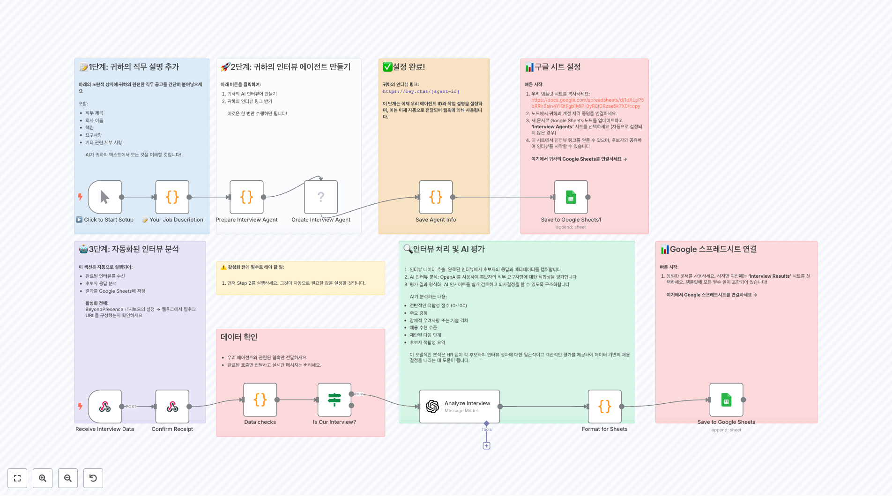

# HR 워크플로우

이 폴더에는 인사 관리 자동화, 채용 프로세스, 직원 관리, AI 기반 HR 도구들이 포함되어 있습니다.

## 🤖 AI 기반 채용 시스템

### 지능형 인터뷰 자동화

**BeyondPresence Agent HR 인터뷰 시스템**
AI 기반 자동화된 인터뷰 시스템으로, 채용 담당자가 인터뷰 에이전트를 생성하고 실시간 분석 결과를 받아볼 수 있습니다. Google Sheets와 연동되어 후보자 응답을 자동으로 분석하고 저장합니다.

**인터뷰 스케줄러**
AI 기반 인터뷰 일정 조정 시스템으로 Google Calendar와 연동됩니다. 후보자와 자연스러운 대화를 통해 선호하는 날짜와 시간을 확인하고 자동으로 인터뷰 일정을 예약합니다.

### 이력서 분석 및 평가

**자동화된 이력서 채용 매칭 엔진**
Bright Data와 OpenAI 4o mini를 활용하여 LinkedIn에서 채용 정보를 실시간으로 스크래핑하고 이력서와 자동으로 매칭시키는 지능형 시스템입니다.

**이력서 스크리너: Gmail에서 Sheets로**
Gmail로 접수된 이력서를 AI가 자동으로 분석하여 평점을 매기고, 이름, 이메일, LinkedIn 프로필을 추출하여 Google Sheets에 정리하는 자동화 시스템입니다.

**자동화된 이력서 검토 시스템**
폼으로 제출된 이력서를 OpenAI로 분석하여 구조화된 정보를 추출하고 AI가 채용 적합성을 평가한 후 Google Sheets에 저장하는 완전 자동화 시스템입니다.

**HR 중심 자동화 파이프라인**
AI 기반 CV 평가 시스템으로 이력서에서 학력, 경력, 기술을 추출하고 요약하여 채용 결정에 도움을 주는 종합적인 HR 자동화 도구입니다.

**이력서 분석 및 적합한 채용 공고 찾기**
Google Drive에서 이력서 PDF를 가져와 AI로 분석한 후 적합한 채용 공고를 찾아 Google Sheets에 정리하는 양방향 매칭 시스템입니다.

**HR 채용 공고 및 평가 with AI**
온라인 채용 공고 폼과 연동되어 지원자 정보를 Airtable에 저장하고 AI로 이력서를 분석하여 점수를 매기는 완전한 채용 관리 시스템입니다.

## 📊 팀 관리 및 커뮤니케이션

### 자동 보고서 생성

**Microsoft Teams 주간 보고서 생성**
Microsoft Teams 채널 메시지를 분석하여 팀원별 주간 활동 보고서를 자동 생성하고, AI가 성과와 과제를 요약하여 매주 월요일에 공유합니다.

**Slack 기반 주간 팀 보고서 생성**
Slack 채널의 지난 주 메시지들을 분석하여 개별 팀원과 전체 팀의 주간 보고서를 AI로 생성하는 자동화된 팀 관리 도구입니다.

### 온보딩 및 직원 관리

**OnboardAIgen - Slack x Jira x Drive 온보딩 자동화**
신규 직원 온보딩을 위한 통합 자동화 시스템으로 Slack, Jira, Google Drive를 연결하여 신입사원의 첫 출근 준비를 완전 자동화합니다.

**고객 온보딩 캘린더 에이전트**
웹훅을 통해 신규 고객 정보를 받아 AI 캘린더 에이전트가 자동으로 환영 이메일, 온보딩 미팅 일정, CSM 배정을 처리하는 완전 자동화 시스템입니다.

## 🔍 채용 데이터 수집 및 분석

### 채용 공고 스크래핑

**LinkedIn 채용 데이터 스크래퍼**
Bright Data를 통해 LinkedIn에서 실시간 채용 공고를 스크래핑하고 정리하여 Google Sheets로 전송하는 고급 채용 정보 수집 도구입니다.

**Hacker News "Who is Hiring" 스크래핑**
Hacker News의 월간 채용 공고를 자동으로 스크래핑하여 AI로 구조화된 정보로 파싱하고 저장하는 효율적인 채용 정보 수집 시스템입니다.

**LinkedIn 프로필 자동 강화 도구**
RapidAPI를 통해 LinkedIn 프로필 데이터를 가져와 Google Sheets의 연락처 정보를 자동으로 보강하는 영업 및 채용 지원 도구입니다.

### AI 기반 차별 패턴 분석

**AI 기반 직장 차별 패턴 탐지**
회사의 다양성 데이터를 AI로 분석하여 잠재적인 차별 패턴을 감지하고 개선 방안을 제시하는 고급 HR 분석 도구입니다.

## 🤖 HR 지원 시스템

### AI 챗봇 및 정책 관리

**BambooHR AI 정책 및 혜택 챗봇**
회사 정책 문서와 혜택 정보를 벡터 데이터베이스에 저장하고 직원들이 자연어로 질문할 수 있는 지능형 HR 챗봇 시스템입니다.

**HR & IT 헬프데스크 챗봇**
음성 전사 기능이 포함된 다기능 헬프데스크 챗봇으로 회사 정책 문서를 기반으로 직원들의 HR 및 IT 관련 질문에 답변합니다.

### 회의 및 시간 관리

**AI 기반 회의 분석 워크플로우**
Google Meet 회의 전사록을 AI로 분석하여 핵심 내용을 요약하고 후속 조치를 자동으로 생성하는 회의 효율성 향상 도구입니다.

**위치 기반 자동 출석 시스템**
iPhone 단축어와 Google Sheets를 활용하여 직원의 위치를 감지해 자동으로 출퇴근을 기록하는 스마트 출석 관리 시스템입니다.

## 📄 문서 자동화 및 관리

### 문서 생성 및 처리

**폼에서 Google Docs 자동 생성**
온라인 폼 제출 내용을 기반으로 Google Docs 템플릿을 복사하여 자동으로 개인화된 문서를 생성하는 문서 자동화 도구입니다.

**Google Drive 배치 파일 업로드**
여러 파일을 한 번에 Google Drive의 특정 폴더로 업로드하는 편리한 파일 관리 자동화 도구입니다.

### 작업 관리 및 동기화

**실시간 Notion Todoist 양방향 동기화**
Notion 데이터베이스와 Todoist 프로젝트 간의 실시간 양방향 동기화를 구현하는 강력한 생산성 관리 템플릿입니다.

### 지식 관리

**Notion 기반 지식베이스 어시스턴트**
AI 검색 기능이 탑재된 Notion 지식베이스 시스템으로 직원들이 필요한 정보를 빠르게 찾고 FAQ에 대한 답변을 자동으로 제공합니다.

## 📈 추가 워크플로우들

### 기타 관리 도구들

**워크플로우 2651** - 추가 HR 자동화 도구

**워크플로우 2572** - HR 프로세스 최적화

**워크플로우 2579** - 직원 관리 시스템

**워크플로우 2415** - HR 데이터 분석

**워크플로우 2416** - 인사 관리 자동화

## 🚀 구현 가이드

### 기본 설정
1. **필수 자격 증명**
   - OpenAI API 키 (AI 분석용)
   - Google Workspace OAuth (Gmail, Sheets, Drive, Calendar)
   - Slack/Teams API (팀 커뮤니케이션)
   - 채용 플랫폼 API (LinkedIn, Indeed 등)

2. **데이터베이스 설정**
   - PostgreSQL (벡터 저장소용)
   - Redis (캐싱용, 선택사항)

### 보안 고려사항
- 개인정보 보호 규정 (GDPR, CCPA) 준수
- 이력서 및 개인 데이터 암호화 저장
- API 키 및 민감한 정보의 안전한 관리
- 액세스 권한 및 감사 로그 구현

### 확장성 전략
- 마이크로서비스 아키텍처 적용
- 로드 밸런싱 및 자동 스케일링 설정
- 다중 지역 배포 (글로벌 기업용)
- 실시간 모니터링 및 알림 시스템

### 성능 최적화
- AI 모델 응답 시간 최적화
- 데이터베이스 쿼리 성능 튜닝
- 캐싱 전략 구현
- 배치 처리를 통한 대용량 데이터 처리

## 🔧 주요 통합 서비스

### AI 및 머신러닝
- **OpenAI**: GPT-4, GPT-3.5, 임베딩 생성
- **LangChain**: AI 워크플로우 체인 구성
- **Vector Databases**: 지능형 검색 및 매칭

### 커뮤니케이션 플랫폼
- **Slack**: 팀 커뮤니케이션 및 봇
- **Microsoft Teams**: 엔터프라이즈 협업
- **Telegram**: 알림 및 간단한 상호작용

### 데이터 관리
- **Google Workspace**: Sheets, Docs, Drive, Calendar
- **Airtable**: 구조화된 데이터베이스
- **Notion**: 지식 관리 및 문서화

### 채용 플랫폼
- **LinkedIn**: 프로필 데이터 및 채용 공고
- **BeyondPresence**: AI 인터뷰 플랫폼
- **BambooHR**: HR 관리 시스템

## 📚 관련 자료

### 문서 및 가이드
- [n8n HR 자동화 모범 사례](https://docs.n8n.io/workflows/hr/)
- [AI 기반 채용 가이드](https://docs.n8n.io/ai-recruiting/)
- [GDPR 준수 체크리스트](https://docs.n8n.io/security/gdpr/)

### 커뮤니티 리소스
- [n8n HR 자동화 포럼](https://community.n8n.io/c/hr-automation/)
- [HR 워크플로우 템플릿 라이브러리](https://n8n.io/workflows/hr/)
- [AI HR 도구 비교](https://n8n.io/blog/ai-hr-tools/)

### 교육 자료
- [HR 자동화 온라인 코스](https://learn.n8n.io/hr-automation/)
- [AI 기반 채용 웨비나](https://n8n.io/webinars/ai-recruiting/)
- [실무 적용 사례 연구](https://n8n.io/case-studies/hr/)

## 💡 사용 사례

### 스타트업 (1-50명)
- 기본적인 이력서 스크리닝 자동화
- 간단한 온보딩 프로세스
- AI 기반 FAQ 챗봇

### 중견기업 (50-500명)
- 포괄적인 채용 파이프라인 자동화
- 팀 성과 분석 및 보고
- 직원 피드백 수집 및 분석

### 대기업 (500명+)
- 엔터프라이즈급 HR 자동화
- 다양성 및 포용성 분석
- 글로벌 인재 관리 시스템

이 HR 워크플로우 컬렉션은 채용부터 직원 관리까지 인사 업무의 모든 측면을 자동화하고 AI로 향상시켜 조직의 효율성과 직원 경험을 크게 개선할 수 있습니다.