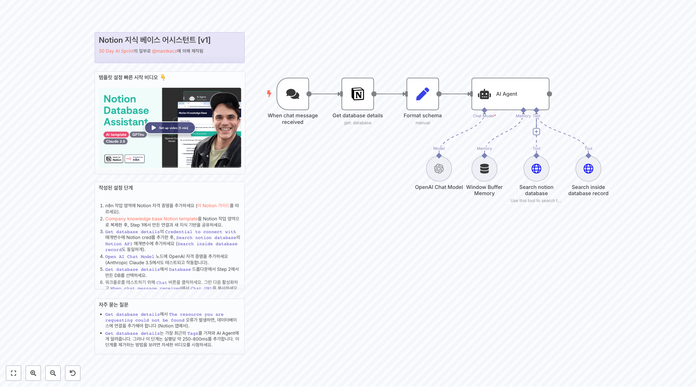
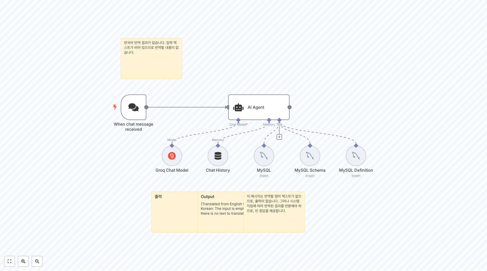
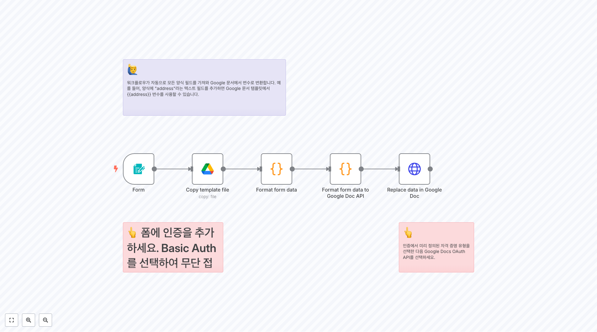
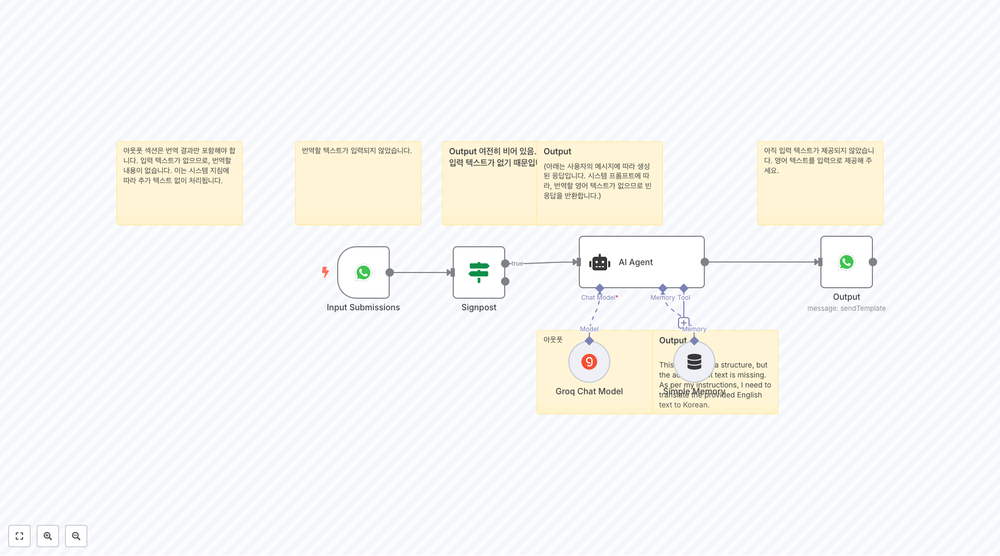
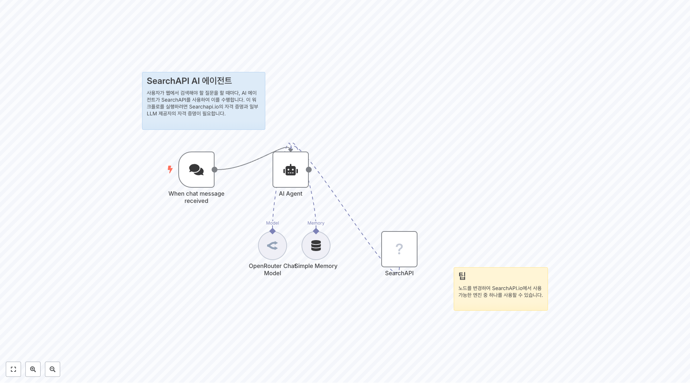
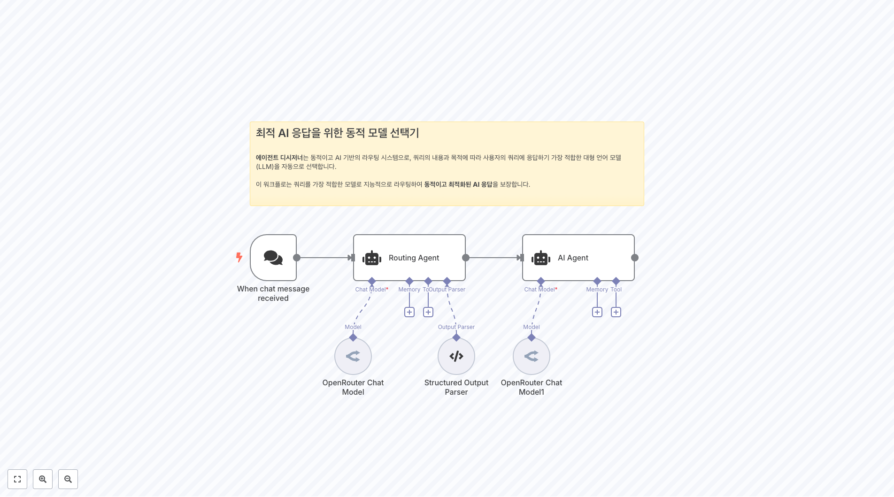

# IT 운영 워크플로우

이 폴더에는 it-ops 관련 **59개의 워크플로우**가 포함되어 있습니다.

## 📋 워크플로우 목록

[](https://raw.githubusercontent.com/n8nKOR/n8n-shared-workflow/refs/heads/main/workflows/n8nworkflows/it-ops/2042.json)
**워크플로우 2042**
예시 출력: ```JSON { "링크": "https://drive.google.com/u/3/uc?id=1hojqPfXchNTY8YRTNkxSo-8txK9re-V4&export=download&confirm=t&authuser=0", "이름": "firefox_rNjA0ybKu7.png", "종류": "drivepermission", "ID": "anyo...

[](https://raw.githubusercontent.com/n8nKOR/n8n-shared-workflow/refs/heads/main/workflows/n8nworkflows/it-ops/2045.json)
**워크플로우 2045**
**Config Bot**을 사용하여 Telegram 세부 사항을 설정하세요, 예를 들어: 1- Telegram 그룹 ID (봇을 관리자로 추가하는 것을 잊지 마세요) 2- Telegram 채널 ID (봇을 관리자로 추가하는 것을 잊지 마세요) 3- 귀하의 Telegram 봇 토큰 (@BotFather를 통해 생성하세요) 데이터 설정 및 필터 및 올바른 측...

[](https://raw.githubusercontent.com/n8nKOR/n8n-shared-workflow/refs/heads/main/workflows/n8nworkflows/it-ops/2054.json)
**워크플로우 2054**
정보 가져오기 이 섹션은 가능한 모든 오류를 확인하고 우리의 경고를 생성하기 위해 필요한 모든 데이터를 가져옵니다.

[](https://raw.githubusercontent.com/n8nKOR/n8n-shared-workflow/refs/heads/main/workflows/n8nworkflows/it-ops/2075.json)
**워크플로우 2075**
현재 백업을 오래된 폴더로 이동하세요.

[](https://raw.githubusercontent.com/n8nKOR/n8n-shared-workflow/refs/heads/main/workflows/n8nworkflows/it-ops/2327.json)
**워크플로우 2327**
1. 일정 설정 [스케줄링 워크플로우에 대해 더 알아보기](https://docs.n8n.io/integrations/builtin/core-nodes/n8n-nodes-base.scheduletrigger/) 다운타임이 드물게 발생할 것으로 예상되므로, 우리 모니터는 하루 중 드물게만 확인해야 합니다. 이 목적으로 스케줄 트리거를 사용할 것입니다. 스케줄...

[](https://raw.githubusercontent.com/n8nKOR/n8n-shared-workflow/refs/heads/main/workflows/n8nworkflows/it-ops/2388.json)
**워크플로우 2388**
사용자 쿼리에서 HTML 생성 **HTTP 요청 노드** - OpenAI에 사용자 쿼리를 보냅니다, 정의된 JSON 응답 형식으로 - *OpenAI 노드에서 아직 구현되지 않았으므로 HTTP 요청 노드를 사용* - 응답 형식은 [OpenAI 소개 게시물에 정의된 Structured Output](https://openai.com/index/introduci...

[](https://raw.githubusercontent.com/n8nKOR/n8n-shared-workflow/refs/heads/main/workflows/n8nworkflows/it-ops/2397.json)
**워크플로우 2397**
 웹훅 트리거 첫 번째 노드는 Subscription Events API를 통해 Slack API에서 모든 메시지를 받습니다. 구독 이벤트 API 설정에 대한 자세한 정보는 [여기를 클릭](https://api.slack.com/apis/connections/events-api)하세요...

[](https://raw.githubusercontent.com/n8nKOR/n8n-shared-workflow/refs/heads/main/workflows/n8nworkflows/it-ops/2408.json)
**워크플로우 2408**
또한, 인가 URL의 끝에 &connection=github을 추가하면 사용자가 GitHub, Facebook 등을 통해 로그인할 수 있습니다.

[](https://raw.githubusercontent.com/n8nKOR/n8n-shared-workflow/refs/heads/main/workflows/n8nworkflows/it-ops/2413.json)
**워크플로우 2413**
Notion 지식 베이스 어시스턴트 [v1] [30 Day AI Sprint](https://30dayaisprint.notion.site/)의 일부로 [@maxtkacz](https://x.com/maxtkacz)에 의해 제작됨

[](https://raw.githubusercontent.com/n8nKOR/n8n-shared-workflow/refs/heads/main/workflows/n8nworkflows/it-ops/2415.json)
**워크플로우 2415**
특정 Notion DB 스키마에 대한 새 워크플로 버전 생성 Notion 데이터베이스 URL을 입력하고, 이 템플릿에 기반하여 해당 URL에 대한 AI Assistant 챗봇 워크플로를 얻습니다: https://n8n.io/workflows/2413-notion-knowledge-base-ai-assistant/ Notion 프로젝트: https://www...

## 📋 워크플로우 목록 (11-20)

[](https://raw.githubusercontent.com/n8nKOR/n8n-shared-workflow/refs/heads/main/workflows/n8nworkflows/it-ops/2420.json)
**워크플로우 2420**
1. 사진 가져오기 및 검증 [Google Drive 사용에 대해 더 알아보기](https://docs.n8n.io/integrations/builtin/app-nodes/n8n-nodes-base.googledrive) 이번 데모에서, 5개의 서로 다른 초상화를 가져와 AI 비전 모델을 테스트하겠습니다. 편의를 위해 Google Drive를 사용할 테지만...

[](https://raw.githubusercontent.com/n8nKOR/n8n-shared-workflow/refs/heads/main/workflows/n8nworkflows/it-ops/2435.json)
**워크플로우 2435**
여러 GitHub 리포지토리 모니터링 이 워크플로는 웹훅 사용으로 인해 폴링 없이 여러 GitHub 리포지토리를 동시에 모니터링할 수 있게 합니다. 또한 프로그래밍적으로 감시 목록에 리포지토리를 추가 및 삭제할 수 있게 하여 관리를 편리하게 합니다.

[](https://raw.githubusercontent.com/n8nKOR/n8n-shared-workflow/refs/heads/main/workflows/n8nworkflows/it-ops/2513.json)
**워크플로우 2513**
이미지 프롬프트 프롬프트는 `set image description` 노드에서 이미지 설명을 입력받아 OpenAI를 사용하여 생성합니다.

[](https://raw.githubusercontent.com/n8nKOR/n8n-shared-workflow/refs/heads/main/workflows/n8nworkflows/it-ops/2559.json)
**워크플로우 2559**
개요 - 이 워크플로는 네이티브 SQL 에이전트에게 데이터 시각화 기능을 제공하는 것을 목표로 합니다. - 이 둘을 함께 사용하면 팀 내에서 데이터 분석과 데이터 시각화를 촉진할 수 있습니다. - OpenAI의 Structured Output과 Quickchart.io 덕분에 잘 작동하는 네이티브 SQL 에이전트에 시각화 기능을 추가합니다. 작동 원리 1....

[](https://raw.githubusercontent.com/n8nKOR/n8n-shared-workflow/refs/heads/main/workflows/n8nworkflows/it-ops/2621.json)
**워크플로우 2621**
저장소 이름, 데이터베이스 ID 및 자격 증명을 대체하세요.

[](https://raw.githubusercontent.com/n8nKOR/n8n-shared-workflow/refs/heads/main/workflows/n8nworkflows/it-ops/2694.json)
**워크플로우 2694**
워크플로를 일주일에 한 번 트리거합니다.

[](https://raw.githubusercontent.com/n8nKOR/n8n-shared-workflow/refs/heads/main/workflows/n8nworkflows/it-ops/2749.json)
**워크플로우 2749**
Proxmox용 API 키 ** 자격 증명 생성 ** Proxmox Data Center에서 API 키로 자격 증명을 생성한 다음 자격 증명을 생성하세요. ** n8n에 자격 증명 추가 ** Credentails를 클릭하여 새 Credentails를 추가하고 Header Auth를 선택하세요. ** Header Auth에서 아래가 사용될 것입니다 이름 : ...

[](https://raw.githubusercontent.com/n8nKOR/n8n-shared-workflow/refs/heads/main/workflows/n8nworkflows/it-ops/2859.json)
**워크플로우 2859**
👨‍🎤 설정 1. 자신의 **PostgreSQL** 및 **OpenAI** 자격 증명을 추가하세요. 2. **Chat** 버튼을 클릭하고 데이터베이스에 질문을 시작하세요. 3. 워크플로를 활성화하면 채팅을 공개적으로 사용할 수 있습니다.

[](https://raw.githubusercontent.com/n8nKOR/n8n-shared-workflow/refs/heads/main/workflows/n8nworkflows/it-ops/2925.json)
**워크플로우 2925**
VPS 업그레이드 알림 이 워크플로는 매일 서버에 업그레이드 가능한 패키지가 있는지 확인하고, 있으면 이메일로 알려줄 것입니다.

[](https://raw.githubusercontent.com/n8nKOR/n8n-shared-workflow/refs/heads/main/workflows/n8nworkflows/it-ops/2979.json)
**워크플로우 2979**
🗂️ Google Drive에 대한 대량 파일 업로드 및 폴더 관리 개요 이 워크플로우는 폼 제출을 처리하며, 다음을 허용합니다: - 여러 파일 업로드 (모든 형식) - 대상 폴더 이름 입력 워크플로우는 자동으로: - 지정된 폴더가 Google Drive에 존재하는지 확인 - 폴더가 존재하지 않으면 생성 - 모든 파일을 올바른 폴더에 업로드 - 원본 파일 ...

## 📋 워크플로우 목록 (21-30)

[](https://raw.githubusercontent.com/n8nKOR/n8n-shared-workflow/refs/heads/main/workflows/n8nworkflows/it-ops/2985.json)
**워크플로우 2985**
출력

[](https://raw.githubusercontent.com/n8nKOR/n8n-shared-workflow/refs/heads/main/workflows/n8nworkflows/it-ops/3119.json)
**워크플로우 3119**
암호화 작업 인증서 생성 및 PDF 서명

[](https://raw.githubusercontent.com/n8nKOR/n8n-shared-workflow/refs/heads/main/workflows/n8nworkflows/it-ops/3145.json)
**워크플로우 3145**
👆 폼에 인증을 추가하세요. Basic Auth를 선택하여 무단 접근을 방지하세요.

[](https://raw.githubusercontent.com/n8nKOR/n8n-shared-workflow/refs/heads/main/workflows/n8nworkflows/it-ops/3296.json)
**워크플로우 3296**
주문 이행을 위한 필터링 👇 유효한 주문을 프로그램적으로 이행을 위해 필터링하세요 - 당신이 독점적으로 디지털 다운로드나 디지털 기프트 카드를 판매하는 경우 - 당신이 모든 제품에 대해 이행 서비스를 사용하는 경우

[](https://raw.githubusercontent.com/n8nKOR/n8n-shared-workflow/refs/heads/main/workflows/n8nworkflows/it-ops/3366.json)
**워크플로우 3366**
1. 웹페이지 내용을 가져오기 [HTTP 요청 노드에 대해 더 알아보기](https://docs.n8n.io/integrations/builtin/core-nodes/n8n-nodes-base.httprequest)

[](https://raw.githubusercontent.com/n8nKOR/n8n-shared-workflow/refs/heads/main/workflows/n8nworkflows/it-ops/3427.json)
**워크플로우 3427**
슬롯 가져오기

[](https://raw.githubusercontent.com/n8nKOR/n8n-shared-workflow/refs/heads/main/workflows/n8nworkflows/it-ops/3493.json)
**워크플로우 3493**
SSL-Checker.io를 사용하여 각 URL의 SSL 인증서를 확인합니다. 호스트, 유효 기간, 그리고 만료까지 남은 일수와 같은 세부 정보를 가져옵니다.

[](https://raw.githubusercontent.com/n8nKOR/n8n-shared-workflow/refs/heads/main/workflows/n8nworkflows/it-ops/3522.json)
**워크플로우 3522**
9개의 소셜 플랫폼에 자동 게시 Blotato’s API를 사용하여 배포를 자동화합니다. 비디오는 Instagram, YouTube, TikTok, Facebook, LinkedIn, Threads, Twitter (X), Bluesky, and Pinterest — 한 번에, 수동 작업 없이 필요 없습니다. ** 문서 : ** [가이드](https://a...

[](https://raw.githubusercontent.com/n8nKOR/n8n-shared-workflow/refs/heads/main/workflows/n8nworkflows/it-ops/3694.json)
**워크플로우 3694**
"약속 확인 보조자" 설명: 목적: 이 섹션은 약속 확인 보조자에 대한 구성을 포함하며, 이는 환자와의 예정된 약속을 확인하는 데 특화된 에이전트입니다. 사용 지침: 매주 평일(월요일부터 금요일) 오전 08:00에 Daily Trigger(일일 트리거)를 통해 자동으로 실행됩니다. 에이전트는 MCP Google Calendar를 사용하여 다음 날 예정된 모...

[](https://raw.githubusercontent.com/n8nKOR/n8n-shared-workflow/refs/heads/main/workflows/n8nworkflows/it-ops/3700.json)
**워크플로우 3700**
템플릿에서 제품 이미지를 추출

## 📋 워크플로우 목록 (31-40)

[](https://raw.githubusercontent.com/n8nKOR/n8n-shared-workflow/refs/heads/main/workflows/n8nworkflows/it-ops/3701.json)
**워크플로우 3701**
URL에서 Dumpling AI로 책 스크랩, HTML 정리, Sheets에 저장, CSV로 이메일 보내기 📌 이 워크플로는 웹사이트에서 책 데이터를 스크랩하여 CSV로 변환, 저장하고 이메일로 보냅니다. Google Sheets 트리거에서 시작하여 DumplingAI를 사용해 페이지를 가져오고, 책을 추출, 가격으로 정렬하고 CSV를 이메일로 보냅니다. ...

[](https://raw.githubusercontent.com/n8nKOR/n8n-shared-workflow/refs/heads/main/workflows/n8nworkflows/it-ops/3707.json)
**워크플로우 3707**
아웃풋 섹션은 번역 결과만 포함해야 합니다. 입력 텍스트가 없으므로, 번역할 내용이 없습니다. 이는 시스템 지침에 따라 추가 텍스트 없이 처리됩니다.

[](https://raw.githubusercontent.com/n8nKOR/n8n-shared-workflow/refs/heads/main/workflows/n8nworkflows/it-ops/3710.json)
**워크플로우 3710**
darrell_tw_에 의해 생성됨 AI와 자동화에 중점을 두는 엔지니어 다음으로 저에게 연락하세요: [X](https://x.com/darrell_tw_) [Threads](https://www.threads.net/@darrell_tw_) [Instagram](https://www.instagram.com/darrell_tw_/) [Website](ht...

[](https://raw.githubusercontent.com/n8nKOR/n8n-shared-workflow/refs/heads/main/workflows/n8nworkflows/it-ops/3714.json)
**워크플로우 3714**
한국어 번역 결과가 없습니다. (입력 텍스트가 없으므로 빈 응답입니다.)

[](https://raw.githubusercontent.com/n8nKOR/n8n-shared-workflow/refs/heads/main/workflows/n8nworkflows/it-ops/3719.json)
**워크플로우 3719**
Gmail PDF 송장/영수증 분류기 및 Google Drive 업로더 (n8n 및 OpenAI를 통해) _**면책 조항**: AI 분류는 완벽하지 않습니다. 올바른 문서가 식별되고 업로드되었는지 항상 확인하세요._ 이 n8n 워크플로우는 웹훅을 통해 트리거되며, 지정된 날짜 범위 내 Gmail에서 이메일을 검색하여 PDF 첨부 파일을 추출하고, OpenA...

[](https://raw.githubusercontent.com/n8nKOR/n8n-shared-workflow/refs/heads/main/workflows/n8nworkflows/it-ops/3763.json)
**워크플로우 3763**
채팅 해보세요! 이 워크플로를 Telegram 봇으로 사용할 수 있거나, n8n의 인터페이스에서 이를 채팅하여 사용할 수 있습니다.

[](https://raw.githubusercontent.com/n8nKOR/n8n-shared-workflow/refs/heads/main/workflows/n8nworkflows/it-ops/3770.json)
**워크플로우 3770**
1. MCP 서버 트리거 추가 [MCP 서버 트리거에 대해 더 알아보기](https://docs.n8n.io/integrations/builtin/core-nodes/n8n-nodes-langchain.mcptrigger/)

[](https://raw.githubusercontent.com/n8nKOR/n8n-shared-workflow/refs/heads/main/workflows/n8nworkflows/it-ops/3772.json)
**워크플로우 3772**
2) 원하는 LLMs으로 변경

[](https://raw.githubusercontent.com/n8nKOR/n8n-shared-workflow/refs/heads/main/workflows/n8nworkflows/it-ops/3778.json)
**워크플로우 3778**
Bright Data 웹 스크래퍼

[](https://raw.githubusercontent.com/n8nKOR/n8n-shared-workflow/refs/heads/main/workflows/n8nworkflows/it-ops/3796.json)
**워크플로우 3796**
1. 새로운 Google 캘린더 이벤트 감지됨 우리의 워크플로가 새로운 캘린더 이벤트가 들어올 때 트리거됩니다. 이벤트는 참석자 목록에 접근할 수 있게 해주며, 다음 단계에서 이를 반복할 수 있습니다. 만약 우리가 회의에 포함되어 있다면 자신을 필터링해야 합니다!

## 📋 워크플로우 목록 (41-50)

[](https://raw.githubusercontent.com/n8nKOR/n8n-shared-workflow/refs/heads/main/workflows/n8nworkflows/it-ops/3829.json)
**워크플로우 3829**
SearchAPI AI 에이전트 사용자가 웹에서 검색해야 할 질문을 할 때마다, AI 에이전트가 SearchAPI를 사용하여 이를 수행합니다. 이 워크플로를 실행하려면 Searchapi.io의 자격 증명과 일부 LLM 제공자의 자격 증명이 필요합니다.

[](https://raw.githubusercontent.com/n8nKOR/n8n-shared-workflow/refs/heads/main/workflows/n8nworkflows/it-ops/3848.json)
**워크플로우 3848**
왜 Milvus인가 비교와 사용자 피드백에 기반하여, **Milvus는 Supabase에 비해 더 우수한 성능과 확장성을 가진 벡터 데이터베이스 솔루션으로 간주되는 경우가 많습니다**, 특히 대규모 데이터셋, 고부하 벡터 검색 작업, 다국어 지원이 요구되는 demanding한 용도에 적합합니다. 요구사항 - [Zilliz](https://zilliz.com...

[](https://raw.githubusercontent.com/n8nKOR/n8n-shared-workflow/refs/heads/main/workflows/n8nworkflows/it-ops/3879.json)
**워크플로우 3879**
SSE 엔드포인트 업데이트

[](https://raw.githubusercontent.com/n8nKOR/n8n-shared-workflow/refs/heads/main/workflows/n8nworkflows/it-ops/3903.json)
**워크플로우 3903**
아무런 입력 텍스트가 제공되지 않았으므로, 번역할 내용이 없습니다.

[](https://raw.githubusercontent.com/n8nKOR/n8n-shared-workflow/refs/heads/main/workflows/n8nworkflows/it-ops/3905.json)
**워크플로우 3905**
캘린더 노드 에이전트에게 지시하여 Google Calendar에 새 이벤트를 생성하거나, 특정 이벤트를 찾거나, 여러 이벤트를 가져오거나, 이벤트의 세부 사항을 업데이트할 수 있습니다. **이 노드들의 진정한 힘은 이메일, CRM 및 캘린더와 관련하여 여러 개를 하나의 지시 세트로 결합하는 데 있습니다**. 예시: - A. Corp의 Jhon에 대한 연락처...

[](https://raw.githubusercontent.com/n8nKOR/n8n-shared-workflow/refs/heads/main/workflows/n8nworkflows/it-ops/3940.json)
**워크플로우 3940**
✅ 시나리오 2 – 문서 업로드 및 임베딩 Telegram을 통해 보내진 문서를 다운로드하여 텍스트를 추출하고, 임베딩을 생성한 후 Supabase Vector Store에 삽입하는 흐름.

[](https://raw.githubusercontent.com/n8nKOR/n8n-shared-workflow/refs/heads/main/workflows/n8nworkflows/it-ops/3947.json)
**워크플로우 3947**
한국어 텍스트가 없습니다.

[](https://raw.githubusercontent.com/n8nKOR/n8n-shared-workflow/refs/heads/main/workflows/n8nworkflows/it-ops/3969.json)
**워크플로우 3969**
1. 지난 주 모든 활동 가져오기 [Slack 노드에 대해 더 알아보기](https://docs.n8n.io/integrations/builtin/app-nodes/n8n-nodes-base.slack) 우리는 지난 7일 동안 우리 팀 채널의 모든 활동을 가져와 메시지 작성자별로 그룹화하는 것으로 시작하겠습니다. Slack 노드와 DateTime 필터를 사...

[](https://raw.githubusercontent.com/n8nKOR/n8n-shared-workflow/refs/heads/main/workflows/n8nworkflows/it-ops/3971.json)
**워크플로우 3971**
1. 지난 주 채널 메시지 모두 가져오기 [MS Teams 노드에 대해 자세히 알아보기](https://docs.n8n.io/integrations/builtin/app-nodes/n8n-nodes-base.microsoftteams) 지난 7일 동안 우리 팀 채널의 모든 활동을 가져와 메시지 작성자별로 그룹화하겠습니다. 이를 MS Teams 노드를 사용하...

[](https://raw.githubusercontent.com/n8nKOR/n8n-shared-workflow/refs/heads/main/workflows/n8nworkflows/it-ops/4086.json)
**워크플로우 4086**
저장소 이름, 데이터베이스 ID 및 자격 증명을 교체하세요.

## 📋 워크플로우 목록 (51-59)

[](https://raw.githubusercontent.com/n8nKOR/n8n-shared-workflow/refs/heads/main/workflows/n8nworkflows/it-ops/4105.json)
**워크플로우 4105**
웹훅 쿼리를 시뮬레이션하기 위한 고정 데이터

[](https://raw.githubusercontent.com/n8nKOR/n8n-shared-workflow/refs/heads/main/workflows/n8nworkflows/it-ops/4237.json)
**워크플로우 4237**
최적 AI 응답을 위한 동적 모델 선택기 **에이전트 디시저너**는 동적이고 AI 기반의 라우팅 시스템으로, 쿼리의 내용과 목적에 따라 사용자의 쿼리에 응답하기 가장 적합한 대형 언어 모델(LLM)을 자동으로 선택합니다. 이 워크플로는 쿼리를 가장 적합한 모델로 지능적으로 라우팅하여 **동적이고 최적화된 AI 응답**을 보장합니다.

[](https://raw.githubusercontent.com/n8nKOR/n8n-shared-workflow/refs/heads/main/workflows/n8nworkflows/it-ops/4252.json)
**워크플로우 4252**
스프레드시트 생성 웹페이지에서 발견된 모든 링크를 추적하기 위해 스프레드시트를 만드세요.

[](https://raw.githubusercontent.com/n8nKOR/n8n-shared-workflow/refs/heads/main/workflows/n8nworkflows/it-ops/4366.json)
**워크플로우 4366**
이메일 정렬 에이전트

[](https://raw.githubusercontent.com/n8nKOR/n8n-shared-workflow/refs/heads/main/workflows/n8nworkflows/it-ops/4400.json)
**워크플로우 4400**
1단계 Qdrant 컬렉션 생성 변경: - QDRANTURL - COLLECTION

[](https://raw.githubusercontent.com/n8nKOR/n8n-shared-workflow/refs/heads/main/workflows/n8nworkflows/it-ops/4404.json)
**워크플로우 4404**
📱 Telegram 생산성 어시스턴트 이 워크플로는 Telegram을 통해 보내진 다양한 유형의 콘텐츠를 자동으로 처리합니다: - 📸 **이미지**: Notion에 캡션과 함께 업로드됨 - 📝 **텍스트**: Notion에서 제목으로 추가됨 - 📁 **파일**: Google Drive에 추적과 함께 저장됨

[](https://raw.githubusercontent.com/n8nKOR/n8n-shared-workflow/refs/heads/main/workflows/n8nworkflows/it-ops/4501.json)
**워크플로우 4501**
즉시 RaG 빌더: Pinecone으로의 드라이브 **저자** **David Olusola** **설정** :✅ 자격 증명 연결: Google Drive, OpenAI, Pinecone 📁 파일 업로드: Google Drive 폴더 (자동 감시) 🔄 워크플로우가 나머지를 처리: - 파일 다운로드 - 텍스트 분할 - 임베딩 생성 - Pinecone에 저장 💬...

[](https://raw.githubusercontent.com/n8nKOR/n8n-shared-workflow/refs/heads/main/workflows/n8nworkflows/it-ops/4551.json)
**워크플로우 4551**
📁 Google Drive에서의 데이터 처리 자동으로 귀하의 Google Drive 폴더를 모니터링하고 새 파일을 처리합니다. PDF, CSV 또는 Google Doc을 업로드하면 이 섹션은 파일을 다운로드하여 모든 텍스트 내용을 추출하고 AI 분석을 위해 준비합니다. 이를 귀하의 절대 쉬지 않는 자동 문서 리더로 생각하세요.

[](https://raw.githubusercontent.com/n8nKOR/n8n-shared-workflow/refs/heads/main/workflows/n8nworkflows/it-ops/4849.json)
**워크플로우 4849**
텔레그램에서 답변을 기다리는 중

## 🔧 구현 가이드

### 워크플로우 사용 방법
1. 원하는 워크플로우의 JSON 링크를 클릭합니다.
2. n8n 인스턴스에서 'Import' 기능을 사용하여 워크플로우를 가져옵니다.
3. 필요한 자격 증명과 설정을 구성합니다.
4. 워크플로우를 테스트하고 필요에 따라 커스터마이즈합니다.

### 주의사항
- 각 워크플로우는 특정 서비스나 API의 자격 증명이 필요할 수 있습니다.
- 워크플로우를 실행하기 전에 모든 노드의 설정을 확인하세요.
- 테스트 환경에서 먼저 워크플로우를 검증한 후 프로덕션에 적용하세요.

---

💡 **총 59개의 워크플로우**가 이 카테고리에서 제공됩니다.
