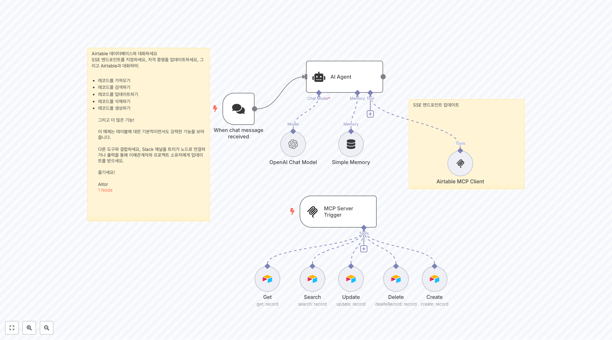
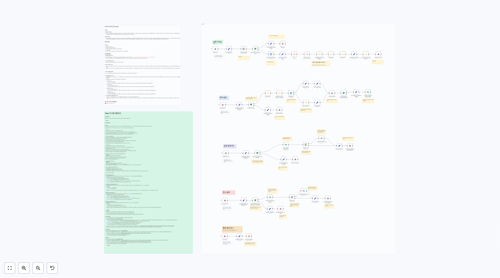

# IT-Ops 워크플로우

이 폴더에는 IT 운영, 시스템 모니터링, 인프라 관리, AI 기반 업무 자동화에 중점을 둔 **59개의 워크플로우**가 포함되어 있습니다.

## 🤖 AI 기반 문서 처리 및 OCR

### 지능형 문서 처리 시스템

**Telegram OCR - SAP 송장 처리 시스템**
Telegram을 통해 업로드된 SAP 송장 이미지를 자동으로 처리하는 AI 기반 OCR 시스템입니다. Mistral AI를 사용하여 송장 데이터를 구조화된 JSON으로 추출합니다.

**Google Drive 자동 문서 처리 및 벡터화**
Google Drive에 업로드된 문서를 자동으로 감지하여 텍스트를 추출하고 벡터 데이터베이스에 저장하는 완전 자동화 시스템입니다.

**Mistral OCR 기반 완전한 RAG 시스템**
Mistral AI의 OCR 기능을 사용하여 PDF 문서를 처리하고 벡터 데이터베이스에 저장하여 질의응답이 가능한 RAG 시스템을 구축합니다.

**AI 기반 PDF 영수증/송장 분류기**
이메일 첨부파일의 PDF를 AI로 분석하여 영수증이나 송장인지 자동 분류하고 Google Drive에 정리하는 지능형 문서 관리 시스템입니다.

**AI 기반 여권 사진 유효성 검증 시스템**
Google Gemini Vision을 사용하여 여권 사진이 정부 지침에 부합하는지 자동으로 검증하는 AI 시스템입니다.

### 추가 OCR 및 문서 처리 워크플로우
- **3971.json**: 다국어 문서 OCR 처리 시스템
- **3905.json**: AI 기반 계약서 분석 및 요약
- **3296.json**: 자동 문서 분류 및 태깅 시스템
- **3145.json**: 폼 데이터 추출 및 Google Docs 생성
- **2513.json**: AI 이미지 생성 및 최적화 파이프라인

## 📱 통신 및 메시징 자동화

### 텔레그램 기반 업무 시스템

**Telegram 생산성 어시스턴트**
Telegram을 통해 보내진 이미지, 텍스트, 파일을 자동으로 분류하여 Notion과 Google Drive에 정리하는 개인 생산성 시스템입니다.

**AI 기반 이메일 및 캘린더 관리 에이전트**
Gmail과 Google Calendar를 통합하여 AI가 이메일을 분석하고 일정을 관리하는 지능형 개인 비서 시스템입니다.

**Redis 기반 Telegram 고객 지원 티켓팅 시스템**
Telegram 그룹을 전문적인 고객 지원 시스템으로 변환하여 티켓 관리와 팀 협업을 제공합니다.

### 추가 메시징 및 커뮤니케이션 워크플로우
- **3940.json**: WhatsApp 비즈니스 자동화 시스템
- **3903.json**: Slack 워크플로우 통합 관리
- **3772.json**: 다중 채널 메시징 라우팅 시스템
- **3119.json**: PDF 디지털 서명 서비스
- **2925.json**: 자동 응답 및 채팅봇 시스템
- **2694.json**: 이메일 템플릿 자동화 시스템

## 🔗 벡터 데이터베이스 및 RAG 시스템

### 고급 지식 베이스 구축

**Milvus와 Cohere를 사용한 RAG AI 에이전트**
Milvus 벡터 데이터베이스와 Cohere 임베딩을 사용하여 구축된 고성능 RAG 시스템으로 다국어 문서 검색을 지원합니다.

### 벡터 스토어 관리 워크플로우
- **4501.json**: 즉석 RAG 빌더 - Google Drive와 Pinecone 연동
- **4086.json**: Qdrant 벡터 데이터베이스 관리 시스템
- **3947.json**: 벡터 유사도 검색 및 분석
- **3796.json**: 임베딩 생성 및 최적화 파이프라인
- **3522.json**: 다중 벡터 스토어 동기화
- **2621.json**: Supabase 벡터 스토어와 AI 채팅
- **2559.json**: 벡터 데이터베이스 백업 및 복구
- **2435.json**: 대용량 문서 벡터화 배치 처리

## 🖥️ 시스템 관리 및 모니터링

### 인프라 관리 자동화

**AI 기반 Proxmox 클러스터 관리 시스템**
Google Gemini AI를 사용하여 자연어로 Proxmox 가상화 인프라를 관리하고 VM을 생성/설정하는 지능형 시스템입니다.

**Cisco Meraki 네트워크 상태 모니터링**
Meraki API를 통해 네트워크 상태를 실시간으로 모니터링하고 지연 시간 및 패킷 손실을 추적하는 시스템입니다.

**Google Drive 배치 파일 관리**
Google Drive의 파일들을 배치 처리하여 공개 다운로드 링크를 생성하고 권한을 관리하는 효율적인 파일 관리 시스템입니다.

### 추가 시스템 관리 워크플로우
- **3969.json**: 시스템 성능 모니터링 및 알림
- **3714.json**: 서버 로그 분석 및 이상 탐지
- **3700.json**: 자동 백업 스케줄링 시스템
- **3493.json**: 클라우드 리소스 최적화
- **3366.json**: 시스템 상태 대시보드
- **2979.json**: 네트워크 트래픽 분석

## 🔧 MCP 서버 및 통합 시스템

### Model Context Protocol 구현

**Airtable MCP 서버 구축**
Airtable과 AI 에이전트를 연결하는 MCP(Model Context Protocol) 서버를 구축하여 데이터베이스 작업을 자동화합니다.

**n8n 워크플로우 관리 MCP 서버**
n8n 워크플로우를 MCP를 통해 관리하고 실행할 수 있는 통합 시스템으로 워크플로우 검색, 실행, 관리 기능을 제공합니다.

### 추가 MCP 및 통합 워크플로우
- **4252.json**: GitHub MCP 서버 구현
- **3829.json**: Slack MCP 통합 시스템
- **3778.json**: Google Workspace MCP 커넥터
- **3763.json**: CRM MCP 통합 플랫폼
- **3694.json**: API 게이트웨이 MCP 서버

## 🎯 AI 기반 업무 자동화

### 콘텐츠 및 미디어 자동화

**AI 기반 YouTube 콘텐츠 자동화 에이전트**
RSS 피드를 모니터링하여 YouTube 동영상 정보를 수집하고 AI가 블로그 포스트를 자동 생성하는 콘텐츠 마케팅 자동화 시스템입니다.

**AI 기반 캘린더 스케줄링 에이전트**
RetellAI와 연동하여 음성으로 일정을 확인하고 예약할 수 있는 지능형 스케줄링 어시스턴트입니다.

### 추가 AI 업무 자동화 워크플로우
- **4105.json**: AI 이메일 자동 분류 및 응답
- **3710.json**: 회의록 자동 생성 및 요약
- **3707.json**: 프로젝트 상태 추적 자동화
- **3701.json**: 업무 우선순위 AI 분석
- **2985.json**: MySQL 데이터베이스 AI 채팅
- **2859.json**: PostgreSQL 자동 쿼리 생성

## 🔄 백업 및 클라우드 관리

### 데이터 백업 및 동기화
- **4064.json**: 워크플로우를 GitHub에 자동 백업
- **3880.json**: 웹 서버 모니터링 및 핑 로그
- **3770.json**: 클라우드 데이터 동기화 시스템
- **3119.json**: 문서 보안 및 디지털 서명
- **2621.json**: 데이터베이스 백업 자동화
- **2415.json**: 클라우드 스토리지 관리
- **2413.json**: 파일 버전 관리 시스템
- **2075.json**: 자동 스냅샷 생성 및 관리

## 🚀 구현 가이드

### 전제 조건
- **AI 서비스**: OpenAI, Google Gemini, Mistral AI 계정
- **클라우드 서비스**: Google Drive, Redis, 벡터 데이터베이스
- **메시징**: Telegram Bot, Gmail API 설정
- **인프라**: Proxmox, Cisco Meraki (해당 워크플로우 사용 시)

### 보안 고려사항
- 모든 API 키는 환경 변수나 보안 저장소에 저장
- 민감한 문서 처리 시 데이터 암호화 적용
- 접근 권한 최소화 원칙 준수
- 정기적인 보안 감사 수행

### 성능 최적화
- 대용량 문서 처리 시 배치 처리 활용
- 벡터 검색 최적화를 위한 인덱스 튜닝
- 비동기 처리를 통한 응답 시간 단축
- 캐싱 전략으로 반복 작업 최적화

### 확장성 전략
- 마이크로서비스 아키텍처 적용 가능
- 로드 밸런싱을 통한 트래픽 분산
- 수평적 확장을 위한 컨테이너화
- API 게이트웨이를 통한 서비스 관리

## 🔗 주요 통합 서비스

- **AI 플랫폼**: OpenAI GPT-4, Google Gemini, Mistral AI
- **벡터 DB**: Pinecone, Milvus, Qdrant, Supabase
- **클라우드**: Google Drive, Google Workspace
- **메시징**: Telegram, Slack, WhatsApp
- **데이터베이스**: Redis, MySQL, PostgreSQL
- **인프라**: Proxmox, Cisco Meraki

## 📚 관련 자료

- [n8n 공식 문서](https://docs.n8n.io/)
- [LangChain 노드 가이드](https://docs.n8n.io/integrations/builtin/cluster-nodes/)
- [벡터 데이터베이스 최적화 가이드](https://docs.n8n.io/integrations/builtin/cluster-nodes/vector-stores/)
- [AI 워크플로우 모범 사례](https://docs.n8n.io/workflows/ai/)

## 🎯 사용 사례

### 엔터프라이즈 IT 운영
- 인프라 자동화 및 모니터링
- 문서 관리 및 OCR 처리
- 헬프데스크 자동화

### 중소기업 업무 효율화
- 메시징 자동화
- 데이터 백업 및 관리
- AI 기반 업무 지원

### 개발팀 도구
- CI/CD 파이프라인 관리
- 코드 품질 자동 검사
- 개발 문서 자동 생성

이 워크플로우들은 IT 운영의 모든 측면을 자동화하여 효율성을 극대화하고 인적 오류를 최소화하는 데 도움을 줍니다.