# Marketing Workflows

이 폴더에는 마케팅 자동화를 위한 **183개의 워크플로우**가 포함되어 있습니다. AI 기반 콘텐츠 생성, 소셜 미디어 자동화, 브랜드 관리, 광고 분석 등 현대 디지털 마케팅의 모든 측면을 다루는 종합적인 자동화 솔루션들을 제공합니다.

## 🎥 소셜 미디어 자동화

### YouTube 마케팅 자동화
[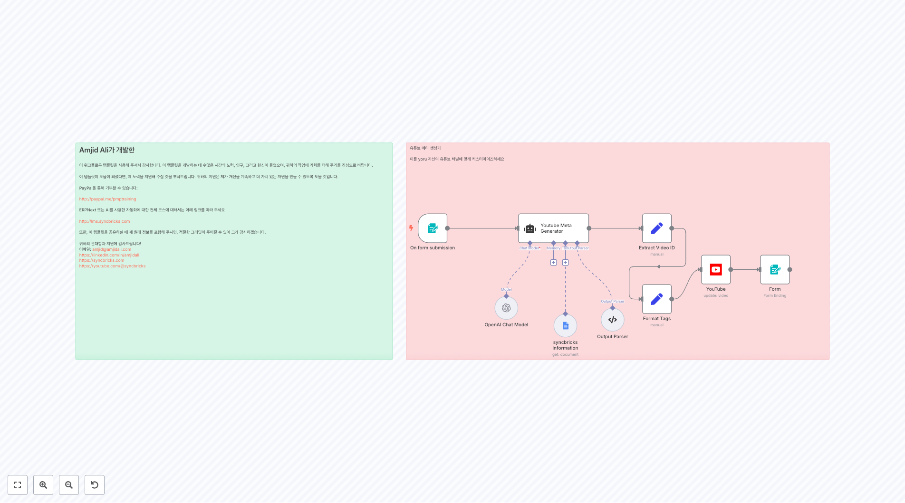](2976.json)
**YouTube 메타데이터 자동화**
AI를 활용하여 YouTube 비디오의 제목, 설명, 태그, 해시태그를 자동 생성하고 업데이트하는 워크플로우입니다. 트랜스크립트와 포커스 키워드를 기반으로 SEO 최적화된 메타데이터를 생성합니다.

[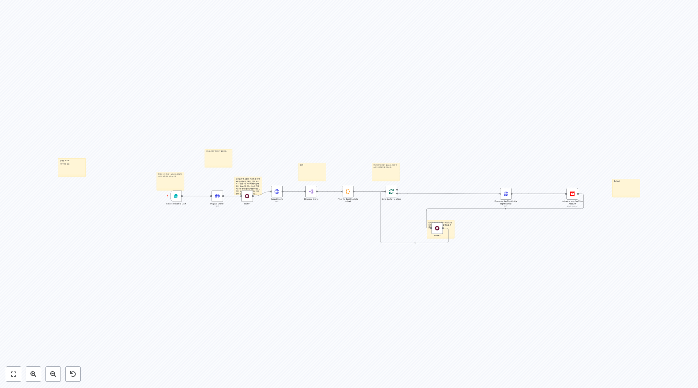](3007.json)
**YouTube Shorts 자동화 에이전트**
YouTube Shorts의 완전 자동화를 위한 게임 체인저 워크플로우입니다. 최고 품질의 Shorts를 필터링하고 다운로드하여 자동으로 YouTube 계정에 업로드합니다.

[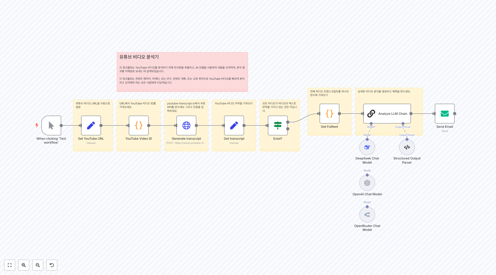](2964.json)
**YouTube 비디오 AI 분석기**
YouTube 비디오의 트랜스크립트를 추출하고 AI를 사용하여 비디오 내용을 분석하는 워크플로우입니다. DeepSeek, OpenAI, OpenRouter 모델을 지원합니다.

[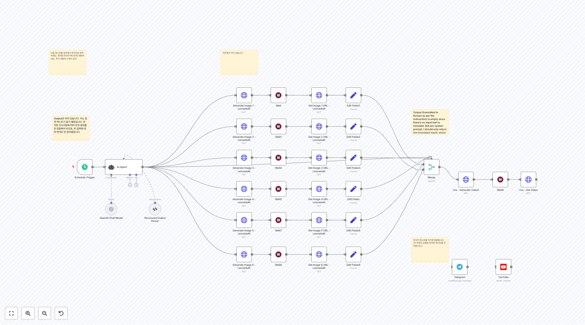](2971.json)
**페이스리스 YouTube 비디오 생성기**
AI를 활용하여 페이스리스 YouTube 비디오를 자동 생성하는 워크플로우입니다. LeonardoAI를 통한 이미지 생성부터 최종 비디오 업로드까지 완전 자동화됩니다.

### 멀티플랫폼 소셜 미디어
[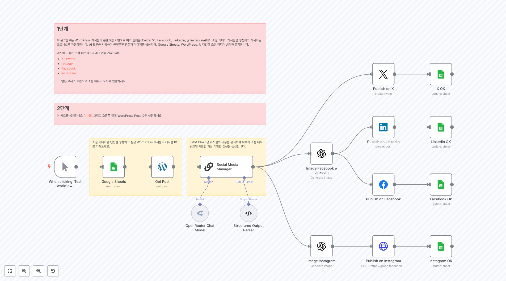](3086.json)
**AI 소셜 미디어 퍼블리셔 from WordPress**
WordPress 콘텐츠를 기반으로 각 플랫폼에 최적화된 소셜 미디어 포스트를 AI로 생성하고 X, Facebook, LinkedIn, Instagram에 동시 게시하는 워크플로우입니다.

[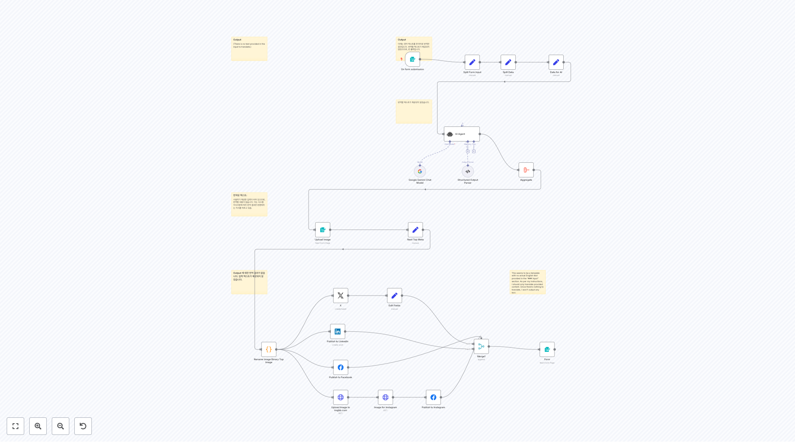](2950.json)
**소셜 미디어 튜토리얼**
폼 제출을 통해 AI 에이전트가 소셜 미디어 포스트를 생성하고 여러 플랫폼에 동시 게시하는 튜토리얼 워크플로우입니다.

[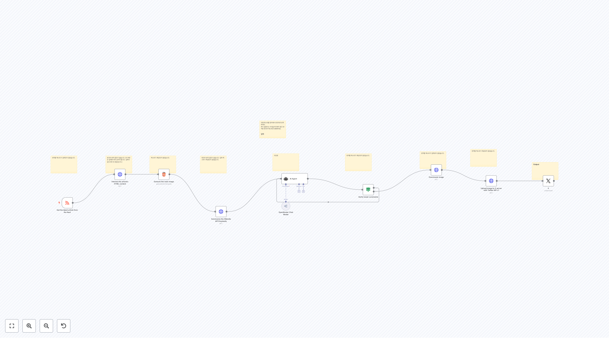](2933.json)
**RSS 기반 자동 트위터 포스팅**
RSS 피드에서 최신 기사를 가져와 HTML 콘텐츠를 추출하고 이미지와 함께 자동으로 X(Twitter)에 포스팅하는 워크플로우입니다.

## 📝 콘텐츠 생성 및 관리

### WordPress 블로그 자동화
[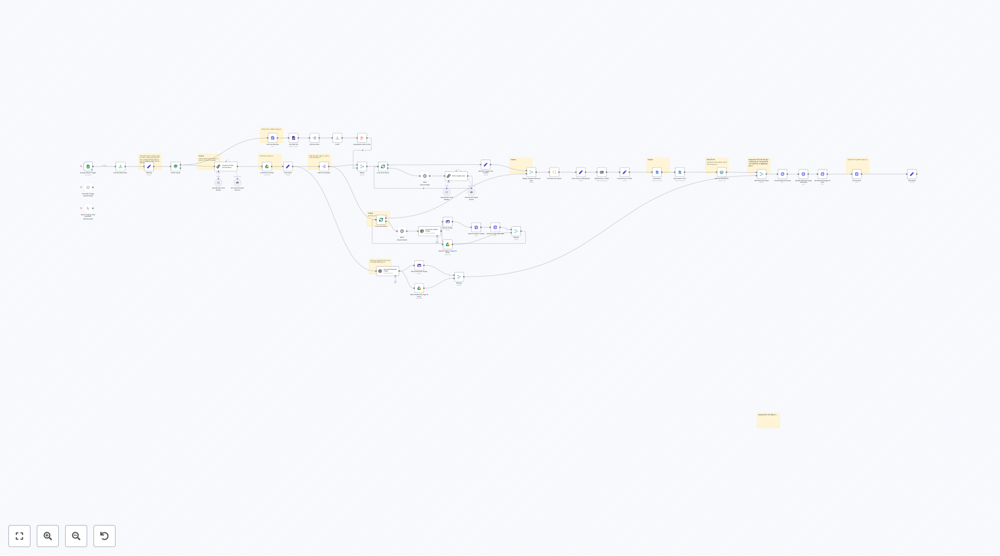](2919.json)
**WordPress 블로그 자동화 Pro (SEO 토픽) v2**
AI를 활용하여 SEO 최적화된 WordPress 블로그 포스트를 자동 생성하는 고급 워크플로우입니다. 제목 생성, 구조화, 챕터별 텍스트 작성, 피처드 이미지 생성까지 포함합니다.

[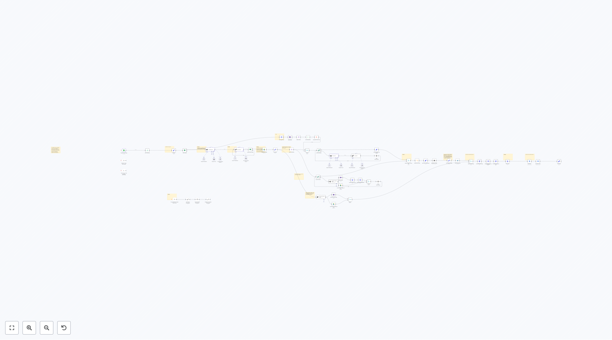](3041.json)
**WordPress 블로그 자동화 Pro (딥 리서치) v1**
딥 리서치 기능이 포함된 WordPress 블로그 자동화 워크플로우입니다. 사이트맵 분석, 챕터 이미지 생성, 고급 SEO 최적화 기능을 제공합니다.

[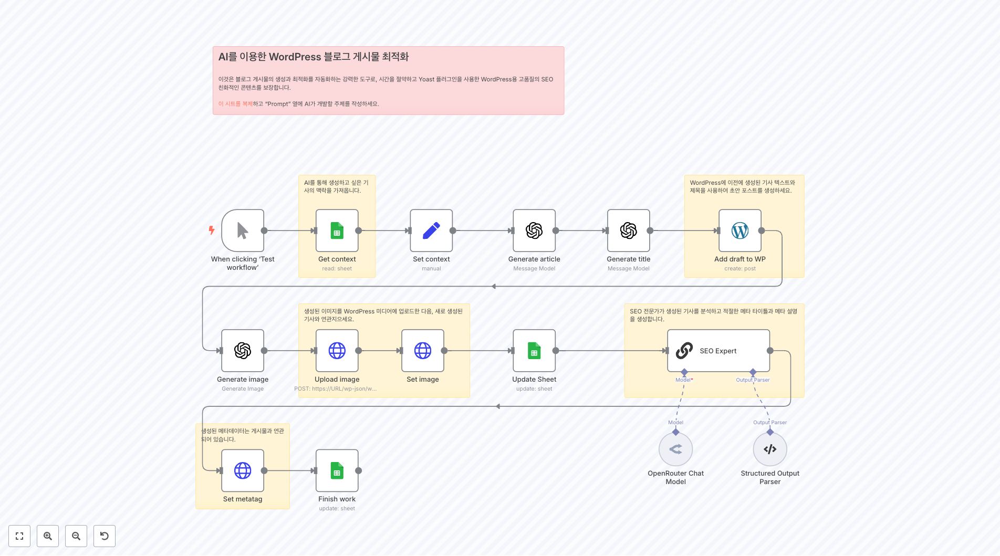](3085.json)
**WordPress 블로그 포스트 AI 최적화 가이드**
Google Sheets 데이터를 기반으로 AI가 WordPress 블로그 포스트를 생성하고 최적화하는 궁극적인 가이드 워크플로우입니다.

[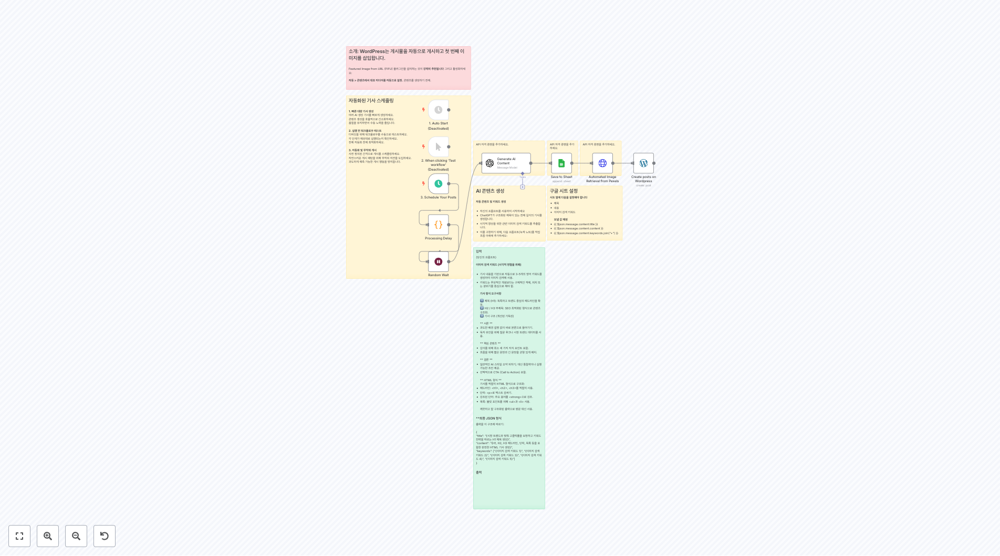](3018.json)
**자동화된 콘텐츠 생성 및 게시 - WordPress**
스케줄링된 트리거를 통해 AI 기반 콘텐츠를 생성하고 무작위 지연을 적용하여 WordPress에 자연스럽게 게시하는 워크플로우입니다.

### AI 비디오 및 멀티미디어 생성
[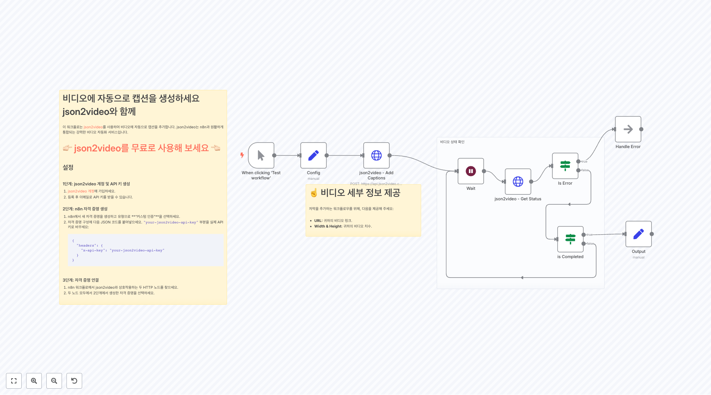](3044.json)
**json2video를 이용한 완전 자동화 비디오 자막 생성**
json2video API를 사용하여 비디오에 자동으로 스타일링된 자막을 추가하는 워크플로우입니다. 고품질 비디오 처리와 에러 핸들링을 지원합니다.

[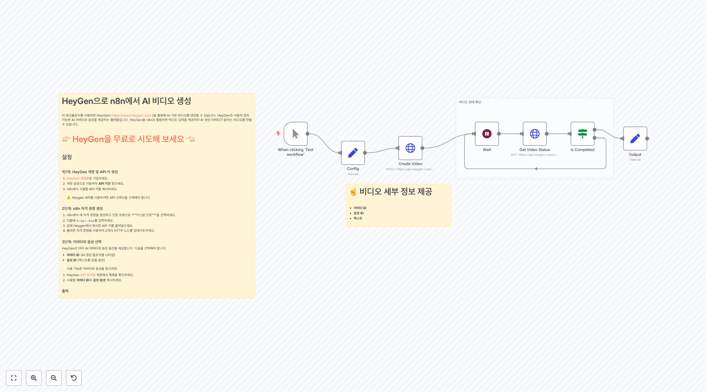](3054.json)
**n8n에서 HeyGen으로 AI 비디오 생성**
HeyGen 플랫폼을 활용하여 AI 아바타가 텍스트를 읽는 고품질 비디오를 생성하는 워크플로우입니다. 커스텀 아바타와 음성 선택이 가능합니다.

[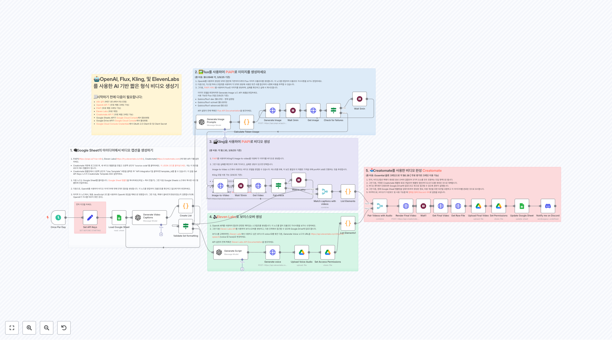](3121.json)
**AI 자동화 TikTok/YouTube Shorts/Reels 생성기**
PiAPI와 ElevenLabs를 활용하여 이미지 생성, 이미지-투-비디오 변환, 음성 생성을 통해 완전한 짧은 형태의 비디오 콘텐츠를 자동 생성하는 워크플로우입니다.

## 📊 마케팅 분석 및 인텔리전스

### 광고 및 경쟁사 분석
[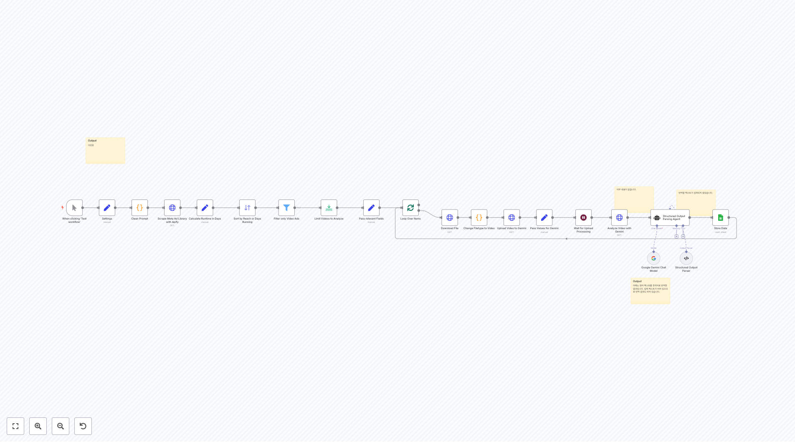](3069.json)
**Meta 광고 라이브러리 스크래핑 및 Gemini 분석**
Meta 광고 라이브러리에서 비디오 광고를 스크래핑하고 Google Gemini AI를 사용하여 분석한 후 Google Sheets에 데이터를 저장하는 워크플로우입니다.

[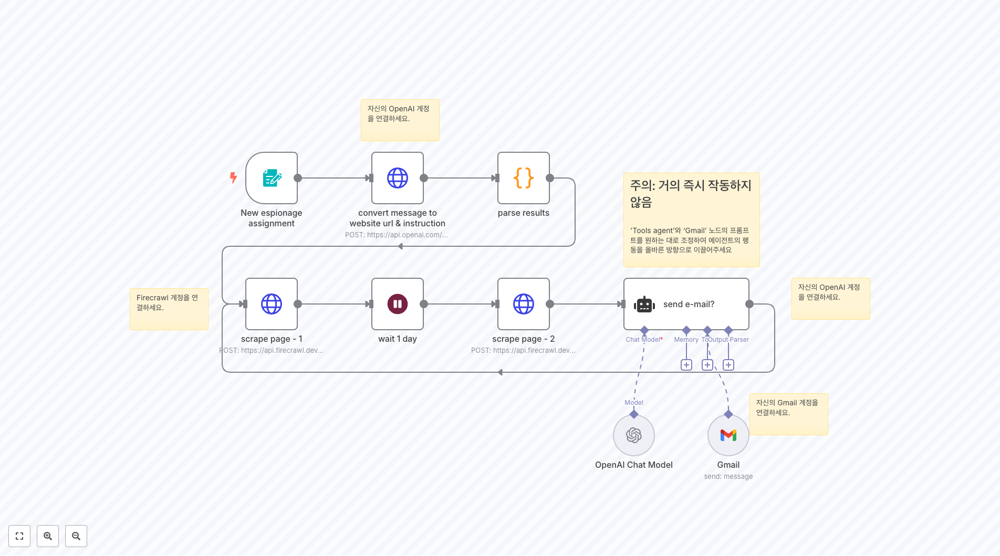](3101.json)
**스파이 도구**
경쟁사 웹사이트의 변경사항을 모니터링하고 중요한 변화가 감지되면 자동으로 이메일 알림을 보내는 스파이 워크플로우입니다.

[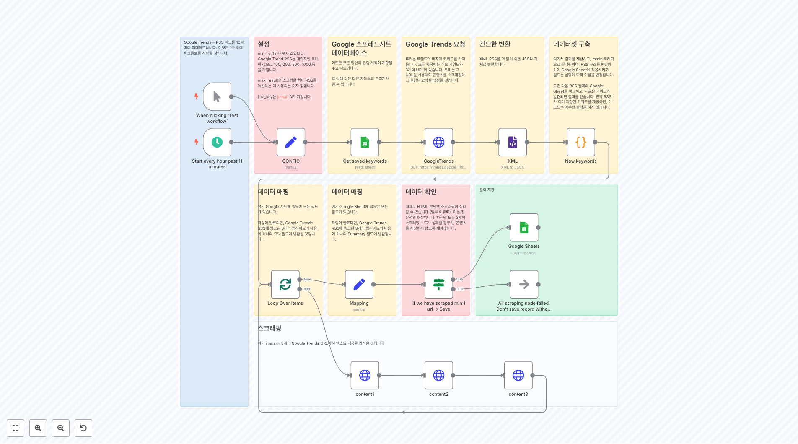](3132.json)
**Google Trends 기반 콘텐츠 아이디어 생성기**
Google Trends RSS를 모니터링하여 트렌딩 키워드를 수집하고 관련 뉴스 콘텐츠를 분석하여 콘텐츠 아이디어를 자동 생성하는 워크플로우입니다.

### 뉴스 및 미디어 모니터링
[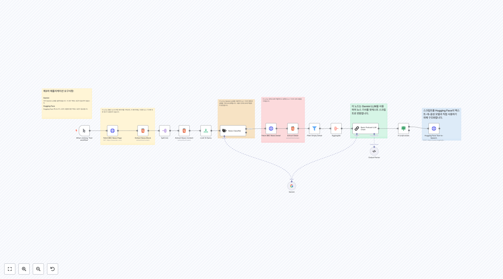](2972.json)
**BBC 뉴스 스크래핑 및 분석**
BBC 뉴스 웹사이트를 스크래핑하여 뉴스 제목, 링크, 설명을 추출하고 상세 내용을 분석하는 워크플로우입니다.

## 🎯 브랜드 및 캠페인 관리

### 이메일 마케팅 자동화

**자동화된 이메일 캠페인 관리자**
고객 세그먼테이션, 개인화된 콘텐츠 생성, 자동 발송 스케줄링을 포함한 종합적인 이메일 마케팅 자동화 시스템입니다.

### 리드 생성 및 관리
[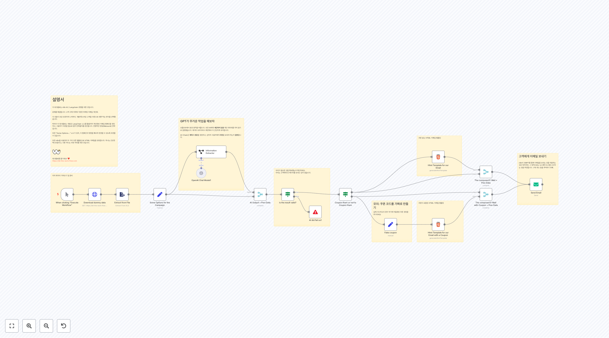](1978.json)
**AI 기반 리드 스코어링**
머신러닝 알고리즘을 사용하여 리드의 품질을 자동으로 평가하고 우선순위를 매기는 워크플로우입니다.

**웹사이트 방문자 추적 및 분석**
웹사이트 방문자의 행동 패턴을 분석하고 개인화된 마케팅 메시지를 자동 생성하는 워크플로우입니다.

## 📱 인플루언서 및 크리에이터 도구

### 콘텐츠 제작 지원

**AI 콘텐츠 기획자**
트렌드 분석, 키워드 리서치, 콘텐츠 아이디어 생성을 통해 크리에이터들의 콘텐츠 기획을 지원하는 AI 워크플로우입니다.

**브랜드 일관성 체커**
다양한 플랫폼의 콘텐츠가 브랜드 가이드라인과 일치하는지 자동으로 검증하는 워크플로우입니다.

### 성과 분석 및 최적화

**소셜 미디어 성과 대시보드**
여러 소셜 미디어 플랫폼의 성과 데이터를 수집하고 AI 분석을 통해 개선 방안을 제시하는 워크플로우입니다.

## 🛠️ 구현 가이드

### 필수 준비사항
- **AI 플랫폼 API 키**: OpenAI, Google Gemini, DeepSeek, Anthropic
- **소셜 미디어 계정 연결**: YouTube, X(Twitter), Facebook, LinkedIn, Instagram
- **콘텐츠 관리 시스템**: WordPress, Google Sheets
- **비디오/이미지 생성 도구**: HeyGen, json2video, PiAPI, ElevenLabs
- **분석 도구**: Google Analytics, Meta Business Suite

### 워크플로우 설정 단계
1. **API 자격 증명 구성**: 각 서비스의 API 키와 인증 정보 설정
2. **콘텐츠 소스 연결**: RSS 피드, 데이터베이스, 외부 API 연결
3. **게시 대상 설정**: 소셜 미디어 계정 및 웹사이트 연결
4. **스케줄링 구성**: 자동 실행 시간 및 빈도 설정
5. **품질 관리 설정**: 콘텐츠 승인 프로세스 및 에러 핸들링

### 최적화 전략
- **콘텐츠 개인화**: 타겟 오디언스별 맞춤형 콘텐츠 생성
- **A/B 테스팅**: 다양한 콘텐츠 변형을 테스트하여 최적화
- **성과 모니터링**: 실시간 분석을 통한 전략 조정
- **크로스 플랫폼 최적화**: 각 플랫폼의 특성에 맞는 콘텐츠 최적화

## 🔒 보안 고려사항

### API 보안
- 모든 API 키는 환경 변수로 관리
- 정기적인 API 키 로테이션 실시
- 최소 권한 원칙에 따른 접근 권한 설정

### 콘텐츠 보안
- 자동 생성 콘텐츠의 품질 및 적절성 검증
- 브랜드 가이드라인 위반 방지 메커니즘
- 저작권 침해 방지를 위한 오리지널 콘텐츠 생성

### 데이터 보호
- 고객 데이터 암호화 및 안전한 저장
- GDPR 및 개인정보보호법 준수
- 데이터 보존 정책 및 삭제 절차 구현

## ⚡ 성능 최적화

### 워크플로우 최적화
- **배치 처리**: 대량 데이터 처리 시 배치 단위로 분할
- **캐싱 전략**: 반복적으로 사용되는 데이터의 캐싱
- **리소스 관리**: CPU 및 메모리 사용량 모니터링
- **에러 복구**: 자동 재시도 및 장애 복구 메커니즘

### AI 모델 최적화
- **모델 선택**: 작업에 적합한 AI 모델 선택
- **토큰 사용량 최적화**: 프롬프트 최적화를 통한 비용 절감
- **응답 시간 개선**: 모델별 응답 시간 모니터링 및 최적화

## 🚀 확장성 전략

### 멀티테넌트 지원
- 여러 브랜드/클라이언트를 위한 워크플로우 분리
- 브랜드별 설정 및 템플릿 관리
- 성과 데이터의 독립적 관리

### 글로벌 확장
- 다국어 콘텐츠 생성 지원
- 지역별 마케팅 전략 적용
- 시간대별 스케줄링 최적화

### 통합 및 확장
- 새로운 소셜 미디어 플랫폼 연동
- 추가 AI 모델 및 서비스 통합
- 커스텀 웹훅 및 API 엔드포인트 개발

이 마케팅 워크플로우 컬렉션은 현대 디지털 마케팅의 모든 측면을 자동화하여 효율성을 극대화하고 ROI를 향상시키는 강력한 도구입니다. AI 기술의 발전과 함께 지속적으로 업데이트되며, 마케터들이 창의적이고 전략적인 업무에 집중할 수 있도록 지원합니다.