# 마케팅 워크플로우

이 폴더에는 marketing 관련 **183개의 워크플로우**가 포함되어 있습니다.

## 📋 워크플로우 목록

[](https://raw.githubusercontent.com/n8nKOR/n8n-shared-workflow/refs/heads/main/workflows/n8nworkflows/marketing/1895.json)
**워크플로우 1895**
이 워크플로우가 하는 일 1) n8n과 관련될 수 있는 Reddit 게시물을 가져옴 - 가장 관련성 있는 게시물을 필터링 (지난 7일 동안 게시되고 5회 이상 업보트되었으며 원본 콘텐츠임) 2) 게시물이 실제로 n8n에 관한지 확인 3) 만약 그렇다면, OpenAI로 분류.

[](https://raw.githubusercontent.com/n8nKOR/n8n-shared-workflow/refs/heads/main/workflows/n8nworkflows/marketing/1978.json)
**워크플로우 1978**
더미 데이터 가져오기 및 준비

[](https://raw.githubusercontent.com/n8nKOR/n8n-shared-workflow/refs/heads/main/workflows/n8nworkflows/marketing/1996.json)
**워크플로우 1996**
고객 피드백을 OpenAI에 감정 분석을 위해 보내기

[](https://raw.githubusercontent.com/n8nKOR/n8n-shared-workflow/refs/heads/main/workflows/n8nworkflows/marketing/2088.json)
**워크플로우 2088**
노드 설명 고객 메시지 데이터 검색 (Google Sheets 노드): **목적 및 사용 사례:** 이 노드의 주요 목적은 고객 메시지에 대한 정보를 포함한 Google Sheets 문서에서 데이터를 검색하는 것입니다. 다음과 같은 다양한 시나리오에서 사용할 수 있습니다: - 아웃리치 캠페인을 위한 고객 연락처 목록을 컴파일하는 경우. - 스프레드시트에 저...

[](https://raw.githubusercontent.com/n8nKOR/n8n-shared-workflow/refs/heads/main/workflows/n8nworkflows/marketing/2107.json)
**워크플로우 2107**
- 다음 API를 이용했습니다: - [Prospeo.io LinkedIn 이메일 찾기 API](https://prospeo.io/api/linkedin-email-finder) - **이점:** - 이 API의 이점은 LinkedIn 사용자들의 이메일 주소를 효율적으로 찾는 방법을 제공하여, Google Sheets 또는 워크플로우에서 사용되는 다른 시스템...

[](https://raw.githubusercontent.com/n8nKOR/n8n-shared-workflow/refs/heads/main/workflows/n8nworkflows/marketing/2112.json)
**워크플로우 2112**
마지막 연락 날짜가 알려지지 않은 모든 연락처 검색 1. n8n 문서를 사용하여 Oauth2 자격 증명 설정 https://docs.n8n.io/integrations/builtin/trigger-nodes/n8n-nodes-base.hubspottrigger/ 범위에 주의하세요. 범위는 n8n 문서에 정의된 대로 정확히 해야 합니다. 출력

[](https://raw.githubusercontent.com/n8nKOR/n8n-shared-workflow/refs/heads/main/workflows/n8nworkflows/marketing/2116.json)
**워크플로우 2116**
👨‍🎤 설정 1. 자신의 **Hunter**, **Clearbit** 및 **Hubspot** 자격 증명을 추가하세요 2. Test Workflow 버튼을 클릭하세요, 이메일을 입력하고 Hubspot을 확인하세요 3. 워크플로를 활성화하고, 폼 트리거 프로덕션 URL을 사용하여 영리하게 리드를 수집하세요

[](https://raw.githubusercontent.com/n8nKOR/n8n-shared-workflow/refs/heads/main/workflows/n8nworkflows/marketing/2122.json)
**워크플로우 2122**
👨‍🎤 설정 1. 자신의 **MadKudu**, **Hunter**, 및 **Gmail** 자격 증명을 추가하세요 2. 자신의 **HubSpot** OAuth2 자격 증명을 [n8n 문서](https://docs.n8n.io/integrations/builtin/trigger-nodes/n8n-nodes-base.hubspottrigger/)를 사용하여 설...

[](https://raw.githubusercontent.com/n8nKOR/n8n-shared-workflow/refs/heads/main/workflows/n8nworkflows/marketing/2123.json)
**워크플로우 2123**
Google Indexing API를 사용한 간단한 인덱싱 워크플로우 이 워크플로는 가장 간단한 인덱싱 워크플로입니다. 단순히 사이트맵을 추출하여 JSON으로 변환한 후 각 URL을 반복 처리합니다. 할당량이 초과되면 오류를 출력합니다. *조아킴*

[](https://raw.githubusercontent.com/n8nKOR/n8n-shared-workflow/refs/heads/main/workflows/n8nworkflows/marketing/2134.json)
**워크플로우 2134**
웹사이트에서 이메일을 API를 사용하여 스크래핑

## 📋 워크플로우 목록 (11-20)

[](https://raw.githubusercontent.com/n8nKOR/n8n-shared-workflow/refs/heads/main/workflows/n8nworkflows/marketing/2137.json)
**워크플로우 2137**
후속 조치가 필요한 경우: - 스레드의 모든 메시지가 자동화된 (아직 아무도 답변하지 않음) - 다음 메시지를 보내기 위한 충분한 시간이 경과함

[](https://raw.githubusercontent.com/n8nKOR/n8n-shared-workflow/refs/heads/main/workflows/n8nworkflows/marketing/2139.json)
**워크플로우 2139**
예정된 게시 6시간마다 트윗을 작성하고, 게시되는 분을 무작위로 설정하여 자연스럽게 보이게 하세요.

[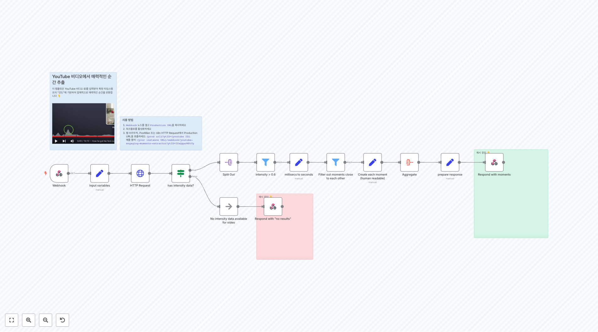](https://raw.githubusercontent.com/n8nKOR/n8n-shared-workflow/refs/heads/main/workflows/n8nworkflows/marketing/2152.json)
**워크플로우 2152**
예시 응답 👇

[](https://raw.githubusercontent.com/n8nKOR/n8n-shared-workflow/refs/heads/main/workflows/n8nworkflows/marketing/2155.json)
**워크플로우 2155**
귀하의 SEO를 위한 키워드 생성

[](https://raw.githubusercontent.com/n8nKOR/n8n-shared-workflow/refs/heads/main/workflows/n8nworkflows/marketing/2180.json)
**워크플로우 2180**
가장 최근의 뉴스만 선택하세요: 오늘 날짜에서 xy일 전으로

[](https://raw.githubusercontent.com/n8nKOR/n8n-shared-workflow/refs/heads/main/workflows/n8nworkflows/marketing/2199.json)
**워크플로우 2199**
설정 1/ 자격 증명 추가 [Google - 시트](https://docs.n8n.io/integrations/builtin/credentials/google/) [X - 트위터](https://docs.n8n.io/integrations/builtin/credentials/twitter/) 2/ 새 Google 스프레드시트를 만들고, Tweets라는 시트...

[](https://raw.githubusercontent.com/n8nKOR/n8n-shared-workflow/refs/heads/main/workflows/n8nworkflows/marketing/2210.json)
**워크플로우 2210**
URL 목록 수집 이 부분은 모든 사이트맵에서 모든 페이지를 추출하여 lastmod(마지막 수정 날짜) 기준으로 정렬합니다 (가장 최근부터 가장 오래된 순으로)

[](https://raw.githubusercontent.com/n8nKOR/n8n-shared-workflow/refs/heads/main/workflows/n8nworkflows/marketing/2211.json)
**워크플로우 2211**
설정 1/ 자격 증명 추가 [유튜브](https://docs.n8n.io/integrations/builtin/credentials/google/) 2/ 구성 노드에서 구분 문자와 모든 비디오에 추가할 텍스트를 정의하세요. 👇 출력

[](https://raw.githubusercontent.com/n8nKOR/n8n-shared-workflow/refs/heads/main/workflows/n8nworkflows/marketing/2219.json)
**워크플로우 2219**
"Output"라는 텍스트가 입력으로 보이지만, 이는 번역 대상이 아닌 것으로 보입니다. 번역할 영어 텍스트가 제공되지 않았으므로, 결과가 없습니다.

[](https://raw.githubusercontent.com/n8nKOR/n8n-shared-workflow/refs/heads/main/workflows/n8nworkflows/marketing/2242.json)
**워크플로우 2242**
🆔 이 노드의 'Channel ID' 필드에 유튜브 채널 ID를 입력하세요. 채널 ID를 [여기](https://youtube.com/account_advanced)에서 찾을 수 있습니다.

## 📋 워크플로우 목록 (21-30)

[](https://raw.githubusercontent.com/n8nKOR/n8n-shared-workflow/refs/heads/main/workflows/n8nworkflows/marketing/2249.json)
**워크플로우 2249**
요약: AI로 디스코드에서 YouTube 비디오 요약 📽️ [비디오 튜토리얼 보기](https://mrc.fm/ai2d) * 첫 번째 노드의 URL에 [YouTube 채널 ID](https://www.youtube.com/account_advanced)를 추가하세요: `https://www.youtube.com/feeds/videos.xml?channel_...

[](https://raw.githubusercontent.com/n8nKOR/n8n-shared-workflow/refs/heads/main/workflows/n8nworkflows/marketing/2271.json)
**워크플로우 2271**
이메일을 받을 때

[](https://raw.githubusercontent.com/n8nKOR/n8n-shared-workflow/refs/heads/main/workflows/n8nworkflows/marketing/2272.json)
**워크플로우 2272**
DROPCONTACT 250 배치 비동기적으로 1500/시간 요청 더블 클릭하여 나를 수정하세요. 가이드

[](https://raw.githubusercontent.com/n8nKOR/n8n-shared-workflow/refs/heads/main/workflows/n8nworkflows/marketing/2273.json)
**워크플로우 2273**
매일 같은 시간에 흐름을 시작하세요

[](https://raw.githubusercontent.com/n8nKOR/n8n-shared-workflow/refs/heads/main/workflows/n8nworkflows/marketing/2275.json)
**워크플로우 2275**
Microsoft Azure 자격 증명을 Microsoft Graph 권한과 함께 설정해야 합니다.

[](https://raw.githubusercontent.com/n8nKOR/n8n-shared-workflow/refs/heads/main/workflows/n8nworkflows/marketing/2281.json)
**워크플로우 2281**
WordPress에 콘텐츠 게시 자동화 및 대표 이미지 설정 이 워크플로는 n8n을 통해 Airtable에서 WordPress 사이트에 콘텐츠를 공유하는 프로세스를 간소화하는 것을 목표로 합니다. 사용법 1. AirTable에서 콘텐츠를 가져옵니다. 이 콘텐츠가 마크다운 형식이기 때문에 WordPress에서 게시하고 관리하기 쉽게 HTML 형식으로 변환해야...

[](https://raw.githubusercontent.com/n8nKOR/n8n-shared-workflow/refs/heads/main/workflows/n8nworkflows/marketing/2288.json)
**워크플로우 2288**
오늘의 게시물을 내 Notion 데이터베이스에서 가져오기 Notion의 _"database"_는 Notion 페이지의 테이블일 뿐입니다. 이 테이블에는 다양한 행이 있으며, 최소 세 개의 열이 필요합니다: - 이름 - 상태 - 날짜 Date 열이 가장 중요하며, 이는 텍스트가 포함된 Notion 테이블의 해당 행이 게시되어야 할 시기를 결정합니다. 참고: ...

[](https://raw.githubusercontent.com/n8nKOR/n8n-shared-workflow/refs/heads/main/workflows/n8nworkflows/marketing/2322.json)
**워크플로우 2322**
1. n8n Forms로 시작하기 [폼 사용에 대해 자세히 읽기](https://docs.n8n.io/integrations/builtin/core-nodes/n8n-nodes-base.formtrigger/) 이 데모에서 우리는 단순 데이터 캡처를 위해 폼 트리거를 사용할 것입니다. 하지만 더 나은 맞춤화 및/또는 다른 워크플로우로의 통합을 위해 웹훅을 ...

[](https://raw.githubusercontent.com/n8nKOR/n8n-shared-workflow/refs/heads/main/workflows/n8nworkflows/marketing/2328.json)
**워크플로우 2328**
4. 이 도구는 캘린더 이벤트를 생성합니다 이 도구는 이벤트 세부 정보와 참석자 목록이 주어지면, 새로운 Google 캘린더 이벤트를 생성하고 참석자를 추가할 것입니다.

[](https://raw.githubusercontent.com/n8nKOR/n8n-shared-workflow/refs/heads/main/workflows/n8nworkflows/marketing/2336.json)
**워크플로우 2336**
이메일을 요약하여 Odoo의 판매 기회에 노트로 저장 설정 단계: * Google Cloud 자격 증명을 Gmail 액세스로 구성 * OpenAI 자격 증명을 구성 * Odoo 자격 증명을 구성

## 📋 워크플로우 목록 (31-40)

[](https://raw.githubusercontent.com/n8nKOR/n8n-shared-workflow/refs/heads/main/workflows/n8nworkflows/marketing/2417.json)
**워크플로우 2417**
스타일 프롬프트 설정 스위치 이후의 각 Edit fields 노드가 `stylePrompt`을 설정하며, Hugging Face 노드에서 사용됩니다.

[](https://raw.githubusercontent.com/n8nKOR/n8n-shared-workflow/refs/heads/main/workflows/n8nworkflows/marketing/2418.json)
**워크플로우 2418**
시도해 보세요! 이 워크플로우는 이미지를 가져와 AI를 사용하여 캡션을 생성합니다. OpenAI 노드는 이미 한동안 이 작업을 할 수 있었지만, 이 워크플로우는 Google의 Gemini와 같은 다른 다중 모달 비전 모델을 사용하여 동일한 것을 달성하는 방법을 보여줍니다. 또한, 생성된 캡션을 이미지에 오버레이하기 위해 Edit Image 노드를 사용할 것...

[](https://raw.githubusercontent.com/n8nKOR/n8n-shared-workflow/refs/heads/main/workflows/n8nworkflows/marketing/2419.json)
**워크플로우 2419**
부분 A. 기본 이미지 생성 우리가 시각적 회귀 테스트를 실행하기 전에, 비교 대상으로 기본 스크린샷 시리즈를 생성해야 합니다. 이 워크플로의 이 부분은 이를 달성하기 위해 외부 웹사이트 스크린샷 서비스인 [Apify.com](https://www.apify.com?fpr=414q6)을 사용합니다. 이 워크플로의 이 부분은 우리의 기본 스크린샷을 업데이트하...

[](https://raw.githubusercontent.com/n8nKOR/n8n-shared-workflow/refs/heads/main/workflows/n8nworkflows/marketing/2433.json)
**워크플로우 2433**
일일 팟캐스트 요약 이 워크플로는 특정 장르의 당일 최고 팟캐스트 내용을 요약한 후, 요약과 함께 팟캐스트를 이메일로 보내드립니다. 설정: 1. Taddy에서 무료 API 키를 생성하세요: https://taddy.org/signup/developers 2. 사용자 번호와 API 키를 `TaddyTopDaily` 노드의 헤더 매개변수 X-USER-ID와 X...

[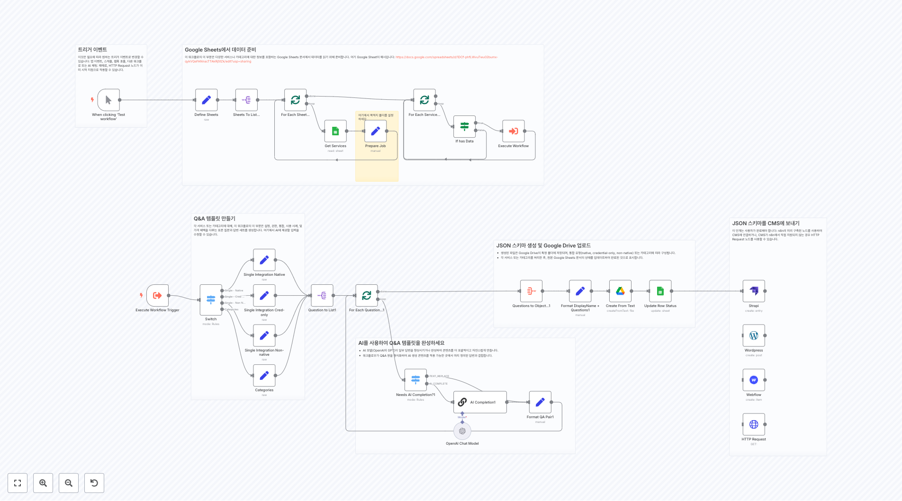](https://raw.githubusercontent.com/n8nKOR/n8n-shared-workflow/refs/heads/main/workflows/n8nworkflows/marketing/2434.json)
**워크플로우 2434**
여기에서 목적지 폴더를 설정하세요

[](https://raw.githubusercontent.com/n8nKOR/n8n-shared-workflow/refs/heads/main/workflows/n8nworkflows/marketing/2473.json)
**워크플로우 2473**
AI를 사용하여 SEO 시드 키워드 생성 이 흐름은 이상적인 고객 프로필을 기반으로 SEO 노력을 집중할 시드 키워드를 생성하기 위해 AI 노드를 사용합니다. **출력:** - 20개의 시드 키워드 목록 **전제 조건 / 종속성:** - 당신의 이상적인 고객 프로필(ICP)을 알고 있습니다. - AI API 계정(OpenAI 또는 Anthropic 권장)

[](https://raw.githubusercontent.com/n8nKOR/n8n-shared-workflow/refs/heads/main/workflows/n8nworkflows/marketing/2475.json)
**워크플로우 2475**
Airtable에서 데이터를 가져오고, 이미 완료되었는지 확인하세요.

[](https://raw.githubusercontent.com/n8nKOR/n8n-shared-workflow/refs/heads/main/workflows/n8nworkflows/marketing/2491.json)
**워크플로우 2491**
1. Google 검색을 통해 조언 기사 가져오기** 사전 정의된 쿼리를 기반으로 LinkedIn 조언 기사를 위한 Google 검색을 수행하기 위해 HTTP 요청을 사용합니다. 2. LinkedIn 조언 기사의 기사 링크 추출 이 코드 노드는 정규 표현식을 사용하여 Google 검색 결과에서 LinkedIn 기사 URL을 추출합니다. LinkedIn 조언...

[](https://raw.githubusercontent.com/n8nKOR/n8n-shared-workflow/refs/heads/main/workflows/n8nworkflows/marketing/2494.json)
**워크플로우 2494**
SEO 키워드 검색 볼륨 데이터 Google API를 사용하여 생성하기 사용 사례 SEO 키워드 연구를 위한 정확한 검색 볼륨 데이터 생성: - 웹사이트 SEO를 위해 타겟팅할 잠재 키워드 목록이 있지만 실제 검색 볼륨을 모르는 경우 - 키워드 인기도의 계절적 추세를 식별하기 위해 과거 데이터를 필요로 하는 경우 - 콘텐츠 전략을 우선순위화하기 위해 키워드...

[](https://raw.githubusercontent.com/n8nKOR/n8n-shared-workflow/refs/heads/main/workflows/n8nworkflows/marketing/2517.json)
**워크플로우 2517**
Google 분석을 A.I.에 보내고 결과를 baserow에 저장하세요 이 워크플로는 국가 조회수, 페이지 참여도 및 Google 검색 콘솔 결과를 확인합니다. 이번 주 데이터를 가져와서 지난 주 데이터와 비교합니다. [이 워크플로에 대해 더 읽을 수 있습니다](https://rumjahn.com/how-i-used-a-i-to-be-an-seo-exper...

## 📋 워크플로우 목록 (41-50)

[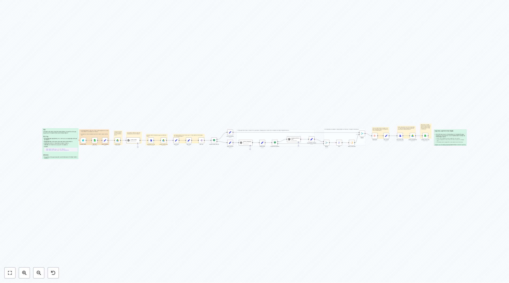](https://raw.githubusercontent.com/n8nKOR/n8n-shared-workflow/refs/heads/main/workflows/n8nworkflows/marketing/2525.json)
**워크플로우 2525**
개요 이 워크플로는 AI를 사용하여 고품질 콘텐츠 생성을 자동화하고, Google Drive 및 Google Sheets와 같은 도구와 통합하여 콘텐츠 관리 및 조직화를 수행합니다. 주요 기능: - **폼 기반 콘텐츠 입력**: 폼을 통해 제목, 단어 수, 키워드 및 추가 지시사항을 포함한 사용자 입력을 수집합니다. - **AI 생성 콘텐츠 개요**: 사용...

[](https://raw.githubusercontent.com/n8nKOR/n8n-shared-workflow/refs/heads/main/workflows/n8nworkflows/marketing/2529.json)
**워크플로우 2529**
이 워크플로우에 대해 작동 방식 이 워크플로우는 Google Drive에 업로드된 새로운 이미지를 감지합니다. 새로운 이미지가 있으면 이미지를 다운로드합니다. 그런 다음 일부 로직을 실행하여 배경을 제거하고 출력 이미지에 패딩을 추가합니다. **기본적으로 이미지는 .png로 저장됩니다** 완료되면 Google Drive에 다시 업로드합니다. 기능* Goog...

[](https://raw.githubusercontent.com/n8nKOR/n8n-shared-workflow/refs/heads/main/workflows/n8nworkflows/marketing/2533.json)
**워크플로우 2533**
여기에서 매개변수 설정 페이스북 페이지 ID와 가져올 최신 게시물 수를 여기에서 설정하세요

[](https://raw.githubusercontent.com/n8nKOR/n8n-shared-workflow/refs/heads/main/workflows/n8nworkflows/marketing/2537.json)
**워크플로우 2537**
원하는 트리거를 선택하세요. 예를 들어, 이 워크플로우를 다른 하나에서 트리거하세요.

[](https://raw.githubusercontent.com/n8nKOR/n8n-shared-workflow/refs/heads/main/workflows/n8nworkflows/marketing/2541.json)
**워크플로우 2541**
웹훅 - ChatInput 이 웹훅은 `ChatInput` 데이터를 받기 위한 엔드포인트 역할을 합니다. 다음을 포함하세요: - `chatInput` – 보내고 싶은 내용 (😉) - `sessionId` – 세션의 고유 식별자 예를 들어 **Open WebUI**와 같은 인터페이스를 사용 중이라면, `sessionId`가 자동으로 생성됩니다.

[](https://raw.githubusercontent.com/n8nKOR/n8n-shared-workflow/refs/heads/main/workflows/n8nworkflows/marketing/2549.json)
**워크플로우 2549**
Google Analytics 데이터를 집계하여 결과를 이메일로 보내기 이 워크플로는 국가 조회, 페이지 참여도 및 Google Search Console 결과를 확인합니다. 이번 주 데이터를 가져와서 지난 주 데이터와 비교합니다. [Keith Rumjahn에게 원본 워크플로에 대한 크레딧, 내가 수정했습니다.](https://rumjahn.com/how-...

[](https://raw.githubusercontent.com/n8nKOR/n8n-shared-workflow/refs/heads/main/workflows/n8nworkflows/marketing/2564.json)
**워크플로우 2564**
최신 YouTube 비디오를 가져오고 중복 제거 이 노드의 "Channel ID" 필드에 YouTube 채널 ID를 입력하세요. 귀하의 [Channel ID를 여기에서](https://youtube.com/account_advanced) 찾을 수 있습니다.

[](https://raw.githubusercontent.com/n8nKOR/n8n-shared-workflow/refs/heads/main/workflows/n8nworkflows/marketing/2567.json)
**워크플로우 2567**
🛠 설정 1. "Run workflow" 수동 트리거 노드에서 쿼리 목록을 설정하세요. 쿼리를 ChatGPT로 생성하는 방법에 대한 [비디오](https://youtu.be/HaiO-UeiKBA)를 보세요. 3. **Google Sheets 노드**에서 데이터를 채울 시트를 선택하세요. 4. 워크플로를 실행하고 Google Sheets 문서에 리드를 가져오...

[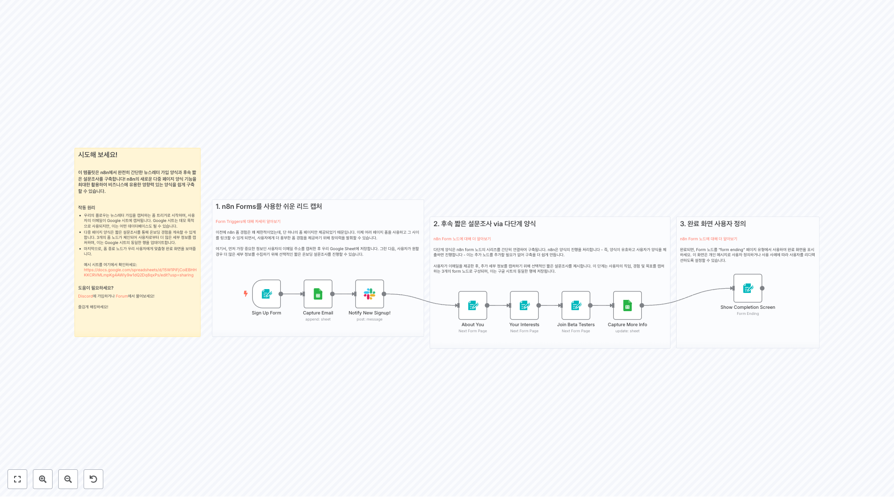](https://raw.githubusercontent.com/n8nKOR/n8n-shared-workflow/refs/heads/main/workflows/n8nworkflows/marketing/2581.json)
**워크플로우 2581**
1. n8n Forms를 사용한 쉬운 리드 캡처 [Form Triggers에 대해 자세히 알아보기](https://docs.n8n.io/integrations/builtin/core-nodes/n8n-nodes-base.formtrigger) 이전에 n8n 폼 경험은 꽤 제한적이었는데, 단 하나의 폼 페이지만 제공되었기 때문입니다. 이제 여러 페이지 폼을 ...

[](https://raw.githubusercontent.com/n8nKOR/n8n-shared-workflow/refs/heads/main/workflows/n8nworkflows/marketing/2605.json)
**워크플로우 2605**
AlexK1919 

[](https://raw.githubusercontent.com/n8nKOR/n8n-shared-workflow/refs/heads/main/workflows/n8nworkflows/marketing/2606.json)
**워크플로우 2606**
메인 워크플로

[](https://raw.githubusercontent.com/n8nKOR/n8n-shared-workflow/refs/heads/main/workflows/n8nworkflows/marketing/2613.json)
**워크플로우 2613**
Output 여기에 번역된 텍스트가 있어야 합니다. 하지만 입력 텍스트가 제공되지 않았으므로, 빈 출력입니다.

[](https://raw.githubusercontent.com/n8nKOR/n8n-shared-workflow/refs/heads/main/workflows/n8nworkflows/marketing/2629.json)
**워크플로우 2629**
자신만의 Amazon 키워드 도구를 n8n으로 만드는 방법 (무료이고 코딩 없이) 이 워크플로는 Amazon FBA 비즈니스에 대한 Amazon 키워드를 제공합니다. [💡 이 워크플로에 대해 더 읽을 수 있습니다](https://rumjahn.com/how-to-build-your-own-amazon-keywords-tool-with-n8n-for-free...

[](https://raw.githubusercontent.com/n8nKOR/n8n-shared-workflow/refs/heads/main/workflows/n8nworkflows/marketing/2636.json)
**워크플로우 2636**
... 또는 설정 비디오 보기 [13분]

[](https://raw.githubusercontent.com/n8nKOR/n8n-shared-workflow/refs/heads/main/workflows/n8nworkflows/marketing/2643.json)
**워크플로우 2643**
1단계. 무료 Brave 웹 검색 쿼리 API 키 설정 Brave에서 무료 웹 검색 API 계층을 얻기 위해 다음 단계를 따르세요: 1. api.search.brave.com을 방문하세요 2. 계정을 생성하세요 3. 무료 플랜에 가입하세요 (무료) 4. API 키 섹션으로 이동하세요 5. API 키를 생성하세요. 구독 유형으로 "Free"를 선택하세요. 6...

[](https://raw.githubusercontent.com/n8nKOR/n8n-shared-workflow/refs/heads/main/workflows/n8nworkflows/marketing/2648.json)
**워크플로우 2648**
1. 기존 콘텐츠 가져오기 [HTML 노드에 대해 자세히 읽기](https://docs.n8n.io/integrations/builtin/core-nodes/n8n-nodes-base.html/) 먼저, 복제하고 싶은 브랜드 목소리를 위한 기존 콘텐츠를 수집해야 합니다. 이 콘텐츠는 블로그, 소셜 미디어 게시물 또는 내부 문서일 수 있습니다 - 아이디어는 ...

[](https://raw.githubusercontent.com/n8nKOR/n8n-shared-workflow/refs/heads/main/workflows/n8nworkflows/marketing/2651.json)
**워크플로우 2651**
... 또는 설정 비디오 보기 [10분]

[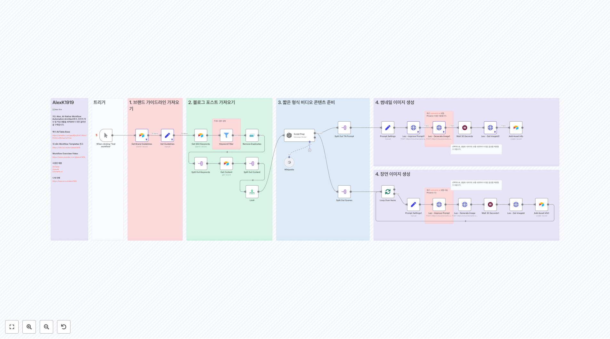](https://raw.githubusercontent.com/n8nKOR/n8n-shared-workflow/refs/heads/main/workflows/n8nworkflows/marketing/2662.json)
**워크플로우 2662**
AlexK1919 
**워크플로우 2673**
내 Google Analytics 주간 보고 워크플로우에 오신 것을 환영합니다! 이 워크플로우는 다음과 같은 순서를 따릅니다: 1. 시간 트리거(예: 매주 월요일 오전 7시) 2. 지난 7일 동안의 Google Analytics 데이터 검색 3. 데이터 할당 및 요약 4. 전년도 지난 7일 동안의 Google Analytics 데이터 검색 5. 데이터 할당...

[](https://raw.githubusercontent.com/n8nKOR/n8n-shared-workflow/refs/heads/main/workflows/n8nworkflows/marketing/2681.json)
**워크플로우 2681**
Hacker News에서 트렌딩 GitHub 토론의 큐레이션과 공유를 Twitter와 LinkedIn으로 자동화하세요. 이 워크플로우는 AI를 활용하여 매력적인 게시물을 생성하며, 소셜 미디어 콘텐츠 제작과 배포를 간소화합니다.

## 📋 워크플로우 목록 (61-70)

[](https://raw.githubusercontent.com/n8nKOR/n8n-shared-workflow/refs/heads/main/workflows/n8nworkflows/marketing/2695.json)
**워크플로우 2695**
SEO 월간 검색 볼륨으로 새로운 키워드 생성 이 워크플로는 아래 워크플로의 개선 버전입니다. SEO 캠페인이나 Google Ads 캠페인에 사용할 새로운 키워드를 생성하는 데 사용할 수 있습니다. [Google API를 사용한 SEO 키워드 검색 볼륨 데이터 생성](https://n8n.io/workflows/2494-generate-seo-keyword...

[](https://raw.githubusercontent.com/n8nKOR/n8n-shared-workflow/refs/heads/main/workflows/n8nworkflows/marketing/2706.json)
**워크플로우 2706**
AI를 사용하여 2분 만에 82개의 블로그 게시물을 자동 분류하는 방법 (코딩 불필요) 💡 [사례 연구를 여기에 읽어보세요](https://rumjahn.com/how-to-use-a-i-to-categorize-wordpress-posts-and-streamline-your-content-organization-process/). 📺 [YouTube 튜토...

[](https://raw.githubusercontent.com/n8nKOR/n8n-shared-workflow/refs/heads/main/workflows/n8nworkflows/marketing/2714.json)
**워크플로우 2714**
전문 번역가로서, 영어 텍스트를 한국어로 번역합니다. 입력된 텍스트가 없으므로, 번역 결과가 없습니다. 이는 시스템 지시를 따르기 위한 것입니다.

[](https://raw.githubusercontent.com/n8nKOR/n8n-shared-workflow/refs/heads/main/workflows/n8nworkflows/marketing/2718.json)
**워크플로우 2718**
Easy Instagram(via ManyChat) 봇 --- 설명: 이 템플릿은 전체 솔루션의 주요 부분입니다. ManyChat(Instagram에서 메시지를 가져오고 보내는 추가 No-Code 도구)를 통해 Instagram에서 새 메시지를 가져옵니다. ChatGPT를 사용하여 메시지를 생성하고 ManyChat로 다시 보내서 Instagram으로 전송합...

[](https://raw.githubusercontent.com/n8nKOR/n8n-shared-workflow/refs/heads/main/workflows/n8nworkflows/marketing/2736.json)
**워크플로우 2736**
YouTube 비디오 요약 이 프로젝트는 YouTube 비디오의 요약을 자동화하여, 긴 콘텐츠를 간결하고 실행 가능한 인사이트로 변환합니다. AI와 워크플로 자동화를 활용하여 비디오 자막을 추출하고, 주요 포인트를 분석하며, 요약을 생성하여 콘텐츠 제작자, 연구자, 및 전문가들의 시간을 절약합니다. 정보 유지, 연구 수행, 또는 비디오 콘텐츠의 효율적인 재...

[](https://raw.githubusercontent.com/n8nKOR/n8n-shared-workflow/refs/heads/main/workflows/n8nworkflows/marketing/2748.json)
**워크플로우 2748**
RSS 노드 이 노드들에서 조회할 RSS 피드의 URL을 수정해야 합니다.

[](https://raw.githubusercontent.com/n8nKOR/n8n-shared-workflow/refs/heads/main/workflows/n8nworkflows/marketing/2772.json)
**워크플로우 2772**
동기화 유지 매핑을 업데이트하면, 다른 노드에서도 변경하세요!

[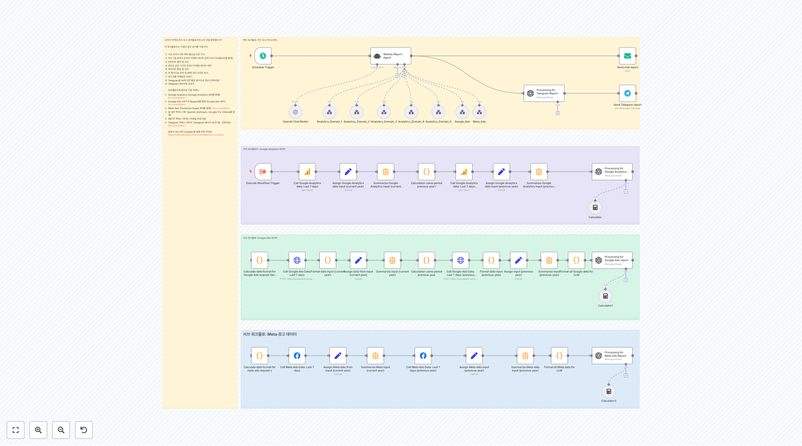](https://raw.githubusercontent.com/n8nKOR/n8n-shared-workflow/refs/heads/main/workflows/n8nworkflows/marketing/2783.json)
**워크플로우 2783**
하위 워크플로우: Google Analytics 데이터

[](https://raw.githubusercontent.com/n8nKOR/n8n-shared-workflow/refs/heads/main/workflows/n8nworkflows/marketing/2785.json)
**워크플로우 2785**
RSS 소스 여기에서 최대 아홉 개의 RSS 소스를 추가할 수 있습니다. 이를 위해 원하는 RSS 피드 수에 맞게 merge 노드를 수정하세요, RSS 노드를 복제하고 trigger와 merge 노드에 연결하세요.

[](https://raw.githubusercontent.com/n8nKOR/n8n-shared-workflow/refs/heads/main/workflows/n8nworkflows/marketing/2786.json)
**워크플로우 2786**
이것들이 이 워크플로를 참조하도록 확인하세요, 플레이스홀더를 대체하세요.

## 📋 워크플로우 목록 (71-80)

[](https://raw.githubusercontent.com/n8nKOR/n8n-shared-workflow/refs/heads/main/workflows/n8nworkflows/marketing/2792.json)
**워크플로우 2792**
Trustpilot에 등록된 회사의 이름으로 변경하고, 스크랩할 최대 페이지 수

[](https://raw.githubusercontent.com/n8nKOR/n8n-shared-workflow/refs/heads/main/workflows/n8nworkflows/marketing/2799.json)
**워크플로우 2799**
이 **LLM 호출**은 웹사이트에 게시된 기사가 모니터링하고 싶은 **주제와 관심사**에 **관련이 있는지** **분류**하는 데 사용됩니다. 이 호출은 **RSS Read** 노드에서 가져온 **제목**과 **콘텐츠 스니펫**을 분석합니다. 이 템플릿에서 모니터링되는 기사는 **데이터와 AI**와 관련이 있습니다. 분류는 **두 카테고리**로 이루어지며...

[](https://raw.githubusercontent.com/n8nKOR/n8n-shared-workflow/refs/heads/main/workflows/n8nworkflows/marketing/2803.json)
**워크플로우 2803**
필요한 모든 자격 증명 Instagram 비즈니스 계정 ID Telegram 채팅 ID Rapid API 키 Replicate 토큰

[](https://raw.githubusercontent.com/n8nKOR/n8n-shared-workflow/refs/heads/main/workflows/n8nworkflows/marketing/2808.json)
**워크플로우 2808**
Google 시트를 생성하세요. 'linkedin_url'이라는 이름의 단 하나의 열을 만들고, 풍부화하고 싶은 프로필로 채우세요.

[](https://raw.githubusercontent.com/n8nKOR/n8n-shared-workflow/refs/heads/main/workflows/n8nworkflows/marketing/2813.json)
**워크플로우 2813**
목표 이 워크플로는 DeepSeek R1을 통해 기사의 구조에 대한 입력 아이디어를 제공하여 WordPress용 SEO 친화적인 콘텐츠를 자동으로 생성하도록 설계되었습니다. 커버 이미지도 OpenAI DALL-E 3을 사용하여 생성되어 업로드됩니다. 이 플로는 "On a schedule" 노드를 통해 자동으로 실행되도록 설계되어 완전한 편집 계획을 갖추게 ...

[](https://raw.githubusercontent.com/n8nKOR/n8n-shared-workflow/refs/heads/main/workflows/n8nworkflows/marketing/2816.json)
**워크플로우 2816**
다른 워크플로우에서의 데모 사용 (RSS 피드를 통해 발견된 기사를 태깅하는)

[](https://raw.githubusercontent.com/n8nKOR/n8n-shared-workflow/refs/heads/main/workflows/n8nworkflows/marketing/2817.json)
**워크플로우 2817**
내 AI 소셜 미디어 캡션 생성 워크플로우에 오신 것을 환영합니다! 이 워크플로우는 Airtable의 편집 계획에서 소셜 미디어 게시물 캡션을 자동으로 생성합니다. 또한 Airtable에 저장된 대상 그룹, 톤, 기타 배경 정보를 사용합니다. 이 워크플로우의 순서는 다음과 같습니다: 1. Airtable 트리거(매 분 새 레코드를 스캔) 2. 1분 대기(A...

[](https://raw.githubusercontent.com/n8nKOR/n8n-shared-workflow/refs/heads/main/workflows/n8nworkflows/marketing/2823.json)
**워크플로우 2823**
여기에서 개인화하세요 설정: - 당신의 이름 - 당신의 회사 이름 - 당신의 회사 활동, 리드와 매치하기 위해 사용 - 당신의 이메일, 보낸 사람으로 사용 출력

[](https://raw.githubusercontent.com/n8nKOR/n8n-shared-workflow/refs/heads/main/workflows/n8nworkflows/marketing/2862.json)
**워크플로우 2862**
1단계 Qdrant 컬렉션 생성 변경: - QDRANTURL - COLLECTION

[](https://raw.githubusercontent.com/n8nKOR/n8n-shared-workflow/refs/heads/main/workflows/n8nworkflows/marketing/2865.json)
**워크플로우 2865**
오전 8:00에 스케줄된 트리거로 워크플로를 시작합니다. 이것은 귀하의 일정 선호도에 맞게 업데이트할 수 있습니다. 마케팅 트렌드에 대한 이메일이 사용자의 일정에 가장 잘 맞게 보내질 수 있습니다.

## 📋 워크플로우 목록 (81-90)

[](https://raw.githubusercontent.com/n8nKOR/n8n-shared-workflow/refs/heads/main/workflows/n8nworkflows/marketing/2870.json)
**워크플로우 2870**
한국어 번역 결과가 없습니다. 입력 텍스트가 제공되지 않았습니다.

[](https://raw.githubusercontent.com/n8nKOR/n8n-shared-workflow/refs/heads/main/workflows/n8nworkflows/marketing/2873.json)
**워크플로우 2873**
설정

[](https://raw.githubusercontent.com/n8nKOR/n8n-shared-workflow/refs/heads/main/workflows/n8nworkflows/marketing/2894.json)
**워크플로우 2894**
설명 이 자동화는 구성된 Google Drive 폴더에 비디오를 업로드할 수 있게 하며, 자동으로 설명을 생성하고 Instagram과 TikTok에 업로드합니다. 사용 방법 1. upload-post.com에서 API 토큰을 생성하여 Upload to Tiktok 및 Upload to Instagram 노드에 추가하세요 2. Google Drive 폴더를 ...

[](https://raw.githubusercontent.com/n8nKOR/n8n-shared-workflow/refs/heads/main/workflows/n8nworkflows/marketing/2914.json)
**워크플로우 2914**
번역 결과 사용자의 입력이 비어 있으므로, 번역할 텍스트가 없습니다. 이에 따라 빈 응답을 반환합니다.

[](https://raw.githubusercontent.com/n8nKOR/n8n-shared-workflow/refs/heads/main/workflows/n8nworkflows/marketing/2919.json)
**워크플로우 2919**
Output 여전히 비어 있습니다.

[](https://raw.githubusercontent.com/n8nKOR/n8n-shared-workflow/refs/heads/main/workflows/n8nworkflows/marketing/2933.json)
**워크플로우 2933**
아웃풋

[](https://raw.githubusercontent.com/n8nKOR/n8n-shared-workflow/refs/heads/main/workflows/n8nworkflows/marketing/2950.json)
**워크플로우 2950**
Output 아래는 영어 텍스트를 한국어로 번역한 결과입니다. 번역할 텍스트가 제공되지 않았으므로, 빈 출력입니다.

[](https://raw.githubusercontent.com/n8nKOR/n8n-shared-workflow/refs/heads/main/workflows/n8nworkflows/marketing/2964.json)
**워크플로우 2964**
youtube-transcript.io에서 무료 API를 얻으세요 그리고 인증을 입력하세요.

[](https://raw.githubusercontent.com/n8nKOR/n8n-shared-workflow/refs/heads/main/workflows/n8nworkflows/marketing/2971.json)
**워크플로우 2971**
Output은 비어 있습니다. 이는 입력 텍스트가 없기 때문입니다. 하지만 지시사항에 따라 번역 결과를만 반환해야 하므로, 빈 입력에 대한 번역은 빈 문자열입니다.

[](https://raw.githubusercontent.com/n8nKOR/n8n-shared-workflow/refs/heads/main/workflows/n8nworkflows/marketing/2972.json)
**워크플로우 2972**
이 노드는 BBC 뉴스의 메인 페이지를 가져오며, 이 페이지에는 다양한 뉴스 기사에 대한 링크가 포함되어 있습니다.

## 📋 워크플로우 목록 (91-100)

[](https://raw.githubusercontent.com/n8nKOR/n8n-shared-workflow/refs/heads/main/workflows/n8nworkflows/marketing/2976.json)
**워크플로우 2976**
Amjid Ali가 개발한 이 워크플로우 템플릿을 사용해 주셔서 감사합니다. 이 템플릿을 개발하는 데 수많은 시간의 노력, 연구, 그리고 헌신이 들었으며, 귀하의 작업에 가치를 더해 주기를 진심으로 바랍니다. 이 템플릿이 도움이 되셨다면, 제 노력을 지원해 주실 것을 부탁드립니다. 귀하의 지원은 제가 개선을 계속하고 더 가치 있는 자원을 만들 수 있도록 도...

[](https://raw.githubusercontent.com/n8nKOR/n8n-shared-workflow/refs/heads/main/workflows/n8nworkflows/marketing/3007.json)
**워크플로우 3007**
한국어 번역 결과가 없습니다. 입력 텍스트가 제공되지 않았습니다.

[](https://raw.githubusercontent.com/n8nKOR/n8n-shared-workflow/refs/heads/main/workflows/n8nworkflows/marketing/3018.json)
**워크플로우 3018**
자동화된 기사 스케줄링 **1. 빠른 대량 기사 생성** 여러 AI 생성 기사를 빠르게 생성하세요. 콘텐츠 생성을 효율적으로 간소화하세요. 품질을 유지하면서 수동 노력을 줄입니다. **2. 실행 전 워크플로우 테스트** 디버깅을 위해 워크플로우를 수동으로 테스트하세요. 각 단계가 예상대로 실행되는지 확인하세요. 전체 자동화 전에 최적화하세요. **3. 자동...

[](https://raw.githubusercontent.com/n8nKOR/n8n-shared-workflow/refs/heads/main/workflows/n8nworkflows/marketing/3041.json)
**워크플로우 3041**
번역할 텍스트가 없습니다.

[](https://raw.githubusercontent.com/n8nKOR/n8n-shared-workflow/refs/heads/main/workflows/n8nworkflows/marketing/3044.json)
**워크플로우 3044**
비디오 상태 확인

[](https://raw.githubusercontent.com/n8nKOR/n8n-shared-workflow/refs/heads/main/workflows/n8nworkflows/marketing/3054.json)
**워크플로우 3054**
비디오 상태 확인

[](https://raw.githubusercontent.com/n8nKOR/n8n-shared-workflow/refs/heads/main/workflows/n8nworkflows/marketing/3069.json)
**워크플로우 3069**
Output 아웃풋

[](https://raw.githubusercontent.com/n8nKOR/n8n-shared-workflow/refs/heads/main/workflows/n8nworkflows/marketing/3085.json)
**워크플로우 3085**
AI를 통해 생성하고 싶은 기사의 맥락을 가져옵니다.

[](https://raw.githubusercontent.com/n8nKOR/n8n-shared-workflow/refs/heads/main/workflows/n8nworkflows/marketing/3086.json)
**워크플로우 3086**
소셜 미디어용 캡션을 생성하고 싶은 WordPress 게시물의 게시물 ID를 가져오세요.

[](https://raw.githubusercontent.com/n8nKOR/n8n-shared-workflow/refs/heads/main/workflows/n8nworkflows/marketing/3101.json)
**워크플로우 3101**
주의: 거의 즉시 작동하지 않음 'Tools agent'와 'Gmail' 노드의 프롬프트를 원하는 대로 조정하여 에이전트의 행동을 올바른 방향으로 이끌어주세요

## 📋 워크플로우 목록 (101-110)

[](https://raw.githubusercontent.com/n8nKOR/n8n-shared-workflow/refs/heads/main/workflows/n8nworkflows/marketing/3121.json)
**워크플로우 3121**
2. 🖼️Flux를 사용하여 [PiAPI](https://piapi.ai/?via=n8n)로 이미지를 생성하세요 (총 비용: $0.0948 약, 3/9/25 기준) 1. OpenAI를 사용하여 생성된 5개의 캡션에 기반하여 5개의 Flux 이미지 프롬프트를 생성합니다. 이 노드를 편집하여 프롬프트 지시사항을 보거나 편집하세요. 2. 다음으로, 커스텀 자바스...

[](https://raw.githubusercontent.com/n8nKOR/n8n-shared-workflow/refs/heads/main/workflows/n8nworkflows/marketing/3132.json)
**워크플로우 3132**
Google Trends는 RSS 피드를 10분마다 업데이트합니다. 이것은 1분 후에 워크플로를 시작할 것입니다.

[](https://raw.githubusercontent.com/n8nKOR/n8n-shared-workflow/refs/heads/main/workflows/n8nworkflows/marketing/3146.json)
**워크플로우 3146**
1. 비디오 페이지 로드 이 노드를 열고, 워터마크 없이 다운로드하고 싶은 비디오의 URL로 교체하세요. TikTok 비디오 URL은 다음과 같습니다: https://www.tiktok.com/@Username_here/video/Video_ID_Here 반환된 페이지 HTML과 세션 쿠키를 출력합니다.

[](https://raw.githubusercontent.com/n8nKOR/n8n-shared-workflow/refs/heads/main/workflows/n8nworkflows/marketing/3348.json)
**워크플로우 3348**
스마트 콘텐츠 자동화 워크플로우 Notion 업데이트에 자동으로 반응하여 데이터를 처리하기 위해 AI를 사용하고, 이메일 보내기나 블로그 포스트 게시하기와 같은 행동을 트리거합니다. **Openrouter** : [API](https://openrouter.ai/settings/keys)

[](https://raw.githubusercontent.com/n8nKOR/n8n-shared-workflow/refs/heads/main/workflows/n8nworkflows/marketing/3407.json)
**워크플로우 3407**
전문 번역가로서, 입력 텍스트가 비어 있으므로 번역 결과도 비어 있습니다. 그러나 시스템 지침에 따라 오직 번역 결과만 반환해야 하므로, 이 메시지는 무시하고 빈 응답을 제공합니다.

[](https://raw.githubusercontent.com/n8nKOR/n8n-shared-workflow/refs/heads/main/workflows/n8nworkflows/marketing/3416.json)
**워크플로우 3416**
번역된 텍스트: (입력 텍스트가 없으므로, 번역 결과가 없습니다.)

[](https://raw.githubusercontent.com/n8nKOR/n8n-shared-workflow/refs/heads/main/workflows/n8nworkflows/marketing/3438.json)
**워크플로우 3438**
이미지 배경 생성 Google 시트에서 프롬프트를 사용하여 PiAPI Flux (Txt2img)를 통해 이미지를 생성합니다.

[](https://raw.githubusercontent.com/n8nKOR/n8n-shared-workflow/refs/heads/main/workflows/n8nworkflows/marketing/3442.json)
**워크플로우 3442**
2. 🖼️Flux를 사용하여 [PiAPI](https://piapi.ai/?via=n8n)로 이미지를 생성하기 (총 비용: $0.0948 약도, 3/9/25 기준) 1. OpenAI를 사용하여 생성된 5개의 캡션을 기반으로 5개의 Flux 이미지 프롬프트를 생성합니다. 이 노드를 편집하여 프롬프트 지시사항을 보거나 편집하세요. 2. 다음으로, 사용자 정의 ...

[](https://raw.githubusercontent.com/n8nKOR/n8n-shared-workflow/refs/heads/main/workflows/n8nworkflows/marketing/3443.json)
**워크플로우 3443**
AI 기반 리드 생성 워크플로우 이 워크플로우는 AI 에이전트를 사용하여 Google Maps 및 관련 웹사이트에서 비즈니스 데이터를 추출합니다. 종속성 - **OpenAI API** - **Google Sheets API** - **Apify Actors**: Google Maps Scraper - **Apify Actors**: Website Conte...

[](https://raw.githubusercontent.com/n8nKOR/n8n-shared-workflow/refs/heads/main/workflows/n8nworkflows/marketing/3446.json)
**워크플로우 3446**
1. Excel에서 구독자 가져오기 [Excel 노드에 대해 자세히 알아보기](https://docs.n8n.io/integrations/builtin/app-nodes/n8n-nodes-base.microsoftexcel) Excel은 간단한 구독자 목록을 저장하는 쉬운 방법이 될 수 있습니다. 이들은 우리의 일일 요약을 받을 것입니다. 또한 그들이 관심...

## 📋 워크플로우 목록 (111-120)

[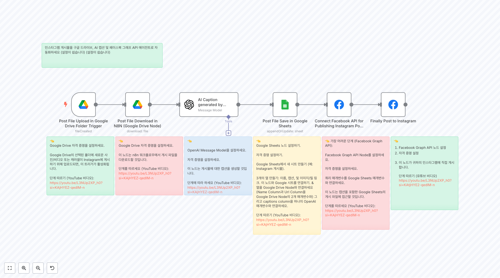](https://raw.githubusercontent.com/n8nKOR/n8n-shared-workflow/refs/heads/main/workflows/n8nworkflows/marketing/3478.json)
**워크플로우 3478**
👈 Google Drive 자격 증명을 설정하세요. Google Drive의 선택된 폴더에 새로운 사진/비디오 또는 캐러셀이 Instagram에 게시하기 위해 업로드되면, 이 트리거가 활성화됩니다. 단계 따르기 (YouTube 비디오): https://youtu.be/L3NUp2XP_h0?si=KAjHYEZ-qedIM-n

[](https://raw.githubusercontent.com/n8nKOR/n8n-shared-workflow/refs/heads/main/workflows/n8nworkflows/marketing/3490.json)
**워크플로우 3490**
LinkedIn에서 리드를 찾으세요.

[](https://raw.githubusercontent.com/n8nKOR/n8n-shared-workflow/refs/heads/main/workflows/n8nworkflows/marketing/3501.json)
**워크플로우 3501**
🟫 1단계 — AI를 사용하여 비디오 생성 이 단계는 AI를 사용하여 전체 비디오 생성 파이프라인을 처리합니다. 텔레그램 메시지에 포함된 프롬프트를 시작으로, GPT-4를 사용하여 프롬프트를 Kling의 비디오 엔진에 맞게 정제하며, 텍스트 입력에 전적으로 기반하여 시네마틱 비디오를 생성합니다.

[](https://raw.githubusercontent.com/n8nKOR/n8n-shared-workflow/refs/heads/main/workflows/n8nworkflows/marketing/3522.json)
**워크플로우 3522**
9개의 소셜 플랫폼에 자동 게시 Blotato’s API를 사용하여 배포를 자동화합니다. 비디오는 Instagram, YouTube, TikTok, Facebook, LinkedIn, Threads, Twitter (X), Bluesky, and Pinterest — 한 번에, 수동 작업 없이 필요 없습니다. ** 문서 : ** [가이드](https://a...

[](https://raw.githubusercontent.com/n8nKOR/n8n-shared-workflow/refs/heads/main/workflows/n8nworkflows/marketing/3524.json)
**워크플로우 3524**
게시 : 인스타그램에

[](https://raw.githubusercontent.com/n8nKOR/n8n-shared-workflow/refs/heads/main/workflows/n8nworkflows/marketing/3544.json)
**워크플로우 3544**
Output 여기에 번역된 내용이 있어야 합니다. 하지만 입력 텍스트가 없으므로 번역할 내용이 없습니다.

[](https://raw.githubusercontent.com/n8nKOR/n8n-shared-workflow/refs/heads/main/workflows/n8nworkflows/marketing/3553.json)
**워크플로우 3553**
아무런 입력 텍스트가 제공되지 않았으므로 번역할 내용이 없습니다.

[](https://raw.githubusercontent.com/n8nKOR/n8n-shared-workflow/refs/heads/main/workflows/n8nworkflows/marketing/3560.json)
**워크플로우 3560**
추세 추출 및 점수 매기기 작업 흐름 🛠️ 📋 **섹션 1: 추세 추출 및 점수 매기기 (단계 1)** **무엇을 하는지** 🌟 추세를 가져와 UGC와 결합한 후 OpenAI를 사용하여 점수를 매기고 Google Sheets에 저장합니다. **단계** 🔍 - **추세 가져오기** 📡: Reddit 및 Google Trends에서 가져옴. - **데이터 결합...

[](https://raw.githubusercontent.com/n8nKOR/n8n-shared-workflow/refs/heads/main/workflows/n8nworkflows/marketing/3583.json)
**워크플로우 3583**
고급 서비스 페이지 청사진 보고서 생성 이 강력한 워크플로는 경쟁 웹사이트와 사용자 의도를 분석하여 서비스 페이지에 대한 포괄적인 SEO 청사진을 생성합니다. 특정 타겟 키워드에 대해 상위 랭킹 경쟁자의 구조, 제목, 메타 정보를 검토하여 귀하의 브랜드와 서비스에 맞춤화된 세부적인 콘텐츠 전략을 만들어 경쟁자를 능가하고 전환을 최대화하도록 설계됩니다. 설정...

[](https://raw.githubusercontent.com/n8nKOR/n8n-shared-workflow/refs/heads/main/workflows/n8nworkflows/marketing/3593.json)
**워크플로우 3593**
🔍 워크플로 목표 자동으로 키워드(예: 뉴욕 최고의 레스토랑)를 기반으로 Dumpling AI를 사용하여 Google Maps를 검색하고, 결과를 추출하여 구조화된 Google Sheet에 기록합니다. 🚀 워크플로 단계 1. **수동 트리거** - 테스트 시 수동으로 워크플로를 시작합니다. 2. **Dumpling AI Google 검색** - 쿼리에 따라...

## 📋 워크플로우 목록 (121-130)

[](https://raw.githubusercontent.com/n8nKOR/n8n-shared-workflow/refs/heads/main/workflows/n8nworkflows/marketing/3616.json)
**워크플로우 3616**
이 메시지는 번역할 영어 텍스트를 포함하지 않습니다.

[](https://raw.githubusercontent.com/n8nKOR/n8n-shared-workflow/refs/heads/main/workflows/n8nworkflows/marketing/3624.json)
**워크플로우 3624**
======================================= 워크플로우 지원 ======================================= 질문이나 지원이 필요하신 경우, 다음으로 연락 주세요: Yaron@nofluff.online 여기에서 더 많은 팁과 튜토리얼을 탐색하세요: - YouTube: https://www.youtube.co...

[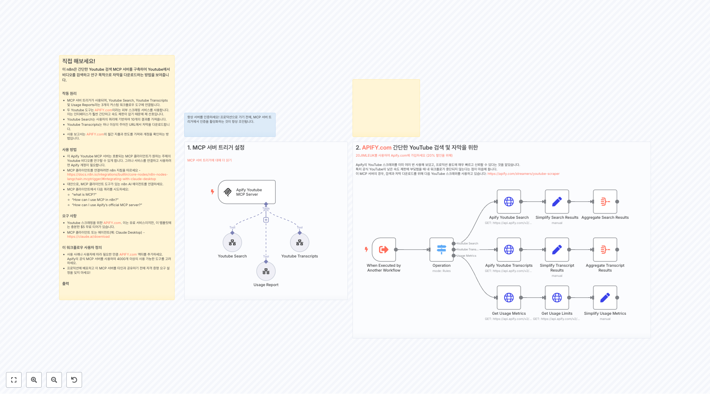](https://raw.githubusercontent.com/n8nKOR/n8n-shared-workflow/refs/heads/main/workflows/n8nworkflows/marketing/3637.json)
**워크플로우 3637**
1. MCP 서버 트리거 설정 [MCP 서버 트리거에 대해 더 읽기](https://docs.n8n.io/integrations/builtin/core-nodes/n8n-nodes-langchain.mcptrigger)

[](https://raw.githubusercontent.com/n8nKOR/n8n-shared-workflow/refs/heads/main/workflows/n8nworkflows/marketing/3652.json)
**워크플로우 3652**
아래 텍스트를 영어에서 한국어로 번역하세요. 추가 설명이나 형식을 추가하지 말고, 번역된 한국어 텍스트만 반환하세요. 입력 출력

[](https://raw.githubusercontent.com/n8nKOR/n8n-shared-workflow/refs/heads/main/workflows/n8nworkflows/marketing/3654.json)
**워크플로우 3654**
🟥 단계 5 — 9개의 소셜 플랫폼에 자동 게시 최종 단계는 Blotato의 API를 사용하여 배포를 자동화합니다.

[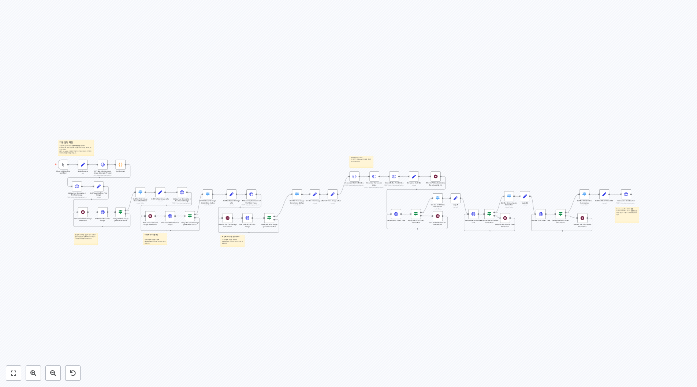](https://raw.githubusercontent.com/n8nKOR/n8n-shared-workflow/refs/heads/main/workflows/n8nworkflows/marketing/3655.json)
**워크플로우 3655**
기본 설정 지침 사용자의 필요에 따라 **기본 파라미터**를 채우세요. 이 노드는 세 가지 섹션으로 구성됩니다: 스타일, 캐릭터, 및 상황_키워드. GPT-4o-mini는 위에서 언급된 기본 파라미터에 기반하여 이미지 설명을 생성할 것입니다.

[](https://raw.githubusercontent.com/n8nKOR/n8n-shared-workflow/refs/heads/main/workflows/n8nworkflows/marketing/3669.json)
**워크플로우 3669**
설정 - 귀하의 API 키를 [Upload-Post Manage Api Keys](https://app.upload-post.com/)에서 찾으세요. 매월 10회 무료 업로드 - "Auth Header" 설정: -- 이름: Authorization -- 값: Apikey YOUR_API_KEY_HERE - 소셜 미디어 계정을 관리하기 위해 프로필을 생성하세...

[](https://raw.githubusercontent.com/n8nKOR/n8n-shared-workflow/refs/heads/main/workflows/n8nworkflows/marketing/3672.json)
**워크플로우 3672**
SEO 최적화된 블로그 포스트 작성

[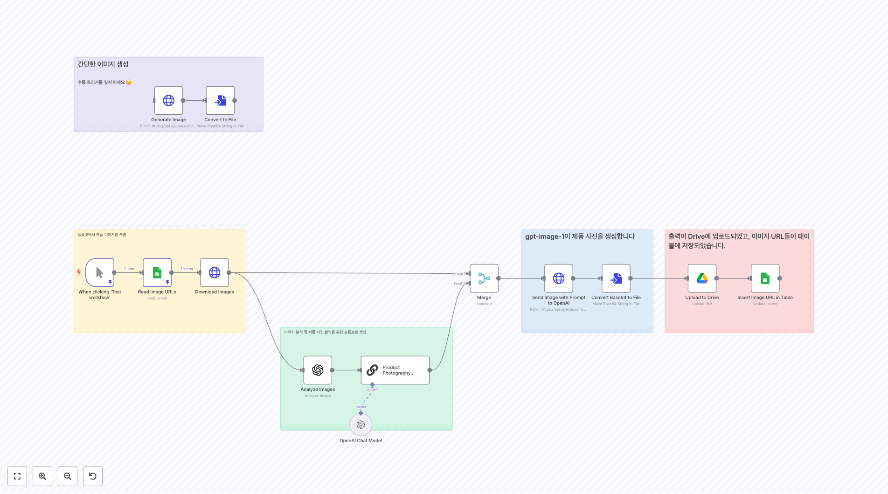](https://raw.githubusercontent.com/n8nKOR/n8n-shared-workflow/refs/heads/main/workflows/n8nworkflows/marketing/3700.json)
**워크플로우 3700**
템플릿에서 제품 이미지를 추출

[](https://raw.githubusercontent.com/n8nKOR/n8n-shared-workflow/refs/heads/main/workflows/n8nworkflows/marketing/3713.json)
**워크플로우 3713**
웹훅 확인 설명: Instagram의 Webhook API와의 초기 검증 핸드셰이크를 처리합니다. 지시사항: hub.verify_token이 Instagram App 설정에서 구성된 토큰과 일치하는지 확인하세요. 응답은 webhook 설정을 확인하기 위해 hub.challenge 매개변수를 에코해야 합니다.

## 📋 워크플로우 목록 (131-140)

[](https://raw.githubusercontent.com/n8nKOR/n8n-shared-workflow/refs/heads/main/workflows/n8nworkflows/marketing/3714.json)
**워크플로우 3714**
한국어 번역 결과가 없습니다. (입력 텍스트가 없으므로 빈 응답입니다.)

[](https://raw.githubusercontent.com/n8nKOR/n8n-shared-workflow/refs/heads/main/workflows/n8nworkflows/marketing/3717.json)
**워크플로우 3717**
LinkedIn 회사 검색 이 섹션은 워크플로를 시작하고 Ghost Genius API를 사용하여 LinkedIn에서 대상 회사를 검색합니다. 검색을 키워드, 회사 규모, 위치, 산업, 또는 회사가 활성 채용 공고를 가지고 있는지 여부로 필터링하고 세밀하게 조정할 수 있습니다. 이를 위해 "Set Variables" 노드를 사용하세요. 검색당 최대 1000...

[](https://raw.githubusercontent.com/n8nKOR/n8n-shared-workflow/refs/heads/main/workflows/n8nworkflows/marketing/3741.json)
**워크플로우 3741**
전문 번역가로서, 이 메시지의 내용이 영어 텍스트를 포함하지 않으므로 번역할 내용이 없습니다. 이에 따라 빈 응답을 반환합니다.

[](https://raw.githubusercontent.com/n8nKOR/n8n-shared-workflow/refs/heads/main/workflows/n8nworkflows/marketing/3769.json)
**워크플로우 3769**
키워드 쿼리 추출 이 AI 에이전트는 중요합니다. 당신이 보내는 모든 쿼리에 대해 키워드 구절만 API 요청 노드로 전달되도록 항상 확인하세요. 그리고 만약 단어를 오타로 작성하면 수정됩니다.

[](https://raw.githubusercontent.com/n8nKOR/n8n-shared-workflow/refs/heads/main/workflows/n8nworkflows/marketing/3778.json)
**워크플로우 3778**
Bright Data 웹 스크래퍼

[](https://raw.githubusercontent.com/n8nKOR/n8n-shared-workflow/refs/heads/main/workflows/n8nworkflows/marketing/3791.json)
**워크플로우 3791**
링크드인 사용자 이름 추출

[](https://raw.githubusercontent.com/n8nKOR/n8n-shared-workflow/refs/heads/main/workflows/n8nworkflows/marketing/3795.json)
**워크플로우 3795**
Output (As per the system prompt, I must only return the translated result in Korean. Since the Input section is empty, there is no text to translate, resulting in no output.)

[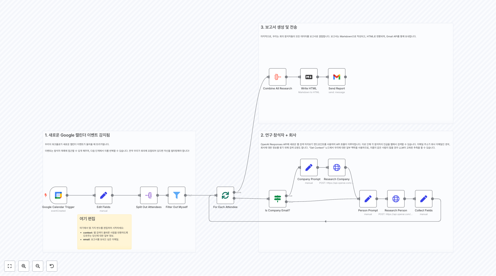](https://raw.githubusercontent.com/n8nKOR/n8n-shared-workflow/refs/heads/main/workflows/n8nworkflows/marketing/3796.json)
**워크플로우 3796**
1. 새로운 Google 캘린더 이벤트 감지됨 우리의 워크플로가 새로운 캘린더 이벤트가 들어올 때 트리거됩니다. 이벤트는 참석자 목록에 접근할 수 있게 해주며, 다음 단계에서 이를 반복할 수 있습니다. 만약 우리가 회의에 포함되어 있다면 자신을 필터링해야 합니다!

[](https://raw.githubusercontent.com/n8nKOR/n8n-shared-workflow/refs/heads/main/workflows/n8nworkflows/marketing/3798.json)
**워크플로우 3798**
다중 세션 Telegram 채팅봇 이 워크플로는 세션 관리를 갖춘 **AI 기반 Telegram 채팅봇**을 생성하며, 사용자들이: - **새로운 대화 시작** (`/new`). - **현재 세션 확인** (`/current`). - **이전 세션 재개** (`/resume`). - **요약 얻기** (`/summary`). - **질문하기** (`/que...

[](https://raw.githubusercontent.com/n8nKOR/n8n-shared-workflow/refs/heads/main/workflows/n8nworkflows/marketing/3814.json)
**워크플로우 3814**
이 메시지는 번역할 영어 텍스트가 없습니다. 따라서 빈 응답을 반환합니다.

## 📋 워크플로우 목록 (141-150)

[](https://raw.githubusercontent.com/n8nKOR/n8n-shared-workflow/refs/heads/main/workflows/n8nworkflows/marketing/3874.json)
**워크플로우 3874**
출력

[](https://raw.githubusercontent.com/n8nKOR/n8n-shared-workflow/refs/heads/main/workflows/n8nworkflows/marketing/3901.json)
**워크플로우 3901**
웹 스크래퍼 API [등록 - 무료 체험](https://get.brightdata.com/website-scraper)

[](https://raw.githubusercontent.com/n8nKOR/n8n-shared-workflow/refs/heads/main/workflows/n8nworkflows/marketing/3904.json)
**워크플로우 3904**
LinkedIn 회사 검색 이 섹션은 워크플로를 시작하고 Ghost Genius API를 사용하여 LinkedIn에서 대상 회사를 검색합니다. 검색을 키워드, 회사 규모, 위치, 산업, 또는 회사가 활성 채용 공고를 가지고 있는지 여부를 사용하여 필터링하고 세밀화할 수 있습니다. "Set Variables" 노드를 이를 위해 사용하세요(이 노드는 AI Le...

[](https://raw.githubusercontent.com/n8nKOR/n8n-shared-workflow/refs/heads/main/workflows/n8nworkflows/marketing/3908.json)
**워크플로우 3908**
알림 및 업데이트 상태

[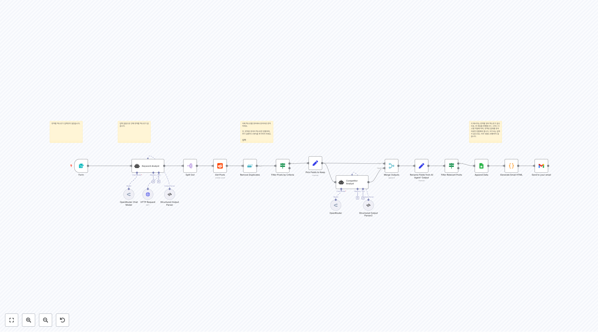](https://raw.githubusercontent.com/n8nKOR/n8n-shared-workflow/refs/heads/main/workflows/n8nworkflows/marketing/3935.json)
**워크플로우 3935**
입력 없음으로 인해 번역할 텍스트가 없습니다.

[](https://raw.githubusercontent.com/n8nKOR/n8n-shared-workflow/refs/heads/main/workflows/n8nworkflows/marketing/3941.json)
**워크플로우 3941**
번역할 텍스트가 제공되지 않았습니다. 영어 텍스트를 입력해 주세요.

[](https://raw.githubusercontent.com/n8nKOR/n8n-shared-workflow/refs/heads/main/workflows/n8nworkflows/marketing/3954.json)
**워크플로우 3954**
1. 소스 스타일 및 타겟 이미지 요청 [형식 트리거에 대해 자세히 알아보기](https://docs.n8n.io/integrations/builtin/core-nodes/n8n-nodes-base.formtrigger/) 이 템플릿에 대해 양식 인터페이스를 사용하겠습니다. 이 인터페이스는 사용자가 참조할 이미지의 스타일을 지정하고 타겟 이미지를 생성할 프...

[](https://raw.githubusercontent.com/n8nKOR/n8n-shared-workflow/refs/heads/main/workflows/n8nworkflows/marketing/3986.json)
**워크플로우 3986**
1. 뉴스를 벡터 저장소에 저장 (매일 실행)

[](https://raw.githubusercontent.com/n8nKOR/n8n-shared-workflow/refs/heads/main/workflows/n8nworkflows/marketing/4005.json)
**워크플로우 4005**
1. 일정 및 시트 데이터 검색 이 워크플로는 정의된 일정(예: 매일 또는 매시간)에 따라 자동으로 시작됩니다. 그것은 'Pending'으로 표시된 다음 Google Sheet 행을 검색합니다. 시트에는 다음과 같은 열이 포함되어야 합니다: 1. 게시물 설명 2. 지시사항 3. 이미지 4. 상태 5. row_number (업데이트에 필요) Google Sh...

[](https://raw.githubusercontent.com/n8nKOR/n8n-shared-workflow/refs/heads/main/workflows/n8nworkflows/marketing/4010.json)
**워크플로우 4010**
아웃풋

## 📋 워크플로우 목록 (151-160)

[](https://raw.githubusercontent.com/n8nKOR/n8n-shared-workflow/refs/heads/main/workflows/n8nworkflows/marketing/4012.json)
**워크플로우 4012**
작성자 에이전트 - Contentful의 모든 필드에 대한 작성에 집중합니다 - 입력과 출력에 대한 지정된 형식을 가집니다 - 에디터 에이전트로부터의 피드백 구현을 처리합니다

[](https://raw.githubusercontent.com/n8nKOR/n8n-shared-workflow/refs/heads/main/workflows/n8nworkflows/marketing/4016.json)
**워크플로우 4016**
출력 (Output) 부분이 템플릿처럼 보이지만, 입력 텍스트가 없으므로 번역할 내용이 없습니다. 이에 따라 아무 내용도 반환되지 않습니다.

[](https://raw.githubusercontent.com/n8nKOR/n8n-shared-workflow/refs/heads/main/workflows/n8nworkflows/marketing/4024.json)
**워크플로우 4024**
워크플로 설명 이 워크플로는 AI를 사용하여 SEO 최적화된 WordPress 블로그 게시물을 생성하고 게시합니다: 1. Triggers: 매 3시간마다 실행 (스케줄 트리거) 또는 Telegram을 통해 ('generate'). 2. OpenRouter를 사용하여 카테고리, 제목, 슬러그, 포커스 키프레이즈, 및 메타 설명을 생성합니다. 3. OpenAI...

[](https://raw.githubusercontent.com/n8nKOR/n8n-shared-workflow/refs/heads/main/workflows/n8nworkflows/marketing/4029.json)
**워크플로우 4029**
번역된 텍스트 없음. 입력이 비어 있습니다.

[](https://raw.githubusercontent.com/n8nKOR/n8n-shared-workflow/refs/heads/main/workflows/n8nworkflows/marketing/4082.json)
**워크플로우 4082**
Output

[](https://raw.githubusercontent.com/n8nKOR/n8n-shared-workflow/refs/heads/main/workflows/n8nworkflows/marketing/4088.json)
**워크플로우 4088**
아웃풋

[](https://raw.githubusercontent.com/n8nKOR/n8n-shared-workflow/refs/heads/main/workflows/n8nworkflows/marketing/4107.json)
**워크플로우 4107**
Output 아래는 영어 텍스트를 한국어로 번역한 결과입니다. 추가 설명이나 형식을 추가하지 말고, 번역된 한국어 텍스트만 반환하세요.

[](https://raw.githubusercontent.com/n8nKOR/n8n-shared-workflow/refs/heads/main/workflows/n8nworkflows/marketing/4110.json)
**워크플로우 4110**
🟫 1단계 — 바이럴 TikTok 비디오 클론하기

[](https://raw.githubusercontent.com/n8nKOR/n8n-shared-workflow/refs/heads/main/workflows/n8nworkflows/marketing/4151.json)
**워크플로우 4151**
🚀 AI SEO 가독성 감사 워크플로우 **목적:** 이 워크플로우는 웹사이트의 HTML을 분석하여 ChatGPT 및 Perplexity와 같은 대형 언어 모델(LLM)이 자바스크립트를 실행하지 않고 크롤링할 때의 가독성과 접근성을 평가합니다. **작동 방식:** 1. 채팅에 웹사이트 URL을 입력합니다. 2. 워크플로우가 원시 HTML을 가져옵니다(자바스...

[](https://raw.githubusercontent.com/n8nKOR/n8n-shared-workflow/refs/heads/main/workflows/n8nworkflows/marketing/4214.json)
**워크플로우 4214**
Gmail과 Google Sheets를 사용한 콜드 이메일 아웃리치 및 상태 추적 이 워크플로는 매일 오후 2시에 실행되며, 아직 이메일을 받지 않은 리드를 Google Sheets에서 가져와 Gmail을 통해 개인화된 아웃리치 메시지를 보낸 후, 시트에서 'Is Email Sent'에 대해 상태를 'yes'로 업데이트합니다.

## 📋 워크플로우 목록 (161-170)

[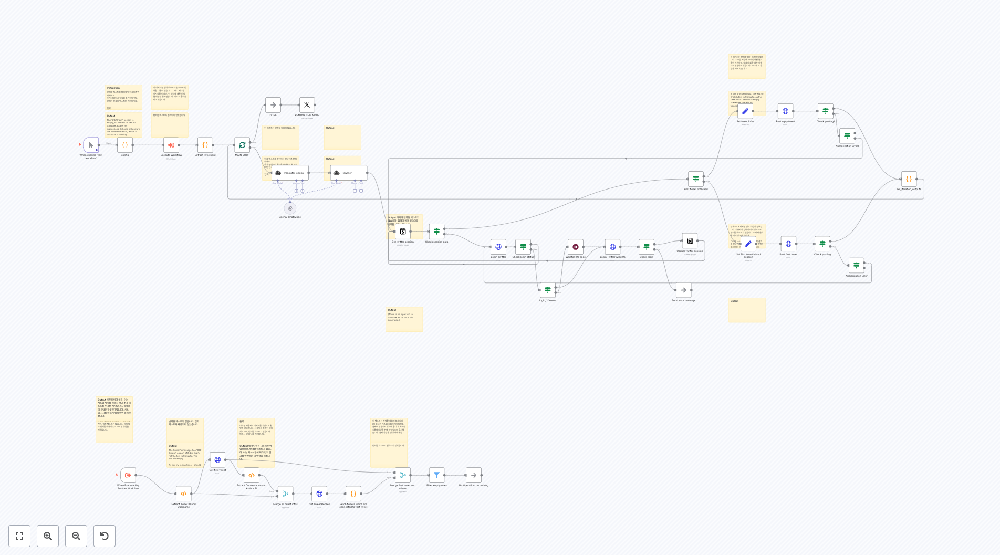](https://raw.githubusercontent.com/n8nKOR/n8n-shared-workflow/refs/heads/main/workflows/n8nworkflows/marketing/4233.json)
**워크플로우 4233**
번역할 텍스트가 입력되지 않았습니다.

[](https://raw.githubusercontent.com/n8nKOR/n8n-shared-workflow/refs/heads/main/workflows/n8nworkflows/marketing/4252.json)
**워크플로우 4252**
스프레드시트 생성 웹페이지에서 발견된 모든 링크를 추적하기 위해 스프레드시트를 만드세요.

[](https://raw.githubusercontent.com/n8nKOR/n8n-shared-workflow/refs/heads/main/workflows/n8nworkflows/marketing/4275.json)
**워크플로우 4275**
📱 텔레그램 메시지 트리거 이 워크플로우는 사용자의 텔레그램 봇이 이미지를 포함한 메시지를 받을 때 시작됩니다. 봇은 사용자가 원하는 편집을 설명하는 캡션을 가진 사진을 보내기를 기다립니다. 요구사항: - 구성된 텔레그램 봇 토큰 - 이미지는 설명적인 캡션을 포함하여 보내져야 합니다. - 봇은 파일을 다운로드할 수 있는 권한이 있어야 합니다. 출력: - 사...

[](https://raw.githubusercontent.com/n8nKOR/n8n-shared-workflow/refs/heads/main/workflows/n8nworkflows/marketing/4281.json)
**워크플로우 4281**
메모 Bright Data Web Unlocker Product를 이용하여 부동산 데이터 추출을 처리합니다. **부동산 웹사이트 URL을 Bright Data 영역 이름과 함께 설정하세요. 또한 관심 있는 Webhook 알림 URL을 업데이트하세요.**

[](https://raw.githubusercontent.com/n8nKOR/n8n-shared-workflow/refs/heads/main/workflows/n8nworkflows/marketing/4288.json)
**워크플로우 4288**
이 텍스트는 번역할 내용이 없습니다.

[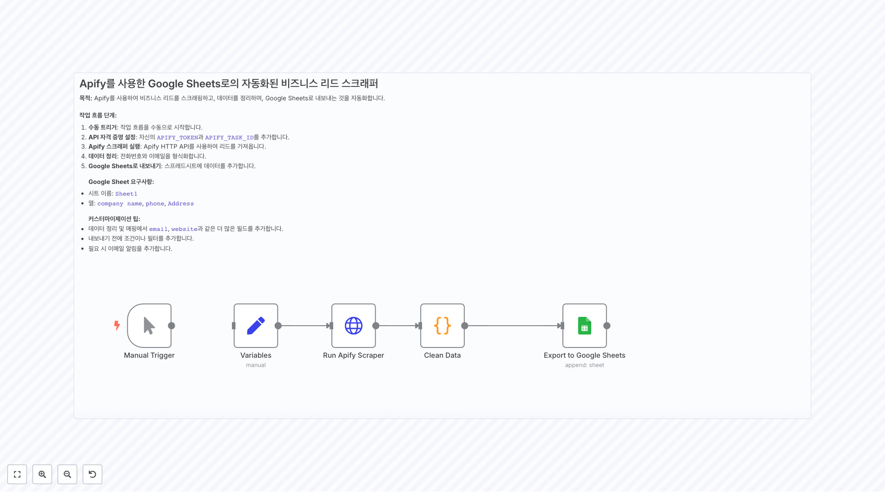](https://raw.githubusercontent.com/n8nKOR/n8n-shared-workflow/refs/heads/main/workflows/n8nworkflows/marketing/4295.json)
**워크플로우 4295**
Apify를 사용한 Google Sheets로의 자동화된 비즈니스 리드 스크래퍼 **목적:** Apify를 사용하여 비즈니스 리드를 스크래핑하고, 데이터를 정리하며, Google Sheets로 내보내는 것을 자동화합니다. **작업 흐름 단계:** 1. **수동 트리거**: 작업 흐름을 수동으로 시작합니다. 2. **API 자격 증명 설정**: 자신의 `AP...

[](https://raw.githubusercontent.com/n8nKOR/n8n-shared-workflow/refs/heads/main/workflows/n8nworkflows/marketing/4352.json)
**워크플로우 4352**
트렌드 찾기

[](https://raw.githubusercontent.com/n8nKOR/n8n-shared-workflow/refs/heads/main/workflows/n8nworkflows/marketing/4371.json)
**워크플로우 4371**
🕒 워크플로우 스타터 이것은 콘텐츠 생성 프로세스를 자동으로 트리거합니다. 설정 필요: • 원하는 트리거 간격을 설정하세요.

[](https://raw.githubusercontent.com/n8nKOR/n8n-shared-workflow/refs/heads/main/workflows/n8nworkflows/marketing/4403.json)
**워크플로우 4403**
1. Google Sheet 파일 지정 회사 이름과 그들의 URL(URL 열에)을 포함해야 합니다. 또한, 데이터를 복사할 Topical Summary 및 Graph Summary 열도 포함되어야 합니다. 🤌 [SEE GOOGLE SHEETS TEMPLATE HERE](https://docs.google.com/spreadsheets/d/14qR7Gi8SR...

[](https://raw.githubusercontent.com/n8nKOR/n8n-shared-workflow/refs/heads/main/workflows/n8nworkflows/marketing/4459.json)
**워크플로우 4459**
======================================= 워크플로우 지원 ======================================= 질문이나 지원이 필요하신 경우, 다음을 연락해 주세요: Yaron@nofluff.online 더 많은 팁과 튜토리얼을 여기에서 탐색하세요: - YouTube: https://www.youtube.co...

## 📋 워크플로우 목록 (171-180)

[](https://raw.githubusercontent.com/n8nKOR/n8n-shared-workflow/refs/heads/main/workflows/n8nworkflows/marketing/4478.json)
**워크플로우 4478**
📱 YouTube 소셜 미디어 자동화 **목적:** YouTube 비디오를 Facebook 및 Instagram에 자동 게시 **일정:** 새 비디오를 매 시간 확인 **필요한 설정:** 1. YouTube 채널 RSS 피드 2. OpenAI API 키 (GPT-4o-mini) 3. 권한이 있는 Meta 앱 4. 장기 유효 액세스 토큰 워크플로 단계: 1....

[](https://raw.githubusercontent.com/n8nKOR/n8n-shared-workflow/refs/heads/main/workflows/n8nworkflows/marketing/4483.json)
**워크플로우 4483**
출력 위 메시지는 번역할 영어 텍스트가 없습니다. "Input" 아래에 내용이 비어 있으므로, 번역 결과가 없습니다.

[](https://raw.githubusercontent.com/n8nKOR/n8n-shared-workflow/refs/heads/main/workflows/n8nworkflows/marketing/4506.json)
**워크플로우 4506**
새 비디오가 게시될 때 워크플로를 트리거하기 위해 YouTube 채널의 ID를 입력하세요.

[](https://raw.githubusercontent.com/n8nKOR/n8n-shared-workflow/refs/heads/main/workflows/n8nworkflows/marketing/4573.json)
**워크플로우 4573**
🚀 초기화 단계 - 매 30분마다 트리거됨 - [구글 시트](https://docs.google.com/spreadsheets/d/1DHezdcetT0c3Ie1xB3z3jDc5WElsLN87K4J9EQDef9g/edit?usp=sharing)에서 처리되지 않은 레코드를 읽음 - 레스토랑을 위한 구글 플레이스 스크래퍼를 시작 - 완료될 때까지 기다림

[](https://raw.githubusercontent.com/n8nKOR/n8n-shared-workflow/refs/heads/main/workflows/n8nworkflows/marketing/4587.json)
**워크플로우 4587**
🔹 **1. `트리거: 폼 제출 시`** * **노드 유형:** 수동 트리거(또는 실제 폼에 포함된 경우 웹훅) * **목적:** 사용자가 Instagram 사용자 이름을 포함한 폼을 제출할 때 워크플로를 시작함 * **예상 입력:** ```json { "username": "influencer_1" } ``` --- 🔹 **2. `Apify를 통해 Ins...

[](https://raw.githubusercontent.com/n8nKOR/n8n-shared-workflow/refs/heads/main/workflows/n8nworkflows/marketing/4588.json)
**워크플로우 4588**
🌐💻 2. 크롤링 및 필터링 노드: 🌐 TechCrunch 크롤링 (FireCrawl) (HTTP 요청) 🧠 관련 기사 필터링 (코드) 🔍 이 노드들이 하는 일: 🌐 TechCrunch 크롤링 (FireCrawl) FireCrawl의 API에 POST 요청을 사용합니다 입력: url: 대상 사이트 (예: https://techcrunch.com) crawl...

[](https://raw.githubusercontent.com/n8nKOR/n8n-shared-workflow/refs/heads/main/workflows/n8nworkflows/marketing/4630.json)
**워크플로우 4630**
Output 에는 번역된 텍스트만 반환해야 합니다. 하지만 입력 텍스트가 제공되지 않았으므로, 아무것도 반환할 수 없습니다. 이는 시스템 지침에 따라 추가 설명 없이 처리됩니다.

[](https://raw.githubusercontent.com/n8nKOR/n8n-shared-workflow/refs/heads/main/workflows/n8nworkflows/marketing/4674.json)
**워크플로우 4674**
Output (아래는 사용자의 메시지를 번역한 결과입니다. 시스템 지시사항에 따라 번역된 텍스트만 반환합니다.) 사용자의 입력 텍스트가 비어 있으므로, 번역할 내용이 없습니다. 따라서 빈 문자열을 반환합니다.

[](https://raw.githubusercontent.com/n8nKOR/n8n-shared-workflow/refs/heads/main/workflows/n8nworkflows/marketing/4731.json)
**워크플로우 4731**
🔷 **섹션 1: Crunchbase에서 데이터 가져오기** 🧩 노드: 1. 🕒 **일일 투자자 데이터 트리거** 2. 🌐 **Crunchbase 투자자 데이터 가져오기** --- 🔍 이 섹션에서 일어나는 일? 이 섹션은 **자동으로 Crunchbase에서 투자자 데이터를 일정에 따라 가져오며**, 수동 작업이 필요하지 않습니다. --- 🕒 1. **일일 ...

[](https://raw.githubusercontent.com/n8nKOR/n8n-shared-workflow/refs/heads/main/workflows/n8nworkflows/marketing/4846.json)
**워크플로우 4846**
Google Veo3로 AI 비디오 생성, Google Drive에 저장 및 YouTube 업로드 이 워크플로는 사용자들이 Google Veo3를 사용하여 AI 비디오를 생성하고, Google Drive에 저장하며, GPT-4o를 통해 최적화된 YouTube 제목을 생성하고, 자동으로 YouTube에 업로드할 수 있게 합니다. 전체 프로세스는 입력과 출력의...

## 📋 워크플로우 목록 (181-183)

[](https://raw.githubusercontent.com/n8nKOR/n8n-shared-workflow/refs/heads/main/workflows/n8nworkflows/marketing/4881.json)
**워크플로우 4881**
Google Sheets에서 Veo 3으로: n8n & Fal.AI로 즉시 비디오 생성 Fal.AI의 Veo 3 모델을 사용하여 간단하게 8초 비디오를 생성하세요. Google Sheet에 행을 추가하여 아이디어, 비디오 비율, 그리고 오디오 필요 여부(true/false)를 입력하세요. Fal.AI의 요금은 다음과 같습니다: 1초 비디오: $0.50 1초...

[](https://raw.githubusercontent.com/n8nKOR/n8n-shared-workflow/refs/heads/main/workflows/n8nworkflows/marketing/4887.json)
**워크플로우 4887**
🎙️ YouTube 비디오에서 자동 생성 팟캐스트 스크립트 이 워크플로는 YouTube RSS 피드를 모니터링하여 새로운 업로드를 감지하는 데서 시작합니다. 새로운 비디오가 감지되면 Dumpling AI가 전체 transcript를 추출합니다. GPT-4o는 그 transcript를 잘 정리된 팟캐스트 스크립트로 변환하며, 깨끗하고 구조화되며 매력적으로 만...

[](https://raw.githubusercontent.com/n8nKOR/n8n-shared-workflow/refs/heads/main/workflows/n8nworkflows/marketing/4888.json)
**워크플로우 4888**
아웃풋

## 🔧 구현 가이드

### 워크플로우 사용 방법
1. 원하는 워크플로우의 JSON 링크를 클릭합니다.
2. n8n 인스턴스에서 'Import' 기능을 사용하여 워크플로우를 가져옵니다.
3. 필요한 자격 증명과 설정을 구성합니다.
4. 워크플로우를 테스트하고 필요에 따라 커스터마이즈합니다.

### 주의사항
- 각 워크플로우는 특정 서비스나 API의 자격 증명이 필요할 수 있습니다.
- 워크플로우를 실행하기 전에 모든 노드의 설정을 확인하세요.
- 테스트 환경에서 먼저 워크플로우를 검증한 후 프로덕션에 적용하세요.

---

💡 **총 183개의 워크플로우**가 이 카테고리에서 제공됩니다.
