# Product 워크플로우

이 폴더에는 제품 개발, 프로젝트 관리, 데이터 분석, 고객 서비스 자동화에 중점을 둔 **55개의 워크플로우**가 포함되어 있습니다.

## 🧠 AI 기반 데이터 분석 및 관리

### 데이터베이스 AI 채팅 시스템

**MySQL 데이터베이스 AI 채팅 시스템**
MySQL 데이터베이스와 직접 대화할 수 있는 AI 에이전트입니다. 자연어로 질문하면 SQL 쿼리를 자동 생성하고 실행하여 결과를 제공합니다.

[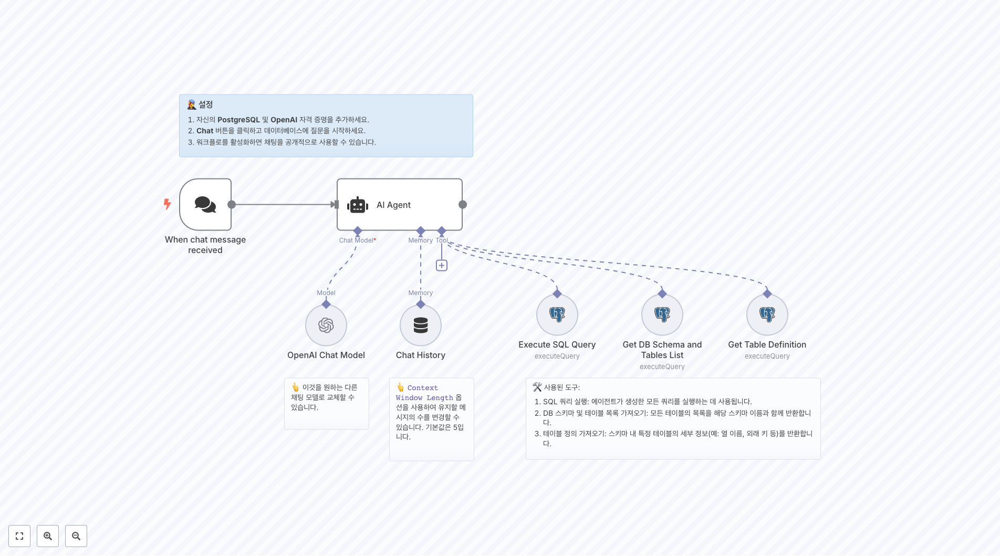](2859.json)
**PostgreSQL 데이터베이스 채팅**
PostgreSQL 데이터베이스와 자연어로 상호작용할 수 있는 AI 시스템입니다. 스키마 정보를 자동으로 파악하고 복잡한 쿼리를 생성합니다.

[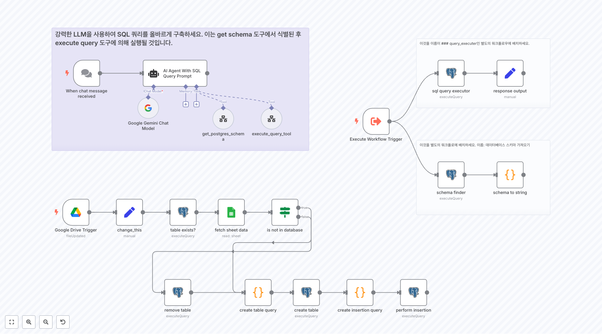](3079.json)
**Google Sheets RAG 시스템**
Google Sheets 데이터를 벡터 데이터베이스로 변환하여 AI 기반 검색 및 분석을 가능하게 하는 시스템입니다.

**AI 데이터 분석가 시스템**
Google Visualization API와 연동하여 데이터를 시각화하고 분석하는 AI 기반 데이터 분석 도구입니다.

### AI 뉴스레터 및 정보 관리
[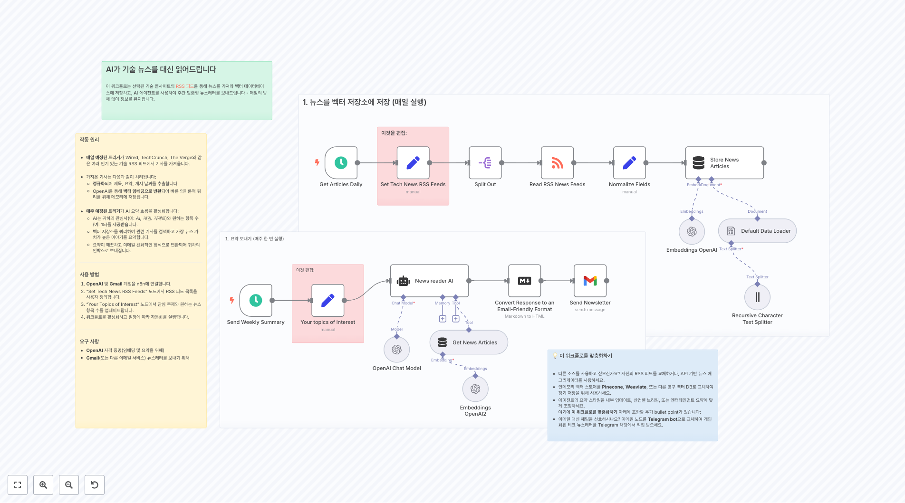](3986.json)
**개인화된 AI 기술 뉴스레터**
RSS 피드, OpenAI, Gmail을 결합하여 개인화된 기술 뉴스를 자동으로 큐레이션하고 배포하는 시스템입니다.

[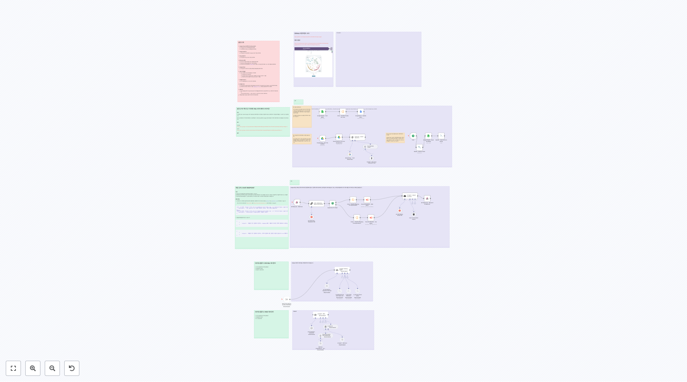](3151.json)
**Tech Radar 기술 동향 분석**
Google Sheets의 기술 데이터를 RAG 친화적 문서로 변환하고 MySQL에 저장하여 기술 동향을 추적하는 시스템입니다.

[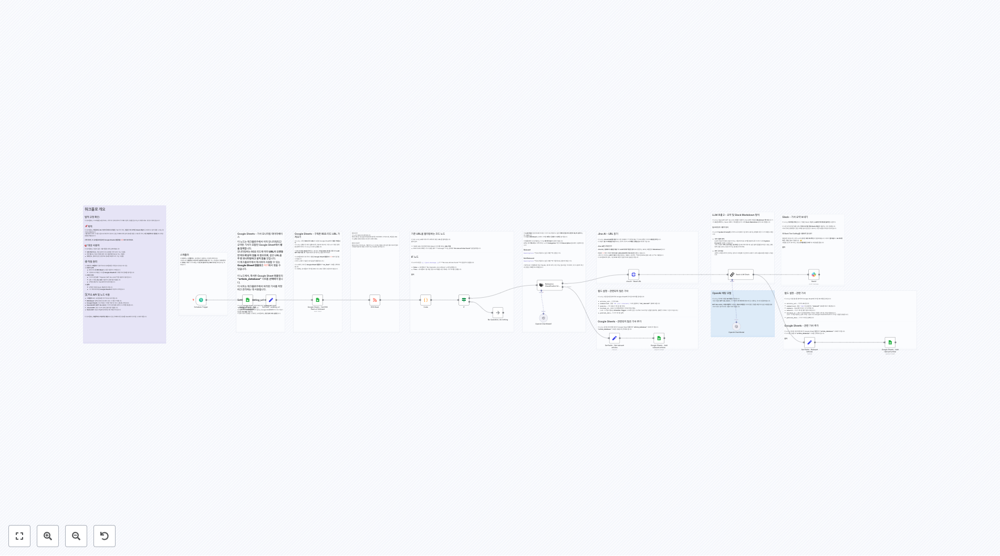](2799.json)
**AI 기반 정보 모니터링**
OpenAI, Google Sheets, Jina AI, Slack을 연동하여 관심 주제에 대한 정보를 자동으로 수집하고 분석하는 시스템입니다.

### SQL 및 데이터 변환
[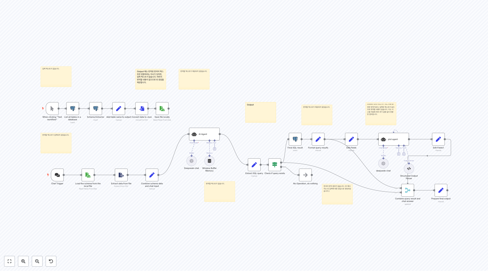](3497.json)
**텍스트-SQL 변환 데이터 분석**
자연어 질문을 SQL 쿼리로 변환하고 결과를 시각화하는 AI 기반 데이터 분석 시스템입니다.

## 📋 프로젝트 관리 및 워크플로우 자동화

### 회의 및 태스크 관리
[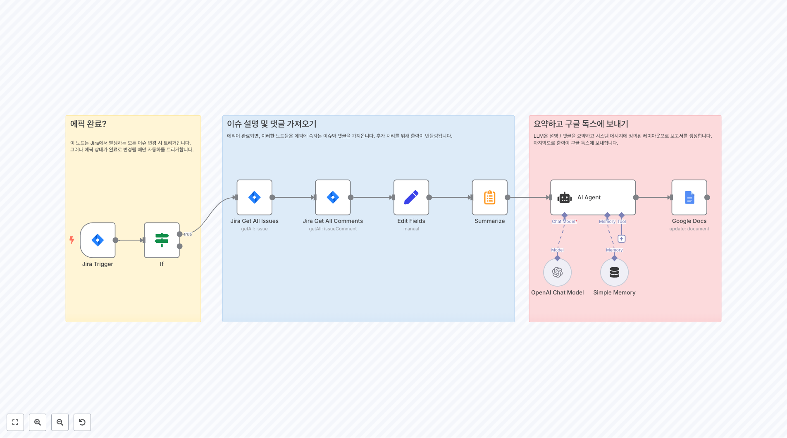](3934.json)
**Jira 회고 시스템**
Jira 이슈와 댓글을 AI로 분석하여 프로젝트 교훈을 추출하고 Google Docs에 자동으로 문서화하는 시스템입니다.

[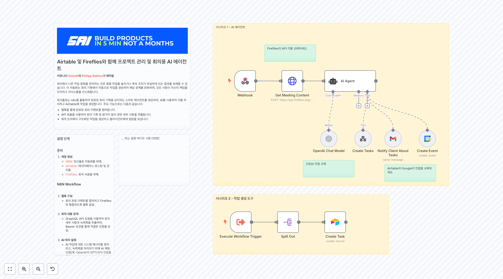](2683.json)
**Firefiles AI 회의 어시스턴트**
회의 트랜스크립트를 AI로 분석하여 작업을 AirTable에 자동 생성하고 클라이언트에게 알림을 보내는 시스템입니다.

**Notion-Todoist 실시간 양방향 동기화**
Notion 데이터베이스와 Todoist 프로젝트 간의 실시간 양방향 동기화를 제공하는 시스템입니다.

[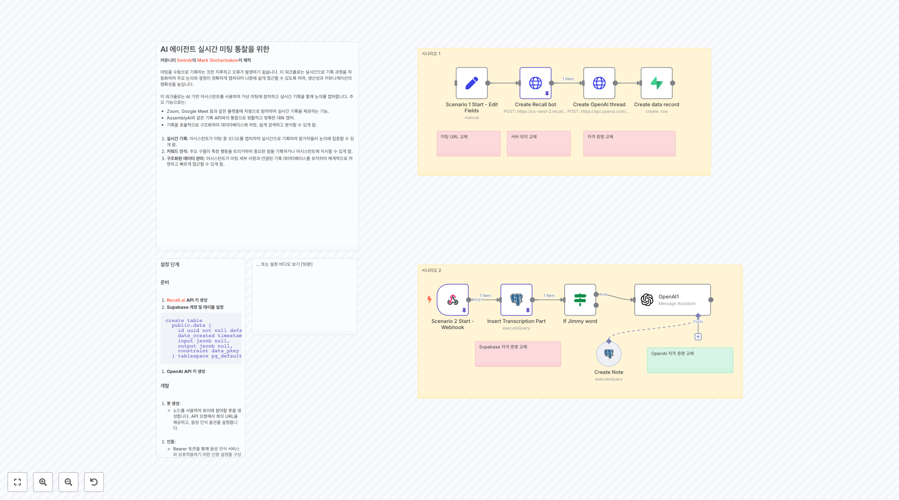](2651.json)
**실시간 미팅 AI 통찰**
Recall.ai와 OpenAI Assistant를 사용하여 실시간으로 회의를 기록하고 통찰을 제공하는 시스템입니다.

### 이슈 관리 및 동기화
[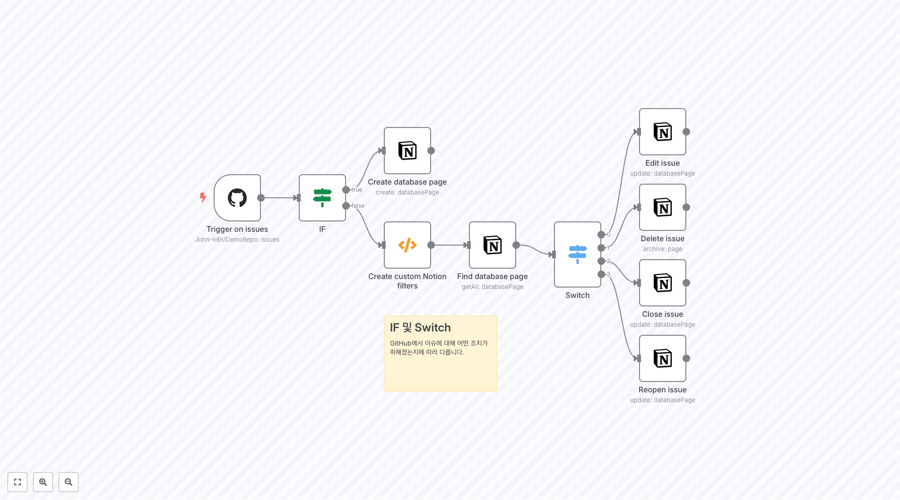](1804.json)
**GitHub 이슈 Notion 동기화**
GitHub 이슈를 Notion 데이터베이스와 자동으로 동기화하여 프로젝트 관리를 통합하는 시스템입니다.

[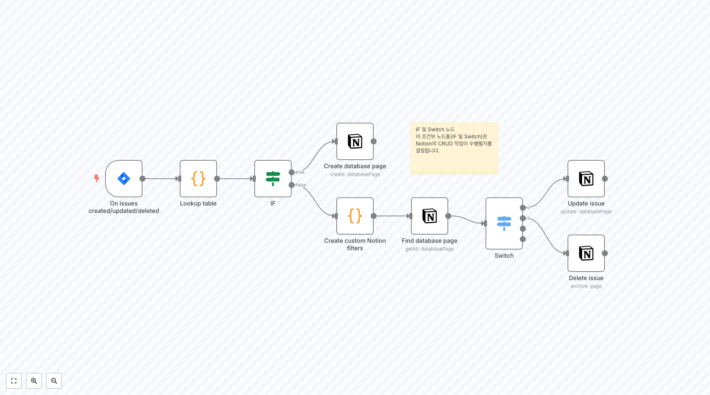](1831.json)
**Jira 이슈 Notion 동기화**
Jira 이슈와 댓글을 Notion 데이터베이스에 자동으로 동기화하는 시스템입니다.

## 🕷️ 웹 스크래핑 및 데이터 수집

### 대량 데이터 수집
[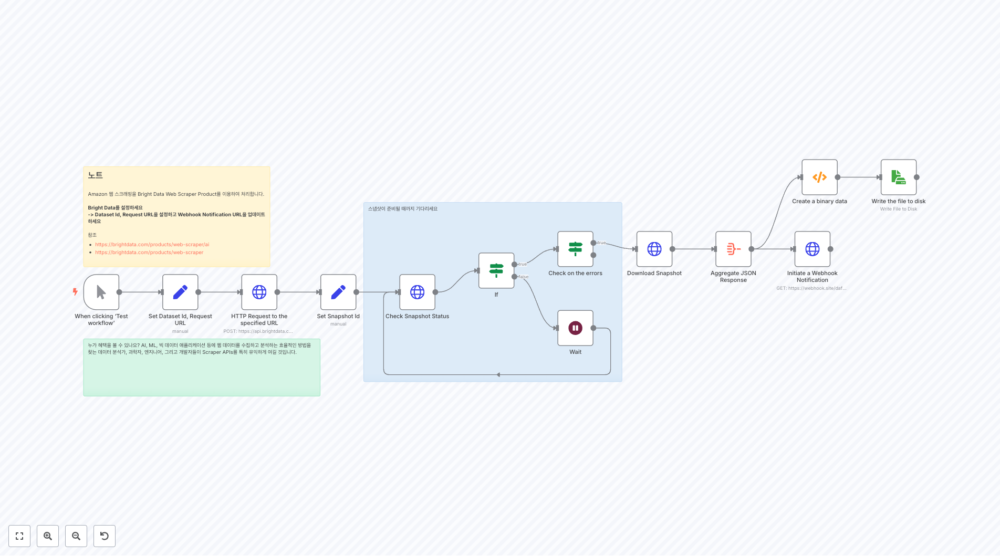](3866.json)
**Bright Data 웹 스크래퍼**
Bright Data를 사용하여 대량의 구조화된 데이터를 추출하고 처리하는 고급 웹 스크래핑 시스템입니다.

[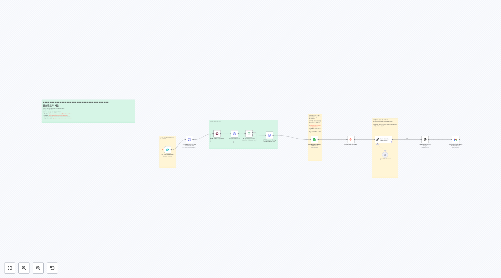](3624.json)
**Amazon 제품 경쟁 분석**
Bright Data를 사용하여 Amazon 제품의 가격을 모니터링하고 경쟁 분석을 수행하는 시스템입니다.

**Trustpilot 리뷰 스크래핑 및 감정 분석**
DeepSeek과 OpenAI를 사용하여 Trustpilot 리뷰를 스크래핑하고 감정을 분석하는 시스템입니다.

[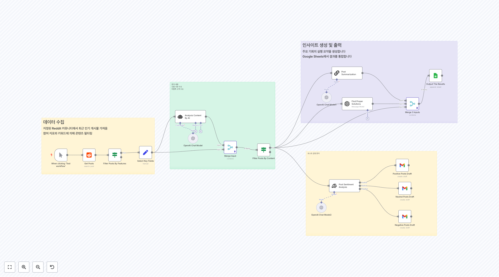](2978.json)
**Reddit 게시물 비즈니스 기회 분석**
Reddit 게시물을 AI로 분석하여 비즈니스 기회를 식별하고 감정 분석을 수행하는 시스템입니다.

### API 문서 및 콘텐츠 수집

**API 문서 자동 스크래핑 시스템**
웹사이트의 API 문서를 자동으로 스크래핑하고 벡터 데이터베이스에 저장하는 고급 시스템입니다.

[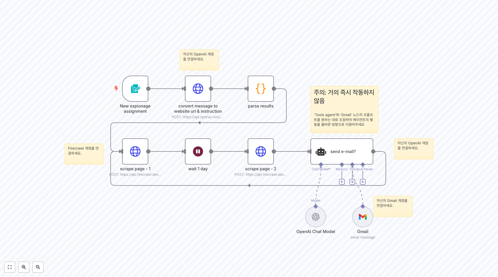](3101.json)
**웹사이트 변경 감시 스파이 도구**
Firecrawl을 사용하여 웹사이트 변경사항을 감시하고 중요한 변화를 이메일로 알리는 시스템입니다.

## 🛍️ 고객 서비스 및 지원 시스템

### AI 쇼핑 및 고객 지원

**OpenAI 개인 쇼핑 어시스턴트**
RAG와 WooCommerce를 결합한 AI 기반 개인 쇼핑 어시스턴트로 고객에게 맞춤형 제품을 추천합니다.

[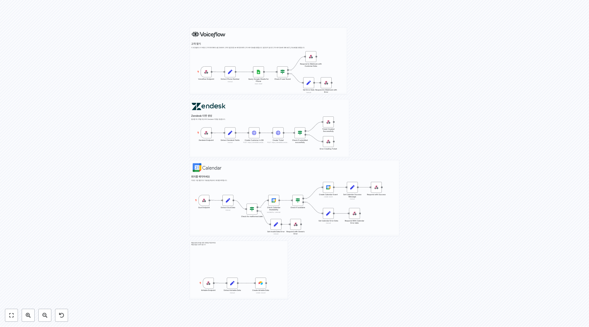](2796.json)
**고객 지원 통합 시스템**
Voiceflow, Zendesk, Google Calendar를 통합하여 포괄적인 고객 지원 솔루션을 제공합니다.

[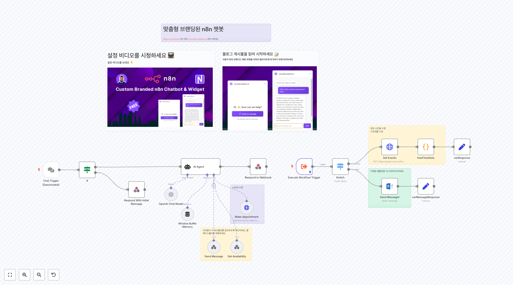](2786.json)
**비즈니스 약속 예약 시스템**
Microsoft Outlook과 연동하여 AI 기반 약속 예약 및 관리 시스템을 제공합니다.

[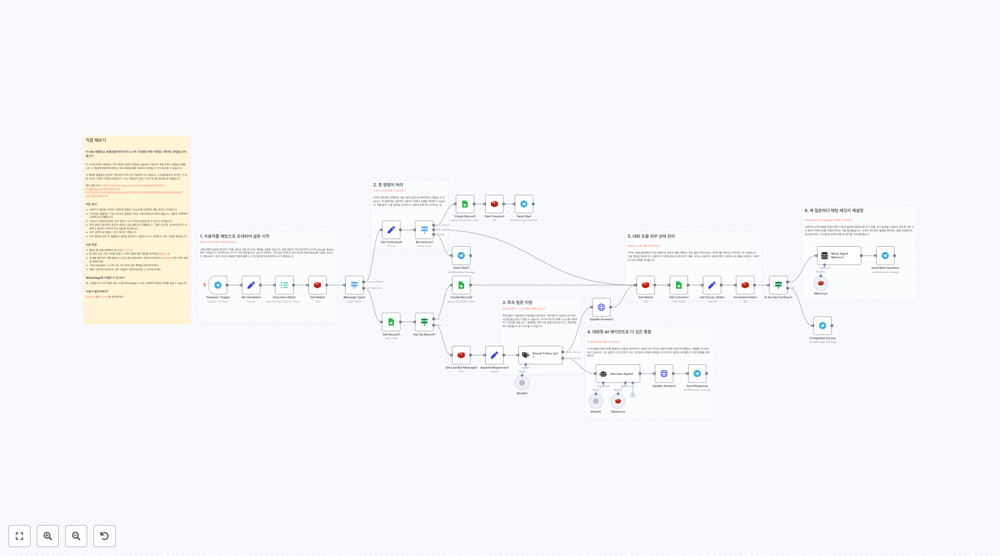](3115.json)
**Telegram 설문조사 봇**
Redis와 Google Sheets를 사용하여 대화형 설문조사를 실시하는 Telegram 봇입니다.

### 직원 관리 시스템
[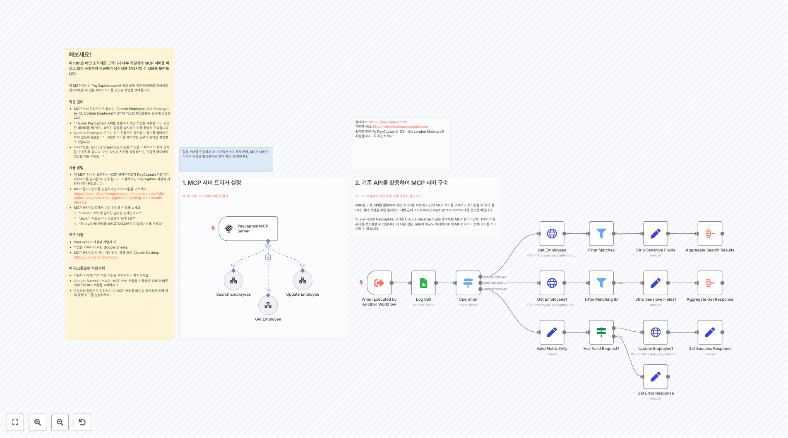](3638.json)
**MCP 서버 기반 직원 관리**
PayCaptain.com API를 활용한 MCP(Model Context Protocol) 서버 기반 HR 도구입니다.

## 📊 비즈니스 인텔리전스 및 분석

### 영업 및 마케팅 분석

**영업 통화 분석 시스템 - 마케팅**
영업 통화 트랜스크립트를 AI로 분석하여 마케팅 인사이트와 반복 주제를 추출하는 시스템입니다.

**영업 통화 분석 시스템 - 제품**
영업 통화를 분석하여 제품 피드백과 AI/ML 참조사항을 Notion에 구조화하여 저장합니다.

[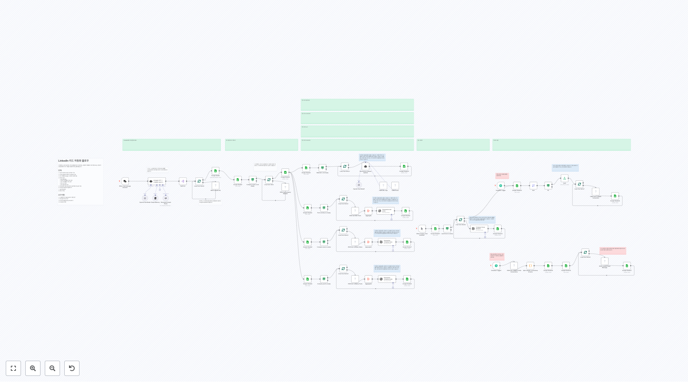](3490.json)
**LinkedIn Sales Navigator 리드 생성**
LinkedIn Sales Navigator를 활용하여 독일 Geländewagen 시장의 리드를 생성하는 시스템입니다.

### 미팅 및 커뮤니케이션
[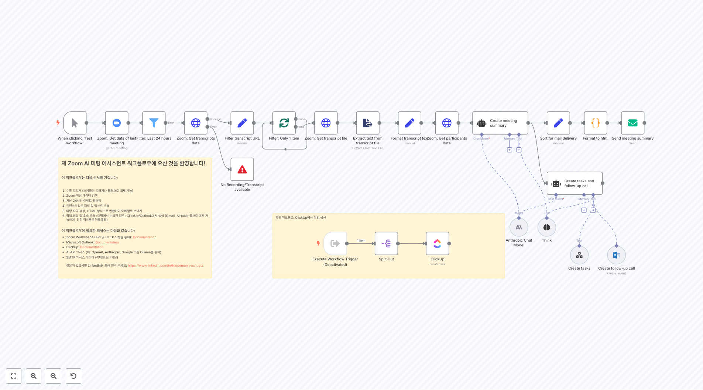](2800.json)
**Zoom AI 미팅 어시스턴트**
Zoom 회의를 자동으로 기록하고 AI로 요약하여 참가자들에게 이메일로 전송하는 시스템입니다.

## 🔍 AI 기반 지식 관리 및 검색

### 벡터 스토어 및 RAG 시스템

**Supabase 벡터 스토어 AI 채팅**
PDF 문서를 Supabase 벡터 스토어에 저장하고 AI 채팅을 통해 검색하는 RAG 시스템입니다.

[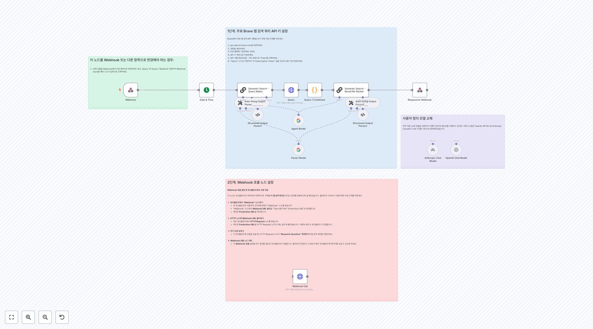](2643.json)
**지능형 웹 쿼리 및 의미 재순위**
Brave Search API를 사용하여 웹 검색을 수행하고 AI로 결과를 의미론적으로 재순위하는 시스템입니다.

## 🎨 콘텐츠 생성 및 관리

### 미디어 자동화
[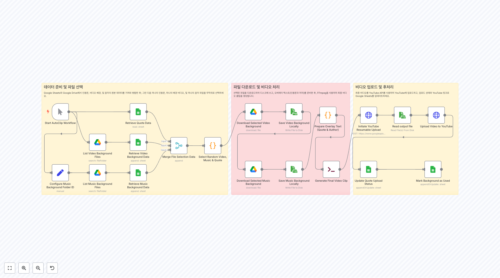](3328.json)
**YouTube 자동 클립 생성 및 업로드**
긴 비디오에서 자동으로 클립을 생성하고 YouTube에 업로드하는 콘텐츠 자동화 시스템입니다.

[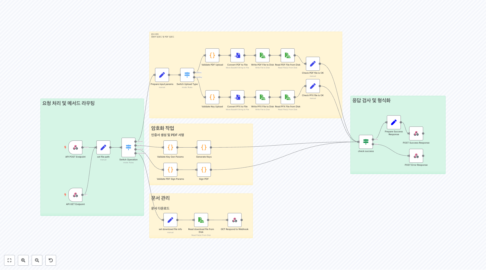](3119.json)
**PDF 디지털 서명 서비스**
Node.js 라이브러리를 사용하여 PDF 문서에 디지털 서명을 추가하는 기본 서비스입니다.

---

## 🛠️ 구현 가이드

### 핵심 기술 스택
- **AI/ML**: OpenAI GPT-4, Google Gemini, Groq, DeepSeek
- **데이터베이스**: MySQL, PostgreSQL, Supabase, Qdrant, Redis
- **클라우드 서비스**: Google Sheets, Google Drive, Microsoft Outlook
- **웹 스크래핑**: Bright Data, Firecrawl, Apify
- **통합 플랫폼**: Notion, Jira, GitHub, Slack, Telegram
- **이커머스**: WooCommerce
- **벡터 검색**: RAG, 임베딩, 의미론적 검색

### 설정 요구사항
1. **AI 서비스 API 키**: OpenAI, Google AI, Groq 등
2. **데이터베이스 연결**: MySQL, PostgreSQL, Supabase 설정
3. **클라우드 서비스 인증**: Google OAuth, Microsoft Graph API
4. **웹 스크래핑 서비스**: Bright Data, Firecrawl API 키
5. **프로젝트 관리 도구**: Notion, Jira 연동 설정

## 🔐 보안 고려사항

### 데이터 보호
- API 키 및 자격 증명의 안전한 저장
- 민감한 고객 데이터 암호화
- 데이터베이스 접근 권한 관리
- 웹 스크래핑 시 rate limiting 준수

### 개인정보 보호
- GDPR 및 CCPA 규정 준수
- 고객 동의 관리
- 데이터 수집 및 처리 투명성
- 개인 식별 정보(PII) 보호

## ⚡ 성능 최적화

### 확장성 전략
- 데이터베이스 인덱싱 최적화
- 벡터 검색 성능 튜닝
- AI API 호출 최적화
- 캐싱 전략 구현

### 모니터링 및 알림
- 워크플로우 실행 상태 추적
- 에러 발생 시 자동 알림
- 성능 메트릭 모니터링
- 비용 관리 및 최적화

## 🔗 주요 통합 서비스

### 프로젝트 관리
- **Notion**: 데이터베이스 관리 및 문서화
- **Jira**: 이슈 추적 및 프로젝트 관리
- **GitHub**: 소스 코드 관리 및 이슈 추적
- **AirTable**: 태스크 및 데이터 관리

### 커뮤니케이션
- **Slack**: 팀 협업 및 알림
- **Gmail**: 이메일 자동화
- **Telegram**: 봇 기반 상호작용
- **Zoom**: 회의 관리 및 분석

### 데이터 분석
- **Google Sheets**: 스프레드시트 기반 분석
- **MySQL/PostgreSQL**: 관계형 데이터베이스
- **Supabase**: 클라우드 데이터베이스
- **벡터 데이터베이스**: 의미론적 검색

## 📚 관련 자료

### 학습 리소스
- [n8n 공식 문서](https://docs.n8n.io/)
- [OpenAI API 가이드](https://platform.openai.com/docs)
- [RAG 구현 베스트 프랙티스](https://docs.n8n.io/integrations/builtin/cluster-nodes/root-nodes/n8n-nodes-langchain.vectorstoresupabase/)
- [웹 스크래핑 윤리 가이드](https://blog.apify.com/web-scraping-ethics/)

### 템플릿 및 예제
- [AI 워크플로우 템플릿](https://n8n.io/workflows/)
- [데이터베이스 연동 예제](https://docs.n8n.io/integrations/builtin/app-nodes/)
- [API 통합 가이드](https://docs.n8n.io/integrations/builtin/core-nodes/n8n-nodes-base.httprequest/)

## 🎯 사용 사례

### 제품 팀
- 사용자 피드백 자동 수집 및 분석
- 제품 로드맵 관리 및 추적
- 경쟁사 분석 자동화
- 고객 지원 티켓 분석

### 마케팅 팀
- 콘텐츠 자동 생성 및 배포
- 소셜 미디어 모니터링
- 리드 생성 및 관리
- 캠페인 성과 분석

### 엔지니어링 팀
- 기술 문서 자동화
- 코드 리뷰 프로세스 개선
- 이슈 추적 및 관리
- 배포 자동화

이 워크플로우들은 제품 개발 라이프사이클 전반에 걸쳐 효율성을 높이고 데이터 기반 의사결정을 지원하는 포괄적인 솔루션을 제공합니다.