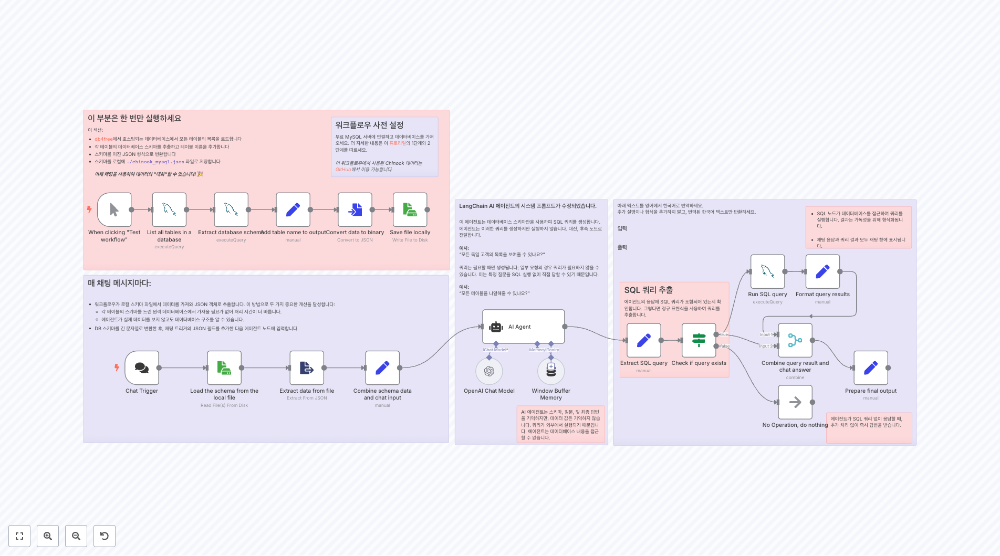
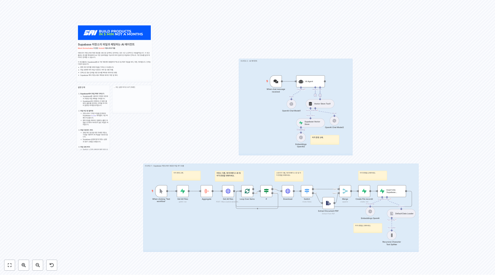
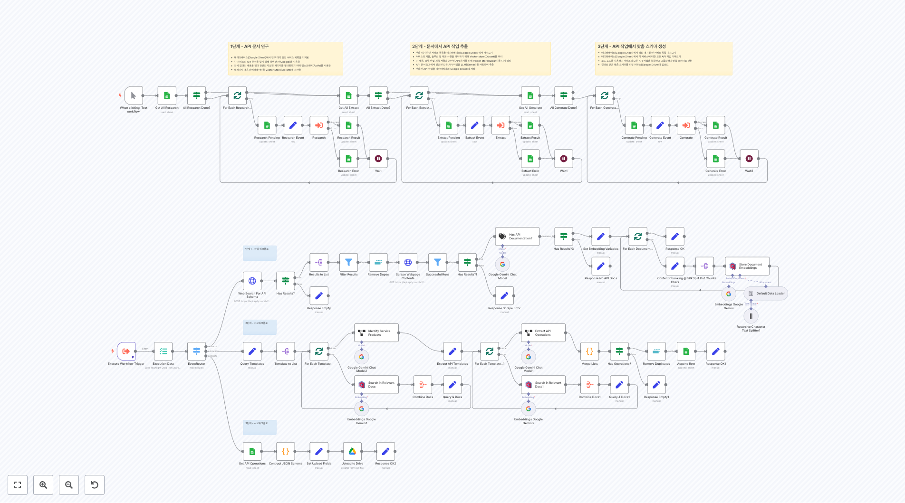
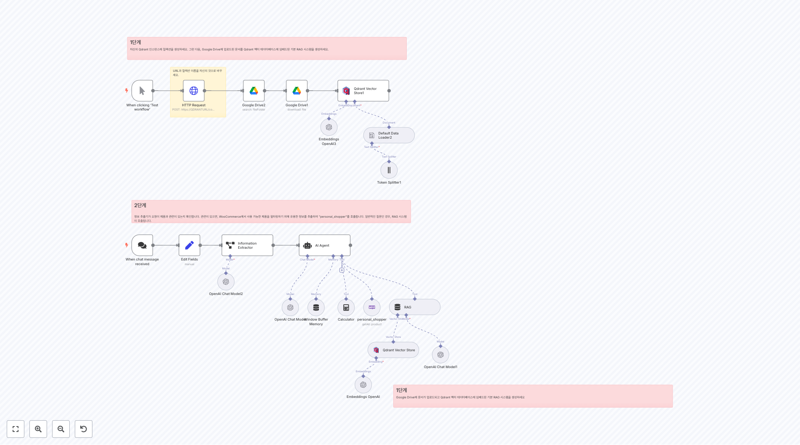
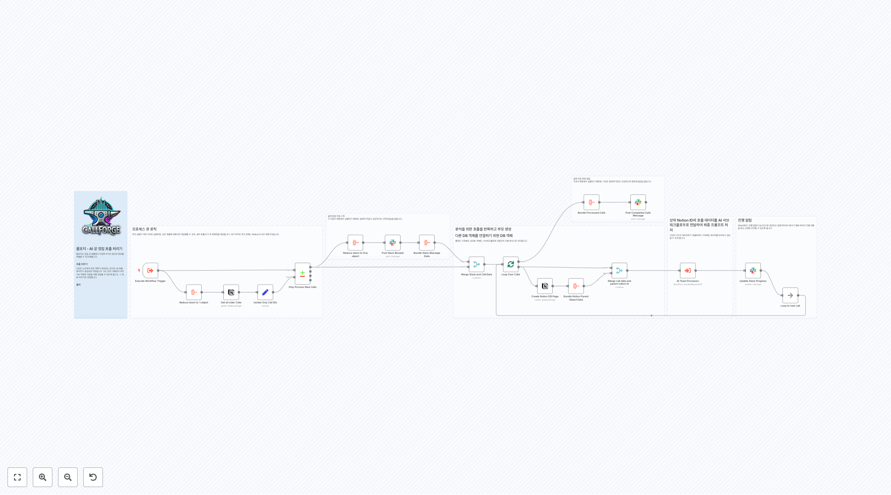

# 제품 워크플로우

이 폴더에는 product 관련 **55개의 워크플로우**가 포함되어 있습니다.

## 📋 워크플로우 목록

**워크플로우 1804**
IF 및 Switch GitHub에서 이슈에 대해 어떤 조치가 취해졌는지에 따라 다릅니다.

**워크플로우 1831**
IF 및 Switch 노드 이 조건부 노드들(IF 및 Switch)은 Notion의 CRUD 작업이 수행될지를 결정합니다.

**워크플로우 1996**
고객 피드백을 OpenAI에 감정 분석을 위해 보내기

**워크플로우 2087**
워크플로 설명: 1. **n8n Form Trigger:** - 폼이 제출될 때 워크플로를 시작하는 트리거 노드. - 폼 필드에는 Name, City, 그리고 Email이 포함됨. 2. **'submittedAt' 필드에서 Date와 Time 필드 추출:** - submittedAt 필드에서 Date와 Time을 추출하는 코드 노드. 3. **필드 형식 지...

**워크플로우 2212**
설정 1/ 자격 증명 추가 [Google 스프레드시트](https://docs.n8n.io/integrations/builtin/credentials/google/) 2/ Google 스프레드시트를 생성하여 데이터베이스로 사용하세요. 이 템플릿을 복사하세요: https://docs.google.com/spreadsheets/d/1sM66Rk10ZOhQKba...

**워크플로우 2272**
DROPCONTACT 250 배치 비동기적으로 1500/시간 요청 더블 클릭하여 나를 수정하세요. 가이드

**워크플로우 2274**
흐름은 GET HTTP 호출을 받을 때 시작됩니다.

**워크플로우 2328**
4. 이 도구는 캘린더 이벤트를 생성합니다 이 도구는 이벤트 세부 정보와 참석자 목록이 주어지면, 새로운 Google 캘린더 이벤트를 생성하고 참석자를 추가할 것입니다.

**워크플로우 2346**
2단계. 들어오는 메시지 버퍼링 [Redis 사용에 대해 자세히 알아보기](https://docs.n8n.io/integrations/builtin/app-nodes/n8n-nodes-base.redis) * 새로운 메시지가 목록에 캡처됩니다. * X초 후, 이 목록의 새로운 복사본을 가져옵니다. * 목록의 마지막 메시지가 들어오는 메시지와 동일하면, 지난...

**워크플로우 2408**
또한, 인가 URL의 끝에 &connection=github을 추가하면 사용자가 GitHub, Facebook 등을 통해 로그인할 수 있습니다.

## 📋 워크플로우 목록 (11-20)

**워크플로우 2415**
특정 Notion DB 스키마에 대한 새 워크플로 버전 생성 Notion 데이터베이스 URL을 입력하고, 이 템플릿에 기반하여 해당 URL에 대한 AI Assistant 챗봇 워크플로를 얻습니다: https://n8n.io/workflows/2413-notion-knowledge-base-ai-assistant/ Notion 프로젝트: https://www...

**워크플로우 2418**
시도해 보세요! 이 워크플로우는 이미지를 가져와 AI를 사용하여 캡션을 생성합니다. OpenAI 노드는 이미 한동안 이 작업을 할 수 있었지만, 이 워크플로우는 Google의 Gemini와 같은 다른 다중 모달 비전 모델을 사용하여 동일한 것을 달성하는 방법을 보여줍니다. 또한, 생성된 캡션을 이미지에 오버레이하기 위해 Edit Image 노드를 사용할 것...

**워크플로우 2420**
1. 사진 가져오기 및 검증 [Google Drive 사용에 대해 더 알아보기](https://docs.n8n.io/integrations/builtin/app-nodes/n8n-nodes-base.googledrive) 이번 데모에서, 5개의 서로 다른 초상화를 가져와 AI 비전 모델을 테스트하겠습니다. 편의를 위해 Google Drive를 사용할 테지만...

**워크플로우 2434**
여기에서 목적지 폴더를 설정하세요

**워크플로우 2473**
AI를 사용하여 SEO 시드 키워드 생성 이 흐름은 이상적인 고객 프로필을 기반으로 SEO 노력을 집중할 시드 키워드를 생성하기 위해 AI 노드를 사용합니다. **출력:** - 20개의 시드 키워드 목록 **전제 조건 / 종속성:** - 당신의 이상적인 고객 프로필(ICP)을 알고 있습니다. - AI API 계정(OpenAI 또는 Anthropic 권장)

**워크플로우 2490**
생성: 새로운 레코드를 생성합니다

**워크플로우 2504**
워크플로 1: 초기 임베딩 이 워크플로를 사용하여 WordPress 웹사이트 콘텐츠의 초기 임베딩을 생성하세요

**워크플로우 2508**
이 부분은 한 번만 실행하세요 이 섹션: * [db4free](https://db4free.net/signup.php)에서 호스팅되는 데이터베이스에서 모든 테이블의 목록을 로드합니다 * 각 테이블의 데이터베이스 스키마를 추출하고 테이블 이름을 추가합니다 * 스키마를 이진 JSON 형식으로 변환합니다 * 스키마를 로컬에 `./chinook_mysql.json...

**워크플로우 2517**
Google 분석을 A.I.에 보내고 결과를 baserow에 저장하세요 이 워크플로는 국가 조회수, 페이지 참여도 및 Google 검색 콘솔 결과를 확인합니다. 이번 주 데이터를 가져와서 지난 주 데이터와 비교합니다. [이 워크플로에 대해 더 읽을 수 있습니다](https://rumjahn.com/how-i-used-a-i-to-be-an-seo-exper...

**워크플로우 2547**
헤더의 API 키를 교체하세요, 2번째 시나리오의 웹훅을 사용하세요, 필요 시 설정을 변경하세요.

## 📋 워크플로우 목록 (21-30)

**워크플로우 2549**
Google Analytics 데이터를 집계하여 결과를 이메일로 보내기 이 워크플로는 국가 조회, 페이지 참여도 및 Google Search Console 결과를 확인합니다. 이번 주 데이터를 가져와서 지난 주 데이터와 비교합니다. [Keith Rumjahn에게 원본 워크플로에 대한 크레딧, 내가 수정했습니다.](https://rumjahn.com/how-...

**워크플로우 2566**
인터뷰 주제를 여기에서 설정하세요!

**워크플로우 2580**
1. AI를 사용한 문의 자격 확인 [텍스트 분류기에 대해 자세히 알아보기](https://docs.n8n.io/integrations/builtin/cluster-nodes/root-nodes/n8n-nodes-langchain.text-classifier/) n8n의 다중 폼을 사용하면 더 이상 길고 압도적인 폼을 만드는 데 갇혀 있지 않습니다. 대신,...

**워크플로우 2612**
Supabase의 비밀번호와 사용자 이름을 바꾸세요.

**워크플로우 2621**
저장소 이름, 데이터베이스 ID 및 자격 증명을 대체하세요.

**워크플로우 2643**
1단계. 무료 Brave 웹 검색 쿼리 API 키 설정 Brave에서 무료 웹 검색 API 계층을 얻기 위해 다음 단계를 따르세요: 1. api.search.brave.com을 방문하세요 2. 계정을 생성하세요 3. 무료 플랜에 가입하세요 (무료) 4. API 키 섹션으로 이동하세요 5. API 키를 생성하세요. 구독 유형으로 "Free"를 선택하세요. 6...

**워크플로우 2651**
... 또는 설정 비디오 보기 [10분]

**워크플로우 2658**
1단계 - API 문서 연구 - 데이터베이스(Google Sheet)에서 연구 대기 중인 서비스 목록을 가져옴 - 각 서비스의 API 문서를 찾기 위해 검색 엔진(Google)을 사용함 - 검색 결과의 내용을 읽어 관련되지 않은 페이지를 필터링하기 위해 웹스크래퍼(Apify)를 사용함 - 웹페이지 내용과 메타데이터를 Vector Store(Qdrant)에 ...

**워크플로우 2683**
Fireflies의 API 키를 교체하세요.

**워크플로우 2772**
동기화 유지 매핑을 업데이트하면, 다른 노드에서도 변경하세요!

## 📋 워크플로우 목록 (31-40)

**워크플로우 2784**
URL과 컬렉션 이름을 자신의 것으로 바꾸세요.

**워크플로우 2786**
이것들이 이 워크플로를 참조하도록 확인하세요, 플레이스홀더를 대체하세요.

**워크플로우 2792**
Trustpilot에 등록된 회사의 이름으로 변경하고, 스크랩할 최대 페이지 수

**워크플로우 2796**
 고객 찾기 이 워크플로의 이 부분은 고객 데이터베이스를 조회하여 고객이 발견되면 AI 에이전트에게 고객 세부 정보를 반환합니다. 발견되지 않으면 고객 세부 정보에 대해 NOT_FOUND를 반환합니다.

**워크플로우 2799**
이 **LLM 호출**은 웹사이트에 게시된 기사가 모니터링하고 싶은 **주제와 관심사**에 **관련이 있는지** **분류**하는 데 사용됩니다. 이 호출은 **RSS Read** 노드에서 가져온 **제목**과 **콘텐츠 스니펫**을 분석합니다. 이 템플릿에서 모니터링되는 기사는 **데이터와 AI**와 관련이 있습니다. 분류는 **두 카테고리**로 이루어지며...

**워크플로우 2800**
하위 워크플로: ClickUp에서 작업 생성

**워크플로우 2859**
👨‍🎤 설정 1. 자신의 **PostgreSQL** 및 **OpenAI** 자격 증명을 추가하세요. 2. **Chat** 버튼을 클릭하고 데이터베이스에 질문을 시작하세요. 3. 워크플로를 활성화하면 채팅을 공개적으로 사용할 수 있습니다.

**워크플로우 2978**
데이터 수집 지정된 Reddit 커뮤니티에서 최근 인기 게시물 가져옴 참여 지표와 키워드에 의해 콘텐츠 필터링

**워크플로우 2985**
출력

**워크플로우 3034**
프로세스 큐 로직 만약 실행이 어떤 이유로 실패하면, 남은 호출에 대해서만 재실행할 수 있어, API 호출의 더 큰 회복력을 제공합니다. 내가 마주친 주요 문제는 Notion의 속도 제한이었습니다.

## 📋 워크플로우 목록 (41-50)

**워크플로우 3035**
통화 데이터 수신 및 사용자 프롬프트 표준화 이 노드는 전달된 통화 데이터를 가져오고, 모든 3개의 AI 에이전트에 전달되는 단일 사용자 프롬프트를 생성합니다. 이로 인해 이름 발음 오류와 통합 데이터와 같은 것을 하나의 노드에서 설정할 수 있으며, 이 노드는 쉽게 업데이트될 수 있고 자동으로 3개의 AI 에이전트에 전송됩니다.

**워크플로우 3050**
AI에게 모든 항목을 다시 보내기 위해, 우리는 모든 것을 하나의 항목으로 집계하여 마무지해야 합니다. 그렇지 않으면, 한 번에 하나의 항목으로 응답할 것이고, AI는 도착하는 첫 번째 항목만 받을 것입니다.

**워크플로우 3079**
이것을 이름이 query_executer인 별도의 워크플로우에 배치하세요.

**워크플로우 3101**
주의: 거의 즉시 작동하지 않음 'Tools agent'와 'Gmail' 노드의 프롬프트를 원하는 대로 조정하여 에이전트의 행동을 올바른 방향으로 이끌어주세요

**워크플로우 3115**
1. 사용자를 채팅으로 초대하여 설문 시작 [채트 트리거에 대해 자세히 알아보기](https://docs.n8n.io/integrations/builtin/core-nodes/n8n-nodes-langchain.chattrigger/) 사용자에게 설문을 제시하기 위해 n8n의 내장 호스티드 채팅을 사용할 것입니다. 설문 질문은 미리 정의되어 있으며 Goog...

**워크플로우 3119**
암호화 작업 인증서 생성 및 PDF 서명

**워크플로우 3151**
1. RAG 친화적 문서 Tech Radar Gsheet를 GDoc으로 변환하세요. 각 행과 열의 데이터를 읽은 후, 간단한 단락 행으로 변환하여 벡터 데이터베이스로 쉽게 변환할 수 있도록 하세요. 이 변환을 위해 Apps Script를 선택적으로 사용할 수 있습니다.

**워크플로우 3328**
데이터 준비 및 파일 선택 Google Sheets와 Google Drive에서 인용문, 비디오 배경, 및 음악의 원본 데이터를 가져와 병합한 후; 그런 다음 하나의 인용문, 하나의 배경 비디오, 및 하나의 음악 파일을 무작위로 선택하세요.

**워크플로우 3490**
LinkedIn에서 리드를 찾으세요.

**워크플로우 3497**
입력 텍스트가 없습니다.

## 📋 워크플로우 목록 (51-55)

**워크플로우 3624**
======================================= 워크플로우 지원 ======================================= 질문이나 지원이 필요하신 경우, 다음으로 연락 주세요: Yaron@nofluff.online 여기에서 더 많은 팁과 튜토리얼을 탐색하세요: - YouTube: https://www.youtube.co...

**워크플로우 3638**
1. MCP 서버 트리거 설정 [ MCP 서버 트리거에 대해 더 읽기 ](https://docs.n8n.io/integrations/builtin/core-nodes/n8n-nodes-langchain.mcptrigger)

**워크플로우 3866**
노트 Amazon 웹 스크래핑을 Bright Data Web Scraper Product를 이용하여 처리합니다. **Bright Data를 설정하세요 -> Dataset Id, Request URL을 설정하고 Webhook Notification URL을 업데이트하세요** 참조 - https://brightdata.com/products/web-scrape...

**워크플로우 3934**
에픽 완료? 이 노드는 Jira에서 발생하는 모든 이슈 변경 시 트리거됩니다. 그러나 에픽 상태가 **완료**로 변경될 때만 자동화를 트리거합니다.

**워크플로우 3986**
1. 뉴스를 벡터 저장소에 저장 (매일 실행)

## 🔧 구현 가이드

### 워크플로우 사용 방법
1. 원하는 워크플로우의 JSON 링크를 클릭합니다.
2. n8n 인스턴스에서 'Import' 기능을 사용하여 워크플로우를 가져옵니다.
3. 필요한 자격 증명과 설정을 구성합니다.
4. 워크플로우를 테스트하고 필요에 따라 커스터마이즈합니다.

### 주의사항
- 각 워크플로우는 특정 서비스나 API의 자격 증명이 필요할 수 있습니다.
- 워크플로우를 실행하기 전에 모든 노드의 설정을 확인하세요.
- 테스트 환경에서 먼저 워크플로우를 검증한 후 프로덕션에 적용하세요.

---

💡 **총 55개의 워크플로우**가 이 카테고리에서 제공됩니다.
