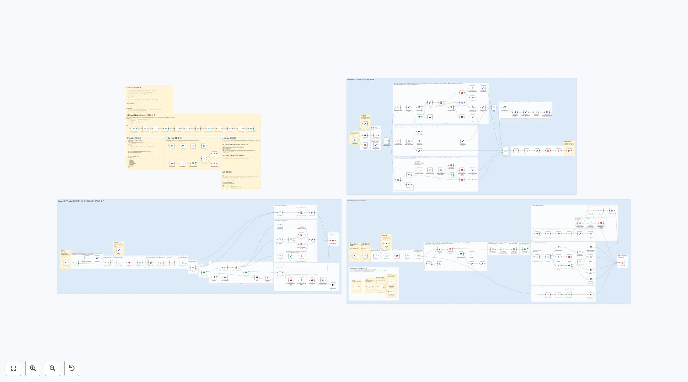
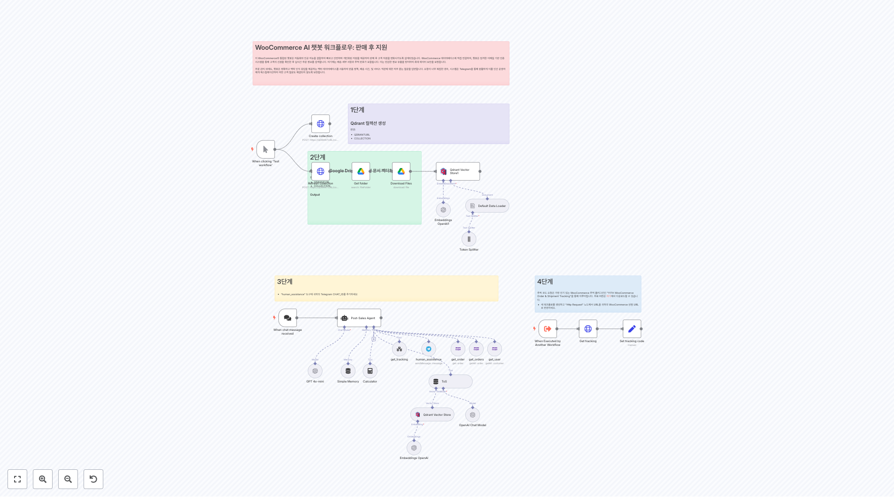

# 세일즈 워크플로우

이 폴더에는 sales 관련 **75개의 워크플로우**가 포함되어 있습니다.

## 📋 워크플로우 목록

[](https://raw.githubusercontent.com/n8nKOR/n8n-shared-workflow/refs/heads/main/workflows/n8nworkflows/sales/1930.json)
**워크플로우 1930**
이 템플릿을 사용하는 방법 이 템플릿은 하나의 서비스에서 다른 서비스로 데이터를 동기화하는 방법을 보여줍니다. 이 예제에서는 새로운 자격을 갖춘 리드를 Google Sheets 파일에 저장합니다. 템플릿을 테스트하는 방법은 다음과 같습니다: 1. 우리의 [Google Sheets](https://docs.google.com/spreadsheets/d/1gV...

[](https://raw.githubusercontent.com/n8nKOR/n8n-shared-workflow/refs/heads/main/workflows/n8nworkflows/sales/2076.json)
**워크플로우 2076**
읽기 이 워크플로우는 Crunchbase에서 최근 펀드레이징 이벤트를 스크래핑하여 Google Sheets에 추가합니다. 전체 가이드: https://lempire.notion.site/Get-recent-fundraising-in-Google-Sheets-dafbbda2635544b4925c4fb04abac8f5?pvs=74

[](https://raw.githubusercontent.com/n8nKOR/n8n-shared-workflow/refs/heads/main/workflows/n8nworkflows/sales/2079.json)
**워크플로우 2079**
Shopify 라인 위치 다중 위치 Shopify 계정의 경우, 이 그룹의 노드들은 각 주문 라인에 대한 활성 위치 ID를 가져옵니다.

[](https://raw.githubusercontent.com/n8nKOR/n8n-shared-workflow/refs/heads/main/workflows/n8nworkflows/sales/2107.json)
**워크플로우 2107**
- 다음 API를 이용했습니다: - [Prospeo.io LinkedIn 이메일 찾기 API](https://prospeo.io/api/linkedin-email-finder) - **이점:** - 이 API의 이점은 LinkedIn 사용자들의 이메일 주소를 효율적으로 찾는 방법을 제공하여, Google Sheets 또는 워크플로우에서 사용되는 다른 시스템...

[](https://raw.githubusercontent.com/n8nKOR/n8n-shared-workflow/refs/heads/main/workflows/n8nworkflows/sales/2110.json)
**워크플로우 2110**
최신 회사 뉴스 통화 전 이 워크플로는 매일 캘린더에 있는 모든 회의에 대해 회사의 최신 뉴스 목록을 보내드릴 것입니다. 이는 귀하의 리드와 회의 파트너에 대해 최신 정보를 유지하도록 도와줍니다.

[](https://raw.githubusercontent.com/n8nKOR/n8n-shared-workflow/refs/heads/main/workflows/n8nworkflows/sales/2112.json)
**워크플로우 2112**
마지막 연락 날짜가 알려지지 않은 모든 연락처 검색 1. n8n 문서를 사용하여 Oauth2 자격 증명 설정 https://docs.n8n.io/integrations/builtin/trigger-nodes/n8n-nodes-base.hubspottrigger/ 범위에 주의하세요. 범위는 n8n 문서에 정의된 대로 정확히 해야 합니다. 출력

[](https://raw.githubusercontent.com/n8nKOR/n8n-shared-workflow/refs/heads/main/workflows/n8nworkflows/sales/2116.json)
**워크플로우 2116**
👨‍🎤 설정 1. 자신의 **Hunter**, **Clearbit** 및 **Hubspot** 자격 증명을 추가하세요 2. Test Workflow 버튼을 클릭하세요, 이메일을 입력하고 Hubspot을 확인하세요 3. 워크플로를 활성화하고, 폼 트리거 프로덕션 URL을 사용하여 영리하게 리드를 수집하세요

[](https://raw.githubusercontent.com/n8nKOR/n8n-shared-workflow/refs/heads/main/workflows/n8nworkflows/sales/2122.json)
**워크플로우 2122**
👨‍🎤 설정 1. 자신의 **MadKudu**, **Hunter**, 및 **Gmail** 자격 증명을 추가하세요 2. 자신의 **HubSpot** OAuth2 자격 증명을 [n8n 문서](https://docs.n8n.io/integrations/builtin/trigger-nodes/n8n-nodes-base.hubspottrigger/)를 사용하여 설...

[](https://raw.githubusercontent.com/n8nKOR/n8n-shared-workflow/refs/heads/main/workflows/n8nworkflows/sales/2125.json)
**워크플로우 2125**
1️⃣ [RapidAPI](https://rapidapi.com)에 등록하고 다음 두 API를 구독하세요: - [Fresh LinkedIn Profile Data](https://rapidapi.com/freshdata-freshdata-default/api/fresh-linkedin-profile-data) - [Twitter](https://rapida...

[](https://raw.githubusercontent.com/n8nKOR/n8n-shared-workflow/refs/heads/main/workflows/n8nworkflows/sales/2134.json)
**워크플로우 2134**
웹사이트에서 이메일을 API를 사용하여 스크래핑

## 📋 워크플로우 목록 (11-20)

[](https://raw.githubusercontent.com/n8nKOR/n8n-shared-workflow/refs/heads/main/workflows/n8nworkflows/sales/2137.json)
**워크플로우 2137**
후속 조치가 필요한 경우: - 스레드의 모든 메시지가 자동화된 (아직 아무도 답변하지 않음) - 다음 메시지를 보내기 위한 충분한 시간이 경과함

[](https://raw.githubusercontent.com/n8nKOR/n8n-shared-workflow/refs/heads/main/workflows/n8nworkflows/sales/2161.json)
**워크플로우 2161**
WooCommerce 사용자 ID 찾기 사용자 ID는 과거 주문을 조회하기 위해 필요합니다.

[](https://raw.githubusercontent.com/n8nKOR/n8n-shared-workflow/refs/heads/main/workflows/n8nworkflows/sales/2163.json)
**워크플로우 2163**
1. Google Sheet 문서 만들기 * 이 템플릿은 Google Forms에 연결된 Google Sheet 문서를 사용하지만, 독립된 Sheet 문서도 작동합니다 * 초기 트리거를 필요에 맞게 조정하세요: 새 항목을 주기적으로 확인하거나 수동 트리거를 추가하세요 [Google Sheet 템플릿 링크](https://docs.google.com/spre...

[](https://raw.githubusercontent.com/n8nKOR/n8n-shared-workflow/refs/heads/main/workflows/n8nworkflows/sales/2271.json)
**워크플로우 2271**
이메일을 받을 때

[](https://raw.githubusercontent.com/n8nKOR/n8n-shared-workflow/refs/heads/main/workflows/n8nworkflows/sales/2272.json)
**워크플로우 2272**
DROPCONTACT 250 배치 비동기적으로 1500/시간 요청 더블 클릭하여 나를 수정하세요. 가이드

[](https://raw.githubusercontent.com/n8nKOR/n8n-shared-workflow/refs/heads/main/workflows/n8nworkflows/sales/2273.json)
**워크플로우 2273**
매일 같은 시간에 흐름을 시작하세요

[](https://raw.githubusercontent.com/n8nKOR/n8n-shared-workflow/refs/heads/main/workflows/n8nworkflows/sales/2275.json)
**워크플로우 2275**
Microsoft Azure 자격 증명을 Microsoft Graph 권한과 함께 설정해야 합니다.

[](https://raw.githubusercontent.com/n8nKOR/n8n-shared-workflow/refs/heads/main/workflows/n8nworkflows/sales/2324.json)
**워크플로우 2324**
읽음 이 워크플로는 AI를 사용하여 웹으로 계정 조사를 할 수 있습니다. 첨단 AI 모듈에는 2가지 기능이 있습니다: - SerpAPI를 사용하여 Google 검색 - 서브-워크플로를 사용하여 웹사이트 방문 및 내용 가져오기 비구조화된 입력(예: 도메인 또는 회사 이름)으로부터. 다음 속성을 반환합니다: - 도메인 - 회사 LinkedIn URL - 가장 ...

[](https://raw.githubusercontent.com/n8nKOR/n8n-shared-workflow/refs/heads/main/workflows/n8nworkflows/sales/2325.json)
**워크플로우 2325**
Odoo 판매 모듈용 ERP 챗봇 설정 단계: * Odoo 자격 증명 구성 * OpenAI 자격 증명 구성 * Chat Trigger 노드에서 "채팅을 공개적으로 사용할 수 있게 함" 토글.

[](https://raw.githubusercontent.com/n8nKOR/n8n-shared-workflow/refs/heads/main/workflows/n8nworkflows/sales/2328.json)
**워크플로우 2328**
4. 이 도구는 캘린더 이벤트를 생성합니다 이 도구는 이벤트 세부 정보와 참석자 목록이 주어지면, 새로운 Google 캘린더 이벤트를 생성하고 참석자를 추가할 것입니다.

## 📋 워크플로우 목록 (21-30)

[](https://raw.githubusercontent.com/n8nKOR/n8n-shared-workflow/refs/heads/main/workflows/n8nworkflows/sales/2336.json)
**워크플로우 2336**
이메일을 요약하여 Odoo의 판매 기회에 노트로 저장 설정 단계: * Google Cloud 자격 증명을 Gmail 액세스로 구성 * OpenAI 자격 증명을 구성 * Odoo 자격 증명을 구성

[](https://raw.githubusercontent.com/n8nKOR/n8n-shared-workflow/refs/heads/main/workflows/n8nworkflows/sales/2342.json)
**워크플로우 2342**
6단계. Airtable에서 열린 문의를 필터링 💡후속 후보 기준 * 예정된 약속 없음 * 중지 요청 없음 * 지난 3일 동안 이전 후속 없음 * 후속이 3회 미만

[](https://raw.githubusercontent.com/n8nKOR/n8n-shared-workflow/refs/heads/main/workflows/n8nworkflows/sales/2373.json)
**워크플로우 2373**
1단계. 새롭게 시작하기 이 데모를 위해, 선택된 회사의 Qdrant 벡터 저장소에 있는 기존 레코드를 모두 삭제하겠습니다. 이를 Qdrant의 delete points API를 사용하여 수행합니다.

[](https://raw.githubusercontent.com/n8nKOR/n8n-shared-workflow/refs/heads/main/workflows/n8nworkflows/sales/2465.json)
**워크플로우 2465**
1. 제품 브로슈어 PDF 다운로드 [HTTP Request Tool에 대해 자세히 읽기](https://docs.n8n.io/integrations/builtin/core-nodes/n8n-nodes-base.httprequest) 마케팅 PDF 문서를 가져와 벡터 스토어를 구축하세요. 이는 Sales AI Agent의 지식베이스로 사용됩니다. 이 데모를...

[](https://raw.githubusercontent.com/n8nKOR/n8n-shared-workflow/refs/heads/main/workflows/n8nworkflows/sales/2547.json)
**워크플로우 2547**
헤더의 API 키를 교체하세요, 2번째 시나리오의 웹훅을 사용하세요, 필요 시 설정을 변경하세요.

[](https://raw.githubusercontent.com/n8nKOR/n8n-shared-workflow/refs/heads/main/workflows/n8nworkflows/sales/2567.json)
**워크플로우 2567**
🛠 설정 1. "Run workflow" 수동 트리거 노드에서 쿼리 목록을 설정하세요. 쿼리를 ChatGPT로 생성하는 방법에 대한 [비디오](https://youtu.be/HaiO-UeiKBA)를 보세요. 3. **Google Sheets 노드**에서 데이터를 채울 시트를 선택하세요. 4. 워크플로를 실행하고 Google Sheets 문서에 리드를 가져오...

[](https://raw.githubusercontent.com/n8nKOR/n8n-shared-workflow/refs/heads/main/workflows/n8nworkflows/sales/2580.json)
**워크플로우 2580**
1. AI를 사용한 문의 자격 확인 [텍스트 분류기에 대해 자세히 알아보기](https://docs.n8n.io/integrations/builtin/cluster-nodes/root-nodes/n8n-nodes-langchain.text-classifier/) n8n의 다중 폼을 사용하면 더 이상 길고 압도적인 폼을 만드는 데 갇혀 있지 않습니다. 대신,...

[](https://raw.githubusercontent.com/n8nKOR/n8n-shared-workflow/refs/heads/main/workflows/n8nworkflows/sales/2581.json)
**워크플로우 2581**
1. n8n Forms를 사용한 쉬운 리드 캡처 [Form Triggers에 대해 자세히 알아보기](https://docs.n8n.io/integrations/builtin/core-nodes/n8n-nodes-base.formtrigger) 이전에 n8n 폼 경험은 꽤 제한적이었는데, 단 하나의 폼 페이지만 제공되었기 때문입니다. 이제 여러 페이지 폼을 ...

[](https://raw.githubusercontent.com/n8nKOR/n8n-shared-workflow/refs/heads/main/workflows/n8nworkflows/sales/2582.json)
**워크플로우 2582**
1. 주기적으로 다가오는 회의를 검색 [스케줄드 트리거에 대해 읽기](https://docs.n8n.io/integrations/builtin/core-nodes/n8n-nodes-base.scheduletrigger) 스케줄드 트리거 노드를 사용하여 우리 어시스턴트를 트리거하여 다가오는 회의에 대해 알리게 하자. 여기서, 우리는 그것을 1시간 간격으로 설...

[](https://raw.githubusercontent.com/n8nKOR/n8n-shared-workflow/refs/heads/main/workflows/n8nworkflows/sales/2605.json)
**워크플로우 2605**
AlexK1919 

[](https://raw.githubusercontent.com/n8nKOR/n8n-shared-workflow/refs/heads/main/workflows/n8nworkflows/sales/2629.json)
**워크플로우 2629**
자신만의 Amazon 키워드 도구를 n8n으로 만드는 방법 (무료이고 코딩 없이) 이 워크플로는 Amazon FBA 비즈니스에 대한 Amazon 키워드를 제공합니다. [💡 이 워크플로에 대해 더 읽을 수 있습니다](https://rumjahn.com/how-to-build-your-own-amazon-keywords-tool-with-n8n-for-free...

[](https://raw.githubusercontent.com/n8nKOR/n8n-shared-workflow/refs/heads/main/workflows/n8nworkflows/sales/2643.json)
**워크플로우 2643**
1단계. 무료 Brave 웹 검색 쿼리 API 키 설정 Brave에서 무료 웹 검색 API 계층을 얻기 위해 다음 단계를 따르세요: 1. api.search.brave.com을 방문하세요 2. 계정을 생성하세요 3. 무료 플랜에 가입하세요 (무료) 4. API 키 섹션으로 이동하세요 5. API 키를 생성하세요. 구독 유형으로 "Free"를 선택하세요. 6...

[](https://raw.githubusercontent.com/n8nKOR/n8n-shared-workflow/refs/heads/main/workflows/n8nworkflows/sales/2651.json)
**워크플로우 2651**
... 또는 설정 비디오 보기 [10분]

[](https://raw.githubusercontent.com/n8nKOR/n8n-shared-workflow/refs/heads/main/workflows/n8nworkflows/sales/2772.json)
**워크플로우 2772**
동기화 유지 매핑을 업데이트하면, 다른 노드에서도 변경하세요!

[](https://raw.githubusercontent.com/n8nKOR/n8n-shared-workflow/refs/heads/main/workflows/n8nworkflows/sales/2784.json)
**워크플로우 2784**
URL과 컬렉션 이름을 자신의 것으로 바꾸세요.

[](https://raw.githubusercontent.com/n8nKOR/n8n-shared-workflow/refs/heads/main/workflows/n8nworkflows/sales/2799.json)
**워크플로우 2799**
이 **LLM 호출**은 웹사이트에 게시된 기사가 모니터링하고 싶은 **주제와 관심사**에 **관련이 있는지** **분류**하는 데 사용됩니다. 이 호출은 **RSS Read** 노드에서 가져온 **제목**과 **콘텐츠 스니펫**을 분석합니다. 이 템플릿에서 모니터링되는 기사는 **데이터와 AI**와 관련이 있습니다. 분류는 **두 카테고리**로 이루어지며...

[](https://raw.githubusercontent.com/n8nKOR/n8n-shared-workflow/refs/heads/main/workflows/n8nworkflows/sales/2800.json)
**워크플로우 2800**
하위 워크플로: ClickUp에서 작업 생성

[](https://raw.githubusercontent.com/n8nKOR/n8n-shared-workflow/refs/heads/main/workflows/n8nworkflows/sales/2808.json)
**워크플로우 2808**
Google 시트를 생성하세요. 'linkedin_url'이라는 이름의 단 하나의 열을 만들고, 풍부화하고 싶은 프로필로 채우세요.

[](https://raw.githubusercontent.com/n8nKOR/n8n-shared-workflow/refs/heads/main/workflows/n8nworkflows/sales/2809.json)
**워크플로우 2809**
마이크로소프트 아웃룩 AI 이메일 어시스턴트

[](https://raw.githubusercontent.com/n8nKOR/n8n-shared-workflow/refs/heads/main/workflows/n8nworkflows/sales/2851.json)
**워크플로우 2851**
중요한 사항 이 매우 간단한 워크플로는 전자상거래 비즈니스나 고객 지원 팀이 연락 양식 제출 처리를 자동화하고 간소화하기 위해 이상적입니다. - 웹훅을 통해 CF7 for Wordpress와 같은 외부 양식을 연결하는 것이 가능합니다. - 상대 노드를 사용하여 (Gmail, Outlook 등) 다른 공급자를 통해 이메일을 보내는 것이 가능합니다. - 다른 ...

## 📋 워크플로우 목록 (41-50)

[](https://raw.githubusercontent.com/n8nKOR/n8n-shared-workflow/refs/heads/main/workflows/n8nworkflows/sales/2890.json)
**워크플로우 2890**
1단계 이와 같이 Google 스프레드시트를 생성하세요 (COUPON 열에만 채우세요) [] 이것은 [이 워크플로우](https://docs.google.com/spreadsheets/d/1lnRZodxZSOA0QSuzkAb7ZJcfFfNXpX7NcxMdckMTN90/e...

[](https://raw.githubusercontent.com/n8nKOR/n8n-shared-workflow/refs/heads/main/workflows/n8nworkflows/sales/2963.json)
**워크플로우 2963**
아직 메타타이틀 또는 메타디스크립션을 가지고 있지 않은 제품 ID를 가져오세요.

[](https://raw.githubusercontent.com/n8nKOR/n8n-shared-workflow/refs/heads/main/workflows/n8nworkflows/sales/3034.json)
**워크플로우 3034**
프로세스 큐 로직 만약 실행이 어떤 이유로 실패하면, 남은 호출에 대해서만 재실행할 수 있어, API 호출의 더 큰 회복력을 제공합니다. 내가 마주친 주요 문제는 Notion의 속도 제한이었습니다.

[](https://raw.githubusercontent.com/n8nKOR/n8n-shared-workflow/refs/heads/main/workflows/n8nworkflows/sales/3035.json)
**워크플로우 3035**
통화 데이터 수신 및 사용자 프롬프트 표준화 이 노드는 전달된 통화 데이터를 가져오고, 모든 3개의 AI 에이전트에 전달되는 단일 사용자 프롬프트를 생성합니다. 이로 인해 이름 발음 오류와 통합 데이터와 같은 것을 하나의 노드에서 설정할 수 있으며, 이 노드는 쉽게 업데이트될 수 있고 자동으로 3개의 AI 에이전트에 전송됩니다.

[](https://raw.githubusercontent.com/n8nKOR/n8n-shared-workflow/refs/heads/main/workflows/n8nworkflows/sales/3050.json)
**워크플로우 3050**
AI에게 모든 항목을 다시 보내기 위해, 우리는 모든 것을 하나의 항목으로 집계하여 마무지해야 합니다. 그렇지 않으면, 한 번에 하나의 항목으로 응답할 것이고, AI는 도착하는 첫 번째 항목만 받을 것입니다.

[](https://raw.githubusercontent.com/n8nKOR/n8n-shared-workflow/refs/heads/main/workflows/n8nworkflows/sales/3119.json)
**워크플로우 3119**
암호화 작업 인증서 생성 및 PDF 서명

[](https://raw.githubusercontent.com/n8nKOR/n8n-shared-workflow/refs/heads/main/workflows/n8nworkflows/sales/3329.json)
**워크플로우 3329**
1단계 Qdrant 컬렉션 생성 변경: - QDRANTURL - COLLECTION

[](https://raw.githubusercontent.com/n8nKOR/n8n-shared-workflow/refs/heads/main/workflows/n8nworkflows/sales/3342.json)
**워크플로우 3342**
Output (Translated from the provided empty input)

[](https://raw.githubusercontent.com/n8nKOR/n8n-shared-workflow/refs/heads/main/workflows/n8nworkflows/sales/3350.json)
**워크플로우 3350**
1. 수신 메시지에 대한 상호작용 상태 확인 [텔레그램 트리거에 대해 자세히 알아보기](https://docs.n8n.io/integrations/builtin/trigger-nodes/n8n-nodes-base.telegramtrigger/) 이것은 상태 기반 에이전트의 예입니다 - 일반적으로 유한 상태 기계로 알려진 기술입니다. 데이터 수집이나 단계를 ...

[](https://raw.githubusercontent.com/n8nKOR/n8n-shared-workflow/refs/heads/main/workflows/n8nworkflows/sales/3435.json)
**워크플로우 3435**
리드 생성 수초 만에 수천 개의 풍부한 리드를 얻으세요.

## 📋 워크플로우 목록 (51-60)

[](https://raw.githubusercontent.com/n8nKOR/n8n-shared-workflow/refs/heads/main/workflows/n8nworkflows/sales/3443.json)
**워크플로우 3443**
AI 기반 리드 생성 워크플로우 이 워크플로우는 AI 에이전트를 사용하여 Google Maps 및 관련 웹사이트에서 비즈니스 데이터를 추출합니다. 종속성 - **OpenAI API** - **Google Sheets API** - **Apify Actors**: Google Maps Scraper - **Apify Actors**: Website Conte...

[](https://raw.githubusercontent.com/n8nKOR/n8n-shared-workflow/refs/heads/main/workflows/n8nworkflows/sales/3490.json)
**워크플로우 3490**
LinkedIn에서 리드를 찾으세요.

[](https://raw.githubusercontent.com/n8nKOR/n8n-shared-workflow/refs/heads/main/workflows/n8nworkflows/sales/3510.json)
**워크플로우 3510**
1단계 - WordPress에 Yoast SEO 플러그인 설치 - 이 코드를 function.php 파일에 추가 ``` function abilita_yoast_meta_api() { $meta_keys = ['_yoast_wpseo_title', '_yoast_wpseo_metadesc']; foreach ($meta_keys as $meta_key) {...

[](https://raw.githubusercontent.com/n8nKOR/n8n-shared-workflow/refs/heads/main/workflows/n8nworkflows/sales/3580.json)
**워크플로우 3580**
LinkedIn 작업 데이터 스크래퍼를 Google Sheets로 LinkedIn에서 Bright Data를 통해 실시간 작업 게시물을 스크래핑하고, 이를 정리한 후 Google Sheets로 보내기. 사용 목적: ✅ 작업 수색 — 신선하고 필터링된 역할 ✅ 판매 잠재 고객 탐색 — 채용 중인 회사 찾기 (즉, 성장 중인 회사) ⚙️ 사용된 도구 n8n 노...

[](https://raw.githubusercontent.com/n8nKOR/n8n-shared-workflow/refs/heads/main/workflows/n8nworkflows/sales/3593.json)
**워크플로우 3593**
🔍 워크플로 목표 자동으로 키워드(예: 뉴욕 최고의 레스토랑)를 기반으로 Dumpling AI를 사용하여 Google Maps를 검색하고, 결과를 추출하여 구조화된 Google Sheet에 기록합니다. 🚀 워크플로 단계 1. **수동 트리거** - 테스트 시 수동으로 워크플로를 시작합니다. 2. **Dumpling AI Google 검색** - 쿼리에 따라...

[](https://raw.githubusercontent.com/n8nKOR/n8n-shared-workflow/refs/heads/main/workflows/n8nworkflows/sales/3616.json)
**워크플로우 3616**
이 메시지는 번역할 영어 텍스트를 포함하지 않습니다.

[](https://raw.githubusercontent.com/n8nKOR/n8n-shared-workflow/refs/heads/main/workflows/n8nworkflows/sales/3652.json)
**워크플로우 3652**
아래 텍스트를 영어에서 한국어로 번역하세요. 추가 설명이나 형식을 추가하지 말고, 번역된 한국어 텍스트만 반환하세요. 입력 출력

[](https://raw.githubusercontent.com/n8nKOR/n8n-shared-workflow/refs/heads/main/workflows/n8nworkflows/sales/3666.json)
**워크플로우 3666**
부동산 리드 자동화 워크플로우 이 워크플로우는 구성된 기준에 따라 잠재적인 부동산 리드를 자동으로 검색하고, 스킵 트레이싱을 통해 소유자 연락처 정보를 얻으며, 리드를 CRM에 푸시합니다. 수동으로 실행하거나 매일 실행하도록 예약할 수 있습니다. 단계: 부동산 검색 → 결과 필터링 → 스킵 트레이싱 → 데이터 형식화 → 내보내기 (Excel & CRM)

[](https://raw.githubusercontent.com/n8nKOR/n8n-shared-workflow/refs/heads/main/workflows/n8nworkflows/sales/3717.json)
**워크플로우 3717**
LinkedIn 회사 검색 이 섹션은 워크플로를 시작하고 Ghost Genius API를 사용하여 LinkedIn에서 대상 회사를 검색합니다. 검색을 키워드, 회사 규모, 위치, 산업, 또는 회사가 활성 채용 공고를 가지고 있는지 여부로 필터링하고 세밀하게 조정할 수 있습니다. 이를 위해 "Set Variables" 노드를 사용하세요. 검색당 최대 1000...

[](https://raw.githubusercontent.com/n8nKOR/n8n-shared-workflow/refs/heads/main/workflows/n8nworkflows/sales/3791.json)
**워크플로우 3791**
링크드인 사용자 이름 추출

## 📋 워크플로우 목록 (61-70)

[](https://raw.githubusercontent.com/n8nKOR/n8n-shared-workflow/refs/heads/main/workflows/n8nworkflows/sales/3904.json)
**워크플로우 3904**
LinkedIn 회사 검색 이 섹션은 워크플로를 시작하고 Ghost Genius API를 사용하여 LinkedIn에서 대상 회사를 검색합니다. 검색을 키워드, 회사 규모, 위치, 산업, 또는 회사가 활성 채용 공고를 가지고 있는지 여부를 사용하여 필터링하고 세밀화할 수 있습니다. "Set Variables" 노드를 이를 위해 사용하세요(이 노드는 AI Le...

[](https://raw.githubusercontent.com/n8nKOR/n8n-shared-workflow/refs/heads/main/workflows/n8nworkflows/sales/3912.json)
**워크플로우 3912**
아웃바운드 리드 자격화 콜 워크플로

[](https://raw.githubusercontent.com/n8nKOR/n8n-shared-workflow/refs/heads/main/workflows/n8nworkflows/sales/3930.json)
**워크플로우 3930**
1. 새 이메일 수신 새 이메일이 도착하면 우리의 워크플로가 트리거됩니다. 여기서 IF 노드를 사용하여 INBOX로 들어오는 이메일에 대해서만 자동화를 실행하도록 하며, SENT 폴더의 이메일은 제외합니다.

[](https://raw.githubusercontent.com/n8nKOR/n8n-shared-workflow/refs/heads/main/workflows/n8nworkflows/sales/3935.json)
**워크플로우 3935**
입력 없음으로 인해 번역할 텍스트가 없습니다.

[](https://raw.githubusercontent.com/n8nKOR/n8n-shared-workflow/refs/heads/main/workflows/n8nworkflows/sales/3942.json)
**워크플로우 3942**
JSON 파서 1. 텍스트 데이터를 최종 주문처럼 항목 이름, 수량, 그리고 테이블 이름을 JSON으로 변환합니다. 2. 데이터에 위의 내용이 포함되지 않으면 null을 반환합니다.

[](https://raw.githubusercontent.com/n8nKOR/n8n-shared-workflow/refs/heads/main/workflows/n8nworkflows/sales/4010.json)
**워크플로우 4010**
아웃풋

[](https://raw.githubusercontent.com/n8nKOR/n8n-shared-workflow/refs/heads/main/workflows/n8nworkflows/sales/4083.json)
**워크플로우 4083**
한국어 번역 결과가 없습니다. 입력 텍스트가 제공되지 않았습니다.

[](https://raw.githubusercontent.com/n8nKOR/n8n-shared-workflow/refs/heads/main/workflows/n8nworkflows/sales/4295.json)
**워크플로우 4295**
Apify를 사용한 Google Sheets로의 자동화된 비즈니스 리드 스크래퍼 **목적:** Apify를 사용하여 비즈니스 리드를 스크래핑하고, 데이터를 정리하며, Google Sheets로 내보내는 것을 자동화합니다. **작업 흐름 단계:** 1. **수동 트리거**: 작업 흐름을 수동으로 시작합니다. 2. **API 자격 증명 설정**: 자신의 `AP...

[](https://raw.githubusercontent.com/n8nKOR/n8n-shared-workflow/refs/heads/main/workflows/n8nworkflows/sales/4359.json)
**워크플로우 4359**
구글 슬라이드 AI 제안서 생성기 **이 흐름은 AI와 무료 구글 슬라이드 솔루션을 사용하여 제안서를 생성합니다.**

[](https://raw.githubusercontent.com/n8nKOR/n8n-shared-workflow/refs/heads/main/workflows/n8nworkflows/sales/4368.json)
**워크플로우 4368**
Output (There's no English text provided in the input to translate, so no translation is possible.)

## 📋 워크플로우 목록 (71-75)

[](https://raw.githubusercontent.com/n8nKOR/n8n-shared-workflow/refs/heads/main/workflows/n8nworkflows/sales/4484.json)
**워크플로우 4484**
전문가 1 여기에 InfraNodus 그래프를 HTTP 노드를 통해 추가하세요. 그 이름을 `body.name` 필드에 사용하세요. 도구의 설명에서 이 전문가가 하는 일을 설명하세요. InfraNodus > Graph > Project Notes에서 자동 생성된 Graph RAG 요약을 사용할 수 있습니다. 
**워크플로우 4508**
Output 에는 번역된 텍스트만 포함되어야 합니다. 그러나 입력 텍스트가 제공되지 않았으므로, 번역할 내용이 없습니다. 이는 시스템 지시에 위배되므로, 빈 응답을 반환합니다.

[](https://raw.githubusercontent.com/n8nKOR/n8n-shared-workflow/refs/heads/main/workflows/n8nworkflows/sales/4573.json)
**워크플로우 4573**
🚀 초기화 단계 - 매 30분마다 트리거됨 - [구글 시트](https://docs.google.com/spreadsheets/d/1DHezdcetT0c3Ie1xB3z3jDc5WElsLN87K4J9EQDef9g/edit?usp=sharing)에서 처리되지 않은 레코드를 읽음 - 레스토랑을 위한 구글 플레이스 스크래퍼를 시작 - 완료될 때까지 기다림

[](https://raw.githubusercontent.com/n8nKOR/n8n-shared-workflow/refs/heads/main/workflows/n8nworkflows/sales/4589.json)
**워크플로우 4589**
Google Sheets에서 'status' 열을 기준으로 업데이트된 레코드를 주시하세요. 풍부화를 다시 시도하려면 status 열에 '추가 풍부화가 필요함'이라고 작성하세요.

[](https://raw.githubusercontent.com/n8nKOR/n8n-shared-workflow/refs/heads/main/workflows/n8nworkflows/sales/4859.json)
**워크플로우 4859**
이 텍스트는 번역할 내용이 없습니다.

## 🔧 구현 가이드

### 워크플로우 사용 방법
1. 원하는 워크플로우의 JSON 링크를 클릭합니다.
2. n8n 인스턴스에서 'Import' 기능을 사용하여 워크플로우를 가져옵니다.
3. 필요한 자격 증명과 설정을 구성합니다.
4. 워크플로우를 테스트하고 필요에 따라 커스터마이즈합니다.

### 주의사항
- 각 워크플로우는 특정 서비스나 API의 자격 증명이 필요할 수 있습니다.
- 워크플로우를 실행하기 전에 모든 노드의 설정을 확인하세요.
- 테스트 환경에서 먼저 워크플로우를 검증한 후 프로덕션에 적용하세요.

---

💡 **총 75개의 워크플로우**가 이 카테고리에서 제공됩니다.
