# SecOps 워크플로우

이 폴더에는 secops 관련 **21개의 워크플로우**가 포함되어 있습니다.

## 📋 워크플로우 목록

[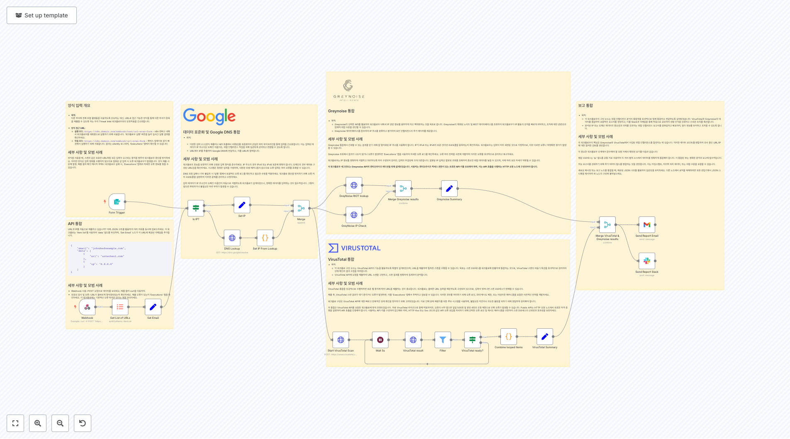](https://raw.githubusercontent.com/n8nKOR/n8n-shared-workflow/refs/heads/main/workflows/n8nworkflows/secops/1971.json)
**워크플로우 1971**
양식 입력 개요 - **목적**: 다른 부서에 전체 위협 플랫폼을 사용하도록 강요하는 대신, URL로 접근 가능한 양식을 통해 다른 부서가 항목을 제출할 수 있도록 하는 우리 Threat Intel 워크플로우와의 상호작용을 간소화합니다. - **양식 접근 URL**: - **실행 모드**: `https://n8n.domain.com/webhook/test/...

[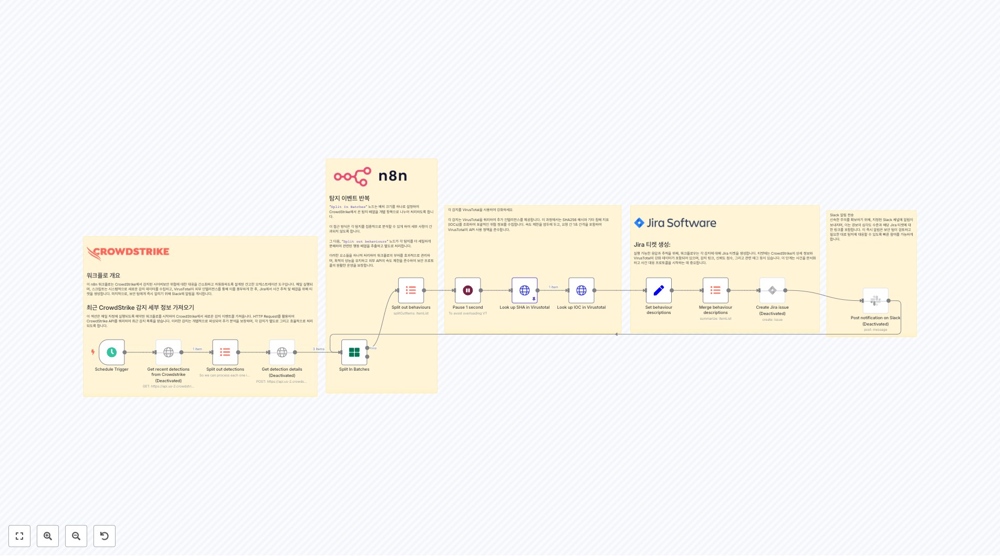](https://raw.githubusercontent.com/n8nKOR/n8n-shared-workflow/refs/heads/main/workflows/n8nworkflows/secops/1973.json)
**워크플로우 1973**
 워크플로 개요 이 n8n 워크플로는 CrowdStrike에서 감지된 사이버보안 위협에 대한 대응을 간소화하고 자동화하도록 설계된 견고한 오케스트레이션 도구입니다. 매일 실행되며, 스크립트는 시스템적으로 새로운 감지 데이터를 수집하고, VirusTotal의 외부 인텔리전스를...

**워크플로우 1974**
 워크플로 개요 이 n8n 워크플로는 Palo Alto의 피드에서 보안 권고를 가져와 귀하의 제품과 관련되지 않은 알림을 필터링하여 보안 감독을 간소화하도록 설계되었습니다. 동적 필터 시스템을 활용하여 관련되지 않은 권고를 제외하여 팀이 관련 보안 업데이트만 받을 수 있도록 합니다. 이메일...

[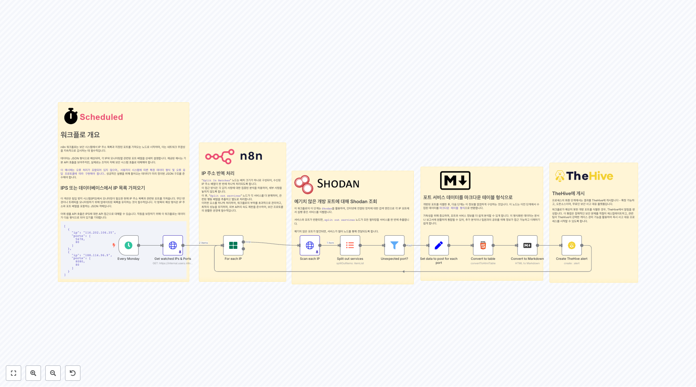](https://raw.githubusercontent.com/n8nKOR/n8n-shared-workflow/refs/heads/main/workflows/n8nworkflows/secops/1977.json)
**워크플로우 1977**
 포트 서비스 데이터를 마크다운 테이블 형식으로 개방된 포트를 식별한 후, 다음 단계는 이 정보를 깔끔하게 구성하는 것입니다. 이 노드는 이전 단계에서 수집된 데이터를 `마크다운 테이블 형식`으로 변환합니다. 가독성을 위해 중요하며, 포트와 서비스 정보를 더 쉽게 분석할 수 있게 합...

[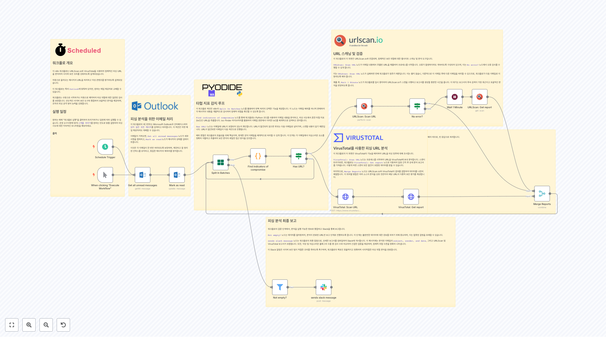](https://raw.githubusercontent.com/n8nKOR/n8n-shared-workflow/refs/heads/main/workflows/n8nworkflows/secops/1992.json)
**워크플로우 1992**
 워크플로 개요 이 n8n 워크플로는 URLScan.io와 VirusTotal을 사용하여 잠재적인 피싱 URL을 분석하여 사이버 보안 조치를 강화하도록 설계되었습니다. 자동으로 들어오는 메시지의 URL을 처리하고 악성 콘텐츠를 평가하도록 설계되었습니다. 이 워크플로는 특히 `Outlook`...

[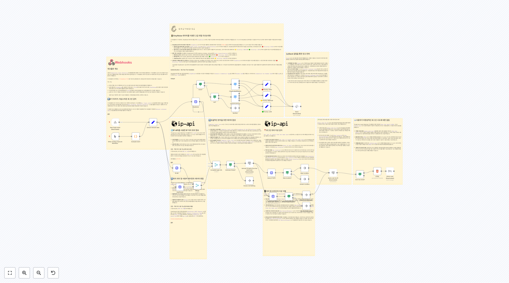](https://raw.githubusercontent.com/n8nKOR/n8n-shared-workflow/refs/heads/main/workflows/n8nworkflows/secops/1993.json)
**워크플로우 1993**
 🚦 GreyNoise 데이터를 이용한 고급 위협 우선순위화 이 워크플로의 이 섹션에서, GreyNoise 데이터의 통합, 특히 `GreyNoise` 노드에서, 위협 우선순위화 프로세스를 정제하는 데 중추적인 역할을 합니다. 이 노드의 GreyNoise 상호작용은 각 알림이 I...

[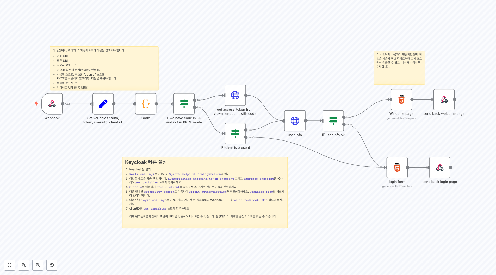](https://raw.githubusercontent.com/n8nKOR/n8n-shared-workflow/refs/heads/main/workflows/n8nworkflows/secops/1997.json)
**워크플로우 1997**
이 설정에서, 귀하의 ID 제공자로부터 다음을 검색해야 합니다: - 인증 URL - 토큰 URL - 사용자 정보 URL - 이 흐름을 위해 생성한 클라이언트 ID - 사용할 스코프, 최소한 "openid" 스코프 PKCE를 사용하지 않으려면, 다음을 채워야 합니다: - 클라이언트 시크릿 - 리디렉트 URI (웹훅 URI임)

[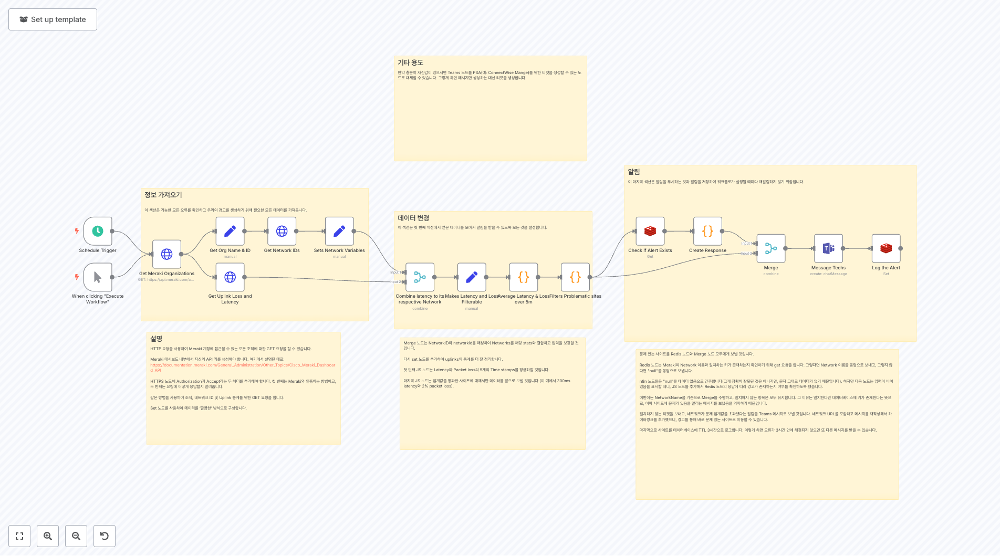](https://raw.githubusercontent.com/n8nKOR/n8n-shared-workflow/refs/heads/main/workflows/n8nworkflows/secops/2054.json)
**워크플로우 2054**
정보 가져오기 이 섹션은 가능한 모든 오류를 확인하고 우리의 경고를 생성하기 위해 필요한 모든 데이터를 가져옵니다.

**워크플로우 2420**
1. 사진 가져오기 및 검증 [Google Drive 사용에 대해 더 알아보기](https://docs.n8n.io/integrations/builtin/app-nodes/n8n-nodes-base.googledrive) 이번 데모에서, 5개의 서로 다른 초상화를 가져와 AI 비전 모델을 테스트하겠습니다. 편의를 위해 Google Drive를 사용할 테지만...

**워크플로우 2435**
여러 GitHub 리포지토리 모니터링 이 워크플로는 웹훅 사용으로 인해 폴링 없이 여러 GitHub 리포지토리를 동시에 모니터링할 수 있게 합니다. 또한 프로그래밍적으로 감시 목록에 리포지토리를 추가 및 삭제할 수 있게 하여 관리를 편리하게 합니다.

## 📋 워크플로우 목록 (11-20)

[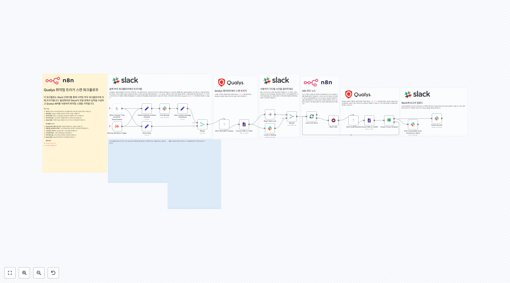](https://raw.githubusercontent.com/n8nKOR/n8n-shared-workflow/refs/heads/main/workflows/n8nworkflows/secops/2511.json)
**워크플로우 2511**
 Qualys 측에서 수행되는 쿼리에 대한 자세한 정보는 [스캔 관리 문서](https://qualysguard.qg2.apps.qualys.com/qwebhelp/fo_portal/api_doc/scans/index.htmt=vm_scans%2Fmanage_vm...

[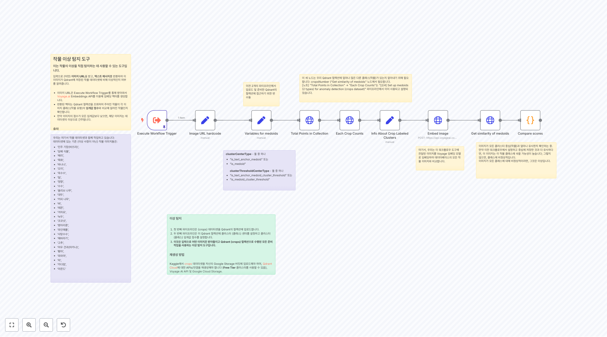](https://raw.githubusercontent.com/n8nKOR/n8n-shared-workflow/refs/heads/main/workflows/n8nworkflows/secops/2656.json)
**워크플로우 2656**
우리는 여기서 작물 데이터셋과 함께 작업하고 있습니다: 데이터셋에 있는 기존 (이상 사항이 아닌) 작물 이미지들은: - '진주 기장(바즈라)', - '담배 식물', - '체리', - '목화', - '바나나', - '오이', - '옥수수', - '밀', - '정향', - '수수', - '올리브 나무', - '대두', - '커피 나무', - '벼', - '레몬...

[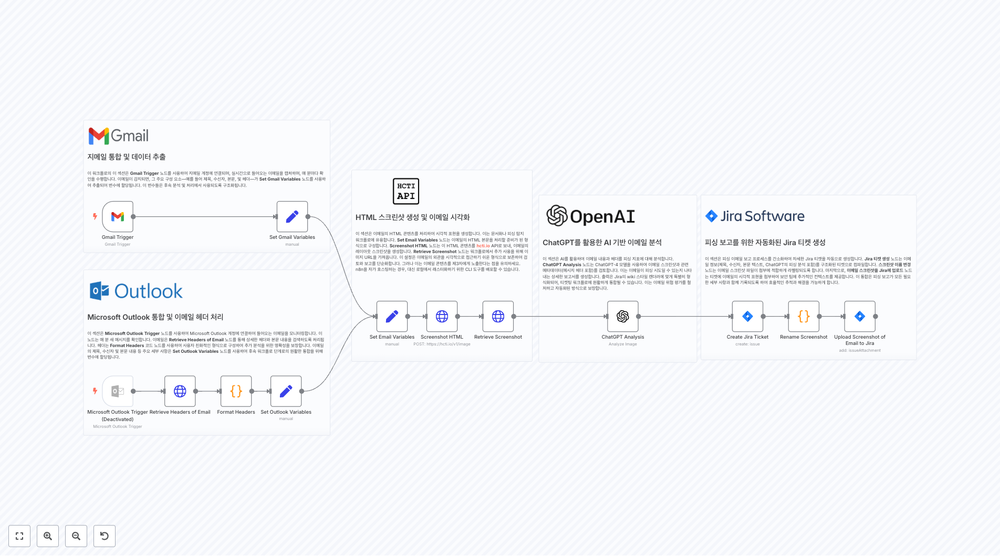](https://raw.githubusercontent.com/n8nKOR/n8n-shared-workflow/refs/heads/main/workflows/n8nworkflows/secops/2665.json)
**워크플로우 2665**
 지메일 통합 및 데이터 추출 이 워크플로의 이 섹션은 **Gmail Trigger** 노드를 사용하여 지메일 계정에 연결되며, 실시간으로 들어오는 이메일을 캡처하며, 매 분마다 확인을 수행합니다. 이메일이 감지되면, 그 주요 구성 요소—예를 들어 제목, 수신자, 본문...

[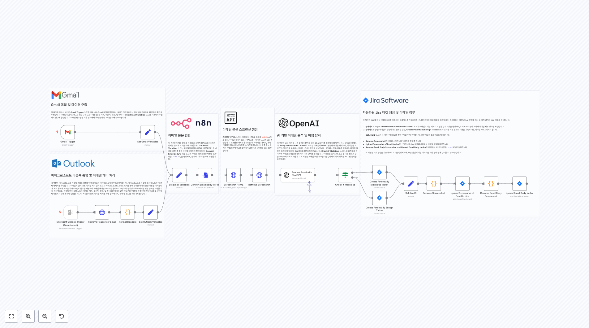](https://raw.githubusercontent.com/n8nKOR/n8n-shared-workflow/refs/heads/main/workflows/n8nworkflows/secops/2666.json)
**워크플로우 2666**
 이메일 본문 스크린샷 생성 **스크린샷 HTML** 노드는 이메일의 HTML 본문을 **hcti.io** API로 보내, 이메일 레이아웃을 시각적으로 나타내는 스크린샷을 생성합니다. **스크린샷 가져오기** 노드는 이 이미지를 가져와, 후속 단계에서 첨부...

[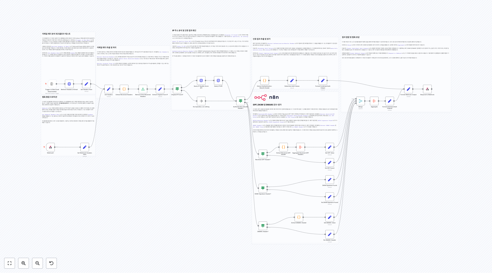](https://raw.githubusercontent.com/n8nKOR/n8n-shared-workflow/refs/heads/main/workflows/n8nworkflows/secops/2676.json)
**워크플로우 2676**
**이메일 헤더 분석 워크플로우 테스트** 이 워크플로우의 이 섹션은 설정이 타사 플랫폼용 API로 배포되기 전에 Outlook 이메일 클라이언트와 올바르게 작동하는지 확인하기 위한 테스트 목적으로 설계되었습니다. 프로세스는 `Trigger on New Email` 노드에서 시작되며, 이 노드는 Outlook 사서함의 지정된 폴더를 모니터링하고 새 이메일이...

[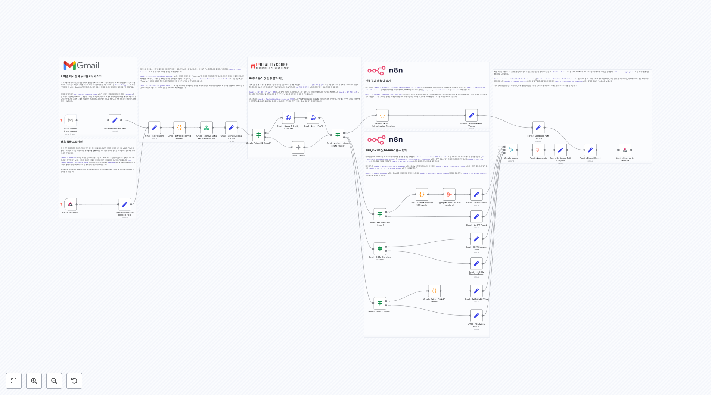](https://raw.githubusercontent.com/n8nKOR/n8n-shared-workflow/refs/heads/main/workflows/n8nworkflows/secops/2677.json)
**워크플로우 2677**
 **이메일 헤더 분석 워크플로우 테스트** 이 워크플로우의 이 섹션은 설정이 타사 플랫폼의 API로 배포되기 전에 귀하의 Gmail 이메일 클라이언트와 올바르게 작동하는지 확인하기 위한 테스트 목적으로 설계되었습니다. 프로세스는 `Gmail Trigger` 노드에서...

[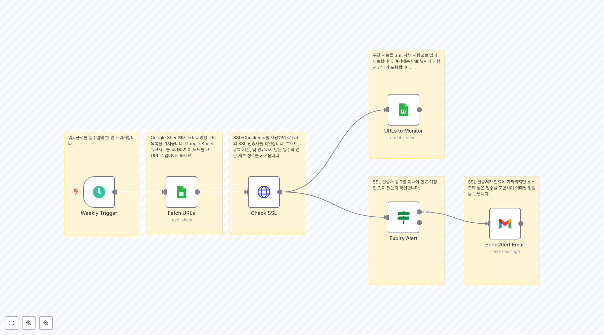](https://raw.githubusercontent.com/n8nKOR/n8n-shared-workflow/refs/heads/main/workflows/n8nworkflows/secops/2694.json)
**워크플로우 2694**
워크플로를 일주일에 한 번 트리거합니다.

[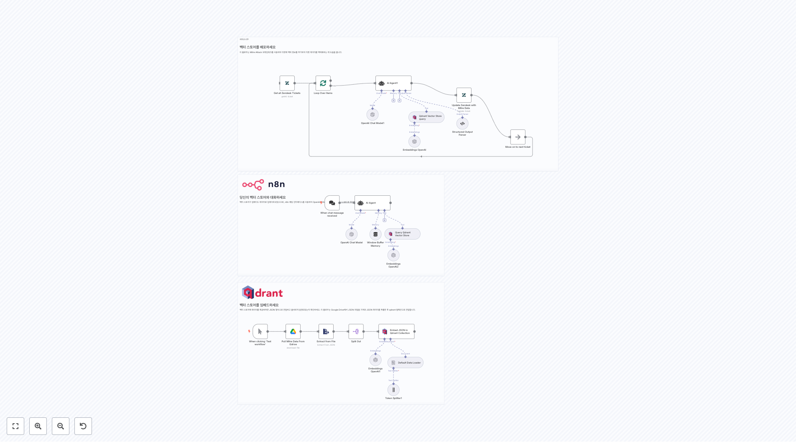](https://raw.githubusercontent.com/n8nKOR/n8n-shared-workflow/refs/heads/main/workflows/n8nworkflows/secops/2840.json)
**워크플로우 2840**
 벡터 스토어를 임베드하세요 벡터 스토어에 데이터를 제공하려면 JSON 형식으로 전달하고 올바르게 설정되었는지 확인하세요. 이 플로우는 Google Drive에서 JSON 파일을 가져와 JSON 데이터를 추출한 후 qdrant 컬렉션으로 전달합니다.

[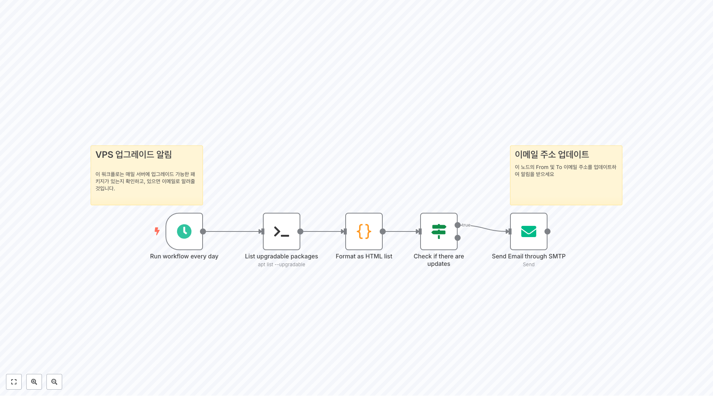](https://raw.githubusercontent.com/n8nKOR/n8n-shared-workflow/refs/heads/main/workflows/n8nworkflows/secops/2925.json)
**워크플로우 2925**
VPS 업그레이드 알림 이 워크플로는 매일 서버에 업그레이드 가능한 패키지가 있는지 확인하고, 있으면 이메일로 알려줄 것입니다.

[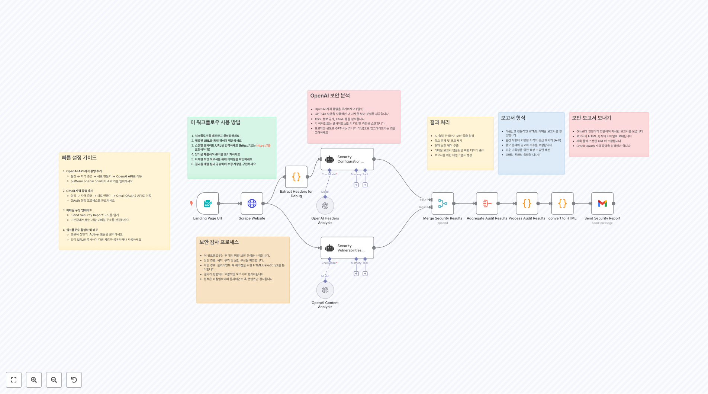](https://raw.githubusercontent.com/n8nKOR/n8n-shared-workflow/refs/heads/main/workflows/n8nworkflows/secops/3314.json)
**워크플로우 3314**
빠른 설정 가이드 1. **OpenAI API 자격 증명 추가** - 설정 → 자격 증명 → 새로 만들기 → OpenAI API로 이동 - platform.openai.com에서 API 키를 입력하세요 2. **Gmail 자격 증명 추가** - 설정 → 자격 증명 → 새로 만들기 → Gmail OAuth2 API로 이동 - OAuth 설정 프로세스를 완료하...

## 📋 워크플로우 목록 (21-21)

[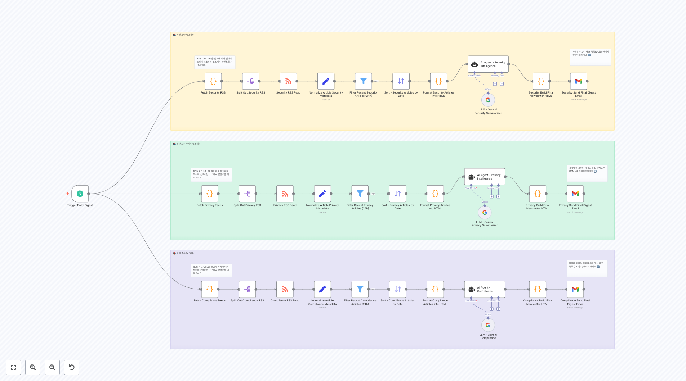](https://raw.githubusercontent.com/n8nKOR/n8n-shared-workflow/refs/heads/main/workflows/n8nworkflows/secops/4678.json)
**워크플로우 4678**
📬 매일 보안 뉴스레터

## 🔧 구현 가이드

### 워크플로우 사용 방법
1. 원하는 워크플로우의 JSON 링크를 클릭합니다.
2. n8n 인스턴스에서 'Import' 기능을 사용하여 워크플로우를 가져옵니다.
3. 필요한 자격 증명과 설정을 구성합니다.
4. 워크플로우를 테스트하고 필요에 따라 커스터마이즈합니다.

### 주의사항
- 각 워크플로우는 특정 서비스나 API의 자격 증명이 필요할 수 있습니다.
- 워크플로우를 실행하기 전에 모든 노드의 설정을 확인하세요.
- 테스트 환경에서 먼저 워크플로우를 검증한 후 프로덕션에 적용하세요.

---

💡 **총 21개의 워크플로우**가 이 카테고리에서 제공됩니다.
