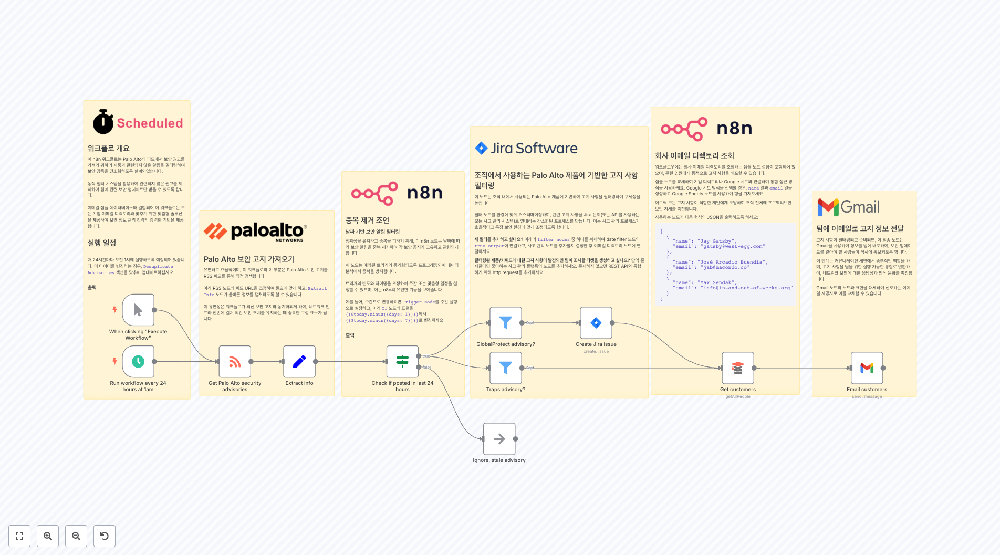

# SecOps Workflows

이 폴더에는 보안 운영(SecOps) 관련 n8n 워크플로우들이 포함되어 있습니다. 이 워크플로우들은 위협 탐지, 사고 대응, 보안 모니터링, 취약점 스캔 등 다양한 사이버보안 업무를 자동화합니다.

## 🔍 위협 인텔리전스 및 분석

**VirusTotal & Greynoise URL/IP 스캔 자동화**
URL과 IP 주소를 VirusTotal과 Greynoise API로 자동 스캔하여 위협 분석을 수행하고, 결과를 Slack과 이메일로 보고하는 종합적인 위협 인텔리전스 워크플로우입니다.

**CrowdStrike 위협 탐지 분석 및 티켓 생성**
CrowdStrike에서 새로운 위협 탐지를 자동으로 가져와 VirusTotal로 강화 분석한 후, Jira 티켓을 생성하고 Slack으로 보안팀에 알림을 발송합니다.

**MITRE ATT&CK 기반 SIEM 분석**
MITRE ATT&CK 프레임워크와 Qdrant 벡터 데이터베이스를 활용하여 SIEM 알림을 자동으로 분석하고, AI로 TTP(Tactics, Techniques, Procedures)를 매핑하여 Zendesk 티켓을 업데이트합니다.

**AI 기반 보안/프라이버시/컴플라이언스 뉴스 다이제스트**
RSS 피드에서 보안, 프라이버시, 컴플라이언스 관련 뉴스를 수집하고 AI로 분석하여 카테고리별로 요약된 뉴스레터를 자동 생성합니다.

## 🛡️ 사고 대응 및 포렌식

**피싱 이메일 탐지 및 자동 티켓 생성**
Gmail과 Outlook에서 수신된 이메일을 실시간으로 분석하여 피싱 의심 이메일을 탐지하고, ChatGPT로 분석한 후 Jira 티켓을 자동 생성합니다.

**AI 기반 여권 사진 유효성 검증**
Google Drive에서 여권 사진을 가져와 Google Gemini AI를 사용하여 UK 정부 기준에 따른 유효성을 자동 검증하는 신원 확인 워크플로우입니다.

## 🌐 네트워크 보안 모니터링

**Cisco Meraki 네트워크 상태 모니터링**
Cisco Meraki API를 통해 네트워크 지연시간과 패킷 손실을 실시간 모니터링하고, 임계값 초과 시 Microsoft Teams로 즉시 알림을 발송합니다.

## 🔐 취약점 스캔 및 평가

**AI 기반 웹사이트 보안 스캐너**
웹사이트의 보안 헤더, 설정, 클라이언트 사이드 취약점을 OpenAI를 활용하여 종합적으로 분석하고 상세한 보안 보고서를 이메일로 발송합니다.

## 📊 보안 운영 자동화

**보안 감사 및 컴플라이언스 체크**
정기적인 보안 감사를 자동화하고 컴플라이언스 요구사항 준수 여부를 확인하여 보안 담당자에게 보고합니다.

**자동화된 위협 헌팅**
다양한 보안 도구에서 수집된 로그와 이벤트를 분석하여 숨겨진 위협을 찾아내는 능동적 위협 헌팅 워크플로우입니다.

**보안 이벤트 상관분석 및 우선순위화**
여러 보안 솔루션에서 발생하는 이벤트들을 상관분석하여 실제 위협과 거짓 양성을 구분하고 우선순위를 매깁니다.

**침해지표(IOC) 수집 및 배포**
다양한 위협 인텔리전스 소스에서 IOC를 수집하고 검증한 후 보안 도구들에 자동으로 배포하여 탐지 규칙을 업데이트합니다.

**실시간 보안 대시보드 생성**
보안 메트릭과 KPI를 실시간으로 수집하여 경영진과 보안팀을 위한 대시보드를 자동으로 생성하고 업데이트합니다.

## 🔄 지속적 보안 모니터링

**중앙집중식 보안 로그 분석**
다양한 시스템과 애플리케이션의 보안 로그를 중앙에서 수집하고 분석하여 이상 행위를 탐지하고 알림을 발송합니다.

**특권 계정 접근 모니터링**
특권 계정의 로그인 및 활동을 실시간으로 모니터링하고, 비정상적인 접근 패턴을 탐지하여 보안팀에 즉시 알림합니다.

**데이터 유출 탐지 및 대응**
민감한 데이터의 무단 접근이나 유출 시도를 탐지하고 자동으로 차단 조치를 취하며 사고 대응팀에 알림을 발송합니다.

**보안 정책 준수 모니터링**
조직의 보안 정책 준수 여부를 자동으로 점검하고 위반 사항을 탐지하여 담당자에게 알림하고 시정조치를 요청합니다.

**자동 악성코드 분석 및 대응**
의심스러운 파일을 자동으로 샌드박스에서 분석하고 악성코드 여부를 판단하여 적절한 격리 및 제거 조치를 실행합니다.

**보안 인시던트 생명주기 관리**
보안 인시던트의 발생부터 해결까지 전체 생명주기를 자동으로 관리하고 각 단계별 담당자에게 적절한 알림을 발송합니다.

**취약점 스캔 및 패치 관리**
시스템과 애플리케이션의 취약점을 정기적으로 스캔하고 패치 우선순위를 결정하여 IT팀에 패치 일정을 자동으로 배정합니다.

**직원 보안 교육 및 피싱 테스트**
직원들을 대상으로 한 보안 인식 교육과 모의 피싱 테스트를 자동화하고 결과를 분석하여 추가 교육이 필요한 직원을 식별합니다.

---

## 🎯 주요 특징

- **21개의 보안 운영 워크플로우**: 위협 탐지부터 사고 대응까지 전 영역 커버
- **위협 인텔리전스 통합**: VirusTotal, Greynoise, CrowdStrike 등 주요 플랫폼 연동
- **AI 기반 분석**: OpenAI, Google Gemini를 활용한 지능형 위협 분석
- **MITRE ATT&CK 매핑**: 표준 프레임워크 기반 위협 분류 및 대응
- **자동 티켓팅**: Jira, Zendesk와 연동한 사고 관리 자동화
- **실시간 알림**: Slack, Teams, 이메일을 통한 즉시 알림
- **다중 플랫폼 지원**: 클라우드와 온프레미스 환경 모두 지원

## 📋 보안 운영별 사용 가이드

### 위협 탐지 및 분석
- **VirusTotal & Greynoise 스캐너**: 의심스러운 URL이나 IP 주소 즉시 분석
- **CrowdStrike 연동**: EDR 탐지 이벤트 자동 분석 및 대응
- **MITRE ATT&CK 매핑**: 공격 기법 자동 분류 및 맥락 정보 제공

### 사고 대응
- **피싱 이메일 탐지**: 의심 이메일 자동 분석 및 격리
- **보안 인시던트 관리**: 사고 발생부터 해결까지 전체 프로세스 자동화
- **침해지표 관리**: IOC 수집, 검증, 배포 자동화

### 보안 모니터링
- **네트워크 모니터링**: Cisco Meraki 장비 상태 실시간 감시
- **접근 제어**: 특권 계정 활동 모니터링
- **데이터 유출 방지**: 민감 데이터 접근 패턴 분석

### 취약점 관리
- **웹사이트 보안 스캔**: 웹 애플리케이션 보안 취약점 자동 진단
- **시스템 취약점 스캔**: 인프라 보안 상태 정기 점검
- **패치 관리**: 취약점 우선순위 기반 패치 일정 자동 생성

## 🔧 구현 가이드

### 1단계: 위협 인텔리전스 설정
- VirusTotal, Greynoise API 키 설정
- CrowdStrike API 연동 구성
- 기본 위협 탐지 워크플로우 활성화

### 2단계: 사고 대응 프로세스 구축
- Jira/Zendesk 티켓팅 시스템 연동
- Slack/Teams 알림 채널 설정
- 에스컬레이션 규칙 정의

### 3단계: 모니터링 대시보드 구성
- 보안 메트릭 수집 자동화
- 실시간 대시보드 생성
- 보고서 자동 생성 및 배포

### 4단계: 지속적 개선
- 워크플로우 성능 모니터링
- 거짓 양성 최소화 튜닝
- 새로운 위협에 대한 탐지 규칙 업데이트

## ⚠️ 보안 고려사항

- **API 키 관리**: 모든 API 키는 n8n 자격 증명 관리자에 안전하게 저장
- **데이터 암호화**: 전송 중 및 저장 중 데이터 암호화 적용
- **접근 제어**: 워크플로우 접근 권한을 최소한의 필요 인원으로 제한
- **로그 관리**: 모든 보안 활동에 대한 감사 로그 유지
- **정기 검토**: 워크플로우의 보안 설정 정기적 검토 및 업데이트

## 🔗 관련 자료

- [MITRE ATT&CK 프레임워크](https://attack.mitre.org/)
- [VirusTotal API 문서](https://developers.virustotal.com/)
- [CrowdStrike API 가이드](https://falcon.crowdstrike.com/documentation)
- [NIST 사이버보안 프레임워크](https://www.nist.gov/cyberframework)
- [n8n 보안 모범 사례](https://docs.n8n.io/security/)