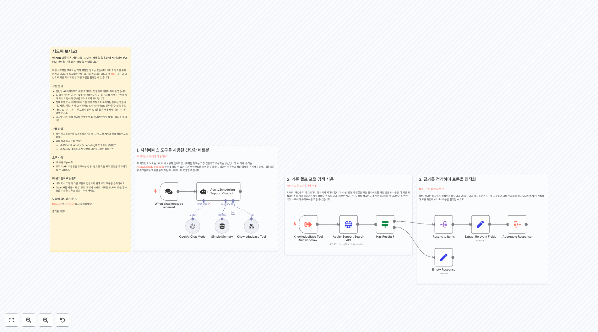

# 고객지원 워크플로우

이 폴더에는 support 관련 **41개의 워크플로우**가 포함되어 있습니다.

## 📋 워크플로우 목록

**워크플로우 1961**
Slack은 모든 메시지에 대해 Webhook에 POST를 보내기 때문에 봇 메시지를 필터링해야 합니다.

**워크플로우 2045**
**Config Bot**을 사용하여 Telegram 세부 사항을 설정하세요, 예를 들어: 1- Telegram 그룹 ID (봇을 관리자로 추가하는 것을 잊지 마세요) 2- Telegram 채널 ID (봇을 관리자로 추가하는 것을 잊지 마세요) 3- 귀하의 Telegram 봇 토큰 (@BotFather를 통해 생성하세요) 데이터 설정 및 필터 및 올바른 측...

**워크플로우 2095**
서브-워크플로우: 커스텀 도구 위의 에이전트가 이 워크플로우를 호출할 수 있습니다. 사용자가 이메일 주소를 제공했는지 확인합니다. 제공하지 않았으면 하나를 제공하도록 유도합니다. 제공했다면 고객 지원 채널에 도움을 요청하는 메시지를 보냅니다.

**워크플로우 2161**
WooCommerce 사용자 ID 찾기 사용자 ID는 과거 주문을 조회하기 위해 필요합니다.

**워크플로우 2237**
설정 **양식 생성 및 통합** - n8n 기본 양식을 사용하거나 Typeform와 같은 서비스를 사용하고 이를 통합할 수 있습니다. - 전화번호 필드 이름을 변경하면 "WhatsApp Business Cloud" 노드에서도 이를 변경해야 합니다. - 사람들이 전화번호를 다른 형식(예: 텍스트)으로 입력하도록 허용하면 추가 데이터 변환 노드를 추가해야 할 ...

**워크플로우 2272**
DROPCONTACT 250 배치 비동기적으로 1500/시간 요청 더블 클릭하여 나를 수정하세요. 가이드

**워크플로우 2323**
1. Slack 메시지 조회 [Slack Trigger에 대해 더 알아보기](https://docs.n8n.io/integrations/builtin/app-nodes/n8n-nodes-base.slack) Slack API 검색은 앱에서 찾을 수 있는 동일한 검색 구문을 사용합니다. 여기, 우리는 n8n-tickets라는 지정된 채널 내에서 티켓 이모지를...

**워크플로우 2346**
2단계. 들어오는 메시지 버퍼링 [Redis 사용에 대해 자세히 알아보기](https://docs.n8n.io/integrations/builtin/app-nodes/n8n-nodes-base.redis) * 새로운 메시지가 목록에 캡처됩니다. * X초 후, 이 목록의 새로운 복사본을 가져옵니다. * 목록의 마지막 메시지가 들어오는 메시지와 동일하면, 지난...

**워크플로우 2415**
특정 Notion DB 스키마에 대한 새 워크플로 버전 생성 Notion 데이터베이스 URL을 입력하고, 이 템플릿에 기반하여 해당 URL에 대한 AI Assistant 챗봇 워크플로를 얻습니다: https://n8n.io/workflows/2413-notion-knowledge-base-ai-assistant/ Notion 프로젝트: https://www...

**워크플로우 2434**
여기에서 목적지 폴더를 설정하세요

## 📋 워크플로우 목록 (11-20)

**워크플로우 2468**
1. 해결되지 않은 장기 JIRA 문제 검색 [JIRA 노드에 대해 자세히 알아보기](https://docs.n8n.io/integrations/builtin/app-nodes/n8n-nodes-base.jira) 이 데모에서, '장기' 문제를 7일 후에 여전히 해결되지 않은 문제로 정의하겠습니다. 자신의 기준에 맞게 조정하세요. 또한, Execute Wo...

**워크플로우 2547**
헤더의 API 키를 교체하세요, 2번째 시나리오의 웹훅을 사용하세요, 필요 시 설정을 변경하세요.

**워크플로우 2752**
1. 내부 정책 문서 다운로드 및 추출 [HTTP Request Tool에 대해 더 알아보기](https://docs.n8n.io/integrations/builtin/core-nodes/n8n-nodes-base.httprequest) 먼저, 내부 정책과 FAQ가 포함된 PDF 문서를 가져오세요. 이 문서들은 Internal Helpdesk Assista...

**워크플로우 2796**
 고객 찾기 이 워크플로의 이 부분은 고객 데이터베이스를 조회하여 고객이 발견되면 AI 에이전트에게 고객 세부 정보를 반환합니다. 발견되지 않으면 고객 세부 정보에 대해 NOT_FOUND를 반환합니다.

**워크플로우 2841**
번역된 텍스트가 없습니다. 입력 텍스트가 제공되지 않았습니다.

**워크플로우 2929**
번역할 텍스트가 입력되지 않았습니다.

**워크플로우 3300**
Google 스프레드시트에서 Google 캘린더 이벤트 자동 생성

**워크플로우 3379**
🟡 1단계 – WhatsApp 메시지 수신 새 WhatsApp 메시지를 감지합니다. 메시지가 train:으로 시작하면, 제품 훈련 흐름을 트리거합니다. 그렇지 않으면, 고객 지원 흐름으로 이동합니다. **WhatsApp Business Cloud 노드** : [여기](https://www.notion.so/automatisation/WHATSAPP-WORK...

**워크플로우 3427**
슬롯 가져오기

**워크플로우 3498**
1. 지식베이스 도구를 사용한 간단한 채트봇 [AI 에이전트에 대해 더 알아보기](https://docs.n8n.io/integrations/builtin/cluster-nodes/root-nodes/n8n-nodes-langchain.agent) AI 에이전트 노드는 n8n에서 사용자 친화적인 채트봇을 만드는 가장 간단하고 추천되는 방법입니다. 여기서, ...

## 📋 워크플로우 목록 (21-30)

**워크플로우 3694**
"약속 확인 보조자" 설명: 목적: 이 섹션은 약속 확인 보조자에 대한 구성을 포함하며, 이는 환자와의 예정된 약속을 확인하는 데 특화된 에이전트입니다. 사용 지침: 매주 평일(월요일부터 금요일) 오전 08:00에 Daily Trigger(일일 트리거)를 통해 자동으로 실행됩니다. 에이전트는 MCP Google Calendar를 사용하여 다음 날 예정된 모...

**워크플로우 3707**
아웃풋 섹션은 번역 결과만 포함해야 합니다. 입력 텍스트가 없으므로, 번역할 내용이 없습니다. 이는 시스템 지침에 따라 추가 텍스트 없이 처리됩니다.

**워크플로우 3763**
채팅 해보세요! 이 워크플로를 Telegram 봇으로 사용할 수 있거나, n8n의 인터페이스에서 이를 채팅하여 사용할 수 있습니다.

**워크플로우 3772**
2) 원하는 LLMs으로 변경

**워크플로우 3848**
왜 Milvus인가 비교와 사용자 피드백에 기반하여, **Milvus는 Supabase에 비해 더 우수한 성능과 확장성을 가진 벡터 데이터베이스 솔루션으로 간주되는 경우가 많습니다**, 특히 대규모 데이터셋, 고부하 벡터 검색 작업, 다국어 지원이 요구되는 demanding한 용도에 적합합니다. 요구사항 - [Zilliz](https://zilliz.com...

**워크플로우 3859**
단계별 설정 가이드 **이 AI 에이전트를 구동하는 기술—지속적으로 크롤링, 추출, 그리고 답변 생성—은 온라인 상태를 유지하기 위해 실제 운영 비용이 발생합니다.** **이것이 바로 워크플로가 활성 멤버십을 요구하는 이유로, 가격은 단 **월 29달러**입니다. 비슷한 AI 지원 플랫폼은 **월 150달러 – 500달러**를 청구하므로, 이 템플릿을 사용...

**워크플로우 3868**
1. 열린 티켓 가져오기 [스케줄드 트리거 노드에 대해 더 알아보기](https://docs.n8n.io/integrations/builtin/core-nodes/n8n-nodes-base.scheduletrigger) 우리는 스케줄드 트리거를 사용하여 JIRA 지원 큐에서 새로 열린 티켓을 적극적으로 확인할 수 있습니다. "중복 제거" 노드(즉, Mark...

**워크플로우 3903**
아무런 입력 텍스트가 제공되지 않았으므로, 번역할 내용이 없습니다.

**워크플로우 3912**
아웃바운드 리드 자격화 콜 워크플로

**워크플로우 3930**
1. 새 이메일 수신 새 이메일이 도착하면 우리의 워크플로가 트리거됩니다. 여기서 IF 노드를 사용하여 INBOX로 들어오는 이메일에 대해서만 자동화를 실행하도록 하며, SENT 폴더의 이메일은 제외합니다.

## 📋 워크플로우 목록 (31-40)

**워크플로우 3940**
✅ 시나리오 2 – 문서 업로드 및 임베딩 Telegram을 통해 보내진 문서를 다운로드하여 텍스트를 추출하고, 임베딩을 생성한 후 Supabase Vector Store에 삽입하는 흐름.

**워크플로우 3942**
JSON 파서 1. 텍스트 데이터를 최종 주문처럼 항목 이름, 수량, 그리고 테이블 이름을 JSON으로 변환합니다. 2. 데이터에 위의 내용이 포함되지 않으면 null을 반환합니다.

**워크플로우 4012**
작성자 에이전트 - Contentful의 모든 필드에 대한 작성에 집중합니다 - 입력과 출력에 대한 지정된 형식을 가집니다 - 에디터 에이전트로부터의 피드백 구현을 처리합니다

**워크플로우 4057**
✉️ 스티키 노트 2: 웹사이트 스크래핑, 이메일 생성 및 보내기 완전한 데이터를 가진 리드의 경우, Dumpling AI는 리드의 회사 웹사이트 콘텐츠를 스크래핑합니다. 이 콘텐츠는 스크래핑된 세부 사항과 결합되어 Set 노드를 사용하여 프롬프트로 구성됩니다. GPT-4o가 이 프롬프트를 처리하여 개인화된 콜드 이메일을 생성합니다. 이메일은 그 후 Gma...

**워크플로우 4402**
AI 챗봇 에이전트 전문가와 함께 InfraNodus 지식 그래프와 그 Graph RAG을 사용하여 관련 정보를 검색합니다. 사용자의 [InfraNodus graph](https://infranodus.com)를 AI 챗봇의 지식 기반으로 사용하세요. InfraNodus에 데이터를 업로드하여 별도의 지식 그래프를 생성한 후, 이를 에이전트의 도구로 연결하세...

**워크플로우 4484**
전문가 1 여기에 InfraNodus 그래프를 HTTP 노드를 통해 추가하세요. 그 이름을 `body.name` 필드에 사용하세요. 도구의 설명에서 이 전문가가 하는 일을 설명하세요. InfraNodus > Graph > Project Notes에서 자동 생성된 Graph RAG 요약을 사용할 수 있습니다. ](https://raw.githubusercontent.com/n8nKOR/n8n-shared-workflow/refs/heads/main/workflows/n8nworkflows/support/4485.json)
**워크플로우 4485**
AI 챗봇 에이전트와 전문가 InfraNodus 지식 그래프와 Graph RAG를 사용하여 관련 정보를 검색합니다. 자신의 [InfraNodus 그래프](https://infranodus.com)를 AI 챗봇의 지식 기반으로 사용하세요. 원하는 데이터를 InfraNodus에 업로드하여 별도의 지식 그래프를 생성한 후, 이를 에이전트의 도구로 연결하세요. 이...

**워크플로우 4494**
제 Airbnb Telegram 에이전트 워크플로우에 오신 것을 환영합니다! 이 워크플로우는 다음 순서를 가집니다: 1. **Telegram 트리거** - Telegram 사용자들로부터 들어오는 메시지(텍스트 또는 음성)를 수신합니다. 2. **텍스트 또는 음성 스위치** - 메시지 유형(텍스트 대 음성)에 따라 워크플로우를 라우팅합니다. 3. **음성 처...

**워크플로우 4526**
이 워크플로를 수동으로 실행하여 Google Docs 제품 문서를 MongoDB에 가져와 인덱싱하고, 벡터 임베딩을 사용하여 빠른 검색을 가능하게 하세요.

**워크플로우 4557**
자동 Gmail 라벨링 (OpenAI에 의해)

## 📋 워크플로우 목록 (41-41)

**워크플로우 4689**
이 워크플로를 수동으로 실행하여 Google Docs 제품 문서를 MongoDB에 가져와 색인화하고, 벡터 임베딩을 사용하여 빠른 검색을 가능하게 하세요.

## 🔧 구현 가이드

### 워크플로우 사용 방법
1. 원하는 워크플로우의 JSON 링크를 클릭합니다.
2. n8n 인스턴스에서 'Import' 기능을 사용하여 워크플로우를 가져옵니다.
3. 필요한 자격 증명과 설정을 구성합니다.
4. 워크플로우를 테스트하고 필요에 따라 커스터마이즈합니다.

### 주의사항
- 각 워크플로우는 특정 서비스나 API의 자격 증명이 필요할 수 있습니다.
- 워크플로우를 실행하기 전에 모든 노드의 설정을 확인하세요.
- 테스트 환경에서 먼저 워크플로우를 검증한 후 프로덕션에 적용하세요.

---

💡 **총 41개의 워크플로우**가 이 카테고리에서 제공됩니다.
