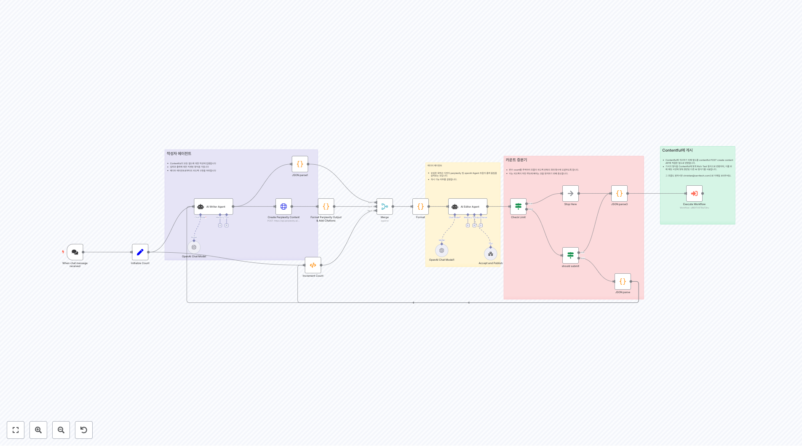

# Support 워크플로우

이 폴더에는 고객 지원, 헬프데스크 자동화, 티켓 관리, 서비스 자동화에 중점을 둔 **41개의 워크플로우**가 포함되어 있습니다.

## 🤖 AI 기반 고객 지원 에이전트

### 대화형 지원 시스템
[](4689.json)
**MongoDB 벡터 저장소 기반 지식 베이스 에이전트**
MongoDB 벡터 저장소와 RLHF 피드백을 사용하여 문서를 검색하고 사용자 질문에 답변하는 고급 AI 에이전트입니다. Google Docs에서 문서를 가져와 벡터 임베딩으로 인덱싱합니다.

[](4485.json)
**InfraNodus GraphRAG 지식 베이스 챗봇**
InfraNodus의 Graph RAG 기술을 사용하여 복잡한 지식 그래프에서 정보를 검색하고 상황에 맞는 응답을 제공하는 Telegram 기반 AI 챗봇입니다.

[](4484.json)
**ElevenLabs 음성 채팅 에이전트**
ElevenLabs의 음성 기술과 InfraNodus Graph RAG를 결합하여 음성 기반 상호작용을 제공하는 고급 AI 에이전트입니다.

[](4402.json)
**전문가 패널 기반 AI 챗봇**
여러 InfraNodus 그래프를 "전문가"로 활용하여 다양한 도메인의 질문에 답변할 수 있는 포괄적인 지원 시스템입니다.

[](4494.json)
**Airbnb 전문 Telegram 에이전트**
MCP(Modular Command Platform) 클라이언트를 사용하여 Airbnb 숙박 시설 검색과 예약을 도와주는 특화된 AI 에이전트입니다.

### 플랫폼별 지원 도구
[](3859.json)
**WhatsApp 비즈니스 AI 어시스턴트**
웹사이트 크롤링과 의미론적 검색을 통해 실시간으로 고객 질문에 답변하는 WhatsApp 기반 지원 시스템입니다. 24시간 대화 윈도우 관리 기능을 포함합니다.

[](3848.json)
**Milvus 벡터 저장소 RAG 에이전트**
Milvus 벡터 데이터베이스와 Cohere 임베딩을 사용하여 Google Drive 문서에서 정보를 검색하고 정확한 답변을 제공하는 RAG 시스템입니다.

[](3940.json)
**Telegram + Supabase AI 문서 어시스턴트**
Supabase 벡터 저장소를 사용하여 PDF 문서와 대화할 수 있는 Telegram 기반 AI 어시스턴트입니다. Google Gemini와 날씨 정보 도구를 통합합니다.

### 전문 분야별 에이전트
[](3694.json)
**의료 클리닉 내부 어시스턴트**
Google Calendar와 WhatsApp을 연동하여 환자 예약 관리, 재예약, 알림 발송을 자동화하는 의료 분야 전문 어시스턴트입니다.

[](4526.json)
**간단한 MongoDB 지식 베이스 에이전트**
기본적인 MongoDB 벡터 검색과 메모리 기능을 갖춘 간소화된 지식 베이스 시스템입니다.

[](3707.json)
**소상공인용 WhatsApp AI 어시스턴트**
Groq 모델을 사용하여 소규모 비즈니스의 고객 문의를 처리하는 간단하고 효율적인 WhatsApp 기반 지원 도구입니다.

## 📧 이메일 자동화 및 분류

### Gmail 자동화
[](4557.json)
**OpenAI 기반 Gmail 자동 라벨링**
OpenAI를 사용하여 수신 이메일을 자동으로 분류하고 적절한 라벨을 적용하는 Gmail 관리 도구입니다. 2분마다 새 이메일을 확인합니다.

[](4057.json)
**GPT-4o & LangChain 이메일 자동 응답**
Dumpling AI와 LangChain을 사용하여 고객 문의를 자동으로 분류하고 적절한 응답을 생성하는 지능형 이메일 처리 시스템입니다.

[](3772.json)
**Google Gemini 이메일 분류**
Google Gemini를 사용하여 이메일을 우선순위, 업무 관련, 프로모션 등으로 자동 분류하는 시스템입니다.

### 고급 이메일 처리
[](3763.json)
**의미론적 & 구조적 RAG 이메일 챗봇**
Pgvector를 사용한 의미론적 검색과 SQL 쿼리를 결합하여 이메일 데이터베이스에서 복잡한 질문에 답변하는 고급 시스템입니다.

[](3930.json)
**Gmail & Telegram 자동화**
Gmail의 새 이메일을 모니터링하고 응답이 필요한 이메일을 Telegram으로 알림을 보내는 통합 시스템입니다.

## 🎫 티켓 관리 및 지원 시스템

### JIRA 통합
[](3868.png)
**AI 기반 JIRA 티켓 분류 및 우선순위 설정**
OpenAI를 사용하여 JIRA 티켓을 자동으로 분류, 라벨링, 우선순위 설정 및 내용 재작성을 수행하는 자동화 시스템입니다.

[](2468.png)
**JIRA 지원 티켓 자동화**
비활성 티켓의 자동 알림, 클로즈, 댓글 관리를 통해 JIRA 워크플로우를 최적화하는 포괄적인 자동화 솔루션입니다.

### Slack & Linear 통합
[](2323.png)
**Slack to Linear AI 티켓 생성**
Slack 채널의 이모지 태그된 메시지를 모니터링하고 AI로 분석하여 Linear에 구조화된 지원 티켓을 자동 생성합니다.

[](1961.png)
**Slack AI 어시스턴트**
SerpAPI 통합과 메모리 기능을 갖춘 Slack 기반 AI 어시스턴트로, 실시간 검색과 상황 인식 대화를 제공합니다.

### Telegram 지원 시스템
[](2045.png)
**Telegram 지원 티켓 시스템 (Livegram Bot)**
Redis를 사용하여 Telegram 사용자와 지원팀 간의 티켓 기반 대화를 관리하는 포괄적인 고객 지원 플랫폼입니다.

## 📚 지식 베이스 및 문서 관리

[](4012.json)
**AI 기반 지식 베이스 문서 자동 생성**
Perplexity AI 연구와 OpenAI 에이전트를 사용하여 고품질의 지식 베이스 문서를 자동으로 생성하고 편집하는 시스템입니다.

[](3903.json)
**PostgreSQL MCP 서버**
PostgreSQL 데이터베이스와 상호작용할 수 있는 MCP(Model Context Protocol) 서버로, AI 에이전트가 데이터베이스 작업을 수행할 수 있게 해줍니다.

[](2415.json)
**Notion 데이터베이스 AI 어시스턴트 생성기**
Notion 데이터베이스 URL을 기반으로 맞춤형 AI 어시스턴트 워크플로우를 자동 생성하는 메타-워크플로우입니다.

[](2434.json)
**AI 기반 문서화 및 Q&A 생성**
Google Sheets 데이터를 기반으로 AI가 질문과 답변을 생성하여 포괄적인 문서화 시스템을 구축합니다.

## 📞 전화 및 음성 지원

[](3912.jpg)
**RetellAI 리드 자격화 전화 에이전트**
인바운드 및 아웃바운드 콜을 처리하여 리드를 자격화하고 Google Sheets와 연동하여 고객 정보를 관리하는 AI 전화 에이전트입니다.

[](2547.png)
**AssemblyAI 음성 전사 및 분석**
AssemblyAI를 사용하여 오디오 파일을 전사하고 OpenAI로 통화 내용을 분석하는 종합적인 음성 처리 시스템입니다.

## 🛍️ 주문 처리 및 비즈니스 자동화

[](3942.png)
**레스토랑 주문 처리 시스템**
자연어 주문을 파싱하여 Google Sheets에 구조화된 데이터로 저장하는 Information Extractor 기반 시스템입니다.

[](2237.json)
**WhatsApp & Asana 고객 서비스 자동화**
n8n 폼 제출을 WhatsApp 확인 메시지와 Asana 티켓 생성으로 연결하는 간단한 고객 서비스 워크플로우입니다.

[](2161.json)
**WooCommerce 고객 주문 추적**
이메일을 기반으로 WooCommerce 고객을 찾고 주문 이력과 DHL 배송 추적 정보를 제공하는 종합적인 주문 관리 시스템입니다.

## 🔧 데이터 처리 및 분석

[](2346.png)
**Redis 기반 SMS 대화 디바운서**
Redis를 사용하여 SMS 메시지를 버퍼링하고 연속된 메시지를 그룹화하여 처리하는 지능형 대화 관리 시스템입니다.

[](2272.png)
**Dropcontact 대량 이메일 처리**
PostgreSQL 데이터베이스에서 연락처를 추출하고 Dropcontact API를 사용하여 이메일 주소를 대량으로 검증하고 보강하는 시스템입니다.

## 🚀 구현 가이드

### 1. AI 모델 설정
```javascript
// OpenAI 설정 예시
const openAiConfig = {
  model: "gpt-4o-mini",
  temperature: 0.7,
  maxTokens: 1000
};
```

### 2. 벡터 저장소 연동
- **MongoDB Atlas**: 벡터 검색과 메타데이터 필터링
- **Supabase**: pgvector 확장을 통한 의미론적 검색
- **Milvus**: 고성능 벡터 데이터베이스

### 3. 메모리 관리
```javascript
// 세션 기반 메모리 설정
const memoryConfig = {
  sessionKey: "user_" + userId,
  contextWindowLength: 10
};
```

## 🔒 보안 고려사항

### API 키 관리
- 환경 변수를 통한 안전한 자격 증명 저장
- 정기적인 API 키 로테이션
- 최소 권한 원칙 적용

### 데이터 보호
- 고객 데이터 암호화
- GDPR 및 개인정보보호 규정 준수
- 접근 로그 및 감사 추적

### 플랫폼 보안
- Webhook URL 검증
- 요청 속도 제한 구현
- 입력 데이터 검증 및 삭제

## ⚡ 성능 최적화

### 응답 시간 최적화
- 벡터 검색 인덱스 최적화
- 캐싱 전략 구현
- 병렬 처리 활용

### 확장성 전략
- 로드 밸런싱
- 데이터베이스 샤딩
- 마이크로서비스 아키텍처

### 리소스 관리
- AI 모델 호출 최적화
- 배치 처리 구현
- 메모리 사용량 모니터링

## 🌐 주요 통합 서비스

### 메시징 플랫폼
- **Telegram**: 봇 API와 웹훅
- **WhatsApp Business**: 클라우드 API
- **Slack**: 앱 통합과 이벤트 API

### 작업 관리
- **JIRA**: 이슈 추적과 자동화
- **Linear**: 모던 이슈 관리
- **Asana**: 팀 협업과 프로젝트 관리

### AI 및 ML 서비스
- **OpenAI**: GPT 모델과 임베딩
- **Google Gemini**: 멀티모달 AI
- **Anthropic Claude**: 고급 추론 능력

## 📖 관련 자료

### 문서
- [n8n AI 노드 가이드](https://docs.n8n.io/integrations/builtin/cluster-nodes/)
- [LangChain 통합](https://docs.n8n.io/integrations/builtin/cluster-nodes/sub-nodes/n8n-nodes-langchain.agent/)
- [벡터 데이터베이스 설정](https://docs.n8n.io/integrations/builtin/cluster-nodes/sub-nodes/)

### 커뮤니티
- [n8n Discord](https://discord.gg/n8n)
- [커뮤니티 포럼](https://community.n8n.io/)
- [GitHub 저장소](https://github.com/n8n-io/n8n)

### 예제 프로젝트
- [RAG 구현 가이드](https://n8n.io/blog/rag-implementation/)
- [Telegram 봇 튜토리얼](https://n8n.io/blog/telegram-bot/)
- [고객 지원 자동화](https://n8n.io/blog/customer-support-automation/)

## 🎯 사용 사례

### 중소기업
- 24/7 고객 지원 자동화
- 주문 처리 및 추적
- FAQ 자동 응답

### 대기업
- 멀티채널 지원 통합
- 고급 티켓 관리
- 성능 분석 및 보고

### SaaS 플랫폼
- 사용자 온보딩 지원
- 기술 지원 자동화
- 피드백 수집 및 분석

이 워크플로우들은 현대적인 고객 지원의 모든 측면을 다루며, AI 기술을 활용하여 효율성과 고객 만족도를 크게 향상시킬 수 있습니다.